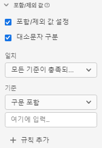

# 포함/제외 값 구성 요소 설정 {#include-exclude-values-component-settings}

<!-- markdownlint-disable MD034 -->

>[!CONTEXTUALHELP]
>id="dataview_component_metric_includeexcludevalues"
>title="포함/제외 값"
>abstract="특정 기준과 일치하는 값만 계산하도록 지표를 필터링합니다."

<!-- markdownlint-enable MD034 -->

<!-- markdownlint-disable MD034 -->

>[!CONTEXTUALHELP]
>id="dataview_component_dimension_includeexcludevalues"
>title="포함/제외 값"
>abstract="특정 기준과 일치하는 값만 포함하도록 차원을 좁힙니다. 보고서에서 할당 및 세분화 전에 포함 및 제외가 발생합니다. 지정된 세그먼트 논리가 대소문자를 구분하는지 확인합니다."

<!-- markdownlint-enable MD034 -->

포함/제외를 사용하여 차원 항목의 값에 의존하는 규칙을 만들 수 있습니다. 설정된 기준을 충족하지 않는 값은 Analysis Workspace에서는 존재하지 않은 것처럼 처리되지만 데이터는 여전히 기본 데이터 세트에 존재합니다.

| 설정 | 설명/사용 사례 |
| --- | --- |
| [!UICONTROL 포함/제외 값 설정] | 확인란을 통해 데이터 보기에 데이터를 포함하는 조건을 활성화할 수 있습니다. |
| [!UICONTROL 대소문자 구분] | 문자열 스키마 데이터 유형에 표시됩니다. 기본값은 on입니다. 이 설정은 결과 값이 아니라 [!UICONTROL 포함/제외 값] 논리에만 적용됩니다. 이를 통해 규칙의 대/소문자 구분 여부를 지정할 수 있습니다. |
| [!UICONTROL 일치] | 속성 및 세그먼트 이전에 보고를 위해 고려할 값(예: “오류” 구문을 포함하는 값만 사용)을 지정할 수 있습니다. **[!UICONTROL 모든 기준이 충족되는 경우]** 또는 **[!UICONTROL 임의의 기준이 충족되는 경우]**&#x200B;를 지정할 수 있습니다. 각 값을 공백으로 구분합니다. |
| [!UICONTROL 기준] | 특정 세그먼트 규칙에 적용해야 하는 일치 논리를 지정할 수 있습니다.<ul><li>**문자열**: [!UICONTROL 구문 포함], [!UICONTROL 임의의 용어 포함], [!UICONTROL 모든 용어 포함], [!UICONTROL 임의의 용어 포함 안 함], [!UICONTROL 구문 포함 안 함], [!UICONTROL 같음], [!UICONTROL 같지 않음], [!UICONTROL 다음으로 시작], [!UICONTROL 다음으로 끝남]</li><li>**실수/정수**: [!UICONTROL 같음], [!UICONTROL 같지 않음], [!UICONTROL 보다 큼], [!UICONTROL 보다 작음], [!UICONTROL 크거나 같음], [!UICONTROL 작거나 같음]</li><li>**날짜**: [!UICONTROL 같음], [!UICONTROL 같지 않음], [!UICONTROL 보다 늦음], [!UICONTROL 이전], [!UICONTROL 다음 내에서 발생]</li></ul> |
| [!UICONTROL 일치 피연산자] | 일치 연산자를 적용해야 하는 일치 피연산자를 지정할 수 있습니다.<ul><li>**문자열**: 텍스트 필드</li><li>**실수/정수**: 숫자 값에 대한 위쪽/아래쪽 화살표가 있는 텍스트 필드</li><li>**날짜**: 일 세부 기간 선택기 (달력)</li><li>**날짜 시간**: 날짜 및 시간 세부 기간 선택기</li></ul> |
| [!UICONTROL 규칙 추가] | 추가 일치 연산자 및 피연산자를 지정할 수 있습니다. |

{style="table-layout:auto"}
