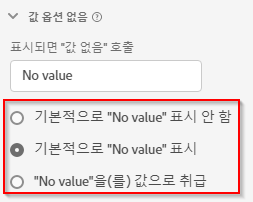

# 값 옵션 없음 구성 요소 설정

값 옵션 없음을 통해 Analysis Workspace에서 데이터 세트의 이벤트에는 지표가 포함되지만 차원에는 값이 포함되지 않은 상황을 처리하는 방법을 결정할 수 있습니다. 이 차원 항목의 이름을 선택하고 완전히 숨기거나 실제 값으로 처리할 수도 있습니다.

## 설정 {#settings}

| 설정 | 설명 |
| --- | --- |
| [!UICONTROL 표시되면 “값 없음” 호출] | 텍스트 필드를 통해 **[!UICONTROL 값 없음]** 차원 항목의 이름을 다른 이름으로 바꿀 수 있습니다. |
| [!UICONTROL 기본적으로 값 없음을 표시하지 않음] | 보고 시 이 값을 표시하지 않습니다. 이 차원에 귀속되지 않는 지표 발생 횟수는 보고서에 표시되지 않습니다. |
| [!UICONTROL 기본적으로 값 없음을 표시] | 보고 시 이 값을 표시합니다. |
| [!UICONTROL 값 없음을 값으로 처리] | 데이터의 빈 값을 [!UICONTROL 표시되면 “값 없음 호출”]에 지정한 텍스트로 대체합니다. 예를 들어 모바일 디바이스 유형이 차원으로 있는 경우 **[!UICONTROL 값 없음]** 항목의 이름을 “데스크탑”으로 바꿀 수 있습니다. 이 필드를 사용자 지정 값으로 변경하면 해당 사용자 지정 값은 적합한 문자열 값으로 처리됩니다. 따라서 이 필드에 값 “빨간색”을 입력하면 데이터 자체에 나타나는 문자열 “빨간색”의 인스턴스도 사용자가 지정한 동일한 라인 항목 아래로 롤링됩니다. |

{style="table-layout:auto"}

## 블로그 게시물

다음에 대한 관련 블로그 게시물 [Customer Journey Analytics에서 &quot;값 없음&quot; 처리](https://experienceleaguecommunities.adobe.com/t5/adobe-analytics-blogs/handling-quot-no-value-quot-in-customer-journey-analytics/ba-p/597339).
