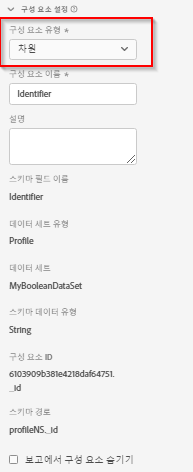

# 구성 요소 설정

다음 정보는 데이터 보기 구성 요소가 사용하는 설정에 대해 설명합니다.

| 설정 | 설명/사용 사례 |
| --- | --- |
| [!UICONTROL 구성 요소 유형] | 필수 여부. 구성 요소를 지표에서 Dimension 또는 그 반대로 변경할 수 있습니다. 이 드롭다운 선택을 변경하면 구성 요소는 해당 포함된 구성 요소 영역으로 전환됩니다. |
| [!UICONTROL 구성 요소 이름] | 필수 여부. Analysis Workspace에 표시되는 이름을 지정할 수 있습니다. 구성 요소의 이름을 변경하여 데이터 보기에 특정된 이름을 지정할 수 있습니다. |
| [!UICONTROL 설명] | 선택 사항이지만 권장됨. 다른 사용자에게 구성 요소에 대한 정보를 제공합니다. |
| [!UICONTROL 태그] | 선택 사항. Analysis Workspace UI에서 보다 쉽게 검색/필터링할 수 있도록 사용자 정의 태그 또는 즉시 사용 가능한 태그로 구성 요소에 태그를 지정할 수 있습니다. |
| [!UICONTROL 컨텍스트 레이블] | 선택 사항. 구성 요소에 적용할 수 있는 시스템 정의 레이블의 드롭다운 목록입니다. 이러한 레이블은 Analysis Workspace 프로젝트 또는 패널에서 보고에 사용되는 구성 요소 집합을 정의하는 데 필요할 수 있습니다. |
| [!UICONTROL 스키마 필드 이름] | 스키마 필드의 이름. |
| [!UICONTROL 데이터 세트 유형] | 필수 여부. 구성 요소의 원본 데이터 세트 유형(이벤트, 조회 또는 프로필)을 표시하는 편집 불가능한 필드입니다. |
| [!UICONTROL 데이터 세트] | 구성 요소의 원본 데이터 세트를 표시하는 편집 불가능한 필드입니다. 이 필드에는 여러 개의 데이터 세트가 포함될 수 있습니다. |
| [!UICONTROL 스키마 유형] | 구성 요소의 데이터 유형을 표시하는 편집 불가능한 필드입니다. 플랫폼에서 지원되는 모든 스키마 필드 유형을 사용할 수 있지만 모든 필드 유형이 Customer Journey Analytics에서 지원되는 것은 아닙니다. 지원되는 데이터 유형은 `Integer`, `Int`, `Long`, `Double`, `Float`, `Number`, `Short`, `Byte`, `String`, `Boolean`입니다. 만 `String` 스키마 데이터 유형은 현재 조회 데이터 세트에서 허용됩니다. |
| [!UICONTROL 구성 요소 ID] | 필수 여부. 다음 [CUSTOMER JOURNEY ANALYTICS API](https://adobe.io/cja-apis/docs) 이 필드를 사용하여 구성 요소를 참조합니다. 데이터 보기의 각 구성 요소는 고유해야 합니다. Adobe는 각 구성 요소의 ID를 자동으로 생성합니다. 그러나 편집 아이콘을 클릭하고 구성 요소 ID를 수정할 수 있습니다. 이 구성 요소 ID를 변경하면 이 구성 요소가 포함된 기존의 모든 Workspace 프로젝트가 중단됩니다. 각 구성 요소는 단일 데이터 보기에서 고유 ID가 필요하지만 다른 데이터 보기에서는 동일한 구성 요소 ID를 사용할 수 있습니다. 다른 데이터 보기에서 동일한 구성 요소 ID를 사용하는 경우 Workspace 프로젝트를 데이터 보기 간에 호환되도록 할 수 있습니다.  프로필 및 조회 기반 구성 요소의 경우 구성 요소 ID에 데이터 세트 ID를 기반으로 하는 ID 접두사가 있습니다(예: `642b28fcc1f0ee1c074265a0.person.name.firstName`). 다음과 같은 프로필 또는 조회 기반 구성 요소를 재사용하려는 경우 `person.name.firstName`작업 영역 프로젝트에서 이 구성 요소를 다른 데이터 보기에서 구성한 경우 구성 요소 ID의 이름을 고유하게 바꾸십시오(예: `myUniqueID.person.name.firstName`)을 클릭하여 제품에서 사용할 수 있습니다. |
| [!UICONTROL 경로] | 필수 여부. 구성 요소의 원본 스키마 경로를 표시하는 편집 불가능한 필드입니다. |
| [!UICONTROL 데이터 사용 레이블] | Adobe Experience Platform에서 이 구성 요소에 할당된 데이터 사용 레이블. [자세히 알아보기](/help/data-views/data-governance.md). |
| [!UICONTROL 보고에서 구성 요소 숨기기] | 관리자가 아닌 경우 데이터 보기에서 구성 요소를 큐레이션할 수 있습니다. 관리자는 여전히 Analysis Workspace 프로젝트에서 [!UICONTROL 모든 구성 요소 표시]를 클릭하여 액세스할 수 있습니다. |

{style="table-layout:auto"}

다음은 데이터 보기의 구성 요소 설정에 대한 비디오입니다.

>[!VIDEO](https://video.tv.adobe.com/v/333112/?quality=12)
