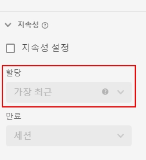

# [!UICONTROL 지속성] 구성 요소 설정 {#persistence-component-settings}

<!-- markdownlint-disable MD034 -->

>[!CONTEXTUALHELP]
>id="dataview_component_dimension_persistence"
>title="지속성"
>abstract="차원에 적용되는 기본 배분 모델을 구성합니다. 할당은 보고의 세그먼트 전에 적용됩니다. 자세한 내용은 [할당 설정](/help/data-views/component-settings/persistence.md#allocation-settings), [만료 설정](/help/data-views/component-settings/persistence.md#expiration-settings), [바인딩 차원](/help/data-views/component-settings/persistence.md#binding-dimension) 및 [바인딩 지표](/help/data-views/component-settings/persistence.md#binding-metric)를 참조하십시오."

<!-- markdownlint-enable MD034 -->

[!UICONTROL 지속성]은 특정 차원 값을 설정된 이벤트에서 벗어난 지표와 연결할 수 있습니다. 지속성은 할당과 만료의 조합입니다.

* 하나의 열에서 한 번에 두 개 이상의 차원 항목이 지속되는 경우 **할당** 설정을 통해 보존되는 값을 결정할 수 있습니다.

  >[!NOTE]
  >
  >보고서에서 지표에 [비기본 속성 모델](/help/data-views/component-settings/attribution.md)이 설정된 경우, 해당 속성 모델은 동일한 보고서에 대해 차원에서 설정한 할당을 무시합니다.
  >
  >그러나 여러 차원을 포함하는 [전체 테이블 내보내기](/help/analysis-workspace/export/export-cloud.md)를 수행할 때 속성은 각 차원에 적용된 할당 모델을 유지합니다.

* **만료** 설정을 통해 설정된 이벤트에서 벗어난 차원 항목의 지속 기간을 결정할 수 있습니다.

[!UICONTROL 지속성]은 차원에서만 사용할 수 있고 적용 대상 데이터에 대해 소급적입니다. 이는 세그먼트화나 다른 분석 작업이 적용되기 전에 발생하는 즉각적인 데이터 변환입니다.

| 설정 | 설명 |
| --- | --- |
| [!UICONTROL 지속성 설정] | 차원에 대한 지속성 설정을 활성화합니다. 지속성 설정이 활성화되지 않으면 차원은 동일한 이벤트에 존재하는 지표에만 관련됩니다. 이 설정은 기본적으로 비활성화되어 있습니다. |
| [!UICONTROL 할당] | 지속성을 위해 차원에 사용되는 배분 모델을 지정할 수 있습니다. 사용 가능한 옵션은 다음과 같습니다.<ul><li>**[!UICONTROL 가장 최근]**: 차원 값이 후속 값으로 덮어쓸 때까지 유지됩니다.</li><li> **[!UICONTROL 원본]**: 이 차원의 첫 번째 값이 유지되며 후속 값으로 덮어쓰지 않습니다.</li><li>**[!UICONTROL 모두]**: 이 차원의 모든 값이 동시에 유지됩니다.</li><li>**[!UICONTROL 처음 알려짐]**: 이 차원의 첫 번째 값이 사용되며, 그 전후의 모든 이벤트에 적용됩니다.</li><li>**[!UICONTROL 마지막 알려짐]**: 이 차원의 마지막 값이 사용되며, 그 전후의 모든 이벤트에 적용됩니다.</li></ul> |
| [!UICONTROL 만료] | 차원에 대한 지속성 기간을 지정할 수 있습니다. 사용 가능한 옵션은 다음과 같습니다. <ul><li>**[!UICONTROL 세션]**(기본값)</li><li>**[!UICONTROL 개인]**</li><li>**[!UICONTROL 사용자 정의 시간]**</li><li>**[!UICONTROL 지표]**</li></ul>. 내부 검색어 또는 기타 머천다이징 사용 사례와 같이 구매 시 차원을 만료해야 할 수도 있습니다. 설정할 수 있는 최대 만료 시간은 90일입니다. [!UICONTROL 모두] 할당을 선택하면 [!UICONTROL 세션] 또는 [!UICONTROL 개인] 만료만 사용할 수 있습니다. |

{style="table-layout:auto"}

## [!UICONTROL 할당] 설정

사용 가능한 할당 설정에 관한 세부 정보.

* **[!UICONTROL 가장 최근 할당]**: 차원에 있는 가장 최근(타임스탬프 기준) 값을 유지합니다. 차원의 만료 기간 내에서 발생하는 모든 후속 값은 이전에 지속된 값을 대체합니다. [값 옵션 없음](no-value-options.md) 아래의 이 차원에서 “‘값 없음’을 값으로 처리”를 활성화하는 경우 빈 값이 이전에 지속된 값을 덮어씁니다. 예를 들어 [!UICONTROL 가장 최근] 할당 및 [!UICONTROL 세션] 만료를 사용하여 다음 테이블을 고려하십시오.

  | 차원 | 히트 1 | 히트 2 | 히트 3 | 히트 4 | 히트 5 |
  | --- | --- | --- | --- | --- | --- |
  | 데이터 세트 값 |  | C | B |  | A |
  | 가장 최근 할당 |  | C | B | B | A |

* **[!UICONTROL 원래]** 할당은 만료 기간 동안 차원 내에 있는 원래 값(타임스탬프 기준)을 유지합니다. 다른 값이 후속 이벤트에 표시되면 이 차원에 값이 있는 경우에도 덮어쓰지 않습니다. 예를 들어 [!UICONTROL 원래] 할당 및 [!UICONTROL 세션] 만료를 사용하여 다음 테이블을 고려하십시오.

  | 차원 | 히트 1 | 히트 2 | 히트 3 | 히트 4 | 히트 5 |
  | --- | --- | --- | --- | --- | --- |
  | 데이터 세트 값 |  | C | B |  | A |
  | 원본 할당 |  | C | C | C | C |

* **[!UICONTROL 전체]**: 지표에 대한 [!UICONTROL 참여] 속성 모델과 유사하게 작동합니다. 보고에서 지표에 대한 전체 크레딧을 제공하도록 모든 값을 유지합니다. 예를 들어 [!UICONTROL 모든] 할당 및 [!UICONTROL 세션] 만료를 사용하여 다음 테이블을 고려하십시오.

  | 차원 | 히트 1 | 히트 2 | 히트 3 | 히트 4 | 히트 5 |
  | --- | --- | --- | --- | --- | --- |
  | 데이터 세트 값 | A | B | C |  | A |
  | 모든 할당 | A | A, B | A, B, C | A, B, C | A, B, C |

* **[!UICONTROL 처음 알려짐]** 및 **[!UICONTROL 마지막 알려짐]**: (2022년 1월 19일) 이 두 개의 배분 모델은 “시작” 및 “종료” 차원 사용 사례를 충족합니다. 지정된 지속성 범위(전환 확인이 있는 세션, 사용자 또는 사용자 정의 기간) 내의 차원에 대해 첫 번째 또는 마지막 관측 값을 취하고 지정된 범위 내의 모든 이벤트에 적용합니다. 예:

  | 차원 | 히트 1 | 히트 2 | 히트 3 | 히트 4 | 히트 5 |
  | --- | --- | --- | --- | --- | --- |
  | 타임스탬프 (분) | 1 | 2 | 3 | 6 | 7 |
  | 원본 값 |  | C | B |  | A |
  | 처음 알려짐 | C | C | C | C | C |
  | 마지막 알려짐 | A | A | A | A | A |

## [!UICONTROL 만료] 설정

사용 가능한 만료 설정에 관한 세부 정보.

* **세션**: 지정된 세션이 지나면 만료됩니다. 기본 만료 창.
* **개인 보고 기간**: 보고 기간이 끝날 때 만료됩니다.
* **글로벌 계정 보고 기간**([!BADGE B2B 에디션]{type=Informative url="https://experienceleague.adobe.com/ko/docs/analytics-platform/using/cja-overview/cja-b2b/cja-b2b-edition" newtab=true tooltip="Customer Journey Analytics B2B 에디션"}): 보고 기간이 끝날 때 만료됩니다.
* **계정 보고 기간**([!BADGE B2B 에디션]{type=Informative url="https://experienceleague.adobe.com/ko/docs/analytics-platform/using/cja-overview/cja-b2b/cja-b2b-edition" newtab=true tooltip="Customer Journey Analytics B2B 에디션"}): 보고 기간이 끝날 때 만료됩니다.
* **기회 보고 기간**([!BADGE B2B 에디션]{type=Informative url="https://experienceleague.adobe.com/ko/docs/analytics-platform/using/cja-overview/cja-b2b/cja-b2b-edition" newtab=true tooltip="Customer Journey Analytics B2B 에디션"}): 보고 기간이 끝날 때 만료됩니다.
* **구매 그룹 보고 기간**([!BADGE B2B 에디션]{type=Informative url="https://experienceleague.adobe.com/ko/docs/analytics-platform/using/cja-overview/cja-b2b/cja-b2b-edition" newtab=true tooltip="Customer Journey Analytics B2B 에디션"}): 보고 기간이 끝날 때 만료됩니다.
* **사용자 정의 시간**: 지정된 기간(최대 90일) 후에 만료됩니다. 이 만료 옵션은 원래 및 가장 최근 배분 모델에만 사용할 수 있습니다. 시간 기반 만료를 사용하는 경우 보고 기간(최대 90일) 시작 이전 값이 고려됩니다.
* **지표**: 이 지표가 이벤트에 표시되면 차원에서 지속된 값이 즉시 만료됩니다. 이 차원의 만료 끝으로 지표를 사용할 수 있습니다. 이 만료 옵션은 원래 및 가장 최근 할당 설정에만 사용할 수 있습니다.

## [!UICONTROL 바인딩 차원]

차원 값의 지속성을 다른 차원의 차원 값에 바인딩할 수 있는 드롭다운 목록. 유효한 옵션에는 데이터 보기에 포함된 다른 차원이 있습니다.

바인딩 차원을 효율적으로 사용하는 방법에 대한 사례는 [Customer Journey Analytics에서 바인딩 차원 및 지표 사용](../../use-cases/data-views/binding-dimensions-metrics.md)을 참조하십시오.

>[!BEGINSHADEBOX]

데모 비디오를 보려면  [바인딩 차원](https://video.tv.adobe.com/v/342694/?quality=12&learn=on){target="_blank"}을 확인하십시오.

>[!ENDSHADEBOX]

## [!UICONTROL 바인딩 지표]

바인딩 트리거 역할을 하는 지표를 선택할 수 있는 드롭다운 목록. 유효한 옵션에는 데이터 보기에 포함된 지표가 있습니다.

이 설정은 바인딩 차원이 구성 요소보다 오브젝트 배열에서 낮은 경우에만 표시됩니다. 바인딩 지표가 이벤트에 있으면 차원 값은 이벤트 수준 차원에서 바인딩 차원의 하위 스키마 수준으로 복사됩니다.

바인딩 지표를 효율적으로 사용하는 방법에 대한 자세한 내용은 [Customer Journey Analytics에서 바인딩 차원 및 지표 사용](../../use-cases/data-views/binding-dimensions-metrics.md)의 두 번째 예를 참조하십시오.
