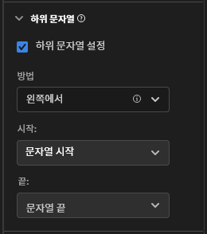

# 하위 문자열 구성 요소 설정 {#substring-component-settings}

<!-- markdownlint-disable MD034 -->

>[!CONTEXTUALHELP]
>id="cja_dataview_component_dimension_substring"
>title="하위 문자열"
>abstract="규칙 또는 정규 표현식을 사용하여 문자열의 일부를 추출하십시오."

<!-- markdownlint-enable MD034 -->

[!UICONTROL 하위 문자열] 구성 요소 설정을 사용하면 여러 문자열 조작 방법을 수행하여 보고서에서 원하는 차원 항목을 얻을 수 있습니다.

[!UICONTROL 하위 문자열]은 차원에서만 사용할 수 있고 적용 대상 데이터에 대해 소급적입니다. 이는 필터링이나 다른 분석 작업이 적용되기 전에 발생하는 즉각적인 데이터 변환입니다.

## 왼쪽/오른쪽에서 시작

문자열의 시작 또는 끝 위치에 따라 문자열의 일부를 가져옵니다. **[!UICONTROL 왼쪽에서]** 및 **[!UICONTROL 오른쪽에서]** 메서드는 두 개의 드롭다운 목록을 제공합니다. **[!UICONTROL From]**(출력이 시작되는 위치) 및 **[!UICONTROL To]**(출력이 끝나는 위치).

* **[!UICONTROL 문자열 시작]**: 문자열의 시작입니다.
* **[!UICONTROL 문자열 끝]**: 문자열의 끝입니다.
* **[!UICONTROL 위치]**: 방법에 따라 왼쪽 또는 오른쪽에서 고정된 문자 수입니다.
* **[!UICONTROL 문자열]**: 문자열의 시작 또는 끝을 나타내기 위해 문자 또는 문자 시퀀스를 일치시킵니다. 이 드롭다운 목록에는 다음과 같은 추가 옵션도 표시됩니다.
   * **[!UICONTROL 일치]**: 일치시킬 문자열입니다. 입력이 이 필드와 일치하지 않으면 [값 옵션 없음](no-value-options.md)이 적용됩니다.
   * **[!UICONTROL 색인]**: **[!UICONTROL 일치]** 기준은 문자열에 여러 번 표시될 수 있습니다. 이 정수는 방법에 따라 출력을 시작하거나 종료할 일치 항목을 결정합니다. 예를 들어 `1`의 색인은 최초 일치를 나타냅니다. 색인이 사용 가능한 일치 항목 수보다 높으면 [값 옵션 없음](no-value-options.md)이 적용됩니다.
   * **[!UICONTROL 문자열 포함]**: 활성화된 경우 출력에 **[!UICONTROL 일치]** 문자열을 포함하도록 하는 확인란입니다.
* **[!UICONTROL 길이]**: 출력의 시작 위치 뒤에 포함할 문자 수를 지정하는 정수입니다. **[!UICONTROL 받는 사람]** 드롭다운 목록에서만 사용할 수 있습니다.

## 구분 기호

여러 문자열 값을 구분하기 위해 구분 기호를 사용하는 필드에 대해 이 방법을 사용하십시오. 출력으로 사용할 개별 요소를 추출하거나 문자열을 오브젝트 배열 스키마 요소로 변환할 수 있습니다.

* **[!UICONTROL 기준]**: 구분된 값 목록을 처리하는 방법
   * **[!UICONTROL 왼쪽에서 시작]**: 구분된 목록의 시작 부분부터 시작하여 앞으로 계산합니다.
   * **[!UICONTROL 오른쪽에서 시작]**: 구분된 목록의 끝 부분부터 시작하여 거꾸로 계산합니다.
   * **[!UICONTROL 배열로 변환]**: 이 차원을 오브젝트 배열 스키마 요소처럼 처리합니다.
* **[!UICONTROL 구분 기호]**: 필드에서 사용하는 구분 기호입니다.
* **[!UICONTROL 색인]**: 기준이 왼쪽/오른쪽에서 시작인 경우에만 표시됩니다. 배열에 있던 것과 같은 요소 번호입니다. 예를 들어 문자열 입력이 `"Fox,Turtle,Rabbit,Wolf"`이고 색인이 3이면 출력은 `"Rabbit"`입니다. 색인이 사용 가능한 구분 요소의 수보다 높으면 [값 옵션 없음](no-value-options.md)이 적용됩니다.

## URL 구문 분석

URL이 포함된 필드와 함께 사용합니다. 예제 URL `https://example.com/store/index.html?cid=campaign#cart`을 사용하여 다음 옵션을 사용할 수 있습니다.

* **[!UICONTROL 프로토콜 가져오기]**: URL의 프로토콜을 가져옵니다. (예: `"https://"`)
* **[!UICONTROL 호스트 가져오기]**: URL의 호스트를 가져옵니다. (예: `"example.com"`)
* **[!UICONTROL 패스 가져오기]**: URL의 패스를 가져옵니다. (예: `"store/index.html"`)
* **[!UICONTROL 쿼리 문자열 값 가져오기]**: 단일 쿼리 문자열에서 값을 가져옵니다. **[!UICONTROL 쿼리 키]** 필드에 원하는 쿼리 문자열 매개변수를 입력합니다. 위의 URL을 `"cid"` 쿼리 키와 함께 사용하면 출력은 `"campaign"`입니다.
* **[!UICONTROL 해시 값 가져오기]**: URL의 해시 값을 가져옵니다. (예: `"cart"`)

입력이 유효한 URL이 아니거나 원하는 URL 구성 요소가 없는 경우 [값 옵션 없음](no-value-options.md)이 적용됩니다.

## 트리밍

문자열에서 공백이나 특수 문자를 트리밍합니다.

* **[!UICONTROL 공백 트리밍]**: 활성화되면 문자열의 시작과 끝에서 모든 공백을 제거하는 확인란입니다.
* **[!UICONTROL 특수 문자 트리밍]**: 활성화되면 **[!UICONTROL 특수 문자]** 입력 필드가 표시되도록 하는 확인란입니다. 이 필드의 모든 문자는 출력에서 제거됩니다. 멀티바이트 문자는 지원되지 않습니다.

## 정규 표현식

차원에 정규 표현식을 적용하여 원하는 값을 검색합니다.

* **[!UICONTROL 정규 표현식]**: 정규 표현식 공식입니다.
* **[!UICONTROL 출력 형식]**: 텍스트를 추가하거나 정규 표현식 하위 그룹 출력을 재정렬할 수 있는 선택 필드입니다. 이 필드가 비어 있으면 문자열 출력은 평가된 정규 표현식입니다.
* **[!UICONTROL 대소문자 구분]**: 활성화되면 정규 표현식이 대소문자를 구분하도록 하는 확인란입니다.

Customer Journey Analytics은 Perl 정규 표현식 구문의 하위 집합을 사용합니다. 입력이 정규 표현식과 일치하지 않고 **[!UICONTROL 출력 형식]**&#x200B;이 비어 있으면 [값 옵션 없음](no-value-options.md)이 적용됩니다. 지원되는 표현식은 다음과 같습니다.

| 표현식 | 설명 |
| --- | --- |
| `a` | 단일 문자 `a` |
| `a\|b` | 단일 문자 `a` 또는 `b` |
| `[abc]` | 단일 문자 `a`, `b` 또는 `c` |
| `[^abc]` | `a`, `b` 또는 `c`를 제외한 모든 단일 문자 |
| `[a-z]` | `a`-`z` 범위의 모든 단일 문자 |
| `[a-zA-Z0-9]` | `a`-`z`, `A`-`Z`, `0`-`9` 범위의 모든 단일 문자 |
| `^` | 선 시작과 일치 |
| `$` | 선 끝과 일치 |
| `\A` | 문자열 시작 |
| `\z` | 문자열 끝 |
| `.` | 모든 문자와 일치 |
| `\s` | 모든 공백 문자 |
| `\S` | 모든 비공백 문자 |
| `\d` | 모든 숫자 |
| `\D` | 모든 비숫자 |
| `\w` | 모든 문자, 숫자 또는 밑줄 |
| `\W` | 모든 비단어 문자 |
| `\b` | 모든 단어 경계 |
| `\B` | 단어 경계가 아닌 모든 문자 |
| `\<` | 단어 시작 |
| `\>` | 단어 끝 |
| `(...)` | 둘러싸인 모든 항목 캡처 |
| `(?:...)` | 구획 없는 캡처 일치 항목이 출력 문자열에서 참조되는 것을 방지합니다. |
| `a?` | 0 또는 `a` 중 1개 |
| `a*` | 0개 이상의 `a` |
| `a+` | 1개 이상의 `a` |
| `a{3}` | `a` 중 정확히 3개 |
| `a{3,}` | 3개 이상의 `a` |
| `a{3,6}` | 3과 6 사이의 `a` |

출력 자리표시자도 지원됩니다. 원하는 문자열 출력을 얻기 위해 이러한 시퀀스를 **[!UICONTROL 출력 형식]**&#x200B;으로 얼마든지 사용할 수 있습니다.

| 출력 자리표시자 시퀀스 | 설명 |
| --- | --- |
| `$&` | 전체 표현식과 일치하는 것을 출력합니다. |
| `$n` | n번째 하위 표현식과 일치하는 것을 출력합니다. 예를 들어 `$1`은 첫 번째 하위 표현식을 출력합니다. |
| ``$` `` | 마지막으로 찾은 일치 항목의 끝(또는 이전 일치 항목이 없는 경우 텍스트의 시작)과 현재 일치 항목의 시작 사이의 텍스트를 출력합니다. |
| `$+` | 정규 표현식에서 마지막으로 표시된 하위 표현식과 일치하는 것을 출력합니다. |
| `$$` | 문자열 문자 `"$"`를 출력합니다. |

{style="table-layout:auto"}
