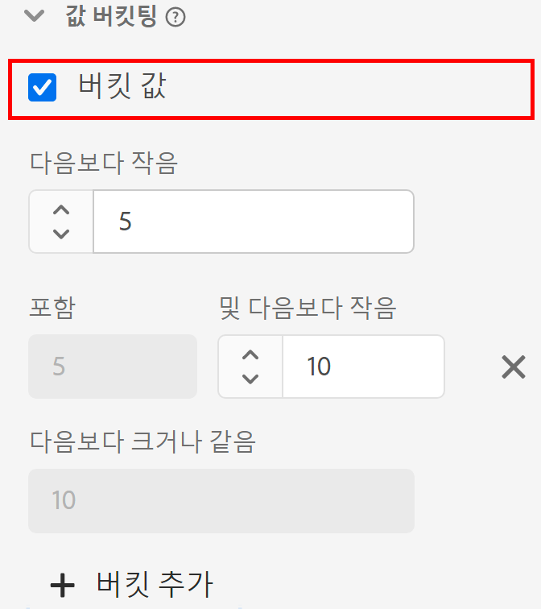

# [!UICONTROL 값 버킷팅] 구성 요소 설정

데이터 보기를 만들거나 편집할 때 값 버킷팅을 통해 범위를 기준으로 숫자 값을 조합할 수 있습니다. Integer 또는 Double 스키마 데이터 유형을 사용하여 차원에서만 사용할 수 있습니다.

값 버킷팅은 별도의 차원 항목으로 모든 고유 번호를 처리하는 대신 범위를 함께 그룹화하는 경우에 유용합니다. 예를 들어 ‘5에서 최대 10 사이’ 버킷이 Analysis Workspace에 ‘5에서 10까지’ 라인 항목으로 나타납니다.

버킷 차원과 버킷이 아닌 차원 모두에서 유연한 보고를 실시하려는 경우 구성 요소 복사본 2개를 사용 가능한 차원 목록으로 드래그합니다. 한 차원에서 버킷팅을 활성화하고 다른 차원에서 비활성화합니다.

| 설정 | 설명 |
| --- | --- |
| [!UICONTROL 버킷 값] | 버킷팅을 활성화할 수 있는 확인란입니다. |
| [!UICONTROL 미만] | 첫 번째 차원 버킷의 상단 경계 |
| [!UICONTROL 포함] 및 [!UICONTROL 보다 작음] | 후속 버킷의 경계 |
| [!UICONTROL 크거나 같음] | 마지막 차원 버킷의 하단 경계 |
| [!UICONTROL 버킷 추가] | 수치 차원 버킷에 다른 버킷을 추가할 수 있습니다. 단일 차원에서 최대 20개의 버킷을 추가할 수 있습니다. |

{style="table-layout:auto"}
