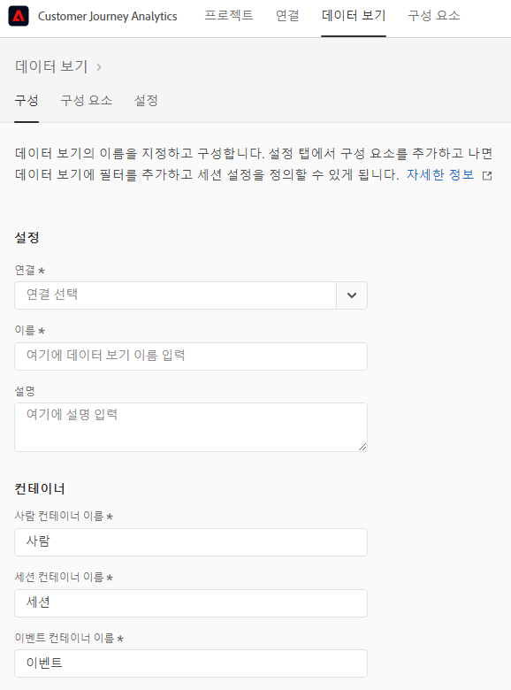
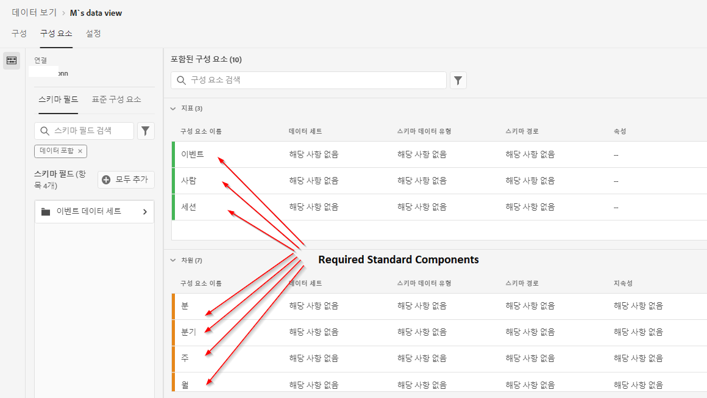

# 데이터 보기 만들기 또는 편집

데이터 보기 만들기에는 스키마 요소에서 지표와 차원을 생성하거나 표준 구성 요소를 활용하는 작업이 포함됩니다. 비즈니스 요구 사항에 따라 대부분의 스키마 요소는 차원이나 지표 중 하나가 될 수 있습니다. 스키마 요소를 데이터 보기로 드래그하면 CIA에서 차원 또는 지표가 작동하는 방법을 조정할 수 있는 옵션이 오른쪽에 나타납니다.

다음은 해당 주제에 대한 비디오입니다.

>[!VIDEO](https://video.tv.adobe.com/v/35110/?quality=12&learn=on)

## 데이터 보기 구성하기 {#configure}

1. [Customer Journey Analytics](https://analytics.adobe.com)에 로그인하고 **[!UICONTROL 데이터 보기]** 탭으로 이동합니다.
2. **[!UICONTROL 추가]**&#x200B;를 클릭하여 데이터 보기를 만들거나 기존 데이터 보기를 클릭하여 편집합니다.

### 데이터 보기 설정 {#settings}

데이터 보기에 중요한 설정을 제공합니다.

| 설정 | 설명 |
| --- | --- |
| [!UICONTROL 연결] | 이 필드는 하나 이상의 Adobe Experience Platform 데이터 세트가 포함되어 있으며 이전에 설정한 연결에 데이터 보기를 연결합니다. |
| [!UICONTROL 이름] | 필수 여부. 데이터 이름 보기. Analysis Workspace의 오른쪽 드롭다운에 이 값이 표시됩니다. |
| [!UICONTROL 설명] | 선택 사항. Adobe는 사용자가 데이터 보기가 존재하는 이유와 설계 대상을 이해할 수 있도록 자세한 설명을 권장합니다. |

{style=&quot;table-layout:auto&quot;}

### 컨테이너 {#containers}

데이터 보기의 컨테이너 이름을 지정합니다. 컨테이너 이름은 [필터](/help/components/filters/filters-overview.md#Filter-containers)에서 자주 사용됩니다.

| 설정 | 설명 |
| --- | --- |
| [!UICONTROL 개인 컨테이너 이름] | [!UICONTROL 개인] (기본값). [!UICONTROL 개인] 컨테이너에는 지정된 시간대 내의 방문자에 대한 모든 세션 및 이벤트가 포함됩니다. 조직이 서로 다른 용어(예: “방문자” 또는 “사용자”)를 사용하는 경우 여기서 컨테이너 이름을 변경할 수 있습니다. |
| [!UICONTROL 세션 컨테이너 이름] | [!UICONTROL 세션] (기본값). [!UICONTROL 세션] 컨테이너에서 특정 세션에 대한 페이지 상호 작용, 캠페인 또는 대화를 식별할 수 있습니다. 이 컨테이너의 이름을 ‘방문’ 또는 조직이 원하는 다른 용어로 바꿀 수 있습니다. |
| [!UICONTROL 이벤트 컨테이너 이름] | [!UICONTROL 이벤트] (기본값). [!UICONTROL 이벤트] 컨테이너는 데이터 세트의 개별 이벤트를 정의합니다. 조직이 서로 다른 용어(예: “히트” 또는 “페이지 조회수”)를 사용하는 경우 여기서 컨테이너 이름을 변경할 수 있습니다. |

{style=&quot;table-layout:auto&quot;}

### 달력 {#calendar}

데이터 보기를 따르는 달력 형식을 보여 줍니다. 동일한 [연결](/help/connections/create-connection.md)을 기반으로 여러 데이터 보기를 소유하고 서로 다른 달력 유형 또는 시간대를 제공할 수 있습니다. 이러한 데이터 보기를 통해 서로 다른 달력 유형을 사용하는 팀들은 동일한 기본 데이터와 함께 해당하는 요구 사항을 수용할 수 있습니다.

| 설정 | 설명 |
| --- | --- |
| [!UICONTROL 시간대] | 데이터를 표시할 표준 시간대를 선택합니다. 일광 절약 시간에 작동하는 시간대를 선택하는 경우 데이터를 자동으로 조정하여 이러한 내용을 반영합니다. 한 시간 앞당겨 시간을 조정하는 봄철에는 한 시간의 차이가 존재합니다. 한 시간 늦춰 시간을 조정하는 가을철에는 DST 전환 시 한 시간이 반복됩니다. |
| [!UICONTROL 달력 유형] | 주단위로 그룹화하는 방법을 결정합니다. **그레고리역:** 표준 달력 양식. 분기별로 그룹화합니다. **4-5-4 소매 기반 달력:** 표준화된 4-5-4 소매 기반 달력. 분기의 첫째 달과 마지막 달에는 4주가 포함되지만 분기의 둘째 달은 5주로 구성됩니다. **사용자 정의(4-5-4):** 4-5-4 달력과 유사하지만 예외적으로 한 해의 첫째 날과 주가 ‘추가’되는 년도를 선택할 수 있습니다. **사용자 정의(4-4-5):** 각 분기의 첫째, 둘째 달에는 4주가 포함되지만 각 분기의 마지막 주는 5주로 구성됩니다. **사용자 정의(5-4-4):** 각 분기의 첫째 달에는 5주가 포함되지만 각 분기의 둘째, 셋째 달은 4주로 구성됩니다. |
| [!UICONTROL 한 해의 첫째 달] 및 [!UICONTROL 한 주의 첫째 날] | 그레고리역 유형의 경우 표시. 역년에서 시작할 월과 매주 시작할 요일을 지정합니다. |
| [!UICONTROL 올해 첫째 날] | 사용자 정의 달력 유형의 경우 표시. 올해에 시작할 요일을 지정합니다. 이 값에 따라 달력은 매주 첫째 날을 자동으로 지정합니다. |
| [!UICONTROL “추가 주”가 발생하는 연도] | 364일 달력(주 7일 52주)을 사용하면 매년 남은 날들이 추가 주가 될 때까지 누적됩니다. 이 추가 주가 해당 해의 마지막 달에 추가됩니다. 주를 별도로 추가하는 년도를 지정합니다. |

{style=&quot;table-layout:auto&quot;}

## 데이터 보기의 구성 요소 설정 {#set-components}

그런 다음 스키마 요소에서 지표와 차원을 생성할 수 있습니다. 표준 구성 요소를 사용할 수도 있습니다.

1. [Customer Journey Analytics](https://analytics.adobe.com)에 로그인하고 **[!UICONTROL 데이터 보기]** 탭으로 이동합니다.
1. **[!UICONTROL 추가]**&#x200B;를 클릭하여 데이터 보기를 만들거나 기존 데이터 보기를 클릭하여 편집합니다.
1. **[!UICONTROL 구성 요소]** 탭을 클릭합니다.

   

   데이터 세트를 포함하는 왼쪽 상단의 [!UICONTROL 연결]과 아래의 [!UICONTROL 스키마 필드]를 볼 수 있습니다. 이미 포함된 구성 요소는 모든 데이터 보기의 표준 필수 구성 요소(시스템 생성)입니다. 또한 Adobe는 기본값으로 **[!UICONTROL 데이터 포함]** 필터를 적용하여 데이터가 포함된 스키마 필드만 나타나도록 합니다. 데이터가 포함되지 않은 필드가 필요한 경우 이 필터를 제거하면 됩니다.

1. 왼쪽 레일에서 지표 또는 차원 섹션으로 `pageTitle`과 같은 스키마 필드를 드래그합니다.

   동일한 스키마 필드를 차원 또는 지표 섹션으로 여러 번 끌어오고 동일한 차원 또는 지표를 여러 가지 방법으로 구성할 수 있습니다. 예를 들어 `pageTitle` 필드에서 오른쪽의 서로 다른 [구성 요소 설정](component-settings/overview.md)을 사용하여 “제품 페이지”라는 차원과 “오류 페이지”라는 차원을 생성할 수 있습니다.

   

   왼쪽 레일에서 스키마 필드 폴더를 드래그하면 일반 섹션으로 자동으로 정렬됩니다. 문자열 필드는 [!UICONTROL 차원] 섹션에 표시되고 숫자 스키마 유형은 [!UICONTROL 지표] 섹션에 표시됩니다. **[!UICONTROL 모두 추가]**&#x200B;를 클릭하면 각 위치에 모든 스키마 필드가 추가됩니다.

1. 구성 요소를 선택하면 오른쪽에 여러 가지 설정이 나타납니다. [구성 요소 설정](component-settings/overview.md)을 사용하여 구성 요소를 구성합니다. 사용 가능한 구성 요소 설정은 구성 요소가 차원/지표 및 스키마 데이터 유형인 경우 달라집니다. 설정에는 다음이 포함됩니다.

   * [[!UICONTROL 속성]](component-settings/attribution.md)
   * [[!UICONTROL 비헤이비어]](component-settings/behavior.md)
   * [[!UICONTROL 포맷]](component-settings/format.md)
   * [[!UICONTROL 포함/제외 값]](component-settings/include-exclude-values.md)
   * [[!UICONTROL 지표 중복 제거]](component-settings/metric-deduplication.md)
   * [[!UICONTROL 값 옵션 없음]](component-settings/no-value-options.md)
   * [[!UICONTROL 지속성]](component-settings/persistence.md)
   * [[!UICONTROL 값 버킷팅]](component-settings/value-bucketing.md)

## 중복 지표 또는 차원 {#duplicate}

지표 또는 차원을 복제한 뒤 특정 설정을 변경하면 단일 스키마 필드에서 다수의 지표 또는 차원을 손쉽게 만들 수 있습니다. 오른쪽 상단에서 지표 또는 차원 이름 아래의 [!UICONTROL 복제] 설정을 선택합니다. 새 차원 또는 지표를 변경한 뒤 더 설명적인 이름으로 저장합니다.

## 필터, 스키마 필드 또는 데이터 세트 {#filter}

다음 데이터 유형을 사용하여 왼쪽 레일의 스키마 필드를 필터링할 수 있습니다.

또한 데이터 세트 및 스키마 필드에 데이터가 포함되어 있는지 또는 ID인지 여부를 기준으로 필터링할 수도 있습니다. 기본적으로 Adobe는 모든 데이터 보기에 **[!UICONTROL 데이터 포함]** 필터를 적용합니다.

## 설정 탭 {#settings-tab}

1. [Customer Journey Analytics](https://analytics.adobe.com)에 로그인하고 **[!UICONTROL 데이터 보기]** 탭으로 이동합니다.
1. **[!UICONTROL 추가]**&#x200B;를 클릭하여 데이터 보기를 만들거나 기존 데이터 보기를 클릭하여 편집합니다.
1. **[!UICONTROL 설정]** 탭을 클릭합니다.

### 전역 필터 {#global-filter}

전체 데이터 보기에 적용되는 필터를 추가할 수 있습니다. 이 필터는 작업 영역에서 실행하는 모든 보고서에 적용됩니다. 왼쪽 레일의 목록에서 [!UICONTROL 필터 추가] 필드로 필터를 끌어옵니다.

### 세션 설정 {#sessions}

세션이 만료되기 전에 이벤트 간의 비활성 기간을 결정하면 새 세션이 시작됩니다. 기간은 필수 입력 항목입니다. 이벤트에 특정 지표가 포함되면 새 섹션이 강제로 시작될 수도 있습니다.

원하는 설정이 모두 지정되면 **[!UICONTROL 저장]**&#x200B;을 클릭하고 마칩니다.

