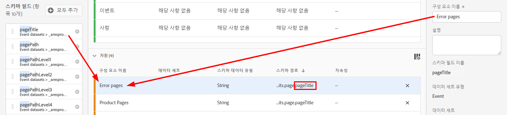
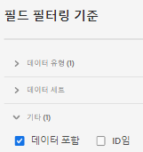

# 데이터 보기 만들기 또는 편집

데이터 보기 만들기에는 스키마 요소에서 지표와 차원을 생성하거나 표준 구성 요소를 활용하는 작업이 포함됩니다. 대부분의 스키마 요소는 비즈니스 요구 사항에 따라 차원이나 지표일 수 있습니다. 스키마 요소를 데이터 보기로 드래그하면 CJA에서 차원이나 지표가 작동하는 방식을 조정할 수 있는 오른쪽에 옵션이 나타납니다.

## 데이터 보기 구성

1. [Customer Journey Analytics](https://analytics.adobe.com)에 로그인하고 **[!UICONTROL 데이터 보기]** 탭으로 이동합니다.
2. **[!UICONTROL 추가]**&#x200B;를 클릭하여 데이터 보기를 만들거나 기존 데이터 보기를 클릭하여 편집합니다.

### 설정

데이터 보기에 대한 중요한 설정을 제공합니다.

| 설정 | 설명 |
| --- | --- |
| [!UICONTROL 연결] | 이 필드는 하나 이상의 Adobe Experience Platform 데이터 세트가 포함되어 있으며 이전에 설정한 연결에 데이터 보기를 연결합니다. |
| [!UICONTROL 이름] | 필수 여부. 데이터 보기의 이름입니다. 이 값은 Analysis Workspace의 오른쪽 위 드롭다운에 표시됩니다. |
| [!UICONTROL 설명] | 선택 사항입니다. Adobe은 사용자가 데이터 보기가 존재하는 이유와 그 대상이 누구인지를 이해할 수 있도록 자세한 설명을 권장합니다. |

### 컨테이너

데이터 보기에 대한 컨테이너 이름을 지정합니다. 컨테이너 이름은 [필터](/help/components/filters/filters-overview.md#Filter-containers)에 자주 사용됩니다.

| 설정 | 설명 |
| --- | --- |
| [!UICONTROL 사람 컨테이너 이름] | [!UICONTROL 개인] (기본값). [!UICONTROL Person] 컨테이너에는 지정된 기간 내의 방문자에 대한 모든 세션 및 이벤트가 포함됩니다. 조직에서 다른 용어(예: &quot;방문자&quot; 또는 &quot;사용자&quot;)를 사용하는 경우 여기에서 컨테이너의 이름을 변경할 수 있습니다. |
| [!UICONTROL 세션 컨테이너 이름] | [!UICONTROL 세션] (기본값). [!UICONTROL 세션] 컨테이너에서 특정 세션에 대한 페이지 상호 작용, 캠페인 또는 대화를 식별할 수 있습니다. 이 컨테이너의 이름을 &#39;방문&#39; 또는 조직이 선호하는 다른 용어로 바꿀 수 있습니다. |
| [!UICONTROL 이벤트 컨테이너 이름] | [!UICONTROL 이벤트] (기본값). [!UICONTROL 이벤트] 컨테이너는 데이터 집합에 있는 개별 이벤트를 정의합니다. 조직에서 다른 용어(예: &quot;히트&quot; 또는 &quot;페이지 보기&quot;)를 사용하는 경우 여기에서 컨테이너의 이름을 변경할 수 있습니다. |

### 달력

데이터 보기에서 따라야 할 달력 형식을 나타냅니다. 동일한 [연결](/help/connections/create-connection.md)을 기준으로 여러 데이터 보기를 가질 수 있으며 다른 달력 유형 또는 시간대를 제공할 수 있습니다. 이러한 데이터 보기를 사용하면 서로 다른 달력 유형을 사용하여 동일한 기본 데이터로 각각의 요구 사항을 충족할 수 있습니다.

| 설정 | 설명 |
| --- | --- |
| [!UICONTROL 시간대] | 데이터를 표시할 표준 시간대를 선택합니다. 일광 절약 시간제로 작동하는 시간대를 선택하면 데이터가 자동으로 조정되어 반영됩니다. 시계는 한 시간 앞당기는 봄에 1시간 차이가 난다. 시계가 1시간 뒤로 조정되는 가을에는 일광 절약 시간제 교대로 1시간이 반복됩니다. |
| [!UICONTROL 달력 유형] | 해당 월의 주가 그룹화되는 방식을 결정합니다. **양력:** 표준 달력 형식입니다. 분기는 월별로 그룹화됩니다. **4-5-4 소매:** 표준화된 4-5-4 소매 달력. 분기의 첫 번째 및 마지막 달은 4주를 포함하고, 분기의 두 번째 달은 5주로 구성됩니다. **사용자 지정(4-5-4):** 연도의 첫 날과 &quot;추가&quot; 주가 발생하는 연도를 선택할 수 있다는 것을 제외하고 4-5-4 달력과 유사합니다. **사용자 지정 (4-4-5):** 각 분기의 첫 번째 및 두 번째 달은 4주를 포함하고, 각 분기의 마지막 주는 5주로 구성됩니다. **사용자 지정(5-4-4):**  각 분기의 첫 번째 달은 5주로 구성되며, 각 분기의 두 번째 및 세 번째 달은 4주로 구성됩니다. |
| [!UICONTROL 첫째 달 ] 및  [!UICONTROL 첫째 날] | 양력 유형에 대해 표시됩니다. 달력 연도를 시작할 월과 각 주에 시작할 날짜를 지정합니다. |
| [!UICONTROL 올해 첫 날] | 사용자 지정 달력 유형에 표시됩니다. 현재 연도를 시작할 요일을 지정합니다. 달력은 이 값을 기반으로 각 주의 첫 번째 요일의 서식을 자동으로 지정합니다. |
| [!UICONTROL “추가 주”가 발생하는 연도] | 대부분 364일 달력(매 7일 52주)과 함께, 매년 남은 일수를 누적하여 1주일을 더 벌어야 한다. 그런 다음 이 추가 주가 해당 연도의 마지막 달에 추가됩니다. 주를 추가할 연도를 지정합니다. |

## 데이터 보기의 구성 요소 설정

그런 다음 스키마 요소에서 지표와 차원을 생성할 수 있습니다. 표준 구성 요소를 사용할 수도 있습니다.

1. [Customer Journey Analytics](https://analytics.adobe.com)에 로그인하고 **[!UICONTROL 데이터 보기]** 탭으로 이동합니다.
1. **[!UICONTROL 추가]**&#x200B;를 클릭하여 데이터 보기를 만들거나 기존 데이터 보기를 클릭하여 편집합니다.
1. **[!UICONTROL 구성 요소]** 탭을 클릭합니다.

   

   데이터 세트를 포함하는 왼쪽 상단의 [!UICONTROL 연결]과 아래의 [!UICONTROL 스키마 필드]를 볼 수 있습니다. 이미 포함된 구성 요소는 모든 데이터 보기에 대한 표준 필수 구성 요소(시스템 생성)입니다. Adobe은 기본적으로 **[!UICONTROL 데이터 포함]** 필터를 적용하므로 데이터가 포함된 스키마 필드만 표시됩니다. 데이터가 포함되지 않은 필드를 원하는 경우 이 필터를 제거합니다.

1. 왼쪽 레일의 `pageTitle` 과 같은 스키마 필드를 지표 또는 Dimension 섹션으로 드래그합니다.

   동일한 스키마 필드를 차원 또는 지표 섹션으로 여러 번 끌어오고 동일한 차원 또는 지표를 여러 가지 방법으로 구성할 수 있습니다. 예를 들어 `pageTitle` 필드에서 오른쪽에 다른 [구성 요소 설정](component-settings/overview.md)을 사용하여 &quot;제품 페이지&quot;라는 차원과 &quot;오류 페이지&quot;를 만들 수 있습니다.

   

   왼쪽 레일에서 스키마 필드 폴더를 드래그하면 일반 섹션으로 자동으로 정렬됩니다. 문자열 필드는 [!UICONTROL Dimension] 섹션으로 끝나고 숫자 스키마 유형은 [!UICONTROL 지표] 섹션으로 끝납니다. **[!UICONTROL 모두 추가]**&#x200B;를 클릭하면 모든 스키마 필드가 해당 위치에 추가됩니다.

1. 구성 요소를 선택하면 오른쪽에 다양한 설정이 나타납니다. [구성 요소 설정](component-settings/overview.md)을 사용하여 구성 요소를 구성합니다. 사용 가능한 구성 요소 설정은 구성 요소가 차원/지표와 스키마 데이터 유형인지 여부에 따라 다릅니다. 설정에는 다음이 포함됩니다.

   * [[!UICONTROL 속성]](component-settings/attribution.md)
   * [[!UICONTROL 동작]](component-settings/behavior.md)
   * [[!UICONTROL 형식]](component-settings/format.md)
   * [[!UICONTROL 포함/제외 값]](component-settings/include-exclude-values.md)
   * [[!UICONTROL 지표 중복 제거]](component-settings/metric-deduplication.md)
   * [[!UICONTROL 값 옵션 없음]](component-settings/no-value-options.md)
   * [[!UICONTROL 지속성]](component-settings/persistence.md)
   * [[!UICONTROL 값 버킷팅]](component-settings/value-bucketing.md)

필요한 경우 다음 기능을 사용할 수 있습니다.

* **[!UICONTROL 복제]**: 지표나 차원을 복제한 다음 특정 설정을 수정하는 것은 단일 스키마 필드에서 여러 지표 또는 차원을 쉽게 만드는 방법입니다. 오른쪽 상단에 있는 지표 또는 차원 이름 아래에 있는 [!UICONTROL 중복] 설정을 선택합니다. 새 차원 또는 지표를 수정하고 좀 더 설명적인 이름으로 저장합니다.

   

* **[!UICONTROL 필터]**: 왼쪽 레일의 스키마 필드를 다음 데이터 유형별로 필터링할 수 있습니다.

   

   또한 데이터 세트 및 스키마 필드에 데이터가 포함되어 있는지 또는 ID인지 여부를 기준으로 필터링할 수도 있습니다. 기본적으로 Adobe은 처음에 **[!UICONTROL 데이터 포함]** 필터를 모든 데이터 보기에 적용합니다.

   

## 설정

1. [Customer Journey Analytics](https://analytics.adobe.com)에 로그인하고 **[!UICONTROL 데이터 보기]** 탭으로 이동합니다.
1. **[!UICONTROL 추가]**&#x200B;를 클릭하여 데이터 보기를 만들거나 기존 데이터 보기를 클릭하여 편집합니다.
1. **[!UICONTROL 설정]** 탭을 클릭합니다.

### 전역 필터

전체 데이터 보기에 적용되는 필터를 추가할 수 있습니다. 이 필터는 Workspace에서 실행하는 모든 보고서에 적용됩니다. 왼쪽 레일의 목록에서 [!UICONTROL 필터 추가] 필드로 필터를 끌어옵니다.

### 세션 설정

세션이 만료되고 새 세션이 시작되기 전에 이벤트 간 비활성 기간을 결정합니다.

기간은 필수입니다. 이벤트에 특정 지표가 포함되어 있으면 새 세션이 시작하도록 강제할 수도 있습니다.

원하는 설정을 모두 지정하고 **[!UICONTROL 저장 후 완료]**&#x200B;를 클릭하십시오.
