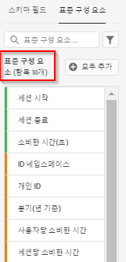

# 새 데이터 보기 만들기

데이터 보기 만들기에는 스키마 요소에서 지표와 차원을 생성하거나 표준 구성 요소를 활용하는 작업이 포함됩니다. 지표 또는 차원을 생성하면 엄청난 유연성을 확보할 수 있습니다. 이전에는 Adobe Experience Platform에 데이터 세트가 있는 경우 문자열 필드를 차원으로 사용하고 숫자 필드를 지표로 사용한다고 가정했습니다. 이러한 필드를 변경하려면 플랫폼에서 스키마를 편집해야 합니다. 이제 데이터 보기 UI를 통해 [지표와 차원을 보다 자유롭게 정의](/help/data-views/data-views.md)할 수 있습니다. 추가 사용 사례는 [데이터 보기 사용 사례](/help/data-views/data-views-usecases.md)를 참조하십시오.

## 1. 데이터 보기 설정 및 컨테이너 구성

1. Customer Journey Analytics에서 **[!UICONTROL 데이터 보기]** 탭으로 이동합니다.
2. 데이터 보기를 추가하고 해당 설정을 구성하려면 **[!UICONTROL 추가]**&#x200B;를 클릭합니다.

| 설정 | 설명/사용 사례 |
| --- | --- |
| [!UICONTROL 연결] | 이 필드는 하나 이상의 Adobe Experience Platform 데이터 세트가 포함되어 있으며 이전에 설정한 연결에 데이터 보기를 연결합니다. |
| [!UICONTROL 이름] | 데이터 보기에 이름을 지정해야 합니다. |
| [!UICONTROL 설명] | 자세한 설명은 필수가 아니지만, 권장됩니다. |
| [!UICONTROL 시간대] | 데이터를 표시할 표준 시간대를 선택합니다. |
| [!UICONTROL 태그] | [!UICONTROL 태그]를 사용하여 데이터 보기를 범주로 구성할 수 있습니다. |
| [!UICONTROL 컨테이너] | 여기서 컨테이너의 이름을 바꾸어 이 데이터 보기에 기반한 모든 Workspace 프로젝트에 컨테이너가 표시되는 방식을 결정할 수 있습니다. [!UICONTROL 컨테이너]는 필터 및 폴아웃/흐름 등에 사용되어 범위 또는 컨텍스트의 폭이 얼마나 넓은지 정의합니다. [추가 정보](https://experienceleague.adobe.com/docs/analytics-platform/using/cja-components/cja-filters/filters-overview.html?lang=ko-KR#filter-containers) |
| [!UICONTROL 개인 컨테이너 이름…] | [!UICONTROL 개인] (기본값). [!UICONTROL 개인] 컨테이너에는 지정된 기간 내의 방문자에 대한 모든 방문 및 페이지 보기가 포함됩니다. 이 컨테이너의 이름을 &#39;사용자&#39; 또는 원하는 다른 용어로 바꿀 수 있습니다. |
| [!UICONTROL 세션 컨테이너 이름…] | [!UICONTROL 세션] (기본값). [!UICONTROL 세션] 컨테이너에서 특정 세션에 대한 페이지 상호 작용, 캠페인 또는 대화를 식별할 수 있습니다. 이 컨테이너의 이름을 &#39;방문&#39; 또는 원하는 다른 용어로 바꿀 수 있습니다. |
| [!UICONTROL 이벤트 컨테이너 이름…] | [!UICONTROL 이벤트] (기본값). [!UICONTROL 이벤트] 컨테이너는 필터에서 포함 또는 제외할 페이지 이벤트를 정의합니다. |

그런 다음 스키마 요소에서 지표와 차원을 생성할 수 있습니다. 표준 구성 요소를 사용할 수도 있습니다.

## 2. 스키마 요소에서 지표 및 차원 생성

1. [!UICONTROL Customer Journey Analytics] > [!UICONTROL 데이터 보기]에서 [!UICONTROL 구성 요소] 탭을 클릭합니다.

데이터 세트를 포함하는 왼쪽 상단의 [!UICONTROL 연결]과 아래의 [!UICONTROL 스키마 필드]를 볼 수 있습니다. 주의 사항:

* 이미 포함된 구성 요소는 표준 필수 구성 요소(시스템 생성)입니다.
* Adobe는 기본값으로 **[!UICONTROL 데이터 포함]** 필터를 적용하여 데이터가 포함된 스키마 필드만 나타나도록 합니다. 데이터가 포함되지 않은 필드를 찾는 경우 필터를 제거하면 됩니다.

1. 이제 왼쪽 레일에서 지표 또는 차원 섹션으로 [!UICONTROL pageTitle]과 같은 스키마 필드를 끌어옵니다.

   동일한 스키마 필드를 차원 또는 지표 섹션으로 여러 번 끌어오고 동일한 차원 또는 지표를 여러 가지 방법으로 구성할 수 있습니다.
예를 들어 **[!UICONTROL pageTitle]** 필드에서 오른쪽에 있는 **[!UICONTROL 구성 요소 이름]**&#x200B;의 이름을 바꾸어 &quot;제품 페이지&quot;라는 차원과 &quot;오류 페이지&quot;라는 차원 등을 생성할 수 있습니다. **[!UICONTROL pageTitle]** 필드의 문자열 값에서 지표를 생성할 수도 있습니다. 예를 들어 속성 설정이 다르고 포함/제외 값이 다른 하나 이상의 **[!UICONTROL 주문]** 지표를 생성할 수 있습니다.

   

   >[!NOTE]
   >
   >왼쪽 레일에서 전체 스키마 필드 폴더를 끌어오면 기존 섹션으로 자동으로 정렬됩니다. 문자열 필드는 [!UICONTROL 차원] 섹션에, 숫자는 [!UICONTROL 지표] 섹션에 표시됩니다. 또는 **[!UICONTROL 모두 추가]**&#x200B;를 클릭하면 모든 스키마 필드가 추가됩니다.

1. 구성 요소를 선택하면 오른쪽에 여러 가지 설정이 나타납니다. 아래 설명된 설정을 사용하여 구성 요소를 구성합니다.

### 구성 요소 설정 구성

| 설정 | 설명/사용 사례 |
| --- | --- |
| [!UICONTROL 구성 요소 유형] | 필수 여부. 구성 요소를 지표에서 차원으로 변경하거나 그 반대로 변경할 수 있습니다. |
| [!UICONTROL 구성 요소 이름] | 필수 여부. Analysis Workspace에 표시할 이름을 지정할 수 있습니다. 구성 요소의 이름을 변경하여 데이터 보기별 이름을 지정할 수 있습니다. |
| [!UICONTROL 설명] | 선택 사항이지만 다른 사용자에게 구성 요소에 대한 정보를 제공하는 것이 좋습니다. |
| [!UICONTROL 태그] | 선택 사항입니다. Analysis Workspace UI에서 보다 쉽게 검색/필터링할 수 있도록 사용자 지정 태그 또는 즉시 사용 가능한 태그로 구성 요소에 태그를 지정할 수 있습니다. |
| [!UICONTROL 필드 이름] | 스키마 필드의 이름. |
| [!UICONTROL 데이터 세트 유형] | 필수 여부. 구성 요소의 원본 데이터 세트 유형(이벤트, 조회 또는 프로필)을 표시하는 편집 불가능한 필드입니다. |
| [!UICONTROL 데이터 세트] | 필수 여부. 구성 요소의 원본 필드 유형(예: 문자열, 정수 등)을 표시하는 편집 불가능한 필드입니다. 이 필드에는 여러 개의 데이터 세트가 포함될 수 있습니다. |
| [!UICONTROL 스키마 데이터 유형] | 구성 요소가 문자열, 정수 등 어느 것인지 여부를 나타냅니다.  플랫폼에서 지원되는 모든 스키마 필드 유형을 사용할 수 있지만 CJA에서 모든 필드 유형이 지원되는 것은 아닙니다. 지원되는 데이터 유형은 `Integer`, `Int`, `Long`, `Double`, `Float`, `Number`, `Short`, `Byte`, `String`, `Boolean`입니다. 참고로 이 경우에는 조회 데이터 세트에서 문자열만 허용됩니다. |
| [!UICONTROL 구성 요소 ID] | 필수 여부. [CJA API](https://adobe.io/cja-apis/docs)는 이 필드를 사용하여 구성 요소를 참조합니다. 편집 아이콘을 클릭하고 이 구성 요소 ID를 수정할 수 있습니다. 그러나 이 구성 요소 ID를 변경하면 이 구성 요소가 포함된 기존의 모든 Workspace 프로젝트가 중단됩니다. pageTitle 차원에 대해 다른 필드를 사용하는 다른 데이터 보기를 만드는 경우, 데이터 보기 이름을 바꾸고 차원을 크로스 데이터 보기와 호환되도록 할 수 있습니다. |
| [!UICONTROL 스키마 경로] | 필수 여부. 구성 요소의 원본 스키마 경로를 표시하는 편집 불가능한 필드입니다. |
| [!UICONTROL 보고에서 구성 요소 숨기기] | 기본값 = 끄기. 보고에 사용될 때 데이터 보기에서 구성 요소를 큐레이션할 수 있습니다. 이는 권한에 영향을 주지 않고 구성 요소 큐레이션에만 영향을 미칩니다. 즉, 보고에서 비관리자에게 구성 요소를 숨길 수 있습니다. 관리자는 여전히 Analysis Workspace 프로젝트에서 [!UICONTROL 모든 구성 요소 표시]를 클릭하여 액세스할 수 있습니다. |

### 형식 설정 구성

형식 설정은 지표 전용입니다.

| 설정 | 설명/사용 사례 |
| --- | --- |
| [!UICONTROL 형식] | 지표의 형식을 십진수, 시간, 백분율 또는 통화로 지정할 수 있습니다. |
| [!UICONTROL 소수점 이하 자리 수] | 지표가 표시할 소수점 이하 자리 수를 지정할 수 있습니다. |
| [!UICONTROL 증가 트렌드를 다음으로 표시] | 이 지표의 증가 트렌드를 양호(녹색) 또는 불량(빨간색)으로 간주할지 여부를 지정할 수 있습니다. |
| [!UICONTROL 통화] | 이 설정은 선택한 지표 형식이 [!UICONTROL 통화]인 경우에만 표시됩니다. 통화 옵션 목록을 사용할 수 있습니다. 통화 기본값은 없습니다. 따라서 보고 시 선택한 통화로 매출을 나타낼 수 있습니다. 이는 통화 전환이 아니라 UI 형식 옵션입니다. |

### 속성 설정 구성

| 설정 | 설명/사용 사례 |
| --- | --- |
| [!UICONTROL 속성 설정] | 이 지표를 사용할 때 기본적으로 이 지표에 적용할 속성 설정을 지정할 수 있습니다. 이 기본값은 [!UICONTROL 자유 형식 테이블] 또는 계산된 지표에서 재정의할 수 있습니다. |
| [!UICONTROL 속성 모델] | 기본 속성 모델을 지정할 수 있습니다. [!UICONTROL 비기본 속성 모델 사용] 설정을 켜는 경우에만 활성화됩니다. 기본값은 [!UICONTROL 마지막 터치]입니다. 옵션은 마지막 터치, 첫 번째 터치, 선형, 참여, 동일한 터치, U자형, J 곡선, 역방향 J, 시간 지연, 맞춤형, 알고리즘입니다. 이러한 옵션 중 일부는 맞춤형 또는 시간 지연과 같이 채워야 하는 추가 필드를 만듭니다. 동일한 필드를 사용하여 여러 지표를 생성할 수 있습니다. 즉, [!UICONTROL 마지막 터치] 매출 지표 하나와 [!UICONTROL 첫 번째 터치] 매출 지표 하나를 가질 수 있지만 스키마의 매출 필드를 기준으로 합니다. |
| [!UICONTROL 전환 확인 기간] | 지표에 대한 기본 전환 확인 기간을 지정할 수 있습니다. [!UICONTROL 비기본 속성 모델 사용] 설정을 켜는 경우에만 활성화됩니다. 옵션은 [!UICONTROL 개인] (보고 기간), [!UICONTROL 세션], [!UICONTROL 사용자 지정]입니다. [!UICONTROL 사용자 지정]을 선택하면 [!UICONTROL Attribution IQ]와 마찬가지로 일/주/개월/등의 수(최대 90일)를 선택할 수 있는 옵션도 제공됩니다. 동일한 스키마 필드를 사용하여 여러 지표를 가질 수 있지만 각 지표에는 별도의 전환 확인 기간이 있습니다. |

### 포함/제외 값 설정 구성

이 설정을 사용하면 쿼리 시간에 보고 중인 기본 데이터를 수정할 수 있습니다. 이는 필터와 같지는 않습니다. 그러나 필터는 경로 지정과 속성처럼 이 새로운 차원을 존중합니다.

예를 들어 pageTitle 필드에서 차원을 생성할 수 있지만, &quot;오류 페이지&quot;라고 부르고 &quot;오류&quot; [!UICONTROL 구문을 포함]하는 페이지를 포함할 수 있습니다.

| 설정 | 설명/사용 사례 |
| --- | --- |
| [!UICONTROL 대소문자 구분] | 기본값 = 켜기. 이 설정은 [!UICONTROL 값 포함/제외] 섹션에만 적용됩니다. 적용 중인 포함/제외 규칙이 대소문자를 구분해야 하는지 여부를 지정할 수 있습니다. |
| [!UICONTROL 일치] | 속성 및 필터 이전에 보고를 위해 고려할 값(예: &quot;오류&quot; 구문을 포함하는 값만 사용)을 지정할 수 있습니다. **[!UICONTROL 모든 기준이 충족되는 경우]** 또는 **[!UICONTROL 임의의 기준이 충족되는 경우]**&#x200B;를 지정할 수 있습니다. |
| [!UICONTROL 기준] | 특정 필터 규칙에 적용해야 하는 일치 논리를 지정할 수 있습니다.<ul><li>**문자열**: 구문 포함, 임의의 용어 포함, 모든 용어 포함, 임의의 용어 포함 안 함, 구문 포함 안 함, 같음, 같지 않음, 다음으로 시작, 다음으로 끝남</li><li>**실수/정수**: 같음, 같지 않음, 보다 큼, 보다 작음, 크거나 같음, 작거나 같음</li><li>**날짜**: 같음, 같지 않음, 보다 늦음, 이전, 다음 내에서 발생</li></ul> |
| [!UICONTROL 일치 피연산자] | 일치 연산자를 적용해야 하는 일치 피연산자를 지정할 수 있습니다.<ul><li>**문자열**: 텍스트 필드</li><li>**실수/정수**: 숫자 값에 대한 위쪽/아래쪽 화살표가 있는 텍스트 필드</li><li>**날짜**: 일 세부 기간 선택기(달력)</li><li>**날짜 시간**: 날짜 및 시간 세부 기간 선택기</li></ul> |
| [!UICONTROL 규칙 추가] | 추가 일치 연산자 및 피연산자를 지정할 수 있습니다. |

### 비헤이비어 설정 구성

보고에서 지표가 어떻게 동작해야 하는지를 지정할 수 있습니다.

| 설정 | 설명/사용 사례 |
| --- | --- |
| [!UICONTROL 값 계산] | 부울 지표에 한하여, 이 설정을 이용하면 [!UICONTROL Count True], [!UICONTROL Count False] 또는 [!UICONTROL Count True 또는 False]를 지표 값으로 사용할지 여부를 지정할 수 있습니다. 기본값은 [!UICONTROL Count True]입니다. 이는 주문 값이 50인 경우, &quot;50&quot;과 같은 실제 지표 값을 제공합니다. |
| [!UICONTROL 인스턴스 계산] | 지표로 사용되는 숫자 또는 날짜 유형 필드가 값 자체보다 설정된 시간을 계산해야 하는지 여부를 지정할 수 있습니다.  숫자 필드의 인스턴스를 더하고 싶고 내부의 실제 값이 아닌 필드가 *설정된* 횟수를 더하고 싶은 경우. 예를 들어 [!UICONTROL 매출] 필드에서 [!UICONTROL 주문] 지표를 생성하는 경우 유용합니다. 매출이 설정된 경우 숫자 매출액이 아닌 1개의 단일 주문을 계산합니다. |
| [!UICONTROL 소문자] | *새로 만들기* - “문자열” 유형의 차원용 이 설정을 사용하여 Customer Journey Analytics가 차원 값에 대해 대/소문자를 구분하는지 여부를 제어할 수 있습니다. 이를 통해 값이 같지만 대/소문자가 다른 행의 중복 제거가 가능합니다. **[!UICONTROL 소문자]**&#x200B;를 선택하면 동일한 값을 가진 차원의 모든 인스턴스가 소문자로 보고됩니다. 이 스크린샷은 [!UICONTROL 소문자]를 **선택하지 않은** 경우와 확인란을 **선택한** 경우의 상황을 보여 줍니다. 왼쪽 표에서 “liverpool”, “Liverpool” 및 “LIVERPOOL”이 보고에서 세 개의 개별 라인 항목을 구성하는 방식을 확인하십시오. 오른쪽 표에서 이 동일한 값은 중복 제거되며 하나의 라인 항목인  에 포함됩니다. |

### [!UICONTROL 값 옵션 없음] 설정 구성

[!UICONTROL 값 옵션 없음] 설정은 보고에서 [!UICONTROL 지정되지 않음] 또는 [!UICONTROL 없음] 값과 유사합니다. 데이터 보기 UI에서 구성 요소별로, 보고 시 이러한 값을 처리하는 방법을 결정할 수 있습니다. [!UICONTROL Null], [!UICONTROL 설정되지 않음] 또는 기타 같은 사용자 환경에 더 적합한 값으로 [!UICONTROL 값 없음]의 이름을 변경할 수도 있습니다.

또한 이 필드에 지정하는 내용은 [!UICONTROL 값 옵션 없음] 설정에 명시된 대로 보고에서 [!UICONTROL 값 없음] 라인 항목의 특수 UI 처리에 사용할 수 있습니다.

| 설정 | 설명/사용 사례 |
| --- | --- |
| [!UICONTROL 표시되면 값 없음 호출...] | 여기서 **[!UICONTROL 값 없음]**&#x200B;의 이름을 다른 이름으로 바꿀 수 있습니다. |
| [!UICONTROL 기본적으로 값 없음을 표시하지 않음] | 보고 시 이 값을 표시하지 않습니다. |
| [!UICONTROL 기본적으로 값 없음을 표시] | 보고 시 이 값을 표시합니다. |
| [!UICONTROL 값 없음을 값으로 처리] | 이 설정은 데이터의 빈 값을 [!UICONTROL 표시되면 값 없음 호출...]에 지정한 텍스트로 대체합니다. 예를 들어 모바일 디바이스 유형이 차원으로 있는 경우 **[!UICONTROL 값 없음]** 항목의 이름을 “데스크탑”으로 바꿀 수 있습니다. 이 필드를 사용자 지정 값으로 변경하면 해당 사용자 지정 값은 적합한 문자열 값으로 처리됩니다. 따라서 이 필드에 값 “빨간색”을 입력하면 데이터 자체에 나타나는 문자열 “빨간색”의 인스턴스도 사용자가 지정한 동일한 라인 항목 아래로 롤링됩니다. |

### 지속성 설정 구성

자세한 내용은 [지속성](/help/data-views/persistence.md)의 항목을 참조하십시오.

| 설정 | 설명/사용 사례 |
| --- | --- |
| [!UICONTROL 지속성 설정] | 토글 키 |
| [!UICONTROL 할당] | 지속성을 위해 차원에 사용되는 할당 모델을 지정할 수 있습니다. 옵션은 [!UICONTROL 가장 최근], [!UICONTROL 원본], [!UICONTROL 인스턴스], [!UICONTROL 모두]입니다. 값이 유지되도록 하려면 이 위치에 값을 설정하십시오. 설정할 수 있는 지속성 기간은 90일입니다. 또한 [!UICONTROL 만료되지 않음]은 옵션이 아닙니다. |
| [!UICONTROL 만료] | 차원에 대한 지속성 기간을 지정할 수 있습니다. 옵션은 [!UICONTROL 세션] (기본값), [!UICONTROL 개인], [!UICONTROL 시간], [!UICONTROL 지표]입니다. 내부 검색어 또는 기타 머천다이징 사용 사례와 같이 구매 시 차원을 만료해야 할 수도 있습니다. [!UICONTROL 지표]를 사용하면 정의된 지표 중 하나를 이 차원의 만료([!UICONTROL 구매] 지표 등)로 지정할 수 있습니다. **참고**: [!UICONTROL 모두] 할당을 선택하면 하나의 차원에 대한 사용자 지정 만료를 설정할 수 없습니다. |

### 값 버킷팅 설정 구성

예를 들어 &#39;5에서 최대 10 사이&#39; 버킷이 Workspace 보고에 &#39;5에서 10까지&#39; 라인 항목으로 나타납니다.

| 설정 | 설명/사용 사례 |
| --- | --- |
| [!UICONTROL 버킷 값] | 수치 차원의 버킷 버전을 만들 수 있습니다. 이를 통해 매출 또는 기타 숫자 값의 버킷을 보고 차원으로 보고할 수 있습니다. |
| [!UICONTROL 최대] | 첫 번째 수치 차원 버킷의 경계를 지정할 수 있습니다. 이는 수치 차원에만 적용됩니다. |
| [!UICONTROL 사이 및 최대] | 후속 수치 차원 버킷의 경계를 지정할 수 있습니다. |
| [!UICONTROL 버킷 추가] | 수치 차원 버킷에 다른 버킷을 추가할 수 있습니다. |

### [!UICONTROL 표준 구성 요소] 사용

스키마 요소에서 지표와 차원을 생성할 뿐만 아니라 데이터 보기에서 표준 구성 요소를 사용할 수도 있습니다.

[!UICONTROL 표준 구성 요소]는 데이터 세트 스키마 필드에서 생성되지 않고 대신 시스템에서 생성되는 구성 요소입니다. Analysis Workspace에서 보고 기능을 용이하게 하기 위해 데이터 보기에서 일부 시스템 구성 요소가 필요한 반면, 다른 시스템 구성 요소는 선택 사항입니다.

이러한 필요한 표준 구성 요소는 기본적으로 각 데이터 보기에 추가됩니다.

| 구성 요소 이름 | 차원 또는 지표 | 참고 |
| --- | --- | --- |
| [!UICONTROL 사람] | 지표 | 이 지표는 [!UICONTROL 연결]에 지정된 개인 ID를 기반으로 합니다. |
| [!UICONTROL 세션] | 지표 | 이 지표는 아래에 지정된 세션화 설정을 기반으로 합니다. |
| [!UICONTROL 이벤트] | 지표 | 이 지표는 [!UICONTROL 연결]의 모든 이벤트 데이터 세트의 행 수를 나타냅니다. |
| [!UICONTROL 일] | 차원 | &#39;일&#39; 차원은 주어진 지표가 발생한 날짜의 일을 보고합니다. 첫 번째 차원 항목은 날짜 범위에서 첫 번째 일이고 마지막 차원 항목은 날짜 범위에서 마지막 일입니다. |
| [!UICONTROL 주] | 차원 | &#39;주&#39; 차원은 주어진 지표가 발생한 주를 보고합니다. 첫 번째 차원 항목은 날짜 범위에서 첫 번째 주이고 마지막 차원 항목은 날짜 범위에서 마지막 주입니다. |
| [!UICONTROL 월] | 차원 | 월 차원은 주어진 지표가 발생한 월을 보고합니다. 첫 번째 차원 항목은 날짜 범위에서 첫 번째 월이고 마지막 차원 항목은 날짜 범위에서 마지막 월입니다. |
| [!UICONTROL 분기] | 차원 | &#39;분기&#39; 차원은 주어진 지표가 발생한 분기를 보고합니다. 첫 번째 차원 항목은 날짜 범위에서 첫 번째 분기이고 마지막 차원 항목은 날짜 범위에서 마지막 분기입니다. |
| [!UICONTROL 년] | 차원 | &#39;년&#39; 차원은 주어진 지표가 발생한 연도를 보고합니다. 첫 번째 차원 항목은 날짜 범위에서 첫 번째 해이고 마지막 차원 항목은 날짜 범위에서 가장 최근 연도입니다. |
| [!UICONTROL 시간] | 차원 | &#39;시간&#39; 차원은 주어진 지표가 발생한 시간을 보고합니다(내림). 첫 번째 차원 항목은 날짜 범위에서 첫 번째 시간이고 마지막 차원 항목은 날짜 범위에서 마지막 시간입니다. |
| [!UICONTROL 분] | 차원 | &#39;분&#39; 차원은 주어진 지표가 발생한 분을 보고합니다(내림). 첫 번째 차원 항목은 날짜 범위에서 첫 번째 분이고 마지막 차원 항목은 날짜 범위에서 마지막 분입니다. |

### 선택 사항 표준 구성 요소

선택 사항인 표준 구성 요소는 **[!UICONTROL 표준 구성 요소]** 탭에서 사용할 수 있습니다.

| 구성 요소 이름 | 차원 또는 지표 | 참고 |
| --- | --- | --- |
| [!UICONTROL 세션 시작] | 지표 | 이 지표는 세션의 첫 번째 이벤트였던 이벤트 수를 계산합니다. 필터 정의(예: &#39;[!UICONTROL 세션 시작]이 존재합니다&#39;)에 사용될 경우, 이 필터는 모든 세션의 첫 번째 이벤트까지만 필터링합니다. |
| [!UICONTROL 세션 종료] | 지표 | 이 지표는 세션의 마지막 이벤트였던 이벤트 수를 계산합니다. [!UICONTROL 세션 시작]과 마찬가지로 필터 정의에서도 모든 세션의 마지막 이벤트까지 필터링하는 데 사용할 수 있습니다. |
| [!UICONTROL 소비한 시간(초)] | 지표 | [!UICONTROL 소비한 시간] 지표는 차원에 대한 두 개의 서로 다른 값 사이의 시간을 합산합니다. |
| [!UICONTROL 이벤트당 소비한 시간] | 차원 | [!UICONTROL 이벤트당 소비한 시간]은 [!UICONTROL 소비한 시간] 지표를 [!UICONTROL 이벤트] 버킷에 버킷팅합니다. |
| [!UICONTROL 세션당 소비한 시간] | 차원 | [!UICONTROL 세션당 소비한 시간]은 [!UICONTROL 소비한 시간] 지표를 [!UICONTROL 세션] 버킷에 버킷팅합니다. |
| [!UICONTROL 사용자당 소비한 시간] | 차원 | [!UICONTROL 사용자당 소비한 시간]은 [!UICONTROL 소비한 시간] 지표를 [!UICONTROL 사용자] 버킷에 버킷팅합니다. |
| [!UICONTROL 일괄 처리 ID] | 차원 | [!UICONTROL 이벤트]가 속한 Experience Platform 일괄 처리를 나타냅니다. |
| [!UICONTROL 데이터 세트 ID] | 차원 | [!UICONTROL 이벤트]가 속한 Experience Platform 데이터 세트를 나타냅니다. |

## [!UICONTROL 복제] 기능 사용

지표 또는 차원을 복제한 뒤 특정 설정을 변경하면 단일 스키마 필드에서 다수의 지표 또는 차원을 손쉽게 만들 수 있습니다. 간단하게 오른쪽 상단에서 지표 또는 차원 이름 아래의 [!UICONTROL 복제] 설정을 선택하면 됩니다. 그 후 새 지표 또는 차원을 변경한 뒤 더 설명적인 이름으로 저장합니다.

### 필터, 스키마 필드 및 차원/지표

다음 데이터 유형을 사용하여 왼쪽 레일의 스키마 필드를 필터링할 수 있습니다.

또한 데이터 세트 및 스키마 필드에 데이터가 포함되어 있는지 또는 ID인지 여부를 기준으로 필터링할 수도 있습니다. 기본적으로 모든 데이터 보기에 **[!UICONTROL 데이터 포함]** 필터를 적용합니다.

## 데이터 보기에 전역 필터 추가

전체 데이터 보기에 적용되는 필터를 추가할 수 있습니다. 이 필터는 Workspace에서 실행하는 모든 보고서에 적용됩니다.

1. [!UICONTROL 데이터 보기]에서 [!UICONTROL 설정] 탭을 클릭합니다.
1. 왼쪽 레일의 목록에서 [!UICONTROL 필터 추가] 필드로 필터를 끌어옵니다.
