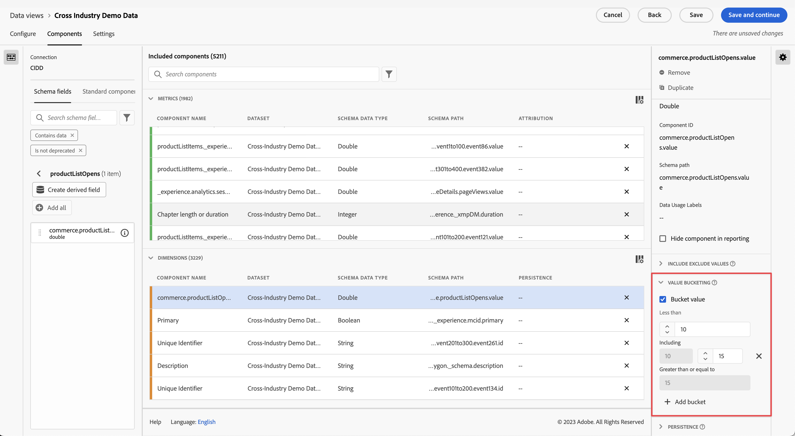

# 새 데이터 보기 만들기

>[!IMPORTANT]
>
>이 기능은 일반적으로 2021년 4월 22일에 제공됩니다.

데이터 보기를 만드는 작업에는 스키마 요소에서 지표와 차원을 만들거나 표준 구성 요소를 사용하는 작업이 포함됩니다. 지표나 차원을 만들면 상당히 유연하게 사용할 수 있습니다. 이전에는 Adobe Experience Platform에 데이터 세트가 있는 경우 문자열 필드가 차원과 숫자 필드로 사용되었다고 가정합니다. 이러한 필드를 변경하려면 플랫폼에서 스키마를 편집해야 합니다. 이제 데이터 뷰 UI에서 지표 및 차원 [에 대한 자유 형식 정의를 사용할 수 있습니다](/help/data-views/data-views.md). 자세한 사용 사례는 [데이터 보기 사용 사례](/help/data-views/data-views-usecases.md)를 참조하십시오.

## 1. 데이터 보기 설정 및 컨테이너 구성

1. Customer Journey Analytics에서 **[!UICONTROL 데이터 보기]** 탭으로 이동합니다.
2. **[!UICONTROL 추가]**&#x200B;를 클릭하여 새 데이터 보기를 만들고 해당 설정을 구성합니다.

| 설정 | 설명/사용 사례 |
| --- | --- |
| [!UICONTROL 연결] | 이 필드는 데이터 보기를 하나 이상의 Adobe Experience Platform 데이터 세트를 포함하는 이전에 설정한 연결에 연결합니다. |
| [!UICONTROL  이름 ] | 데이터 보기에 이름을 지정해야 합니다. |
| [!UICONTROL 설명] | 자세한 설명은 필수가 아니지만 권장됩니다. |
| [!UICONTROL 시간대] | 데이터를 표시할 시간대를 선택합니다. |
| [!UICONTROL 태그] | 태그를 사용하여 데이터 보기를 범주로 구성할 수 있습니다. |
| [!UICONTROL 컨테이너] | 여기에서 컨테이너 이름을 변경할 수 있으며 이 데이터 보기를 기반으로 하는 모든 Workspace 프로젝트에 컨테이너가 표시되는 방식입니다. 컨테이너는 범위 또는 컨텍스트의 범위를 넓히거나 좁히는 정도를 정의하기 위해 필터 및 폴아웃/흐름 등에 사용됩니다. [추가 정보](https://experienceleague.adobe.com/docs/analytics-platform/using/cja-components/cja-filters/filters-overview.html?lang=en#filter-containers) |
| [!UICONTROL 사람 컨테이너 이름:..] | [!UICONTROL 개인] (기본값). [!UICONTROL 사람] 컨테이너에는 지정된 기간 내의 방문자에 대한 모든 방문 및 페이지 보기가 포함됩니다. 이 이름을 &#39;사용자&#39; 또는 다른 용어로 바꿀 수 있습니다. |
| [!UICONTROL 세션 컨테이너 이름:..] | [!UICONTROL 세션] (기본값). [!UICONTROL 세션] 컨테이너를 사용하여 특정 세션에 대한 페이지 상호 작용, 캠페인 또는 전환을 식별할 수 있습니다. 이 이름을 &#39;방문&#39; 또는 원하는 다른 용어로 변경할 수 있습니다. |
| [!UICONTROL 이벤트 컨테이너 이름:..] | [!UICONTROL 이벤트] (기본값). [!UICONTROL Event] 컨테이너는 필터에서 포함하거나 제외할 페이지 이벤트를 정의합니다. |

다음으로 스키마 요소에서 지표와 차원을 만들 수 있습니다. 표준 구성 요소를 사용할 수도 있습니다.

## 2. 스키마 요소에서 지표 및 차원 만들기

1. [!UICONTROL Customer Journey Analytics] > [!UICONTROL 데이터 보기]에서 [!UICONTROL 구성 요소] 탭을 클릭합니다.

데이터 세트가 포함된 [!UICONTROL Connection]과 아래에 있는 [!UICONTROL 스키마 필드]를 볼 수 있습니다. 주의 사항:

* 이미 포함된 구성 요소는 표준 필수 구성 요소(시스템 생성)입니다.
* 기본적으로 **[!UICONTROL 데이터 포함]** 필터를 적용하므로 데이터가 포함된 스키마 필드만 표시됩니다. 데이터가 포함되지 않은 필드를 찾으려면 필터를 제거하십시오.

1. 이제 왼쪽 레일에서 지표 또는 Dimension 섹션으로 [!UICONTROL pageTitle] 등의 스키마 필드를 드래그합니다.

   동일한 스키마 필드를 차원 또는 지표 섹션으로 여러 번 드래그하고 다른 방법으로 동일한 차원이나 지표를 구성할 수 있습니다.
예를 들어 **[!UICONTROL pageTitle]** 필드에서 &quot;제품 페이지&quot;라는 차원 및 오른쪽의 **[!UICONTROL 구성 요소 이름]**&#x200B;의 이름을 변경하여 다른 &quot;오류 페이지&quot; 등을 만들 수 있습니다. **[!UICONTROL pageTitle]**;필드에서 문자열 값에서 지표를 만들 수도 있습니다. 예를 들어 서로 다른 속성 설정과 다른 포함/제외 값으로 하나 이상의 **[!UICONTROL 주문]** 지표를 만들 수 있습니다.

   

   >[!NOTE]
   >
   >왼쪽 레일의 전체 스키마 필드 폴더를 드래그할 수 있으며, 이 폴더는 자동으로 일반 섹션으로 정렬됩니다. 문자열 필드는 [!UICONTROL Dimension] 섹션에 도달하고 [!UICONTROL 지표] 섹션에 숫자를 입력합니다. 또는 **[!UICONTROL 모두 추가]**&#x200B;를 클릭하면 모든 스키마 필드가 추가됩니다.

1. 구성 요소를 선택하면 오른쪽에 다양한 설정이 표시됩니다. 아래 설명된 설정을 사용하여 구성 요소를 구성합니다.

### 구성 요소 설정 구성

| 설정 | 설명/사용 사례 |
| --- | --- |
| [!UICONTROL 구성 요소 유형] | 필수 여부. 구성 요소를 지표에서 Dimension으로 또는 그 반대로 변경할 수 있습니다. |
| [!UICONTROL 구성 요소 이름] | 필수 여부. Analysis Workspace에 표시할 친숙한 이름을 지정할 수 있습니다. 구성 요소의 이름을 변경하여 데이터 보기별 이름을 지정할 수 있습니다. |
| [!UICONTROL 설명] | 다른 사용자를 위해 구성 요소에 대한 정보를 제공하려면 선택 사항이지만 권장됩니다. |
| [!UICONTROL 태그] | 선택 사항입니다. Analysis Workspace UI에서 보다 쉽게 검색/필터링할 수 있도록 구성 요소에 사용자 지정 태그나 기본 태그로 태그를 지정할 수 있습니다. |
| [!UICONTROL 필드 이름] | 스키마 필드의 이름입니다. |
| [!UICONTROL 데이터 세트 유형] | 필수 여부. 구성 요소가 가져온 데이터 세트 유형(이벤트, 조회 또는 프로필)을 보여주는 편집 불가능한 필드입니다. |
| [!UICONTROL 데이터 집합] | 필수 여부. 구성 요소가 가져온 필드 유형(예: 문자열, 정수 등)을 보여주는 편집할 수 없는 필드입니다. 여러 보고서 세트를 결합하는 경우와 같이 이 필드에는 여러 데이터 세트가 포함될 수 있습니다. |
| [!UICONTROL 스키마 유형] | 구성 요소가 문자열, 정수 등인지 여부를 나타냅니다. |
| [!UICONTROL 구성 요소 ID] | 필수 여부. [CJA API](https://adobe.io/cja-apis/docs)에서는 이 필드를 사용하여 구성 요소를 참조합니다. 편집 아이콘을 클릭하고 이 구성 요소 ID를 수정할 수 있습니다. 그러나 이 구성 요소 ID를 변경하면 이 구성 요소가 포함된 기존의 모든 작업 영역 프로젝트가 중단됩니다. pageTitle 차원에 대해 다른 필드를 사용하는 다른 데이터 보기를 만든 경우 이름을 변경하고 차원 간 데이터 보기를 호환되게 만들 수 있습니다. |
| [!UICONTROL 경로] | 필수 여부. 구성 요소가 가져온 스키마 경로를 보여 주는 편집할 수 없는 필드입니다. |
| [!UICONTROL 보고에서 구성 요소 숨기기] | 기본값 = off. 보고에 사용할 때 데이터 보기에서 구성 요소를 조정할 수 있습니다. 이는 사용 권한에 영향을 주지 않고 구성 요소 조정에만 영향을 줍니다. 즉, 보고에 관리자가 아닌 사용자로부터 구성 요소를 숨길 수 있습니다. 관리자는 Analysis Workspace 프로젝트에서 [!UICONTROL 모든 구성 요소 표시]를 클릭하여 계속 액세스할 수 있습니다. |

### 형식 설정 구성

형식 설정은 지표에만 적용됩니다.

| 설정 | 설명/사용 사례 |
| --- | --- |
| [!UICONTROL 형식] | 지표의 서식을 십진수, 시간,% 또는 통화로 지정할 수 있습니다. |
| [!UICONTROL 소수점 이하 자리 수] | 지표에 표시할 소수 자릿수를 지정할 수 있습니다. |
| [!UICONTROL 증가 트렌드를 다음으로 표시] | 이 지표의 증가 트렌드를 좋은(녹색) 또는 나쁜(빨간색)으로 간주할지 여부를 지정할 수 있습니다. |
| [!UICONTROL 통화] | 이 설정은 선택한 지표 형식이 [!UICONTROL 통화]인 경우에만 나타납니다. 통화 옵션 목록을 사용할 수 있습니다. 기본값은 통화 없음입니다. 이렇게 하면 보고서에서 원하는 통화로 매출을 나타낼 수 있습니다. 이는 통화 전환이 아니라 UI 서식 옵션일 뿐입니다. |

### 속성 설정 구성

| 설정 | 설명/사용 사례 |
| --- | --- |
| [!UICONTROL 속성 설정] | 이 지표를 사용할 때 기본적으로 이 지표에 적용할 속성 설정을 지정할 수 있습니다. 이 기본값은 자유 형식 테이블 또는 계산된 지표에서 재정의할 수 있습니다. |
| [!UICONTROL 속성 모델] | 기본 속성 모델을 지정할 수 있습니다. 기본이 아닌 속성 모델 사용] 설정을 활성화할 때만 활성화됩니다. [!UICONTROL  기본값은 [!UICONTROL 마지막 터치]입니다. 옵션은 다음과 같습니다.마지막 터치, 첫 번째 터치, 선형, 기여도, 동일한 터치, U 모양, J 곡선, 역 J, 시간 감소, 사용자 지정, 알고리즘. 이러한 옵션 중 일부는 [사용자 정의] 또는 [시간 감소]와 같이 채워야 하는 추가 필드를 만듭니다. 동일한 필드를 사용하여 여러 지표를 만들 수 있습니다. 즉, 한 개의 [!UICONTROL 마지막 접촉] 매출 지표와 한 개의 [!UICONTROL 첫 번째 접촉] 매출 지표를 사용할 수 있지만 스키마의 동일한 매출 필드를 기반으로 할 수 있습니다. |
| [!UICONTROL 전환 확인 기간] | 기본 전환 창을 지표에 지정할 수 있습니다. 이 창은 [!UICONTROL 기본이 아닌 속성 모델 사용] 설정을 활성화할 때만 활성화됩니다. 옵션은 다음과 같습니다.개인(보고 창), 세션, 사용자 지정. [사용자 정의]를 선택하면 원하는 일 수/주/월 수 등을 선택할 수도 있습니다. (최대 90일), 마치 Attribution IQ과 같습니다. 동일한 스키마 필드를 사용하여 여러 지표를 가질 수 있지만 각 지표에는 별도의 조회 창이 있습니다. |

### 포함/제외 값 설정 구성

이 설정을 사용하면 쿼리 시간에 보고 중인 기본 데이터를 수정할 수 있습니다. 필터(이전의 세그먼트라고 함)와 동일하지 않습니다. 그러나 필터는 경로 지정 및 속성을 준수하며 이 새로운 차원을 따릅니다.

예를 들어 pageTitle 필드에서 차원을 만들 수 있지만, &quot;오류 페이지&quot;라고 호출하고 [!UICONTROL 에 ] &quot;error&quot; 구문이 포함된 페이지를 포함할 수 있습니다.

| 설정 | 설명/사용 사례 |
| --- | --- |
| [!UICONTROL 대소문자 구분] | 기본값 = 켜짐. 이 설정은 [!UICONTROL 값 포함/제외] 섹션에만 적용됩니다. 적용 중인 포함/제외 규칙이 대/소문자를 구분해야 하는지 여부를 지정할 수 있습니다. |
| [!UICONTROL 일치] | 어트리뷰션 및 세그멘테이션 전에 보고할 때 고려할 값을 지정할 수 있습니다(예: &quot;error&quot; 구문을 포함하는 값만 사용). 다음을 지정할 수 있습니다.**[!UICONTROL 모든 기준이 충족되는 경우]** 또는 **[!UICONTROL 기준이 충족되는 경우]** |
| [!UICONTROL 기준] | 특정 필터 규칙에 적용할 일치 논리를 지정할 수 있습니다.<ul><li>**문자열**:구문 포함, 용어 포함, 모든 용어 포함, 용어 포함 안 함, 구문 포함 안 함, 같음, 같지 않음, 다음으로 시작, 다음으로 끝남</li><li>**이중/정수**:같음, 같지 않음, 크거나 같음, 작거나 같음, 크거나 같음</li><li>**날짜**:같음, 같지 않음, 이전 이후, 다음 사이</li></ul> |
| [!UICONTROL 피연산자 일치] | 일치 연산자를 적용할 일치 피연산자를 지정할 수 있습니다.<ul><li>**문자열**:텍스트 필드</li><li>**이중/정수**:숫자 값에 대한 위쪽/아래쪽 화살표가 있는 텍스트 필드</li><li>**날짜**:일 세부기간 선택기(달력)</li><li>**날짜 시간**:날짜 및 시간 세부기간 선택기</li></ul> |
| [!UICONTROL 규칙 추가] | 추가 일치 연산자와 피연산자를 지정할 수 있습니다. |

### 동작 설정 구성

| 설정 | 설명/사용 사례 |
| --- | --- |
| [!UICONTROL 인스턴스 계산] | 지표로 사용되는 숫자 또는 날짜 유형 필드가 값 자체가 아닌 설정된 시간을 계산해야 하는지 여부를 지정할 수 있습니다.  숫자 필드의 인스턴스를 추가하고 필드의 실제 값이 아닌 필드가 설정된 횟수를  ** 간단히 추가하려는 경우. 이 기능은 예를 들어 매출   필드에서 Ordersmetric  을 만드는 데 유용합니다. 매출이 설정된 경우 숫자 매출 금액이 아닌 단일 주문 1개를 카운트하려고 합니다. |

### [!UICONTROL 값 옵션 없음] 설정 구성

[!UICONTROL [값 ] 옵션 없음] 설정은 보고에서   지정되지 않음 또는   비값 설정과 유사합니다. 데이터 뷰 UI에서 구성 요소별로 이러한 값을 보고 시 처리하는 방법을 결정할 수 있습니다. [!UICONTROL No 값]은(는) [!UICONTROL Null], [!UICONTROL Not set] 또는 다른 것과 같이 환경에 더 적합한 이름으로 이름을 바꿀 수도 있습니다.

또한 이 필드에 지정하는 모든 항목은 [!UICONTROL 값 옵션 없음] 설정에 명시된 대로 보고의 [!UICONTROL 값 없음] 라인 항목에 대한 특수 UI 처리에 사용할 수 있습니다.

| 설정 | 설명/사용 사례 |
| --- | --- |
| [!UICONTROL 표시된 경우 값 없음...을 호출합니다.] | 여기서 **[!UICONTROL 값]**&#x200B;을 다른 이름으로 변경할 수 있습니다. |
| [!UICONTROL 기본적으로 값 없음 표시 안 함] | 보고에 이 값을 표시하지 않습니다. |
| [!UICONTROL 기본적으로 값 없음 표시] | 보고에 이 값을 표시합니다. |
| [!UICONTROL 값을 값으로 처리] | 이 설정은 데이터의 빈 값을 [!UICONTROL 이(가) 표시되면 값 없음...]. 예를 들어 모바일 장치 유형이 차원으로 있는 경우 **[!UICONTROL No value]** 항목의 이름을 &quot;Desktop&quot;으로 바꿀 수 있습니다. 이 필드를 사용자 지정 값으로 변경하면 사용자 지정 값이 올바른 문자열 값으로 간주됩니다. 따라서 이 필드에 &quot;Red&quot; 값을 입력하면 데이터 자체에 나타나는 문자열 &quot;Red&quot;의 모든 인스턴스가 지정한 라인 항목 아래에도 롤링됩니다. |

### 지속성 설정 구성

자세한 내용은 [지속성](/help/data-views/persistence.md)에 대한 항목을 참조하십시오.

| 설정 | 설명/사용 사례 |
| --- | --- |
| [!UICONTROL 지속성 설정] | 키 켜기/끄기 |
| [!UICONTROL 할당] | 지속성을 위해 차원에 사용된 할당 모델을 지정할 수 있습니다. 옵션은 다음과 같습니다.[!UICONTROL 가장 최근], [!UICONTROL 원본], [!UICONTROL 인스턴스], [!UICONTROL 모두]입니다. 기존 Analytics의 eVar와 유사한 값을 지속하려면 이 값을 설정해야 합니다. 단 하나의 주요 차이점은 설정할 수 있는 최대 지속성은 90일입니다. 또한 [!UICONTROL 만료되지 않음]은 옵션이 아닙니다. |
| [!UICONTROL 만료] | 차원에 대한 지속성 창을 지정할 수 있습니다. 옵션은 다음과 같습니다.[!UICONTROL 세션](기본값), [!UICONTROL 사람], [!UICONTROL 시간], [!UICONTROL 지표]. 구매(예: 내부 검색어 또는 다른 머천다이징 사용 사례) 시 차원을 만료할 수 있어야 합니다. [!UICONTROL 지표] 를 사용하여 정의된 지표를 이 차원의 만료(예: 구매 지표)로   지정할 수 있습니다. |

### 값 버킷 설정 구성

예를 들어, &#39;5에서 최대 10까지&#39;의 버킷은 Workspace 보고에서 라인 항목 &#39;5~10&#39;으로 표시됩니다.

| 설정 | 설명/사용 사례 |
| --- | --- |
| [!UICONTROL 버킷 값] | 숫자 차원의 버킷 버전을 만들 수 있습니다. 이를 통해 보고의 차원으로 매출 버킷 또는 기타 숫자 값에 대해 보고할 수 있습니다. |
| [!UICONTROL 최대] | 첫 번째 숫자 차원 버킷의 경계를 지정할 수 있습니다. 이것은 숫자 차원에만 적용됩니다. |
| [!UICONTROL 최대 간격 및] | 후속 숫자 차원 버킷의 경계를 지정할 수 있습니다. |
| [!UICONTROL 버킷 추가] | 숫자 차원 버킷에 다른 버킷을 추가할 수 있습니다. |

### [!UICONTROL 표준 구성 요소] 사용

스키마 요소에서 지표와 차원을 만드는 것 외에도 데이터 보기에서 표준 구성 요소를 사용할 수도 있습니다.

[!UICONTROL 표준 ] 구성 요소는 데이터 세트 스키마 필드에서 생성되지 않고 대신 시스템에서 생성된 구성 요소입니다. Analysis Workspace의 보고 기능을 용이하게 하려면 데이터 보기에 일부 시스템 구성 요소가 필요한 반면 다른 시스템 구성 요소는 선택 사항입니다.

필수 표준 구성 요소는 기본적으로 데이터 보기에 추가됩니다.

| 구성 요소 이름 | Dimension 또는 지표 | 참고 |
| --- | --- | --- |
| [!UICONTROL 사람] | 지표 | 이 지표는 연결에 지정된 개인 ID를 기반으로 합니다. |
| [!UICONTROL 세션] | 지표 | 이 지표는 아래에 지정된 세션 설정을 기반으로 합니다. |
| [!UICONTROL 이벤트] | 지표 | 이 지표는 연결에 있는 모든 이벤트 데이터 세트에서 행 수를 나타냅니다. |
| [!UICONTROL 일] | 차원 | &#39;일&#39; 차원은 지정된 지표가 발생한 날을 보고합니다. 첫 번째 차원 항목은 날짜 범위에서 첫 번째 일이고 마지막 차원 항목은 날짜 범위에서 마지막 일입니다. |
| [!UICONTROL 주] | 차원 | &#39;주&#39; 차원은 지정된 지표가 발생한 주를 보고합니다. 첫 번째 차원 항목은 날짜 범위에서 첫 번째 주이고 마지막 차원 항목은 날짜 범위에서 마지막 주입니다. |
| [!UICONTROL 월] | 차원 | 월 차원은 지정된 지표가 발생한 월을 보고합니다. 첫 번째 차원 항목은 날짜 범위에서 첫 번째 월이고 마지막 차원 항목은 날짜 범위에서 마지막 월입니다. |
| [!UICONTROL 분기] | 차원 | &#39;분기&#39; 차원은 지정된 지표가 발생한 분기를 보고합니다. 첫 번째 차원 항목은 날짜 범위에서 첫 번째 분기이고 마지막 차원 항목은 날짜 범위에서 마지막 분기입니다. |
| [!UICONTROL 년] | 차원 | &#39;연도&#39; 차원은 지정된 지표가 발생한 연도를 보고합니다. 첫 번째 차원 항목은 날짜 범위에서 첫 번째 해이고 마지막 차원 항목은 날짜 범위에서 가장 최근 연도입니다. |
| [!UICONTROL 시간] | 차원 | &#39;시간&#39; 차원은 주어진 지표가 발생한 시간(반올림됨)을 보고합니다. 첫 번째 차원 항목은 날짜 범위에서 첫 번째 시간이고 마지막 차원 항목은 날짜 범위에서 마지막 시간입니다. |
| [!UICONTROL 분] | 차원 | &#39;분&#39; 차원은 주어진 지표가 발생한 분(반올림됨)을 보고합니다. 첫 번째 차원 항목은 날짜 범위에서 첫 번째 분이고 마지막 차원 항목은 날짜 범위에서 마지막 분입니다. |

### 선택적 표준 구성 요소

선택적 표준 구성 요소는 **[!UICONTROL 표준 구성 요소]** 탭에서 사용할 수 있습니다.

| 구성 요소 이름 | Dimension 또는 지표 | 참고 |
| --- | --- | --- |
| [!UICONTROL 세션 시작] | 지표 | 이 지표는 세션의 첫 번째 이벤트였던 이벤트 수를 카운트합니다. 필터 정의에 사용될 때(예:&#39;[!UICONTROL 세션 시작] 존재&#39;)은 모든 세션의 첫 번째 이벤트로 필터링됩니다. |
| [!UICONTROL 세션 종료] | 지표 | 이 지표는 세션의 마지막 이벤트였던 이벤트 수를 카운트합니다. [!UICONTROL 세션 시작]과 유사하게, 필터 정의에서 모든 세션의 마지막 이벤트로 항목을 필터링하는 데 사용할 수도 있습니다. |
| [!UICONTROL 소비한 시간(초)] | 지표 | [!UICONTROL 체류 시간] 지표는 한 차원에 대해 두 개의 다른 값 사이의 시간을 추가합니다. |
| [!UICONTROL 이벤트당 소비한 시간] | 차원 | [!UICONTROL 이벤트당 체류 시간] 은 시간  [!UICONTROL 지표를 이벤트 ] 버킷에   버킷합니다. |
| [!UICONTROL 세션당 소비한 시간] | 차원 | [!UICONTROL 세션당 체류 시간] 은 시간  [!UICONTROL 지표를 세션 버킷] 에   버킷합니다. |
| [!UICONTROL 사용자당 소비한 시간] | 차원 | [!UICONTROL [개인당 ] 체류 시간]은 [ [!UICONTROL 시간 ] 지표]를   개인 버킷으로 버킷합니다. |
| [!UICONTROL 일괄 처리 ID] | 차원 | [!UICONTROL 이벤트]가 포함된 Experience Platform 배치를 나타냅니다. |
| [!UICONTROL 데이터 세트 ID] | 차원 | [!UICONTROL 이벤트]가 포함된 Experience Platform 데이터 집합을 나타냅니다. |

### 스키마 필드 및 차원/지표 필터링

다음 데이터 유형별로 왼쪽 레일의 스키마 필드를 필터링할 수 있습니다.

데이터 집합에 의해 필터링하거나 스키마 필드에 데이터가 포함되었는지 또는 ID인지 여부를 기준으로 필터링할 수도 있습니다. 기본적으로 **[!UICONTROL 데이터 포함]** 필터를 모든 데이터 보기에 적용합니다.

## 3. 데이터 보기에 글로벌 필터를 추가합니다.

전체 데이터 보기에 적용되는 필터를 추가할 수 있습니다. 이 필터는 Workspace에서 실행하는 모든 보고서에 적용됩니다.

1. [!UICONTROL 데이터 보기]에서 [!UICONTROL 설정] 탭을 클릭합니다.
1. 왼쪽 레일의 목록에서 [!UICONTROL 필터 추가] 필드로 필터를 드래그합니다.
