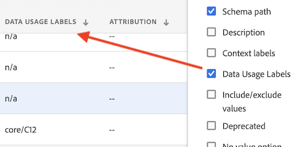

# 레이블 및 정책

Experience Platform에서 데이터 세트를 생성할 때 데이터 세트의 일부 또는 모든 요소에 대한 [데이터 사용 레이블](https://experienceleague.adobe.com/docs/experience-platform/data-governance/labels/reference.html?lang=ko)을 생성할 수 있습니다. Customer Journey Analytics에서 이러한 레이블과 정책을 볼 수 있습니다.

다음 레이블은 Customer Journey Analytics에서 특히 중요합니다.

* `C8`레이블 - **[!UICONTROL 측정 값이 없음]**. 이 레이블은 데이터를 조직의 웹 사이트나 앱에서 분석에 사용할 수 없음을 의미합니다.

* `C12`레이블 - **[!UICONTROL 일반 데이터 내보내기 없음]**. 이 방식으로 레이블이 지정된 스키마 필드는 보고, 내보내기, API 등을 통해 Customer Journey Analytics에서 내보내거나 다운로드할 수 없습니다.

>[!NOTE]
>
>데이터 사용 레이블은 결합된 데이터 세트에 자동으로 전파되지 않습니다. 그러나 수동으로 추가할 수는 있습니다.

레이블 지정 자체가 이러한 데이터 사용 레이블이 시행됨을 의미하지는 않습니다. 이를 위해 정책이 사용됩니다. [Experience Platform UI](https://experienceleague.adobe.com/docs/experience-platform/data-governance/policies/user-guide.html?lang=ko)를 사용하거나 Experience Platform의 [Policy Service API](https://experienceleague.adobe.com/docs/experience-platform/data-governance/api/overview.html?lang=ko)를 통해 정책을 만듭니다.

Customer Journey Analytics에는 보고 및 다운로드/공유에 영향을 미치는 Adobe에서 정의한 두 가지 정책이 있습니다.

* **[!UICONTROL 분석 시행]** 정책
* **[!UICONTROL 다운로드 시행]** 정책

## Customer Journey Analytics 데이터 보기에서 데이터 레이블 보기

Experience Platform에서 생성된 데이터 레이블은 데이터 보기 사용자 인터페이스의 3개 위치에 표시됩니다.

| 위치 | 설명 |
| --- | --- |
| 스키마 필드의 정보 버튼 | 이 버튼을 클릭하면 현재 필드에 적용되는 [!UICONTROL 데이터 사용 레이블]이 표시됩니다.
 |
| [구성 요소 설정](/help/data-views/component-settings/overview.md) 아래의 오른쪽 레일 | 모든 [!UICONTROL 데이터 사용 레이블]이 여기에 나열됩니다.
 |
| 데이터 레이블을 열로 추가 | 데이터 보기의 [!UICONTROL 포함된 구성 요소] 열에 [!UICONTROL 데이터 사용 레이블]을 열로 추가할 수 있습니다. 열 선택기 아이콘을 클릭하고 **[!UICONTROL 데이터 사용 레이블]**&#x200B;을 선택하면 됩니다.
 |

{style="table-layout:auto"}

## 데이터 보기에서 데이터 거버넌스 레이블 필터링

데이터 보기 편집기에서 왼쪽 레일에 있는 [!UICONTROL 필터] 아이콘을 클릭하여 **[!UICONTROL 데이터 거버넌스]** 및 **[!UICONTROL 레이블]** 유형별로 데이터 보기 구성 요소를 필터링합니다.

**[!UICONTROL 적용]**&#x200B;을 클릭하여 레이블이 부착된 구성 요소를 확인합니다.

## 데이터 보기에서 데이터 거버넌스 정책 필터링

분석 또는 내보내기 목적으로 특정 Customer Journey Analytics 데이터 보기 요소의 사용을 차단하는 정책이 활성화되어 있는지 확인할 수 있습니다.

다시 왼쪽 레일에 있는 [!UICONTROL 필터] 아이콘을 클릭한 다음 **[!UICONTROL 데이터 거버넌스]**&#x200B;에서 **[!UICONTROL 정책]**&#x200B;을 클릭합니다.

**[!UICONTROL 적용]**&#x200B;을 클릭하여 활성화된 정책을 확인합니다.

## 활성화된 정책이 데이터 보기에 미치는 영향

**[!UICONTROL 분석 시행]** 또는 **[!UICONTROL 다운로드 시행]** 정책이 활성화되면 특정 데이터 레이블(예: C8 또는 C12)이 관련된 스키마 구성 요소를 데이터 보기에 추가할 수 없습니다.

이러한 구성 요소는 왼쪽 레일 [!UICONTROL 스키마 필드] 목록에서 회색으로 표시됩니다.

또한 차단된 필드가 있는 데이터 보기는 저장할 수 없습니다.

>[!MORELIKETHIS]
>[중요한 데이터 다운로드](/help/analysis-workspace/export/download-send.md)

>[!MORELIKETHIS]
>[Report Builder의 제한된 레이블은 무엇입니까?](https://experienceleague.adobe.com/docs/analytics-platform/using/cja-reportbuilder/restricted-labels.html?lang=ko)

