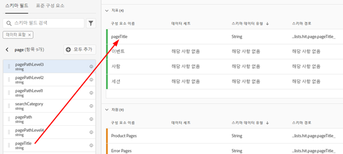
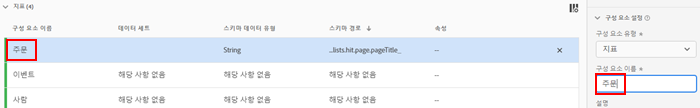
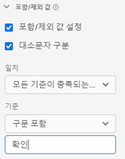
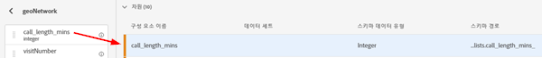
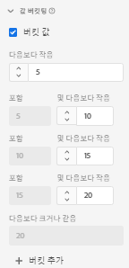
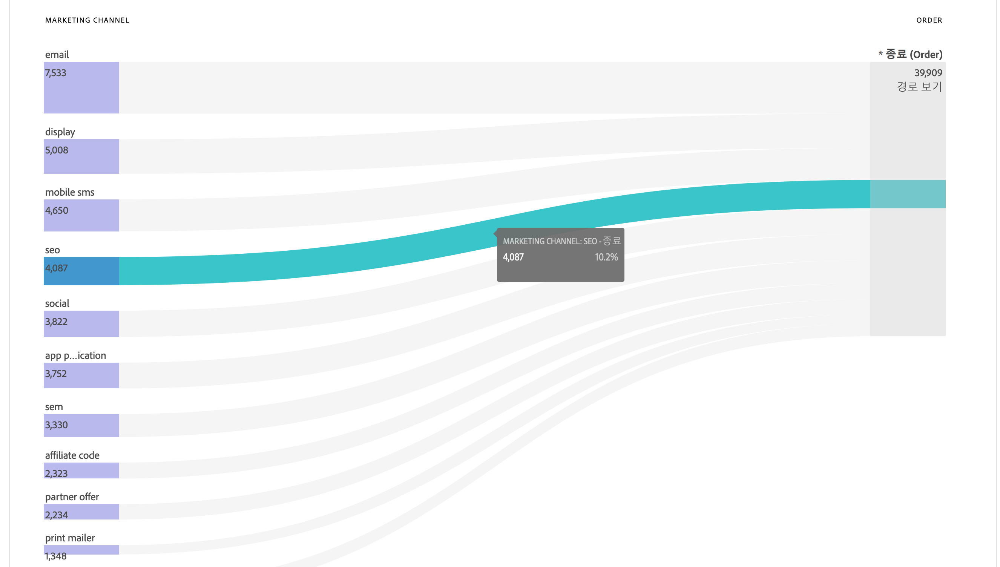
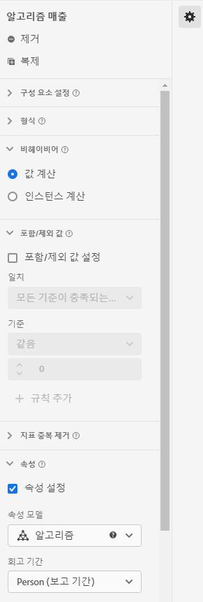

# 데이터 보기 활용 사례

이러한 활용 사례는 Customer Journey Analytics에서 데이터 보기의 유연성과 성능을 보여 줍니다.

## 1. 문자열 스키마 필드로부터 지표 만들기

예를 들어 데이터 보기를 생성할 때 문자열인 [!UICONTROL pageTitle] 스키마 필드에서 [!UICONTROL 주문] 지표를 생성할 수 있습니다. 단계는 다음과 같습니다.

1. 구성 요소 탭의 [!UICONTROL 포함된 구성 요소] 아래의 [!UICONTROL 지표] 섹션으로 [!UICONTROL pageTitle]을 끌어옵니다.
   
1. 이제 방금 끌어온 지표를 강조 표시하고 오른쪽의 [!UICONTROL 구성 요소 설정]에서 이름을 바꿉니다.
   
1. 오른쪽의 [!UICONTROL 포함/제외 값] 대화 상자를 열고 다음을 지정합니다.
   

   &quot;확인&quot; 구문은 이것이 주문임을 나타냅니다. 해당 기준이 충족되는 모든 페이지 제목을 검토한 후 각 인스턴스에 대해 &quot;1&quot;이 계산됩니다. 결과는 새 지표입니다(계산된 지표가 아님). 포함/제외된 값이 포함된 지표는 다른 지표를 사용할 수 있는 모든 곳에서 사용할 수 있습니다. Attribution IQ, 필터 및 표준 지표를 사용할 수 있는 모든 곳에서 작동합니다.
1. [!UICONTROL 세션]의 [!UICONTROL 전환 확인 기간]을 사용하여 [!UICONTROL 마지막 터치]와 같은 이 지표에 대한 속성 모델을 추가로 지정할 수 있습니다.
또한 동일한 필드에서 다른 [!UICONTROL 주문] 지표를 만들고 [!UICONTROL 첫 번째 터치]와 같은 다른 속성 모델과 [!UICONTROL 30일] 같은 다른 [!UICONTROL 전환 확인 기간]을 지정할 수 있습니다.

또 다른 예는 회사에서 얼마나 많은 방문자 ID를 보유하는지 결정하는 지표로, 차원으로서의 방문자 ID 사용하는 것입니다.

## 2. 정수를 차원으로 사용

이전에는 정수가 자동으로 CJA에서 지표로 처리되었습니다. 이제 숫자(Adobe Analytics의 사용자 지정 이벤트 포함)를 차원으로 처리할 수 있습니다. 다음은 한 예입니다.

1. [!UICONTROL 포함된 구성 요소] 아래의 [!UICONTROL 차원] 섹션으로 [!UICONTROL call_length_min] 정수를 끌어옵니다.

   

1. 이제 [!UICONTROL 값 버킷팅]을 추가하여 이 차원을 버킷 방식으로 보고에 표시할 수 있습니다. (버킷이 없으면 이 차원의 각 인스턴스가 Workspace 보고에 라인 항목으로 나타납니다.)

   

## 3. 플로우 다이어그램에서 &quot;지표&quot;로서 수치 차원 사용

수치 차원을 사용하여 &quot;지표&quot;를 [!UICONTROL  플로우] 시각화에 나타낼 수 있습니다.

1. 데이터 보기 [구성 요소](https://experienceleague.adobe.com/docs/analytics-platform/using/cja-dataviews/create-dataview.html?lang=ko-KR#configure-component-settings) 탭에서 [!UICONTROL 마케팅 채널] 스키마 필드를 [!UICONTROL 포함된 구성 요소] 아래의 [!UICONTROL 지표] 영역으로 드래그합니다.
2. Workspace 보고에서 이 플로우는 [!UICONTROL 마케팅 채널]이 [!UICONTROL 주문]으로 흘러가는 모습을 보여 줍니다.

## 4. 하위 이벤트 필터링 수행

이 기능은 특히 배열 기반 필드에 적용 가능합니다. 필터 빌더에 내장된 필터(세그먼트)는 이벤트 수준에서만 필터링할 수 있지만 포함/제외 기능을 사용하면 하위 이벤트 수준에서 필터링을 수행할 수 있습니다. 따라서 데이터 보기에서 포함/제외를 사용하여 하위 이벤트 필터링을 수행한 뒤 이벤트 수준에서 필터 내 이 새 지표/차원을 참고할 수 있습니다.

예를 들어 데이터 보기에서 포함/제외 기능을 사용하여 50달러가 넘는 매출을 생성한 제품만 중점적으로 살펴볼 수 있습니다. 그러므로 50달러 제품 구매와 25달러 제품 구매를 포함하는 주문이 있는 경우, 전체 주문이 아니라 25달러 제품 구매만 제외시키는 것입니다.

1. 데이터 보기 [구성 요소](https://experienceleague.adobe.com/docs/analytics-platform/using/cja-dataviews/create-dataview.html?lang=en#configure-component-settings) 탭에서 [!UICONTROL 수입] 스키마 필드를 [!UICONTROL 포함된 구성 요소] 아래의 [!UICONTROL 지표] 영역으로 드래그합니다.
1. 지표를 선택하고 오른쪽에 다음 내용을 구성합니다.
a. [!UICONTROL 형식]에서 [!UICONTROL 통화]를 선택합니다.
나. [!UICONTROL 통화]에서 USD를 선택합니다.
c. [!UICONTROL 값 포함/제외]에서 [!UICONTROL 포함/제외 값 설정] 옆에 있는 확인란을 선택합니다.
d. [!UICONTROL Match]에서 [!UICONTROL 모든 기준이 충족되는 경우]을 선택합니다.
e. [!UICONTROL 기준]에서 [!UICONTROL 이]보다 크거나 같음을 선택합니다.
f. &quot;50&quot;을 값으로 지정합니다.

이러한 새 설정을 사용해, 고가치 매출만 볼 수 있으며 50달러 미만인 모든 항목을 배제할 수 있습니다.

## 5. [!UICONTROL 값 옵션 없음] 설정 사용

사용자들을 열심히 트레이닝할 때, 보고서에 &quot;지정되지 않음&quot;이 사용된다고 설명한 회사도 있을 것입니다. 데이터 보기에서 기본값은 &quot;값 없음&quot;입니다. 이제 데이터 보기 UI에서 [&quot;값 없음&quot;의 이름을 &quot;지정되지 않음&quot;으로 변경](https://experienceleague.adobe.com/docs/analytics-platform/using/cja-dataviews/create-dataview.html?lang=ko-KR#configure-no-value-options-settings)할 수 있습니다.

또 다른 예로 멤버십 프로그램 등록에 대한 차원을 들 수 있습니다. 이 경우에서는 &quot;값 없음&quot;의 이름을 &quot;멤버십 프로그램 등록 없음&quot;으로 변경할 수 있습니다.

## 6. 다양한 [!UICONTROL 속성] 설정을 사용하여 다수의 지표 만들기

오른쪽 상단의 [!UICONTROL 복제] 기능을 사용하여 [!UICONTROL 첫 번째 터치], [!UICONTROL 마지막 터치], [!UICONTROL 알고리즘] 속성과 같은 다양한 속성 설정을 갖는 다수의 매출 지표를 만듭니다.

이때 각 지표의 이름을 &quot;알고리즘 매출&quot;과 같이 그 차이가 반영되도록 변경해야 합니다.

다른 데이터 보기 설정에 대한 자세한 내용은 [데이터 보기 만들기](/help/data-views/create-dataview.md)를 참조하십시오.
데이터 보기의 개념적인 개요는 [데이터 보기 개요](/help/data-views/data-views.md)를 참조하십시오.
