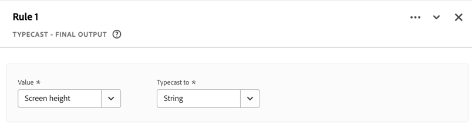

# 파생 필드(제한된 테스트){#derived-fields}

{{release-limited-testing}}

>[!IMPORTANT]
>
>이는 아직 일반적으로 사용할 수 없는 새로운 파생된 필드 함수에 대한 사전 설명서입니다. 이 정보를 사용하여 새로 파생된 필드 함수에 대해 알아봅니다. 이 설명서는 여전히 변경될 수 있으며 이 문서의 현재 버전에서 파생될 수 있는 법적 의무는 없습니다.
>&#x200B;> 일반적으로 파생된 필드 기능과 현재 사용 가능한 릴리스 함수 및 함수 템플릿에 대한 정보는 [파생된 필드](derived-fields.md)을(를) 참조하십시오.
>

## 함수 참조

{{select-package}}

지원되는 각 함수에 대한 자세한 내용은 아래에서 확인하십시오.

- 사양:
   - 입력 데이터 유형: 지원되는 데이터 유형
   - 입력: 입력에 가능한 값
   - 포함된 연산자: 이 함수에 지원되는 연산자(있는 경우)
   - 제한 사항: 이 특정 함수에 적용되는 제한 사항
   - 출력.

- 다음을 포함한 사용 사례:
   - (선택 사항) 파생 필드를 정의하기 전의 데이터입니다.
   - 파생 필드를 정의하는 방법
   - (선택 사항) 파생된 필드를 정의한 후의 데이터입니다.

- 제한(해당되는 경우).

<!-- DATE MATH -->

### 날짜 수학 {#datemath}

>[!CONTEXTUALHELP]
>id="dataview_derivedfields_datemath"
>title="날짜 수학"
>abstract="이 함수는 두 날짜 또는 날짜-시간 필드 간의 차이를 반환하는 기능을 제공합니다."

두 날짜 또는 두 날짜-시간 필드 간의 차이를 반환합니다.

+++ 세부 사항

## 사양 {#datemath-io}

| 입력 데이터 유형 | 입력 | 포함된 연산자 | 제한 사항 | 출력 |
|---|---|---|---|---|
| <ul><li>날짜</li><li>날짜-시간</li></ul> | <ul><li>[!UICONTROL 범위]<ul><li>이벤트</li><li>세션</li><li>개인</li></ul></li><li>[!UICONTROL 값]:<ul><li>날짜</li><li>날짜-시간</li><li>정적 날짜(사용자 입력)</li><li>정적 날짜-시간(사용자 입력)</li><li>동적 날짜<ul><li>오늘</li></ul></li><li>동적 날짜-시간<ul><li>지금</li></ul></li></ul></li><li>[!UICONTROL 세부 기간]:<ul><li>초</li><li>분</li><li>시간</li><li>일</li><li>주</li><li>개월</li><li>분기</li><li>년</li></ul></li><li>각 날짜 또는 날짜-시간 반환에 대해:<ul><li>첫 번째(세션 또는 사용자 내)</li><li>마지막(세션 또는 사용자 내)</li></ul></li></ul> | 
해당 사항 없음
 | 
파생 필드당 2개 함수
 | 
새 파생 필드
 |

{style="table-layout:auto"}

## 사용 사례 1 {#datemath-uc1}

호텔 회사의 마케팅 분석가는 지난 주 고객 체크인 날짜와 예약 날짜 사이의 일 수 차이를 이해하려고 합니다.

### 파생 필드 {#datemath-uc1-derivedfield}

`Days between booking and check-in` 파생 필드를 정의합니다. [!UICONTROL DATE MATH] 함수를 사용하여 [!UICONTROL 예약 날짜]와(과) [!DNL Person]체크인 날짜[!UICONTROL &#x200B; 사이의 &#x200B;]범위에 대한 요일을 계산하는 규칙을 정의합니다. [!UICONTROL 일]을(를) [!UICONTROL 출력 세부 기간]&#x200B;(으)로 선택합니다. [!UICONTROL 예약 날짜]와(과) [!UICONTROL 체크인 날짜] 모두에 대해 [!UICONTROL 마지막 반환]을(를) 선택하여 마지막 사용자 범위 값이 계산에 사용되도록 합니다.

## 사용 사례 2 {#datemath-uc2}

오프라인 매장의 마케팅 분석가로서 당신은 며칠 전 고객이 매장을 마지막으로 방문한 것을 알고 싶다. 모바일 앱 내의 지리적 위치 기능과 상점의 비콘을 사용하여 고객의 실제 방문을 캡처합니다.

### 파생 필드 {#datemath-uc2-derivedfield}

새 `Days Since Visit To Shop` 파생 필드를 정의합니다. [!UICONTROL DATE MATH] 함수를 사용하여 [!UICONTROL Person]의 [!UICONTROL 중복 제거 범위]&#x200B;(으)로 사용자 지정 날짜-시간([!UICONTROL Date]에 지정)과 [!UICONTROL 로컬 시간]&#x200B;([!UICONTROL 이벤트 데이터 집합의 placeContext] 필드 그룹) 사이의 일수를 계산하는 규칙을 정의합니다. [!UICONTROL 마지막 반환]을 선택하여 [!UICONTROL 현지 시간]에 대한 마지막 개인 범위 값을 계산에 사용하도록 합니다. 일을 [!UICONTROL 출력 세부 기간]&#x200B;(으)로 선택합니다.

## 사용 사례 3 {#datemath-uc3}

세션 내의 고객이 주문하기 전에 검색 시간을 분 단위로 이해하려고 합니다.

`Time Between Search And Order In Minutes`검색 시간[[!UICONTROL &#x200B; 및 &#x200B;]주문 시간](#case-when) 값을 정의하기 위해 두 개의 [!UICONTROL CASE WHEN] 함수[!UICONTROL 의 결과인 새 &#x200B;] 파생 필드를 정의합니다.
그런 다음 이 두 값을 사용하여 [!UICONTROL 범위]이 [!UICONTROL 세션], 값이 [!UICONTROL 검색 시간], [!UICONTROL 주문 시간], [!UICONTROL 출력 세부 기간]이 [!UICONTROL 분]&#x200B;(으)로 설정된 [!UICONTROL 날짜 계산] 함수의 차이를 계산합니다. 두 값 모두에 대해 [!UICONTROL 첫 번째 &#x200B;] 반환을 선택하여 첫 번째 [!UICONTROL 검색 시간] 및 [!UICONTROL 주문 시간]이 반환되도록 합니다.

날짜 계산 규칙 3의 

<!--
| Visitor ID | Marketing Channel | Events |
|----|---|---:|
| ABC123 | paid search | 1 |
| DEF123 | email | 1 |
| JKL123 | natural search | 1 |

{style="table-layout:auto"}

-->

+++

<!-- DEPTH -->

### 깊이 {#depth}

>[!CONTEXTUALHELP]
>id="dataview_derivedfields_depth"
>title="깊이"
>abstract="이 함수는 이벤트 깊이 표준 구성 요소의 기능과 유사하게 모든 필드의 깊이를 반환하는 기능을 제공합니다."

기본 제공 [표준 이벤트 깊이 차원](/help/components/dimensions/overview.md#standard-dimensions)에서 가능한 것과 유사한 필드의 깊이를 반환합니다.

+++ 세부 사항

## 사양 {#depth-io}

| 입력 데이터 유형 | 입력 | 포함된 연산자 | 제한 사항 | 출력 |
|---|---|---|---|---|
| 임의 | 모든 필드 | 해당 사항 없음 | 파생 필드당 3개 함수 | 새 파생 필드 |

{style="table-layout:auto"}

<!--
## Example Data {#depth-example}

| event# | page name | search | product view | cart add  | order |
|:---:|---|:---:|:---:|:---:|:---:|
| 1 |  home page        |  0  | 0  | 0  | 0 |
| 2 |  search page      |  1  | 0  | 0  | 0 |
| 3 |  product page     |  0  | 0  | 0  | 0 |
| 4 |  cart page        |  0  | 0  | 1  | 0 |
| 5 |  confirmation     |  0  | 0  | 0  | 1 |

-->

## 사용 사례 {#depth-uc1}

검색 깊이(검색 횟수로 해석할 수도 있음)를 이해하려고 합니다. 따라서 나중에 해당 검색 깊이를 사용하여 특정 검색 깊이와 연결된 검색어를 조회할 수 있습니다.

### 파생 필드 {#depth-uc1-derivedfield}

새 `Search Depth` 파생 필드를 정의합니다. [!UICONTROL DEPTH] 함수를 사용하여 [!UICONTROL Search]의 깊이를 검색하고 새 파생 필드에 저장하는 규칙을 정의합니다.

+++

<!-- TYPECASE -->

### 타입캐스트 {#typecast}

>[!CONTEXTUALHELP]
>id="dataview_derivedfields_typecast"
>title="타입캐스트"
>abstract="이 기능은 Customer Journey Analytics 내에서 필드를 추가 변환할 수 있도록, 필드의 유형을 즉시 변경하는 기능을 제공합니다."

Customer Journey Analytics 내에서 추가 변형에 사용할 수 있도록 필드의 필드 유형을 변경합니다.

+++ 세부 사항

## 사양 {#typecast-io}

| 입력 데이터 유형 | 입력 | 포함된 연산자 | 제한 | 출력 |
|---|---|---|---|---|
| <ul><li>숫자</li><li>날짜</li><li>날짜-시간</li><li>문자열</li></ul> | <ul><li>[!UICONTROL 필드] | 
<ul><li>정수<ul><li>대상 문자열 <strong>(필수)</strong></li></ul></li><li>이중<ul><li>대상 문자열 <strong>(필수)</strong><ul><li>상속할 소수 자릿수 포함(최대 5개)</li></ul></li><li>정수 <strong>(Should)</strong>(으)로</li></ul></li><li>바이트<ul><li>대상 문자열 <strong>(필수)</strong></li></ul></li><li>긺<ul><li>대상 문자열 <strong>(필수)</strong></li></ul></li><li>날짜<ul><li>대상 문자열 <strong>(필수)</strong><ul><li>출력 형식을 정의하는 기능을 제공합니다.</li></ul></li><li>예<ul><li>날짜(2025년 1월 7일 예)<ul><li data-stringify-indent="1" data-stringify-border="0">MM-DD-YY<ul><li data-stringify-indent="2" data-stringify-border="0">예. 01-07-25</li></ul></li><li data-stringify-indent="1" data-stringify-border="0">MM-DD-YYYY<ul><li data-stringify-indent="2" data-stringify-border="0">예. 01-07-2025</li></ul></li><li data-stringify-indent="1" data-stringify-border="0">DD-MM-YY<ul><li data-stringify-indent="2" data-stringify-border="0">예. 07-01-25</li></ul></li><li data-stringify-indent="1" data-stringify-border="0">DD-MM-YYYY<ul><li data-stringify-indent="2" data-stringify-border="0">예. 07-01-2025</li></ul></li><li data-stringify-indent="1" data-stringify-border="0">YY-MM-DD<ul><li data-stringify-indent="2" data-stringify-border="0">예. 25-01-07</li></ul></li><li data-stringify-indent="1" data-stringify-border="0">YYYY-MM-DD<ul><li data-stringify-indent="2" data-stringify-border="0">예. 2025년 1월 7일</li></ul></li><li data-stringify-indent="1" data-stringify-border="0">MM/DD/YY<ul><li data-stringify-indent="2" data-stringify-border="0">예. 01/07/25</li></ul></li><li data-stringify-indent="1" data-stringify-border="0">YYYY/MM/DD<ul><li data-stringify-indent="2" data-stringify-border="0">예. 2025/01/07</li></ul></li><li data-stringify-indent="1" data-stringify-border="0">YYYY/MM/DD<ul><li data-stringify-indent="2" data-stringify-border="0">예. 2025/01/07</li></ul></li><li data-stringify-indent="1" data-stringify-border="0">YY/MM/DD<ul><li data-stringify-indent="2" data-stringify-border="0">예. 25/01/07</li></ul></li><li data-stringify-indent="1" data-stringify-border="0">MMM DD, YYYY<ul><li data-stringify-indent="2" data-stringify-border="0">예. 2025년 1월 7일 수요일</li></ul></li></ul></li></ul></li></ul></li><li>날짜-시간<ul><li>대상 문자열 <strong>(필수)</strong><ul><li>출력 형식을 정의하는 기능을 제공합니다.</li></ul></li><li>예<ul><li data-stringify-indent="0" data-stringify-border="0">날짜-시간(2025년 1월 7일 예, 1:30pm, 52초)<ul><li data-stringify-indent="2" data-stringify-border="0">MM-DD-YY hhmmss<ul><li data-stringify-indent="3" data-stringify-border="0">예. 01-07-25 13:30:52</li></ul></li><li data-stringify-indent="2" data-stringify-border="0">YYYY-MM-DD hhmmss<ul><li data-stringify-indent="3" data-stringify-border="0">예. 01-07-2025 13:30:52</li></ul></li><li data-stringify-indent="2" data-stringify-border="0">DD-MM-YY hhmmss<ul><li data-stringify-indent="3" data-stringify-border="0">예. 07-01-25 13:30:52</li></ul></li><li data-stringify-indent="2" data-stringify-border="0">DD-MM-YYYY hhmmss<ul><li data-stringify-indent="3" data-stringify-border="0">예. 07-01-2025 13:30:52</li></ul></li><li data-stringify-indent="2" data-stringify-border="0">YY-MM-DD hhmmss<ul><li data-stringify-indent="3" data-stringify-border="0">예. 25-01-07 13:30:52</li></ul></li><li data-stringify-indent="2" data-stringify-border="0">YYYY-MM-DD hhmmss<ul><li data-stringify-indent="3" data-stringify-border="0">예. 2025-01-07 13:30:52</li></ul></li><li data-stringify-indent="2" data-stringify-border="0">MM/DD/YY hhmmss<ul><li data-stringify-indent="3" data-stringify-border="0">예. 01/07/25 13:30:52</li></ul></li><li data-stringify-indent="2" data-stringify-border="0">MM/DD/YYYY hhmmss<ul><li data-stringify-indent="3" data-stringify-border="0">예. 2025년 1월 7일 13일:30:52</li></ul></li><li data-stringify-indent="2" data-stringify-border="0">YYYY/MM/DD hhmmss<ul><li data-stringify-indent="3" data-stringify-border="0">예. 2025/01/07 13:30:52</li></ul></li><li data-stringify-indent="2" data-stringify-border="0">YY/MM/DD hh:mm :ss<ul><li data-stringify-indent="3" data-stringify-border="0">예. 2007/25/01 13:30:52</li></ul></li><li data-stringify-indent="2" data-stringify-border="0">MMM DD, YYYY hhmmss<ul><li data-stringify-indent="3" data-stringify-border="0">예. 2025년 1월 07일 13:30:52</li></ul></li></ul></li></ul></li><li>문자열<ul><li>대상 숫자 <strong>(Should)</strong><ul><li>기본적으로 숫자가 아닌 값이 있으면 null을 반환합니다.</li><li>사용할 정밀도와 로케일을 사용자가 입력해야 합니다. </li></ul></li></ul></li></ul></li></ul>
 | 
파생 필드당 3개 함수
 | 
새 파생 필드
 |

{style="table-layout:auto"}

## 사용 사례 1 {#typecast-uc1}

문자열 기반 차원으로 사용하려는 정수 필드, 화면 높이(예: 이벤트 데이터 세트의 device.screenHeight)가 있습니다.

### 파생 필드 {#typecast-uc1-derivedfield}

`Screen Height` 파생 필드를 정의합니다. [!UICONTROL TYPECAST] 함수를 사용하여 [!UICONTROL Typecast에서 &#x200B;] [!UICONTROL String]&#x200B;([!UICONTROL 화면 높이]) 필드에 대한 규칙을 정의하고 이를 새 파생 필드에 저장합니다.

의 스크린샷

## 사용 사례 2 {#typecast-uc2}

집단 테이블 (정수만 지원)에서 매출을 사용하려고 하지만 매출 필드에는 Double 유형이 있습니다.

### 파생 필드 {#typecast-uc2-derivedfield}

`Revenue (integer)` 파생 필드를 정의합니다. [!UICONTROL TYPECAST] 함수를 사용하여 [!UICONTROL 매출] 필드를 [!UICONTROL Typecast에서 &#x200B;] [!UICONTROL 정수]&#x200B;(으)로 Typecast로 규칙을 정의하고 새 파생 필드에 저장합니다.

+++
