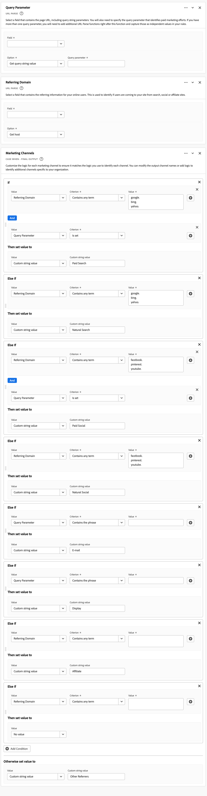
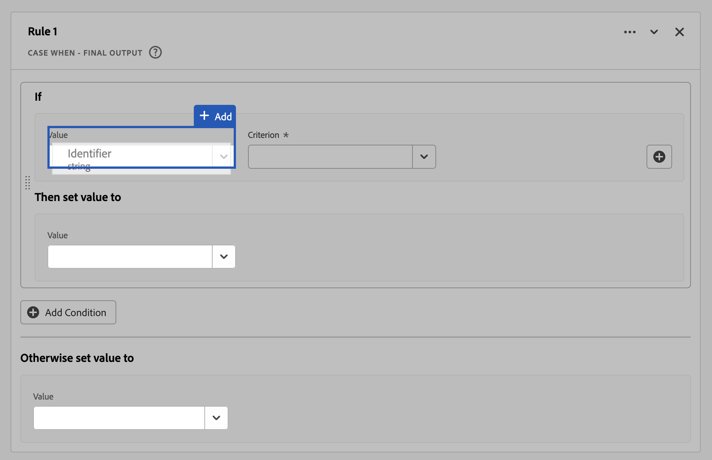

# 파생 필드 {#derived-fields}

<!-- markdownlint-disable MD034 -->

>[!CONTEXTUALHELP]
>id="dataview_derivedfields"
>title="파생 필드"
>abstract="파생 필드를 사용하면 사용자 정의 가능한 규칙 빌더를 통해 즉석에서 데이터 조작을 정의할 수 있습니다. 그런 다음 해당 파생 필드를 Workspace에서 구성 요소(지표 또는 차원)로 사용하거나 데이터 보기에서 구성 요소로 추가로 정의할 수 있습니다."

<!-- markdownlint-enable MD034 -->

파생 필드는 Adobe Customer Journey Analytics 실시간 보고 기능의 중요한 측면입니다. 파생 필드를 사용하면 사용자 정의 가능한 규칙 빌더를 통해 즉석에서 (종종 복잡한) 데이터 조작을 정의할 수 있습니다. 그런 다음 해당 파생 필드를 [Workspace](../../analysis-workspace/home.md)에서 구성 요소(지표 또는 차원)로 사용하거나 [데이터 보기](../data-views.md)에서 파생 필드를 구성 요소로 정의할 수 있습니다.

파생 필드는 Customer Journey Analytics 외부의 다른 위치에서 데이터를 변환하거나 조작하는 것과 비교하여 상당한 시간과 노력을 절약할 수 있습니다. [데이터 준비](https://experienceleague.adobe.com/docs/experience-platform/data-prep/home.html?lang=ko-KR), [데이터 Distiller](https://experienceleague.adobe.com/docs/experience-platform/query/data-distiller/overview.html) 또는 고유한 ETL(추출 변환 로드)/ELT(추출 로드 변환) 프로세스 내에서 사용할 수 있습니다.

파생 필드는 [데이터 보기](../data-views.md) 내에서 정의되며 규칙으로 정의된 함수 집합을 기반으로 하며 사용 가능한 표준 및/또는 스키마 필드에 적용됩니다.

사용 사례의 예는 다음과 같습니다.

- 잘못 수집된 페이지 이름 값을 수정하여 페이지 이름 값을 수정하는 파생 페이지 이름 필드를 정의합니다.

- 하나 이상의 조건(예: URL 매개 변수, 페이지 URL, 페이지 이름)을 기반으로 적절한 마케팅 채널을 결정하는 파생된 마케팅 채널 필드를 정의합니다.

## 파생 필드 인터페이스 {#interface}

파생 필드를 만들거나 편집할 때 파생 필드 인터페이스를 사용합니다.

|  |  이름  | 설명 |
|---------|----------|--------|
| 1 | **선택기** | 선택기 영역을 사용하여 함수, 함수 템플릿, 스키마 필드 또는 표준 필드를 선택하여 규칙 빌더로 끌어다 놓습니다.  드롭다운을 사용하여 다음 중 하나를 선택합니다.   [!UICONTROL 함수] - 사용 가능한 [함수](#function-reference),   [!UICONTROL 함수 템플릿] - 사용 가능한 [함수 템플릿](#function-templates),   [!UICONTROL 스키마 필드] - 데이터 세트 범주(이벤트, 프로필, 조회) 및 이전에 정의한 파생 필드에서 사용 가능한 필드 목록,   [!UICONTROL 표준 필드] - 사용 가능한 표준 필드(예: 플랫폼 데이터 세트 ID). 문자열 및 숫자 표준 필드만 선택기에 표시됩니다. 함수가 다른 데이터 형식을 지원하는 경우 규칙 인터페이스 내의 값 또는 필드에 대해 이러한 다른 데이터 형식을 사용하는 표준 필드를 선택할 수 있습니다.  검색 상자를 사용하여 함수, 함수 템플릿, 스키마 및 표준 필드를 검색할 수 있습니다.  선택한 개체 목록을 필터링하려면  필터를 선택하고 [!UICONTROL 필드 필터링 기준] 대화 상자에서 필터를 지정합니다. 각 필터에 대해 을 사용하여 필터를 쉽게 제거할 수 있습니다. |
| 2 | **규칙 빌더** | 하나 이상의 규칙을 사용하여 파생 필드를 순차적으로 작성합니다. 규칙은 특정 함수 구현이므로 항상 하나의 함수에만 연결됩니다. 함수를 규칙 빌더로 끌어다 놓아 규칙을 만듭니다. 함수 유형은 규칙의 인터페이스를 결정합니다. 자세한 내용은 [규칙 인터페이스](#rule-interface)를 참조하세요.  함수를 시작, 끝 또는 규칙 빌더에서 이미 사용 가능한 규칙 사이에 삽입할 수 있습니다. 규칙 빌더의 마지막 규칙이 파생된 필드의 최종 출력을 결정합니다. |
| 3 | **[!UICONTROL **&#x200B;필드 설정&#x200B;**]** | 파생 필드의 이름과 설명을 지정하고 필드 유형을 검사할 수 있습니다. |
| 4 | **[!UICONTROL **&#x200B;최종 출력&#x200B;**]** | 이 영역에는 지난 30일 동안의 데이터 및 규칙 빌더의 파생 필드에 대한 변경 사항을 기반으로 즉석으로 업데이트된 출력 값 미리보기가 표시됩니다. |

{style="table-layout:auto"}

## 필드 템플릿 마법사 {#wizard}

파생 필드 인터페이스에 처음 액세스하면 [!UICONTROL 필드 템플릿으로 시작] 마법사가 표시됩니다.

1. 만들려는 필드 유형을 가장 잘 설명하는 템플릿을 선택합니다.
2. 계속하려면 **[!UICONTROL **&#x200B;선택&#x200B;**]** 단추를 선택하십시오.

파생 필드 대화 상자는 선택한 필드 유형에 필요하거나 유용한 규칙(및 함수)으로 채워집니다. 사용 가능한 템플릿에 대한 자세한 내용은 [함수 템플릿](#function-templates)을 참조하세요.

## 규칙 인터페이스 {#rules}

규칙 빌더에서 규칙을 정의할 때는 규칙 인터페이스를 사용합니다.

|  |  이름  | 설명 |
|---------|----------|--------|
| A | **규칙 이름** | 기본적으로 규칙 이름은 **규칙 X**(X는 시퀀스 번호를 나타냄)입니다. 규칙 이름을 편집하려면 규칙 이름을 선택하고 새 이름을 입력합니다(예: `Query Parameter`). |
| B | **함수 이름** | 규칙에 대해 선택한 함수 이름(예: [!UICONTROL URL PARSE]). 함수가 함수 시퀀스의 마지막 함수이고 최종 출력 값을 결정하는 경우 함수 이름 뒤에 [!UICONTROL - FINAL OUTPUT]이(가) 옵니다. 예: [!UICONTROL URL PARSE - FINAL OUTPUT].  기능에 대한 자세한 정보가 있는 팝업을 표시하려면 을 선택하세요. |
| C | **규칙 설명** | 원할 경우 규칙에 설명을 추가할 수 있습니다. 추가 아이콘](assets/More.svg)을 선택한 다음 **[!UICONTROL **&#x200B;설명 추가&#x200B;**]**&#x200B;를 선택하여 설명을 추가하거나 **[!UICONTROL **&#x200B;설명 편집&#x200B;**]**&#x200B;을 선택하여 기존 설명을 편집합니다.![ 편집기를 사용하여 설명을 입력하십시오. 도구 모음을 사용하여 텍스트 서식을 지정하고(스타일 선택기, 굵게, 기울임꼴, 밑줄, 오른쪽, 왼쪽, 가운데, 색상, 번호 목록, 글머리 기호 목록 사용) 외부 정보에 링크를 추가할 수 있습니다.  설명 편집을 마치려면 편집기 바깥쪽을 클릭합니다. |
| D | **함수 영역** | 함수의 논리를 정의합니다. 인터페이스는 함수 유형에 따라 다릅니다. [!UICONTROL 필드] 또는 [!UICONTROL 값]에 대한 드롭다운에 함수에서 예상하는 입력 유형에 따라 사용할 수 있는 모든 필드 범주(규칙, 표준 필드, 필드)가 표시됩니다. 또는 스키마 및 표준 필드 선택기의 필드를 필드 또는 값으로 드래그하여 놓을 수 있습니다. 드래그한 필드가 조회 데이터 세트에서 비롯되면 사용자가 정의하는 함수 앞에 조회 함수가 자동으로 삽입됩니다. 지원되는 각 함수에 대한 자세한 내용은  [함수 참조](#function-reference)를 참조하세요. |

{style="table-layout:auto"}

## 파생 필드 만들기 {#create}

1. 기존 데이터 보기를 선택하거나 데이터 보기를 만듭니다. 자세한 내용은 [데이터 보기](../data-views.md)를 참조하세요.

2. 데이터 보기에서 **[!UICONTROL **&#x200B;구성 요소&#x200B;**]** 탭을 선택합니다.

3. 왼쪽 레일에서 **[!UICONTROL **&#x200B;파생 필드 만들기&#x200B;**]**&#x200B;를 선택합니다.

4. 파생 필드를 정의하려면 [!UICONTROL 파생 필드 만들기] 인터페이스를 사용하십시오. [파생 필드 인터페이스](#derived-field-interface)를 참조하십시오.

   새 파생 필드를 저장하려면 **[!UICONTROL **&#x200B;저장&#x200B;**]**&#x200B;을 선택하세요.

5. 새 파생 필드가 데이터 보기의 왼쪽 레일에 있는 **[!UICONTROL **&#x200B;스키마 필드&#x200B;**]**&#x200B;의 일부로 [!UICONTROL 파생 필드 >] 컨테이너에 추가됩니다.

## 파생 필드 편집 {#edit}

1. 기존 데이터 보기를 선택합니다. 자세한 내용은 [데이터 보기](../data-views.md)를 참조하세요.

2. 데이터 보기에서 **[!UICONTROL **&#x200B;구성 요소&#x200B;**]** 탭을 선택합니다.

3. 왼쪽의 [!UICONTROL 연결] 창에서 **[!UICONTROL **&#x200B;스키마 필드&#x200B;**]** 탭을 선택합니다.

4. **[!UICONTROL **&#x200B;파생 필드 >**]** 컨테이너를 선택합니다.

5. 편집할 파생 필드 위로 마우스를 가져간 다음 을 선택합니다.

6. 파생 필드를 편집하려면 [!UICONTROL 파생 필드 편집] 인터페이스를 사용하십시오. [파생 필드 인터페이스](#derived-field-interface)를 참조하십시오.

   - 업데이트된 파생 필드를 저장하려면 **[!UICONTROL **&#x200B;저장&#x200B;**]**&#x200B;을 선택하세요.

   - 파생 필드에 대한 변경 내용을 취소하려면 **[!UICONTROL **&#x200B;취소&#x200B;**]**&#x200B;를 선택하십시오.

   - **[!UICONTROL **&#x200B;다른 이름으로 저장&#x200B;**]**&#x200B;을(를) 선택하여 파생 필드를 새 파생 필드로 저장합니다. 새 파생 필드의 이름이 `(copy)`이(가) 추가된 원래 편집된 파생 필드와 같습니다.

또는 데이터 보기에서 파생된 필드를 차원 또는 지표의 구성 요소로 사용한 경우 다음을 수행하십시오.

1. 구성 요소를 선택합니다. 구성 요소의 이름이 파생 필드와 다를 수 있습니다.

1. 구성 요소 패널에서 스키마 필드 이름 아래의 파생 필드 옆에 있는 을 선택합니다.

1. 파생 필드를 편집하려면 [!UICONTROL 파생 필드 편집] 인터페이스를 사용하십시오. [파생 필드 인터페이스](#derived-field-interface)를 참조하십시오.

   - 업데이트된 파생 필드를 저장하려면 **[!UICONTROL **&#x200B;저장&#x200B;**]**&#x200B;을 선택하세요.

   - 파생 필드에 대한 변경 내용을 취소하려면 **[!UICONTROL **&#x200B;취소&#x200B;**]**&#x200B;를 선택하십시오.

   - **[!UICONTROL **&#x200B;다른 이름으로 저장&#x200B;**]**&#x200B;을(를) 선택하여 파생 필드를 새 파생 필드로 저장합니다. 새 파생 필드의 이름이 `(copy)`이(가) 추가된 원래 편집된 파생 필드와 같습니다.

## 파생 필드 삭제 {#delete}

1. 기존 데이터 보기를 선택합니다. 자세한 내용은 [데이터 보기](../data-views.md)를 참조하세요.

2. 데이터 보기에서 **[!UICONTROL **&#x200B;구성 요소&#x200B;**]** 탭을 선택합니다.

3. [!UICONTROL 연결] 창에서 **[!UICONTROL **&#x200B;스키마 필드&#x200B;**]** 탭을 선택하십시오.

4. **[!UICONTROL **&#x200B;파생 필드 >**]** 컨테이너를 선택합니다.

5. 삭제할 파생 필드 위로 마우스를 가져간 다음 을 선택합니다.

6. [!UICONTROL 파생 필드 편집] 인터페이스에서 **[!UICONTROL 삭제]**&#x200B;를 선택합니다.

   [!UICONTROL 구성 요소 삭제] 대화 상자에서 삭제를 확인하는 메시지가 표시됩니다. 데이터 보기 외부의 파생된 필드에 대한 외부 참조가 있을 수 있다고 가정합니다.

   - 파생 필드를 삭제하려면 **[!UICONTROL **&#x200B;계속&#x200B;**]**&#x200B;을(를) 선택하십시오.

또는 데이터 보기에서 파생된 필드를 차원 또는 지표의 구성 요소로 사용한 경우 다음을 수행하십시오.

1. 구성 요소를 선택합니다. 구성 요소의 이름이 파생 필드와 다를 수 있습니다.

1. 구성 요소 패널에서 스키마 필드 이름 아래의 파생 필드 옆에 있는 을 선택합니다.

1. [!UICONTROL 파생 필드 편집] 인터페이스에서 **[!UICONTROL 삭제]**&#x200B;를 선택합니다.

   [!UICONTROL 구성 요소 삭제] 대화 상자에서 삭제를 확인하는 메시지가 표시됩니다. 데이터 보기 외부의 파생된 필드에 대한 외부 참조가 있을 수 있다고 가정합니다.

   - 파생 필드를 삭제하려면 **[!UICONTROL **&#x200B;계속&#x200B;**]**&#x200B;을(를) 선택하십시오.

>[!NOTE]
>
>파생된 필드는 Customer Journey Analytics의 연결 수준에서 관리됩니다. 해당 연결과 연결된 데이터 보기의 파생 필드에 대한 변경 사항은 이러한 연결된 데이터 보기 모두에 적용됩니다.

## 함수 템플릿 {#templates}

특정 사용 사례에 대한 파생 필드를 신속하게 만들려면 함수 템플릿을 사용할 수 있습니다. 이러한 함수 템플릿은 파생 필드 인터페이스의 선택기 영역에서 액세스하거나 [!UICONTROL 필드 템플릿으로 시작] 마법사에서 처음 사용할 때 표시됩니다.

### 마케팅 채널 {#mchannel}

이 함수 템플릿은 규칙 컬렉션을 사용하여 마케팅 채널을 만듭니다.

+++ 세부 사항

템플릿을 사용하려면 템플릿에 규칙의 일부로 나열된 각 함수에 대해 올바른 매개 변수를 지정해야 합니다. 자세한 내용은 [함수 참조](#function-reference)를 참조하십시오.

마케팅 채널 템플릿 규칙 빌더의 

+++

### 바운스 {#bounces}

이 함수 템플릿은 규칙 컬렉션을 사용하여 사이트 바운스를 식별합니다.

+++ 세부 사항

{{select-package}}

템플릿을 사용하려면 템플릿에 규칙의 일부로 나열된 각 함수에 대해 올바른 매개 변수를 지정해야 합니다. 자세한 내용은 [함수 참조](#function-reference)를 참조하십시오.

+++

### 다차원 결합 {#multi-dim}

이 함수 템플릿은 두 값을 하나로 결합합니다.

+++ 세부 사항

{{select-package}}

템플릿을 사용하려면 템플릿에 규칙의 일부로 나열된 각 함수에 대해 올바른 매개 변수를 지정해야 합니다. 자세한 내용은 [함수 참조](#function-reference)를 참조하십시오.

다중 Dimension 조합 규칙 빌더의 

+++

### 알기 쉬운 데이터 세트 이름 {#friendlyname}

이 함수 템플릿은 읽을 수 있는 데이터 세트 이름을 제공합니다.

+++ 세부 사항

{{select-package}}

템플릿을 사용하려면 템플릿에 규칙의 일부로 나열된 각 함수에 대해 올바른 매개 변수를 지정해야 합니다. 자세한 내용은 [함수 참조](#function-reference)를 참조하십시오.

친숙한 데이터 세트 이름 규칙 빌더의 

+++

### URL의 페이지 이름 {#pagename}

이 함수 템플릿은 간단한 페이지 이름을 만듭니다.

+++ 세부 사항

{{select-package}}

템플릿을 사용하려면 템플릿에 규칙의 일부로 나열된 각 함수에 대해 올바른 매개 변수를 지정해야 합니다. 자세한 내용은 [함수 참조](#function-reference)를 참조하십시오.

+++

### 휴가 시즌 {#holiday}

이 함수 템플릿은 연간 주요 시간을 분류합니다.

+++ 세부 사항

{{select-package}}

템플릿을 사용하려면 템플릿에 규칙의 일부로 나열된 각 함수에 대해 올바른 매개 변수를 지정해야 합니다. 자세한 내용은 [함수 참조](#function-reference)를 참조하십시오.

휴일 시즌 규칙 빌더의 

+++

### 월간 목표 {#goals}

이 함수 템플릿은 사용자 지정 월별 목표를 설정합니다.

+++ 세부 사항

{{select-package}}

템플릿을 사용하려면 템플릿에 규칙의 일부로 나열된 각 함수에 대해 올바른 매개 변수를 지정해야 합니다. 자세한 내용은 [함수 참조](#function-reference)를 참조하십시오.

+++

### 구분된 목록의 모든 값 가져오기 {#allvalues}

이 함수 템플릿은 제한된 목록을 배열로 변환합니다.

+++ 세부 사항

{{select-package}}

템플릿을 사용하려면 템플릿에 규칙의 일부로 나열된 각 함수에 대해 올바른 매개 변수를 지정해야 합니다. 자세한 내용은 [함수 참조](#function-reference)를 참조하십시오.

+++

### 구분된 목록의 첫 번째 값 가져오기 {#firstvalue}

이 함수 템플릿은 구분된 목록의 첫 번째 값을 가져옵니다.

+++ 세부 사항

{{select-package}}

템플릿을 사용하려면 템플릿에 규칙의 일부로 나열된 각 함수에 대해 올바른 매개 변수를 지정해야 합니다. 자세한 내용은 [함수 참조](#function-reference)를 참조하십시오.

구분 목록 규칙 빌더에서 첫 번째 값 가져오기의 

+++

### 구분된 목록의 마지막 값 가져오기 {#lastvalue}

이 함수 템플릿은 구분된 목록의 마지막 값을 가져옵니다.

+++ 세부 사항

{{select-package}}

템플릿을 사용하려면 템플릿에 규칙의 일부로 나열된 각 함수에 대해 올바른 매개 변수를 지정해야 합니다. 자세한 내용은 [함수 참조](#function-reference)를 참조하십시오.

구분 목록 규칙 빌더에서 마지막 값 가져오기의 

+++

### 도메인 이름 {#domain}

이 함수 템플릿은 정규 표현식을 사용하여 도메인 이름을 추출합니다.

+++ 세부 사항

{{select-package}}

템플릿을 사용하려면 템플릿에 규칙의 일부로 나열된 각 함수에 대해 올바른 매개 변수를 지정해야 합니다. 자세한 내용은 [함수 참조](#function-reference)를 참조하십시오.

+++

### 쿼리 문자열 매개변수 가져오기 {#querystring}

이 함수 템플릿은 쿼리 문자열 값을 추출합니다.

+++ 세부 사항

{{select-package}}

템플릿을 사용하려면 템플릿에 규칙의 일부로 나열된 각 함수에 대해 올바른 매개 변수를 지정해야 합니다. 자세한 내용은 [함수 참조](#function-reference)를 참조하십시오.

+++

### 전환 필드 {#transition}

이 함수 템플릿은 한 필드에서 다른 필드로 보고를 전환합니다.

+++ 세부 사항

{{select-package}}

템플릿을 사용하려면 템플릿에 규칙의 일부로 나열된 각 함수에 대해 올바른 매개 변수를 지정해야 합니다. 자세한 내용은 [함수 참조](#function-reference)를 참조하십시오.

+++

### 간단한 봇 감지 {#botdetection}

이 함수 템플릿은 라이트 봇 식별을 구현합니다.

+++ 세부 사항

{{select-package}}

템플릿을 사용하려면 템플릿에 규칙의 일부로 나열된 각 함수에 대해 올바른 매개 변수를 지정해야 합니다. 자세한 내용은 [함수 참조](#function-reference)를 참조하십시오.

+++

### 종료 링크 {#exit}

이 함수 템플릿은 세션에서 마지막으로 클릭한 링크를 식별합니다.

+++ 세부 사항

{{select-package}}

템플릿을 사용하려면 템플릿에 규칙의 일부로 나열된 각 함수에 대해 올바른 매개 변수를 지정해야 합니다. 자세한 내용은 [함수 참조](#function-reference)를 참조하십시오.

+++

### 다운로드 링크 {#download}

이 함수 템플릿은 일반적인 다운로드 링크에 플래그를 지정합니다.

+++ 세부 사항

{{select-package}}

템플릿을 사용하려면 템플릿에 규칙의 일부로 나열된 각 함수에 대해 올바른 매개 변수를 지정해야 합니다. 자세한 내용은 [함수 참조](#function-reference)를 참조하십시오.

다운로드 링크 규칙 빌더의 

+++

<!--

+++ Data clean up template

>[!WARNING]
>
>Could not find any information on this template.
+++

-->

## 함수 참조 {#functionref}

{{select-package}}

지원되는 각 함수에 대해 아래에서 세부 정보를 확인하십시오.

- 사양:
   - 입력 데이터 유형: 지원되는 데이터 유형,
   - 입력: 입력에 가능한 값,
   - 포함된 연산자: 이 함수에 지원되는 연산자(있는 경우),
   - 제한 사항: 이 특정 기능에 적용되는 제한 사항,
   - 출력.

- 다음을 포함한 사용 사례:
   - 파생된 필드를 정의하기 전의 데이터,
   - 파생 필드를 정의하는 방법,
   - 파생된 필드를 정의한 후의 데이터입니다.

- 제한(해당되는 경우).

<!-- CASE WHEN -->

### 다음과 같은 경우 {#casewhen}

<!-- markdownlint-disable MD034 -->

>[!CONTEXTUALHELP]
>id="dataview_derivedfields_casewhen"
>title="다음과 같은 경우"
>abstract="이 함수는 하나 이상의 필드에서 정의된 기준에 따라 조건을 적용할 수 있는 기능을 제공합니다. 그런 다음 이러한 기준을 사용하여 조건 시퀀스에 따라 새 파생 필드의 값을 정의합니다."

<!-- markdownlint-enable MD034 -->

하나 이상의 필드에서 정의된 기준에 따라 조건을 적용합니다. 그런 다음 이러한 기준을 사용하여 조건의 시퀀스를 기반으로 새 파생 필드의 값을 정의합니다.

+++ 세부 사항

## 사양 {#casewhen-io}

| 입력 데이터 유형 | 입력 | 포함된 연산자 | 제한 사항 | 출력 |
|---|---|---|---|---|
| <ul><li>문자열</li><li>숫자</li><li>날짜</li></ul> | <ul><li>[!UICONTROL If], [!UICONTROL Else If] 컨테이너:
<ul><li>[!UICONTROL 값]</li><ul><li>규칙</li><li>표준 필드</li><li>필드</li></ul><li>[!UICONTROL 기준](선택한 값 유형에 따라 포함된 연산자 참조)</li></ul></li><li>[!UICONTROL 값을 ](으)로 설정하고 [!UICONTROL 값을 ](으)로 설정합니다.
<ul><li>[!UICONTROL 값]</li><ul><li>규칙</li><li>표준 필드</li><li>필드</li></ul></ul></li></ul> | 
문자열
<ul><li>다음과 같음</li><li>모든 검색어와 같음</li><li>구문 포함</li><li>검색어를 하나라도 포함</li><li>다음 검색어 포함</li><li>다음으로 시작</li><li>모든 용어로 시작</li><li>다음으로 끝남</li><li>모든 용어로 끝남</li><li>다음과 같지 않음</li><li>모든 검색어와 같지 않음</li><li>다음 구문 포함 안 함</li><li>검색어 포함 안 함</li><li>모든 검색어를 포함하지 않음</li><li>다음으로 시작하지 않음</li><li>어떤 용어로 시작하지 않음</li><li>다음으로 끝나지 않음</li><li>어떤 용어로 끝나지 않음</li><li>세트임</li><li>세트가 아님</li></ul>
숫자
<ul><li>다음과 같음</li><li>다음과 같지 않음</li><li>다음보다 큼</li><li>다음보다 크거나 같음</li><li>다음보다 작음</li><li>다음보다 작거나 같음</li><li>세트임</li><li>세트가 아님</li></ul>
날짜
<ul><li>다음과 같음</li><li>다음과 같지 않음</li><li>다음보다 이후</li><li>다음보다 이후이거나 같음</li><li>다음보다 이전</li><li>다음보다 이전이거나 같음</li><li>세트임</li><li>세트가 아님</li></ul> | <ul><li>파생 필드당 5개 함수</li><li>파생 필드당 200개의 [연산자](#operators). 단일 연산자의 예로는 &#39;참조 도메인 포함 google&#39;이 있습니다. </li></ul> | 
새 파생 필드
 |

{style="table-layout:auto"}

## 사용 사례 1 {#casewhen-uc1}

계단식 로직을 적용하여 마케팅 채널 필드를 적절한 값으로 설정하여 다양한 마케팅 채널을 식별하는 규칙을 정의하려는 경우:

- 레퍼러가 검색 엔진에서 왔고 페이지에 `cid`에 `ps_`이(가) 포함된 쿼리 문자열 값이 있는 경우 마케팅 채널은 [!DNL *유료 검색*](으)로 식별되어야 합니다.
- 레퍼러가 검색 엔진에서 왔고 페이지에 쿼리 문자열 `cid`이(가) 없는 경우 마케팅 채널은 [!DNL *자연어 검색*](으)로 식별되어야 합니다.
- 페이지에 `cid`에 `em_`이(가) 포함된 쿼리 문자열 값이 있는 경우 마케팅 채널은 [!DNL *이메일*](으)로 식별되어야 합니다.
- 페이지에 `cid`에 `ds_`이(가) 포함된 쿼리 문자열 값이 있는 경우 마케팅 채널은 [!DNL *디스플레이 광고*](으)로 식별되어야 합니다.
- 페이지에 `cid`에 `so_`이(가) 포함된 쿼리 문자열 값이 있는 경우 마케팅 채널은 [!DNL *유료 소셜*](으)로 식별되어야 합니다.
- 레퍼러가 [!DNL twitter.com], [!DNL facebook.com], [!DNL linkedin.com] 또는 [!DNL tiktok.com]의 참조 도메인에서 온 경우 마케팅 채널은 [!DNL *자연어 소셜*](으)로 식별해야 합니다.
- 위의 규칙 중 일치하는 규칙이 없으면 마케팅 채널은 [!DNL *기타 레퍼러*](으)로 식별되어야 합니다.

사이트에서 [!UICONTROL 레퍼러] 및 [!UICONTROL 페이지 URL]을 포함하는 샘플 이벤트를 받는 경우 이러한 이벤트는 다음과 같이 식별해야 합니다.

| [!DNL Event] | [!DNL Referrer] | [!DNL Page URL] | [!DNL Marketing Channel] |
|:--:|----|----|----|
| 1 | `https://facebook.com` | `https://site.com/home` | [!DNL Natural Social] |
| 2 | `https://abc.com` | `https://site.com/?cid=ds_12345678` | [!DNL Display] |
| 3 | | `https://site.com/?cid=em_12345678` | [!DNL Email] |
| 4 | `https://google.com` | `https://site.com/?cid=ps_abc098765` | [!DNL Paid Search] |
| 5 | `https://google.com` | `https://site.com/?cid=em_765544332` | [!DNL Email] |
| 6 | `https://google.com` |  | [!DNL Natural Search] |

{style="table-layout:auto"}

### 다음 이전 데이터 {#casewhen-uc1-databefore}

| [!DNL Referrer] | [!DNL Page URL] |
|----|----|
| `https://facebook.com` | `https://site.com/home` |
| `https://abc.com` | `https://site.com/?cid=ds_12345678` |
|  | `https://site.com/?cid=em_12345678` |
| `https://google.com` | `https://site.com/?cid=ps_abc098765` |
| `https://google.com` | `https://site.com/?cid=em_765544332` |
| `https://google.com` | |

{style="table-layout:auto"}

### 파생 필드 {#casewhen-uc1-derivedfield}

`Marketing Channel` 파생 필드를 정의합니다. [!UICONTROL CASE WHEN] 함수를 사용하여 `Page URL` 및 `Referring URL` 필드 모두에 대한 기존 값을 기반으로 값을 만드는 규칙을 정의합니다.

[!UICONTROL CASE WHEN] 규칙이 적용되기 전에 `Page Url` 및 `Referring Url`에 대한 값을 가져오는 규칙을 정의하기 위해 [!UICONTROL URL PARSE] 함수를 사용합니다.

인 경우의 스크린샷

### 다음 이후 데이터 {#casewhen-uc1-dataafter}

| [!DNL Marketing Channel] |
|----|
| [!DNL Natural Social] |
| [!DNL Display] |
| [!DNL Email] |
| [!DNL Paid Search] |
| [!DNL Email] |
| [!DNL Natural Search] |

{style="table-layout:auto"}

## 사용 사례 2 {#casewhen-uc2}

[!DNL Product Finding Methods] 차원 내에서 여러 다양한 검색 변형을 수집했습니다. 검색과 탐색의 전체 성능을 이해하려면 결과를 수동으로 결합하는 데 많은 시간을 소비해야 합니다.

사이트에서 [!DNL Product Finding Methods] 차원에 대한 다음 값을 수집합니다. 결국 이 모든 값은 검색을 나타냅니다.

| 수집된 값 | 실제 값 |
|---|---|
| [!DNL search p13n_no] | [!DNL search] |
| [!DNL search p13n_yes] | [!DNL search] |
| [!DNL search refine p13n_no] | [!DNL search] |
| [!DNL search refine p13n_yes] | [!DNL search] |
| [!DNL search redirect p13n_yes] | [!DNL search] |
| [!DNL search-redirect] | [!DNL search] |

{style="table-layout:auto"}

### 다음 이전 데이터 {#casewhen-uc2-databefore}

| [!DNL Product Finding Methods] |
|----|
| [!DNL search p13_no] |
| [!DNL search p13_yes] |
| [!DNL browse] |
| [!DNL search refine p13_no] |
| [!DNL search refine p13_yes] |
| [!DNL browse] |
| [!DNL search redirect p13_yes] |
| [!DNL search-redirect] |
| [!DNL browse] |

{style="table-layout:auto"}

### 파생 필드 {#casewhen-uc2-derivedfield}

`Product Finding Methods (new)` 파생 필드를 정의합니다. 규칙 빌더에서 다음 [!UICONTROL CASE WHEN] 규칙을 만듭니다. 이 규칙은 [!UICONTROL 구문 포함] 기준을 사용하여 `search` 및 `browse`에 대한 이전 [!UICONTROL 제품 검색 방법] 필드 값의 가능한 모든 변형에 논리를 적용합니다.

인 경우의 스크린샷

### 다음 이후 데이터 {#casewhen-uc2-dataafter}

| [!DNL Product Finding Methods (new)] |
|----|
| [!DNL search] |
| [!DNL search] |
| [!DNL browse] |
| [!DNL search] |
| [!DNL search] |
| [!DNL browse] |
| [!DNL search] |
| [!DNL search] |
| [!DNL browse] |

{style="table-layout:auto"}

## 사용 사례 3 {#casewhen-uc3}

여행 회사는 버켓 여행 길이를 보고할 수 있도록 예약된 여행에 대해 여행 기간을 버켓팅하려고 합니다.

가정:

- 조직이 이동 기간을 숫자 필드로 수집하고 있습니다.
- 1~3일 기간을 &#39;[!DNL short trip]&#39; 버킷에 버킷하려고 합니다.
- 4~7일 기간을 &#39;[!DNL medium trip]&#39; 버킷에 버킷하려고 합니다.
- 8일 이상의 기간을 &#39;[!DNL long trip]&#39; 버킷에 버킷하려고 합니다.
- 1일 동안 132회의 여행이 예약되었습니다
- 110번의 여행이 2일 동안 예약되었습니다
- 105번의 여행이 3일 동안 예약되었습니다
- 99번의 여행이 4일 동안 예약되었습니다
- 92번의 여행이 5일 동안 예약되었습니다
- 85번의 여행이 6일 동안 예약되었습니다
- 82번의 여행이 7일 동안 예약되었습니다
- 78번의 여행이 8일 동안 예약되었습니다
- 50번의 여행이 9일 동안 예약되었습니다
- 44번의 여행이 10일 동안 예약되었습니다
- 38번의 여행이 11일 동안 예약되었습니다
- 31번의 여행은 12일 동안 예약되었습니다

원하는 보고서는 다음과 같아야 합니다.

| [!DNL Trip Duration Type] | [!DNL Bookings] |
|----|---:|
| [!DNL medium trip] | 358 |
| [!DNL short trip] | 347 |
| [!DNL long trip] | 241 |

{style="table-layout:auto"}

### 다음 이전 데이터 {#casewhen-uc3-databefore}

| [!DNL Trip Duration] |
|---:|
| 1 |
| 12 |
| 3 |
| 6 |
| 4 |
| 8 |
| 6 |
| 2 |
| 1 |
| 2 |
| 21 |
| 8 |

### 파생 필드 {#casewhen-uc3-derivedfield}

`Trip Duration (bucketed)` 파생 필드를 정의합니다. 규칙 빌더에 다음 [!UICONTROL CASE WHEN] 규칙을 만듭니다. 이 규칙은 이전 [!UICONTROL 이동 기간] 필드 값을 `short trip`, `medium  trip`, `long trip` 값으로 버킷하는 논리를 적용합니다.

규칙 3](assets/case-when-3.png)인 경우의 ![스크린샷

### 다음 이후 데이터 {#casewhen-uc3-dataafter}

| [!DNL Trip Duration (bucketed)] |
|---|
| [!DNL short trip] |
| [!DNL long trip] |
| [!DNL short trip] |
| [!DNL medium trip] |
| [!DNL medium trip] |
| [!DNL long trip] |
| [!DNL medium trip] |
| [!DNL short trip] |
| [!DNL short trip] |
| [!DNL short trip] |
| [!DNL long trip] |
| [!DNL long trip] |

## 추가 정보 {#casewhen-more-info}

Customer Journey Analytics은 Adobe Experience Platform의 [XDM](https://experienceleague.adobe.com/docs/experience-platform/xdm/home.html?lang=ko-KR)(경험 데이터 모델)을 모델로 중첩된 컨테이너 구조를 사용합니다. 자세한 배경 정보는 [컨테이너](../create-dataview.md#containers) 및 [필터 컨테이너](../../components/filters/filters-overview.md#filter-containers)를 참조하십시오. 이 컨테이너 모델은 기본적으로 유연하지만 규칙 빌더를 사용할 때 몇 가지 제한 사항을 부과합니다.

Customer Journey Analytics은 다음과 같은 기본 컨테이너 모델을 사용합니다.

다음 제약 조건은 *선택* 및 *설정* 값을 사용할 때 적용되고 적용됩니다.

|  | 제한 |
|:---:|----|
| **A** | 규칙에서 동일한 [!UICONTROL If], [!UICONTROL Else If] 구문([!UICONTROL And] 또는 [!UICONTROL Or] 사용) 내에서 *select*&#x200B;하는 값은 동일한 컨테이너에서 가져와야 하며 모든 유형(문자열 , 숫자  등)일 수 있습니다.  의 스크린샷 |
| **B** | 규칙에서 *설정*&#x200B;하는 모든 값은 같은 컨테이너의 값이어야 하며 같은 형식이거나 같은 형식의 파생된 값이어야 합니다.    |
| **C** | [!UICONTROL If], [!UICONTROL Else If] 규칙에 있는 *select* 구문의 값은 동일한 컨테이너에서 *not*&#x200B;해야 하며 *not*&#x200B;해야 합니다.   의 스크린샷 |

{style="table-layout:auto"}

+++

<!-- CLASSIFY -->

### 분류 {#classify}

<!-- markdownlint-disable MD034 -->

>[!CONTEXTUALHELP]
>id="dataview_derivedfields_classify"
>title="분류"
>abstract="이 함수는 텍스트 항목에 의해 해당 값으로 대체되는 값 세트를 정의하는 기능을 제공합니다."

<!-- markdownlint-enable MD034 -->

새 파생 필드의 해당 값으로 대체되는 값 집합을 정의합니다.

+++ 세부 사항

## 사양 {#classify-io}

| 입력 데이터 유형 | 입력 | 포함된 연산자 | 제한 사항 | 출력 |
|---|---|---|---|---|
| <ul><li>문자열</li><li>숫자</li><li>날짜</li></ul> | <ul><li>[!UICONTROL 분류할 필드]:<ul><li>규칙</li><li>표준 필드</li><li>필드</li></ul></li><li>[!UICONTROL 값이 ]인 경우 및 [!UICONTROL 값을 다음으로 바꾸기]:
<ul><li>문자열</li></ul><li>원래 값 표시<ul><li>부울</li></ul></li></ul> | 
해당 사항 없음
 | <ul><li>파생 필드당 5개 함수</li><li>파생 필드당 200개의 [연산자](#operators). [!UICONTROL 값이 원래 값과 같은 경우] [!UICONTROL 값을 새 값으로 바꾸기]의 모든 항목은 작업으로 간주됩니다.</li></ul> | 
새 파생 필드
 |

{style="table-layout:auto"}

## 사용 사례 1 {#classify-uc1}

`hotelID`에 대한 키 열과 `hotelID`과(와) 연결된 하나 이상의 추가 열을 포함하는 CSV 파일이 있습니다. `city`, `rooms`, `hotel name`.
차원에서 [!DNL Hotel ID]을(를) 수집하지만 CSV 파일의 `hotelID`에서 파생된 [!DNL Hotel Name] 차원을 만들려고 합니다.

**CSV 파일 구조 및 콘텐츠**

| [!DNL hotelID] | [!DNL city] | [!DNL rooms] | [!DNL hotel name] |
|---|---|---:|---|
| [!DNL SLC123] | [!DNL Salt Lake City] | 40 | [!DNL SLC Downtown] |
| [!DNL LAX342] | [!DNL Los Angeles] | 60 | [!DNL LA Airport] |
| [!DNL SFO456] | [!DNL San Francisco] | 75 | [!DNL Market Street] |
| [!DNL AMS789] | [!DNL Amsterdam] | 50 | [!DNL Okura] |

{style="table-layout:auto"}

**현재 보고서**

| [!DNL Hotel ID] | 제품 보기 |
|---|---:|
| [!DNL SLC123] | 200 |
| [!DNL LX342] | 198 |
| [!DNL SFO456] | 190 |
| [!DNL AMS789] | 150 |

{style="table-layout:auto"}

**원하는 보고서**

| [!DNL Hotel Name] | 제품 보기 |
|----|----:|
| [!DNL SLC Downtown] | 200 |
| [!DNL LA Airport] | 198 |
| [!DNL Market Street] | 190 |

{style="table-layout:auto"}

### 다음 이전 데이터 {#classify-uc1-databefore}

| [!DNL Hotel ID] |
|----|
| [!DNL SLC123] |
| [!DNL LAX342] |
| [!DNL SFO456] |
| [!DNL AMS789] |

{style="table-layout:auto"}

### 파생 필드 {#classify-uc1-derivedfield}

`Hotel Name` 파생 필드를 정의합니다. [!UICONTROL CLASSIFY] 함수를 사용하여 [!UICONTROL 호텔 ID] 필드의 값을 분류하고 새 값으로 바꿀 수 있는 규칙을 정의합니다.

분류할 값의 일부로 정의하지 않은 원래 값을 포함하려면(예: 호텔 ID AMS789) **[!UICONTROL 원래 값 표시]**&#x200B;를 선택하십시오. 이렇게 하면 해당 값이 분류되지 않지만 AMS789가 파생 필드에 대한 출력의 일부가 됩니다.

의 스크린샷

### 다음 이후 데이터 {#classify-uc1-dataafter}

| [!DNL Hotel Name] |
|----|
| [!DNL SLC Downtown] |
| [!DNL LA Airport] |
| [!DNL Market Street] |

{style="table-layout:auto"}

## 사용 사례 2 {#classify-uc2}

여러 페이지에 대해 친숙한 페이지 이름 대신 URL을 수집했습니다. 이렇게 혼합된 값 컬렉션은 보고를 중단합니다.

### 다음 이전 데이터 {#classify-uc2-databefore}

| [!DNL Page Name] |
|---|
| [!DNL Home Page] |
| [!DNL Flight Search] |
| `http://www.adobetravel.ca/Hotel-Search` |
| `https://www.adobetravel.com/Package-Search` |
| [!DNL Deals & Offers] |
| `http://www.adobetravel.ca/user/reviews` |
| `https://www.adobetravel.com.br/Generate-Quote/preview` |

{style="table-layout:auto"}

### 파생 필드 {#classify-uc2-derivedfield}

`Page Name (updated)` 파생 필드를 정의합니다. [!UICONTROL CLASSIFY] 함수를 사용하여 기존 [!UICONTROL 페이지 이름] 필드의 값을 분류하고 업데이트된 올바른 값으로 바꿀 수 있는 규칙을 정의합니다.

### 다음 이후 데이터 {#classify-uc2-dataafter}

| [!DNL Page Name (updated)] |
|---|
| [!DNL Home Page] |
| [!DNL Flight Search] |
| [!DNL Hotel Search] |
| [!DNL Package Search] |
| [!DNL Deals & Offers] |
| [!DNL Reviews] |
| [!DNL Generate Quote] |

## 추가 정보 {#classify-moreinfo}

분류 규칙 인터페이스에서 다음 추가 기능을 사용할 수 있습니다.

- 모든 테이블 값을 빠르게 지우려면  **[!UICONTROL 모든 테이블 값 지우기]**&#x200B;를 선택하십시오.
- When values에 대한 원래 값과 Replace에 대한 새 값이 동일한 경우 CSV 파일을 업로드하려면  **[!UICONTROL CSV 업로드]**&#x200B;를 선택합니다.
- 업로드할 원본 및 새 값이 있는 CSV 파일 만들기용 템플릿을 다운로드하려면  **[!UICONTROL CSV 템플릿 다운로드]**&#x200B;를 선택하십시오.
- 규칙 인터페이스에 원래 값과 새 값이 모두 채워진 CSV 파일을 다운로드하려면  **[!UICONTROL CSV 값 다운로드]**&#x200B;를 선택하십시오.

+++

<!-- CONCATENATE -->

### 연결 {#concatenate}

<!-- markdownlint-disable MD034 -->

>[!CONTEXTUALHELP]
>id="dataview_derivedfields_concatenate"
>title="연결"
>abstract="이 함수를 사용하여 두 개 이상의 필드, 파생 필드 또는 사용자가 입력한 문자열 값을 정의된 구분 기호로 구분되는 단일 필드로 결합합니다."

<!-- markdownlint-enable MD034 -->

정의된 구분 기호를 사용하여 필드 값을 새로 파생된 단일 필드에 결합합니다.

+++ 세부 사항

## 사양 {#concatenate-io}

| 입력 데이터 유형 | 입력 | 포함된 연산자 | 제한 사항 | 출력 |
|---|---|---|---|---|
| <ul><li>문자열</li></ul> | <ul><li>[!UICONTROL 값]:<ul><li>규칙</li><li>표준 필드</li><li>필드</li><li>문자열</li></ul></li><li>[!UICONTROL 구분 기호]:<ul><li>문자열</li></ul></li> </ul> | 
해당 사항 없음
 | 
파생 필드당 2개 함수
 | 
새 파생 필드
 |

{style="table-layout:auto"}

## 사용 사례 {#concatenate-uc}

현재 원본 및 대상 공항 코드를 별도의 필드로 수집하고 있습니다. 두 필드를 하이픈(-)으로 구분된 단일 차원으로 결합하려고 합니다. 따라서 출발지와 목적지의 조합을 분석하여 예약된 상위 경로를 식별할 수 있습니다.

가정:

- 원본 및 대상 값은 동일한 테이블의 별도 필드에 수집됩니다.
- 사용자는 값 사이에 구분 기호 &#39;-&#39;를 사용하기로 결정합니다.

다음과 같은 예약이 발생한다고 가정해 보십시오.

- 고객 ABC123은 Salt Lake City(SLC)와 Orlando(MCO) 간 항공권 예약
- 고객 ABC456, SLC(Salt Lake City)와 LAX(Los Angeles) 간 항공권 예약
- 고객 ABC789는 Salt Lake City(SLC)와 Seattle(SEA) 간의 항공편을 예약합니다.
- 고객 ABC987은 Salt Lake City(SLC)와 San Jose(SJO) 간 항공권 예약
- 고객 ABC654는 Salt Lake City(SLC)와 Orlando(MCO) 간 항공권 예약

원하는 보고서는 다음과 같아야 합니다.

| 원본 / 대상 | 예약 |
|----|---:|
| SLC-MCO | 2 |
| SLC-LAX | 1 |
| SLC-SEA | 1 |
| SLC-JO | 1 |

{style="table-layout:auto"}

### 다음 이전 데이터 {#concatenate-uc-databefore}

| 원본 | 대상 |
|----|---:|
| SLC | MCO |
| SLC | LAX |
| SLC | SEA |
| SLC | SJO |
| SLC | MCO |

{style="table-layout:auto"}

### 파생 필드 {#concatenate-derivedfield}

`Origin - Destination` 파생 필드를 정의합니다. [!UICONTROL CONCATENATE] 함수를 사용하여 `-` [!UICONTROL 구분 기호]를 사용하여 [!UICONTROL Original]과(와) [!UICONTROL Destination] 필드를 연결하는 규칙을 정의합니다.

### 다음 이후 데이터 {#concatenate-dataafter}

| 원본 - 대상 (파생 필드) |
|---|
| SLC-MCO |
| SLC-LAX |
| SLC-SEA |
| SLC-JO |
| SLC-MCO |

{style="table-layout:auto"}

+++

### 중복 제거 {#dedup}

<!-- markdownlint-disable MD034 -->

>[!CONTEXTUALHELP]
>id="dataview_derivedfields_deduplicate"
>title="중복 제거"
>abstract="이 함수는 세션 또는 개인 수준에서 비반복적으로 값만 계산하도록 필드를 구성하는 기능을 제공합니다. 또한 중복 제거 ID를 사용하면 특정 ID(예: 구매 ID)를 기반으로 하나의 값(첫 번째 인스턴스 또는 마지막 인스턴스)만 사용되도록 할 수 있습니다."

<!-- markdownlint-enable MD034 -->

값을 여러 번 카운트하지 않도록 합니다.

+++ 세부 사항

## 사양 {#deduplicate-io}

| 입력 데이터 유형 | 입력 | 포함된 연산자 | 제한 사항 | 출력 |
|---|---|---|---|---|
| <ul><li>문자열</li><li>숫자</li></ul> | <ul><li>[!UICONTROL 값]:<ul><li>규칙</li><li>표준 필드</li><li>필드</li><li>문자열</li></ul></li><li>[!UICONTROL 범위]:<ul><li>개인</li><li>세션</li></ul></li><li>[!UICONTROL 중복 제거 ID]:<ul><li>규칙</li><li>표준 필드</li><li>필드</li><li>문자열</li></ul><li>[!UICONTROL 유지할 값]:<ul><li>첫 번째 인스턴스 유지</li><li>마지막 인스턴스 유지</li></ul></li></ul> | 
해당 사항 없음
 | 
파생 필드당 5개 함수
 | 
새 파생 필드
 |

{style="table-layout:auto"}

## 사용 사례 1 {#deduplicate-uc1}

사용자가 예약 확인 페이지를 다시 로드할 때 중복 매출을 카운트하지 않도록 하려는 경우 같은 이벤트에서 수신되었을 때 식별자의 예약 확인 ID를 사용하여 수익을 다시 계산하지 않습니다.

### 다음 이전 데이터 {#deduplicate-uc1-databefore}

| 예약 확인 ID | 매출 |
|----|---:|
| ABC123456789 | 359 |
| ABC123456789 | 359 |
| ABC123456789 | 359 |

{style="table-layout:auto"}

### 파생 필드 {#deduplicate-uc1-derivedfield}

`Booking Confirmation` 파생 필드를 정의합니다. [!UICONTROL DEDUPLICATE] 함수를 사용하여 [!UICONTROL 중복 제거 ID] [!UICONTROL 예약 확인 ID]를 사용하여 [!UICONTROL 범위] [!DNL Person]에 대한 [!UICONTROL 값] [!DNL Booking]을(를) 중복 제거하는 규칙을 정의합니다. [!UICONTROL 첫 번째 인스턴스 유지]를 [!UICONTROL 유지할 값](으)로 선택합니다.

### 다음 이후 데이터 {#deduplicate-uc1-dataafter}

| 예약 확인 ID | 매출 |
|----|---:|
| ABC123456789 | 359 |
| ABC123456789 | 0 |
| ABC123456789 | 0 |

{style="table-layout:auto"}

## 사용 사례 2 {#deduplicate-uc2}

외부 마케팅 캠페인이 있는 캠페인 클릭스루에 이벤트를 프록시로 사용합니다. 다시 로드 및 리디렉션으로 인해 이벤트 지표가 부풀려집니다. 첫 번째 차원만 수집되도록 추적 코드 차원을 중복 제거하고 이벤트 오버카운트를 최소화하려고 합니다.

### 다음 이전 데이터 {#deduplicate-uc2-databefore}

| 방문자 ID | 마케팅 채널 | 이벤트 |
|----|---|---:|
| ABC123 | 유료 검색 | 1 |
| ABC123 | 유료 검색 | 1 |
| ABC123 | 유료 검색 | 1 |
| DEF123 | 이메일 | 1 |
| DEF123 | 이메일 | 1 |
| JKL123 | 자연어 검색 | 1 |
| JKL123 | 자연어 검색 | 1 |

{style="table-layout:auto"}

### 파생 필드 {#deduplicate-uc2-derivedfield}

새 `Tracking Code (deduplicated)` 파생 필드를 정의합니다. [!UICONTROL DEDUPLICATE] 함수를 사용하여 [!UICONTROL 세션]의 [!UICONTROL 중복 제거 범위] 및 [!UICONTROL 첫 번째 인스턴스 유지]를 [!UICONTROL 유지할 값으로 사용하여 [!UICONTROL 추적 코드]을(를) 중복 제거하는 규칙을 정의합니다.]

### 다음 이후 데이터 {#deduplicate-uc2-dataafter}

| 방문자 ID | 마케팅 채널 | 이벤트 |
|----|---|---:|
| ABC123 | 유료 검색 | 1 |
| DEF123 | 이메일 | 1 |
| JKL123 | 자연어 검색 | 1 |

{style="table-layout:auto"}

+++

<!-- FIND AND REPLACE -->

### 찾기 및 바꾸기 {#find-and-replace}

<!-- markdownlint-disable MD034 -->

>[!CONTEXTUALHELP]
>id="dataview_derivedfields_findandreplace"
>title="찾기 및 바꾸기"
>abstract="이 함수는 선택한 필드의 모든 값을 찾아서 해당 값을 파생된 새 필드에서 다른 값으로 바꾸는 기능을 제공합니다."

<!-- markdownlint-enable MD034 -->

선택한 필드에서 모든 값을 찾아 새 파생 필드에서 다른 값으로 바꿉니다.

+++ 세부 사항

## 사양 {#findreplace-io}

| 입력 데이터 유형 | 입력 | 포함된 연산자 | 제한 사항 | 출력 |
|---|---|---|---|---|
| <ul><li>문자열</li></ul> | <ul><li>[!UICONTROL 값]<ul><li>규칙</li><li>표준 필드</li><li>필드</li></ul></li><li>[!UICONTROL 모두 찾기], [!UICONTROL 및 모두 바꾸기]:<ul><li>문자열</li></ul></li></ul></ul> | 
문자열
<ul><li>[!UICONTROL 모두 찾기], [!UICONTROL 및 모두 바꾸기]</li></ul> | 
파생 필드당 5개 함수
 | 
새 파생 필드
 |

{style="table-layout:auto"}

## 사용 사례 {#findreplace-uc}

외부 마케팅 채널 보고서에 대한 일부 잘못된 값(예: `email marketing` 대신 `email%20 marketing`)을 받았습니다. 이러한 잘못된 값은 보고를 분할하고 이메일이 어떻게 작동하는지 확인하는 것을 더 어렵게 합니다. `email%20marketing`을(를) `email marketing`(으)로 바꾸려고 합니다.

**원본 보고서**

| [!DNL External Marketing Channels] | [!DNL Sessions] |
|---|--:|
| [!DNL email marketing] | 500 |
| [!DNL email %20marketing] | 24 |

{style="table-layout:auto"}

**기본 보고서**

| [!DNL External Marketing Channels] | [!DNL Sessions] |
|---|--:|
| [!DNL email marketing] | 524 |

### 다음 이전 데이터 {#findreplace-uc-databefore}

| [!DNL External Marketing] |
|----|
| [!DNL email marketing] |
| [!DNL email%20marketing] |
| [!DNL email marketing] |
| [!DNL email marketing] |
| [!DNL email%20marketing] |

{style="table-layout:auto"}

### 파생 필드 {#findreplace-uc-derivedfield}

`Email Marketing (updated)` 파생 필드를 정의합니다. [!UICONTROL FIND AND REPLACE] 함수를 사용하여 `email%20marketing`의 모든 항목을 찾아 `email marketing`(으)로 바꾸는 규칙을 정의합니다.

### 다음 이후 데이터 {#findreplace-uc-dataafter}

| [!DNL External Marketing (updated)] |
|----|
| [!DNL email marketing] |
| [!DNL email marketing] |
| [!DNL email marketing] |
| [!DNL email marketing] |
| [!DNL email marketing] |

{style="table-layout:auto"}

+++

<!-- LOOKUP -->

### 조회 {#lookup}

<!-- markdownlint-disable MD034 -->

>[!CONTEXTUALHELP]
>id="dataview_derivedfields_lookup"
>title="조회"
>abstract="이 함수는 데이터 세트 간에 일치하는 키를 사용하여 조회 데이터 세트의 필드를 사용하는 기능을 제공합니다."

<!-- markdownlint-enable MD034 -->

조회 데이터 세트의 필드를 사용하여 값을 조회하고 새로운 파생 필드 또는 추가 규칙 처리를 위해 값을 반환합니다.

+++ 세부 사항

## 사양 {#lookup-io}

| 입력 데이터 유형 | 입력 | 포함된 연산자 |  제한 | 출력 |
|---|---|---|---|---|
| <ul><li>문자열</li><li>숫자</li><li>날짜</li></ul> | <ul><li>[!UICONTROL 조회를 적용할 필드]:</li><ul><li>규칙</li><li>표준 필드</li><li>필드</li></ul><li>[!UICONTROL 조회 데이터 세트]</li><ul><li>데이터 세트</li></ul><li>[!UICONTROL 일치하는 키]<ul><li>규칙</li><li>필드</li></ul></li><li>반환할 값<ul><li>규칙</li><li>필드</li></ul></li></ul> | 
해당 사항 없음
 | 
파생 필드당 3개 함수
 | 
다음 규칙에서 추가 처리를 위한 새로운 파생 필드 또는 값
 |

{style="table-layout:auto"}

## 사용 사례 {#lookup-uc}

고객이 Adobe Target을 통해 표시된 개인화된 배너를 클릭할 때 수집된 활동 ID를 사용하여 활동 이름을 조회하려는 경우 활동 ID 및 활동 이름이 포함된 A4T(Analytics for Target) 활동과 함께 조회 데이터 세트를 사용하려는 경우

### A4T 조회 데이터 세트 {#lookup-uc-lookup}

| 활동 Id | 활동 이름 |
|---|---|
| 415851 | MVT 테스트 범주 페이지 |
| 415852 | Luma - Campaign Max 2022 |
| 402922 | 홈 페이지 배너 |

{style="table-layout:auto"}

### 파생 필드 {#lookup-uc-derivedfield}

`Activity Name` 파생 필드를 정의합니다. [!UICONTROL LOOKUP] 함수를 사용하여 수집된 데이터에서 값을 조회하는 규칙을 정의합니다. [!UICONTROL 조회를 적용할 필드] 필드(예: **[!DNL ActivityIdentifier]**)에 지정합니다. [!UICONTROL 조회 데이터 세트] 목록에서 조회 데이터 세트를 선택합니다(예: **[!DNL New CJA4T Activities]**). 그런 다음 [!UICONTROL 일치하는 키] 목록에서 식별자 필드(예: **[!DNL ActivityIdentifier]**)를 선택하고 [!UICONTROL 반환할 값] 목록(예: **[!DNL ActivityName]**)에서 반환할 필드를 선택합니다.

## 추가 정보 {#lookup-more-info}

조회 함수는 보고서 시간에 연결의 일부로 구성한 조회 데이터 세트에서 Customer Journey Analytics이 검색한 데이터에 적용됩니다.

하나 이상의 다른 함수가 이미 들어 있는 [!UICONTROL Lookup] 함수를 규칙 빌더에 빠르게 삽입할 수 있습니다.

1. 선택기에서 **[!UICONTROL 스키마 필드]**&#x200B;을(를) 선택합니다.
1.  **[!UICONTROL 조회 데이터 세트]**&#x200B;을 선택합니다.
1. 조회 데이터 세트를 선택하고 조회에 사용할 필드를 찾습니다.
1. 함수에 사용할 수 있는 입력 필드(예: Case When)에 조회 필드를 끌어다 놓습니다. 유효하면 **[!UICONTROL + 추가]** 레이블이 지정된 파란색 상자를 사용하여 필드를 삭제하고 조회 필드를 놓은 함수 앞에 조회 함수를 자동으로 삽입할 수 있습니다. 삽입된 조회 함수는 모든 필드에 대한 관련 값으로 자동으로 채워집니다.
   

+++

<!-- LOWERCASE -->

### 소문자 {#lowercase}

<!-- markdownlint-disable MD034 -->

>[!CONTEXTUALHELP]
>id="dataview_derivedfields_lowercase"
>title="소문자"
>abstract="이 함수는 전체 문자열 텍스트를 소문자 값으로 변환합니다."

<!-- markdownlint-enable MD034 -->

필드의 값을 소문자로 변환하여 새로운 파생된 필드에 저장합니다.

+++ 세부 사항

## 사양 {#lowercase-io}

| 입력 데이터 유형 | 입력 | 포함된 연산자 |  제한 | 출력 |
|---|---|---|---|---|
| <ul><li>문자열</li><li>숫자</li><li>날짜</li></ul> | <ul><li>[!UICONTROL 필드]:</li><ul><li>규칙</li><li>표준 필드</li><li>필드</li></ul> | 
해당 사항 없음
 | 
파생 필드당 2개 함수
 | 
새 파생 필드
 |

{style="table-layout:auto"}

## 사용 사례 {#lowercase-uc}

적절한 보고를 위해 수집된 모든 제품 이름을 소문자로 변환하려고 합니다.

### 다음 이전 데이터 {#lowercase-uc-databefore}

| 수집된 제품 이름 | 제품 보기 |
|---|---:|
| 테니스 라켓 | 35 |
| 테니스 라켓 | 33 |
| 테니스 라켓 | 21 |
| 야구 방망이 | 15 |
| 야구 방망이 | 12 |
| 야구 방망이 | 10 |

{style="table-layout:auto"}

### 파생 필드 {#lowercase-uc-derivedfield}

`Product Names` 파생 필드를 정의합니다. [!UICONTROL LOWERCASE] 함수를 사용하여 [!UICONTROL 수집된 제품 이름] 필드의 값을 소문자로 변환하는 규칙을 정의하고 새 파생된 필드에 저장합니다.

### 다음 이후 데이터 {#lowercase-uc-dataafter}

| 제품 이름 | 제품 보기 |
|---|---|
| 테니스 라켓 | 89 |
| 야구 방망이 | 37 |

{style="table-layout:auto"}

+++

<!-- MATH -->

### 수학 {#math}

<!-- markdownlint-disable MD034 -->

>[!CONTEXTUALHELP]
>id="dataview_derivedfields_math"
>title="수학"
>abstract="이 함수는 필드에서 수학 연산을 수행하는 기능을 제공합니다. 해당 함수는 덧셈, 뺄셈, 곱셈, 나눗셈과 같은 기본적인 산술 연산을 수행하는 데 사용할 수 있습니다."

<!-- markdownlint-enable MD034 -->

숫자 필드에 기본 수학 연산자(더하기, 빼기, 곱하기, 나누기 및 거듭제곱하기)를 사용합니다.

+++ 세부 사항

## 사양 {#math-io}

| 입력 데이터 유형 | 입력 | 포함된 연산자 |  제한 | 출력 |
|---|---|---|---|---|
| <ul><li>숫자</li></ul> | <ul><li>하나 또는 여러 숫자 필드</li><li>하나 이상의 연산자(더하기, 빼기, 곱하기, 나누기, 거듭제곱하기)</li><li>사용자 입력 값</li></ul> | <ul><li>`+`(추가)</li><li>`-`(빼기)</li><li>`*`(곱하기)</li><li>`/`(나누기)</li><li>`^`(최대 절전 모드로 올림)</li></ul> | <ul><li>파생 필드당 25개 작업</li><li>파생 필드당 5개의 수학 함수</li></ul> | 
새 파생 필드
 |

{style="table-layout:auto"}

## 사용 사례 {#math-uc}

인플레이션으로 인해 5% 인플레이션으로 수집된 CRM 데이터의 매출 수치를 수정하려고 합니다.

### 다음 이전 데이터 {#math-uc-databefore}

| CRM ID | 연간 수익 |
|---|---:|
| 1234 | 35,070,000 |
| 4133 | 7,500,000 |
| 8110 | 10,980 |
| 2201 | 42,620 |

{style="table-layout:auto"}

### 파생 필드 {#math-uc-derivedfield}

`Corrected Annual Revenue` 파생 필드를 정의합니다. [!UICONTROL MATH] 함수를 사용하여 원래 연간 매출액을 1.05로 곱하는 규칙을 정의합니다.

### 다음 이후 데이터 {#math-uc-dataafter}

| CRM ID | 수정된 연간 수익 |
|---|---:|
| 1234 | 36,823,500 |
| 4133 | 7,875,000 |
| 8110 | 11,529,00 |
| 2201 | 44,751 |

{style="table-layout:auto"}

## 추가 정보 {#math-more-info}

배합표를 생성하려면

1. 수식 필드에 입력을 시작하면 입력한 내용과 일치하는 숫자 필드가 팝업 메뉴에 나타납니다. 또는 왼쪽 창의 사용 가능한 필드에서 숫자 필드를 끌어다 놓을 수 있습니다.
   

1. 피연산자(예: `*` to multiply) 다음에 다른 필드 또는 정적 값을 추가합니다. 괄호를 사용하여 보다 복잡한 수식을 정의할 수 있습니다.

1. 정적 값(예: `1.05`)을 삽입하려면 값을 입력하고 팝업 메뉴에서 **[!UICONTROL 정적 값으로 *x*을(를) 추가]** 또는 **[!UICONTROL 음수 정적 값으로 -*x*을(를) 추가]**를 선택하십시오.
   

1. 녹색 확인 표시 은(는) 수식 수식이 유효한지 여부를 나타냅니다. 그렇지 않으면 경고 와 메시지 [!UICONTROL 잘못된 수식 식]이 표시됩니다.
   

[!UICONTROL MATH] 함수에서 정적 숫자로 작업할 때 몇 가지 중요한 고려 사항이 있습니다.

- 정적 값은 필드와 연결해야 합니다. 예를들어, 정적 필드에서만 [!UICONTROL MATH] 함수를 사용할 수 없습니다.
- 정적 값에는 RAISE to power 연산자(`ˆ`)를 사용할 수 없습니다.
- 수식에서 여러 정적 값을 사용하는 경우 이러한 정적 값은 수식이 유효하려면 괄호로 묶어야 합니다. 예:

   - 이 수식은 오류를 반환합니다.
     

   - 이 공식은 유효합니다.
     

히트 수준 기반 계산에 수학 함수를 사용합니다. 이벤트, 세션 또는 사용자 범위 기반 계산에는 [Summarize](#summarize) 함수를 사용하십시오.

+++

<!-- MERGE FIELDS -->

### 필드 병합 {#merge}

<!-- markdownlint-disable MD034 -->

>[!CONTEXTUALHELP]
>id="dataview_derivedfields_mergefields"
>title="필드 병합"
>abstract="이 함수는 두 개의 서로 다른 필드에서 값을 가져오고 각각의 값을 단일 차원에 포함하는 기능을 제공합니다. 규칙은 먼저 첫 번째 값이 설정되어 있는지 확인합니다. 그렇지 않은 경우 두 번째 값을 사용합니다."

<!-- markdownlint-enable MD034 -->

서로 다른 두 필드의 값을 새로운 파생 필드로 병합합니다.

+++ 세부 사항

## 사양 {#merge-fields-io}

| 입력 데이터 유형 | 입력 | 포함된 연산자 |  제한 | 출력 |
|---|---|---|---|---|
| <ul><li>문자열</li><li>숫자</li><li>날짜</li></ul> | <ul><li>[!UICONTROL 필드]:</li><ul><li>규칙</li><li>표준 필드</li><li>필드</li></ul> | 
해당 사항 없음
 | 
파생 필드당 5개 함수
 | 
새 파생 필드
 |

{style="table-layout:auto"}

## 사용 사례 {#merge-fields-uc}

채널 간 여정을 분석하기 위해 페이지 이름 필드 및 호출 사유 필드로 구성된 차원을 생성하려고 합니다.

### 다음 이전 데이터 {#merge-fields-uc-databefore}

| 페이지 이름 | 세션 | 방문자 수 |
|---|--:|--:|
| 도움말 페이지 | 250 | 200 |
| 홈 페이지 | 500 | 250 |
| 제품 세부 사항 페이지 | 300 | 200 |

{style="table-layout:auto"}

| 통화 이유 | 세션 | 방문자 수 |
|---|--:|--:|
| 내 주문에 대한 질문 | 275 | 250 |
| 내 주문을 변경하다 | 150 | 145 |
| 순서 지정 문제 | 100 | 95 |

{style="table-layout:auto"}

### 파생 필드 {#merge-fields-uc-derivedfield}

`Cross Channel Interactions` 파생 필드를 정의합니다. [!UICONTROL MERGE FIELDS] 함수를 사용하여 [!UICONTROL 페이지 이름] 필드 및 [!UICONTROL 호출 이유] 필드의 값을 병합하고 새 파생 필드에 저장하는 규칙을 정의합니다.

### 다음 이후 데이터 {#merge-fields-uc-dataafter}

| 크로스 채널 상호 작용 | 세션 | 방문자 수 |
|---|--:|--:|
| 홈 페이지 | 500 | 250 |
| 제품 세부 사항 페이지 | 300 | 200 |
| 내 주문에 대한 질문 | 275 | 250 |
| 도움말 페이지 | 250 | 200 |
| 내 주문을 변경하다 | 150 | 145 |
| 순서 지정 문제 | 100 | 95 |

{style="table-layout:auto"}

## 추가 정보 {#merge-fields-moreinfo}

필드 병합 규칙 내에서 동일한 유형의 필드를 선택해야 합니다. 예를 들어 날짜 필드를 선택하는 경우 병합할 다른 모든 필드는 날짜 필드여야 합니다.

+++

<!-- NEXT OR PREVIOUS -->

### 다음 또는 이전 {#next-previous}

<!-- markdownlint-disable MD034 -->

>[!CONTEXTUALHELP]
>id="dataview_derivedfields_nextprevious"
>title="다음 또는 이전"
>abstract="이 함수는 특정 필드에 대해 수집된 다음 또는 이전 값을 조회할 수 있는 기능을 제공합니다."

<!-- markdownlint-enable MD034 -->

필드를 입력으로 취하여 세션 또는 사용 범위 내에서 해당 필드의 다음 또는 이전 값을 확인합니다. 방문 및 이벤트 테이블 필드에만 적용됩니다.

+++ 세부 사항

## 사양 {#prevornext-io}

| 입력 데이터 유형 | 입력 | 포함된 연산자 |  제한 | 출력 |
|---|---|---|---|---|
| <ul><li>문자열</li><li>숫자</li><li>날짜</li></ul> | <ul><li>[!UICONTROL 필드]:</li><ul><li>규칙</li><li>표준 필드</li><li>필드</li></ul><li>[!UICONTROL 메서드]:<ul><li>이전 값</li><li>다음 값</li></ul></li><li>[!UICONTROL 범위]:<ul><li>개인</li><li>세션</li></ul></li><li>[!UICONTROL 인덱스]:<ul><li>숫자</li></ul><li>[!UICONTROL 반복 포함]:<ul><li>부울</li></ul></li></ul> | 
해당 사항 없음
 | 
파생 필드당 3개 함수
 | 
새 파생 필드
 |

{style="table-layout:auto"}

## 사용 사례 {#prevornext-uc1}

반복 값을 고려하여 받은 데이터의 **next** 또는 **previous** 값을 이해하려 합니다.

### 데이터 {#prevornext-uc1-databefore}

**예 1 - 처리는 반복을 포함합니다**

| 데이터 수신됨 | 다음 값 세션 인덱스 = 1 반복 포함 | 다음 값 세션 인덱스 = 1 반복을 포함하지 않음 | 이전 값 세션 인덱스 = 1 반복 포함 | 이전 값 세션 인덱스 = 1 반복을 포함하지 않음 |
|---|---|---|---|---|
| 홈 | 홈 | 검색 | *값 없음* | *값 없음* |
| 홈 | 검색 | 검색 | 홈 | *값 없음* |
| 검색 | 검색 | 제품 세부 사항 | 홈 | 홈 |
| 검색 | 제품 세부 사항 | 제품 세부 사항 | 검색 | 홈 |
| 제품 세부 사항 | 검색 | 검색 | 검색 | 검색 |
| 검색 | 제품 세부 사항 | 제품 세부 사항 | 제품 세부 사항 | 제품 세부 사항 |
| 제품 세부 사항 | 검색 | 검색 | 검색 | 검색 |
| 검색 | 검색 | *값 없음* | 제품 세부 사항 | 제품 세부 사항 |
| 검색 | *값 없음* | *값 없음* | 검색 | 제품 세부 사항 |

{style="table-layout:auto"}

**예 2 - 처리된 데이터에 빈 값이 있는 반복이 포함됨**

| 데이터 수신됨 | 다음 값 세션 인덱스 = 1 반복 포함 | 다음 값 세션 인덱스 = 1 반복을 포함하지 않음 | 이전 값 세션 인덱스 = 1 반복 포함 | 이전 값 세션 인덱스 = 1 반복을 포함하지 않음 |
|---|---|---|---|---|
| 홈 | 홈 | 검색 | *값 없음* | *값 없음* |
| 홈 | 홈 | 검색 | 홈 | *값 없음* |
| 홈 | 검색 | 검색 | 홈 | *값 없음* |
| 검색 | 검색 | 제품 세부 사항 | 홈 | 홈 |
|   |   |   |   |   |
| 검색 | 검색 | 제품 세부 사항 | 검색 | 홈 |
| 검색 | 제품 세부 사항 | 제품 세부 사항 | 검색 | 홈 |
| 제품 세부 사항 | *값 없음* | *값 없음* | 검색 | 검색 |
|   |   |   |   |   |

{style="table-layout:auto"}

### 파생 필드 {#prevnext-uc1-derivedfield}

`Next Value` 또는 `Previous value` 파생 필드를 정의합니다. [!UICONTROL NEXT 또는 PREVIOUS] 함수를 사용하여 [!UICONTROL 받은 데이터] 필드를 선택하는 규칙을 정의하고 [!UICONTROL 다음 값] 또는 [!UICONTROL 이전 값]을(를) [!UICONTROL 메서드], [!UICONTROL 세션] 범위로 선택하고 [!UICONTROL 인덱스] 값을 `1`(으)로 설정합니다.

## 추가 정보 {#prevnext-moreinfo}

방문 또는 이벤트 테이블에 속하는 필드만 선택할 수 있습니다.

[!UICONTROL 반복 포함]은(는) [!UICONTROL NEXT 또는 PREVIOUS] 함수에 대한 반복 값을 처리하는 방법을 결정합니다.

- 반복 모양과 다음 또는 이전 값을 포함합니다. [!UICONTROL 반복 포함]을 선택하면 현재 히트에서 다음 또는 이전 값의 순차적 반복이 무시됩니다.

- 선택한 필드에 값이 없는(빈) 행에는 [!UICONTROL NEXT 또는 PREVIOUS] 함수 출력의 일부로 반환된 다음 또는 이전 값이 없습니다.

+++

<!-- REGEX REPLACE -->

### 정규 표현식 바꾸기 {#regex-replace}

<!-- markdownlint-disable MD034 -->

>[!CONTEXTUALHELP]
>id="dataview_derivedfields_regexreplace"
>title="정규 표현식 바꾸기"
>abstract="이 함수는 정규 표현식을 사용하여 문자열의 일부를 추출하는 기능을 제공합니다."

<!-- markdownlint-enable MD034 -->

정규 표현식을 사용하여 필드의 값을 새로운 파생된 필드로 바꿉니다.

+++ 세부 사항

## 사양 {#regex-replace-io}

| 입력 데이터 유형 | 입력 | 포함된 연산자 |  제한 | 출력 |
|---|---|---|---|---|
| <ul><li>문자열</li><li>숫자</li></ul> | <ul><li>[!UICONTROL 필드]:</li><ul><li>규칙</li><li>표준 필드</li><li>필드</li></ul></ul><ul><li>[!UICONTROL 정규식]:</li><ul><li>문자열</li></ul></li><li>[!UICONTROL 출력 형식]:<ul><li>문자열</li></ul></ul><ul><li>대소문자 구분</li><ul><li>부울</li></ul></li></ul></li> | 
해당 사항 없음
 | 
파생 필드당 1개 함수
 | 
새 파생 필드
 |

{style="table-layout:auto"}

## 사용 사례 {#regex-replace-uc}

URL 옵션을 가져와서 트래픽을 분석하는 고유 페이지 식별자로 사용하려는 경우 정규식에 `[^/]+(?=/$|$)`을(를) 사용하여 URL의 끝을 캡처하고 `$1`을(를) 출력 패턴으로 캡처합니다.

### 다음 이전 데이터 {#regex-replace-uc-databefore}

| 페이지 URL |
|---|
| `https://business.adobe.com/products/analytics/adobe-analytics-benefits.html` |
| `https://business.adobe.com/products/analytics/adobe-analytics.html` |
| `https://business.adobe.com/products/experience-platform/customer-journey-analytics.html` |
| `https://business.adobe.com/products/experience-platform/adobe-experience-platform.html` |

{style="table-layout:auto"}

### 파생 필드 {#regex-replace-uc-derivedfield}

`Page Identifier` 파생 필드를 만듭니다. [!UICONTROL REGEX REPLACE] 함수를 사용하여 `[^/]+(?=/$|$)`의 [!UICONTROL Regex] 및 `$1`의 [!UICONTROL 출력 형식]을(를) 사용하여 [!UICONTROL 참조 URL] 필드의 값을 바꾸는 규칙을 정의합니다.

### 다음 이후 데이터 {#regex-replace-uc-dataafter}

| 페이지 식별자 |
|---|
| adobe-analytics-benefits.html |
| adobe-analytics.html |
| customer-journey-analytics.html |
| adobe-experience-platform.html |

## 추가 정보 {#regex-replace-more-info}

Customer Journey Analytics은 Perl 정규 표현식 구문의 하위 집합을 사용합니다. 지원되는 표현식은 다음과 같습니다.

| 표현식 | 설명 |
| --- | --- |
| `a` | 단일 문자 `a` |
| `a\|b` | 단일 문자 `a` 또는 `b` |
| `[abc]` | 단일 문자 `a`, `b` 또는 `c` |
| `[^abc]` | `a`, `b` 또는 `c`를 제외한 모든 단일 문자 |
| `[a-z]` | `a`-`z` 범위의 모든 단일 문자 |
| `[a-zA-Z0-9]` | `a`-`z`, `A`-`Z`, `0`-`9` 범위의 모든 단일 문자 |
| `^` | 선 시작과 일치 |
| `$` | 선 끝과 일치 |
| `\A` | 문자열 시작 |
| `\z` | 문자열 끝 |
| `.` | 모든 문자와 일치 |
| `\s` | 모든 공백 문자 |
| `\S` | 모든 비공백 문자 |
| `\d` | 모든 숫자 |
| `\D` | 모든 비숫자 |
| `\w` | 모든 문자, 숫자 또는 밑줄 |
| `\W` | 모든 비단어 문자 |
| `\b` | 모든 단어 경계 |
| `\B` | 단어 경계가 아닌 모든 문자 |
| `\<` | 단어 시작 |
| `\>` | 단어 끝 |
| `(...)` | 둘러싸인 모든 항목 캡처 |
| `(?:...)` | 구획 없는 캡처 일치 항목이 출력 문자열에서 참조되는 것을 방지합니다. |
| `a?` | 0 또는 `a` 중 1개 |
| `a*` | 0개 이상의 `a` |
| `a+` | 1개 이상의 `a` |
| `a{3}` | `a` 중 정확히 3개 |
| `a{3,}` | 3개 이상의 `a` |
| `a{3,6}` | 3과 6 사이의 `a` |

원하는 문자열 출력을 얻기 위해 이러한 시퀀스를 [!UICONTROL 출력 형식]으로 얼마든지 사용할 수 있습니다.

| 출력 자리표시자 시퀀스 | 설명 |
| --- | --- |
| `$&` | 전체 표현식과 일치하는 것을 출력합니다. |
| `$n` | n번째 하위 표현식과 일치하는 것을 출력합니다. 예를 들어 `$1`은 첫 번째 하위 식을 출력합니다. |
| ``$` `` | 마지막으로 찾은 일치 항목의 끝(또는 이전 일치 항목이 없는 경우 텍스트의 시작)과 현재 일치 항목의 시작 사이의 텍스트를 출력합니다. |
| `$+` | 정규 표현식에서 마지막으로 표시된 하위 표현식과 일치하는 것을 출력합니다. |
| `$$` | 문자열 문자 `"$"`를 출력합니다. |

{style="table-layout:auto"}

+++

<!-- SPLIT -->

### 분할 {#split}

<!-- markdownlint-disable MD034 -->

>[!CONTEXTUALHELP]
>id="dataview_derivedfields_split"
>title="분할"
>abstract="이 함수는 구분 기호를 기반으로 하나의 필드를 여러 필드로 분할하는 기능을 제공합니다."

<!-- markdownlint-enable MD034 -->

필드의 값을 새로 파생된 필드로 분할합니다.

+++ 세부 사항

## 사양 {#split-io}

| 입력 데이터 유형 | 입력 | 포함된 연산자 |  제한 | 출력 |
|---|---|---|---|---|
| <ul><li>문자열</li><li>숫자</li></ul> | <ul><li>[!UICONTROL 필드]:</li><ul><li>규칙</li><li>표준 필드</li><li>필드</li></ul></ul><ul><li>[!UICONTROL 메서드]:</li><ul><li>왼쪽에서</li><li>오른쪽에서</li><li>배열로 변환</li></ul></li><li>구분 기호:<ul><li>문자열</li></ul><li>인덱스의 경우:<ul><li>숫자</li></ul></li> | 
해당 사항 없음
 | 
파생 필드당 5개 함수
 | 
새 파생 필드
 |

{style="table-layout:auto"}

## 사용 사례 1 {#split-uc1}

단일 차원에서 구분된 목록으로 음성 앱 응답을 수집합니다. 목록의 각 값이 응답 보고서에서 고유한 값이 되도록 합니다.

### 다음 이전 데이터 {#split-uc1-databefore}

| 음성 앱 응답 | 이벤트 |
|---|--:|
| 그것은 훌륭했고, 완전히 이해되었으며, 다른 사람들에게 추천할 것입니다. | 1 |
| 그것은 대단했고, 다소 혼란스러웠으며, 다른 사람들에게 추천할 것입니다 | 1 |
| 그것은 대단하지 않았고, 매우 혼란스러웠고, 다른 사람들에게 추천되지 않을 것입니다 | 1 |

{style="table-layout:auto"}

### 파생 필드 {#split-u1-derivedfield}

`Responses` 파생 필드를 만듭니다. [!UICONTROL SPLIT] 함수를 사용하여 [!UICONTROL 배열로 변환] 메서드를 사용하여 `,`을(를) [!UICONTROL 구분 기호](으)로 사용하여 [!UICONTROL 음성 앱 응답] 필드의 값을 변환하는 규칙을 정의합니다.

### 다음 이후 데이터 {#split-uc1-dataafter}

| 응답 | 이벤트 |
|---|--:|
| 정말 좋았어요 | 2 |
| 이(가) 다른 사용자에게 추천합니다. | 2 |
| 별로 좋지 않았어 | 1 |
| 완전히 이해됨 | 1 |
| 다소 혼란스러워 | 1 |
| 매우 혼란스러워 | 1 |
| 은(는) 다른 사람에게 추천하지 않습니다. | 1 |

{style="table-layout:auto"}

## 사용 사례 2 {#split-uc2}

단일 차원에서 구분된 목록으로 음성 앱 응답을 수집합니다. 목록의 첫 번째 값에서 자체 차원으로 응답을 보내려고 합니다. 목록의 마지막 값을 자체 차원에 추가하려고 합니다.

### 다음 이전 데이터 {#split-uc2-databefore}

| 응답 | 이벤트 |
|---|--:|
| 그것은 훌륭했고, 완전히 이해되었으며, 다른 사람들에게 추천할 것입니다 | 1 |
| 그것은 대단했고, 다소 혼란스러웠으며, 다른 사람들에게 추천할 것입니다 | 1 |
| 그것은 대단하지 않았고, 매우 혼란스러웠고, 다른 사람들에게 추천되지 않을 것입니다 | 1 |

{style="table-layout:auto"}

### 파생 필드 {#split-u2-derivedfield}

`First Response` 파생 필드를 만듭니다. [!UICONTROL SPLIT] 함수를 사용하여 `,` 응답 왼쪽의 [!UICONTROL 응답] 필드에서 첫 번째 값을 구분 기호로 가져오는 규칙을 정의합니다.

분할 규칙의 

오른쪽에서 시작, 구분 기호로 1, 색인으로 1을 선택하여 [!UICONTROL 응답] 필드의 마지막 값을 가져올 `Second Response` 파생 필드를 만듭니다.

### 다음 이후 데이터 {#split-uc2-dataafter}

| 첫 번째 응답 | 이벤트 |
|---|--:|
| 정말 좋았어요 | 2 |
| 별로 좋지 않았어 | 1 |

{style="table-layout:auto"}

| 두 번째 응답 | 이벤트 |
|---|--:|
| 이(가) 다른 사용자에게 추천합니다. | 2 |
| 은(는) 다른 사람에게 추천하지 않습니다. | 1 |

{style="table-layout:auto"}

+++

<!-- SUMMARIZE -->

### 요약 {#summarize}

<!-- markdownlint-disable MD034 -->

>[!CONTEXTUALHELP]
>id="dataview_derivedfields_summarize"
>title="요약"
>abstract="이 함수는 이벤트, 세션 또는 개인 수준에서 값을 집계하는 기능을 제공합니다. 선택 필드의 필드 유형에 따라 다양한 옵션을 사용할 수 있습니다."

<!-- markdownlint-enable MD034 -->

이벤트, 세션 및 사용자 수준에서 지표 또는 차원에 집계 유형 함수를 적용합니다.

+++ 세부 사항

## 사양 {#summarize-io}

| 입력 데이터 유형 | 입력 | 포함된 연산자 |  제한 | 출력 |
|---|---|---|---|---|
| <ul><li>문자열</li><li>숫자</li><li>날짜</li></ul> | <ul><li>값<ul><li>규칙</li><li>표준 필드</li><li>필드</li></ul></li><li>메서드 요약</li><li>범위<ul><li>이벤트</li><li>세션</li><li>개인</li></ul></li></ul> | <ul><li>숫자<ul><li>MAX - 값 집합에서 가장 큰 값 반환</li><li>MIN - 값 집합에서 가장 작은 값을 반환합니다.</li><li>MEDIAN - 값 집합에 대한 중간값을 반환합니다.</li><li>평균 - 값 집합에 대한 평균을 반환합니다.</li><li>SUM - 값 집합에 대한 합계를 반환합니다.</li><li>COUNT - 받은 값 수를 반환합니다.</li><li>DISTINCT - 개별 값 집합을 반환합니다.</li></ul></li><li>문자열<ul><li>DISTINCT - 개별 값 집합을 반환합니다.</li><li>COUNT DISTINCT - 고유한 값의 수를 반환합니다.</li><li>MOST COMMON - 가장 자주 받은 문자열 값 반환</li><li>LEAST COMMON - 가장 적게 수신된 문자열 값을 반환합니다.</li><li>첫 번째 - 첫 번째 값이 수신되었습니다. 세션 및 이벤트 테이블에만 적용됩니다.</li><li>LAST- 마지막으로 받은 값으로 세션 및 이벤트 테이블에만 적용됩니다.</li></ul></li><li>날짜<ul><li>DISTINCT - 개별 값 집합을 반환합니다.</li><li>COUNT DISTINCT - 고유한 값의 수를 반환합니다.</li><li>MOST COMMON - 가장 자주 받은 문자열 값 반환</li><li>LEAST COMMON - 가장 적게 수신된 문자열 값을 반환합니다.</li><li>첫 번째 - 첫 번째 값이 수신되었습니다. 세션 및 이벤트 테이블에만 적용됩니다.</li><li>LAST- 마지막으로 받은 값으로 세션 및 이벤트 테이블에만 적용됩니다.</li><li>가장 이른 - 수신된 가장 이른 값(시간에 따라 결정됨). 세션 및 이벤트 테이블에만 적용됩니다.</li><li>최신 - 수신된 최신 값(시간에 따라 결정됨). 세션 및 이벤트 테이블에만 적용됩니다.</li></ul></li></ul> | 파생 필드당 3개 함수 | 새 파생 필드 |

{style="table-layout:auto"}

## 사용 사례 {#summarize-uc}

장바구니에 추가 매출을 Small, Medium 및 Large 세 가지 카테고리로 분류하려고 합니다. 이를 통해 고부가가치 고객의 특성을 분석하고 파악할 수 있다.

### 다음 이전 데이터 {#summarize-uc-databefore}

가정:

- 장바구니에 추가 매출은 숫자 필드로 수집됩니다.

시나리오:

- CustomerABC123은(는) ProductABC에 대해 장바구니에 35달러를 추가한 다음 장바구니에 ProductDEF를 별도로 $75에 추가합니다.
- CustomerDEF456은(는) ProductGHI에 대해 장바구니에 $50를 추가한 다음, 별도로 장바구니에 ProductJKL을 $275에 추가합니다.
- CustomerGHI789는 ProductMNO에 대해 장바구니에 500달러를 추가합니다.

논리:

- 방문자의 장바구니에 추가 총 수입이 $150 미만인 경우, 작음으로 설정합니다.
- 방문자의 장바구니에 추가 총 수입이 $150보다 크지만 $500보다 작은 경우, Medium으로 설정합니다.
- 방문자의 장바구니에 추가 총 매출액이 $500보다 크거나 같은 경우, 크게 설정합니다.

결과:

- CustomerABC123의 총 장바구니 추가 수익 $110.
- CustomerDEF456의 총 장바구니 추가 매출액 $325.
- CustomerGHI789의 총 장바구니 추가 매출액 $500.

### 파생 필드 {#summarize-uc-derivedfield}

`Add To Cart Revenue Size` 파생 필드를 만듭니다. [!UICONTROL SUMMARIZE] 함수와 [!UICONTROL Sum] [!UICONTROL Summarize 메서드]를 사용합니다. [!UICONTROL Scope]을(를) [!UICONTROL Person](으)로 설정하여 [!UICONTROL cart_add] 필드의 값을 합합니다. 그런 다음 두 번째 [!UICONTROL CASE WHEN] 규칙을 사용하여 결과를 트리 범주 크기로 분할합니다.

### 다음 이후 데이터 {#summarize-uc-dataafter}

| 장바구니 매출 크기에 추가 | 방문자 수 |
|---|--:|
| 작음 | 1 |
| 보통 | 1 |
| 큼 | 1 |

{style="table-layout:auto"}

## 추가 정보 {#summarize-more-info}

이벤트, 세션 또는 사용자 범위 기반 계산에 대해 Summarize 함수를 사용합니다. 히트 수준 기반 계산에는 [Math](#math) 함수를 사용하십시오.

+++

<!-- TRIM -->

### 트리밍 {#trim}

<!-- markdownlint-disable MD034 -->

>[!CONTEXTUALHELP]
>id="dataview_derivedfields_trim"
>title="트리밍"
>abstract="이 함수는 문자열의 처음 또는 끝에서 공백이나 특수 문자를 자르는 기능을 제공합니다. 또한 반환 값에 사용할 문자 수를 문자열의 앞이나 끝에서 지정하는 기능도 있습니다."

<!-- markdownlint-enable MD034 -->

필드 값의 시작 또는 끝에서 새 파생 필드로 공백, 특수 문자 또는 문자 수를 트리밍합니다.

+++ 세부 사항

## 사양 {#trim-io}

| 입력 데이터 유형 | 입력 | 포함된 연산자 |  제한 | 출력 |
|---|---|---|---|---|
| <ul><li>문자열</li></ul> | <ul><li>[!UICONTROL 필드]<ul><li>규칙</li><li>표준 필드</li><li>필드</li></ul></li><li>공백 트리밍</li><li>특수 문자 트리밍<ul><li>특수 문자 입력</li></ul></li><li>왼쪽에서 트리밍<ul><li>출처: <ul><li>문자열 시작</li><li>위치<ul><li>위치 #</li></ul></li><li>문자열<ul><li>문자열 값</li><li>색인</li><li>문자열을 포함할 플래그</li></ul></li></ul></li><li>종료<ul><li>문자열 끝</li><li>위치<ul><li>위치 #</li></ul></li><li>문자열<ul><li>문자열 값</li><li>색인</li><li>문자열을 포함할 플래그</li></ul></li><li>길이</li></ul></li></ul></li><li>오른쪽에서 트리밍<ul><li>출처: <ul><li>문자열 끝</li><li>위치<ul><li>위치 #</li></ul></li><li>문자열<ul><li>문자열 값</li><li>색인</li><li>문자열을 포함할 플래그</li></ul></li></ul></li><li>종료<ul><li>문자열 시작</li><li>위치<ul><li>위치 #</li></ul></li><li>문자열<ul><li>문자열 값</li><li>색인</li><li>문자열을 포함할 플래그</li></ul></li><li>길이</li></ul></li></ul></li></ul> | 
해당 사항 없음
 | 
파생 필드당 1개 함수
 | 
새 파생 필드
 |

## 사용 사례 1 {#trim-uc1}

제품 데이터를 수집하지만, 데이터에는 보고를 조각화하는 숨겨진 공백 문자가 포함되어 있습니다. 불필요한 공백을 쉽게 자르려고 합니다.

### 다음 이전 데이터 {#trim-uc1-databefore}

| 제품 ID | 이벤트 |
|---|--:|
| `"prod12356 "` | 1 |
| `"prod12356"` | 1 |
| `" prod12356"` | 1 |

{style="table-layout:auto"}

### 파생 필드 {#trim-u1-derivedfield}

`Product Identifier` 파생 필드를 만듭니다. [!UICONTROL TRIM] 함수를 사용하여 **[!UICONTROL 제품 ID]** 필드에서 **[!UICONTROL 공백 트리밍]**&#x200B;에 대한 규칙을 정의합니다.

### 다음 이후 데이터 {#trim-uc1-dataafter}

| 제품 식별자 | 이벤트 |
|---|--:|
| `"prod12356"` | 3 |

{style="table-layout:auto"}

## 사용 사례 2 {#trim-uc2}

수집된 페이지 이름에 대한 데이터에 페이지 이름 끝에 제거해야 하는 잘못된 특수 문자가 포함되어 있습니다.

### 다음 이전 데이터 {#trim-uc2-databefore}

| 이름 | 이벤트 |
|---|--:|
| 홈 페이지 번호 | 1 |
| 홈 페이지? | 1 |
| home page% | 1 |
| 홈 페이지 및 | 1 |
| 홈 페이지/ | 1 |

{style="table-layout:auto"}

### 파생 필드 {#trim-u2-derivedfield}

`Page Name` 파생 필드를 만듭니다. [!UICONTROL TRIM] 함수를 사용하여 [!UICONTROL 특수 문자] `#?%&/`을(를) 사용하여 [!UICONTROL 이름] 필드에서 [!UICONTROL 특수 문자 트리밍]에 대한 규칙을 정의합니다.

분할 규칙의 

### 다음 이후 데이터 {#trim-uc2-dataafter}

| 페이지 이름 | 이벤트 |
|---|--:|
| 홈 페이지 | 5 |

{style="table-layout:auto"}

## 사용 사례 3 {#trim-uc3}

storeID를 포함한 데이터를 수집합니다. storeID에는 약식 미국 주 코드가 처음 두 문자로 포함되어 있습니다. 보고에서 해당 상태 코드만 사용하려고 합니다.

### 다음 이전 데이터 {#trim-uc3-databefore}

| storeID | 이벤트 |
|---|--:|
| CA293842 | 1 |
| CA423402 | 1 |
| UT123418 | 1 |
| UT189021 | 1 |
| ID028930 | 1 |
| 또는234223 | 1 |
| NV22342 | 1 |

{style="table-layout:auto"}

### 파생 필드 {#trim-u3-derivedfield}

`Store Identifier` 파생 필드를 만듭니다. [!UICONTROL TRIM] 함수를 사용하여 [!UICONTROL 오른쪽에서 자르기], [!UICONTROL storeID] 필드를 문자열 끝에서 위치 `3`까지 자르기 규칙을 정의합니다.

분할 규칙의 

### 다음 이후 데이터 {#trim-uc3-dataafter}

| 식별자 저장 | 이벤트 |
|---|--:|
| CA | 2 |
| UT | 2 |
| ID | 1 |
| 또는 | 1 |
| NV | 1 |

{style="table-layout:auto"}
+++

<!-- URL PARSE -->

### URL 구문 분석 {#urlparse}

<!-- markdownlint-disable MD034 -->

>[!CONTEXTUALHELP]
>id="dataview_derivedfields_urlparse"
>title="URL 구문 분석"
>abstract="이 함수는 호스트, 경로 또는 쿼리 매개변수를 포함하여 URL의 다양한 부분을 구문 분석하는 기능을 제공합니다."

<!-- markdownlint-enable MD034 -->

프로토콜, 호스트, 경로 또는 쿼리 매개 변수 등 URL의 다양한 부분을 구문 분석합니다.

+++ 세부 사항

## 사양 {#urlparse-io}

| 입력 데이터 유형 | 입력 | 포함된 연산자 |  제한 | 출력 |
|---|---|---|---|---|
| <ul><li>문자열</li></ul> | <ul><li>[!UICONTROL 필드]:</li><ul><li>규칙</li><li>표준 필드</li><li>필드</li></ul><li>[!UICONTROL 옵션]:<ul><li>[!UICONTROL 프로토콜 가져오기]</li><li>[!UICONTROL 호스트 가져오기]</li><li>[!UICONTROL 경로 가져오기]</li><li>[!UICONTROL 쿼리 문자열 값 가져오기]<ul><li>[!UICONTROL 쿼리 매개 변수]:<ul><li>문자열</li></ul></li></ul></li><li>[!UICONTROL 해시 값 가져오기]</li></ul></li></ul></li></ul> | 
해당 사항 없음
 | 
파생 필드당 5개 함수
 | 
새 파생 필드
 |

{style="table-layout:auto"}

## 사용 사례 1 {#urlparse-uc1}

참조 URL의 참조 도메인만 마케팅 채널의 규칙 세트의 일부로 사용할 수 있습니다.

### 다음 이전 데이터 {#urlparse-uc1-databefore}

| [!DNL Referring URL] |
|----|
| `https://www.google.com/` |
| `https://duckduckgo.com/` |
| `https://t.co/` |
| `https://l.facebook.com/` |

{style="table-layout:auto"}

### 파생 필드 {#urlparse-uc1-derivedfield}

`Referring Domain` 파생 필드를 정의합니다. [!UICONTROL URL PARSE] 함수를 사용하여 [!UICONTROL 참조 URL] 필드에서 호스트를 가져오고 새 파생 필드에 저장하는 규칙을 정의합니다.

Url 구문 분석 규칙 1의 

### 다음 이후 데이터 {#urlparse-uc1-dataafter}

| [!DNL Referrer Domain] |
|----|
| [!DNL www.google.com] |
| [!DNL duckduckgo.com] |
| [!DNL t.co] |
| [!DNL l.facebook.com] |

{style="table-layout:auto"}

## 사용 사례 2 {#urlparse-uc2}

[!DNL Page URL]에서 쿼리 문자열의 `cid` 매개 변수의 값을 파생 추적 코드 보고서의 출력의 일부로 사용하려고 합니다.

### 다음 이전 데이터 {#urlparse-uc2-databefore}

| [!DNL Page URL] |
|----|
| `https://www.adobe.com/?cid=abc123` |
| `https://www.adobe.com/?em=email1234&cid=def123` |
| `https://www.adobe.com/landingpage?querystring1=test&test2=1234&cid=xyz123` |

{style="table-layout:auto"}

### 파생 필드 {#urlparse-uc2-derivedfield}

`Query String CID` 파생 필드를 정의합니다. [!UICONTROL URL PARSE] 함수를 사용하여 [!UICONTROL 페이지 URL] 필드에서 쿼리 문자열 매개 변수의 값을 가져오는 규칙을 정의하고 `cid`을(를) 쿼리 매개 변수로 지정합니다. 출력 값은 새로 파생된 필드에 저장됩니다.

Url 구문 분석 규칙 2의 

### 다음 이후 데이터 {#urlparse-uc2-dataafter}

| [!DNL Query String CID] |
|----|
| [!DNL abc123] |
| [!DNL def123] |
| [!DNL xyz123] |

{style="table-layout:auto"}

+++

## 제한 사항

일반적으로 파생된 필드 기능에는 다음 제한이 적용됩니다.

- 파생 필드에 대한 규칙을 정의할 때 최대 10개의 서로 다른 스키마 필드(표준 필드는 포함하지 않음)를 사용할 수 있습니다.
   - 최대 10개의 서로 다른 스키마 필드에서 최대 3개의 조회 스키마 또는 프로필 스키마 필드만 허용됩니다.
- Customer Journey Analytics 연결당 최대 100개의 파생 필드를 가질 수 있습니다.

### 기능 제한 사항 요약

| 함수 | 제한 사항 |
|---|---|
| 
다음과 같은 경우
 | <ul><li>파생 필드당 함수 수가 5개인 경우</li><li>파생 필드당 200개의 [연산자](#operators)</li></ul> |
| 
분류
 | <ul><li>5 파생 필드당 함수 분류</li><li>파생 필드당 200개의 [연산자](#operators)</li></ul> |
| 
연결
 | <ul><li>2 파생 필드당 함수 연결</li></ul> |
| 
중복 제거
 | <ul><li>파생 필드당 5 중복 제거 함수</li></ul> |
| 
찾기 및 바꾸기
 | <ul><li>2 파생 필드당 함수 찾기 및 바꾸기</li></ul> |
| 
조회
 | <ul><li>파생 필드당 5개의 조회 함수</li></ul> |
| 
소문자
 | <ul><li>파생 필드당 소문자 함수 2개</li></ul> |
| 
수학
 | <ul><li>파생 필드당 25개 작업</li><li>파생 필드당 5개의 수학 함수</li></ul> |
| 
필드 병합
 | <ul><li>파생 필드당 2개의 필드 병합 기능</li></ul> |
| 
다음 또는 이전
 | <ul><li>3 파생 필드당 다음 또는 이전 함수</li></ul> |
| 
정규 표현식 바꾸기
 | <ul><li>파생 필드당 1개의 정규 표현식 바꾸기 함수</li></ul> |
| 
분할
 | <ul><li>파생 필드당 5개의 분할 함수</li></ul> |
| 
요약
 | <ul><li>3 파생 필드당 함수 요약</li></ul> |
| 
트리밍
 | <ul><li>파생 필드당 1개의 Trim 함수</li></ul> |
| 
URL 구문 분석
 | <ul><li>파생 필드당 5개의 URL 구문 분석 함수</li></ul> |

{style="table-layout:auto"}

### 연산자

Case When 함수 내에 있는 If 또는 Else If 구문의 연산자는 **one** 값이 있는 기준의 조합입니다. 기준에 대한 모든 추가 값은 연산자 수에 추가됩니다.

예를 들어 아래 조건은 13개의 연산자를 사용합니다.

Classify 함수의 연산자는 [!UICONTROL 값이 원래 값과 같은 경우] [!UICONTROL 값을 새 값으로 바꾸기]에 대한 단일 항목입니다.

예를 들어 아래의 분류 규칙은 3개의 연산자를 사용합니다.

의 스크린샷

## 추가 정보 {#trim-more-info}

[`Trim`](#trim) 및 [`Lowercase`](#lowercase)은(는) [데이터 보기](../component-settings/overview.md)의 구성 요소 설정에서 이미 사용 가능한 기능입니다. 파생 필드를 사용하면 이러한 함수를 결합하여 Customer Journey Analytics에서 직접 더 복잡한 데이터 변환을 수행할 수 있습니다. 예를 들어 `Lowercase`을(를) 사용하여 이벤트 필드에서 대소문자 구분을 제거한 다음 [`Lookup`](#lookup)을(를) 사용하여 새 소문자 필드를 소문자에만 조회 키가 있는 조회 데이터 세트와 일치시킬 수 있습니다. 또는 새 필드에 `Lookup`을(를) 설정하기 전에 `Trim`을(를) 사용하여 문자를 제거할 수 있습니다.

파생 필드의 조회 및 프로필 필드 지원을 통해 이벤트 조회 및 프로필 속성에 따라 데이터를 변환할 수 있습니다. 이 기능은 조회 또는 프로필 데이터 세트에 있는 계정 수준 데이터가 있는 B2B 시나리오에서 특히 유용합니다. 또한 이 지원은 조회 데이터(예: 캠페인 정보 및 오퍼 유형)나 프로필 데이터(예: 멤버 계층 및 계정 유형)의 공통 필드에서 데이터를 조작하는 데 유용합니다.

파생 필드에 대한 배경 정보는 다음을 참조하십시오.

- [데이터를 최대한 활용하기: Customer Journey Analytics에서 파생된 필드를 사용하기 위한 프레임워크](https://experienceleaguecommunities.adobe.com/t5/adobe-analytics-blogs/making-the-most-of-your-data-a-framework-for-using-derived/ba-p/601670)

- [Customer Journey Analytics에 대한 파생 필드 사용 사례](https://experienceleaguecommunities.adobe.com/t5/adobe-analytics-blogs/derived-fields-use-cases-for-customer-journey-analytics/ba-p/601679)
