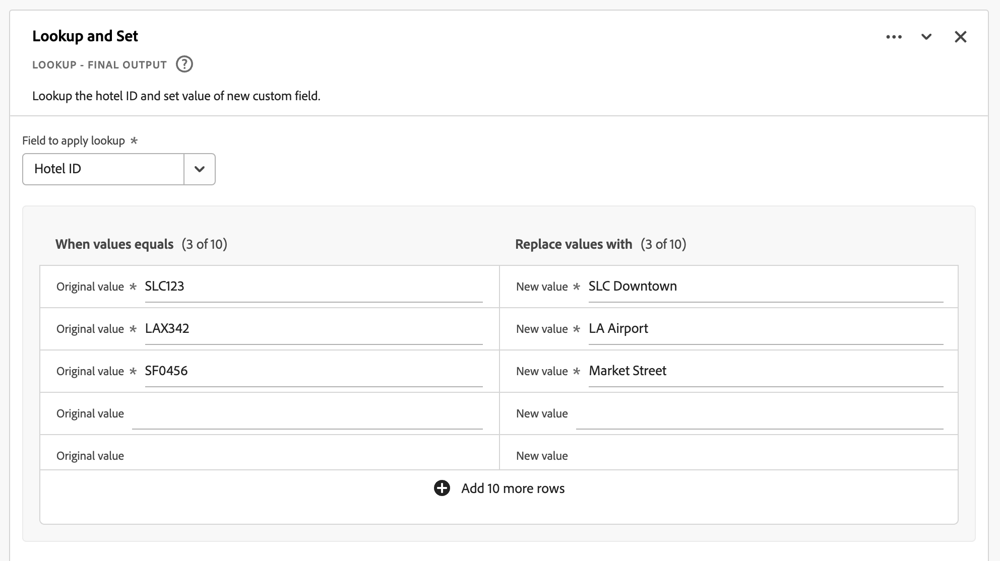

# 파생 필드

{{release-limited-testing}}

파생 필드는 Customer Journey Analytics(CJA)의 실시간 보고 기능의 중요한 측면입니다. 파생 필드를 사용하면 사용자 정의 가능한 규칙 빌더를 통해 즉석에서 (종종 복잡한) 데이터 조작을 정의할 수 있습니다. 그런 다음에서 파생된 필드를 구성 요소(지표 또는 차원)로 사용할 수 있습니다. [작업 영역](../../analysis-workspace/home.md) 또는 파생된 필드를 의 구성 요소로 추가로 정의합니다. [데이터 보기](../data-views.md).

파생 필드는 CJA 외부의 다른 위치에서 데이터를 변환하거나 조작하는 것과 비교하여 상당한 시간과 노력을 절약할 수 있습니다. 과 같은 [데이터 준비](https://experienceleague.adobe.com/docs/experience-platform/data-prep/home.html?lang=ko-KR), [데이터 Distiller](https://experienceleague.adobe.com/docs/experience-platform/query/data-distiller/overview.html?lang=en)또는 고유한 ETL(추출 변환 로드) / ELT(추출 로드 변환) 프로세스 내에서 사용할 수 있습니다.

파생 필드는 다음 내에서 정의됩니다. [데이터 보기](../data-views.md)는 규칙으로 정의된 함수 집합을 기반으로 하며 사용 가능한 표준 및/또는 스키마 필드에 적용됩니다.

사용 사례의 예는 다음과 같습니다.

- 잘못 수집된 페이지 이름 값을 수정하여 페이지 이름 값을 수정하는 파생 페이지 이름 필드를 정의합니다.

- 하나 이상의 조건(예: URL 매개 변수, 페이지 URL, 페이지 이름)을 기반으로 적절한 마케팅 채널을 결정하는 파생된 마케팅 채널 필드를 정의합니다.

## 파생 필드 인터페이스

파생 필드를 만들거나 편집할 때 파생 필드 인터페이스를 사용합니다.

|  |  이름  | 설명 |
|---------|----------|--------|
| 1 | **선택기** | 선택기 영역을 사용하여 함수, 함수 템플릿, 스키마 필드 또는 표준 필드를 선택하여 규칙 빌더로 끌어다 놓습니다.  드롭다운을 사용하여 다음 중 하나를 선택합니다.   [!UICONTROL 함수] - 사용 가능한 목록 [함수](#function-reference),   [!UICONTROL 함수 템플릿] - 사용 가능한 목록 [함수 템플릿](#function-templates),    [!UICONTROL 스키마 필드] - 데이터 세트 카테고리(이벤트, 프로필, 조회) 및 이전에 정의된 파생 필드에서 사용할 수 있는 필드를 나열합니다.   [!UICONTROL 표준 필드] - 표준 사용 가능한 필드 (예: 플랫폼 데이터 세트 ID). 문자열 및 숫자 표준 필드만 선택기에 표시됩니다. 함수가 다른 데이터 형식을 지원하는 경우 규칙 인터페이스 내의 값 또는 필드에 대해 이러한 다른 데이터 형식을 사용하는 표준 필드를 선택할 수 있습니다. 다음을 사용하여 함수, 함수 템플릿, 스키마 및 표준 필드를 검색할 수 있습니다.  검색 상자.  다음을 선택하여 선택한 객체 목록을 필터링할 수 있습니다.  필터 및 필터 지정 [!UICONTROL 필드 필터링 기준] 대화 상자. 다음을 사용하여 필터를 쉽게 제거할 수 있습니다.  각 필터에 대해 |
| 2 | **규칙 빌더** | 하나 이상의 규칙을 사용하여 파생 필드를 순차적으로 작성합니다. 규칙은 특정 함수 구현이므로 항상 하나의 함수에만 연결됩니다. 함수를 규칙 빌더로 끌어다 놓아 규칙을 만듭니다. 함수 유형은 규칙의 인터페이스를 결정합니다. 다음을 참조하십시오. [규칙 인터페이스](#rule-interface) 추가 정보.  규칙 빌더에서 이미 사용 가능한 규칙의 시작, 끝 또는 중간에 함수를 삽입할 수 있습니다. 규칙 빌더의 마지막 규칙이 파생된 필드의 최종 출력을 결정합니다. |
| 3 | **[!UICONTROL **&#x200B;필드 설정&#x200B;**]** | 파생 필드의 이름과 설명을 지정하고 필드 유형을 검사할 수 있습니다. |
| 4 | **[!UICONTROL **&#x200B;최종 출력&#x200B;**]** | 이 영역에는 지난 30일 동안의 데이터 및 규칙 빌더의 파생 필드에 대한 변경 사항을 기반으로 즉석으로 업데이트된 출력 값 미리보기가 표시됩니다. |

{style="table-layout:auto"}

## 필드 템플릿 마법사

파생 필드 인터페이스에 처음 액세스하면 [!UICONTROL 필드 템플릿으로 시작] 마법사가 표시됩니다.

1. 만들려는 필드 유형을 가장 잘 설명하는 템플릿을 선택합니다.
2. 다음 항목 선택 **[!UICONTROL **&#x200B;선택&#x200B;**]** 단추를 클릭하여 계속합니다.

파생 필드 대화 상자는 선택한 필드 유형에 필요하거나 유용한 규칙(및 함수)으로 채워집니다. 다음을 참조하십시오 [함수 템플릿](#function-templates) 사용 가능한 템플릿에 대한 자세한 내용을 보려면.

## 규칙 인터페이스

규칙 빌더에서 규칙을 정의할 때는 규칙 인터페이스를 사용합니다.

|  |  이름  | 설명 |
|---------|----------|--------|
| A | **규칙 이름** | 기본적으로 규칙 이름은 입니다. **규칙 X** (X 는 시퀀스 번호를 나타냅니다.) 규칙 이름을 편집하려면 규칙 이름을 선택하고 새 이름을 입력합니다(예: ) `Query Parameter`. |
| B | **함수 이름** | 규칙에 대해 선택한 함수 이름(예: ) [!UICONTROL URL 구문 분석]. 함수가 함수 시퀀스의 마지막 함수이고 최종 출력 값을 결정하는 경우 함수 이름 뒤에 가 옵니다. [!UICONTROL - 최종 출력], 예 [!UICONTROL URL 구문 분석 - 최종 출력].  기능에 대한 추가 정보가 있는 팝업을 표시하려면 을 선택합니다. . |
| C | **규칙 설명** | 원할 경우 규칙에 설명을 추가할 수 있습니다. 선택 을 선택한 다음 을 선택합니다. **[!UICONTROL **&#x200B;설명 추가&#x200B;**]** 설명 또는 **[!UICONTROL **&#x200B;설명 편집&#x200B;**]** 기존 설명을 편집합니다. 편집기를 사용하여 설명을 입력합니다. 도구 모음을 사용하여 텍스트 서식을 지정하고(스타일 선택기, 굵게, 기울임꼴, 밑줄, 오른쪽, 왼쪽, 가운데, 색상, 번호 목록, 글머리 기호 목록 사용) 외부 정보에 링크를 추가할 수 있습니다.  설명 편집을 완료하려면 편집기 외부를 클릭합니다. |
| D | **기능 영역** | 함수의 논리를 정의합니다. 인터페이스는 함수 유형에 따라 다릅니다. 다음에 대한 드롭다운 [!UICONTROL 필드] 또는 [!UICONTROL 값] 함수에서 예상하는 입력 유형에 따라 사용 가능한 모든 필드 범주(규칙, 표준 필드, 필드)를 표시합니다. 다음을 참조하십시오 [함수 참조](#function-reference) 지원되는 각 기능에 대한 자세한 정보를 제공합니다. |

{style="table-layout:auto"}

## 파생 필드 만들기

1. 기존 데이터 보기를 선택하거나 데이터 보기를 만듭니다. 다음을 참조하십시오 [데이터 보기](../data-views.md) 추가 정보.

2. 다음 항목 선택 **[!UICONTROL **&#x200B;구성 요소&#x200B;**]** 데이터 보기 탭

3. 선택 **[!UICONTROL **&#x200B;파생 필드 만들기&#x200B;**]** 왼쪽 레일에서.

4. 파생 필드를 정의하려면 [!UICONTROL 파생 필드 만들기] 인터페이스. 다음을 참조하십시오 [파생 필드 인터페이스](#derived-field-interface).

   새 파생 필드를 저장하려면 **[!UICONTROL **&#x200B;저장&#x200B;**]**.

5. 새 파생 필드가 [!UICONTROL 파생 필드 >] 컨테이너, 의 일부 **[!UICONTROL **&#x200B;스키마 필드&#x200B;**]** 데이터 보기의 왼쪽 레일에서 을 클릭합니다.

## 파생 필드 편집

1. 기존 데이터 보기를 선택합니다. 다음을 참조하십시오 [데이터 보기](../data-views.md) 추가 정보.

2. 다음 항목 선택 **[!UICONTROL **&#x200B;구성 요소&#x200B;**]** 데이터 보기 탭

3. 선택 **[!UICONTROL **&#x200B;스키마 필드&#x200B;**]** 의 탭 [!UICONTROL 연결] 왼쪽 창입니다.

4. 선택 **[!UICONTROL **&#x200B;파생 필드 >**]** 컨테이너.

5. 편집할 파생 필드 위로 마우스를 가져간 다음 .

6. 파생 필드를 편집하려면 다음을 사용하십시오. [!UICONTROL 파생 필드 편집] 인터페이스. 다음을 참조하십시오 [파생 필드 인터페이스](#derived-field-interface).

   - 선택 **[!UICONTROL **&#x200B;저장&#x200B;**]** 업데이트된 파생 필드를 저장합니다.

   - 선택 **[!UICONTROL **&#x200B;취소&#x200B;**]** 파생 필드의 변경 사항을 취소합니다.

   - 선택 **[!UICONTROL **&#x200B;다른 이름으로 저장&#x200B;**]** 파생된 필드를 새 파생된 필드로 저장합니다. 새 파생 필드의 이름이 을 사용하여 편집한 원래 파생 필드와 동일합니다. `(copy)` 이(가) 추가되었습니다.

## 파생 필드 삭제

1. 기존 데이터 보기를 선택합니다. 다음을 참조하십시오 [데이터 보기](../data-views.md) 추가 정보.

2. 다음 항목 선택 **[!UICONTROL **&#x200B;구성 요소&#x200B;**]** 데이터 보기 탭

3. 선택 **[!UICONTROL **&#x200B;스키마 필드&#x200B;**]** 의 탭 [!UICONTROL 연결] 창.

4. 선택 **[!UICONTROL **&#x200B;파생 필드 >**]** 컨테이너.

5. 삭제할 파생 필드 위로 마우스를 가져간 다음 을 선택합니다 .

6. 사용 중 **[!UICONTROL **&#x200B;파생 필드 편집&#x200B;**]** 인터페이스에서 삭제를 선택합니다.

   A [!UICONTROL 구성 요소 삭제] 대화 상자에서 삭제를 확인하는 메시지가 표시됩니다. 데이터 보기 외부의 파생된 필드에 대한 외부 참조가 있을 수 있다고 가정합니다.

   - 선택 **[!UICONTROL **&#x200B;계속&#x200B;**]** 파생된 필드를 삭제합니다.

>[!NOTE]
>
>파생 필드는 CJA의 연결 수준에서 관리됩니다. 해당 연결과 연결된 데이터 보기의 파생 필드에 대한 변경 사항은 이러한 연결된 데이터 보기 모두에 적용됩니다.

## 함수 템플릿

특정 사용 사례에 대한 파생 필드를 신속하게 만들려면 함수 템플릿을 사용할 수 있습니다. 이러한 함수 템플릿은 파생 필드 인터페이스의 선택기 영역에서 액세스하거나 [!UICONTROL 필드 템플릿으로 시작] 마법사.

### 마케팅 채널

이 템플릿은 [Url 구문 분석](#dnl-url-parse) 및 [사례 시기](#dnl-case-when) 는 URL에서 적절한 값을 가져오기 위해 여러 번 작동합니다. 그런 다음 이러한 값에 논리를 적용하여 URL을 특정 마케팅 채널에 연결합니다.

+++ 세부 사항

템플릿을 사용하려면 템플릿에 규칙의 일부로 나열된 각 함수에 대해 올바른 매개 변수를 지정해야 합니다. 다음을 참조하십시오 [함수 참조](#function-reference) 추가 정보.

+++

<!--

+++ Data clean up template

>[!WARNING]
>
>Could not find any information on this template.
+++

-->

## 함수 참조

지원되는 각 함수에 대해 아래에서 세부 정보를 확인하십시오.

- 사양:
   - 입력 데이터 유형: 지원되는 데이터 유형,
   - 입력: 입력에 가능한 값,
   - 포함된 연산자: 이 함수에 지원되는 연산자(있는 경우),
   - 제한 사항: 이 특정 기능에 적용되는 제한 사항,
   - 출력.

- 다음을 포함한 사용 사례:
   - 파생된 필드를 정의하기 전의 데이터,
   - 파생 필드를 정의하는 방법,
   - 파생된 필드를 정의한 후의 데이터입니다.

- 제한(해당되는 경우).

<!-- Concatenate -->

### 연결

두 개 이상의 필드, 파생된 필드 또는 사용자가 입력한 값을 정의된 구분 기호가 있는 단일 필드에 결합합니다.

+++ 세부 사항

## 사양 {#concatenate-io}

| 입력 데이터 유형 | 입력 | 포함된 연산자 | 제한 사항 | 출력 |
|---|---|---|---|---|
| 
문자열
 | <ul><li>각 [!UICONTROL 값]:<ul><li>규칙</li><li>표준 필드</li><li>필드</li><li>사용자 입력 입력</li></ul></li><li>각 [!UICONTROL 구분 기호]:<ul><li>사용자 입력 입력</li></ul></li> </ul> | 
해당 사항 없음
 | 
파생 필드당 2개 함수
 | 
새 파생 필드
 |

{style="table-layout:auto"}

## 사용 사례 {#concatenate-uc}

현재 원본 및 대상 공항 코드를 별도의 필드로 수집하고 있습니다. 두 필드를 하이픈(-)으로 구분된 단일 차원으로 결합하려고 합니다. 따라서 출발지와 목적지의 조합을 분석하여 예약된 상위 경로를 식별할 수 있습니다.

가정:

- 원본 및 대상 값은 동일한 테이블의 별도 필드에 수집됩니다.
- 사용자는 값 사이에 구분 기호 &#39;-&#39;를 사용하기로 결정합니다.

다음과 같은 예약이 발생한다고 가정해 보십시오.

- 고객 ABC123은 Salt Lake City(SLC)와 Orlando(MCO) 간 항공권 예약
- 고객 ABC456, SLC(Salt Lake City)와 LAX(Los Angeles) 간 항공권 예약
- 고객 ABC789는 Salt Lake City(SLC)와 Seattle(SEA) 간의 항공편을 예약합니다.
- 고객 ABC987은 Salt Lake City(SLC)와 San Jose(SJO) 간 항공권 예약
- 고객 ABC654는 Salt Lake City(SLC)와 Orlando(MCO) 간 항공권 예약

원하는 보고서는 다음과 같아야 합니다.

| 원본 / 대상 | 예약 |
|----|---:|
| SLC-MCO | 2 |
| SLC-LAX | 1 |
| SLC-SEA | 1 |
| SLC-JO | 1 |

{style="table-layout:auto"}

### 다음 이전 데이터 {#concatenate-uc-databefore}

| Origin | 대상 |
|----|---:|
| SLC | MCO |
| SLC | LAX |
| SLC | SEA |
| SLC | SJO |
| SLC | MCO |

{style="table-layout:auto"}

### 파생 필드 {#concatenate-derivedfield}

새 항목을 정의합니다. [!UICONTROL 원본 - 대상] 파생 필드. 다음을 사용합니다. [!UICONTROL 연결] 을 연결하는 규칙을 정의하는 함수 [!UICONTROL 원본] 및 [!UICONTROL 대상] 를 사용하는 필드 `-` [!UICONTROL 구분 기호].

### 다음 이후 데이터 {#concatenate-dataafter}

| 원본 - 대상 (파생 필드) |
|---|
| SLC-MCO |
| SLC-LAX |
| SLC-SEA |
| SLC-JO |
| SLC-MCO |

{style="table-layout:auto"}

+++

<!-- CASE WHEN -->

### 다음과 같은 경우

하나 이상의 필드에서 정의된 기준에 따라 조건을 적용합니다. 그런 다음 이러한 기준을 사용하여 조건의 시퀀스를 기반으로 새 파생 필드의 값을 정의합니다.

+++ 세부 사항

## 사양 {#casewhen-io}

| 입력 데이터 유형 | 입력 | 포함된 연산자 | 제한 사항 | 출력 |
|---|---|---|---|---|
| <ul><li>문자열</li><li>숫자</li><li>날짜</li></ul> | <ul><li>각 [!UICONTROL If], [!UICONTROL Else If] 컨테이너:
<ul><li>[!UICONTROL 값]</li><ul><li>규칙</li><li>표준 필드</li><li>필드</li></ul><li>[!UICONTROL 기준] (선택한 값 유형에 따라 포함된 연산자 참조)</li></ul></li><li>각 [!UICONTROL 그런 다음 값을 로 설정합니다.], [!UICONTROL 그렇지 않으면 값을 로 설정하십시오.]:
<ul><li>[!UICONTROL 값]</li><ul><li>규칙</li><li>표준 필드</li><li>필드</li></ul></ul></li></ul> | 
문자열
<ul><li>다음과 같음</li><li>모든 검색어와 같음</li><li>구문 포함</li><li>검색어를 하나라도 포함</li><li>다음 검색어 포함</li><li>다음으로 시작</li><li>모든 용어로 시작</li><li>다음으로 끝남</li><li>모든 용어로 끝남</li><li>다음과 같지 않음</li><li>모든 검색어와 같지 않음</li><li>다음 구문 포함 안 함</li><li>검색어 포함 안 함</li><li>모든 검색어를 포함하지 않음</li><li>다음으로 시작하지 않음</li><li>어떤 용어로 시작하지 않음</li><li>다음으로 끝나지 않음</li><li>어떤 용어로 끝나지 않음</li><li>세트임</li><li>세트가 아님</li></ul>
숫자
<ul><li>다음과 같음</li><li>다음과 같지 않음</li><li>다음보다 큼</li><li>다음보다 크거나 같음</li><li>다음보다 작음</li><li>다음보다 작거나 같음</li><li>세트임</li><li>세트가 아님</li></ul>
날짜
<ul><li>다음과 같음</li><li>다음과 같지 않음</li><li>다음보다 이후</li><li>다음보다 이후이거나 같음</li><li>다음 이전임</li><li>다음 이전이거나 다음과 같음</li><li>세트임</li><li>세트가 아님</li></ul> | <ul><li>파생 필드당 5개 함수</li><li>파생 필드당 200개 연산자. 단일 연산자의 예로는 &#39;참조 도메인 포함 google&#39;이 있습니다. </li></ul> | 
새 파생 필드
 |

{style="table-layout:auto"}

## 사용 사례 1 {#casewhen-uc1}

계단식 로직을 적용하여 마케팅 채널 필드를 적절한 값으로 설정하여 다양한 마케팅 채널을 식별하는 규칙을 정의하려는 경우:

- 레퍼러가 검색 엔진에서 왔고 페이지에 쿼리 문자열 값이 있는 경우 `cid` 다음 포함 `ps_`, 마케팅 채널은 (으)로 식별되어야 합니다. [!DNL *유료 검색*].
- 레퍼러가 검색 엔진에서 왔으며 페이지에 쿼리 문자열이 없는 경우 `cid`, 마케팅 채널은 (으)로 식별되어야 합니다. [!DNL *자연어 검색*].
- 페이지에 쿼리 문자열 값이 있는 경우 `cid` 다음 포함 `em_`, 마케팅 채널은 (으)로 식별되어야 합니다. [!DNL *이메일*].
- 페이지에 쿼리 문자열 값이 있는 경우 `cid` 다음 포함 `ds_`, 마케팅 채널은 (으)로 식별되어야 합니다. [!DNL *광고 표시*].
- 페이지에 쿼리 문자열 값이 있는 경우 `cid` 다음 포함 `so_`, 마케팅 채널은 (으)로 식별되어야 합니다. [!DNL *유료 소셜*].
- 레퍼러가 의 참조 도메인에서 온 경우 [!DNL twitter.com], [!DNL facebook.com], [!DNL linkedin.com], 또는 [!DNL tiktok.com], 마케팅 채널은 (으)로 식별되어야 합니다. [!DNL *자연적인 사회*].
- 위의 규칙 중 일치하는 규칙이 없으면 마케팅 채널은 (으)로 식별되어야 합니다. [!DNL *기타 레퍼러*].

사이트에서 다음 샘플 이벤트를 수신하는 경우 다음을 포함: [!UICONTROL 레퍼러] 및 [!UICONTROL 페이지 URL], 이러한 이벤트는 다음과 같이 식별해야 합니다.

| [!DNL Event] | [!DNL Referrer] | [!DNL Page URL] | [!DNL Marketing Channel] |
|:--:|----|----|----|
| 1 | `https://facebook.com` | `https://site.com/home` | [!DNL Natural Social] |
| 2 | `https://abc.com` | `https://site.com/?cid=ds_12345678` | [!DNL Display] |
| 3 |  | `https://site.com/?cid=em_12345678` | [!DNL Email] |
| 4 | `https://google.com` | `https://site.com/?cid=ps_abc098765` | [!DNL Paid Search] |
| 5 | `https://google.com` | `https://site.com/?cid=em_765544332` | [!DNL Email] |
| 6 | `https://google.com` |  | [!DNL Natural Search] |

{style="table-layout:auto"}

### 다음 이전 데이터 {#casewhen-uc1-databefore}

| [!DNL Referrer] | [!DNL Page URL] |
|----|----|
| `https://facebook.com` | `https://site.com/home` |
| `https://abc.com` | `https://site.com/?cid=ds_12345678` |
|  | `https://site.com/?cid=em_12345678` |
| `https://google.com` | `https://site.com/?cid=ps_abc098765` |
| `https://google.com` | `https://site.com/?cid=em_765544332` |
| `https://google.com` |

{style="table-layout:auto"}

### 파생 필드 {#casewhen-uc1-derivedfield}

새 항목을 정의합니다. `Marketing Channel` 파생 필드. 다음을 사용합니다. [!UICONTROL 다음의 경우] 함수 를 사용하여 두 요소의 기존 값을 기반으로 의 값을 생성하는 `Page URL` 및 `Referring URL` 필드.

함수의 사용에 주의하십시오 [!UICONTROL URL 구문 분석] 값을 가져올 규칙을 정의하려면 `Page Url` 및 `Referring Url` 다음 이전 [!UICONTROL 다음의 경우] 규칙이 적용됩니다.

### 다음 이후 데이터 {#casewhen-uc1-dataafter}

| [!DNL Marketing Channel] |
|----|
| [!DNL Natural Social] |
| [!DNL Display] |
| [!DNL Email] |
| [!DNL Paid Search] |
| [!DNL Email] |
| [!DNL Natural Search] |

{style="table-layout:auto"}

## 사용 사례 2 {#casewhen-uc2}

내에서 여러 가지 다양한 검색 변형을 수집했습니다. [!DNL Product Finding Methods] 차원. 검색과 탐색의 전체 성능을 이해하려면 결과를 수동으로 결합하는 데 많은 시간을 소비해야 합니다.

귀하의 사이트에서 귀하의 다음 값을 수집합니다. [!DNL Product Finding Methods] 차원. 결국 이 모든 값은 검색을 나타냅니다.

| 수집된 값 | 실제 값 |
|---|---|
| [!DNL search p13n_no] | [!DNL search] |
| [!DNL search p13n_yes] | [!DNL search] |
| [!DNL search refine p13n_no] | [!DNL search] |
| [!DNL search refine p13n_yes ] | [!DNL search] |
| [!DNL search redirect p13n_yes] | [!DNL search] |
| [!DNL search-redirect] | [!DNL search] |

{style="table-layout:auto"}

### 다음 이전 데이터 {#casewhen-uc2-databefore}

| [!DNL Product Finding Methods] |
|----|
| [!DNL search p13_no] |
| [!DNL search p13_yes] |
| [!DNL browse] |
| [!DNL search refine p13_no] |
| [!DNL search refine p13_yes] |
| [!DNL browse] |
| [!DNL search redirect p13_yes] |
| [!DNL search-redirect] |
| [!DNL browse] |

{style="table-layout:auto"}

### 파생 필드 {#casewhen-uc2-derivedfield}

다음을 정의합니다. `Product Finding Methods (new)` 파생 필드. 다음을 생성합니다 [!UICONTROL 다음의 경우] 규칙 빌더의 규칙. 이 규칙은 가능한 모든 구 변형에 논리를 적용합니다 [!UICONTROL 제품 검색 방법] 필드 값 `search` 및 `browse` 사용 [!UICONTROL 구문 포함] 기준.

### 다음 이후 데이터 {#casewhen-uc2-dataafter}

| [!DNL Product Finding Methods (new)] |
|----|
| [!DNL search] |
| [!DNL search] |
| [!DNL browse] |
| [!DNL search] |
| [!DNL search] |
| [!DNL browse] |
| [!DNL search] |
| [!DNL search] |
| [!DNL browse] |

{style="table-layout:auto"}

## 사용 사례 3 {#casewhen-uc3}

여행 회사는 버켓 여행 길이를 보고할 수 있도록 예약된 여행에 대해 여행 기간을 버켓팅하려고 합니다.

가정:

- 조직이 이동 기간을 숫자 필드로 수집하고 있습니다.
- 1~3일 기간을 &#39;&#39; 버킷에 버킷팅하려고 합니다.[!DNL short trip]&#39;
- 4~7일 기간을 &#39;&#39; 버킷에 버킷팅하려고 합니다.[!DNL medium trip]&#39;
- 8일 이상의 기간을 &#39;&#39; 버킷에 버킷팅하려고 합니다.[!DNL long trip]&#39;
- 1일 동안 132회의 여행이 예약되었습니다
- 110번의 여행이 2일 동안 예약되었습니다
- 105번의 여행이 3일 동안 예약되었습니다
- 99번의 여행이 4일 동안 예약되었습니다
- 92번의 여행이 5일 동안 예약되었습니다
- 85번의 여행이 6일 동안 예약되었습니다
- 82번의 여행이 7일 동안 예약되었습니다
- 78번의 여행이 8일 동안 예약되었습니다
- 50번의 여행이 9일 동안 예약되었습니다
- 44번의 여행이 10일 동안 예약되었습니다
- 38번의 여행이 11일 동안 예약되었습니다
- 31번의 여행은 12일 동안 예약되었습니다

원하는 보고서는 다음과 같아야 합니다.

| [!DNL Trip Duration Type] | [!DNL Bookings] |
|----|---:|
| [!DNL medium trip] | 358 |
| [!DNL short trip] | 347 |
| [!DNL long trip] | 241 |

{style="table-layout:auto"}

### 다음 이전 데이터 {#casewhen-uc3-databefore}

| [!DNL Trip Duration] |
|---:|
| 1 |
| 12 |
| 3 |
| 6 |
| 4 |
| 8 |
| 6 |
| 2 |
| 1 |
| 2 |
| 21 |
| 8 |

### 파생 필드 {#casewhen-uc3-derivedfield}

다음을 정의합니다. `Trip Duration (bucketed)` 파생 필드. 다음을 생성합니다 [!UICONTROL 다음의 경우] 규칙 빌더의 규칙입니다. 이 규칙은 논리를 적용하여 이전 버전을 버킷합니다. [!UICONTROL 이동 기간] 필드 값을 다음 세 가지 값으로 변환: `short trip`, `medium  trip`, 및 `long trip`.

### 다음 이후 데이터 {#casewhen-uc3-dataafter}

| [!DNL Trip Duration (bucketed)] |
|---|
| [!DNL short trip] |
| [!DNL long trip] |
| [!DNL short trip] |
| [!DNL medium trip] |
| [!DNL medium trip] |
| [!DNL long trip] |
| [!DNL medium trip] |
| [!DNL short trip] |
| [!DNL short trip] |
| [!DNL short trip] |
| [!DNL long trip] |
| [!DNL long trip] |

## 제한

CJA에서는 Adobe Experience Platform의 [XDM](https://experienceleague.adobe.com/docs/experience-platform/xdm/home.html?lang=ko-KR) (경험 데이터 모델). 다음을 참조하십시오 [컨테이너](../create-dataview.md#containers) 및 [필터 컨테이너](../../components/filters/filters-overview.md#filter-containers) 을 참조하십시오. 이 컨테이너 모델은 기본적으로 유연하지만 규칙 빌더를 사용할 때 몇 가지 제한 사항을 부과합니다.

CJA는 다음과 같은 기본 컨테이너 모델을 사용합니다.

다음 제한은 적용되지 않으며 다음과 같은 경우에 적용됩니다. *선택* 및 *설정* 값.

|  | 제한 |
|:---:|----|
| **A** | 귀하 값 *선택* 같은 기간 이내 [!UICONTROL If], [!UICONTROL Else If] 구문(사용) [!UICONTROL 및] 또는 [!UICONTROL 또는])를 사용하는 규칙은 동일한 컨테이너에서 파생되어야 하며 모든 유형(문자열)일 수 있습니다 , 숫자 등).   |
| **B** | 귀하가 지정한 모든 값 *set* 전체 규칙은 동일한 컨테이너의 값이어야 하며 동일한 유형 또는 동일한 유형의 파생된 값을 가져야 합니다.    |
| **C** | 값: *선택* 가로 [!UICONTROL If], [!UICONTROL Else If] 규칙의 구문은 다음과 같습니다. *아님* 동일한 컨테이너에서 가져와서 다음을 수행해야 합니다. *아님* 같은 유형이어야 합니다.    |

{style="table-layout:auto"}

+++

<!-- FIND AND REPLACE -->

### 찾기 및 바꾸기

선택한 필드에서 모든 값을 찾아 새 파생 필드에서 다른 값으로 바꿉니다.

+++ 세부 사항

## 사양 {#findreplace-io}

| 입력 데이터 유형 | 입력 | 포함된 연산자 | 제한 사항 | 출력 |
|---|---|---|---|---|
| 
문자열
 | <ul><li>기준의 경우:<ul><li>[!UICONTROL 값]<ul><li>규칙</li><li>표준 필드</li><li>필드</li></ul></li></ul></li><li>각 [!UICONTROL 모두 찾기], [!UICONTROL 모두 다음으로 바꾸기]:<ul><li>[!UICONTROL 값]</li><ul><li>사용자 입력 입력</li></ul></li></ul></ul> | 
문자열
<ul><li>[!UICONTROL 모두 찾기], [!UICONTROL 모두 다음으로 바꾸기]</li></ul> | 
파생 필드당 5개 함수
 | 
새 파생 필드
 |

{style="table-layout:auto"}

## 사용 사례 {#findreplace-uc}

예를 들어 외부 마케팅 채널 보고서에 대한 일부 잘못된 형식의 값을 받았습니다. `email%20 marketing` 대신 `email marketing`. 이러한 잘못된 값은 보고를 분할하고 이메일이 어떻게 작동하는지 확인하는 것을 더 어렵게 합니다. 을(를) 바꾸려는 경우 `email%20marketing` 포함 `email marketing`.

**원본 보고서**

| [!DNL External Marketing Channels] | [!DNL Sessions] |
|---|--:|
| [!DNL email marketing] | 500 |
| [!DNL email %20marketing] | 24 |

{style="table-layout:auto"}

**기본 보고서**

| [!DNL External Marketing Channels] | [!DNL Sessions] |
|---|--:|
| [!DNL email marketing] | 524 |

### 다음 이전 데이터 {#findreplace-uc-databefore}

| [!DNL External Marketing] |
|----|
| [!DNL email marketing] |
| [!DNL email%20marketing] |
| [!DNL email marketing] |
| [!DNL email marketing] |
| [!DNL email%20marketing] |

{style="table-layout:auto"}

### 파생 필드 {#findreplace-uc-derivedfield}

다음을 정의합니다. `Email Marketing (updated)` 파생 필드. 다음을 사용합니다. [!UICONTROL 찾기 및 바꾸기] 함수를 사용하여 모든 발생 항목을 찾아 바꿀 규칙을 정의합니다. `email%20marketing` 포함 `email marketing`.

### 다음 이후 데이터 {#findreplace-uc-dataafter}

| [!DNL External Marketing (updated)] |
|----|
| [!DNL email marketing] |
| [!DNL email marketing] |
| [!DNL email marketing] |
| [!DNL email marketing] |
| [!DNL email marketing] |

{style="table-layout:auto"}

+++

<!-- LOOKUP -->

### 조회

해당 값으로 대체되는 조회 값 집합을 정의합니다.

+++ 세부 사항

## 사양 {#lookup-io}

| 입력 데이터 유형 | 입력 | 포함된 연산자 | 제한 사항 | 출력 |
|---|---|---|---|---|
| <ul><li>문자열</li><li>숫자</li><li>날짜</li></ul> | <ul><li>대상 [!UICONTROL 조회를 적용할 필드]:<ul><li>규칙</li><li>표준 필드</li><li>필드</li></ul></li><li>대상 [!UICONTROL 값이 다음과 같은 경우] 및 [!UICONTROL 값 바꾸기]:
<ul><li>사용자 입력 입력</li></ul></li></ul> | 
해당 사항 없음
 | 
파생 필드당 5개 함수
 | 
새 파생 필드
 |

{style="table-layout:auto"}

## 사용 사례 1 {#lookup-uc1}

에 대한 키 열이 포함된 CSV 파일이 있습니다. `hotelID` 및 와 연결된 하나 이상의 추가 열 `hotelID`: `city`, `rooms`, `hotel name`.
수집하는 중입니다. [!DNL Hotel ID] 차원에서 다음을 생성하려고 함 [!DNL Hotel Name] 에서 파생된 차원 `hotelID` CSV 파일로 내보낼 때 시간별 세부기간이 작동하지 않는 문제를 해결했습니다.

**CSV 파일 구조 및 콘텐츠**

| [!DNL hotelID] | [!DNL city] | [!DNL rooms] | [!DNL hotel name] |
|---|---|---:|---|
| [!DNL SLC123] | [!DNL Salt Lake City] | 40 | [!DNL SLC Downtown] |
| [!DNL LAX342] | [!DNL Los Angeles] | 60 | [!DNL LA Airport] |
| [!DNL SFO456] | [!DNL San Francisco] | 75 | [!DNL Market Street] |

{style="table-layout:auto"}

**현재 보고서**

| [!DNL Hotel ID] | 제품 보기 |
|---|---:|
| [!DNL SLC123] | 200 |
| [!DNL LX342] | 198 |
| [!DNL SFO456] | 190 |

{style="table-layout:auto"}

**원하는 보고서**

| [!DNL Hotel Name] | 제품 보기 |
|----|----:|
| [!DNL SLC Downtown] | 200 |
| [!DNL LA Airport] | 198 |
| [!DNL Market Street] | 190 |

{style="table-layout:auto"}

### 다음 이전 데이터 {#lookup-uc1-databefore}

| [!DNL Hotel ID] |
|----|
| [!DNL SLC123] |
| [!DNL LAX342] |
| [!DNL SFO456] |

{style="table-layout:auto"}

### 파생 필드 {#lookup-uc1-derivedfield}

다음을 정의합니다. `Hotel Name` 파생 필드. 다음을 사용합니다. [!UICONTROL 조회] 함수 를 사용하여 규칙 값을 조회할 수 있습니다. [!UICONTROL 호텔 아이디] 필드 및 새 값으로 대체합니다.

### 다음 이후 데이터 {#lookup-uc1-dataafter}

| [!DNL Hotel Name] |
|----|
| [!DNL SLC Downtown] |
| [!DNL LA Airport] |
| [!DNL Market Street] |

{style="table-layout:auto"}

## 사용 사례 2 {#lookup-uc2}

여러 페이지에 대해 친숙한 페이지 이름 대신 URL을 수집했습니다. 이렇게 혼합된 값 컬렉션은 보고를 중단합니다.

### 다음 이전 데이터 {#lookup-uc2-databefore}

| [!DNL Page Name] |
|---|
| [!DNL Home Page] |
| [!DNL Flight Search] |
| `http://www.adobetravel.ca/Hotel-Search` |
| `https://www.adobetravel.com/Package-Search` |
| [!DNL Deals & Offers] |
| `http://www.adobetravel.ca/user/reviews` |
| `https://www.adobetravel.com.br/Generate-Quote/preview` |

{style="table-layout:auto"}

### 파생 필드 {#lookup-uc2-derivedfield}

다음을 정의합니다. `Page Name (updated)` 파생 필드. 다음을 사용합니다. [!UICONTROL 조회] 함수를 사용하여 기존 값을 조회할 수 있는 규칙을 정의합니다. [!UICONTROL 페이지 이름] 필드 및 바꾸기 를 업데이트된 올바른 값으로 바꿉니다.

### 다음 이후 데이터 {#lookup-uc2-dataafter}

| [!DNL Page Name (updated)] |
|---|
| [!DNL Home Page] |
| [!DNL Flight Search] |
| [!DNL Hotel Search] |
| [!DNL Package Search] |
| [!DNL Deals & Offers] |
| [!DNL Reviews] |
| [!DNL Generate Quote] |

+++

<!-- URL PARSE -->

### URL 구문 분석

프로토콜, 호스트, 경로 또는 쿼리 매개 변수 등 URL의 다양한 부분을 구문 분석합니다.

+++ 세부 사항

## 사양 {#urlparse-io}

| 입력 데이터 유형 | 입력 | 포함된 연산자 |  제한 | 출력 |
|---|---|---|---|---|
| <ul><li>문자열</li></ul> | <ul><li>대상 [!UICONTROL 필드]:</li><ul><li>규칙</li><li>표준 필드</li><li>필드</li></ul><li>대상 [!UICONTROL 옵션]:<ul><li>[!UICONTROL 프로토콜 가져오기]</li><li>[!UICONTROL 호스트 가져오기]</li><li>[!UICONTROL 경로 가져오기]</li><li>[!UICONTROL 쿼리 문자열 값 가져오기]<ul><li>[!UICONTROL 쿼리 매개 변수]:<ul><li>사용자 입력 입력</li></ul></li></ul></li><li>[!UICONTROL 해시 값 가져오기]</li></ul></li></ul></li></ul> | 
해당 사항 없음
 | 
파생 필드당 5개 함수
 | 
새 파생 필드
 |

{style="table-layout:auto"}

## 사용 사례 1 {#urlparse-uc1}

참조 URL의 참조 도메인만 마케팅 채널의 규칙 세트의 일부로 사용할 수 있습니다.

### 다음 이전 데이터 {#urlparse-uc1-databefore}

| [!DNL Referring URL] |
|----|
| `https://www.google.com/` |
| `https://duckduckgo.com/` |
| `https://t.co/` |
| `https://l.facebook.com/` |

{style="table-layout:auto"}

### 파생 필드 {#urlparse-uc1-derivedfield}

다음을 정의합니다.  `Referring Domain` 파생 필드. 다음을 사용합니다. [!UICONTROL URL 구문 분석] 함수에서 호스트를 가져오는 규칙을 정의합니다. [!UICONTROL 참조 URL] 필드 및 새 파생 필드에 저장합니다.

### 다음 이후 데이터 {#urlparse-uc1-dataafter}

| [!DNL Referrer Domain] |
|----|
| [!DNL www.google.com] |
| [!DNL duckduckgo.com] |
| [!DNL t.co] |
| [!DNL l.facebook.com] |

{style="table-layout:auto"}

## 사용 사례 2 {#urlparse-uc2}

의 값을 사용하려고 합니다. `cid` 쿼리 문자열의 매개 변수 [!DNL Page URL] 파생된 추적 코드 보고서 출력의 일부로 사용됩니다.

### 다음 이전 데이터 {#urlparse-uc2-databefore}

| [!DNL Page URL] |
|----|
| `https://www.adobe.com/?cid=abc123` |
| `https://www.adobe.com/?em=email1234&cid=def123` |
| `https://www.adobe.com/landingpage?querystring1=test&test2=1234&cid=xyz123` |

{style="table-layout:auto"}

### 파생 필드 {#urlparse-uc2-derivedfield}

다음을 정의합니다. `Query String CID` 파생 필드. 다음을 사용합니다. [!UICONTROL URL 구문 분석] 함수에서 쿼리 문자열 매개 변수의 값을 가져오는 규칙을 정의하는 데 사용됩니다 [!UICONTROL 페이지 URL] 필드, 지정 `cid` 를 쿼리 매개 변수로 사용하십시오. 출력 값은 새로 파생된 필드에 저장됩니다.

### 다음 이후 데이터 {#urlparse-uc2-dataafter}

| [!DNL Query String CID] |
|----|
| [!DNL abc123] |
| [!DNL def123] |
| [!DNL xyz123] |

{style="table-layout:auto"}

+++

## 제한 사항

일반적으로 파생된 필드 기능에는 다음 제한이 적용됩니다.

- 파생 필드에 대한 규칙을 정의할 때 최대 100개의 서로 다른 스키마 필드(표준 필드는 포함하지 않음)를 사용할 수 있습니다.
- CJA 연결당 최대 100개의 파생 필드를 가질 수 있습니다.
