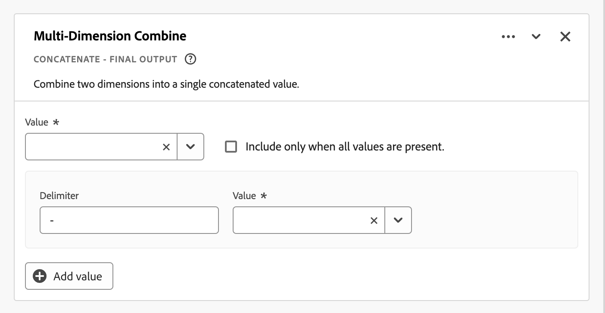

# 파생 필드 {#derived-fields}

>[!CONTEXTUALHELP]
>id="dataview_derivedfields"
>title="파생 필드"
>abstract="파생 필드를 사용하면 사용자 정의 가능한 규칙 빌더를 통해 즉석에서 데이터 조작을 정의할 수 있습니다. 그런 다음 해당 파생 필드를 Workspace에서 구성 요소(지표 또는 차원)로 사용하거나 데이터 보기에서 구성 요소로 추가로 정의할 수 있습니다."

파생 필드는 Adobe Customer Journey Analytics의 실시간 보고 기능에서 중요한 부분입니다. 파생 필드를 사용하면 사용자 정의 가능한 규칙 빌더를 통해 즉석에서 (종종 복잡한) 데이터 조작을 정의할 수 있습니다. 파생 필드를 [Workspace](../../analysis-workspace/home.md)의 구성 요소(지표 또는 차원)로 사용하거나 [데이터 보기](../data-views.md)에서 파생 필드를 구성 요소로 정의할 수도 있습니다.

파생 필드를 활용하면 Customer Journey Analytics 외부의 다른 위치에서 데이터를 변환하거나 조작하는 것에 비해 상당한 시간과 노력을 절약할 수 있습니다. [데이터 준비](https://experienceleague.adobe.com/docs/experience-platform/data-prep/home.html), [Data Distiller](https://experienceleague.adobe.com/docs/experience-platform/query/data-distiller/overview.html) 또는 자체 ETL(추출, 변환, 로드) / ELT(추출, 로드, 변환) 프로세스 내.

파생 필드는 [데이터 보기](../data-views.md) 내에서 정의되며, 규칙으로 정의된 함수 집합을 기반으로 하며, 사용 가능한 표준 및/또는 스키마 필드에 적용됩니다.

예시 사용 사례는 다음과 같습니다.

- 부적절하게 수집된 페이지 이름 값을 올바른 페이지 이름 값으로 수정하는 파생된 페이지 이름 필드를 정의합니다.

- 하나 이상의 조건(예: URL 매개변수, 페이지 URL, 페이지 이름)을 기반으로 적절한 마케팅 채널을 결정하는 파생 마케팅 채널 필드를 정의합니다.

## 파생 필드 인터페이스 {#interface}

파생 필드를 만들거나 편집할 때 파생 필드 인터페이스를 사용합니다.

|  | 이름 | 설명 |
|---------|----------|--------|
| 1 | **선택기** | 선택기 영역을 사용하여 함수, 함수 템플릿, 스키마 필드 또는 표준 필드를 규칙 빌더로 선택하고 끌어다 놓습니다.  드롭다운을 사용하여 다음 중에서 선택합니다.   [!UICONTROL 함수] - 사용 가능한 [함수](#function-reference) 목록,   [!UICONTROL 함수 템플릿] - 사용 가능한 [함수 템플릿](#function-templates) 목록,   [!UICONTROL 스키마 필드] - 데이터 세트 카테고리(이벤트, 프로필, 조회)에서 사용 가능한 필드와 이전에 정의된 파생 필드 목록 및   [!UICONTROL 표준 필드] - 사용 가능한 표준 필드(예: Platform 데이터 세트 ID). 선택기에는 문자열과 숫자 표준 필드만 표시됩니다. 함수가 다른 데이터 유형을 지원하는 경우, 다른 데이터 유형을 가진 표준 필드를 규칙 인터페이스 내의 값이나 필드로 선택할 수 있습니다.  검색 상자를 사용하여 함수, 함수 템플릿, 스키마 및 표준 필드를 검색할 수 있습니다.   필터를 선택하여 선택한 오브젝트 목록을 필터링하고 [!UICONTROL 필터 필드 기준] 대화 상자에서 필터를 지정할 수 있습니다. 각 필터의 을 사용하여 필터를 쉽게 제거할 수 있습니다. |
| 2 | **규칙 빌더** | 하나 이상의 규칙을 사용하여 파생 필드를 순차적으로 빌드합니다. 규칙은 함수의 구체적인 구현이므로 항상 하나의 함수에만 연결됩니다. 함수를 규칙 빌더로 끌어다 놓으면 규칙이 생성됩니다. 함수 유형이 규칙의 인터페이스를 결정합니다. 자세한 내용은 [규칙 인터페이스](#rule-interface)를 참조하십시오.  규칙 빌더에서 사용할 수 있는 규칙의 시작, 끝 또는 사이에 함수를 삽입할 수 있습니다. 규칙 빌더의 마지막 규칙이 파생 필드의 최종 출력을 결정합니다. |
| 3 | **[!UICONTROL **&#x200B;필드 설정&#x200B;**]** | 파생 필드의 이름을 지정하고 설명하고, 필드 유형을 검사할 수 있습니다. |
| 4 | **[!UICONTROL **&#x200B;최종 출력&#x200B;**]** | 이 영역은 지난 30일 동안의 데이터와 규칙 빌더에서 파생된 필드에 적용한 변경 사항을 기반으로 한 출력 값의 업데이트 미리보기를 실시간으로 보여 줍니다. |

{style="table-layout:auto"}

## 필드 템플릿 마법사 {#wizard}

파생된 필드 인터페이스에 처음 액세스하면 [!UICONTROL 필드 템플릿으로 시작하기] 마법사가 표시됩니다.

1. 생성하려는 필드 유형을 가장 잘 설명하는 템플릿을 선택합니다.
2. 계속하려면 **[!UICONTROL **&#x200B;선택&#x200B;**]** 버튼을 선택합니다.

파생 필드 대화 상자는 선택한 필드 유형에 필요하거나 유용한 규칙 (및 함수)으로 채워집니다. 사용 가능한 템플릿에 대한 자세한 내용은 [함수 템플릿](#function-templates)을 참조하십시오.

## 규칙 인터페이스 {#rules}

규칙 빌더에서 규칙을 정의할 때는 규칙 인터페이스를 사용합니다.

|  | 이름 | 설명 |
|---------|----------|--------|
| A | **규칙 이름** | 기본적으로 규칙 이름은 **규칙 X**(X는 시퀀스 번호를 나타냄)입니다. 규칙의 이름을 편집하려면 해당 이름을 선택하고 새 이름을 입력합니다(예: `Query Parameter`). |
| B | **함수 이름** | 규칙에 대해 선택된 함수 이름(예: [!UICONTROL URL PARSE]). 함수가 함수 시퀀스의 마지막이고 최종 출력 값을 결정하는 경우, 함수 이름 뒤에 [!UICONTROL - FINAL OUTPUT]이 붙습니다. 예: [!UICONTROL URL PARSE - FINAL OUTPUT].  해당 기능에 대한 자세한 정보가 담긴 팝업을 표시하려면 을 선택합니다. |
| C | **규칙 설명** | 선택 사항으로 규칙에 설명을 추가할 수 있습니다. 을 선택한 다음 **[!UICONTROL **&#x200B;설명 추가&#x200B;**]**&#x200B;를 선택하여 설명을 추가하거나 **[!UICONTROL **&#x200B;설명 편집&#x200B;**]**&#x200B;을 선택하여 기존 설명을 편집합니다. 편집기를 사용하여 설명을 입력합니다. 도구 모음을 사용하여 텍스트 서식을 지정할 수 있으며(스타일 선택기, 굵게, 기울임꼴, 밑줄, 오른쪽, 왼쪽, 가운데, 색상, 숫자 목록, 글머리 기호 목록 사용) 외부 정보에 대한 링크를 추가할 수 있습니다.  설명 편집을 마치려면 편집기 외부를 클릭합니다. |
| D | **함수 영역** | 함수의 논리를 정의합니다. 인터페이스는 함수의 유형에 따라 달라집니다. [!UICONTROL 필드] 또는 [!UICONTROL 값]에 대한 드롭다운 메뉴에는 함수가 예상하는 입력 유형에 따라 사용할 수 있는 모든 필드 범주(규칙, 표준 필드, 필드)가 표시됩니다. 또는 스키마 및 표준 필드 선택기에서 필드를 끌어다 필드 또는 값에 놓을 수 있습니다. 조회 데이터 세트에서 필드를 끌어온 경우, 정의한 함수 앞에 조회 함수가 자동으로 삽입됩니다.  지원되는 각 함수에 대한 자세한 내용은 [함수 참조](#function-reference)에서 확인하십시오. |

{style="table-layout:auto"}

## 파생 필드 만들기 {#create}

1. 기존 데이터 보기를 선택하거나 데이터 보기를 만듭니다. 자세한 내용은 [데이터 보기](../data-views.md)를 참조하십시오.

2. 데이터 보기의 **[!UICONTROL **&#x200B;구성 요소&#x200B;**]** 탭을 선택합니다.

3. 왼쪽 레일에서 **[!UICONTROL **&#x200B;파생 필드 만들기&#x200B;**]**&#x200B;를 선택합니다.

4. 파생 필드를 정의하려면 [!UICONTROL 파생 필드 만들기] 인터페이스를 사용합니다. [파생 필드 인터페이스](#derived-field-interface)를 참조하십시오.

   새로운 파생 필드를 저장하려면 **[!UICONTROL **&#x200B;저장&#x200B;**]**&#x200B;을 선택합니다.

5. 새 파생 필드는 데이터 보기의 왼쪽 레일에 있는 [!UICONTROL 스키마 필드]의 일부로 **[!UICONTROL **&#x200B;파생 필드&#x200B;**]** 컨테이너에 추가됩니다.

## 파생 필드 편집 {#edit}

1. 기존 데이터 보기를 선택합니다. 자세한 내용은 [데이터 보기](../data-views.md)를 참조하십시오.

2. 데이터 보기의 **[!UICONTROL **&#x200B;구성 요소&#x200B;**]** 탭을 선택합니다.

3. 왼쪽의 **[!UICONTROL **&#x200B;연결&#x200B;**]** 창에서 [!UICONTROL 스키마 필드] 탭을 선택합니다.

4. **[!UICONTROL **&#x200B;파생 필드&#x200B;**]** 컨테이너를 선택합니다.

5. 편집하려는 파생 필드 위에 마우스를 가져다 대고 을 선택합니다.

6. 파생 필드를 편집하려면 [!UICONTROL 파생 필드 편집] 인터페이스를 사용합니다. [파생 필드 인터페이스](#derived-field-interface)를 참조하십시오.

   - 업데이트된 파생 필드를 저장하려면 **[!UICONTROL **&#x200B;저장&#x200B;**]**&#x200B;을 선택합니다.

   - 파생 필드에 대한 변경 사항을 취소하려면 **[!UICONTROL **&#x200B;취소&#x200B;**]**&#x200B;를 선택합니다.

   - 파생 필드를 새로운 파생 필드로 저장하려면 **[!UICONTROL **&#x200B;다른 이름으로 저장&#x200B;**]**&#x200B;을 선택합니다. 새로운 파생 필드는 원래 편집된 파생 필드와 동일한 이름에 `(copy)`가 추가됩니다.

또는 데이터 보기에서 차원이나 지표의 구성 요소로 파생 필드를 사용하는 경우:

1. 구성 요소를 선택합니다. 구성 요소의 이름이 파생 필드와 다를 수 있습니다.

1. 구성 요소 패널에서 스키마 필드 이름 아래 파생 필드 옆의 을 선택합니다.

1. 파생 필드를 편집하려면 [!UICONTROL 파생 필드 편집] 인터페이스를 사용합니다. [파생 필드 인터페이스](#derived-field-interface)를 참조하십시오.

   - 업데이트된 파생 필드를 저장하려면 **[!UICONTROL **&#x200B;저장&#x200B;**]**&#x200B;을 선택합니다.

   - 파생 필드에 대한 변경 사항을 취소하려면 **[!UICONTROL **&#x200B;취소&#x200B;**]**&#x200B;를 선택합니다.

   - 파생 필드를 새로운 파생 필드로 저장하려면 **[!UICONTROL **&#x200B;다른 이름으로 저장&#x200B;**]**&#x200B;을 선택합니다. 새로운 파생 필드는 원래 편집된 파생 필드와 동일한 이름에 `(copy)`가 추가됩니다.

## 파생 필드 삭제 {#delete}

1. 기존 데이터 보기를 선택합니다. 자세한 내용은 [데이터 보기](../data-views.md)를 참조하십시오.

2. 데이터 보기의 **[!UICONTROL **&#x200B;구성 요소&#x200B;**]** 탭을 선택합니다.

3. [!UICONTROL 연결] 창에서 **[!UICONTROL **&#x200B;스키마 필드&#x200B;**]** 탭을 선택합니다.

4. **[!UICONTROL **&#x200B;파생 필드&#x200B;**]** 컨테이너를 선택합니다.

5. 삭제하려는 파생 필드 위에 마우스를 가져다 대고 을 선택합니다.

6. [!UICONTROL 파생 필드 편집] 인터페이스에서 **[!UICONTROL 삭제]**&#x200B;를 선택합니다.

   [!UICONTROL 구성 요소 삭제] 대화 상자에서 삭제를 확인하라는 메시지가 나타납니다. 데이터 보기 외부에서 파생 필드에 대한 외부 참조가 있을 수 있는지 고려해 보아야 합니다.

   - 파생 필드를 삭제하려면 **[!UICONTROL **&#x200B;계속&#x200B;**]**&#x200B;을 선택합니다.

또는 데이터 보기에서 차원이나 지표의 구성 요소로 파생 필드를 사용하는 경우:

1. 구성 요소를 선택합니다. 구성 요소의 이름이 파생 필드와 다를 수 있습니다.

1. 구성 요소 패널에서 스키마 필드 이름 아래 파생 필드 옆의 을 선택합니다.

1. [!UICONTROL 파생 필드 편집] 인터페이스에서 **[!UICONTROL 삭제]**&#x200B;를 선택합니다.

   [!UICONTROL 구성 요소 삭제] 대화 상자에서 삭제를 확인하라는 메시지가 나타납니다. 데이터 보기 외부에서 파생 필드에 대한 외부 참조가 있을 수 있는지 고려해 보아야 합니다.

   - 파생 필드를 삭제하려면 **[!UICONTROL **&#x200B;계속&#x200B;**]**&#x200B;을 선택합니다.

>[!NOTE]
>
>파생 필드는 Customer Journey Analytics의 연결 수준에서 관리됩니다. 해당 연결과 관련된 모든 데이터 보기에서 파생 필드에 적용된 변경 사항이 이러한 모든 관련 데이터 보기에 적용됩니다.

## 함수 템플릿 {#templates}

특정 사용 사례에 맞는 파생 필드를 빠르게 만들려면 함수 템플릿을 사용하면 됩니다. 이 함수 템플릿은 파생 필드 인터페이스의 선택기 영역에서 접근할 수 있으며, [!UICONTROL 필드 템플릿으로 시작하기] 마법사를 사용하여 처음 시작할 때 나타납니다.

### 마케팅 채널 {#mchannel}

이 함수 템플릿은 규칙 컬렉션을 사용하여 마케팅 채널을 구축합니다.

+++ 세부 사항

템플릿을 사용하려면 템플릿의 규칙에 나열된 각 함수에 대한 올바른 매개변수를 지정해야 합니다. 자세한 내용은 [함수 참조](#function-reference)를 참조하십시오.

+++

### 바운스 {#bounces}

이 함수 템플릿은 규칙 컬렉션을 사용하여 사이트 바운스를 식별합니다.

+++ 세부 사항

{{select-package}}

템플릿을 사용하려면 템플릿의 규칙에 나열된 각 함수에 대한 올바른 매개변수를 지정해야 합니다. 자세한 내용은 [함수 참조](#function-reference)를 참조하십시오.

+++

### 다차원 결합 {#multi-dim}

이 함수 템플릿은 두 개의 값을 하나로 결합합니다.

+++ 세부 사항

{{select-package}}

템플릿을 사용하려면 템플릿의 규칙에 나열된 각 함수에 대한 올바른 매개변수를 지정해야 합니다. 자세한 내용은 [함수 참조](#function-reference)를 참조하십시오.

+++

### 알기 쉬운 데이터 세트 이름 {#friendlyname}

이 함수 템플릿은 읽을 수 있는 데이터 세트 이름을 제공합니다.

+++ 세부 사항

{{select-package}}

템플릿을 사용하려면 템플릿의 규칙에 나열된 각 함수에 대한 올바른 매개변수를 지정해야 합니다. 자세한 내용은 [함수 참조](#function-reference)를 참조하십시오.

+++

### URL의 페이지 이름 {#pagename}

이 함수 템플릿은 간단한 페이지 이름을 만듭니다.

+++ 세부 사항

{{select-package}}

템플릿을 사용하려면 템플릿의 규칙에 나열된 각 함수에 대한 올바른 매개변수를 지정해야 합니다. 자세한 내용은 [함수 참조](#function-reference)를 참조하십시오.

+++

### 휴가 시즌 {#holiday}

이 함수 템플릿은 일년 중 주요 시기를 분류합니다.

+++ 세부 사항

{{select-package}}

템플릿을 사용하려면 템플릿의 규칙에 나열된 각 함수에 대한 올바른 매개변수를 지정해야 합니다. 자세한 내용은 [함수 참조](#function-reference)를 참조하십시오.

+++

### 월간 목표 {#goals}

이 함수 템플릿은 사용자 정의 월간 목표를 설정합니다.

+++ 세부 사항

{{select-package}}

템플릿을 사용하려면 템플릿의 규칙에 나열된 각 함수에 대한 올바른 매개변수를 지정해야 합니다. 자세한 내용은 [함수 참조](#function-reference)를 참조하십시오.

+++

### 구분된 목록의 모든 값 가져오기 {#allvalues}

이 함수 템플릿은 제한된 목록을 배열로 변환합니다.

+++ 세부 사항

{{select-package}}

템플릿을 사용하려면 템플릿의 규칙에 나열된 각 함수에 대한 올바른 매개변수를 지정해야 합니다. 자세한 내용은 [함수 참조](#function-reference)를 참조하십시오.

+++

### 구분된 목록의 첫 번째 값 가져오기 {#firstvalue}

이 함수 템플릿은 구분된 목록에서 첫 번째 값을 가져옵니다.

+++ 세부 사항

{{select-package}}

템플릿을 사용하려면 템플릿의 규칙에 나열된 각 함수에 대한 올바른 매개변수를 지정해야 합니다. 자세한 내용은 [함수 참조](#function-reference)를 참조하십시오.

+++

### 구분된 목록의 마지막 값 가져오기 {#lastvalue}

이 함수 템플릿은 구분된 목록에서 마지막 값을 가져옵니다.

+++ 세부 사항

{{select-package}}

템플릿을 사용하려면 템플릿의 규칙에 나열된 각 함수에 대한 올바른 매개변수를 지정해야 합니다. 자세한 내용은 [함수 참조](#function-reference)를 참조하십시오.

+++

### 도메인 이름 {#domain}

이 함수 템플릿은 정규 표현식을 사용하여 도메인 이름을 추출합니다.

+++ 세부 사항

{{select-package}}

템플릿을 사용하려면 템플릿의 규칙에 나열된 각 함수에 대한 올바른 매개변수를 지정해야 합니다. 자세한 내용은 [함수 참조](#function-reference)를 참조하십시오.

+++

### 쿼리 문자열 매개변수 가져오기 {#querystring}

이 함수 템플릿은 쿼리 문자열 값을 추출합니다.

+++ 세부 사항

{{select-package}}

템플릿을 사용하려면 템플릿의 규칙에 나열된 각 함수에 대한 올바른 매개변수를 지정해야 합니다. 자세한 내용은 [함수 참조](#function-reference)를 참조하십시오.

+++

### 전환 필드 {#transition}

이 함수 템플릿은 한 필드에서 다른 필드로 보고를 전환합니다.

+++ 세부 사항

{{select-package}}

템플릿을 사용하려면 템플릿의 규칙에 나열된 각 함수에 대한 올바른 매개변수를 지정해야 합니다. 자세한 내용은 [함수 참조](#function-reference)를 참조하십시오.

+++

### 간단한 봇 감지 {#botdetection}

이 함수 템플릿은 간단한 봇 식별을 구현합니다.

+++ 세부 사항

{{select-package}}

템플릿을 사용하려면 템플릿의 규칙에 나열된 각 함수에 대한 올바른 매개변수를 지정해야 합니다. 자세한 내용은 [함수 참조](#function-reference)를 참조하십시오.

+++

### 종료 링크 {#exit}

이 함수 템플릿은 세션에서 마지막으로 클릭한 링크를 식별합니다.

+++ 세부 사항

{{select-package}}

템플릿을 사용하려면 템플릿의 규칙에 나열된 각 함수에 대한 올바른 매개변수를 지정해야 합니다. 자세한 내용은 [함수 참조](#function-reference)를 참조하십시오.

+++

### 다운로드 링크 {#download}

이 함수 템플릿은 일반적인 다운로드 링크에 플래그를 지정합니다.

+++ 세부 사항

{{select-package}}

템플릿을 사용하려면 템플릿의 규칙에 나열된 각 함수에 대한 올바른 매개변수를 지정해야 합니다. 자세한 내용은 [함수 참조](#function-reference)를 참조하십시오.

+++

<!--

+++ Data clean up template

>[!WARNING]
>
>Could not find any information on this template.
+++

-->

## 함수 참조 {#functionref}

{{select-package}}

지원되는 각 함수에 대한 자세한 내용은 아래에서 확인하십시오.

- 사양:
   - 입력 데이터 유형: 지원되는 데이터 유형
   - 입력: 입력에 가능한 값
   - 포함된 연산자: 이 함수에 지원되는 연산자(있는 경우)
   - 제한 사항: 이 특정 함수에 적용되는 제한 사항
   - 출력.

- 다음을 포함한 사용 사례:
   - 파생 필드를 정의하기 전의 데이터
   - 파생 필드를 정의하는 방법
   - 파생 필드를 정의한 후의 데이터.

- 제한(해당되는 경우).

<!-- CASE WHEN -->

### 다음과 같은 경우 {#casewhen}

>[!CONTEXTUALHELP]
>id="dataview_derivedfields_casewhen"
>title="다음과 같은 경우"
>abstract="이 함수는 하나 이상의 필드에서 정의된 기준에 따라 조건을 적용할 수 있는 기능을 제공합니다. 그런 다음 이러한 기준을 사용하여 조건 시퀀스에 따라 새 파생 필드의 값을 정의합니다."

하나 이상의 필드에서 정의된 기준에 따라 조건을 적용합니다. 이러한 기준을 사용하여 조건 시퀀스에 따라 새 파생 필드의 값을 정의합니다.

+++ 세부 사항

## 사양 {#casewhen-io}

| 입력 데이터 유형 | 입력 | 포함된 연산자 | 제한 사항 | 출력 |
|---|---|---|---|---|
| <ul><li>문자열</li><li>숫자</li><li>날짜</li></ul> | <ul><li>[!UICONTROL 조건], [!UICONTROL 그렇지 않은 경우] 컨테이너:
<ul><li>[!UICONTROL 값]</li><ul><li>규칙</li><li>표준 필드</li><li>필드</li></ul><li>[!UICONTROL 기준]&#x200B;(선택한 값 유형에 따라 포함된 연산자 참조)</li></ul></li><li>[!UICONTROL 그런 다음 값을 다음으로 설정], [!UICONTROL 그렇지 않은 경우 값을 다음으로 설정]:
<ul><li>[!UICONTROL 값]</li><ul><li>규칙</li><li>표준 필드</li><li>필드</li></ul></ul></li></ul> | 
문자열
<ul><li>다음과 같음</li><li>모든 검색어와 같음</li><li>구문 포함</li><li>검색어를 하나라도 포함</li><li>다음 검색어 포함</li><li>다음으로 시작</li><li>임의의 용어로 시작</li><li>다음으로 끝남</li><li>임의의 용어로 끝남</li><li>다음과 같지 않음</li><li>모든 검색어와 같지 않음</li><li>다음 구문 포함 안 함</li><li>검색어 포함 안 함</li><li>모든 검색어를 포함하지 않음</li><li>다음으로 시작하지 않음</li><li>임의의 용어로 시작하지 않음</li><li>다음으로 끝나지 않음</li><li>임의의 용어로 끝나지 않음</li><li>세트임</li><li>세트가 아님</li></ul>
숫자
<ul><li>다음과 같음</li><li>다음과 같지 않음</li><li>다음보다 큼</li><li>다음보다 크거나 같음</li><li>다음보다 작음</li><li>다음보다 작거나 같음</li><li>세트임</li><li>세트가 아님</li></ul>
날짜
<ul><li>다음과 같음</li><li>다음과 같지 않음</li><li>다음보다 이후</li><li>다음보다 이후이거나 같음</li><li>다음보다 이전</li><li>다음보다 이전이거나 같음</li><li>세트임</li><li>세트가 아님</li></ul> | <ul><li>파생 필드당 5개 함수</li><li>파생 필드당 200개 [연산자](#operators). 단일 연산자의 예로는 “참조 도메인이 google을 포함함”이 있습니다. </li></ul> | 
새 파생 필드
 |

{style="table-layout:auto"}

## 사용 사례 1 {#casewhen-uc1}

마케팅 채널 필드를 적절한 값으로 설정하기 위해 계단식 논리를 적용하여 다양한 마케팅 채널을 식별하는 규칙을 정의하고자 합니다.

- 리퍼러가 검색 엔진에서 왔고 페이지에 `cid`가 `ps_`를 포함하는 쿼리 문자열 값이 있는 경우 마케팅 채널은 [!DNL *유료 검색*]&#x200B;으로 식별해야 합니다.
- 리퍼러가 검색 엔진에서 왔고 페이지에 쿼리 문자열 `cid`가 없는 경우 마케팅 채널을 [!DNL *자연어 검색*]&#x200B;으로 식별해야 합니다.
- 페이지에 `cid`가 `em_`을 포함하는 쿼리 문자열 값이 있는 경우 마케팅 채널을 [!DNL *이메일*]&#x200B;로 식별해야 합니다.
- 페이지에 `cid`가 `ds_`을 포함하는 쿼리 문자열 값이 있는 경우 마케팅 채널을 [!DNL *디스플레이 광고*]&#x200B;로 식별해야 합니다.
- 페이지에 `cid`가 `so_`을 포함하는 쿼리 문자열 값이 있는 경우 마케팅 채널을 [!DNL *유료 소셜*]&#x200B;로 식별해야 합니다.
- 리퍼러가 [!DNL twitter.com], [!DNL facebook.com], [!DNL linkedin.com] 또는 [!DNL tiktok.com]의 참조 도메인에 있는 경우, 마케팅 채널을 [!DNL *자연어 검색*]&#x200B;으로 식별해야 합니다.
- 위의 규칙 중 어느 것도 일치하지 않는 경우 마케팅 채널을 [!DNL *다른 리퍼러*]&#x200B;로 식별해야 합니다.

사이트에 [!UICONTROL 리퍼러] 및 [!UICONTROL 페이지 URL]이 포함된 다음 샘플 이벤트가 수신되는 경우, 이러한 이벤트는 다음과 같이 식별해야 합니다.

| [!DNL Event] | [!DNL Referrer] | [!DNL Page URL] | [!DNL Marketing Channel] |
|:--:|----|----|----|
| 1 | `https://facebook.com` | `https://site.com/home` | [!DNL Natural Social] |
| 2 | `https://abc.com` | `https://site.com/?cid=ds_12345678` | [!DNL Display] |
| 3 | | `https://site.com/?cid=em_12345678` | [!DNL Email] |
| 4 | `https://google.com` | `https://site.com/?cid=ps_abc098765` | [!DNL Paid Search] |
| 5 | `https://google.com` | `https://site.com/?cid=em_765544332` | [!DNL Email] |
| 6 | `https://google.com` |  | [!DNL Natural Search] |

{style="table-layout:auto"}

### 다음 이전의 데이터 {#casewhen-uc1-databefore}

| [!DNL Referrer] | [!DNL Page URL] |
|----|----|
| `https://facebook.com` | `https://site.com/home` |
| `https://abc.com` | `https://site.com/?cid=ds_12345678` |
|  | `https://site.com/?cid=em_12345678` |
| `https://google.com` | `https://site.com/?cid=ps_abc098765` |
| `https://google.com` | `https://site.com/?cid=em_765544332` |
| `https://google.com` | |

{style="table-layout:auto"}

### 파생 필드 {#casewhen-uc1-derivedfield}

`Marketing Channel` 파생 필드를 정의합니다. [!UICONTROL 다음과 같은 경우] 함수를 사용하여 `Page URL` 및 `Referring URL` 필드에 대한 기존 값을 기반으로 값을 생성하는 규칙을 정의합니다.

[!UICONTROL 다음과 같은 경우] 규칙이 적용되기 전에 [!UICONTROL URL 구문 분석] 함수를 사용하여 `Page Url` 및 `Referring Url`의 값을 가져오는 규칙을 정의합니다.

### 다음 이후의 데이터 {#casewhen-uc1-dataafter}

| [!DNL Marketing Channel] |
|----|
| [!DNL Natural Social] |
| [!DNL Display] |
| [!DNL Email] |
| [!DNL Paid Search] |
| [!DNL Email] |
| [!DNL Natural Search] |

{style="table-layout:auto"}

## 사용 사례 2 {#casewhen-uc2}

[!DNL Product Finding Methods] 차원에서 여러 가지 다양한 검색 변형을 수집했습니다. 검색과 탐색의 전반적인 성과를 이해하려면 많은 시간을 들여 결과를 수동으로 결합해야 합니다.

사이트에서 [!DNL Product Finding Methods] 차원에 대해 다음 값을 수집합니다. 결국, 이 모든 값은 검색을 나타냅니다.

| 수집된 값 | 실제 값 |
|---|---|
| [!DNL search p13n_no] | [!DNL search] |
| [!DNL search p13n_yes] | [!DNL search] |
| [!DNL search refine p13n_no] | [!DNL search] |
| [!DNL search refine p13n_yes] | [!DNL search] |
| [!DNL search redirect p13n_yes] | [!DNL search] |
| [!DNL search-redirect] | [!DNL search] |

{style="table-layout:auto"}

### 다음 이전의 데이터 {#casewhen-uc2-databefore}

| [!DNL Product Finding Methods] |
|----|
| [!DNL search p13_no] |
| [!DNL search p13_yes] |
| [!DNL browse] |
| [!DNL search refine p13_no] |
| [!DNL search refine p13_yes] |
| [!DNL browse] |
| [!DNL search redirect p13_yes] |
| [!DNL search-redirect] |
| [!DNL browse] |

{style="table-layout:auto"}

### 파생 필드 {#casewhen-uc2-derivedfield}

`Product Finding Methods (new)` 파생 필드를 정의합니다. 규칙 빌더에서 [!UICONTROL 다음과 같은 경우] 규칙을 만듭니다. 이러한 규칙들은 [!UICONTROL 구문 포함] 기준을 사용하여 `search` 및 `browse`에 대한 이전 [!UICONTROL 제품 검색 방법] 필드 값의 모든 가능한 변형에 논리를 적용합니다.

### 다음 이후의 데이터 {#casewhen-uc2-dataafter}

| [!DNL Product Finding Methods (new)] |
|----|
| [!DNL search] |
| [!DNL search] |
| [!DNL browse] |
| [!DNL search] |
| [!DNL search] |
| [!DNL browse] |
| [!DNL search] |
| [!DNL search] |
| [!DNL browse] |

{style="table-layout:auto"}

## 사용 사례 3 {#casewhen-uc3}

여행사라면 예약된 여행에 대한 여행 기간을 버킷으로 나누어 여행의 버킷 길이를 보고할 수 있습니다.

가정:

- 조직에서는 여행 기간을 숫자 필드로 수집합니다.
- 1~3일 기간을 “[!DNL short trip]”이라는 버킷에 담으려고 합니다.
- 4~7일 기간을 “[!DNL medium trip]”이라는 버킷에 담으려고 합니다.
- 8일 이상의 기간을 “[!DNL long trip]”이라는 버킷에 담으려고 합니다.
- 1일 기간 동안 132개의 여행이 예약되었습니다.
- 2일 기간 동안 110개의 여행이 예약되었습니다.
- 3일 기간 동안 105개의 여행이 예약되었습니다.
- 4일 기간 동안 99개의 여행이 예약되었습니다.
- 5일 기간 동안 92개의 여행이 예약되었습니다.
- 6일 기간 동안 85개의 여행이 예약되었습니다.
- 7일 기간 동안 82개의 여행이 예약되었습니다.
- 8일 기간 동안 78개의 여행이 예약되었습니다.
- 9일 기간 동안 50개의 여행이 예약되었습니다.
- 10일 기간 동안 44개의 여행이 예약되었습니다.
- 11일 기간 동안 38개의 여행이 예약되었습니다.
- 12일 기간 동안 31개의 여행이 예약되었습니다.

원하는 보고서는 다음과 같습니다.

| [!DNL Trip Duration Type] | [!DNL Bookings] |
|----|---:|
| [!DNL medium trip] | 358 |
| [!DNL short trip] | 347 |
| [!DNL long trip] | 241 |

{style="table-layout:auto"}

### 다음 이전의 데이터 {#casewhen-uc3-databefore}

| [!DNL Trip Duration] |
|---:|
| 1 |
| 12 |
| 3 |
| 6 |
| 4 |
| 8 |
| 6 |
| 2 |
| 1 |
| 2 |
| 21 |
| 8 |

### 파생 필드 {#casewhen-uc3-derivedfield}

`Trip Duration (bucketed)` 파생 필드를 정의합니다. 규칙 빌더에서 [!UICONTROL 다음과 같은 경우] 규칙을 만듭니다. 이 규칙은 논리를 적용하여 이전 [!UICONTROL 여행 기간] 필드 값을 `short trip`, `medium  trip`, `long trip` 세 개의 값으로 나눕니다.

### 다음 이후의 데이터 {#casewhen-uc3-dataafter}

| [!DNL Trip Duration (bucketed)] |
|---|
| [!DNL short trip] |
| [!DNL long trip] |
| [!DNL short trip] |
| [!DNL medium trip] |
| [!DNL medium trip] |
| [!DNL long trip] |
| [!DNL medium trip] |
| [!DNL short trip] |
| [!DNL short trip] |
| [!DNL short trip] |
| [!DNL long trip] |
| [!DNL long trip] |

## 추가 정보 {#casewhen-more-info}

Customer Journey Analytics는 Adobe Experience Platform [XDM](https://experienceleague.adobe.com/docs/experience-platform/xdm/home.html)&#x200B;(경험 데이터 모델)의 모델에 따라 중첩된 컨테이너 구조를 사용합니다. 자세한 배경 정보는 [컨테이너](../create-dataview.md#containers) 및 [세그먼트 컨테이너](/help/components/segments/seg-overview.md#containers)를 참조하십시오. 이 컨테이너 모델은 본질적으로 유연하지만 규칙 빌더를 사용할 때 몇 가지 제한이 있습니다.

Customer Journey Analytics는 다음과 같은 기본 컨테이너 모델을 사용합니다.

다음 제한은 값을 *선택*&#x200B;하고 *설정*&#x200B;할 때 적용되면 강제됩니다.

|  | 제한 |
|:---:|----|
| **A** | 규칙에서 동일한 [!UICONTROL 조건], [!UICONTROL 그렇지 않은 경우]&#x200B;([!UICONTROL 및] 또는 [!UICONTROL 또는 ] 사용) 구조 내에서 *선택*&#x200B;한 값은 동일한 컨테이너에서 시작되어야 하며 모든 유형(문자열 , 숫자 등)이 될 수 있습니다.   |
| **B** | 규칙에서 *설정*&#x200B;한 모든 값은 동일한 컨테이너에서 시작되어야 하며 동일한 유형이거나 동일한 유형의 파생된 값을 가져야 합니다.    |
| **C** | 규칙의 [!UICONTROL 조건], [!UICONTROL 그렇지 않은 경우] 구조에서 *선택*&#x200B;한 값은 동일한 컨테이너에서 시작할 필요가 *없으며* 동일한 유형이지 *않아도* 됩니다.    |

{style="table-layout:auto"}

+++

<!-- CLASSIFY -->

### 분류 {#classify}

>[!CONTEXTUALHELP]
>id="dataview_derivedfields_classify"
>title="분류"
>abstract="이 함수는 텍스트 항목에 의해 해당 값으로 대체되는 값 세트를 정의하는 기능을 제공합니다."

새 파생 필드에서 해당 값으로 대체되는 값 집합을 정의합니다.

+++ 세부 사항

## 사양 {#classify-io}

| 입력 데이터 유형 | 입력 | 포함된 연산자 | 제한 사항 | 출력 |
|---|---|---|---|---|
| <ul><li>문자열</li><li>숫자</li><li>날짜</li></ul> | <ul><li>[!UICONTROL 분류할 필드]:<ul><li>규칙</li><li>표준 필드</li><li>필드</li></ul></li><li>[!UICONTROL 값이 같을 때] 및 [!UICONTROL 다음 항목으로 값 바꾸기]:
<ul><li>문자열</li></ul><li>원래 값 표시<ul><li>부울</li></ul></li></ul> | 
해당 사항 없음
 | <ul><li>파생 필드당 5개 함수</li><li>파생 필드당 200개 [연산자](#operators). [!UICONTROL 값이 원래 값과 같을 때] [!UICONTROL 새 값으로 값 바꾸기]에 대한 모든 항목이 작업으로 간주됩니다.</li></ul> | 
새 파생 필드
 |

{style="table-layout:auto"}

## 사용 사례 1 {#classify-uc1}

`hotelID` 및 `hotelID`에 연결된 하나 이상의 추가 열 `city`, `rooms`, `hotel name`이 포함된 CSV 파일이 있습니다.
차원에서 [!DNL Hotel ID]을 수집하고 있지만 CSV 파일의 `hotelID`에서 파생된 [!DNL Hotel Name] 차원을 만들고자 합니다.

**CSV 파일 구조 및 콘텐츠 추가**

| [!DNL hotelID] | [!DNL city] | [!DNL rooms] | [!DNL hotel name] |
|---|---|---:|---|
| [!DNL SLC123] | [!DNL Salt Lake City] | 40 | [!DNL SLC Downtown] |
| [!DNL LAX342] | [!DNL Los Angeles] | 60 | [!DNL LA Airport] |
| [!DNL SFO456] | [!DNL San Francisco] | 75 | [!DNL Market Street] |
| [!DNL AMS789] | [!DNL Amsterdam] | 50 | [!DNL Okura] |

{style="table-layout:auto"}

**현재 보고서**

| [!DNL Hotel ID] | 제품 보기 |
|---|---:|
| [!DNL SLC123] | 200 |
| [!DNL LX342] | 198 |
| [!DNL SFO456] | 190 |
| [!DNL AMS789] | 150 |

{style="table-layout:auto"}

**원하는 보고서**

| [!DNL Hotel Name] | 제품 보기 |
|----|----:|
| [!DNL SLC Downtown] | 200 |
| [!DNL LA Airport] | 198 |
| [!DNL Market Street] | 190 |

{style="table-layout:auto"}

### 다음 이전의 데이터 {#classify-uc1-databefore}

| [!DNL Hotel ID] |
|----|
| [!DNL SLC123] |
| [!DNL LAX342] |
| [!DNL SFO456] |
| [!DNL AMS789] |

{style="table-layout:auto"}

### 파생 필드 {#classify-uc1-derivedfield}

`Hotel Name` 파생 필드를 정의합니다. [!UICONTROL 분류] 함수를 사용하여 [!UICONTROL 호텔 ID] 필드의 값을 분류하고 새 값으로 바꿀 수 있는 규칙을 정의합니다.

분류할 값(예: 호텔 ID AMS789)의 일부로 정의하지 않은 원래 값을 포함하려면 **[!UICONTROL 원래 값 표시]**&#x200B;를 선택해야 합니다. 이렇게 하면 해당 값이 분류되지 않았음에도 불구하고 AMS789가 파생 필드에 대한 출력의 일부가 됩니다.

### 다음 이후의 데이터 {#classify-uc1-dataafter}

| [!DNL Hotel Name] |
|----|
| [!DNL SLC Downtown] |
| [!DNL LA Airport] |
| [!DNL Market Street] |

{style="table-layout:auto"}

## 사용 사례 2 {#classify-uc2}

여러 페이지에 대해 친숙한 페이지 이름 대신 URL을 수집했습니다. 이런 혼합된 값 컬렉션이 보고를 방해합니다.

### 다음 이전의 데이터 {#classify-uc2-databefore}

| [!DNL Page Name] |
|---|
| [!DNL Home Page] |
| [!DNL Flight Search] |
| `http://www.adobetravel.ca/Hotel-Search` |
| `https://www.adobetravel.com/Package-Search` |
| [!DNL Deals & Offers] |
| `http://www.adobetravel.ca/user/reviews` |
| `https://www.adobetravel.com.br/Generate-Quote/preview` |

{style="table-layout:auto"}

### 파생 필드 {#classify-uc2-derivedfield}

`Page Name (updated)` 파생 필드를 정의합니다. [!UICONTROL 분류] 함수를 사용하여 기존 [!UICONTROL 페이지 이름] 필드의 값을 분류하고 업데이트된 정확한 값으로 바꿀 수 있는 규칙을 정의합니다.

### 다음 이후의 데이터 {#classify-uc2-dataafter}

| [!DNL Page Name (updated)] |
|---|
| [!DNL Home Page] |
| [!DNL Flight Search] |
| [!DNL Hotel Search] |
| [!DNL Package Search] |
| [!DNL Deals & Offers] |
| [!DNL Reviews] |
| [!DNL Generate Quote] |

## 추가 정보 {#classify-moreinfo}

분류 규칙 인터페이스에서는 다음과 같은 추가 기능을 사용할 수 있습니다.

- 모든 테이블 값을 빠르게 지우려면  **[!UICONTROL 모든 테이블 값 지우기]**&#x200B;를 선택합니다.
- 값이 같을 때의 원래 값과 다음 항목으로 값 바꾸기의 새 값이 포함된 CSV 파일을 업로드하려면  **[!UICONTROL CSV 업로드]**&#x200B;를 선택합니다.
- 원래 값과 새 값을 업로드하여 CSV 파일을 만드는 템플릿을 다운로드하려면  **[!UICONTROL CSV 템플릿 다운로드]**&#x200B;를 선택합니다.
- 규칙 인터페이스에 입력된 모든 원래 값과 새 값이 포함된 CSV 파일을 다운로드하려면  **[!UICONTROL CSV 값 다운로드]**&#x200B;를 선택합니다.

+++

<!-- CONCATENATE -->

### 연결 {#concatenate}

<!-- markdownlint-disable MD034 -->

>[!CONTEXTUALHELP]
>id="dataview_derivedfields_concatenate"
>title="연결"
>abstract="이 함수를 사용하여 두 개 이상의 필드, 파생 필드 또는 사용자가 입력한 문자열 값을 정의된 구분 기호로 구분되는 단일 필드로 결합합니다."

<!-- markdownlint-enable MD034 -->

정의된 구분 기호를 사용하여 필드 값을 단일의 새 파생 필드로 결합합니다.

+++ 세부 사항

## 사양 {#concatenate-io}

| 입력 데이터 유형 | 입력 | 포함된 연산자 | 제한 사항 | 출력 |
|---|---|---|---|---|
| <ul><li>문자열</li></ul> | <ul><li>[!UICONTROL 값]:<ul><li>규칙</li><li>표준 필드</li><li>필드</li><li>문자열</li></ul></li><li>[!UICONTROL 구분 기호]:<ul><li>문자열</li></ul></li> </ul> | 
해당 사항 없음
 | 
파생 필드당 2개 함수
 | 
새 파생 필드
 |

{style="table-layout:auto"}

## 사용 사례 {#concatenate-uc}

현재는 출발지 및 도착지 공항 코드를 별도의 필드로 수집하고 있습니다. 두 필드를 하이픈(-)으로 구분하여 단일 차원으로 결합하려고 합니다. 이를 통해 출발지와 목적지의 조합을 분석하여 가장 많이 예약된 경로를 파악할 수 있습니다.

가정:

- 출발지와 목적지 값이 동일한 테이블의 별도 필드에 수집됩니다.
- 사용자는 값 사이에 구분 기호 “-”를 사용하고자 합니다.

다음과 같은 예약이 발생한다고 상상해 보십시오.

- 고객 ABC123이 솔트레이크시티(SLC)와 올랜도(MCO) 간 항공편을 예약했습니다.
- 고객 ABC456이 솔트레이크시티(SLC)와 로스앤젤레스(LAX) 간 항공편을 예약했습니다.
- 고객 ABC789가 솔트레이크시티(SLC)와 시애틀(SEA) 간 항공편을 예약했습니다.
- 고객 ABC987이 솔트레이크시티(SLC)와 새너제이(SJO) 간 항공편을 예약했습니다.
- 고객 ABC654가 솔트레이크시티(SLC)와 올랜도(MCO) 간 항공편을 예약했습니다.

원하는 보고서는 다음과 같습니다.

| 출발지 / 도착지 | 예약 |
|----|---:|
| SLC-MCO | 2 |
| SLC-LAX | 1 |
| SLC-SEA | 1 |
| SLC-SJO | 1 |

{style="table-layout:auto"}

### 다음 이전의 데이터 {#concatenate-uc-databefore}

| 출발지 | 목적지 |
|----|---:|
| SLC | MCO |
| SLC | LAX |
| SLC | SEA |
| SLC | SJO |
| SLC | MCO |

{style="table-layout:auto"}

### 파생 필드 {#concatenate-derivedfield}

`Origin - Destination` 파생 필드를 정의합니다. [!UICONTROL 연결] 함수를 사용하여 [!UICONTROL 출발지]와 [!UICONTROL 목적지] 필드를 `-` [!UICONTROL 구분 기호]로 연결하는 규칙을 정의합니다.

### 다음 이후의 데이터 {#concatenate-dataafter}

| 출발지 - 목적지 (파생 필드) |
|---|
| SLC-MCO |
| SLC-LAX |
| SLC-SEA |
| SLC-SJO |
| SLC-MCO |

{style="table-layout:auto"}

+++

<!-- DEDUPLICATE -->

### 중복 제거 {#dedup}

>[!CONTEXTUALHELP]
>id="dataview_derivedfields_deduplicate"
>title="중복 제거"
>abstract="이 함수는 세션 또는 개인 수준에서 비반복적으로 값만 계산하도록 필드를 구성하는 기능을 제공합니다. 또한 중복 제거 ID를 사용하면 특정 ID(예: 구매 ID)를 기반으로 하나의 값(첫 번째 인스턴스 또는 마지막 인스턴스)만 사용되도록 할 수 있습니다."

값을 여러 번 세는 것을 방지합니다.

+++ 세부 사항

## 사양 {#deduplicate-io}

| 입력 데이터 유형 | 입력 | 포함된 연산자 | 제한 사항 | 출력 |
|---|---|---|---|---|
| <ul><li>문자열</li><li>숫자</li></ul> | <ul><li>[!UICONTROL 값]:<ul><li>규칙</li><li>표준 필드</li><li>필드</li><li>문자열</li></ul></li><li>[!UICONTROL 범위]:<ul><li>개인</li><li>세션</li></ul></li><li>[!UICONTROL 중복 제거 ID]:<ul><li>규칙</li><li>표준 필드</li><li>필드</li><li>문자열</li></ul><li>[!UICONTROL 유지할 값]:<ul><li>첫 번째 인스턴스 유지</li><li>마지막 인스턴스 유지</li></ul></li></ul> | 
해당 사항 없음
 | 
파생 필드당 5개 함수
 | 
새 파생 필드
 |

{style="table-layout:auto"}

## 사용 사례 1 {#deduplicate-uc1}

사용자가 예약 확인 페이지를 다시 로드할 때 중복된 매출이 계산되는 것을 방지하려고 합니다. 동일한 이벤트에서 수신된 매출을 다시 계산하지 않으려면 식별자에서 예약 확인 ID를 사용합니다.

### 다음 이전의 데이터 {#deduplicate-uc1-databefore}

| 예약 확인 ID | 매출 |
|----|---:|
| ABC123456789 | 359 |
| ABC123456789 | 359 |
| ABC123456789 | 359 |

{style="table-layout:auto"}

### 파생 필드 {#deduplicate-uc1-derivedfield}

`Booking Confirmation` 파생 필드를 정의합니다. [!UICONTROL 중복 제거] 함수를 사용하여 [!UICONTROL 범위] [!DNL Person] [!UICONTROL 값] [!DNL Booking]의 중복을 제거하는 규칙을 정의합니다. 이때 [!UICONTROL 중복 제거 ID] [!UICONTROL 예약 확인 ID]를 사용합니다. [!UICONTROL 유지할 값]으로 [!UICONTROL 첫 번째 인스턴스 유지]를 선택합니다.

### 다음 이후의 데이터 {#deduplicate-uc1-dataafter}

| 예약 확인 ID | 매출 |
|----|---:|
| ABC123456789 | 359 |
| ABC123456789 | 0 |
| ABC123456789 | 0 |

{style="table-layout:auto"}

## 사용 사례 2 {#deduplicate-uc2}

외부 마케팅 캠페인과 함께 이벤트를 캠페인 클릭률의 프록시로 사용합니다. 새로고침과 리디렉션으로 인해 이벤트 지표가 부풀려지고 있습니다. 추적 코드 차원을 중복 제거하여 첫 번째 차원만 수집하고 이벤트 초과 계산을 최소화하고자 합니다.

### 다음 이전의 데이터 {#deduplicate-uc2-databefore}

| 방문자 ID | 마케팅 채널 | 이벤트 |
|----|---|---:|
| ABC123 | 유료 검색 | 1 |
| ABC123 | 유료 검색 | 1 |
| ABC123 | 유료 검색 | 1 |
| DEF123 | 이메일 | 1 |
| DEF123 | 이메일 | 1 |
| JKL123 | 자연어 검색 | 1 |
| JKL123 | 자연어 검색 | 1 |

{style="table-layout:auto"}

### 파생 필드 {#deduplicate-uc2-derivedfield}

새 `Tracking Code (deduplicated)` 파생 필드를 정의합니다. [!UICONTROL 중복 제거] 함수를 사용하여 [!UICONTROL 세션]의 [!UICONTROL 중복 제거 범위]와 [!UICONTROL 유지할 값]으로 [!UICONTROL 첫 번째 인스턴스 유지]가 포함된 [!UICONTROL 추적 코드]의 중복을 제거하는 규칙을 정의합니다.

### 다음 이후의 데이터 {#deduplicate-uc2-dataafter}

| 방문자 ID | 마케팅 채널 | 이벤트 |
|----|---|---:|
| ABC123 | 유료 검색 | 1 |
| DEF123 | 이메일 | 1 |
| JKL123 | 자연어 검색 | 1 |

{style="table-layout:auto"}

+++

<!-- FIND AND REPLACE -->

### 찾기 및 바꾸기 {#find-and-replace}

<!-- markdownlint-disable MD034 -->

>[!CONTEXTUALHELP]
>id="dataview_derivedfields_findandreplace"
>title="찾기 및 바꾸기"
>abstract="이 함수는 선택한 필드의 모든 값을 찾아서 해당 값을 파생된 새 필드에서 다른 값으로 바꾸는 기능을 제공합니다."

선택한 필드에서 모든 값을 찾아 해당 값을 새 파생 필드의 다른 값으로 바꿉니다.

+++ 세부 사항

## 사양 {#findreplace-io}

| 입력 데이터 유형 | 입력 | 포함된 연산자 | 제한 사항 | 출력 |
|---|---|---|---|---|
| <ul><li>문자열</li></ul> | <ul><li>[!UICONTROL 값]<ul><li>규칙</li><li>표준 필드</li><li>필드</li></ul></li><li>[!UICONTROL 모두 찾기], [!UICONTROL 및 모두 다음으로 바꾸기]:<ul><li>문자열</li></ul></li></ul></ul> | 
문자열
<ul><li>[!UICONTROL 모두 찾기], [!UICONTROL 및 모두 다음으로 바꾸기]</li></ul> | 
파생 필드당 5개 함수
 | 
새 파생 필드
 |

{style="table-layout:auto"}

## 사용 사례 {#findreplace-uc}

외부 마케팅 채널 보고서에 대해 일부 잘못된 값이 수신되었습니다(예: `email marketing` 대신 `email%20 marketing`). 이러한 잘못된 값으로 인해 보고가 손상되고 이메일의 성과를 확인하기가 더 어려워집니다. `email%20marketing`을 `email marketing`으로 바꾸고자 합니다.

**원래 보고서**

| [!DNL External Marketing Channels] | [!DNL Sessions] |
|---|--:|
| [!DNL email marketing] | 500 |
| [!DNL email %20marketing] | 24 |

{style="table-layout:auto"}

**원하는 보고서**

| [!DNL External Marketing Channels] | [!DNL Sessions] |
|---|--:|
| [!DNL email marketing] | 524 |

### 다음 이전의 데이터 {#findreplace-uc-databefore}

| [!DNL External Marketing] |
|----|
| [!DNL email marketing] |
| [!DNL email%20marketing] |
| [!DNL email marketing] |
| [!DNL email marketing] |
| [!DNL email%20marketing] |

{style="table-layout:auto"}

### 파생 필드 {#findreplace-uc-derivedfield}

`Email Marketing (updated)` 파생 필드를 정의합니다. [!UICONTROL 찾기 및 바꾸기] 함수를 사용하여 `email%20marketing`을 찾아서 `email marketing`으로 바꾸는 규칙을 정의합니다.

### 다음 이후의 데이터 {#findreplace-uc-dataafter}

| [!DNL External Marketing (updated)] |
|----|
| [!DNL email marketing] |
| [!DNL email marketing] |
| [!DNL email marketing] |
| [!DNL email marketing] |
| [!DNL email marketing] |

{style="table-layout:auto"}

+++

<!-- LOOKUP -->

### 조회 {#lookup}

>[!CONTEXTUALHELP]
>id="dataview_derivedfields_lookup"
>title="조회"
>abstract="이 함수는 데이터 세트 간에 일치하는 키를 사용하여 조회 데이터 세트의 필드를 사용하는 기능을 제공합니다."

조회 데이터 세트의 필드를 사용하여 값을 조회하고 새 파생 필드나 추가 규칙 처리를 위해 값을 반환합니다.

+++ 세부 사항

## 사양 {#lookup-io}

| 입력 데이터 유형 | 입력 | 포함된 연산자 | 제한 | 출력 |
|---|---|---|---|---|
| <ul><li>문자열</li><li>숫자</li><li>날짜</li></ul> | <ul><li>[!UICONTROL 조회를 적용할 필드]:</li><ul><li>규칙</li><li>표준 필드</li><li>필드</li></ul><li>[!UICONTROL 조회 데이터 세트]</li><ul><li>데이터 세트</li></ul><li>[!UICONTROL 일치하는 키]<ul><li>규칙</li><li>필드</li></ul></li><li>반환할 값<ul><li>규칙</li><li>필드</li></ul></li></ul> | 
해당 사항 없음
 | 
파생 필드당 3개 함수
 | 
다음 규칙의 추가 처리를 위한 새로운 파생 필드 또는 값
 |

{style="table-layout:auto"}

## 사용 사례 {#lookup-uc}

고객이 Adobe Target을 통해 표시된 개인화된 배너를 클릭할 때 수집된 활동 ID를 사용하여 활동 이름을 조회하고자 합니다. 활동 ID와 활동 이름이 포함된 Target용 Analytics(A4T) 활동과 함께 조회 데이터 세트를 사용하고자 합니다.

### A4T 조회 데이터 세트 {#lookup-uc-lookup}

| 활동 ID | 활동 이름 |
|---|---|
| 415851 | MVT 테스트 카테고리 페이지 |
| 415852 | Luma - 캠페인 최대 2022 |
| 402922 | 홈 페이지 배너 |

{style="table-layout:auto"}

### 파생 필드 {#lookup-uc-derivedfield}

`Activity Name` 파생 필드를 정의합니다. [!UICONTROL 조회] 함수를 사용하여 수집된 데이터에서 값을 조회하는 규칙을 정의할 수 있으며, 이 규칙은 [!UICONTROL 조회를 적용할 필드]&#x200B;(예: **[!DNL ActivityIdentifier]**)에 지정되어 있습니다. [!UICONTROL 조회 데이터 세트] 목록에서 조회 데이터 세트를 선택합니다(예: **[!DNL New CJA4T Activities]**). 그런 다음 [!UICONTROL 일치하는 키] 목록에서 식별자 필드(예: **[!DNL ActivityIdentifier]**)를 선택하고 [!UICONTROL 반환할 값] 목록에서 반환할 필드(예: **[!DNL ActivityName]**)를 선택합니다.

## 추가 정보 {#lookup-more-info}

조회 기능은 Customer Journey Analytics가 연결의 일부로 구성한 조회 데이터 세트에서 검색한 데이터에 보고 시 적용됩니다.

이미 하나 이상의 다른 함수가 포함되어 있는 [!UICONTROL 조회] 함수를 규칙 빌더에 빠르게 삽입할 수 있습니다.

1. 선택기에서 **[!UICONTROL 스키마 필드]**&#x200B;를 선택합니다.
1.  **[!UICONTROL 조회 데이터 세트]**&#x200B;를 선택합니다.
1. 조회 데이터 세트를 선택하고 조회에 사용할 필드를 찾습니다.
1. 사용 가능한 함수 입력 필드(예: 다음과 같은 경우)에 조회 필드를 끌어다 놓습니다. 유효한 경우, **[!UICONTROL + 추가]** 레이블이 있는 파란색 상자는 필드를 삭제하고 조회 필드를 삭제한 함수 이전에 조회 함수를 자동으로 삽입할 수 있도록 해 줍니다. 삽입된 조회 기능은 모든 필드에 대한 관련 값으로 자동 채워집니다.
   

+++

<!-- LOWERCASE -->

### 소문자 {#lowercase}

>[!CONTEXTUALHELP]
>id="dataview_derivedfields_lowercase"
>title="소문자"
>abstract="이 함수는 전체 문자열 텍스트를 소문자 값으로 변환합니다."

필드의 값을 소문자로 변환하여 새로운 파생 필드에 저장합니다.

+++ 세부 사항

## 사양 {#lowercase-io}

| 입력 데이터 유형 | 입력 | 포함된 연산자 | 제한 | 출력 |
|---|---|---|---|---|
| <ul><li>문자열</li><li>숫자</li><li>날짜</li></ul> | <ul><li>[!UICONTROL 필드]:</li><ul><li>규칙</li><li>표준 필드</li><li>필드</li></ul> | 
해당 사항 없음
 | 
파생 필드당 2개 함수
 | 
새 파생 필드
 |

{style="table-layout:auto"}

## 사용 사례 {#lowercase-uc}

적절한 보고를 위해 수집된 모든 제품 이름을 소문자로 변환하고자 합니다.

### 다음 이전의 데이터 {#lowercase-uc-databefore}

| 수집된 제품 이름 | 제품 보기 |
|---|---:|
| 테니스 라켓 | 35 |
| 테니스 라켓 | 33 |
| 테니스 라켓 | 21 |
| 야구 배트 | 15 |
| 야구 배트 | 12 |
| 야구 배트 | 10 |

{style="table-layout:auto"}

### 파생 필드 {#lowercase-uc-derivedfield}

`Product Names` 파생 필드를 정의합니다. [!UICONTROL 소문자] 함수를 사용하여 [!UICONTROL 수집된 제품 이름] 필드의 값을 소문자로 바꾸고 이를 새 파생 필드에 저장하는 규칙을 정의합니다.

### 다음 이후의 데이터 {#lowercase-uc-dataafter}

| 제품 이름 | 제품 보기 |
|---|---|
| 테니스 라켓 | 89 |
| 야구 배트 | 37 |

{style="table-layout:auto"}

+++

<!-- MATH -->

### 수학 {#math}

>[!CONTEXTUALHELP]
>id="dataview_derivedfields_math"
>title="수학"
>abstract="이 함수는 필드에서 수학 연산을 수행하는 기능을 제공합니다. 해당 함수는 덧셈, 뺄셈, 곱셈, 나눗셈과 같은 기본적인 산술 연산을 수행하는 데 사용할 수 있습니다."

숫자 필드에서는 기본적인 수학 연산자(더하기, 빼기, 곱하기, 나누기, 거듭제곱)를 사용합니다.

+++ 세부 사항

## 사양 {#math-io}

| 입력 데이터 유형 | 입력 | 포함된 연산자 | 제한 | 출력 |
|---|---|---|---|---|
| <ul><li>숫자</li></ul> | <ul><li>하나 또는 여러 개의 숫자 필드</li><li>하나 또는 여러 개의 연산자(더하기, 빼기, 곱하기, 나누기, 거듭제곱)</li><li>사용자 입력 값</li></ul> | <ul><li>`+`(더하기)</li><li>`-`(빼기)</li><li>`*`(곱하기)</li><li>`/`(나누기)</li><li>`^`(거듭제곱)</li></ul> | <ul><li>파생 필드당 25개 연산</li><li>파생 필드당 5개 수학 함수</li></ul> | 
새 파생 필드
 |

{style="table-layout:auto"}

## 사용 사례 {#math-uc}

인플레이션으로 인해 수집된 CRM 데이터의 수익 수치를 5% 인플레이션으로 수정하고자 합니다.

### 다음 이전의 데이터 {#math-uc-databefore}

| CRM ID | 연간 수익 |
|---|---:|
| 1234 | 35,070,000 |
| 4133 | 7,500,000 |
| 8110 | 10,980 |
| 2201 | 42,620 |

{style="table-layout:auto"}

### 파생 필드 {#math-uc-derivedfield}

`Corrected Annual Revenue` 파생 필드를 정의합니다. [!UICONTROL 수학] 함수를 사용하여 원래 연간 수익 숫자에 1.05를 곱하는 규칙을 정의합니다.

### 다음 이후의 데이터 {#math-uc-dataafter}

| CRM ID | 수정된 연간 수익 |
|---|---:|
| 1234 | 36,823,500 |
| 4133 | 7,875,000 |
| 8110 | 11,529,00 |
| 2201 | 44,751 |

{style="table-layout:auto"}

## 추가 정보 {#math-more-info}

수식을 만드는 방법:

1. 수식 필드에 입력을 시작하면 입력한 내용과 일치하는 숫자 필드가 팝업 메뉴에 나타납니다. 또는 왼쪽 창의 사용 가능한 필드에서 숫자 필드를 끌어다 놓을 수 있습니다.
   

1. 다른 필드 또는 정적 값이 따라오는 피연산자(예: 곱하기는 `*`)를 추가합니다. 더 복잡한 수식을 정의하려면 괄호를 사용할 수 있습니다.

1. 정적 값을 삽입하려면(예: `1.05`), 값을 입력하고 정적 값&#x200B;]**으로**[!UICONTROL &#x200B;더하기 *x*&#x200B;를 선택하거나 팝업 메뉴에서 정적 음수 값&#x200B;]**으로**[!UICONTROL &#x200B;더하기 -*x*를 선택합니다.
   

1. 녹색 체크 표시 는 수학 공식이 유효한지 여부를 나타내며 그렇지 않으면 가 표시되고 [!UICONTROL 잘못된 수식 표현]이라는 메시지가 나타납니다.
   

[!UICONTROL 수학] 함수에서 정적 숫자로 작업할 때 고려해야 할 몇 가지 중요한 사항이 있습니다.

- 정적 값은 필드와 연결되어야 합니다. 예를 들어 정적 필드만 있는 [!UICONTROL 수학] 함수는 지원되지 않습니다.
- 정적 값에 대한 거듭제곱(`ˆ`)을 사용할 수 없습니다.
- 수식에서 여러 정적 값을 사용하는 경우, 수식을 유효하게 하려면 이러한 정적 값을 괄호를 사용하여 그룹화해야 합니다. 예:

   - 이 수식은 오류를 반환합니다.
     

   - 이 수식은 유효합니다.
     

히트 수준 기반 계산에 수학 함수를 사용합니다. [요약](#summarize) 함수를 사용하여 이벤트, 세션 또는 개인 범위 기반 계산이 가능합니다.

+++

<!-- MERGE FIELDS -->

### 필드 병합 {#merge}

>[!CONTEXTUALHELP]
>id="dataview_derivedfields_mergefields"
>title="필드 병합"
>abstract="이 함수는 두 개의 서로 다른 필드에서 값을 가져오고 각각의 값을 단일 차원에 포함하는 기능을 제공합니다. 규칙은 먼저 첫 번째 값이 설정되어 있는지 확인합니다. 그렇지 않은 경우 두 번째 값을 사용합니다."

두 개의 다른 필드의 값을 새로운 파생 필드로 병합합니다.

+++ 세부 사항

## 사양 {#merge-fields-io}

| 입력 데이터 유형 | 입력 | 포함된 연산자 | 제한 | 출력 |
|---|---|---|---|---|
| <ul><li>문자열</li><li>숫자</li><li>날짜</li></ul> | <ul><li>[!UICONTROL 필드]:</li><ul><li>규칙</li><li>표준 필드</li><li>필드</li></ul> | 
해당 사항 없음
 | 
파생 필드당 5개 함수
 | 
새 파생 필드
 |

{style="table-layout:auto"}

## 사용 사례 {#merge-fields-uc}

여러 채널에 걸친 여정을 분석하기 위해 페이지 이름 필드와 통화 이유 필드로 구성된 차원을 만들고자 합니다.

### 다음 이전의 데이터 {#merge-fields-uc-databefore}

| 페이지 이름 | 세션 | 방문자 수 |
|---|--:|--:|
| 도움말 페이지 | 250 | 200 |
| 홈 페이지 | 500 | 250 |
| 제품 세부 사항 페이지 | 300 | 200 |

{style="table-layout:auto"}

| 통화 이유 | 세션 | 방문자 수 |
|---|--:|--:|
| 내 주문에 대한 질문 | 275 | 250 |
| 내 주문 변경 | 150 | 145 |
| 주문 문제 | 100 | 95 |

{style="table-layout:auto"}

### 파생 필드 {#merge-fields-uc-derivedfield}

`Cross Channel Interactions` 파생 필드를 정의합니다. [!UICONTROL 필드 병합] 함수를 사용하여 [!UICONTROL 페이지 이름] 필드와 [!UICONTROL 통화 이유] 필드의 값을 병합하고 이를 새 파생 필드에 저장하는 규칙을 정의합니다.

### 다음 이후의 데이터 {#merge-fields-uc-dataafter}

| 채널 간 상호 작용 | 세션 | 방문자 수 |
|---|--:|--:|
| 홈 페이지 | 500 | 250 |
| 제품 세부 사항 페이지 | 300 | 200 |
| 내 주문에 대한 질문 | 275 | 250 |
| 도움말 페이지 | 250 | 200 |
| 내 주문 변경 | 150 | 145 |
| 주문 문제 | 100 | 95 |

{style="table-layout:auto"}

## 추가 정보 {#merge-fields-moreinfo}

필드 병합 규칙 내에서 동일한 유형의 필드를 선택해야 합니다. 예를 들어 날짜 필드를 선택하는 경우, 병합하려는 다른 모든 필드가 날짜 필드여야 합니다.

+++

<!-- NEXT OR PREVIOUS -->

### 다음 또는 이전 {#next-previous}

>[!CONTEXTUALHELP]
>id="dataview_derivedfields_nextprevious"
>title="다음 또는 이전"
>abstract="이 함수는 특정 필드에 대해 수집된 다음 또는 이전 값을 조회할 수 있는 기능을 제공합니다."

필드를 입력으로 받아 세션이나 사용 범위 내에서 해당 필드의 다음 또는 이전 값을 확인합니다. 이는 방문 및 이벤트 테이블 필드에만 적용됩니다.

+++ 세부 사항

## 사양 {#prevornext-io}

| 입력 데이터 유형 | 입력 | 포함된 연산자 | 제한 | 출력 |
|---|---|---|---|---|
| <ul><li>문자열</li><li>숫자</li><li>날짜</li></ul> | <ul><li>[!UICONTROL 필드]:</li><ul><li>규칙</li><li>표준 필드</li><li>필드</li></ul><li>[!UICONTROL 방법]:<ul><li>이전 값</li><li>다음 값</li></ul></li><li>[!UICONTROL 범위]:<ul><li>개인</li><li>세션</li></ul></li><li>[!UICONTROL 색인]:<ul><li>숫자</li></ul><li>[!UICONTROL 반복 포함]:<ul><li>부울</li></ul></li></ul> | 
해당 사항 없음
 | 
파생 필드당 3개 함수
 | 
새 파생 필드
 |

{style="table-layout:auto"}

## 사용 사례 {#prevornext-uc1}

반복 값을 고려하여 수신한 데이터의 **다음** 또는 **이전** 값이 무엇인지 이해하고자 합니다.

### 데이터 {#prevornext-uc1-databefore}

**예제 1 - 반복 포함 처리**

| 수신된 데이터 | 다음 값 세션 색인 = 1 반복 포함 | 다음 값 세션 색인 = 1 반복 포함하지 않음 | 이전 값 세션 색인 = 1 반복 포함 | 이전 값 세션 색인 = 1 반복 포함하지 않음 |
|---|---|---|---|---|
| 홈 | 홈 | 검색 | *값 없음* | *값 없음* |
| 홈 | 검색 | 검색 | 홈 | *값 없음* |
| 검색 | 검색 | 제품 세부 사항 | 홈 | 홈 |
| 검색 | 제품 세부 사항 | 제품 세부 사항 | 검색 | 홈 |
| 제품 세부 사항 | 검색 | 검색 | 검색 | 검색 |
| 검색 | 제품 세부 사항 | 제품 세부 사항 | 제품 세부 사항 | 제품 세부 사항 |
| 제품 세부 사항 | 검색 | 검색 | 검색 | 검색 |
| 검색 | 검색 | *값 없음* | 제품 세부 사항 | 제품 세부 사항 |
| 검색 | *값 없음* | *값 없음* | 검색 | 제품 세부 사항 |

{style="table-layout:auto"}

**예제 2 - 수신된 데이터에 공백 값이 있는 반복 포함 처리**

| 수신된 데이터 | 다음 값 세션 색인 = 1 반복 포함 | 다음 값 세션 색인 = 1 반복 포함하지 않음 | 이전 값 세션 색인 = 1 반복 포함 | 이전 값 세션 색인 = 1 반복 포함하지 않음 |
|---|---|---|---|---|
| 홈 | 홈 | 검색 | *값 없음* | *값 없음* |
| 홈 | 홈 | 검색 | 홈 | *값 없음* |
| 홈 | 검색 | 검색 | 홈 | *값 없음* |
| 검색 | 검색 | 제품 세부 사항 | 홈 | 홈 |
|   |   |   |   |   |
| 검색 | 검색 | 제품 세부 사항 | 검색 | 홈 |
| 검색 | 제품 세부 사항 | 제품 세부 사항 | 검색 | 홈 |
| 제품 세부 사항 | *값 없음* | *값 없음* | 검색 | 검색 |
|   |   |   |   |   |

{style="table-layout:auto"}

### 파생 필드 {#prevnext-uc1-derivedfield}

`Next Value` 또는 `Previous value` 파생 필드를 정의합니다. [!UICONTROL 다음 또는 이전] 함수를 사용하여 [!UICONTROL 수신된 데이터] 필드를 선택하고, [!UICONTROL 다음 값] 또는 [!UICONTROL 이전 값]을 [!UICONTROL 방법]으로, [!UICONTROL 세션]을 범위로 선택하고, [!UICONTROL 색인] 값을 `1`로 설정하는 규칙을 정의합니다.

## 추가 정보 {#prevnext-moreinfo}

방문 또는 이벤트 테이블에 속하는 필드만 선택할 수 있습니다.

[!UICONTROL 반복 포함]은 [!UICONTROL 다음 또는 이전] 함수에서 반복되는 값을 처리하는 방법을 결정합니다.

- 반복 포함 형태와 다음 또는 이전 값. [!UICONTROL 반복 포함]을 선택하면 현재 히트에서 다음 또는 이전 값의 연속적인 반복이 무시됩니다.

- 선택한 필드의 값이 없는(빈) 행이 있는 경우 [!UICONTROL 다음 또는 이전] 함수 출력의 일부로 다음 또는 이전 값이 반환되지 않습니다.

+++

<!-- REGEX REPLACE -->

### 정규 표현식 바꾸기 {#regex-replace}

>[!CONTEXTUALHELP]
>id="dataview_derivedfields_regexreplace"
>title="정규 표현식 바꾸기"
>abstract="이 함수는 정규 표현식을 사용하여 문자열의 일부를 추출하는 기능을 제공합니다."

정규 표현식을 사용하여 필드의 값을 새로운 파생 필드로 바꿉니다.

+++ 세부 사항

## 사양 {#regex-replace-io}

| 입력 데이터 유형 | 입력 | 포함된 연산자 | 제한 | 출력 |
|---|---|---|---|---|
| <ul><li>문자열</li><li>숫자</li></ul> | <ul><li>[!UICONTROL 필드]:</li><ul><li>규칙</li><li>표준 필드</li><li>필드</li></ul></ul><ul><li>[!UICONTROL 정규 표현식]:</li><ul><li>문자열</li></ul></li><li>[!UICONTROL 출력 형식]:<ul><li>문자열</li></ul></ul><ul><li>대소문자 구분</li><ul><li>부울</li></ul></li></ul></li> | 
해당 사항 없음
 | 
파생 필드당 1개 함수
 | 
새 파생 필드
 |

{style="table-layout:auto"}

## 사용 사례 {#regex-replace-uc}

URL 일부를 가져와서 고유한 페이지 식별자로 사용하여 트래픽을 분석하고자 합니다. 출력 패턴으로 URL 끝과 `$1`을 캡처하기 위해 정규 표현식의 `[^/]+(?=/$|$)`를 사용합니다.

### 다음 이전의 데이터 {#regex-replace-uc-databefore}

| 페이지 URL |
|---|
| `https://business.adobe.com/products/analytics/adobe-analytics-benefits.html` |
| `https://business.adobe.com/products/analytics/adobe-analytics.html` |
| `https://business.adobe.com/products/experience-platform/customer-journey-analytics.html` |
| `https://business.adobe.com/products/experience-platform/adobe-experience-platform.html` |

{style="table-layout:auto"}

### 파생 필드 {#regex-replace-uc-derivedfield}

`Page Identifier` 파생 필드를 생성합니다. [!UICONTROL 정규 표현식 바꾸기] 함수를 사용하여 [!UICONTROL 참조 URL] 필드의 값을 `[^/]+(?=/$|$)`의 [!UICONTROL 정규 표현식]과 `$1`의 [!UICONTROL 출력 형식]을 사용하여 바꾸는 규칙을 정의합니다.

### 다음 이후의 데이터 {#regex-replace-uc-dataafter}

| 페이지 식별자 |
|---|
| adobe-analytics-benefits.html |
| adobe-analytics.html |
| customer-journey-analytics.html |
| adobe-experience-platform.html |

## 추가 정보 {#regex-replace-more-info}

Customer Journey Analytics은 Perl 정규 표현식 구문의 하위 집합을 사용합니다. 지원되는 표현식은 다음과 같습니다.

| 표현식 | 설명 |
| --- | --- |
| `a` | 단일 문자 `a` |
| `a\|b` | 단일 문자 `a` 또는 `b` |
| `[abc]` | 단일 문자 `a`, `b` 또는 `c` |
| `[^abc]` | `a`, `b` 또는 `c`를 제외한 모든 단일 문자 |
| `[a-z]` | `a`-`z` 범위의 모든 단일 문자 |
| `[a-zA-Z0-9]` | `a`-`z`, `A`-`Z`, `0`-`9` 범위의 모든 단일 문자 |
| `^` | 선 시작과 일치 |
| `$` | 선 끝과 일치 |
| `\A` | 문자열 시작 |
| `\z` | 문자열 끝 |
| `.` | 모든 문자와 일치 |
| `\s` | 모든 공백 문자 |
| `\S` | 모든 비공백 문자 |
| `\d` | 모든 숫자 |
| `\D` | 모든 비숫자 |
| `\w` | 모든 문자, 숫자 또는 밑줄 |
| `\W` | 모든 비단어 문자 |
| `\b` | 모든 단어 경계 |
| `\B` | 단어 경계가 아닌 모든 문자 |
| `\<` | 단어 시작 |
| `\>` | 단어 끝 |
| `(...)` | 둘러싸인 모든 항목 캡처 |
| `(?:...)` | 구획 없는 캡처 일치 항목이 출력 문자열에서 참조되는 것을 방지합니다. |
| `a?` | 0 또는 `a` 중 1개 |
| `a*` | 0개 이상의 `a` |
| `a+` | 1개 이상의 `a` |
| `a{3}` | `a` 중 정확히 3개 |
| `a{3,}` | 3개 이상의 `a` |
| `a{3,6}` | 3과 6 사이의 `a` |

원하는 문자열 출력을 얻기 위해 이러한 시퀀스를 [!UICONTROL 출력 형식]으로 얼마든지 사용할 수 있습니다.

| 출력 플레이스홀더 시퀀스 | 설명 |
| --- | --- |
| `$&` | 전체 표현식과 일치하는 것을 출력합니다. |
| `$n` | n번째 하위 표현식과 일치하는 것을 출력합니다. 예를 들어 `$1`은 첫 번째 하위 표현식을 출력합니다. |
| ``$` `` | 마지막으로 찾은 일치 항목의 끝(또는 이전 일치 항목이 없는 경우 텍스트의 시작)과 현재 일치 항목의 시작 사이의 텍스트를 출력합니다. |
| `$+` | 정규 표현식에서 마지막으로 표시된 하위 표현식과 일치하는 것을 출력합니다. |
| `$$` | 문자열 문자 `"$"`를 출력합니다. |

{style="table-layout:auto"}

+++

<!-- SPLIT -->

### 분할 {#split}

>[!CONTEXTUALHELP]
>id="dataview_derivedfields_split"
>title="분할"
>abstract="이 함수는 구분 기호를 기반으로 하나의 필드를 여러 필드로 분할하는 기능을 제공합니다."

필드의 값을 새로운 파생 필드로 분할합니다.

+++ 세부 사항

## 사양 {#split-io}

| 입력 데이터 유형 | 입력 | 포함된 연산자 | 제한 | 출력 |
|---|---|---|---|---|
| <ul><li>문자열</li><li>숫자</li></ul> | <ul><li>[!UICONTROL 필드]:</li><ul><li>규칙</li><li>표준 필드</li><li>필드</li></ul></ul><ul><li>[!UICONTROL 방법]:</li><ul><li>왼쪽에서</li><li>오른쪽에서</li><li>배열로 변환</li></ul></li><li>구분 기호의 경우:<ul><li>문자열</li></ul><li>색인의 경우:<ul><li>숫자</li></ul></li> | 
해당 사항 없음
 | 
파생 필드당 2개 함수
 | 
새 파생 필드
 |

{style="table-layout:auto"}

## 사용 사례 1 {#split-uc1}

음성 앱 응답을 단일 차원에서 구분된 목록으로 수집합니다. 목록의 각 값이 응답 보고서에서 고유한 값이 되게 하고자 합니다.

### 다음 이전의 데이터 {#split-uc1-databefore}

| 음성 앱 응답 | 이벤트 |
|---|--:|
| 훌륭했고, 완벽하게 이해할 수 있었고, 다른 사람들에게 추천할 것입니다. | 1 |
| 좋았지만 다소 혼란스러웠고 다른 사람들에게 추천할 것입니다. | 1 |
| 좋지 않았고 매우 혼란스러웠으며 다른 사람들에게 추천하지 않을 것입니다. | 1 |

{style="table-layout:auto"}

### 파생 필드 {#split-u1-derivedfield}

`Responses` 파생 필드를 생성합니다. [!UICONTROL 분할] 함수를 사용하여 [!UICONTROL 음성 앱 응답] 필드 값을 `,` [!UICONTROL 구분 기호]로 변환하는 [!UICONTROL 배열로 변환] 방법 규칙을 정의합니다.

### 다음 이후의 데이터 {#split-uc1-dataafter}

| 응답 | 이벤트 |
|---|--:|
| 훌륭했습니다. | 2 |
| 다른 사람들에게 추천할 것입니다 | 2 |
| 좋지 않았습니다. | 1 |
| 완벽하게 이해되었습니다. | 1 |
| 다소 혼란스러웠습니다. | 1 |
| 매우 혼란스러웠습니다. | 1 |
| 다른 사람에게 추천하지 않을 것입니다. | 1 |

{style="table-layout:auto"}

## 사용 사례 2 {#split-uc2}

음성 앱 응답을 단일 차원에서 구분된 목록으로 수집합니다. 목록의 첫 번째 값에서 나온 응답을 고유한 차원으로 만들고자 합니다. 목록의 마지막 값을 고유한 차원에 입력하고자 합니다.

### 다음 이전의 데이터 {#split-uc2-databefore}

| 응답 | 이벤트 |
|---|--:|
| 훌륭했고, 완벽하게 이해할 수 있었고, 다른 사람들에게 추천할 것입니다. | 1 |
| 좋았지만 다소 혼란스러웠고 다른 사람들에게 추천할 것입니다. | 1 |
| 좋지 않았고 매우 혼란스러웠으며 다른 사람들에게 추천하지 않을 것입니다. | 1 |

{style="table-layout:auto"}

### 파생 필드 {#split-u2-derivedfield}

`First Response` 파생 필드를 생성합니다. [!UICONTROL 분할] 함수를 사용하여 응답의 왼쪽에 있는 [!UICONTROL 응답] 필드의 첫 번째 값을 `,` 구분 기호로 사용하는 규칙을 정의합니다.

오른쪽에서 구분 기호로 1을, 색인으로 1을 선택하여 `Second Response`응답 [!UICONTROL 필드의 마지막 값을 가져오는 ] 파생 필드를 만듭니다.

### 다음 이후의 데이터 {#split-uc2-dataafter}

| 첫 번째 응답 | 이벤트 |
|---|--:|
| 훌륭했습니다. | 2 |
| 좋지 않았습니다. | 1 |

{style="table-layout:auto"}

| 두 번째 응답 | 이벤트 |
|---|--:|
| 다른 사람들에게 추천할 것입니다 | 2 |
| 다른 사람에게 추천하지 않을 것입니다. | 1 |

{style="table-layout:auto"}

+++

<!-- SUMMARIZE -->

### 요약 {#summarize}

>[!CONTEXTUALHELP]
>id="dataview_derivedfields_summarize"
>title="요약"
>abstract="이 함수는 이벤트, 세션 또는 개인 수준에서 값을 집계하는 기능을 제공합니다. 선택 필드의 필드 유형에 따라 다양한 옵션을 사용할 수 있습니다."

이벤트, 세션 및 사용자 수준에서 지표 또는 차원에 집계 유형 함수를 적용합니다.

+++ 세부 사항

## 사양 {#summarize-io}

| 입력 데이터 유형 | 입력 | 포함된 연산자 | 제한 | 출력 |
|---|---|---|---|---|
| <ul><li>문자열</li><li>숫자</li><li>날짜</li></ul> | <ul><li>값<ul><li>규칙</li><li>표준 필드</li><li>필드</li></ul></li><li>방법 요약</li><li>범위<ul><li>이벤트</li><li>세션</li><li>개인</li></ul></li></ul> | <ul><li>숫자<ul><li>최대 - 값 집합에서 가장 큰 값을 반환합니다.</li><li>최소 - 값 집합에서 가장 작은 값을 반환합니다.</li><li>중간값 - 값 집합에 대한 중앙값을 반환합니다.</li><li>평균 - 값 집합의 평균을 반환합니다.</li><li>합계 - 값 집합에 대한 합계를 반환합니다.</li><li>개수 - 수신된 값의 개수를 반환합니다.</li><li>고유 값 - 고유한 값 집합을 반환합니다.</li></ul></li><li>문자열<ul><li>고유 값 - 고유한 값 집합을 반환합니다.</li><li>고유 개수 - 고유 값의 개수를 반환합니다.</li><li>가장 일반적인 값 - 가장 자주 수신되는 문자열 값을 반환합니다.</li><li>가장 덜 흔한 값 - 가장 적게 수신된 문자열 값을 반환합니다.</li><li>첫 번째 값 - 수신된 첫 번째 값. 세션 및 이벤트 테이블에만 적용됩니다.</li><li>마지막 값 - 마지막으로 수신된 값. 세션 및 이벤트 테이블에만 적용됩니다.</li></ul></li><li>날짜<ul><li>고유 값 - 고유한 값 집합을 반환합니다.</li><li>고유 개수 - 고유 값의 개수를 반환합니다.</li><li>가장 일반적인 값 - 가장 자주 수신되는 문자열 값을 반환합니다.</li><li>가장 덜 흔한 값 - 가장 적게 수신된 문자열 값을 반환합니다.</li><li>첫 번째 값 - 수신된 첫 번째 값. 세션 및 이벤트 테이블에만 적용됩니다.</li><li>마지막 값 - 마지막으로 수신된 값. 세션 및 이벤트 테이블에만 적용됩니다.</li><li>가장 빠른 값 - 수신된 가장 빠른 값(시간에 따라 결정됨). 세션 및 이벤트 테이블에만 적용됩니다.</li><li>가장 마지막 값 - 수신된 가장 마지막 값(시간에 따라 결정됨). 세션 및 이벤트 테이블에만 적용됩니다.</li></ul></li></ul> | 파생 필드당 3개 함수 | 새 파생 필드 |

{style="table-layout:auto"}

## 사용 사례 {#summarize-uc}

장바구니에 추가 수익을 소액, 중액, 고액의 세 가지 카테고리로 분류하고자 합니다. 이를 통해 고가치 고객의 특성을 분석하고 파악할 수 있습니다.

### 다음 이전의 데이터 {#summarize-uc-databefore}

가정:

- 장바구니에 추가 수익은 숫자 필드로 수집됩니다.

시나리오:

- CustomerABC123은 ProductABC를 위해 장바구니에 $35를 추가한 다음 별도로 ProductDEF를 장바구니에 $75를 추가합니다.
- CustomerDEF456은 ProductGHI를 위해 장바구니에 $50을 추가한 다음 별도로 ProductJKL을 장바구니에 $275를 추가합니다.
- CustomerGHI789는 ProductMNO를 위해 장바구니에 $500를 추가합니다.

논리:

- 방문자의 장바구니에 추가 총 수익이 $150 미만이면 소액으로 설정합니다.
- 방문자의 장바구니에 추가 총 수익이 $150보다 크고 $500보다 작으면 중액으로 설정합니다.
- 방문자의 장바구니에 추가 총 수익이 $500 이상인 경우 고액으로 설정합니다.

결과:

- CustomerABC123의 장바구니에 추가 총 수익은 $110입니다.
- CustomerDEF456의 장바구니에 추가 총 수익은 $325입니다.
- CustomerGHI789의 장바구니에 추가 총 수익은 $500입니다.

### 파생 필드 {#summarize-uc-derivedfield}

`Add To Cart Revenue Size` 파생 필드를 생성합니다. [!UICONTROL 요약] 함수와 [!UICONTROL 개인]에 대해 설정된 [!UICONTROL 범위]의 [!UICONTROL 합계] [!UICONTROL 요약 방법]을 사용하여 [!UICONTROL 장바구니에 추가] 필드의 값을 합산합니다. 두 번째[!UICONTROL 다음과 같은 경우] 규칙을 사용하여 트리 카테고리 트리에 따라 분할합니다.

### 다음 이후의 데이터 {#summarize-uc-dataafter}

| 장바구니에 추가 수익 규모 | 방문자 수 |
|---|--:|
| 작음 | 1 |
| 보통 | 1 |
| 큼 | 1 |

{style="table-layout:auto"}

## 추가 정보 {#summarize-more-info}

요약 함수를 사용하여 이벤트, 세션 또는 개임 범위 기반 계산이 가능합니다. 히트 수준 기반 계산에 [수학](#math) 함수를 사용합니다.

+++

<!-- TRIM -->

### 트리밍 {#trim}

>[!CONTEXTUALHELP]
>id="dataview_derivedfields_trim"
>title="트리밍"
>abstract="이 함수는 문자열의 처음 또는 끝에서 공백이나 특수 문자를 자르는 기능을 제공합니다. 또한 반환 값에 사용할 문자 수를 문자열의 앞이나 끝에서 지정하는 기능도 있습니다."

필드 값의 시작 또는 끝에서 공백, 특수 문자 또는 특정 문자 수를 제거하여 새로운 파생 필드를 만듭니다.

+++ 세부 사항

## 사양 {#trim-io}

| 입력 데이터 유형 | 입력 | 포함된 연산자 | 제한 | 출력 |
|---|---|---|---|---|
| <ul><li>문자열</li></ul> | <ul><li>[!UICONTROL 필드]<ul><li>규칙</li><li>표준 필드</li><li>필드</li></ul></li><li>공백 트리밍</li><li>특수 문자 트리밍<ul><li>특수 문자 입력</li></ul></li><li>왼쪽부터 트리밍<ul><li>시작 <ul><li>문자열 시작</li><li>위치<ul><li>위치 #</li></ul></li><li>문자열<ul><li>문자열 값</li><li>색인</li><li>문자열을 포함할 플래그</li></ul></li></ul></li><li>종료<ul><li>문자열 끝</li><li>위치<ul><li>위치 #</li></ul></li><li>문자열<ul><li>문자열 값</li><li>색인</li><li>문자열을 포함할 플래그</li></ul></li><li>길이</li></ul></li></ul></li><li>오른쪽부터 트리밍<ul><li>시작 <ul><li>문자열 끝</li><li>위치<ul><li>위치 #</li></ul></li><li>문자열<ul><li>문자열 값</li><li>색인</li><li>문자열을 포함할 플래그</li></ul></li></ul></li><li>종료<ul><li>문자열 시작</li><li>위치<ul><li>위치 #</li></ul></li><li>문자열<ul><li>문자열 값</li><li>색인</li><li>문자열을 포함할 플래그</li></ul></li><li>길이</li></ul></li></ul></li></ul> | 
해당 사항 없음
 | 
파생 필드당 1개 함수
 | 
새 파생 필드
 |

## 사용 사례 1 {#trim-uc1}

제품 데이터를 수집하지만 해당 데이터에는 보고를 조각화하는 숨겨진 공백 문자가 포함되어 있습니다. 불필요한 공백을 쉽게 트리밍하고자 합니다.

### 다음 이전의 데이터 {#trim-uc1-databefore}

| 제품 ID | 이벤트 |
|---|--:|
| `"prod12356 "` | 1 |
| `"prod12356"` | 1 |
| `" prod12356"` | 1 |

{style="table-layout:auto"}

### 파생 필드 {#trim-u1-derivedfield}

`Product Identifier` 파생 필드를 생성합니다. [!UICONTROL 트리밍] 함수를 사용하여 **[!UICONTROL 제품 ID]** 필드에서 **[!UICONTROL 공백 트리밍]**&#x200B;하는 규칙을 정의합니다.

### 다음 이후의 데이터 {#trim-uc1-dataafter}

| 제품 식별자 | 이벤트 |
|---|--:|
| `"prod12356"` | 3 |

{style="table-layout:auto"}

## 사용 사례 2 {#trim-uc2}

수집된 페이지 이름 데이터에는 페이지 이름 끝에 잘못된 특수 문자가 포함되어 있으므로 제거해야 합니다.

### 다음 이전의 데이터 {#trim-uc2-databefore}

| 이름 | 이벤트 |
|---|--:|
| 홈 페이지# | 1 |
| 홈 페이지? | 1 |
| 홈 페이지% | 1 |
| 홈 페이지&amp; | 1 |
| 홈 페이지/ | 1 |

{style="table-layout:auto"}

### 파생 필드 {#trim-u2-derivedfield}

`Page Name` 파생 필드를 생성합니다. [!UICONTROL 트리밍] 함수를 사용하여 [!UICONTROL 이름] 필드에서 [!UICONTROL 특수 문자] `#?%&/`를 사용하는 [!UICONTROL 특수 문자 트리밍] 규칙을 정의합니다.

### 다음 이후의 데이터 {#trim-uc2-dataafter}

| 페이지 이름 | 이벤트 |
|---|--:|
| 홈 페이지 | 5 |

{style="table-layout:auto"}

## 사용 사례 3 {#trim-uc3}

storeID를 포함한 데이터를 수집합니다. storeID의 처음 두 글자는 약어인 미국 주 코드를 포함합니다. 보고에는 해당 주 코드만 사용하고자 합니다.

### 다음 이전의 데이터 {#trim-uc3-databefore}

| storeID | 이벤트 |
|---|--:|
| CA293842 | 1 |
| CA423402 | 1 |
| UT123418 | 1 |
| UT189021 | 1 |
| ID028930 | 1 |
| OR234223 | 1 |
| NV22342 | 1 |

{style="table-layout:auto"}

### 파생 필드 {#trim-u3-derivedfield}

`Store Identifier` 파생 필드를 생성합니다. [!UICONTROL 트리밍] 함수를 사용하여 문자열 끝에서 위치 `3`까지 [!UICONTROL storeID] 필드를 [!UICONTROL 오른쪽에서 자르기]하는 규칙을 정의합니다.

### 다음 이후의 데이터 {#trim-uc3-dataafter}

| 매장 식별자 | 이벤트 |
|---|--:|
| CA | 2 |
| UT | 2 |
| ID | 1 |
| OR | 1 |
| NV | 1 |

{style="table-layout:auto"}
+++

<!-- URL PARSE -->

### URL 구문 분석 {#urlparse}

>[!CONTEXTUALHELP]
>id="dataview_derivedfields_urlparse"
>title="URL 구문 분석"
>abstract="이 함수는 호스트, 경로 또는 쿼리 매개변수를 포함하여 URL의 다양한 부분을 구문 분석하는 기능을 제공합니다."

프로토콜, 호스트, 경로 또는 쿼리 매개변수를 포함한 URL의 다양한 부분을 구문 분석합니다.

+++ 세부 사항

## 사양 {#urlparse-io}

| 입력 데이터 유형 | 입력 | 포함된 연산자 | 제한 | 출력 |
|---|---|---|---|---|
| <ul><li>문자열</li></ul> | <ul><li>[!UICONTROL 필드]:</li><ul><li>규칙</li><li>표준 필드</li><li>필드</li></ul><li>[!UICONTROL 옵션]:<ul><li>[!UICONTROL 프로토콜 가져오기]</li><li>[!UICONTROL 호스트 가져오기]</li><li>[!UICONTROL 경로 가져오기]</li><li>[!UICONTROL 쿼리 문자열 값 가져오기]<ul><li>[!UICONTROL 쿼리 매개변수]:<ul><li>문자열</li></ul></li></ul></li><li>[!UICONTROL 해시 값 가져오기]</li></ul></li></ul></li></ul> | 
해당 사항 없음
 | 
파생 필드당 5개 함수
 | 
새 파생 필드
 |

{style="table-layout:auto"}

## 사용 사례 1 {#urlparse-uc1}

마케팅 채널 규칙 집합의 일부로 참조 URL의 참조 도메인만 사용하고자 합니다.

### 다음 이전의 데이터 {#urlparse-uc1-databefore}

| [!DNL Referring URL] |
|----|
| `https://www.google.com/` |
| `https://duckduckgo.com/` |
| `https://t.co/` |
| `https://l.facebook.com/` |

{style="table-layout:auto"}

### 파생 필드 {#urlparse-uc1-derivedfield}

`Referring Domain` 파생 필드를 정의합니다. [!UICONTROL URL 구문 분석] 함수를 사용하여 [!UICONTROL 참조 URL] 필드에서 호스트를 가져와 이를 새로 파생된 필드에 저장하는 규칙을 정의합니다.

### 다음 이후의 데이터 {#urlparse-uc1-dataafter}

| [!DNL Referrer Domain] |
|----|
| [!DNL www.google.com] |
| [!DNL duckduckgo.com] |
| [!DNL t.co] |
| [!DNL l.facebook.com] |

{style="table-layout:auto"}

## 사용 사례 2 {#urlparse-uc2}

파생된 추적 코드 보고서 출력의 일부로 [!DNL Page URL]의 쿼리 문자열의 `cid` 매개변수 값을 사용하고자 합니다.

### 다음 이전의 데이터 {#urlparse-uc2-databefore}

| [!DNL Page URL] |
|----|
| `https://www.adobe.com/?cid=abc123` |
| `https://www.adobe.com/?em=email1234&cid=def123` |
| `https://www.adobe.com/landingpage?querystring1=test&test2=1234&cid=xyz123` |

{style="table-layout:auto"}

### 파생 필드 {#urlparse-uc2-derivedfield}

`Query String CID` 파생 필드를 정의합니다. [!UICONTROL URL 구문 분석] 함수를 사용하여 [!UICONTROL 페이지 URL] 필드에서 쿼리 문자열 매개변수 값을 가져와 쿼리 매개변수로 `cid`를 지정하는 규칙을 정의합니다. 출력 값은 새로운 파생 필드에 저장됩니다.

### 다음 이후의 데이터 {#urlparse-uc2-dataafter}

| [!DNL Query String CID] |
|----|
| [!DNL abc123] |
| [!DNL def123] |
| [!DNL xyz123] |

{style="table-layout:auto"}

+++

## 제한 사항

일반적으로 파생 필드 기능에는 다음과 같은 제한이 있습니다.

- 파생 필드에 대한 규칙을 정의할 때 최대 10개(표준 필드 제외)의 서로 다른 스키마 필드를 사용할 수 있습니다.
   - 이 최대 10개의 서로 다른 스키마 필드 중에서 조회 스키마 또는 프로필 스키마 필드는 최대 3개만 허용됩니다.
- 라이선스가 부여된 패키지에 따라 Customer Journey Analytics 연결당 최대 파생 필드 수를 가질 수 있습니다. 자세한 내용은 [제품 설명](https://helpx.adobe.com/kr/legal/product-descriptions/customer-journey-analytics.html){target="_blank"}을 참조하세요.

### 함수 제한 사항 요약

| 함수 | 제한 사항 |
|---|---|
| 
다음과 같은 경우
 | <ul><li>파생 필드당 5개 다음과 같은 경우 함수</li><li>파생 필드당 200개 [연산자](#operators)</li></ul> |
| 
분류
 | <ul><li>파생 필드당 5개 분류 함수</li><li>파생 필드당 200개 [연산자](#operators)</li></ul> |
| 
연결
 | <ul><li>파생 필드당 2개 연결 함수</li></ul> |
| 
중복 제거
 | <ul><li>파생 필드 5개 중복 제거 함수</li></ul> |
| 
찾기 및 바꾸기
 | <ul><li>파생 필드당 2개 찾기 및 바꾸기 함수</li></ul> |
| 
조회
 | <ul><li>파생 필드당 5개 조회 함수</li></ul> |
| 
소문자
 | <ul><li>파생 필드당 2개 소문자 함수</li></ul> |
| 
수학
 | <ul><li>파생 필드당 25개 연산</li><li>파생 필드당 5개 수학 함수</li></ul> |
| 
필드 병합
 | <ul><li>파생 필드당 2개 병합 필드 함수</li></ul> |
| 
다음 또는 이전
 | <ul><li>파생 필드당 3개 다음 또는 이전 함수</li></ul> |
| 
정규 표현식 바꾸기
 | <ul><li>파생 필드당 1개 정규 표현식 바꾸기 함수</li></ul> |
| 
분할
 | <ul><li>파생 필드당 2개 분할 함수</li></ul> |
| 
요약
 | <ul><li>파생 필드당 3개 요약 함수</li></ul> |
| 
트리밍
 | <ul><li>파생 필드당 1개 트리밍 함수</li></ul> |
| 
URL 구문 분석
 | <ul><li>파생 필드당 5개 URL 구문 분석 함수</li></ul> |

{style="table-layout:auto"}

### 연산자

다음과 같은 경우 함수 내의 조건 또는 그렇지 않은 경우 구조의 연산자는 **하나**&#x200B;의 값을 갖는 기준의 조합입니다. 기준에 대한 값이 하나 추가될 때마다 연산자의 수도 늘어납니다.

예를 들어 아래 조건은 13개의 연산자를 사용합니다.

분류 함수의 연산자는 [!UICONTROL 값이 원래 값과 같을 때] [!UICONTROL 새 값으로 값 바꾸기]에 대한 단일 항목입니다.

예를 들어 아래의 분류 규칙은 3개의 연산자를 사용합니다.

## 추가 정보 {#trim-more-info}

[`Trim`](#trim) 및 [`Lowercase`](#lowercase)는 [데이터 보기](../component-settings/overview.md)의 구성 요소 설정에서 이미 사용 가능한 기능입니다. 파생 필드를 사용하면 이러한 함수를 결합하여 Customer Journey Analytics에서 직접 더 복잡한 데이터 변환을 수행할 수 있습니다. 예를 들어 `Lowercase`를 사용하여 이벤트 필드에서 대소문자 구분을 제거한 다음 [`Lookup`](#lookup)을 사용하여 소문자 필드만 소문자로 된 조회 키로 구성된 조회 데이터 세트에 새 소문자 필드를 일치시킬 수 있습니다. 또는 새 필드에 `Lookup`를 설정하기 전에 `Trim`을 사용하여 문자를 제거할 수 있습니다.

파생 필드에서 조회 및 프로필 필드를 지원하면 이벤트 조회 및 프로필 속성에 따라 데이터를 변환할 수 있습니다. 이는 조회 또는 프로필 데이터 세트의 계정 수준 데이터가 있는 B2B 시나리오에서 특히 유용할 수 있습니다. 또한 이 지원은 조회 데이터(예: 캠페인 정보 및 오퍼 유형) 또는 프로필 데이터(예: 멤버 등급 및 계정 유형)에서 일반 필드의 데이터를 조작하는 데 유용합니다.

>[!MORELIKETHIS]
>
>- [블로그: 데이터 최대한 활용하기: Customer Journey Analytics에서 파생 필드 사용을 위한 프레임워크](https://experienceleaguecommunities.adobe.com/t5/adobe-analytics-blogs/making-the-most-of-your-data-a-framework-for-using-derived/ba-p/601670)
>- [블로그: Customer Journey Analytics의 파생 필드 사용 사례](https://experienceleaguecommunities.adobe.com/t5/adobe-analytics-blogs/derived-fields-use-cases-for-customer-journey-analytics/ba-p/601679)
>- [블로그: Adobe Customer Journey Analytics 파생 필드 개선 사항](https://experienceleaguecommunities.adobe.com/t5/adobe-analytics-blogs/adobe-customer-journey-analytics-derived-fields-enhancements/ba-p/697808)

