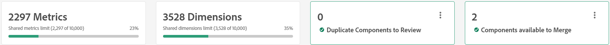

# 공유 지표 및 차원 개요

공유 지표 및 차원은 다양한 데이터 보기에서 사용할 수 있는 차원 및 지표를 관리하는 중앙 위치를 제공합니다. 이러한 구성 요소는 특히 여러 데이터 보기를 사용하는 조직에서 공통 구성 요소 설정을 공유하는 경우 유용합니다. 공유 지표 및 차원에 대한 변경 사항은 공유되는 모든 데이터 보기에 즉시 적용됩니다. 개별 데이터 보기를 편집할 때 구성 요소 이름 옆에 있는  아이콘을 통해 공유 차원 및 지표를 식별할 수 있습니다.

공유 차원 및 지표를 통해 여러 데이터 보기에서 공통 구성 요소를 사용할 수 있지만 연결 간에 공유할 수는 없습니다.

## 워크플로

대부분의 조직에서는 시간에 따라 차원 및 지표의 중복을 제거하고 유지 관리하기 위해 다음과 같은 중요한 워크플로우를 사용합니다.

1. 여러 데이터 보기에서 공유할 수 있는 각 데이터 보기에서 구성 요소를 가져옵니다. 동일한 차원 또는 지표가 여러 데이터 보기에 있는 경우 Adobe에서는 해당 구성 요소의 모든 인스턴스를 가져오는 것을 권장합니다. 이 모범 사례에서는 중복을 가져오지만, 중복을 제거하여 Workspace 프로젝트에 대한 각 참조를 유지할 수 있도록 가져오게 됩니다.
1. 동일한 구성 요소 ID를 사용하지만 구성 요소 설정이 다른 모든 구성 요소를 검토합니다. 각 중복 구성 요소 그룹에 대해 해당 구성 요소 ID를 공유하는 다른 모든 구성 요소에 적용할 원하는 구성 요소 설정을 선택합니다.
1. 동일한 구성 요소 ID를 사용하고 동일한 구성 요소 설정을 갖는 모든 구성 요소를 검토하십시오. 이러한 차원 또는 지표를 쉽고 안전하게 병합할 수 있습니다.

## [!UICONTROL 공유된 지표 및 차원] 관리자

**[!UICONTROL Customer Journey Analytics]** > **[!UICONTROL 데이터 보기]** > **[!UICONTROL 공유 지표 및 차원]**

이 UI로 이동하면 여러 데이터 보기에서 공유할 수 있는 현재 차원 및 지표가 모두 표시됩니다. 오른쪽 상단에는 이 인터페이스에 구성 요소를 추가할 수 있는 두 개의 버튼이 있습니다.

* **[!UICONTROL 가져오기]**: 데이터 보기를 선택할 수 있는 모달 창을 연 다음 공유할 구성 요소를 선택할 수 있습니다.
* **[!UICONTROL 새로 만들기]**: [공유 구성 요소 편집기](shared-component-editor.md)를 엽니다.

이 두 버튼 바로 아래에 네 개의 개요 카드가 표시됩니다.

* **지표**: 이 연결에 대해 데이터 보기에서 공유할 수 있는 총 지표 수입니다. 각 연결에는 최대 10,000개의 공유 지표가 포함될 수 있습니다.
* **차원**: 이 연결에 대해 데이터 보기에서 공유할 수 있는 총 차원 수입니다. 각 연결에는 최대 10,000개의 공유 차원이 포함될 수 있습니다.
* **검토할 구성 요소 복제**: 여러 데이터 보기에서 구성 요소를 가져올 때 일부 차원 또는 지표가 동일한 구성 요소 ID를 공유할 수 있습니다. 이 개요 카드의 숫자는 구성 요소 ID는 동일하지만 구성 요소 설정이 다른 총 구성 요소 수를 보여 줍니다. **[!UICONTROL 검토]**&#x200B;를 선택하면 동일한 ID를 가진 다른 모든 구성 요소에 대해 신뢰할 수 있는 소스로 사용할 구성 요소를 선택할 수 있는 필터를 사용할 수 있습니다.
* **병합할 수 있는 구성 요소**: 차원 또는 지표가 동일한 구성 요소 ID와 동일한 구성 요소 설정을 공유하는 경우 해당 구성 요소는 사실상 동일하며 중복 제거할 준비가 된 것입니다. **[!UICONTROL 검토]**&#x200B;를 선택하면 동일한 구성 요소 ID를 가진 모든 구성 요소를 단일 공유 차원 또는 지표로 병합할 수 있는 필터가 활성화됩니다.

모든 공유 차원 및 지표는 네 개의 개요 카드 아래에 표시됩니다.

* **필터**:  아이콘을 선택하여 사용 가능한 필터를 표시하거나 숨깁니다. 다음 필터를 사용할 수 있습니다.
   * **[!UICONTROL 구성 요소 유형]**: 차원만 보거나 지표만 봅니다.
   * **[!UICONTROL 데이터 집합]**: 구성 요소가 공유되는 데이터 보기에 데이터 집합이 포함된 구성 요소만 표시합니다.
   * **[!UICONTROL 데이터 보기]**: 해당 데이터 보기에 공유된 구성 요소만 봅니다.
   * **[!UICONTROL 만든 사람]**: 지정한 사용자가 만든 구성 요소만 표시합니다.
   * **[!UICONTROL 중복]**: 다른 구성 요소와 구성 요소 ID가 같은 구성 요소만 표시합니다. 이러한 필터는 개요 카드를 통해 구성 요소를 검토하는 것과 동일합니다.
* **검색**:  아이콘을 사용하여 이름으로 구성 요소를 검색합니다.
* **[!UICONTROL 연결]**: [연결](/help/connections/overview.md)을 변경하는 드롭다운. 공유 차원 및 지표는 항상 단일 연결에 한정됩니다.
* **[!UICONTROL 테이블 사용자 지정]**: 테이블에서 열을 표시하거나 숨기려면  아이콘을 선택하십시오. 사용 가능한 옵션은 다음과 같습니다.
   * **[!UICONTROL 필드 이름]**: 공유 차원 또는 지표의 이름입니다. 이 필드는 항상 표시됩니다.
   * **[!UICONTROL 유형]**: 구성 요소가 차원인지 지표인지 나타냅니다. 이 필드는 항상 표시됩니다.
   * **[!UICONTROL 데이터 집합 형식]**: 데이터 집합의 형식입니다. 대부분의 데이터 세트는 이벤트 데이터 세트입니다.
   * **[!UICONTROL 데이터 보기에 공유]**: 이 구성 요소가 공유되는 모든 데이터 보기. 이 필드는 항상 표시됩니다. 링크를 선택하여 이 구성 요소를 사용할 수 있는 모든 데이터 보기를 나열하는 모달을 엽니다.
   * **[!UICONTROL 데이터 세트]**: 이 구성 요소가 공유되는 각 데이터 보기에 포함된 모든 데이터 세트입니다. 링크를 선택하여 구성 요소에 대한 모든 데이터 세트를 나열하는 모달을 엽니다.
   * **[!UICONTROL 작성자]**: 구성 요소를 만들거나 공유 지표 및 차원 인터페이스로 가져온 개인의 이름입니다.
   * **[!UICONTROL 스키마 형식]**: 데이터가 저장되는 형식입니다. 예를 들면 `string`, `double` 또는 `boolean`이(가) 있습니다.
   * **[!UICONTROL 구성 요소 ID]**: 차원 또는 지표의 구성 요소 ID. 이 인터페이스에서 동일한 구성 요소 ID를 공유하는 모든 구성 요소는 검토 및 중복 제거되어야 합니다.
   * **[!UICONTROL 스키마]**: 차원 또는 지표의 스키마 경로입니다. (예: `web.webPageDetails.URL`)
   * **[!UICONTROL 설명]**: 구성 요소의 [설명](/help/data-views/component-settings/overview.md).
   * **[!UICONTROL 컨텍스트 레이블]**: 구성 요소에 대한 [컨텍스트 레이블](/help/data-views/component-settings/overview.md).
   * **[!UICONTROL 값 포함/제외]**: [값 포함/제외](/help/data-views/component-settings/include-exclude-values.md)에 지정된 규칙 수를 나열합니다.
   * **[!UICONTROL 데이터 사용 레이블]**: 스키마 필드의 [데이터 사용 레이블](https://experienceleague.adobe.com/en/docs/experience-platform/data-governance/labels/overview).
   * **[!UICONTROL 사용되지 않음]**: 사용되지 않는 플래그가 설정되었는지 여부를 나타냅니다.
   * **[!UICONTROL 형식]**: 값이 표시되는 형식입니다. 부울은 일반적으로 `True | False`(으)로 표시되고 지표는 일반적으로 `Decimal`(으)로 표시됩니다.
   * **[!UICONTROL 지표 중복 제거]**: 구성 요소의 [지표 중복 제거](/help/data-views/component-settings/metric-deduplication.md) 설정입니다.
   * **[!UICONTROL 동작]**: 구성 요소의 [동작](/help/data-views/component-settings/behavior.md) 설정입니다.
   * **[!UICONTROL 속성]**: 구성 요소의 [속성](/help/data-views/component-settings/attribution.md) 설정.
   * **[!UICONTROL 값 옵션 없음]**: 구성 요소의 [값 옵션 없음](/help/data-views/component-settings/no-value-options.md).
   * **[!UICONTROL 값 버킷팅]**: 구성 요소의 [값 버킷팅](/help/data-views/component-settings/value-bucketing.md) 설정입니다.
   * **[!UICONTROL 지속성]**: 구성 요소의 [지속성](/help/data-views/component-settings/persistence.md) 설정입니다.
   * **[!UICONTROL 소문자]**: 구성 요소의 [동작](/help/data-views/component-settings/behavior.md) 설정에 따라 구성 요소가 소문자로 사용되는지 여부를 나타냅니다.
   * **[!UICONTROL 하위 문자열]**: 구성 요소의 [하위 문자열](/help/data-views/component-settings/substring.md) 설정입니다.
   * **[!UICONTROL 요약 데이터 그룹]**: 구성 요소의 [요약 데이터 그룹](/help/data-views/component-settings/summary-data-group.md) 설정입니다.
   * **[!UICONTROL 만든 날짜]**: 구성 요소를 만들거나 가져온 날짜입니다.
   * **[!UICONTROL 마지막 수정일]**: 구성 요소를 만든 후 수정한 경우 마지막으로 수정한 날짜입니다.
* **[!UICONTROL 작업 내역]**:  아이콘을 선택하여 개별 데이터 보기에서 차원 및 지표를 가져오는 모든 인스턴스를 표시하는 모달 창을 엽니다.

## 구성 요소 편집 또는 데이터 보기에 구성 요소 공유

구성 요소 옆에 있는 확인란을 사용하여 수행할 수 있는 모든 작업을 표시합니다. 다중 선택이 지원됩니다.

*  **[!UICONTROL 편집]**: [공유 구성 요소 편집기](shared-component-editor.md)에서 선택한 차원 및 지표를 열어 [구성 요소 설정](/help/data-views/component-settings/overview.md)을 조정할 수 있습니다. 편집할 여러 구성 요소를 선택하면 해당 구성 요소가 모두 구성 요소 편집기에서 열립니다. 구성 요소 편집기에서 구성 요소를 Shift 키를 누른 상태에서 클릭하여 여러 구성 요소의 동일한 필드를 편집할 수 있습니다.
*  **[!UICONTROL 데이터 보기에 공유]**: 선택한 연결 내에서 사용 가능한 모든 데이터 보기를 표시하는 창을 엽니다. 이 구성 요소를 사용할 수 있도록 하려는 각 데이터 보기의 확인란을 선택한 다음 **[!UICONTROL 공유]**&#x200B;를 선택합니다.
*  **[!UICONTROL 데이터 보기에 대한 공유 안 함]**: 이 구성 요소가 현재 공유된 모든 데이터 보기를 표시하는 창을 엽니다. 이 구성 요소의 가용성을 제거할 각 데이터 보기의 확인란을 선택한 다음 **[!UICONTROL 공유 취소]**&#x200B;를 선택합니다.
*  **[!UICONTROL 중복]**: 선택한 구성 요소의 복사본을 만듭니다. 복제된 구성 요소에 대해 새 구성 요소 ID가 생성됩니다.
*  **[!UICONTROL 삭제]**: 인터페이스에서 선택한 구성 요소를 제거합니다. 선택한 구성 요소가 데이터 보기와 공유되면 공유되지 않습니다.
