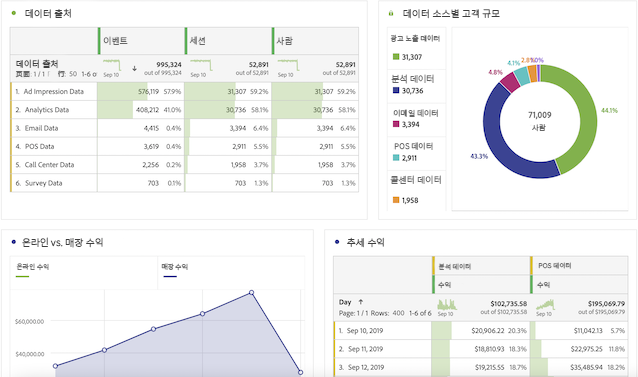

# Adobe Analytics 사용자를 위한 사용 안내서

조직에서 Adobe Customer Journey Analytics를 사용하기 시작하는 경우 Adobe Analytics와 Customer Journey Analytics 간의 몇 가지 유사성과 차이점을 볼 수 있습니다. 이 페이지에서는 조직이 새로운 구현 및 보고 워크플로를 가능하게 하는 이러한 차이점에 대해 설명합니다. 또한 이 페이지에서는 새로운 개념에 대한 추가 리소스를 제공하며 분석가로서 여정을 보다 쉽고 성공적으로 수행할 수 있도록 합니다.

업계 표준에 맞게 Customer Journey Analytics의 여러 기능 이름이 변경되고 재디자인됩니다. 업데이트된 용어 중 일부는 세그먼트, 가상 보고서 세트, 분류, 고객 속성 및 컨테이너 이름을 포함합니다. 유연한 사용자 정의 차원 및 지표를 위해 eVar 및 prop의 제한 사항이 더 이상 존재하지 않습니다.

## 변경되지 않은 사항

보고 측면에서 익숙한 많은 내용은 변경되지 않았습니다.

* 여전히 의 기능을 사용할 수 있습니다. [Analysis Workspace](/help/analysis-workspace/home.md) 를 입력하여 데이터를 분석할 수 있습니다. 작업 영역은 기존 Adobe Analytics에서와 동일하게 작동합니다.
* 동일한 버전의 [Adobe Analytics 대시보드](/help/mobile-app/home.md)는 사용할 수 있으며, Customer Journey Analytics와 Adobe Analytics 간에 유사하게 작동합니다.
* [Report Builder](/help/report-builder/report-buider-overview.md) 에는 새로운 인터페이스가 있고 MS Windows, MacOS 및 Excel 웹 버전에서 실행됩니다. (이 버전의 Report Builder 전에는 VMware에서 실행하지 않으면 Mac에서 사용할 수 없었습니다.) 이 버전은 아직 기존 AA 데이터 요청을 지원하지 않습니다.

## 보고 변경 사항

분석할 훨씬 많은 크로스 채널 데이터에 액세스할 수 있습니다. 예를 들어 조직에서 이러한 데이터 세트를 수집하고 Customer Journey Analytics에서 사용하는 데이터 보기에 포함하는 경우 여러 채널의 성능을 분석하는 작업 영역 프로젝트를 만들 수 있습니다(아래의 “데이터 아키텍처에 대한 변경” 참조).

## 데이터 아키텍처 변경 사항 {#architecture}

Customer Journey Analytics는 Adobe Experience Platform에서 데이터를 가져옵니다. Experience Platform을 사용하면 모든 시스템 또는 채널의 고객 데이터와 콘텐츠를 중앙 집중화 및 표준화하고 데이터 과학 및 시스템 학습을 적용하여 개인화된 경험의 디자인과 게재를 향상시킬 수 있습니다.

Experience Platform의 고객 데이터는 [스키마](https://experienceleague.adobe.com/docs/platform-learn/tutorials/schemas/schemas-and-experience-data-model.html?lang=ko-KR) 및 데이터 배치로 구성된 데이터 세트로 저장됩니다. 플랫폼에 대한 자세한 내용은 [Adobe Experience Platform 아키텍처 개요](https://experienceleague.adobe.com/docs/platform-learn/tutorials/intro-to-platform/basic-architecture.html?lang=ko-KR)를 참조하십시오.

Customer Journey Analytics 관리자는 Experience Platform의 데이터 세트에 [연결](/help/connections/create-connection.md)을 설정합니다. 그런 다음 빌드합니다 [데이터 보기](/help/data-views/data-views.md) 해당 연결 사용. 데이터 보기는 가상 보고서 세트와 개념적으로 유사하며 Customer Journey Analytics의 보고 기준입니다. Experience Platform은 보고를 위한 모든 데이터를 소스화하므로 보고서 세트는 더 이상 데이터를 위한 컨테이너로 존재하지 않습니다.

연결을 통해 Analytics 관리자는 Adobe Experience Platform의 데이터 세트를 다음 비디오에 포함하는 Customer Journey Analytics에 통합할 수 있습니다.

>[!VIDEO](https://video.tv.adobe.com/v/35111/?quality=12)

Adobe는 Analytics 소스 커넥터 또는 Web SDK를 통해 보고서 세트 데이터를 포함하여 Adobe Experience Platform으로 데이터를 가져오는 여러 가지 방법을 제공합니다. 여러 보고서 세트의 기존 구현을 Experience Platform에 결합할 수 있습니다. 이러한 데이터 세트를 기반으로 하는 연결 및 데이터 보기는 별도의 보고서 세트에 이전에 존재했던 데이터를 결합할 수 있습니다.

## 가상 보고서 세트의 개념 변경 {#data-views}

[!UICONTROL 데이터 보기]는 현재 존재하는 가상 보고서 세트의 개념을 사용하고 이를 확장하여 연결을 통해 사용할 수 있는 [데이터에 대한 추가 제어 기능을 활성화](/help/data-views/create-dataview.md)합니다. 이러한 변경 사항은 시간대 및 세션 시간 초과 간격과 같은 일반 설정을 구성 및 소급 적용할 수 있도록 합니다. 기여도 분석 및 만료와 같은 개별 변수 설정은 보고서 또는 데이터 보기 수준에서 사용자 정의할 수도 있습니다. 이러한 설정은 비파괴적이고 소급 적용됩니다.

이제 오른쪽 상단의 보고서 세트 선택기를 사용하여 사용 가능한 데이터 보기 중에서 선택할 수 있습니다.

자세한 내용은 [데이터 보기에 대한 사용 사례](/help/use-cases/data-views/data-views-usecases.md) 를 참조하십시오.

## eVar 및 prop의 개념 변경

기존 Adobe Analytics의 [!UICONTROL eVar], [!UICONTROL Prop], [!UICONTROL 이벤트] 개념은 [!UICONTROL Customer Journey Analytics]에 더 이상 존재하지 않습니다. Adobe Analytics에서 eVar 및 prop은 콘텐츠, 고객, 캠페인 등에 대한 설명을 저장합니다. 및 이벤트는 생성된 매출, 구독 또는 리드와 같은 것을 카운트합니다. Customer Journey Analytics은 두 유형의 데이터를 모두 보존하며, Analysis Workspace의 왼쪽 레일에서 각각 Dimension 또는 지표 아래에 있는 동일한 방식으로 액세스할 수 있습니다.

Customer Journey Analytics에서는 차원, 지표 및 목록 필드를 포함한 무제한 스키마 요소를 사용할 수 있습니다. 이는 Experience Platform의 차원, 지표 및 목록 필드를 포함한 무제한 스키마 요소에 매핑됩니다. 이제 Adobe Analytics의 처리 규칙 이후에 적용된 모든 방문 및 속성 설정이 Customer Journey Analytics의 쿼리 시간에 적용됩니다.

이러한 유연성으로 인해 단일 스키마 필드를 차원과 지표로 사용하여 다양한 추적 요구 사항을 지원할 수 있는 상황이 발생할 수 있습니다.

## 세그먼트 개념 변경

Adobe는 업계 표준에 맞게 “세그먼트” 구성 요소를 “필터”로 이름을 변경했습니다. Adobe Experience Platform의 세그먼트를 더 잘 구분하고 제공합니다.

[!UICONTROL Customer Journey Analytics] 더 이상 eVar, prop 또는 이벤트를 사용하지 않고, 대신 매핑되어 있는 Experience Platform 스키마 필드 이름을 사용합니다. 이 변경 사항은 Adobe Analytics의 기존 세그먼트 중 어느 하나도 와 호환되지 않음을 의미합니다 [!UICONTROL Customer Journey Analytics]. 기존 Adobe Analytics 세그먼트를 Customer Journey Analytics으로 이동하려면 다음 비디오를 참조하십시오.

>[!VIDEO](https://video.tv.adobe.com/v/31982/?quality=12)

아직 공유하거나 게시할 수 없는 상태입니다 [!UICONTROL 필터] ([!UICONTROL 세그먼트])에서) [!DNL Customer Journey Analytics] 통합 프로필을 Experience Platform하려면 이 기능은 개발 중입니다.

세그먼트 컨테이너는 변경되는 세그먼트 개념 외에도 업데이트됩니다.

* **히트 컨테이너는 이제 [!UICONTROL 이벤트] 컨테이너**&#x200B;입니다. [!UICONTROL 이벤트] 컨테이너를 사용하여 개별 이벤트에 따라 개인 정보를 분류할 수 있습니다.
* **방문 컨테이너는 이제 [!UICONTROL 세션] 컨테이너입니다**. [!UICONTROL 세션] 컨테이너에서 특정 세션에 대한 페이지 상호 작용, 캠페인 또는 대화를 식별할 수 있습니다.
* **이제 방문자 컨테이너가 있습니다. [!UICONTROL 개인] 컨테이너**. [!UICONTROL 개인] 컨테이너에는 지정된 시간대 내의 개인에 대한 모든 세션 및 이벤트가 포함됩니다.

## 계산된 지표의 개념 변경

계산된 지표는 Adobe Analytics와 Customer Journey Analytics 간에 유사하게 이름이 지정됩니다. 단, [!UICONTROL Customer Journey Analytics]는 더 이상 eVar, Prop 또는 이벤트를 사용하지 않고 대신 Experience Platform 스키마 요소를 사용합니다. 이 기본 변경 사항은 기존의 계산된 지표 중 어떤 것도 와 호환되지 않음을 의미합니다 [!UICONTROL Customer Journey Analytics]. Adobe Analytics 계산된 지표를 Customer Journey Analytics으로 이동하려면 다음 비디오를 참조하십시오.

>[!VIDEO](https://video.tv.adobe.com/v/31788/?quality=12)

## 변수 속성 및 만료 설정 변경

[!UICONTROL Customer Journey Analytics] 보고서 시간에 속성 및 만료를 포함한 모든 변수 설정을 적용합니다. 이제 이러한 설정이 [데이터 보기](/help/data-views/component-settings/persistence.md)및 일부 변수 설정(예: 속성)은 작업 영역 프로젝트에서 변경할 수 있습니다.

동일한 데이터 보기에 동일한 변수의 여러 버전이 있을 수 있습니다. 예를 들어 30일 후에 만료되는 추적 코드 차원 하나와 세션 종료 시 만료되는 추적 코드 차원이 있을 수 있습니다. 이러한 추적 코드 차원은 모두 동일한 소스 데이터를 사용하지만, 다른 속성 설정을 사용합니다.

동일한 연결을 기반으로 여러 데이터 보기를 가질 수도 있습니다. 예를 들어 세션 시간 제한이 30분이고, 세션 시간 제한이 15분인 데이터 보기가 한 개 있을 수 있습니다. 두 데이터 보기는 오른쪽 위의 선택기에 표시되므로 두 보기 간에 원활하게 전환할 수 있습니다.

## 분류 개념 변경

이제 “분류”를 “조회 데이터 세트”라고 합니다. 조회 데이터 세트는 이벤트 또는 프로필 데이터에 있는 값이나 키를 찾는 데 사용됩니다. 예를 들어 이벤트 데이터의 숫자 ID를 제품 이름에 매핑하는 조회 데이터를 업로드할 수 있습니다. 자세한 내용은 [계정 수준 데이터를 조회 데이터 세트로 추가](/help/use-cases/b2b/b2b.md) 예 사용 사례입니다.

## 고객 속성 개념 변경

이제 “고객 속성”을 “프로필 데이터 세트”라고 합니다. 프로필 데이터 세트에는 [!UICONTROL 이벤트] 데이터의 개인, 사용자 또는 고객에게 적용되는 데이터가 포함되어 있습니다. 예를 들어 고객에 대한 CRM 데이터를 업로드할 수 있습니다. 포함할 개인 ID를 선택할 수 있습니다. 에 정의된 각 데이터 세트 [!DNL Experience Platform] 에는 하나 이상의 개인 ID가 정의된 자체 세트가 있습니다.

## Adobe가 방문자를 식별하는 방법 변경

Customer Journey Analytics는 ECID 이상의 ID의 개념을 확장하여 고객 ID, 쿠키 ID, 결합된 ID, 사용자 ID, 추적 코드 등을 포함하여 사용할 ID를 포함합니다. 데이터 세트에서 공통 네임스페이스 ID 사용 또는 [결합](../stitching/overview.md)은 서로 다른 데이터 세트에서 사람들을 서로 연결하는 데 도움이 됩니다. Customer Journey Analytics에서 작업 영역 프로젝트를 설정하는 모든 사용자는 데이터 세트에서 사용되는 ID를 이해해야 합니다. Customer Journey Analytics에서 ID의 사용을 강조 표시하는 다음 비디오를 참조하십시오.

>[!VIDEO](https://video.tv.adobe.com/v/30750/?quality=12)

## 낮은 트래픽 차원 항목 개념 변경

기존 Adobe Analytics에서 고유 값을 너무 많이 받는 변수는 아래의 차원 항목을 그룹화하기 시작합니다 [!UICONTROL 낮은 트래픽]. Customer Journey Analytics에는 높은 카디널리티 필드에 제한이 없습니다. 보고 아키텍처를 변경하면 Analysis Workspace에서 더 많은 고유한 차원 항목에 대해 보고할 수 있습니다. Customer Journey Analytics가 고유 값이 많은 차원에 대한 보고를 최적화하는 방법에 대한 자세한 내용은 [높은 카디널리티 차원](../components/dimensions/high-cardinality.md)을 참조하십시오.
