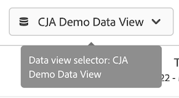

# CJA User Guide for Adobe Analytics users

조직에서 Customer Journey Analytics을 사용하기 시작하는 경우 기존 Analytics와 CJA 간의 몇 가지 유사성과 차이점을 볼 수 있습니다. 이 페이지에서는 조직이 새로운 구현 및 보고 워크플로우를 가능하게 하는 이러한 차이점을 설명합니다. 또한 이 페이지에서는 새로운 개념에 대한 추가 리소스를 제공하며 분석가로서 여정을 보다 쉽고 성공적으로 수행할 수 있도록 합니다.

업계 표준에 맞게 CJA의 여러 기능 이름이 변경되고 재디자인됩니다. Some updated terminology includes segments, virtual report suites, classifications, customer attributes, and container names. The limitations of eVars and props no longer exist, in favor of flexible custom dimensions and metrics.

## What hasn&#39;t changed

보고 측면에서 익숙한 많은 내용은 변경되지 않았습니다.

* 여전히 의 기능을 사용할 수 있습니다. [Analysis Workspace](/help/analysis-workspace/home.md) 를 입력하여 데이터를 분석할 수 있습니다. 작업 공간은 기존 Adobe Analytics에서와 동일하게 작동합니다.
* 동일한 버전의 [Adobe Analytics 대시보드](/help/mobile-app/home.md) 는 사용할 수 있으며, CJA와 기존 Analytics 간에 유사하게 작동합니다.
* [Report Builder](/help/report-builder/report-buider-overview.md) has a new interface and runs on PC, Mac, and the web version of Excel.

## 보고 변경 사항

분석할 훨씬 많은 크로스 채널 데이터에 액세스할 수 있습니다. 예를 들어 여러 채널의 성능을 분석하는 작업 공간 프로젝트를 만들 수 있습니다

## 데이터 아키텍처 변경 사항 {#architecture}

Customer Journey Analytics은 Adobe Experience Platform에서 데이터를 가져옵니다. Experience Platform을 사용하면 모든 시스템 또는 채널의 고객 데이터와 컨텐츠를 중앙 집중화 및 표준화하고 데이터 과학 및 시스템 학습을 적용하여 개인화된 경험의 디자인과 전달을 향상시킬 수 있습니다.

플랫폼의 고객 데이터는 스키마 및 데이터 배치로 구성된 데이터 세트로 저장됩니다. 플랫폼에 대한 자세한 내용은 [Adobe Experience Platform 아키텍처 개요](https://experienceleague.adobe.com/docs/platform-learn/tutorials/intro-to-platform/basic-architecture.html?lang=ko)를 참조하십시오.

CJA 관리자가 설정합니다 [연결](/help/connections/create-connection.md) Platform에서 데이터 세트를 가져올 수 있습니다. They then build [data views](/help/data-views/data-views.md) using those connections. 데이터 보기는 가상 보고서 세트와 개념적으로 유사하며 Customer Journey Analytics의 보고 기준입니다. Since Platform sources all data for reporting, report suites no longer exist as a container for data.

A connection lets your Analytics Admin integrate datasets from [!DNL Adobe Experience Platform] into [!UICONTROL Customer Journey Analytics], included in the following video:

>[!VIDEO](https://video.tv.adobe.com/v/35111/?quality=12)

Adobe은 Adobe Analytics 소스 커넥터 또는 웹 SDK를 통해 보고서 세트 데이터를 포함하여 Adobe Experience Platform으로 데이터를 가져오는 여러 가지 방법을 제공합니다. 여러 보고서 세트의 기존 구현을 Platform에 결합할 수 있습니다. 이러한 데이터 세트를 기반으로 하는 연결 및 데이터 보기는 별도의 보고서 세트에 이전에 존재했던 데이터를 결합할 수 있습니다.

## 가상 보고서 세트의 개념 변경 {#data-views}

[!UICONTROL 데이터 보기] 가상 보고서 세트의 개념을 가져와 을(를) [데이터에 대한 추가 제어 사용](/help/data-views/create-dataview.md) 연결에서 사용할 수 있습니다. 이러한 변경 사항은 시간대 및 세션 시간 초과 간격과 같은 일반 설정을 구성 및 소급 적용할 수 있도록 합니다. 기여도 분석 및 만료와 같은 개별 변수 설정은 보고서 또는 데이터 보기 수준에서 사용자 지정할 수도 있습니다. 이러한 설정은 비파괴적이고 소급 적용됩니다.

Notice that the report suite selector in the top right now lets you choose from available data views:

자세한 내용은 [데이터 보기에 대한 사용 사례](/help/data-views/data-views-usecases.md) 를 참조하십시오.

## eVar 및 prop의 개념 변경

[!UICONTROL eVar], [!UICONTROL prop], 및 [!UICONTROL events] 기존 Adobe Analytics은 더 이상 [!UICONTROL Customer Journey Analytics]. Unlimited schema elements are available, including dimensions, metrics, and list fields. 이제 데이터 수집 프로세스 중에 이전에 적용된 모든 속성 설정이 쿼리 시간에 적용됩니다.

## 세그먼트 개념 변경

Adobe has renamed the &quot;segments&quot; component to &quot;filters&quot; to better align with industry standards and provide better distinction with segments in Adobe Experience Platform.\

[!UICONTROL Customer Journey Analytics] no longer uses eVars, props, or events and instead uses any Platform schema element. This change means that none of the existing segments are compatible with [!UICONTROL Customer Journey Analytics]. 기존 Adobe Analytics 세그먼트를 Customer Journey Analytics으로 이동하려면 다음 비디오를 참조하십시오.

>[!VIDEO](https://video.tv.adobe.com/v/31982/?quality=12)

While you cannot yet share or publish [!UICONTROL filters] ([!UICONTROL segments]) from [!DNL Customer Journey Analytics] to Experience Platform Unified Profile, this functionality is under development.

세그먼트 컨테이너는 변경되는 세그먼트 개념 외에도 업데이트됩니다.

* **이제 히트 컨테이너가 &#39;이벤트&#39; 컨테이너입니다.**. [!UICONTROL 개인] 컨테이너에는 지정된 시간대 내의 방문자에 대한 모든 세션 및 이벤트가 포함됩니다.
* **이제 방문 컨테이너가 &#39;세션&#39; 컨테이너입니다.**. [!UICONTROL 세션] 컨테이너에서 특정 세션에 대한 페이지 상호 작용, 캠페인 또는 대화를 식별할 수 있습니다.
* **이제 방문자 컨테이너가 있습니다. [!UICONTROL 개인] 컨테이너**. [!UICONTROL 개인] 컨테이너에는 지정된 시간대 내의 방문자에 대한 모든 세션 및 이벤트가 포함됩니다.

## Changes to the concept of Calculated metrics

Calculated metrics are similarly named between traditional Analytics and CJA. 하지만, [!UICONTROL Customer Journey Analytics] 더 이상 eVar, prop 또는 이벤트를 사용하지 않고 대신 Platform 스키마 요소를 사용합니다. This fundamental change means that none of the existing calculated metrics are compatible with [!UICONTROL Customer Journey Analytics]. Adobe Analytics 계산된 지표를 Customer Journey Analytics으로 이동하려면 다음 비디오를 참조하십시오.

>[!VIDEO](https://video.tv.adobe.com/v/31788/?quality=12)

## 변수 속성 및 만료 설정 변경

[!UICONTROL Customer Journey Analytics] 보고서 시간에 속성 및 만료를 포함한 모든 변수 설정을 적용합니다. These settings now reside in [data views](/help/data-views/component-settings/persistence.md), and some variable settings (like attribution) can be changed in Workspace projects.

동일한 데이터 보기에 동일한 변수의 여러 버전이 있을 수 있습니다. 예를 들어 30일 후에 만료되는 추적 코드 차원 하나와 세션 종료 시 만료되는 추적 코드 차원이 있을 수 있습니다. 이러한 추적 코드 차원은 모두 동일한 소스 데이터를 사용하지만, 다른 속성 설정을 사용합니다.

동일한 연결을 기반으로 여러 데이터 보기를 가질 수도 있습니다. 예를 들어, 세션 시간 제한이 30분이고, 세션 시간 제한이 15분인 데이터 보기가 한 개 있을 수 있습니다. 두 데이터 보기는 오른쪽 위의 선택기에 표시되므로 두 보기 간에 원활하게 전환할 수 있습니다.

## 분류 개념 변경

이제 &quot;분류&quot;를 &quot;조회 데이터 세트&quot;라고 합니다. 조회 데이터 세트는 이벤트 또는 프로필 데이터에 있는 값 또는 키를 찾는 데 사용됩니다. 예를 들어 이벤트 데이터의 숫자 ID를 제품 이름에 매핑하는 조회 데이터를 업로드할 수 있습니다. See [Add account-level data as a lookup dataset](/help/use-cases/b2b.md) for an example use case.

## 고객 속성 개념 변경

이제 &quot;고객 속성&quot;을 &quot;프로필 데이터 세트&quot;라고 합니다. 프로필 데이터 세트에는 [!UICONTROL 이벤트] 데이터. 예를 들어 고객에 대한 CRM 데이터를 업로드할 수 있습니다. 포함할 개인 ID를 선택할 수 있습니다. 에 정의된 각 데이터 세트 [!DNL Experience Platform] 에는 하나 이상의 개인 ID가 정의된 자체 세트가 있습니다.

## Adobe이 방문자를 식별하는 방법 변경

CJA expands the concepts of identities beyond ECIDs to include any ID you want to use, including Customer ID, Cookie ID, Stitched ID, User ID, Tracking Code, and so on. Using a common namespace ID across datasets, or using [Cross-Channel Analytics](/help/connections/cca/overview.md) helps link people together across different datasets. Any user setting up a Workspace project in CJA must understand the IDs used across the datasets. Customer Journey Analytics에서 ID의 사용을 강조 표시하는 다음 비디오를 참조하십시오.

>[!VIDEO](https://video.tv.adobe.com/v/30750/?quality=12)

## Changes to the concept of the Low-Traffic dimension item

기존 Analytics에서 고유 값을 너무 많이 받는 변수는 아래의 차원 항목을 그룹화하기 시작합니다 `Low-Traffic`. Customer Journey Analytics에는 높은 카디널리티 필드에 대한 많은 제한 사항이 있습니다. Changes to the reporting architecture allows Analysis Workspace to report on many more unique dimension items. 자세한 내용은 [롱테일](../analysis-workspace/workspace-faq/long-tail.md) cja가 고유한 값이 많은 차원에 대한 보고를 최적화하는 방법에 대한 자세한 내용을 확인하십시오.
