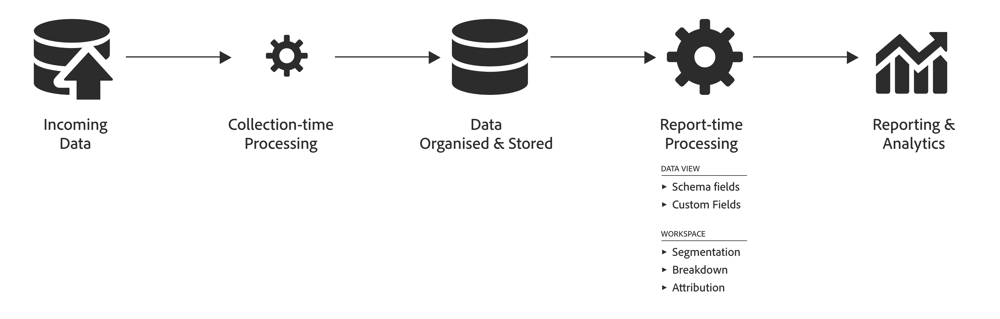

# Adobe Analytics 및 Customer Journey Analytics 간의 데이터 처리를 비교합니다.

보고에 유용하기 전에 데이터를 처리하는 기능이 필요한 경우가 많습니다. 데이터 수집에서 보고서 또는 시각화 생성에 이르기까지 여정의 여러 단계에서 해당 데이터를 처리할 수 있습니다.

Adobe Analytics에서 대부분의 데이터 처리는 데이터를 수집한 직후에 발생합니다. 이를 지원하기 위해 VISTA 규칙, 처리 규칙, 마케팅 채널 처리 규칙 등의 기능을 사용할 수 있습니다 **컬렉션 시간 처리**.
그런 다음 데이터가 저장되고 보고서 시간에 추가 처리를 적용할 수 있습니다. 예를 들어 차원을 분류하거나, 세그먼테이션을 적용하거나, 다른 속성 모델을 선택할 수 있습니다. 이 **보고서 시간 처리** 즉흥적으로 일어납니다.

Adobe Analytics에서 보고서 처리 시간은 일반적으로 수집 시간에 발생하는 처리보다 적은 처리량을 나타냅니다.

반면 Customer Journey Analytics은 구성 및 저장되는 데이터를 처리하기 전에 미리 수집 시간을 최소화하도록 설계되었습니다. Customer Journey Analytics의 기본 아키텍처는 보고서 시간에 저장된 데이터로 작업하도록 설계되었으며 Workspace에서뿐만 아니라 의 정의를 통해 강력한 보고서 시간 처리 기능을 제공합니다. [구성 요소](/help/data-views/component-settings/overview.md) 및 [파생 필드](/help/data-views/derived-fields/derived-fields.md) 데이터 보기에서 다음을 수행합니다.

다양한 보고 기능에 대한 데이터 처리의 차이를 이해하면 사용 가능한 지표와 차이가 발생할 수 있는 이유를 파악할 수 있습니다.

예를 들어, Adobe Analytics에서 지표로 &quot;방문 수&quot;는 데이터 처리 시간에 정의되어 있고, Customer Journey Analytics에서 지표로 &quot;세션&quot;은 보고서 시간에 계산되므로, 두 지표는 Customer Journey Analytics 데이터 보기 내에서 세션 정의에 사용되는 규칙에 따라 다를 수 있습니다.

또한 Analytics 소스 커넥터에서 만든 데이터 세트에서는 방문이나 세션을 지표로 사용할 수 없으므로 비교하려면 쿼리 논리에서 세션을 정의해야 합니다.

## 용어 {#terms}

아래 표는 Adobe Analytics 및 Customer Journey Analytics에 적용되는 다양한 유형의 처리 논리에 대한 용어를 정의합니다.

| 용어 | 정의 | 참고 |
| --- | --- | --- |
| 컬렉션 시간 처리 | 데이터가 수집 및 처리될 때 보고 및 분석 목적으로 저장되기 전에 수행되는 논리입니다. | 이 논리는 내역 데이터에 &#39;반영되며&#39; 일반적으로 쉽게 변경할 수 없습니다. |
| 보고서 시간 처리 | 보고서가 실행되는 시간에 수행되는 논리입니다. | 이 논리는 보고서 실행 시 비파괴적인 방식으로 미래 및 내역 데이터에 적용할 수 있습니다. |
| 히트 수준 논리 | 행별 수준에서 적용된 논리입니다. | 예: 처리 규칙, VISTA, 특정 마케팅 채널 규칙. |
| 방문 수준 논리 | 방문 수준에서 적용된 논리입니다. | 예: 방문 및 세션 정의. |
| 방문자 수준 논리 | 개인 수준에서 적용된 논리입니다. | 예: 크로스 디바이스/크로스 채널 사용자 결합. |
| 세그먼트(필터) 논리 | 이벤트/방문/개인(이벤트/세션/개인) 세그먼트(필터) 규칙의 평가입니다. | 예: 빨간 신발을 구입한 사람. |
| 계산된 지표 | 세그먼트 및 필터를 포함한 복잡한 공식을 기반으로 할 수 있는 고객이 만든 사용자 정의 지표의 평가입니다. | 예: 빨간 신발을 구입한 사람 수. |
| 기여도 논리 | 기여도를 계산하는 논리입니다. | 예: eVar 지속성. |
| 구성 요소 설정 | 속성, 동작, 형식 등과 같은 지표 또는 차원에 사용자 지정 적용 | 예: 범위를 기반으로 숫자 값을 결합하는 값 버킷팅 |
| 파생 필드 | 논리는 데이터 보기에서 구성 요소를 정의하는 과정의 일부로 스키마 또는 표준 필드에 적용됩니다. | 예: 새 마케팅 채널 차원 만들기 |

{style="table-layout:auto"}

시간이 지남에 따라 Adobe Analytics 및 이제 Customer Journey Analytics은 보고서 런타임에 방문 및 사용자 수준 데이터 논리를 수행할 수 있게 되어 유연성이 향상되었습니다.

## 데이터 처리 유형 {#types}

Adobe Analytics Customer Journey Analytics 및 Analytics에 대해 수행되는 데이터 처리 단계와 이러한 단계의 타이밍은 기능마다 다릅니다. 아래 표에는 각 Analytics 기능에 대한 데이터 처리 유형 및 데이터 처리 적용 시기가 요약되어 있습니다.

| 기능 | 처리 시간에 적용 | 보고서 시간에 적용 | 사용할 수 없음 | 참고 |
| --- | --- | --- | --- | --- |
| [Adobe Analytics](https://experienceleague.adobe.com/docs/analytics.html?lang=ko-KR) 보고 (보고서 처리 시간이 있는 Attribution IQ 또는 가상 보고서 세트를 포함하지 않음) | <ul><li>[처리 규칙](https://experienceleague.adobe.com/docs/analytics/admin/admin-tools/processing-rules/processing-rules.html?lang=ko-KR)</li><li>[VISTA 규칙](https://experienceleague.adobe.com/docs/analytics/technotes/terms.html?lang=ko-KR)</li><li>히트 수준 [마케팅 채널 규칙](https://experienceleague.adobe.com/docs/analytics/admin/admin-tools/manage-report-suites/edit-report-suite/marketing-channels/c-rules.html?lang=ko-KR)</li><li>방문 수준 마케팅 채널 규칙 (메모 참조)</li><li>방문 정의</li><li>기여도 논리</li></ul> | <ul><li>세그먼트 논리</li><li>계산된 지표</li></ul> | <ul><li>Cross-Device Analytics (메모 참조)</li></ul> | <ul><li>CDA를 사용하려면 보고서 시간 처리 기능이 있는 가상 보고서 세트를 사용해야 합니다.</li><li>&quot;방문 수준 마케팅 채널 규칙&quot;에는 **방문의 첫 번째 페이지임**, **마지막 접촉 채널 무시** 및 **마케팅 채널 만료**&#x200B;가 포함됩니다. ([설명서](https://experienceleague.adobe.com/docs/analytics-platform/using/cja-usecases/marketing-channels.html?lang=ko-KR)를 참조하십시오.)</li></ul> |
| Adobe Analytics [Data Warehouse](https://experienceleague.adobe.com/docs/analytics/export/data-warehouse/data-warehouse.html?lang=ko-KR) | <ul><li>처리 규칙</li><li>VISTA 규칙</li><li>히트 수준 마케팅 채널 규칙</li><li>방문 수준 마케팅 채널 규칙</li><li>방문 정의</li><li>기여도 논리</li></ul> | <ul><li>세그먼트 논리</li></ul> | <ul><li>계산된 지표</li><li>Cross-Device Analytics</li></ul> |     |
| Adobe Analytics [데이터 피드](https://experienceleague.adobe.com/docs/analytics/export/analytics-data-feed/data-feed-overview.html?lang=ko-KR) | <ul><li>처리 규칙</li><li>VISTA 규칙</li><li>히트 수준 마케팅 채널 규칙</li><li>방문 수준 마케팅 채널 규칙</li><li>방문 정의(visitnum 필드)</li><li>기여도 논리(이후 열에서)</li></ul> |   | <ul><li>세그먼트 논리</li><li>계산된 지표</li><li>Cross-Device Analytics</li></ul> | <ul><li>데이터 피드의 특정 마케팅 채널 관련 열에 대한 ID 매핑은 데이터 피드에 포함되지 않습니다. ([데이터 피드 설명서](https://experienceleague.adobe.com/docs/analytics/export/analytics-data-feed/data-feed-contents/datafeeds-reference.html?lang=ko-KR)를 참조하십시오.)</li></ul> |
| Adobe Analytics [실시간 스트리밍](https://github.com/AdobeDocs/analytics-1.4-apis/blob/master/docs/live-stream-api/getting_started.md) | <ul><li> 처리 규칙</li><li>VISTA 규칙</li><ul> |   | <ul><li>히트 수준 마케팅 채널 규칙</li><li>방문 수준 마케팅 채널 규칙</li><li>방문 논리</li><li>기여도 논리</li><li>세그먼트 논리</li><li>계산된 지표</li><li>Cross-Device Analytics</li></ul> |  |
| Adobe Analytics [Attribution IQ](https://experienceleague.adobe.com/docs/analytics/analyze/analysis-workspace/attribution/overview.html?lang=ko-KR) | <ul><li>처리 규칙</li><li>VISTA 규칙</li><li>방문 정의 (메모 참조)</li><li>Cross-Device Analytics (메모 참조)</li></ul> | <ul><li>히트 수준 마케팅 채널 규칙 (메모 참조)</li><li>방문 수준 마케팅 채널 규칙 (메모 참조) 기여도 논리</li><li>세그먼트 논리</li><li>계산된 지표</li></ul> |  | <ul><li>CDA를 사용하려면 보고서 시간 처리 기능이 있는 가상 보고서 세트를 사용해야 합니다.</li><li>코어 Analytics의 Attribution IQ는 보고서 시간에 완전히 파생된 마케팅 채널(즉, 파생된 중간 값)을 사용합니다.</li><li>Attribution IQ는 보고서 시간 처리 VRS에 사용되는 경우를 제외하고 처리 시간 방문 정의를 사용합니다.</li></ul> |
| Adobe Analytics 가상 보고서 세트 [보고서 처리 시간](https://experienceleague.adobe.com/docs/analytics/components/virtual-report-suites/vrs-report-time-processing.html?lang=ko-KR) (VRS RTP) | <ul><li>처리 규칙</li><li>VISTA 규칙</li><li>[Cross-Device Analytics](https://experienceleague.adobe.com/docs/analytics/components/cda/overview.html?lang=ko-KR)</li></ul> | <ul><li>방문 정의</li><li>기여도 논리</li><li>세그먼트 논리</li><li>계산된 지표</li><li>기타 VRS RTP 설정</li></ul> | <ul><li>히트 수준 마케팅 채널 규칙</li><li>방문 수준 마케팅 채널 규칙</li></ul> | <ul><li>VRS RTP [설명서](https://experienceleague.adobe.com/docs/analytics/components/virtual-report-suites/vrs-report-time-processing.html?lang=ko-KR)를 참조하십시오.</li></ul> |
| [Analytics 소스 커넥터](https://experienceleague.adobe.com/docs/experience-platform/sources/connectors/adobe-applications/analytics.html?lang=ko-KR)Adobe Experience Platform 데이터 레이크의 기반 데이터 세트 | <ul><li>처리 규칙</li><li>VISTA 규칙</li><li>히트 수준 마케팅 채널 규칙</li><li>필드 기반 결합 (메모 참조)</li></ul> |   | <ul><li>[방문 수준 마케팅 채널 규칙](https://experienceleague.adobe.com/docs/analytics-platform/using/cja-usecases/marketing-channels.html?lang=ko-KR)</li><li>방문 논리</li><li>기여도 논리</li><li>필터 논리</li></ul> | <ul><li>고유한 필터 논리 및 계산된 지표를 적용해야 합니다.</li><li>필드 기반 결합은 Analytics 소스 커넥터에서 만든 데이터 세트 외에 별도의 결합된 데이터 세트를 만듭니다.</li></ul> |
| [Customer Journey Analytics](https://experienceleague.adobe.com/docs/analytics-platform/using/cja-landing.html?lang=ko-KR) 보고 | <ul><li>Adobe Experience Platform 데이터 수집의 일부로 구현됨</li></ul> | <ul><li>세션 정의</li><li>[데이터 보기](https://experienceleague.adobe.com/docs/analytics-platform/using/cja-dataviews/data-views.html?lang=ko-KR) 설정<li>기여도 논리</li><li>계산된 지표</li><li>필터 논리</li></ul> | <ul><li>방문 수준 마케팅 채널 규칙</li></ul> | <ul><li>크로스 채널 분석을 활용하려면 결합된 데이터 세트를 사용해야 합니다.</li></ul> |

{style="table-layout:auto"}
