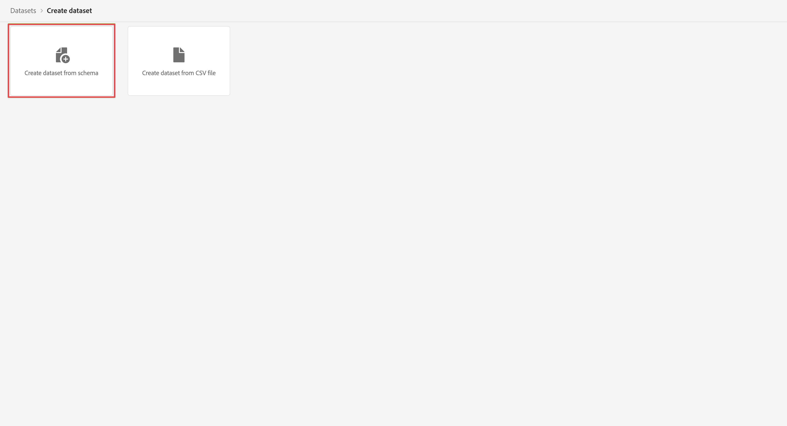

# Customer Journey Analytics에 사용할 데이터 세트 만들기 {#upgrade-create-dataset}

<!-- markdownlint-disable MD034 -->

>[!CONTEXTUALHELP]
>id="cja-upgrade-dataset-create"
>title="Adobe Experience Platform에 데이터 세트 만들기"
>abstract="데이터 세트는 수집된 데이터가 있는 위치입니다. Adobe Experience Platform에 이 위치를 만듭니다.  스키마를 염두에 두고 데이터 세트를 만들면 몇 분이면 충분합니다."

<!-- markdownlint-enable MD034 -->

{{upgrade-note-step}}

<!-- Should we single source this instead of duplicate it? The following steps were copied from: /help/data-ingestion/aepwebsdk.md-->

데이터 세트는 Adobe Experience Platform에 수집한 데이터를 저장하고 관리하는 구성 요소입니다.

데이터 세트를 만드는 방법:

1. 왼쪽 레일의 Adobe Experience Platform에서 [!UICONTROL 데이터 관리]에 있는 **[!UICONTROL 데이터 세트]**&#x200B;를 선택합니다.

1. **[!UICONTROL 데이터 세트 만들기]**&#x200B;를 선택합니다.

   

1. **[!UICONTROL 스키마에서 데이터 세트 만들기]**&#x200B;를 선택합니다.

   

1. 이전에 만든 스키마를 선택하고 **[!UICONTROL 다음]**&#x200B;을 선택합니다.

1. 데이터 세트의 이름을 지정하고 (선택 사항) 설명을 제공합니다.

   

1. **[!UICONTROL 마침]**&#x200B;을 선택합니다.

1. **[!UICONTROL 프로필]** 전환을 선택합니다.

   데이터 세트를 프로필용으로 활성화하라는 메시지가 표시됩니다. 활성화되면 데이터 세트는 수집된 데이터로 실시간 고객 프로필을 강화합니다.

   >[!IMPORTANT]
   >
   >    데이터 세트가 준수하는 스키마가 프로필용으로 활성화된 경우에만 데이터 세트를 프로필용으로 활성화할 수 있습니다.

   

   데이터 세트를 보고, 미리 보고, 만들고, 삭제하는 방법에 대한 자세한 내용은 [데이터 세트 UI 가이드](https://experienceleague.adobe.com/docs/experience-platform/catalog/datasets/user-guide.html)를 참조하십시오. 데이터 세트를 실시간 고객 프로필용으로 활성화하는 방법도 배울 수 있습니다.

{{upgrade-final-step}}
