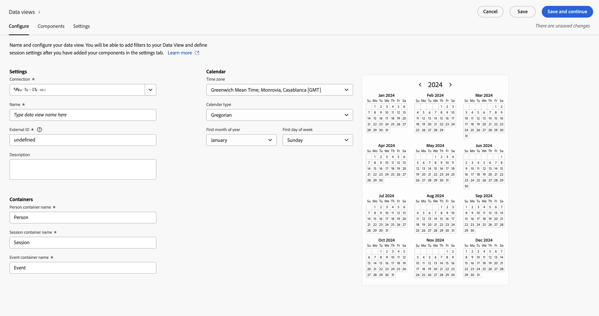

# Customer Journey Analytics에 데이터 보기 만들기 {#upgrade-create-dataview}

<!-- markdownlint-disable MD034 -->

>[!CONTEXTUALHELP]
>id="cja-upgrade-dataview"
>title="Customer Journey Analytics에 데이터 보기 만들기"
>abstract="데이터 보기는 Customer Journey Analytics와 관련된 컨테이너입니다. 이를 통해 연결에서 데이터를 해석하는 방법을 결정할 수 있습니다.  데이터 보기를 처음 만드는 건 몇 분이면 되지만 각 차원과 지표 원하는 구성 요소 설정으로 구성하는 데는 며칠이 걸릴 수 있습니다. 이러한 설정을 조정하면 조직이 시간이 지남에 따라 이를 개선할 수 있도록 소급 적용됩니다."

<!-- markdownlint-enable MD034 -->

{{upgrade-note-step}}

<!-- Should we single source this instead of duplicate it? The following steps were copied from: /help/data-views/create-dataview.md -->

데이터 보기 만들기에는 스키마 요소에서 지표와 차원을 생성하거나 표준 구성 요소를 사용하는 작업이 포함됩니다. 비즈니스 요구 사항에 따라 대부분의 스키마 요소는 차원이나 지표 중 하나가 될 수 있습니다. 스키마 요소를 데이터 보기로 드래그하면 Customer Journey Analytics에서 차원 또는 지표가 작동하는 방법을 조정할 수 있는 옵션이 오른쪽에 나타납니다.

데이터 보기를 만드는 방법:

1. [Customer Journey Analytics](https://analytics.adobe.com)에 로그인하고 상단 메뉴의 **[!UICONTROL 데이터 관리]**&#x200B;에서(선택 사항) **[!UICONTROL 데이터 보기]**&#x200B;를 선택합니다.

1. **[!UICONTROL 새 데이터 보기 만들기]**&#x200B;를 선택합니다. 또는 데이터 보기 목록에서 기존 데이터 보기를 선택하여 편집할 수 있습니다.

1. [!UICONTROL **구성**] 탭에서 데이터 보기의 이름을 지정하고 기본 설정, 구성 요소 및 캘린더 옵션을 구성합니다.

   각 필드에 대한 자세한 내용은 [데이터 보기 만들기 또는 편집](/help/data-views/create-dataview.md)에 [구성](/help/data-views/create-dataview.md#configure)을 참조하십시오.

   

1. [!UICONTROL **구성 요소**] 탭을 선택합니다.

   [!UICONTROL **구성 요소**] 탭에서 데이터 보기의 구성 요소를 설정하면 스키마 요소에서 지표와 차원을 생성할 수 있습니다. 표준 구성 요소를 사용할 수도 있습니다.

   

1. [!UICONTROL **구성 요소**] 탭의 왼쪽 레일에서 스키마 요소를 [!UICONTROL **지표**] 섹션 또는 [!UICONTROL **차원**] 섹션으로 끌어다 놓습니다. 추가한 스키마 요소는 데이터 보기에서 지표나 차원이 됩니다.

   데이터 보기에 구성 요소를 추가할 때 사용 가능한 옵션에 대한 자세한 내용은 [데이터 보기 만들기 또는 편집](/help/data-views/create-dataview.md)에서 [구성 요소](/help/data-views/create-dataview.md#components)를 참조하십시오.

1. [!UICONTROL **설정**] 탭을 선택합니다. 여기에서 전체 데이터 보기에 적용할 세그먼트를 구성하고 세션 시간 초과 및 지표를 구성할 수 있습니다.

   데이터 보기에 대한 설정을 구성할 때 사용 가능한 옵션에 대한 자세한 내용은 [데이터 보기 만들기 또는 편집](/help/data-views/create-dataview.md)에서 [설정](/help/data-views/create-dataview.md#settings)을 참조하십시오.

1. 데이터 보기 구성을 저장하려면 **[!UICONTROL 저장]**&#x200B;을 선택합니다.

1. 원하는 설정이 모두 지정한 후 **[!UICONTROL 저장 및 완료]**&#x200B;를 선택합니다.

{{upgrade-final-step}}
