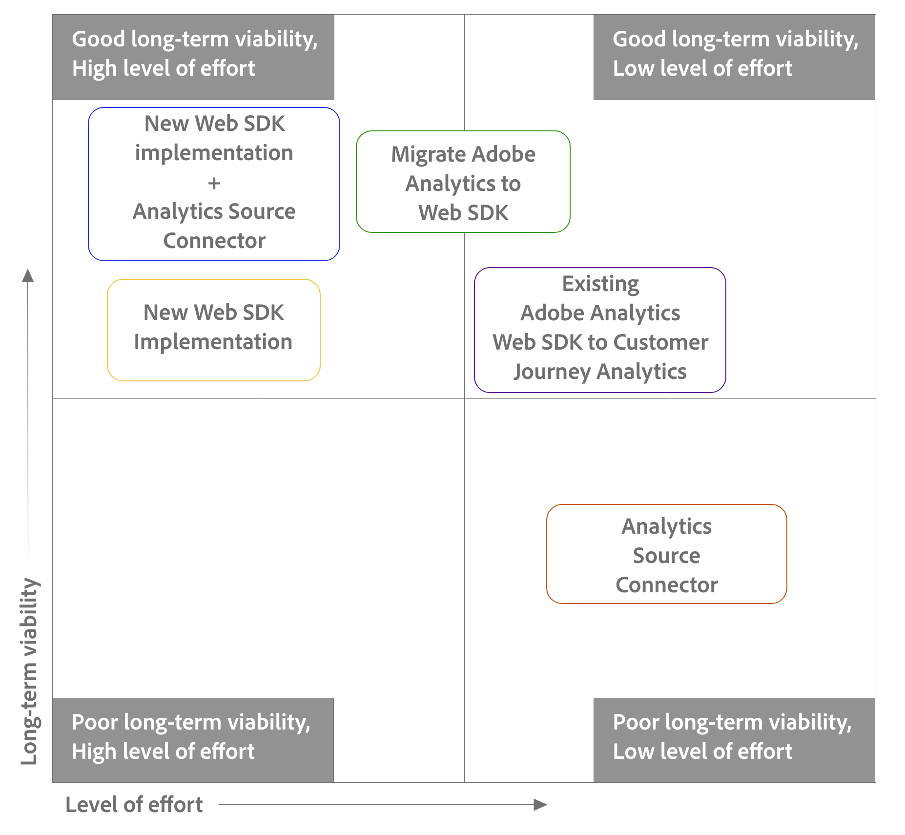

# 2단계: 업그레이드 경로 선택

+++이 섹션을 확장하여 이 페이지의 정보가 대규모 업그레이드 프로세스에 적합한 위치를 확인합니다. 모든 이전 업그레이드 단계가 완료되었는지 확인합니다.

이 섹션을 계속하기 전에 먼저 이전 업그레이드 작업을 모두 완료했는지 확인하십시오.

이 페이지의 정보는 아래 표에 강조 표시된 대로 업그레이드 프로세스의 2단계를 다룹니다.

| 업그레이드 작업 | 세부 사항 |
|---------|----------|
| **1단계: [업그레이드 시작](/help/getting-started/cja-upgrade/cja-upgrade-getstarted.md)** | Customer Journey Analytics으로 업그레이드할 때의 이점 및 기본 업그레이드 프로세스에 대해 알아봅니다. |
| **2단계: 업그레이드 경로 선택** | 다양한 방법을 사용하여 Customer Journey Analytics으로 업그레이드할 수 있습니다. 조직의 현재 Adobe Analytics 환경 및 장기 목표에 따라 조직에 가장 적합한 방법을 선택하십시오. |
| **3단계: [Adobe Experience Platform에 데이터 보내기](/help/getting-started/cja-upgrade/cja-upgrade-send-to-platform.md)** | Adobe Experience Platform으로 데이터를 전송하는 프로세스는 2단계에서 선택한 업그레이드 경로에 따라 다릅니다. |
| **4단계: [내역 데이터 유지](/help/getting-started/cja-upgrade/cja-upgrade-historical-data.md)** | 대부분의 조직은 특정 시간 동안 이전 Adobe Analytics 데이터를 유지해야 합니다. 이를 수행하기 위한 다양한 옵션을 사용할 수 있습니다. |
| **5단계: [추가 구현 작업 수행](/help/getting-started/cja-getting-started.md)** | 업그레이드 프로세스의 이 시점에서 Customer Journey Analytics 환경을 사용할 준비가 되기 전에 다양한 작업을 수행해야 합니다.
이러한 추가 작업은 Adobe Analytics의 업그레이드와 새로운 Customer Journey Analytics 구현에 적용됩니다.

이러한 작업에는 다음이 포함됩니다.
<ul><li>다른 데이터를 Experience Platform 상태로 가져오기</li><li>플랫폼 데이터 세트와 Customer Journey Analytics 간 연결 만들기</li><li>데이터 보기 만들기</li><li>보고 API 사용 포팅</li><li>데이터 피드 및 Data Warehouse 계정</li><li>프로젝트 및 구성 요소 마이그레이션</li><li>Planning 사용자 온보딩</li></ul> 
자세한 내용은 [Customer Journey Analytics 시작](/help/getting-started/cja-getting-started.md)을 참조하세요. |

{style="table-layout:auto"}

+++

Customer Journey Analytics으로 업그레이드하기로 결정한 후 조직에 대한 최적의 업그레이드 경로를 결정해야 합니다.

Adobe Analytics에서 Customer Journey Analytics으로 업그레이드하기 위해 선택하는 경로는 다음 요인에 따라 다릅니다.

* 기존 Adobe Analytics 구현

* 미래를 위한 여러분의 목표

이 페이지의 정보를 사용하여 조직의 현재 구현 및 향후 목표에 가장 적합한 Customer Journey Analytics 업그레이드 경로를 결정합니다.

조직의 최적 업그레이드 경로를 결정하려면 다음 섹션을 순차적으로 읽어야 합니다.

1. 먼저 [사용 가능한 업그레이드 경로를 이해합니다](#understand-upgrade-paths).

1. 그런 다음 [사용 가능한 업그레이드 경로를 평가합니다](#assess-the-upgrade-paths-available-to-you-based-on-your-current-adobe-analytics-implementation).

1. 마지막으로 [각 업그레이드 경로의 장단점을 따져봅니다](#weigh-the-advantages-and-disadvantages-of-the-upgrade-paths-available-to-you).

## 업그레이드 경로 이해

Adobe Analytics에서 Customer Journey Analytics으로 업그레이드하기 위한 다양한 업그레이드 경로가 있습니다.

일반적으로 각 업그레이드 경로는 업그레이드를 실행하는 데 필요한 작업 수준과 업그레이드가 완료된 후 달성되는 장기 생존율에 따라 다릅니다.

다음 표에는 각 업그레이드 경로, 작업 수준 및 장기 실행 가능성이 나열되어 있습니다.

| 업그레이드 경로 | 작업량 | 장기적 생존 가능성 |
|---------|----------|---------|
| (권장) **Analytics 소스 커넥터와 함께 Experience Platform Web SDK의 새로운 구현**  Experience Platform Web SDK의 새로운 구현을 수행하여 Customer Journey Analytics을 사용할 수 있습니다. 이렇게 하면 Adobe Experience Platform Edge Network 및 Customer Journey Analytics으로 데이터 전송을 시작할 수 있습니다. 
아직 Web SDK에 없는 조직의 경우, 이 업그레이드 경로는 가장 적은 수의 단계가 필요하므로 데이터를 Edge Network으로 가져오는 데 가장 간단할 수 있지만, 모든 작업(예: XDM 스키마 만들기)이 미리 수행되기 때문에 더 큰 초기 노력이 필요합니다.

기본 단계는 다음과 같습니다.
<ol><li>Analytics 소스 커넥터를 설정합니다.</li><li>조직에 대한 XDM 스키마를 만듭니다.</li><li>웹 SDK를 구현합니다.</li><li>데이터를 플랫폼으로 전송합니다.</li></ol>
**참고:** Customer Journey Analytics으로 업그레이드할 때 권장되는 업그레이드 경로입니다. 이 권장 업그레이드 경로에 대한 자세한 내용은 Adobe Analytics에서 Customer Journey Analytics으로 업그레이드할 때 [권장 경로](/help/getting-started/cja-upgrade/cja-upgrade-recommendations.md)를 참조하십시오.
 | 높음 | 높음 |
| **Experience Platform Web SDK의 새 구현**  Experience Platform Web SDK의 새 구현을 수행하여 Customer Journey Analytics을 사용할 수 있습니다. 이렇게 하면 Adobe Experience Platform Edge Network 및 Customer Journey Analytics으로 데이터 전송을 시작할 수 있습니다. 
아직 Web SDK에 없는 조직의 경우, 이 업그레이드 경로는 가장 적은 수의 단계가 필요하므로 데이터를 Edge Network으로 가져오는 데 가장 간단할 수 있지만, 모든 작업(예: XDM 스키마 만들기)이 미리 수행되기 때문에 더 큰 초기 노력이 필요합니다.

기본 단계는 다음과 같습니다.
<ol><li>조직에 대한 XDM 스키마를 만듭니다.</li><li>웹 SDK를 구현합니다.</li><li>데이터를 플랫폼으로 전송합니다.</li></ol>
**참고:** 이 업그레이드 경로는 독립적으로 사용할 수 있습니다. 그러나 최상의 결과를 얻으려면 이 업그레이드 경로를 Adobe Analytics 소스 커넥터와 함께 사용하는 것이 좋습니다. 이 권장 업그레이드 경로에 대한 자세한 내용은 Adobe Analytics에서 Customer Journey Analytics으로 업그레이드할 때 [권장 경로](/help/getting-started/cja-upgrade/cja-upgrade-recommendations.md)를 참조하십시오.
 | 높음 | 높음 |
| **Web SDK를 사용하도록 Adobe Analytics 구현을 마이그레이션합니다**  Adobe Analytics 구현이 AppMeasurement 또는 Analytics 확장 기능인 경우 마이그레이션하여 Customer Journey Analytics으로 전송하기 전에 Adobe Experience Platform Web SDK를 사용하여 데이터를 Edge Network 및 Adobe Analytics으로 전송할 수 있습니다.
아직 웹 SDK를 사용하지 않는 조직의 경우, 이렇게 하는 것이 데이터를 Edge Network으로 가져오는 가장 쉽고 원활한 방법입니다. 더 많은 단계가 필요하지만 보다 가시적인 이정표를 통해 Adobe Analytics에서 Customer Journey Analytics으로 보다 조직적으로 이전할 수 있습니다.

기본 단계는 다음과 같습니다.
<ol><li>기존 Adobe Analytics 구현을 Web SDK로 이동하고 모든 것이 Adobe Analytics에서 작동하는지 확인하십시오.</li><li>시간이 지남에 따라 조직에 대한 XDM 스키마를 만듭니다.</li><li>데이터 스트림 매핑을 사용하여 데이터 개체의 모든 필드를 XDM 스키마에 매핑합니다.</li><li>데이터를 플랫폼으로 전송합니다.</li></ol> | 중재 | 높음 |
| **기존 Adobe Analytics Web SDK 구현을 구성합니다**  Adobe Analytics 구현에서 이미 Adobe Experience Platform Web SDK를 사용하고 있는 경우 데이터 스트림을 설정하여 데이터를 플랫폼으로 전송할 수 있습니다. 또는 이미 데이터를 Platform으로 전송하는 경우 Platform 데이터 세트와 Customer Journey Analytics 간에 연결을 만들면 됩니다.
Customer Journey Analytics에서 사용하기 위해 데이터를 플랫폼으로 보내기 전에 조직 및 사용하는 다른 Platform 애플리케이션의 특정 요구 사항에 맞게 Adobe Analytics 스키마를 업데이트하는 것이 좋습니다.

기본 단계는 다음과 같습니다.
<ol><li>Platform으로 데이터 전송을 시작합니다.
Adobe Analytics 구현으로 이미 데이터를 Platform에 전송하는 경우 이 단계는 필요하지 않습니다. 이 프로세스의 뒷부분에서 설명한 대로 플랫폼 데이터 세트와 Customer Journey Analytics 간에 연결을 만들면 됩니다.
</li><li>(선택 사항) 시간이 있을 때 조직에 대한 XDM 스키마를 만듭니다.</li><li>(조건부) XDM 스키마를 생성한 경우, 데이터스트림 매핑을 사용하여 데이터 개체의 모든 필드를 XDM 스키마에 매핑합니다.</li></ol> | 낮음 | 높음 |
| **Analytics Source 커넥터 사용**  Adobe Analytics 구현이 AppMeasurement 또는 Analytics 확장인 경우 Customer Journey Analytics의 데이터 보기로 데이터를 전송할 수 있습니다.
이는 데이터를 Customer Journey Analytics에 가져오는 가장 쉬운 방법이지만 장기적으로 가장 실행 가능성이 낮은 방법입니다.
 
**참고:** 이 업그레이드 경로는 독립적으로 사용할 수 있습니다. 그러나 최상의 결과를 얻으려면 이 업그레이드 경로를 Experience Platform WebSDK의 새 구현과 함께 사용하는 것이 좋습니다. 이 권장 업그레이드 경로에 대한 자세한 내용은 Adobe Analytics에서 Customer Journey Analytics으로 업그레이드할 때 [권장 경로](/help/getting-started/cja-upgrade/cja-upgrade-recommendations.md)를 참조하십시오.
 | 낮음 | 낮음 |

{style="table-layout:auto"}

다음 다이어그램을 사용하여 노력 수준과 장기적 실행 가능성 측면에서 각 업그레이드 경로가 스펙트럼에 미치는 위치를 시각화할 수 있습니다.

## 현재 Adobe Analytics 구현을 기반으로 사용 가능한 업그레이드 경로 평가

각 유형의 Adobe Analytics 구현에 대해 일부 업그레이드 경로를 사용할 수 있는 것은 아닙니다.

아래 정보를 사용하여 조직에 가장 적합한 업그레이드 경로를 파악하십시오.

보다 구체적인 조언, 안내 또는 지원이 필요한 경우 Adobe 담당자에게 문의하십시오.

| 기존 Adobe Analytics 구현 | 사용 가능한 업그레이드 경로 |
|---------|----------|
| AppMeasurement | <ul><li>Experience Platform 웹 SDK의 새로운 구현</li><li>웹 SDK로 Adobe Analytics 마이그레이션</li><li>Analytics Source 커넥터</li><li>(권장) Analytics Source 커넥터를 사용한 Experience Platform Web SDK의 새로운 구현</li></ul> |
| Adobe Analytics 확장 | <ul><li>Experience Platform 웹 SDK의 새로운 구현</li><li>웹 SDK로 Adobe Analytics 마이그레이션</li><li>Analytics Source 커넥터</li><li>(권장) Analytics Source 커넥터를 사용한 Experience Platform Web SDK의 새로운 구현</li></ul> |
| Web SDK | <ul><li>Platform으로 데이터를 전송하도록 Adobe Analytics Web SDK 구현 구성</li><li>(권장) Analytics Source 커넥터를 사용한 Experience Platform Web SDK의 새로운 구현</li></ul> |

{style="table-layout:auto"}

## 사용 가능한 업그레이드 경로의 장단점을 따져보십시오.

주어진 업그레이드 경로의 장점과 단점은 기존 Adobe Analytics 구현에 따라 다릅니다.

아래 정보를 사용하여 올바른 업그레이드 경로를 결정하기 전에 [업그레이드 경로 이해](#understand-migration-methods)의 정보를 검토하십시오.

>[!NOTE]
>
>다음 섹션에 설명된 각 업그레이드 경로는 독립적으로 사용할 수 있지만, Adobe은 현재 Adobe Analytics 구현과 관계없이 Adobe Analytics에서 Customer Journey Analytics으로 업그레이드할 때 두 단계 업그레이드 접근 방식을 권장합니다. **Adobe Analytics 소스 커넥터** 및 **Experience Platform WebSDK의 새 구현**.
>
>이 권장 업그레이드 경로에 대한 자세한 내용은 [Adobe Analytics에서 Customer Journey Analytics으로 업그레이드할 때 권장되는 경로](/help/getting-started/cja-upgrade/cja-upgrade-recommendations.md)를 참조하십시오.

### 를 사용하는 Adobe Analytics 구현의 경우: AppMeasurement 및 Adobe Analytics 확장

다음은 AppMeasurement 또는 Adobe Analytics 확장으로 Adobe Analytics을 구현한 조직에서 사용할 수 있는 업그레이드 경로입니다. 각 섹션을 확장하여 각 업그레이드 경로의 장단점을 확인합니다.

#### 업그레이드 경로

+++Experience Platform Web SDK의 새로운 구현

| 장점 | 단점 |
|----------|---------|
| <ul><li>**Experience Edge Network에서 데이터를 호스팅할 수 있는 모든 이점 제공**: 
다음과 같은 이점이 있습니다.
<ul><li>Adobe Experience Platform은 [실시간 개인화 사용 사례](https://experienceleague.adobe.com/docs/experience-platform/destinations/ui/activate/configure-personalization-destinations.html)를 지원하기 위해 구축되었기 때문에 성능 높은 보고 및 데이터 가용성</li><li>다른 Experience Cloud 제품(AJO, RTCDP 등) 간에 Adobe Experience Cloud 데이터 수집을 위한 구현 통합</li><li>Adobe Analytics 명명법(prop, eVar, 이벤트 등)에 의존하지 않음</li></ul></li><li>**미래 대비**: 향후 구현을 더 쉽게 업데이트할 수 있습니다.</li></ul> | <ul><li>**처음부터 새 구현이 필요합니다**: 처음부터 새 구현을 수행해야 한다는 것은 다음과 같은 단점을 의미합니다. </li><ul><li>**시간이 오래 걸림**: 새 구현으로 다시 시작해야 하므로 가장 시간이 많이 걸리고 까다로운 업그레이드 경로입니다.</li><li>**XDM에서 전체 스키마를 다시 만들어야 합니다**: Web SDK 구현을 시작하려면 먼저 XDM에서 전체 스키마를 다시 만들어야 합니다.</li><li>**규칙과 데이터 요소를 다시 만들어야 합니다**: Web SDK 구현을 시작하려면 먼저 Adobe Analytics 구현에서 모든 규칙 조건과 데이터 요소를 다시 만들어야 합니다.</li></ul><li>**이전 데이터를 유지할 필요가 없습니다.** Adobe은 Analytics로 업그레이드한 후 이전 데이터를 유지할 수 있도록 Experience Platform Customer Journey Analytics Web SDK의 새 구현과 함께 Analytics 소스 커넥터를 사용하는 것이 좋습니다. 이 권장 업그레이드 경로에 대한 자세한 내용은 [Adobe Analytics에서 Customer Journey Analytics으로 업그레이드할 때 권장되는 경로](/help/getting-started/cja-upgrade/cja-upgrade-recommendations.md)를 참조하십시오.</li><li>**원래 구현의 데이터를 새 구현의 데이터와 비교하지 않습니다.** Adobe은 Customer Journey Analytics으로 업그레이드한 후 데이터를 비교하기 위해 Analytics 소스 커넥터를 Experience Platform Web SDK의 새 구현과 함께 사용할 것을 권장합니다. 이 권장 업그레이드 경로에 대한 자세한 내용은 [Adobe Analytics에서 Customer Journey Analytics으로 업그레이드할 때 권장되는 경로](/help/getting-started/cja-upgrade/cja-upgrade-recommendations.md)를 참조하십시오.</li></ul> |

{style="table-layout:auto"}

+++

+++Adobe Analytics을 Experience Platform Web SDK로 마이그레이션

| 장점 | 단점 |
|----------|---------|
| <ul><li>**Experience Edge Network에서 데이터를 호스팅할 수 있는 모든 이점 제공**: 
다음과 같은 이점이 있습니다.
<ul><li>Adobe Experience Platform은 [실시간 개인화 사용 사례](https://experienceleague.adobe.com/docs/experience-platform/destinations/ui/activate/configure-personalization-destinations.html)를 지원하기 위해 구축되었기 때문에 성능 높은 보고 및 데이터 가용성</li><li>다른 Experience Cloud 제품(AJO, RTCDP 등) 간에 Adobe Experience Cloud 데이터 수집을 위한 구현 통합</li><li>Adobe Analytics 명명법(prop, eVar, 이벤트 등)에 의존하지 않음</li></ul><li>**기존 구현을 사용**: 이 방법을 사용하려면 일부 구현을 변경해야 하지만 처음부터 완전히 새로운 구현이 필요하지 않습니다. 기존 Adobe Analytics 보고에 영향을 주지 않고 구현 논리를 최소한으로 변경하여 기존 데이터 레이어 및 코드를 사용할 수 있습니다.</li><li>**나중에 조직에 대한 XDM 스키마를 만들 수 있는 유연성을 제공합니다**: 기존 Adobe Analytics 구현을 마이그레이션하여 Web SDK를 사용하고 모든 것이 Adobe Analytics에서 작동하는지 확인한 다음 XDM 스키마를 만들 수 있습니다. 이러한 유연성으로 인해 Customer Journey Analytics으로 보다 체계적이고 신중하게 업그레이드할 수 있습니다.</li></ul> | <ul><li>**데이터를 플랫폼에 보내려면 매핑이 필요합니다**: 조직에서 Customer Journey Analytics을 사용할 준비가 되면 Adobe Experience Platform의 데이터 세트로 데이터를 보내야 합니다. 이 작업을 수행하려면 데이터 개체의 모든 필드가 XDM 스키마 필드에 할당하는 데이터 스트림 매핑 도구의 항목이어야 합니다. 매핑은 이 워크플로우에 대해 한 번만 수행하면 되며 구현 변경을 수반하지 않습니다. 그러나 XDM 개체에서 데이터를 전송할 때는 필요하지 않은 추가 단계입니다.</li><li>**기술적 부담**: 이 방법은 기존 구현의 수정된 형식을 사용하므로 구현 논리를 추적하고 필요한 경우 나중에 변경을 수행하는 것이 더 어려울 수 있습니다. </li></ul> |

{style="table-layout:auto"}

+++

+++Analytics Source 커넥터 사용

| 장점 | 단점 |
|----------|---------|
| <ul><li>시간 소모가 적고 까다로운 업그레이드 경로. 
최소한의 투자로 신속하게 Customer Journey Analytics으로 데이터 마이그레이션
</li></ul> | <ul><li>**데이터가 Edge Network으로 전송되지 않음**: 
이로 인해 다음과 같은 단점이 발생합니다.
<ul><li>모든 업그레이드 경로에서 보고의 최고 수준인 [지연](/help/technotes/guardrails.md#latencies)입니다. 실시간 개인화 사용 사례에 최적화되지 않았습니다.</li><li>데이터는 다른 Adobe Experience Platform 애플리케이션과 공유할 수 없습니다. Customer Journey Analytics 전용으로만 제한됩니다</li><li>Adobe Analytics 명명법(prop, eVar, 이벤트 등)에 의존</li></ul><li>**나중에 Web SDK로 이동하기 어려움**: Experience Platform Web SDK에서 제공하는 이점에 액세스하려고 할 수 있습니다. Experience Platform Web SDK를 사용하려면 새 구현을 수행해야 합니다.</li><li>**스키마에서 Analytics Experience Event 필드 그룹을 사용합니다**: 이 필드 그룹은 Customer Journey Analytics 스키마에 필요하지 않은 많은 Adobe Analytics 이벤트를 추가합니다.  이로 인해 Customer Journey Analytics에 필요한 것보다 더 복잡하고 복잡한 스키마가 발생할 수 있습니다.</li></ul>
이러한 단점 때문에 Adobe은 Analytics 소스 커넥터와 Experience Platform Web SDK의 새로운 구현을 함께 사용할 것을 권장합니다. 이 권장 업그레이드 경로에 대한 자세한 내용은 [Adobe Analytics에서 Customer Journey Analytics으로 업그레이드할 때 권장되는 경로](/help/getting-started/cja-upgrade/cja-upgrade-recommendations.md)를 참조하십시오.
 |

{style="table-layout:auto"}

+++

### 를 사용하는 Adobe Analytics 구현의 경우: Web SDK

다음 업그레이드 경로는 Experience Platform Web SDK를 사용하여 Adobe Analytics을 구현한 조직에서 사용할 수 있습니다.

이 업그레이드 경로를 선택할 때는 스키마도 선택해야 합니다.

#### 업그레이드 경로

+++Platform으로 데이터를 전송하도록 Adobe Analytics Web SDK 구현 구성

| 장점 | 단점 |
|----------|---------|
| Adobe Analytics 구현에서 이미 웹 SDK를 사용 중인 경우 기본 업그레이드 경로입니다.<ul><li>**Experience Edge Network에서 데이터를 호스팅할 수 있는 모든 이점 제공**: 
다음과 같은 이점이 있습니다.
<ul><li>Adobe Experience Platform은 [실시간 개인화 사용 사례](https://experienceleague.adobe.com/docs/experience-platform/destinations/ui/activate/configure-personalization-destinations.html)를 지원하기 위해 구축되었기 때문에 성능 높은 보고 및 데이터 가용성</li><li>다른 Experience Cloud 제품(AJO, RTCDP 등) 간에 Adobe Experience Cloud 데이터 수집을 위한 구현 통합</li><li>Adobe Analytics 명명법(prop, eVar, 이벤트 등)에 의존하지 않음</li></ul><li>**기존 구현을 사용**: 이 방법을 사용하려면 일부 구현을 변경해야 하지만 처음부터 완전히 새로운 구현이 필요하지 않습니다. 기존 Adobe Analytics 보고에 영향을 주지 않고 구현 논리를 최소한으로 변경하여 기존 데이터 레이어 및 코드를 사용할 수 있습니다.</li><li>**XDM 스키마를 사용하는 옵션을 제공합니다**: 기존 Adobe Analytics 스키마를 사용하거나 XDM 스키마를 만들고 데이터 개체의 필드를 XDM 스키마에 매핑하도록 선택할 수 있습니다. [XDM 스키마](https://experienceleague.adobe.com/en/docs/experience-platform/xdm/home#xdm-schemas)은(는) 필요한 모든 필드를 정의하는 유연한 스키마이며 관련된 필드만 정의합니다. 
고유한 XDM 스키마를 사용할 때의 장점에 대한 자세한 내용은 아래의 &quot;고유한 XDM 스키마 사용&quot;을 참조하십시오.
</li><li>**규칙과 데이터 요소를 유지합니다**: 새로운 규칙 작업이 필요하지만 최소한의 변경 사항으로 기존 데이터 요소와 규칙 조건을 다시 사용할 수 있습니다.</li><li>**미래 대비**: 자체 XDM 스키마를 사용하도록 선택하면 향후 구현 업데이트가 더 쉬워집니다.</li></ul> | 없음 |

{style="table-layout:auto"}

+++

#### 스키마 선택

데이터를 플랫폼으로 전송하도록 Adobe Analytics Web SDK 구현을 구성할 수 있는 업그레이드 경로를 선택한 경우 사용할 스키마를 선택할 수 있습니다.

기존 Adobe Analytics 스키마를 사용할지 또는 자체 XDM 스키마로 업데이트하여 다른 Platform 서비스를 사용하기 시작할 때 조직의 요구 사항에 보다 잘 부합하도록 선택할 수 있습니다.

+++Adobe Analytics Web SDK 구현에서 Adobe Analytics 스키마 사용

| 장점 | 단점 |
|----------|---------|
| 
Adobe Analytics 스키마를 사용할 때의 장점은 다음과 같습니다.
<ul><li>간편한 업그레이드
Adobe Experience Platform Web SDK를 사용하여 이미 Adobe Analytics으로 데이터를 전송 중인 경우 데이터 스트림에 서비스를 추가하여 데이터를 Adobe Experience Platform으로 전송할 수 있습니다(그런 다음 Customer Journey Analytics 구성에서 사용할 수 있음).
</li></ul> | 
Adobe Analytics 스키마를 사용할 때의 단점은 다음과 같습니다.
<ul><li>Adobe Analytics 스키마를 사용해도 다른 Platform 애플리케이션과 함께 사용할 수 있는 방법에는 제한이 없지만 보다 복잡한 스키마가 생성됩니다. 이는 Adobe Analytics 스키마에 조직에서 사용할 가능성이 낮은 Adobe Analytics과 관련된 많은 개체가 포함되어 있기 때문입니다.
스키마를 변경해야 하는 경우, 업데이트가 필요한 필드를 찾으려면 사용되지 않은 수천 개의 필드를 살펴봐야 합니다.
</li></ul> |

+++

+++Adobe Analytics 웹 SDK 구현에서 고유한 XDM 스키마 사용

| 장점 | 단점 |
|----------|---------|
| <ul>
고유한 XDM 스키마로 업데이트하는 장점에는 다음이 포함됩니다.
<ul><li>조직의 요구 사항과 사용하는 특정 Platform 애플리케이션에 맞게 조정된 간소화된 스키마.</li>
스키마를 변경해야 하는 경우, 업데이트가 필요한 필드를 찾기 위해 사용하지 않는 수천 개의 필드를 검색하지 않아도 됩니다.
</ul> | 
자체 XDM 스키마로 업데이트할 때의 단점은 다음과 같습니다.
<ul><li>스키마를 업데이트하는 것은 플랫폼으로 데이터를 보내기 전에 필요한 시간이 오래 걸리는 프로세스입니다.</li></ul> |

+++

## 그런 다음 Adobe Experience Platform으로 데이터 보내기

위의 정보를 사용하여 업그레이드 경로를 선택한 후 선택한 업그레이드 경로에 따라 [Adobe Experience Platform에 데이터를 전송](/help/getting-started/cja-upgrade/cja-upgrade-send-to-platform.md)하는 방법을 알아보세요.
