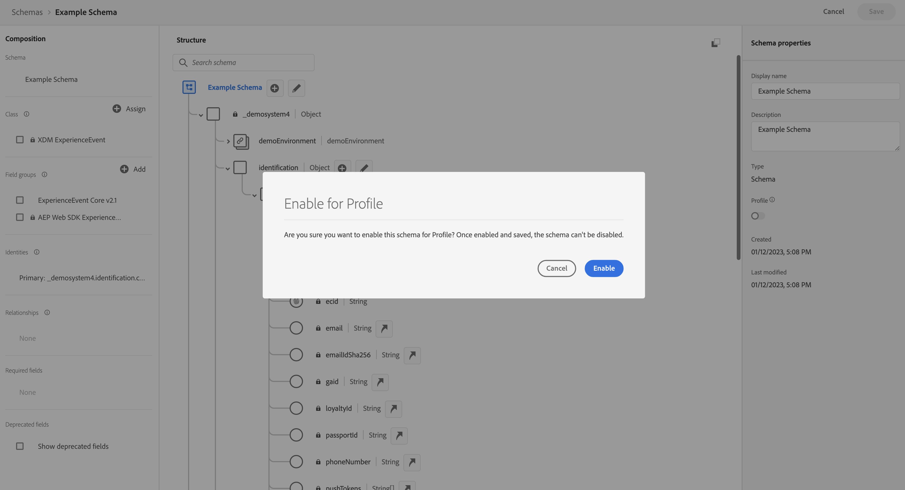

# Customer Journey Analytics 웹 SDK 구현에 사용할 XDM 스키마 만들기

>[!NOTE]
> 
>이전의 모든 업그레이드 단계를 완료한 후에만 이 페이지의 단계를 따르십시오. [권장되는 업그레이드 단계](/help/getting-started/cja-upgrade/cja-upgrade-recommendations.md#recommended-upgrade-steps-for-most-organizations)를 따르거나, [Adobe Analytics을 사용하여 조직에 대해 동적으로 생성된 업그레이드 단계를 따라 업그레이드 Customer Journey Analytics을](https://gigazelle.github.io/cja-ttv/)할 수 있습니다.
>
>이 페이지의 단계를 완료한 후 권장되는 업그레이드 단계 또는 동적으로 생성된 업그레이드 단계를 계속 수행합니다.

>[!IMPORTANT]
>
>XDM 스키마를 생성하기 전에 조직 내의 데이터 팀 및 기타 관련자와 협력하여 사용하는 Customer Journey Analytics 및 기타 Adobe Experience Platform 애플리케이션에 대한 조직의 이상적인 스키마 디자인을 식별하십시오. 자세한 내용은 [Customer Journey Analytics에 사용할 스키마 설계](/help/getting-started/cja-upgrade/cja-upgrade-schema-architect.md)를 참조하십시오.

Adobe은 Customer Journey Analytics으로 업그레이드할 때 XDM(Experience Data Model) 스키마를 생성할 것을 권장합니다. XDM 스키마를 사용하면 조직의 요구 사항과 사용하는 특정 Platform 애플리케이션에 맞게 조정된 간소화된 스키마를 사용할 수 있습니다. 스키마를 변경해야 하는 경우, 업데이트가 필요한 필드를 찾기 위해 사용하지 않는 수천 개의 필드를 검색하지 않아도 됩니다.

## 스키마 만들기

정의하는 XDM 스키마는 Adobe Experience Platform에 수집하는 데이터의 모델을 나타냅니다.

스키마를 생성하려면:

<!-- Should we single source this instead of duplicate it? The following steps were copied from: /help/data-ingestion/aepwebsdk.md-->

1. Adobe Experience Platform의 왼쪽 레일에서 [!UICONTROL 데이터 관리] 내의 **[!UICONTROL 스키마]**&#x200B;을(를) 선택합니다.

1. **[!UICONTROL 스키마 만들기]**&#x200B;를 선택합니다.

1. 스키마 만들기 마법사의 **[!UICONTROL 클래스 선택]** 단계에서 다음을 수행합니다.

   1. **[!UICONTROL 경험 이벤트]**&#x200B;를 선택합니다.

      

      >[!INFO]
      >
      >    경험 이벤트 스키마를 사용하여 프로필의 _비헤이비어_&#x200B;을(를) 모델링합니다(예: 장면 이름, 장바구니에 추가할 푸시 단추). 개별 프로필 스키마는 프로필 _속성_(예: 이름, 이메일, 성별)을 모델링하는 데 사용됩니다.

   1. **[!UICONTROL 다음]**&#x200B;을 선택합니다.

1. [!UICONTROL 스키마 만들기] 마법사의 [!UICONTROL 이름 및 검토 단계]에서:

   1. 스키마에 대한 **[!UICONTROL 스키마 표시 이름]**&#x200B;과(와) **[!UICONTROL 설명]**&#x200B;을(를) 입력하십시오.

      

   1. **[!UICONTROL 마침]**&#x200B;을 선택합니다.

1. 스키마에 포함할 필드를 포함하는 모든 필드 그룹을 추가합니다.

   필드 그룹은 손쉽게 스키마를 확장할 수 있는 재사용 가능한 오브젝트 및 속성의 컬렉션입니다.

   1. **[!UICONTROL 필드 그룹]** 섹션에서 **[!UICONTROL + 추가]**&#x200B;를 선택합니다.

      

   1. [!UICONTROL 필드 그룹 추가] 대화 상자의 목록에서 **[!UICONTROL AEP Web SDK ExperienceEvent]** 필드 그룹을 선택합니다.

      

      미리보기 버튼을 선택하여 이 필드 그룹(예: `web > webPageDetails > name`)에 포함된 필드의 미리보기를 볼 수 있습니다.

      

      **[!UICONTROL 뒤로]**&#x200B;를 선택하여 미리보기를 닫습니다.

   1. (선택 사항) 포함할 추가 필드 그룹을 선택합니다.

   1. **[!UICONTROL 필드 그룹 추가]**&#x200B;를 선택합니다.

1. (선택 사항) 스키마에 포함할 사용자 정의 필드가 있는 경우 사용자 정의 필드 그룹을 만들고 사용자 정의 필드를 필드 그룹에 추가합니다.

   1. **[!UICONTROL 필드 그룹]** 섹션에서 **[!UICONTROL + 추가]**&#x200B;를 선택합니다.

      

   1. [!UICONTROL 필드 그룹 추가] 대화 상자에서 **[!UICONTROL 새 필드 그룹 만들기]**&#x200B;를 선택합니다.

   1. 표시 이름과 선택적 설명을 지정한 다음 **[!UICONTROL 필드 그룹 추가]**&#x200B;를 선택합니다.

1. [!UICONTROL 구조] 패널의 스키마 이름 옆에 있는 **[!UICONTROL +]**&#x200B;를 선택합니다.

   

1. [!UICONTROL 필드 속성] 패널에서 `Identification`을 이름으로, **[!UICONTROL 식별]**&#x200B;을 [!UICONTROL 디스플레이 이름]으로 입력하고 **[!UICONTROL 오브젝트]**&#x200B;를 [!UICONTROL 유형]으로 **[!UICONTROL ExperienceEvent 코어 v2.1]**&#x200B;을 [!UICONTROL 필드 그룹]으로 선택합니다.

   >[!NOTE]
   >
   >해당 필드 그룹을 사용할 수 없는 경우 ID 필드가 포함된 다른 필드 그룹을 찾습니다. 또는 필드 그룹에 [새 필드 그룹을 만들고](https://experienceleague.adobe.com/docs/experience-platform/xdm/ui/resources/field-groups.html) [새 ID 필드를 추가](https://experienceleague.adobe.com/docs/experience-platform/xdm/ui/fields/identity.html#define-a-identity-field)(`ecid`, `crmId` 및 필요한 기타 필드)하여 해당 새 필드 그룹을 선택하십시오.

   

   ID 개체는 스키마에 ID 기능을 추가합니다. 이 경우 Experience Cloud ID 및 이메일 주소를 사용하여 사이트를 방문하는 프로필을 식별하려고 합니다. 개인의 ID를 추적하는 데 사용할 수 있는 다른 많은 속성(예: 고객 ID, 충성도 ID)이 있습니다.

   **[!UICONTROL 적용]**&#x200B;을 선택하여 이 오브젝트를 스키마에 추가합니다.

1. 방금 추가한 식별 오브젝트에서 **[!UICONTROL ECID]** 필드를 선택한 다음 오른쪽 패널의 [!UICONTROL ID 네임스페이스] 목록에서 **[!UICONTROL ID]**, **[!UICONTROL 기본 ID]** 및 **[!UICONTROL ECID]**&#x200B;를 선택합니다.

   

   Experience Cloud ID를 Adobe Experience Platform ID 서비스가 프로필의 비헤이비어를 동일한 ECID와 결합하는 데 사용할 수 있는 기본 ID로 지정합니다.

   **[!UICONTROL 적용]**&#x200B;을 선택합니다. ECID 속성에 지문 아이콘이 표시되는 것을 볼 수 있습니다.

1. 방금 추가한 식별 오브젝트에서 **[!UICONTROL 이메일]** 필드를 선택한 다음 [!UICONTROL 필드 속성] 패널의 [!UICONTROL ID 네임스페이스] 목록에서 **[!UICONTROL ID]** 및 **[!UICONTROL 이메일]**&#x200B;을 선택합니다.

   

   이메일 주소를 Adobe Experience Platform ID 서비스가 프로필의 비헤이비어를 결합하는 데 사용할 수 있는 다른 ID로 지정합니다.

   **[!UICONTROL 적용]**&#x200B;을 선택합니다. 이메일 속성에 지문 아이콘이 표시되는 것을 볼 수 있습니다.

   **[!UICONTROL 저장]**&#x200B;을 선택합니다.

1. (선택 사항) Customer Journey Analytics을 RTCDP와 통합하려면 스키마 이름을 표시하는 스키마의 루트 요소를 선택한 다음 **[!UICONTROL 프로필]** 스위치를 선택합니다.

   스키마를 프로필용으로 활성화하라는 메시지가 표시됩니다. 활성화한 후 데이터가 이 스키마를 기반으로 데이터 세트로 수집되면 해당 데이터는 실시간 고객 프로필에 병합됩니다.

   자세한 내용은 [실시간 고객 프로필에 사용할 스키마 활성화](https://experienceleague.adobe.com/docs/experience-platform/xdm/tutorials/create-schema-ui.html#profile)를 참조하십시오.

   >[!IMPORTANT]
   >
   >프로필에 대해 스키마를 활성화한 후에는 프로필에 대해 비활성화할 수 없습니다.

   

1. 스키마를 저장하려면 **[!UICONTROL 저장]**&#x200B;을 클릭합니다.

   웹 사이트에서 캡처할 수 있는 데이터를 모델링하는 최소한의 스키마를 만들었습니다. 스키마를 통해 Experience Cloud ID 및 이메일 주소를 사용하여 프로필을 식별할 수 있습니다. 스키마를 프로필용으로 활성화하여 웹 사이트에서 캡처된 데이터가 실시간 고객 프로필에 추가되었는지 확인합니다.

   비헤이비어 데이터 옆에서 사이트의 프로필 속성 데이터(예: 뉴스레터를 구독하는 프로필의 세부 정보)를 캡처할 수도 있습니다.

   이 프로필 데이터를 캡처하려면 다음 작업을 수행합니다.

   * XDM 개별 프로필 클래스를 기반으로 스키마를 만듭니다.

   * 프로필 코어 v2 필드 그룹을 스키마에 추가합니다.

   * 프로필 코어 v2 필드 그룹을 기반으로 식별 오브젝트를 추가합니다.

   * Experience Cloud ID를 기본 식별자로 정의하고 이메일을 식별자로 정의합니다.

   * 프로필용으로 스키마 활성화

   스키마에 필드 그룹 및 개별 필드 추가 및 제거에 대한 자세한 내용은 [UI에서 스키마 생성 및 편집](https://experienceleague.adobe.com/docs/experience-platform/xdm/ui/resources/schemas.html)을 참조하십시오.

1. [권장된 업그레이드 단계](/help/getting-started/cja-upgrade/cja-upgrade-recommendations.md#recommended-upgrade-steps-for-most-organizations) 또는 [동적으로 생성된 업그레이드 단계](https://gigazelle.github.io/cja-ttv/)를 계속 따릅니다.
