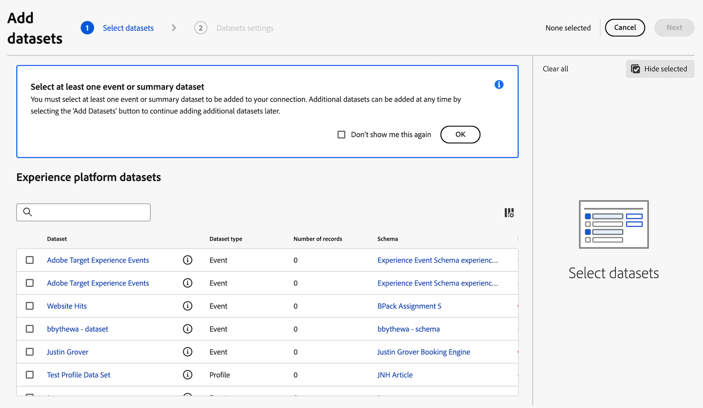
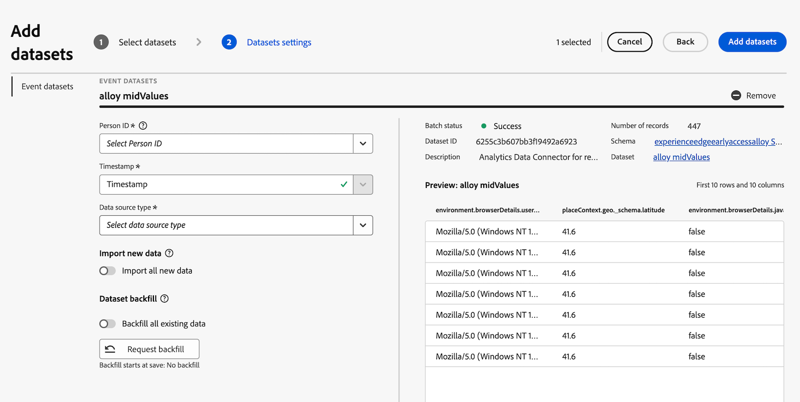

# 연결에 Analytics 소스 커넥터 데이터 세트 추가

>[!NOTE]
> 
>이전의 모든 업그레이드 단계를 완료한 후에만 이 페이지의 단계를 따르십시오. [권장되는 업그레이드 단계](/help/getting-started/cja-upgrade/cja-upgrade-recommendations.md#recommended-upgrade-steps-for-most-organizations)를 따르거나, [Adobe Analytics을 사용하여 조직에 대해 동적으로 생성된 업그레이드 단계를 따라 업그레이드 Customer Journey Analytics을](https://gigazelle.github.io/cja-ttv/)할 수 있습니다.
>
>이 페이지의 단계를 완료한 후 권장되는 업그레이드 단계 또는 동적으로 생성된 업그레이드 단계를 계속 수행합니다.

## Analytics 소스 커넥터가 내역 데이터를 Customer Journey Analytics으로 가져오는 방법을 이해합니다

Analytics 소스 커넥터를 사용하여 Adobe Analytics 보고서 세트 데이터를 Adobe Experience Platform으로 가져올 수 있습니다. 그런 다음 이 데이터를 Customer Journey Analytics에서 내역 데이터로 사용할 수 있습니다.

이 프로세스에서는 조직의 요구 사항과 사용하는 특정 Platform 애플리케이션에 맞게 조정된 간소화된 스키마를 원하므로 [Customer Journey Analytics으로 업그레이드할 때 XDM 스키마를 생성](/help/getting-started/cja-upgrade/cja-upgrade-schema-create.md)한다고 가정합니다.

Analytics 소스 커넥터를 사용하여 내역 데이터를 Customer Journey Analytics으로 가져오려면 다음을 수행해야 합니다.

1. [Analytics 소스 커넥터에 대한 XDM 스키마 만들기](/help/getting-started/cja-upgrade/cja-upgrade-source-connector-schema.md)

1. [Analytics 소스 커넥터 만들기 및 필드 매핑](/help/getting-started/cja-upgrade/cja-upgrade-source-connector.md)

1. 아래 설명된 대로 Analytics 소스 커넥터 데이터 세트를 연결에 추가합니다.

## 연결에 Analytics 소스 커넥터 데이터 세트 추가

[이전 데이터에 대한 Analytics 소스 커넥터를 만든](/help/getting-started/cja-upgrade/cja-upgrade-source-connector.md) 후 Analytics 데이터에 대한 데이터 세트가 자동으로 만들어집니다.

자동으로 생성된 이 데이터 세트를 웹 SDK 구현을 위해 만든 연결과 동일한 연결에 추가해야 합니다. 이렇게 하면 Analytics 데이터가 웹 SDK 데이터와 Customer Journey Analytics의 동일한 데이터 보기에 표시됩니다.

자동으로 만든 데이터 세트를 웹 SDK 구현을 위해 만든 연결과 동일한 연결에 추가하려면:

1. Customer Journey Analytics에서 **[!UICONTROL 연결]** 탭을 선택합니다.

1. [웹 SDK 구현을 위해 만든 연결](/help/getting-started/cja-upgrade/cja-upgrade-connection.md)을 선택하십시오.

1. **[!UICONTROL 편집]**&#x200B;을 선택합니다.

   

1. 오른쪽 상단에서 **[!UICONTROL 데이터 세트 추가]**&#x200B;를 선택합니다.

   

1. Analytics 소스 커넥터를 만들 때 자동으로 만들어진 데이터 세트로 스크롤하거나 검색합니다.

   이 데이터 세트의 이름은 보고서 세트의 이름 다음에 `midValues`이(가) 옵니다. 예: `My report suite midValues`

1. 데이터 집합 이름 옆의 확인란을 선택한 다음 **[!UICONTROL 다음]**&#x200B;을(를) 선택합니다.

   

1. 다음 정보를 지정합니다.

   <!-- Copied from help/connections/create-connection.md. Should we single source? -->

   | 설정 | 설명 |
   | --- | --- |
   | **[!UICONTROL 개인 ID]** | 이벤트 및 프로필 데이터 세트에만 사용할 수 있습니다. 사용 가능한 ID의 드롭다운 목록에서 개인 ID를 선택합니다. 이러한 ID는 Experience Platform의 데이터 세트 스키마에 정의되어 있습니다. ID 맵을 개인 ID로 사용하는 방법에 대한 자세한 내용은 아래를 참조하십시오.
선택할 개인 ID가 없는 경우 하나 이상의 개인 ID가 스키마에 정의되어 있지 않음을 의미합니다. 자세한 내용은 [UI에서 ID 필드 정의](https://experienceleague.adobe.com/ko/docs/experience-platform/xdm/ui/fields/identity)를 참조하십시오. 
선택한 개인 ID의 값은 대소문자를 구분하는 것으로 간주됩니다. 예를 들어 `abc123` 및 `ABC123`은 서로 다른 두 값입니다. |
   | **[!UICONTROL 타임스탬프]** | 이벤트 및 요약 데이터 세트의 경우에만 이 설정이 Experience Platform의 이벤트 기반 스키마에서 기본 타임스탬프 필드로 자동 설정됩니다. |
   | **[!UICONTROL 시간대]** | 요약 데이터에만 사용할 수 있습니다. 시계열 요약 데이터에 적합한 시간대를 선택합니다. |
   | **[!UICONTROL 데이터 소스 유형]** | 데이터 소스 유형을 선택합니다.  데이터 소스 유형에는 다음이 포함됩니다. <ul><li>[!UICONTROL 웹 데이터]</li><li>[!UICONTROL 모바일 앱 데이터]</li><li>[!UICONTROL POS 데이터]</li><li>[!UICONTROL CRM 데이터]</li><li>[!UICONTROL 설문 조사 데이터]</li><li>[!UICONTROL 콜 센터 데이터]</li><li>[!UICONTROL 제품 데이터]</li><li> [!UICONTROL 계정 데이터]</li><li> [!UICONTROL 트랜잭션 데이터]</li><li>[!UICONTROL 고객 피드백 데이터]</li><li> [!UICONTROL 기타]</li></ul>이 필드를 사용하여 사용 중인 데이터 소스 유형을 조사합니다. |

   {style="table-layout:auto"}

1. **[!UICONTROL 새 데이터 가져오기]** 섹션에서 **[!UICONTROL 새 데이터 모두 가져오기]** 옵션을 비활성화합니다.

   이전 데이터에 대해 Analytics 소스 커넥터 데이터 세트를 사용하고 있으므로 이 데이터 세트에 수집된 이후 데이터를 가져오지 않습니다.

1. **[!UICONTROL 데이터 세트 채우기]** 섹션에서 **[!UICONTROL 채우기 요청]**&#x200B;을(를) 선택합니다.

1. 시작 및 종료 날짜를 입력하거나 달력 아이콘 을 선택하여 채우기에 포함할 기간을 정의합니다.

   Analytics 소스 커넥터는 프로덕션 샌드박스에 대해 13개월의 데이터(크기에 상관없이)를 가져옵니다. 비프로덕션 샌드박스의 채우기 기간은 3개월입니다.

   >[!IMPORTANT]
   >
   >다시 채우기를 요청하는 날짜를 지정할 때 명시해야 합니다. 종료 날짜는 웹 SDK 구현으로 데이터 수집을 처음 시작한 날짜여야 합니다.
   >
   >또는 웹 SDK 구현으로 데이터 수집을 처음 시작한 날짜 직후 날짜를 선택한 다음 세그먼트를 사용하여 겹치는 데이터를 필터링할 수 있습니다.

   <!-- Include any of the following?  Make sure you're explicit as to the dates you request backfill to. You want to request it to the date that you start gathering data with your Web SDK implementation. Also possibly include segments for any overlapping date. So you could request everything and then use a segment to exclude data that you don't want. That way if you need to move up the date, then you could change the date in the filter. Downside would be that you might pay for double rows.  When they do that, they're going to see all schema fields from both their custom schema and their Analytics schema. So they'll need to be cognizant to select the right fields, and never select any Analytics fields, because they will be mapped as part of the source connector. Never select any Analytics field group fields because they'll be mapped.  -->

1. **[!UICONTROL 다시 채우기 큐]**&#x200B;를 선택하십시오.

1. **[!UICONTROL 데이터 세트 추가]**&#x200B;를 선택한 다음 **[!UICONTROL 저장]**&#x200B;을 선택하여 연결을 저장합니다.

1. [권장된 업그레이드 단계](/help/getting-started/cja-upgrade/cja-upgrade-recommendations.md#recommended-upgrade-steps-for-most-organizations) 또는 [동적으로 생성된 업그레이드 단계](https://gigazelle.github.io/cja-ttv/)를 계속 따릅니다.
