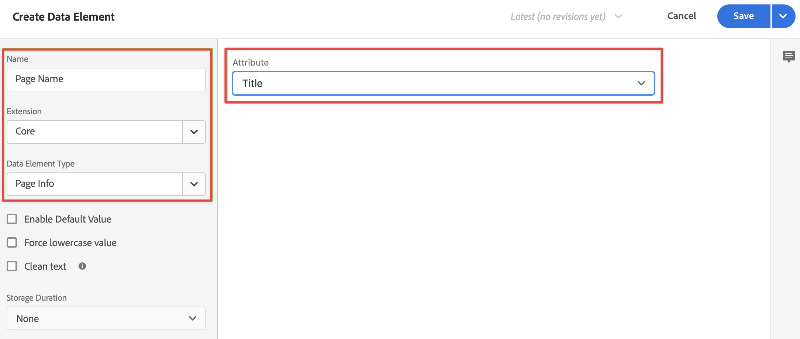

# 태그에 XDM 데이터 수집 논리 추가 {#upgrade-tag-xdm}

<!-- markdownlint-disable MD034 -->

>[!CONTEXTUALHELP]
>id="cja-upgrade-tag-xdm"
>title="태그에 XDM 데이터 수집 논리 추가"
>abstract="로더 태그를 사이트에 설치하면 규칙과 데이터 요소를 추가하여 Adobe로 보낼 XDM 오브젝트를 채울 수 있습니다. Adobe는 태그 구성 방식을 추적하기 위해 솔루션 설계 문서를 유지 관리할 것을 권장합니다.  이 단계는 모든 속성에 대한 모든 분석 논리를 설정하는 것을 포함하기 때문에 많은 작업이 필요합니다. 올바른 태그 규칙을 설정하고 테스트한 후 사이트에 배포하는 데 한 달 이상 소요될 것으로 예상됩니다."

<!-- markdownlint-enable MD034 -->

{{upgrade-note-step}}

[태그를 생성하고 Web SDK 확장을 추가](/help/getting-started/cja-upgrade/cja-upgrade-tag-property.md)한 후 사이트를 추적하고 Adobe Experience Platform으로 데이터를 전송하는 방법에 따라 데이터 요소와 규칙을 사용하여 태그를 구성해야 합니다. 태그에 대한 데이터 요소와 규칙을 구성한 후에는 태그를 빌드하고 게시할 수 있습니다.

## 데이터 요소 구성

데이터 요소는 데이터 사전(또는 데이터 맵)의 기본 구성단위입니다. 데이터 요소를 사용하여 마케팅 및 광고 기술 전반에서 데이터를 수집, 구성 및 전달합니다. 데이터 레이어에서 읽고 데이터를 Adobe Experience Platform으로 전달하는 데 사용할 수 있는 데이터 요소를 태그에 설정합니다. (데이터 요소에 대한 자세한 내용은 태그 문서에서 [데이터 요소](https://experienceleague.adobe.com/ko/docs/experience-platform/tags/ui/data-elements)를 참조하십시오.)

다음 섹션에서는 제안된 데이터 요소와 구성할 수 있는 기타 일반적인 데이터 요소를 설명합니다.

데이터 요소에는 다양한 유형이 있습니다. 구성하고자 할 수 있는 두 가지 일반적인 데이터 요소는 다음과 같습니다. 하나는 사이트에서 사람들이 보고 있는 페이지 이름을 캡처하는 것이고, 다른 하나는 사이트를 방문하는 각 사람의 Experience Cloud ID를 캡처하는 것입니다.

이 두 데이터 요소를 구성한 후에는 캡처하려는 특정 데이터에 대해 추가 데이터 요소를 구성할 수 있습니다.

마지막으로, 원하는 모든 데이터 요소를 정의한 후에는 이전에 [생성한 스키마](/help/getting-started/cja-upgrade/cja-upgrade-schema-create.md)에 데이터 요소를 할당해야 합니다. 이를 수행하려면 XDM 스키마를 나타내는 XDM 데이터 요소를 정의해야 합니다.

<!-- Assigning data elements to an XDM object. All of the available XDM objects are based on the schema -->

### 제안된 데이터 요소 만들기

다음 섹션에서는 대부분의 조직에 적용되는 일반 데이터 요소를 만드는 방법을 설명합니다.

#### 페이지 이름 데이터 요소

대부분의 조직에 적용되는 일반 데이터 요소는 사람들이 보고 있는 페이지 이름을 캡처하는 데이터 요소입니다.

페이지 이름 데이터 요소를 만드는 방법:

1. Adobe ID 자격 증명을 사용하여 experience.adobe.com에 로그인합니다.

1. Adobe Experience Platform에서 **[!UICONTROL 데이터 수집]** > **[!UICONTROL 태그]**&#x200B;로 이동합니다.

1. **[!UICONTROL 태그 속성]** 페이지에서 속성 목록에서 새로 만든 태그를 선택하여 엽니다.

1. 왼쪽 레일에서 **[!UICONTROL 데이터 요소]**&#x200B;를 선택합니다.

1. **[!UICONTROL 데이터 요소 추가]**&#x200B;를 선택합니다.

1. **[!UICONTROL 데이터 요소 만들기]** 대화 상자에서 다음 정보를 지정합니다.

   * **[!UICONTROL 이름]**: 데이터 요소의 이름. 예 `Page Name`.

   * **[!UICONTROL 확장]**: 목록에서 **[!UICONTROL 코어]**&#x200B;를 선택합니다.

   * **[!UICONTROL 데이터 요소 유형]**: 목록에서 **[!UICONTROL 페이지 정보]**&#x200B;를 선택합니다.

   * **[!UICONTROL 속성]**: 목록에서 **[!UICONTROL 제목]**&#x200B;을 선택합니다.

     

     또는 데이터 레이어의 변수 값(예: `pageName` 및 [!UICONTROL JavaScript 변수] 데이터 요소 유형)을 사용하여 데이터 요소를 정의할 수 있습니다.

     

1. **[!UICONTROL 저장]**&#x200B;을 선택합니다.

   이제 Adobe Experience Platform Web SDK에서 자동으로 제공되고 Experience Cloud ID 서비스 확장을 통해 사용할 수 있는 Experience Cloud ID를 참조하는 데이터 요소를 설정하려고 합니다.

1. [ECID 데이터 요소](#ecid-data-element)로 계속 진행합니다.

#### ECID 데이터 요소

대부분의 조직에 적용되는 일반적인 데이터 요소는 사이트를 방문하는 각 개인의 Experience Cloud ID를 캡처하는 데이터 요소입니다.

ECID 데이터 요소를 만드는 방법:

1. Adobe ID 자격 증명을 사용하여 experience.adobe.com에 로그인합니다.

1. Adobe Experience Platform에서 **[!UICONTROL 데이터 수집]** > **[!UICONTROL 태그]**&#x200B;로 이동합니다.

1. [!UICONTROL 태그 속성] 목록에서 새로 만든 태그를 선택하여 엽니다.

1. (조건부) Experience Cloud ID 서비스 확장 기능이 아직 설치되지 않았다면 설치합니다.

   1. 왼쪽 레일에서 **[!UICONTROL 확장]**&#x200B;을 선택합니다.

   1. 기본적으로 **[!UICONTROL 설치됨]** 탭이 선택됩니다. **[!UICONTROL Experience Cloud ID 서비스]** 타일이 나열되어 있으면 5단계로 건너뜁니다.

   1. **[!UICONTROL Experience Cloud ID 서비스]** 타일이 나열되어 있으면 **[!UICONTROL 카탈로그]** 탭을 선택합니다.

   1. 검색창에서 **[!UICONTROL Experience Cloud ID 서비스]**&#x200B;를 검색한 후 타일이 나타나면 선택합니다.

   1. **[!UICONTROL 설치]** > **[!UICONTROL 저장]**&#x200B;을 선택합니다.

1. 왼쪽 레일에서 **[!UICONTROL 데이터 요소]**&#x200B;를 선택합니다.

1. **[!UICONTROL 데이터 요소 추가]**&#x200B;를 선택합니다.

1. **[!UICONTROL 데이터 요소 만들기]** 대화 상자에서 다음 정보를 지정합니다.

   * **[!UICONTROL 이름]**: 데이터 요소의 이름. 예 `ECID`.

   * **[!UICONTROL 확장]**: 목록에서 **[!UICONTROL Experience Cloud ID 서비스]**&#x200B;를 선택합니다.

   * **[!UICONTROL 데이터 요소 유형]**: 목록에서 **[!UICONTROL ECID]**&#x200B;를 선택합니다.

     

1. **[!UICONTROL 저장]**&#x200B;을 선택합니다.

1. [추가 데이터 요소 만들기](#create-additional-data-elements)로 계속 진행합니다.

### 추가 데이터 요소 만들기

수집하려는 각 유형의 데이터에 대한 데이터 요소를 생성합니다. [페이지 이름 데이터 요소](#page-name-data-element)와 [ECID 데이터 요소](#ecid-data-element)에 설명된 동일한 프로세스를 사용하여 각 추가 데이터 요소를 생성합니다.

생성하는 데이터 요소는 스키마에 상관 필드가 있어야 합니다.

일반 데이터 요소는 업계 및 비즈니스 요구 사항에 따라 달라집니다. 업계별로 정리된 다음의 일반 데이터 요소를 고려합니다.

**소매 데이터 요소**

* 제품

* 장바구니 추가

* 체크아웃

**재무 데이터 요소**

* 거래 ID

* 트랜잭션 일자

* 서비스 유형

**헬스 케어 데이터 요소**

* 제공자 ID

* 방문 날짜

* 처리 유형

조직에서 구현에 필요한 모든 데이터 요소를 생성한 후에는 [XDM 오브젝트 데이터 요소](#xdm-object-data-element)로 계속 진행합니다.

### XDM 오브젝트 데이터 요소

마지막으로, 이제 생성한 데이터 요소를 이전에 [생성한 스키마](/help/getting-started/cja-upgrade/cja-upgrade-schema-create.md)에 매핑하려고 합니다. 이를 수행하려면 XDM 스키마를 표현하는 XDM 오브젝트 데이터 요소를 정의해야 합니다.

XDM 오브젝트 데이터 요소를 정의하는 경우:

1. Adobe ID 자격 증명을 사용하여 experience.adobe.com에 로그인합니다.

1. Adobe Experience Platform에서 **[!UICONTROL 데이터 수집]** > **[!UICONTROL 태그]**&#x200B;로 이동합니다.

1. [!UICONTROL 태그 속성] 목록에서 새로 만든 태그를 선택하여 엽니다.

1. 왼쪽 레일에서 **[!UICONTROL 데이터 요소]**&#x200B;를 선택합니다.

1. **[!UICONTROL 데이터 요소 추가]**&#x200B;를 선택합니다.

1. **[!UICONTROL 데이터 요소 만들기]** 대화 상자에서 다음 정보를 지정합니다.

   * **[!UICONTROL 이름]**: 데이터 요소의 이름. 예 `XDM - Page View`.

   * **[!UICONTROL 확장]**: 목록에서 **[!UICONTROL Adobe Experience Platform Web SDK]**&#x200B;를 선택합니다.

   * **[!UICONTROL 데이터 요소 유형]**: 목록에서 **[!UICONTROL XDM 오브젝트]**&#x200B;를 선택합니다.

   * **[!UICONTROL 샌드박스]**: 목록에서 샌드박스를 선택합니다.

   * **[!UICONTROL 스키마]**: 목록에서 스키마를 선택합니다.

1. 스키마에 정의된 `identification > core > ecid` 속성을 ECID 데이터 요소에 매핑합니다. 원통 아이콘을 선택하여 데이터 요소 목록에서 ECID 데이터 요소를 쉽게 선택합니다.

   

   

1. 스키마에 정의된 `web > webPageDetails > name` 속성을 페이지 이름 데이터 요소에 매핑합니다.

   

1. **[!UICONTROL 저장]**&#x200B;을 선택합니다.

1. [규칙 구성](#configure-rules)으로 계속 진행합니다.

## **규칙 구성**

Adobe Experience Platform의 태그는 규칙 기반 시스템을 따릅니다. 사용자 상호 작용과 관련 데이터를 찾습니다. 규칙에 요약된 기준이 충족되면 규칙이 정의한 확장, 스크립트 또는 클라이언트측 코드를 트리거합니다. Adobe Experience Platform Web SDK 확장을 통해 규칙을 사용하여 데이터(예: XDM 오브젝트)를 Adobe Experience Platform에 전송할 수 있습니다.

규칙을 정의하는 경우:

>[!NOTE]
>
>다음 단계는 다른 데이터 요소의 값이 포함된 XDM 데이터를 Adobe Experience Platform에 전송하는 규칙을 정의하는 예시일 뿐입니다.
>
>태그에서 다양한 방식으로 규칙을 사용하여 변수를 조작할 수 있습니다(데이터 요소 사용).
>
>자세한 내용은 [규칙](https://experienceleague.adobe.com/docs/experience-platform/tags/ui/rules.html)을 참조하십시오.

1. Adobe ID 자격 증명을 사용하여 experience.adobe.com에 로그인합니다.

1. Adobe Experience Platform에서 **[!UICONTROL 데이터 수집]** > **[!UICONTROL 태그]**&#x200B;로 이동합니다.

1. [!UICONTROL 태그 속성] 목록에서 새로 만든 태그를 선택하여 엽니다.

1. 왼쪽 레일에서 **[!UICONTROL 규칙]**&#x200B;을 선택합니다.

1. **[!UICONTROL 규칙 추가]**&#x200B;를 선택합니다.

1. **[!UICONTROL 규칙 만들기]** 대화 상자에서 다음 정보를 지정합니다.

   * **[!UICONTROL 이름]**: 규칙의 이름. 예 `Page View`.

   * **[!UICONTROL 이벤트]**: **[!UICONTROL + 추가]**&#x200B;를 선택합니다. 그런 다음 **[!UICONTROL 이벤트 구성]** 대화 상자에서 다음 정보를 지정합니다. 작업이 끝나면 **[!UICONTROL 변경 내용 유지]**&#x200B;를 선택합니다.

      * **[!UICONTROL 확장]**: 목록에서 **[!UICONTROL 코어]**&#x200B;를 선택합니다.

      * **[!UICONTROL 이벤트 유형]**: 목록에서 **[!UICONTROL 로드된 창]**&#x200B;을 선택합니다.

        

   * **[!UICONTROL 액션]**: **[!UICONTROL + 추가]**&#x200B;를 선택합니다. 그런 다음 [!UICONTROL 액션 구성] 대화 상자에서 다음 정보를 지정합니다. 작업이 끝나면 **[!UICONTROL 변경 내용 유지]**&#x200B;를 선택합니다.

      * **[!UICONTROL 확장]**: 목록에서 **[!UICONTROL Adobe Experience Platform Web SDK]**&#x200B;를 선택합니다.

      * **[!UICONTROL 액션 유형]**: 목록에서 **[!UICONTROL 이벤트 전송]**&#x200B;을 선택합니다.

      * **[!UICONTROL 유형]**: 목록에서 **[!UICONTROL 웹 Webpagedetails 페이지 조회수]**&#x200B;를 선택합니다.

      * **[!UICONTROL XDM 데이터]**: 원통 아이콘을 선택한 후 데이터 요소 목록에서 **[!UICONTROL XDM - 페이지 조회수]**&#x200B;를 선택합니다.

        

        규칙은 다음과 같습니다.

        

1. **[!UICONTROL 저장]**&#x200B;을 선택합니다.

1. 사이트에 추가하려는 각 규칙에 대해 이 과정을 반복합니다.

   규칙에 대한 자세한 내용은 태그 설명서의 [규칙](https://experienceleague.adobe.com/ko/docs/experience-platform/tags/ui/rules)을 참조하십시오.

1. [태그 빌드 및 게시](#build-and-publish-your-tag)로 계속 진행합니다.

## 태그 빌드 및 게시

데이터 요소 및 규칙을 정의한 후 태그를 빌드하고 게시해야 합니다. 라이브러리 빌드를 만들면 이를 환경에 지정해야 합니다. 그런 다음 빌드의 확장, 규칙 및 데이터 요소를 컴파일하여 지정된 환경에 배치합니다. 각 환경에서는 지정된 빌드를 사이트에 통합할 수 있는 고유한 임베드 코드를 제공합니다.

Adobe Experience Platform 태그는 Adobe Experience Platform Web SDK 배포를 수용해야 하는 간단하면서 복잡한 게시 워크플로를 지원합니다. 자세한 내용은 [게시 개요](https://experienceleague.adobe.com/docs/experience-platform/tags/publish/overview.html)를 참조하십시오.

태그를 빌드하고 게시하는 경우:

1. Adobe ID 자격 증명을 사용하여 experience.adobe.com에 로그인합니다.

1. Adobe Experience Platform에서 **[!UICONTROL 데이터 수집]** > **[!UICONTROL 태그]**&#x200B;로 이동합니다.

1. [!UICONTROL 태그 속성] 목록에서 새로 만든 태그를 선택하여 엽니다.

1. 왼쪽 레일에서 **[!UICONTROL 흐름 게시]**&#x200B;를 선택합니다.

1. **[!UICONTROL 라이브러리 추가]**&#x200B;를 선택합니다.

1. **[!UICONTROL 라이브러리 만들기]** 대화 상자에서 다음 정보를 지정합니다.

   * **[!UICONTROL 이름]**: 라이브러리의 이름.

   * **[!UICONTROL 환경]**: 목록에서 **[!UICONTROL 개발(개발)]**&#x200B;을 선택합니다.

1. **[!UICONTROL 변경된 모든 리소스 추가]**&#x200B;를 선택합니다.

   

1. **[!UICONTROL 개발에 저장 및 빌드]**&#x200B;을 선택합니다.

   개발 환경에 대해 태그가 저장되고 빌드됩니다. 녹색 점은 개발 환경에서 태그의 빌드가 완료되었음을 나타냅니다.

1. **[!UICONTROL ...]**&#x200B;를 선택하여 라이브러리를 다시 빌드하거나 라이브러리를 스테이징 또는 프로덕션 환경으로 이동할 수 있습니다.

   

{{upgrade-final-step}}

