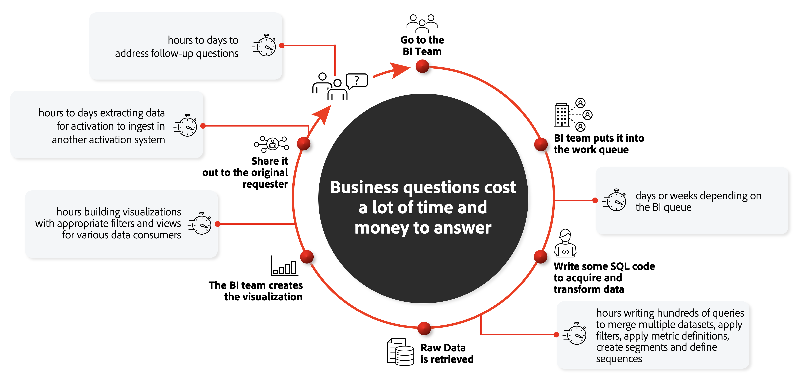

# Customer Journey Analytics와 BI 솔루션 비교

고객 경험에 중점을 두는 현재 상황에서 브랜드에 고급 솔루션을 사용하여 전체적인 고객 여정을 더 깊이 이해할 수 있습니다. 이 전체 고객 여정을 이해하게 되면 온라인 및 오프라인 채널을 통해 고객 참여를 유도하고 고객 전환, 유지 및 충성도를 높이는 방법과 관련하여 중요한 인사이트를 분석하고 확보할 수 있습니다. 여기서 고객 여정은 스시 푸드 체인점에서 제공되는 간단한 온라인 식사 주문이 될 수 있습니다. 또는 고객이 온라인 검색을 딜러 쇼룸 방문 횟수와 결합하는 신차 구매와 최종 직접 구매일 수 있습니다.

여러 조직에 의해 옴니채널 데이터가 데이터 레이크 또는 Data Warehouse에 통합되었습니다. 해당 데이터 저장소 맨 위의 BI(Business Intelligence) 도구를 사용하여 비즈니스가 고객 여정을 이해하는 데 필요한 보고서, 시각화와 인사이트를 제공할 수 있습니다. 종종 이러한 솔루션과 도구의 조합은 특성과 디자인에 따라 일반 용도로 사용되며 명시적으로 고객에 중점을 두지 않습니다. Customer Journey Analytics는 마케터, 데이터 분석가, 데이터 과학자 등 고객 경험 담당자의 역량을 강화하는 데 역점을 두고 있습니다. 이 도구를 사용하여 기타 여러 BI 도구의 제한 없이 모든 채널에서 실시간으로 고객 여정을 전체 컨텍스트로 시각화할 수 있습니다.

설명서의 이 섹션에서는 위에서 언급한 고객 여정 이해 목표를 달성하는 데 필요한 일반 워크플로를 먼저 검토하여 Customer Journey Analytics와 범용 BI 도구의 기본적인 차이에 대해 설명합니다. Customer Journey Analytics와 BI 도구 간에 데이터를 다르게 저장, 수집 및 쿼리하는 방법에 대한 자세한 내용을 제공합니다. 마지막으로 시각화 기능의 차이에 대해 설명합니다.

## 기존 BI 워크플로

고객 여정 분석에 대한 기존 접근 방식에서 자주 발생하는 문제점은 접근 방식이 고객 중심적이지 않다는 것입니다. 각 팀은 사일로에서 데이터를 수집하고, 액세스할 수 있는 데이터를 기반으로 경험을 분석하고 최적화합니다.

특정 디지털 캠페인이 다른 데이터 사일로에 저장된 오프라인 작업에 어떻게 영향을 미치는지 알아보려면 BI 팀의 대기열에 요청을 발행합니다. BI 팀은 데이터를 확보하고 전환하는 데 필요한 쿼리를 기록합니다. 원시 데이터가 검색되면 BI 팀은 시각화를 생성합니다. 데이터를 공유한 다음 인사이트를 면밀히 살펴보고 다른 시스템에서 활성화할 데이터를 추출합니다.

각 단계를 수행하는 데 몇 시간, 며칠 또는 몇 주가 걸릴 수도 있습니다. 후속 질문이 있거나 쿼리된 데이터에 문제가 발생한 경우, 해당 질문을 해결하고 주기가 계속되기까지 더 많은 시간이 소요될 수 있습니다. 고객 여정을 지속적으로 분석, 탐색 및 이해하는 데 이 프로세스는 비효율적이며 확장할 수 없습니다. 일반적으로 BI 팀은 고객 여정 관련 문제 그 이상을 처리하기도 합니다.

## Customer Journey Analytics: 온라인 및 오프라인 데이터에 대한 대중화된 워크플로

Customer Journey Analytics는 고객 여정 이해만을 목적으로 주요 고객 수준에서 온라인 및 오프라인 크로스 채널 데이터를 연결하는 환경을 제공합니다. 관련성이 있는 데이터에 대한 보기를 [연결](/help/connections/overview.md)하고 [정의](/help/data-views/data-views.md)하려면 초기 설정이 필요합니다. 그러나 완료되면 해당 데이터는 지속적인 분석 및 탐색에 쉽게 사용할 수 있습니다. 고객 여정에 대한 통찰력을 점진적으로 확보하고 이해할 수 있습니다. 결합된 온라인 및 오프라인 데이터를 공개하여 고객 여정 관련 질문에 즉시 답변할 수 있습니다.

Customer Journey Analytics를 통한 시각적 Analysis Workspace 환경을 사용하여 질문하고 거의 즉각적으로 통찰력을 확보할 수 있습니다. 크로스 채널 데이터와 보고서는 SQL 코드 없이도 즉시 사용할 수 있습니다. 데이터를 완전히 상호 관련시키면 UI에서 간단한 드래그 앤 드롭 기능으로 추가 쿼리와 분석을 수행할 수 있습니다. 계속 질문하면서 필요에 따라 추가 내용을 점진적으로 탐색할 수 있습니다. 그런 다음 발견된 인사이트에 대해 활성화하고 조율할 대상자 공유와 같은 즉각적인 조치를 취할 수 있습니다.

## Customer Journey Analytics의 강력한 보고 엔진

Customer Journey Analytics는 수백 또는 수천 개의 서버에 분석을 배포하는 강력한 독점 아키텍처를 사용하여 몇 초 내에 Analysis Workspace에 데이터를 표시합니다. 이 처리 아키텍처의 몇 가지 주목할 만한 속성은 다음과 같습니다.

* **개별 고객 관련 쿼리에 최적화됨**: 기술적으로, Customer Journey Analytics는 캐싱을 광범위하게 사용하는 분산된 보고 엔진에 데이터를 저장합니다. 해당 엔진은 개별 수준 이벤트 데이터의 응답 쿼리에 미세 조정되어 고객 관련 쿼리에 완벽하게 최적화되어 있습니다. 보고 엔진은 집계 지표를 즉석에서 빠르게 계산할 수 있는 열 기반 비트맵 인덱스에 데이터를 저장합니다. 강력한 세분화/대상자 분석을 허용하는 광범위한 필터링 엔진이 포함됩니다. 해당 데이터 포인트(일이 발생한 순서)에서 비헤이비어를 분석하고 다양하고 복잡한 모델을 통해 속성을 할당하는 데 유용한 데이터 포인트 사이의 시퀀스를 핵심적으로 이해할 수 있습니다.

* **복잡한 경로 지정 및 필터에 대한 빠른 적용**: 보고 엔진은 부분 정렬된 계층적 데이터 세트에서 작동합니다(예: 담당자 -> 세션 -> 이벤트). 최상위 오브젝트(개별 프로필)의 모든 데이터는 단일 처리 노드에 있어 정확한 결과를 얻을 수 있습니다. 이 파티셔닝을 통해 복잡한 경로 지정 및 필터를 빠르게 적용할 수 있습니다. 보고 기간은 단축하고 규모에 맞게 세션화, 속성, 데이터 속성의 상태 저장 지속성, 복잡한 데이터 조작 옵션 등 복잡한 작업을 실행합니다. BI 업계에서 일반적으로 이러한 유형의 작업은 사용 사례별로 새 OLAP 큐브를 생성해야 합니다. Customer Journey Analytics 보고 엔진을 사용하여 모든 쿼리의 전체 데이터 세트에 무제한 액세스할 수 있으므로 미리 큐빙할 필요 없이 데이터를 완전히 상호 연관시킬 수 있습니다.

* **복잡한 데이터 스트림에 대한 효율적인 쿼리**: 기존 SQL 및 NoSQL 데이터베이스와 보고 엔진의 가장 큰 차이점은 기본 수준의 시퀀스 기반 관계를 기준으로 술어를 결정할 수 있다는 것입니다. 해당 기본 쿼리 작업은 여러 인터리브(및 중첩) 시퀀스로 구성된 레코드 스트림에 표시될 수 있습니다. 효율적인 단일 연속 시퀀스 작업으로 상호 연결된 모든 데이터 스트림에 대해 쿼리를 수행합니다.

* **큰 쿼리에 신속하게 응답하도록 설계됨**: 보고 엔진은 기존 빅데이터 시스템만큼 일반적으로 사용되지 않습니다. 단, 일반적으로 1초 이내에 수백만 또는 수십억 개의 레코드(이벤트 데이터/경험 이벤트)에 걸쳐 있는 쿼리에 응답하도록 특별히 설계되었습니다. 다른 빅데이터 시스템과 달리 데이터를 샘플링하거나 사용자의 가능한 모든 질문에 대한 답변을 미리 계산하여 이 작업을 수행하지는 않습니다. 대신, 대화형 쿼리 사용 사례를 지원할 만큼 충분히 신속하게 답변을 계산할 수 있습니다. Customer Journey Analytics 보고 엔진의 이 특정한 디자인으로 데이터를 지속적으로 쉽게 분석하고 탐색하여 점진적으로 고객 여정에 대한 인사이트를 확보하고 이해할 수 있습니다.

* **Headless BI 솔루션 역할**: 차원, 지표, 필터를 한 곳에서 정의하면 모든 Customer Journey Analytics 클라이언트(공용 Customer Journey Analytics API 포함)가 해당 구성 요소에 액세스할 수 있습니다. 이는 최종 사용자로부터 복잡한 쿼리를 추상화하고, 결과는 사용하는 보고 또는 시각화 클라이언트에 상관없이 동일해야 합니다.

## Customer Journey Analytics의 고유 시각화 기능

보고 엔진은 Customer Journey Analytics 기능의 기본적인 기능으로 사용자는 해당 보고 엔진 내에서 모든 고객 여정 데이터와 점진적으로 상호 작용하고 이를 토대로 작업할 수 있습니다. Customer Journey Analytics는 드래그 앤 드롭 기능을 통해 이 작업을 시각적으로 수행할 수 있는 광범위한 구성 요소 세트와 함께 제공됩니다. 사용자는 BI 시각화 도구를 사용하여 SQL로 준비된 데이터(IT로 정의) 경계 내에서 탐색할 수 있습니다. Customer Journey Analytics를 통해 IT로 돌아가지 않고도 원하는 만큼의 양을 세분화하고 분류하여 다른 SQL 보기를 빌드할 수 있습니다.

여기서 핵심 개념은 “점진적으로”입니다. BI 도구의 대부분 시각화와 달리 Customer Journey Analytics의 시각화 드래그 앤 드롭 UI를 사용하여 특정 요구 사항에 맞게 관련 지표, 차원, 필터(세그먼트), 계산, 타임라인, 주석과 기타 분석 값 등을 통해 상호 작용 방식으로 시각화 쿼리를 빌드하는 등 데이터를 지속적으로 세분화할 수 있습니다.

해당 시각화 구성 요소에는 다음과 같은 스마트 기능이 내장되어 있습니다.

* [예외 항목 탐지](/help/analysis-workspace/virtual-analyst/c-anomaly-detection/anomaly-detection.md) 등 **가상 분석가 기능**&#x200B;은 예측 알고리즘과 머신 러닝을 사용하여 데이터에서 비정상적인 행동을 유도하는 요인에 대한 인사이트를 제공합니다.

* **고급 분석 기능**&#x200B;은 [흐름 다이어그램](/help/analysis-workspace/visualizations/c-flow/flow.md), [속성 패널](/help/analysis-workspace/c-panels/attribution.md), [폴아웃 다이어그램](/help/analysis-workspace/visualizations/fallout/fallout-flow.md)과 [차원 분류](/help/components/dimensions/t-breakdown-fa.md) 등 고객 여정 인사이트에 특별히 중점을 두고 있습니다. 기본 제공 시각화의 예는 다음과 같습니다.

   * [집단/지연 테이블을 통한 고객 유지 분석](/help/analysis-workspace/visualizations/cohort-table/cohort-use-cases.md)에서 빌더의 지표/차원을 드래그 앤 드롭하여 30초 이내에 작업을 완료합니다.

   * [폴아웃](/help/analysis-workspace/visualizations/fallout/configuring-fallout.md)/[흐름](/help/analysis-workspace/visualizations/c-flow/create-flow.md) 시각화. 1분 이내에 설정.

* **점진적으로 탐색하는 모든 단계에서의 세분화 기능**: 적합하다고 여겨질 때마다 대상자를 Experience Platform에 다시 게시한 다음 그 단계에서부터 지원되는 모든 대상에 게시할 수 있습니다.

* 완전 [맞춤형](/help/data-views/component-settings/persistence.md) **세션화**: 세션이 고객 여정에서 채널의 일부로 시작되고 끝나는 시기를 결정합니다.

* **큐레이션과 대중화**: Customer Journey Analytics에서 생성된 대시보드는 다음과 같이 될 수 있습니다.

   * 지속적으로 탐색을 위해 조직의 다른 개인으로 [조정됨](/help/analysis-workspace/curate-share/curate.md),
   * [Report Builder](/help/report-builder/report-buider-overview.md)(전용 플러그인)를 사용하여 Excel로 내보냄,
   * [PDF](/help/analysis-workspace/export/download-send.md), [CSV](/help/analysis-workspace/export/download-send.md) 등 다양한 포맷으로 [전용 모바일 앱](/help/mobile-app/home.md)을 통해 최종 보고서 및/또는 시각화에 관심이 있는 개인에게 [공유됨](/help/analysis-workspace/curate-share/share-projects.md).

사용 가능한 다양한 시각화로 인해 Customer Journey Analytics 시각화 기능과 BI 도구가 제공하는 기능을 비교하는 것은 어렵습니다. 일부 BI 도구에는 고급 시각화 기능이 있지만, Customer Journey Analytics는 모든 추가 쿼리에 “비용을 청구”하지 않고 바로 데이터를 분석할 수 있는 상호 운용성 있는 대화형 고객 여정 시각화에 중점을 두고 있습니다.

## 요약

Customer Journey Analytics는 최적화된 고객 여정 중심의 보고 엔진과 사용자에게 친숙한 도구 및 구성 요소를 원활하게 통합하여 분석을 수행하고 보고서 및 고급 시각화를 빌드하는 방법에서 있어 BI 도구와 다릅니다. 쿼리 엔진과 시각화 환경 사이를 오갈 필요 없이 단일 UI 내에서 모두 처리할 수 있습니다.
