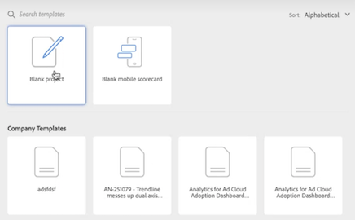

# Customer Journey Analytics 랜딩 페이지

Customer Journey Analytics 랜딩 페이지는 프로젝트 관리자 홈 페이지와 학습 섹션을 강조 표시하여[!DNL Analysis Workspace] 고객 여정 데이터를 보다 효과적으로 관리할 수 있습니다.

>[!VIDEO](https://video.tv.adobe.com/v/334278/?quality=12)

## 새로운 랜딩 페이지 기능 {#new-features}

| 기능 | 설명 | 스크린샷 |
| --- | --- | --- |
| [!UICONTROL 프로젝트] 표를 전체 화면으로 확장 | 표를 확장하려면 햄버거 메뉴 아이콘을 클릭합니다. 이 작업을 수행하면 왼쪽 레일 탭이 축소됩니다. |  |
| 열 너비 사용자 정의 | 이전에는 열 너비가 고정되어 있었습니다. 이제 열 구분 기호를 드래그하여 열 너비를 조정할 수 있습니다. |  |
| 고정 항목 순서 바꾸기 | 고정 항목을 위아래로 이동하려면 고정 항목 옆에 있는 생략 부호를 클릭한 다음 **[!UICONTROL 위로 이동]** 또는 **[!UICONTROL 아래로 이동]**&#x200B;을 선택합니다. |  |
| 새 테이블 열 | 표 오른쪽 상단의 [!UICONTROL 표 사용자 정의] 아이콘을 클릭합니다. 새 테이블 열에는 다음이 포함됩니다. <ul><li>**[!UICONTROL 예약됨]**: 프로젝트가 예약되어 있을 때에는 [!UICONTROL 켜짐]으로, 그렇지 않을 때에는 [!UICONTROL 꺼짐]으로 설정되어 있습니다. [!UICONTROL 켜짐]을 클릭하면 예약된 프로젝트에 대한 정보를 확인할 수 있습니다. 프로젝트 소유자는 [프로젝트 일정을 편집](/help/analysis-workspace/export/t-schedule-report.md)할 수도 있습니다.</li><li>**[!UICONTROL 프로젝트 ID]**: 프로젝트 ID는 프로젝트 디버깅에 사용할 수 있습니다.</li><li>**[!UICONTROL 가장 긴 날짜 범위]**: 가장 긴 날짜 범위는 프로젝트 복잡성을 증가시키며 이로 인해 처리 및 로드 시간이 길어질 수 있습니다. </li><li>**[!UICONTROL 쿼리 개수]**: 프로젝트가 로드될 때 Analytics에 대해 수행된 총 요청 개수입니다. 프로젝트 쿼리 수가 많으면 프로젝트 복잡성을 증가시키며 이로 인해 처리 및 로드 시간이 길어질 수 있습니다. 이 데이터는 프로젝트가 로드되거나 예약된 프로젝트가 전송된 후에만 사용할 수 있습니다. </li></ul> |  |
| **[!UICONTROL 프로젝트 만들기]** 모달 | 작업 영역에서 **[!UICONTROL 프로젝트 만들기]**&#x200B;를 클릭하면 다시 [!UICONTROL 빈 프로젝트]와 [!UICONTROL 빈 모바일 스코어카드] 중에서 선택할 수 있게 됩니다. 귀사에서 제작한 템플릿 중에서 선택할 수도 있습니다. |  |

{style="table-layout:auto"}

## [!UICONTROL 프로젝트] 탭 탐색 {#navigate-projects}

[!UICONTROL 프로젝트]는 [!UICONTROL 작업 영역] 홈 페이지 역할을 합니다. 프로젝트 탭에는 회사 폴더, 사용자가 만든 모든 개인 폴더, 프로젝트 및 모바일 스코어카드가 표시됩니다. 이 페이지를 사용하여 폴더, 프로젝트 및 모바일 스코어카드를 보고, 만들고, 수정합니다. 자세한 내용은 [Analytics의 폴더 정보](/help/analysis-workspace/build-workspace-project/workspace-folders/about-folders.md)를 참조하십시오.

합니다.

**[!UICONTROL 프로젝트]**&#x200B;는 사용자가 빌드했거나 다른 사람이 빌드하고 사용자와 공유했던 데이터 구성 요소, 테이블 및 시각화를 결합하는 사용자 정의된 디자인입니다. [!UICONTROL 프로젝트]는 빈 프로젝트 및 빈 모바일 스코어카드를 의미하기도 합니다.

>[!NOTE]
>
>다음 설정 중 일부는 세션 중과 세션 간에 유지됩니다. 예: 선택된 탭, 선택된 필터, 선택된 열과 열 정렬 방향. 검색 결과는 유지되지 않습니다.

| UI 요소 | 정의 |
| --- | --- |
| 환경 설정 편집 | [!UICONTROL 튜토리얼 보기] 및 [사용자 환경 설정 편집](/help/analysis-workspace/user-preferences.md)을 사용할 수 있습니다. |
| [!UICONTROL 새로 만들기] | Workspace 프로젝트 또는 모바일 스코어카드를 만들거나 회사 템플릿을 열 수 있는 프로젝트 모달을 엽니다. |
| [!UICONTROL 간단히 표시  자세히 표시] | 배너 표시 안 함과 표시 간 전환:  |
| [!UICONTROL Workspace 프로젝트] | 사용자가 설계하고 빌드할 빈 [Workspace 프로젝트](https://experienceleague.adobe.com/docs/analytics/analyze/analysis-workspace/home.html?lang=ko-KR)를 만듭니다. |
| [!UICONTROL 모바일 스코어카드] | 사용자가 설계하고 빌드할 빈 [모바일 스코어카드](https://experienceleague.adobe.com/docs/analytics/analyze/mobapp/curator.html?lang=ko-KR)를 만듭니다. |
| [!UICONTROL 교육 튜토리얼 열기] | 단계별 튜토리얼로 새로운 시작 프로젝트를 빌드하는 과정을 안내하는 작업 영역 교육 튜토리얼을 엽니다. |
| [!UICONTROL 릴리스 정보 열기] | 최신 Adobe Experience Cloud 릴리스 정보의 Adobe Analytics 섹션을 엽니다. |
| 필터 아이콘 | 태그, 데이터 보기, 소유자, 유형 및 기타 필터(내 소유, 나와 공유, 즐겨찾기, 승인됨)별로 필터링합니다. |
| 검색창 | 테이블의 모든 열을 검색합니다. |
| 선택 상자 | 수행할 수 있는 프로젝트 관리 액션(**삭제**, **공유**, **이름 바꾸기**, **복사**, **고정 해제**, **위로 이동**, **아래로 이동**, **태그**, **승인**, **CSV로 내보내기** 및 **다음으로 이동**)을 표시할 프로젝트를 하나 이상 선택합니다. 나열된 모든 액션을 수행할 권한이 없을 수도 있습니다. |
| [!UICONTROL 즐겨찾기] | 필터로 사용할 수 있는 즐겨찾기 프로젝트 또는 폴더 옆에 별표를 추가합니다. |
| [!UICONTROL 이름] | 프로젝트 이름을 식별합니다. |
| 고정 아이콘 | 항목을 고정하면 항상 목록의 맨 위에 나타나지만 순서대로 위 또는 아래로 이동하여 순서를 다시 조정할 수 있습니다. 줄임표 옵션 메뉴를 사용한 다음 목록에서 **위로 이동** 또는 **아래로 이동**&#x200B;을 선택합니다. |
| 정보(i) 아이콘 | 프로젝트에 대한 유형, 프로젝트 역할, 소유자, 설명, 공유 대상과 같은 정보가 표시됩니다. 또한 누가 이 프로젝트를 [편집 또는 복제](https://experienceleague.adobe.com/docs/analytics/analyze/analysis-workspace/curate-share/share-projects.html?lang=ko-KR)할 수 있는지도 나타냅니다. |
| 생략 부호 (...) | 수행할 수 있는 프로젝트 관리 액션(**삭제**, **공유**, **이름 바꾸기**, **복사**, **고정 해제**, **위로 이동**, **아래로 이동**, **태그**, **승인**, **CSV로 내보내기** 및 **다음으로 이동**)이 표시됩니다. 나열된 모든 액션을 수행할 권한이 없을 수도 있습니다. |
| [!UICONTROL 유형] | 이 유형이 Workspace 프로젝트인지, 모바일 스코어카드인지 또는 폴더인지를 나타냅니다. |
| [!UICONTROL 태그] | 프로젝트에 태그를 지정하여 그룹으로 구성합니다. |
| [!UICONTROL 프로젝트 역할] | 프로젝트 역할 식별: 사용자가 프로젝트 소유자인지 여부와 프로젝트 편집 또는 복제 권한이 있는지 여부. |
| [!UICONTROL 데이터 보기] | 프로젝트와 연계된 데이터 보기를 식별합니다. 패널 내의 테이블 및 시각화는 패널의 오른쪽 상단에서 선택한 데이터 보기에서 데이터를 가져옵니다. 데이터 보기는 왼쪽 레일에서 사용할 수 있는 구성 요소도 결정합니다. 분석 사용 사례에 따라 프로젝트 내에서 하나 또는 여러 데이터 보기를 사용할 수 있습니다. 데이터 보기 목록은 관련성을 기준으로 정렬됩니다. Adobe는 현재 사용자가 보고서 세트를 얼마나 최근에 얼마나 자주 사용했는지, 그리고 조직 내에서 보고서 세트를 얼마나 자주 사용했는지에 따라 관련성을 정의합니다. |
| [!UICONTROL 소유자] | 프로젝트를 만든 사용자를 식별합니다. |
| [!UICONTROL 마지막으로 연 날짜] | 프로젝트를 마지막으로 연 날짜를 식별합니다. |
| 표 사용자 정의 아이콘 | 테이블에서 볼 열을 선택합니다. 프로젝트 목록에서 열을 추가하거나 제거하려면 오른쪽 상단의 열 아이콘()을 클릭한 다음 열 제목을 선택하거나 선택 취소합니다. |
| 표시: 폴더 및 프로젝트 또는 모든 프로젝트 | 폴더 구성에 따라 폴더 및 프로젝트를 표시&#x200B;**하거나** 구성되지 않은 목록의 모든 프로젝트를 표시할 수 있도록 테이블의 보기 설정을 변경합니다. |
| &lt; (뒤로 버튼) | 작업 영역 프로젝트의 가장 최근 랜딩 페이지 구성으로 돌아갑니다. 랜딩 페이지를 종료했을 때의 페이지 구성이 다시 돌아올 때 유지됩니다. |

### 프로젝트 관리자 페이지 사용 중단 {#deprecate-pm-page}

새 랜딩 페이지 릴리스로 구성 요소 관리자에 나열된 것처럼 프로젝트 관리자는 더 이상 사용되지 않습니다. 새 랜딩 페이지는 이전 프로젝트 관리자 페이지의 모든 기능을 처리합니다.

모든 프로젝트 보기는 프로젝트 관리자 페이지의 일반적인 사용 사례 중 하나입니다. 필터 레일을 사용하여 새 랜딩 페이지의 모든 프로젝트를 보려면 **기타 필터**&#x200B;를 선택한 다음 **모두 표시**&#x200B;를 선택합니다.

“폴더 및 프로젝트” 보기에 있는 경우 “모든 프로젝트” 보기로 전환할 지 여부를 묻는 모달이 나타나서 구성될 폴더 외부의 모든 프로젝트를 보다 쉽게 볼 수 있습니다.   **“모든 프로젝트” 보기로 전환**&#x200B;을 선택하면 액세스 권한이 있는 모든 프로젝트를 더 잘 볼 수 있습니다.

## 학습 탭 사용 {#navigate-learning}

학습 페이지에는 실습형 비디오 둘러보기, 튜토리얼 및 설명서 링크가 포함되어 있습니다.

Customer Journey Analytics의 학습 페이지를 사용하여 다음과 같은 내용을 학습합니다.

* CJA의 초급, 중급 또는 고급 기능 및 사용 사례
* Adobe Analytics에서 CJA로 보다 원활하게 전환하는 방법

### 학습 페이지 액세스

1. Customer Journey Analytics에서 [!UICONTROL **작업 영역**] > [!UICONTROL **학습**]&#x200B;을 선택합니다.

### 학습 페이지 기능

* **콘텐츠 필터링:** 왼쪽 레일의 필터 아이콘을 사용하여 경험 수준(초급, 중급 또는 고급)과 콘텐츠 유형(문서, 비디오 둘러보기 및 튜토리얼)에 따라 학습 콘텐츠를 필터링할 수 있습니다.
* **진행 상황 추적:** 콘텐츠 일부를 선택하면 **[!UICONTROL 조회함]** 태그가 표시됩니다. 이 태그는 학습 콘텐츠 진행 상황을 추적하는 데 도움이 됩니다. **[!UICONTROL 조회함]** 태그를 선택하여 콘텐츠 일부에서 제거할 수 있습니다.
* **추가 콘텐츠 보기:** 비디오를 시청하는 동안 **[!UICONTROL 자세히 알아보기]** 버튼을 선택하여 Experience League에 대한 관련 설명서 콘텐츠를 볼 수 있습니다. 아니면 학습 페이지에서 다음 옵션 중 하나를 선택하여 추가 콘텐츠를 봅니다.
   * **[!UICONTROL YouTube 방문]:** 전체 Analysis Workspace YouTube 재생 목록을 봅니다.
   * [!UICONTROL **Experience League 방문**]: Experience League의 전체 CJA 설명서 세트를 봅니다.
* **신규 사용자를 위한 기본 사항:** [!UICONTROL 작업 영역 기본 사항] 둘러보기는 신규 사용자에게 권장되는 사항입니다. 이 둘러보기는 작업 영역으로 바로 이동하여 가장 일반적인 작업을 안내합니다. 이 둘러보기는 패널 헤더의 도구 설명 팝업을 통해 작업 영역에서 다시 실행할 수도 있습니다.

## 랜딩 페이지 설정 {#set-landing}

사용자는 자신이 선호하는 랜딩 페이지를 설정할 수 있습니다.

1. Analytics > [!UICONTROL 구성 요소] > [!UICONTROL 환경 설정] > [!UICONTROL 일반]으로 이동합니다.
1. 선호하는 랜딩 페이지에 확인 표시를 합니다.

   

## 랜딩 페이지 FAQ {#landing-faq}

| 질문 | 답변 |
| --- | --- |
| Beta 프로그램 UI에서 수행하는 작업이 프로덕션 [!UICONTROL 작업 영역] 경험으로 이어집니까? | 예. Beta에서 수행된 모든 작업은 이전/현재 [!UICONTROL 작업 영역] 경험으로 이어집니다. |
| 고정할 수 있는 최대 프로젝트 수가 있습니까? | 아니요. 고정할 수 있는 프로젝트 수에는 제한이 없습니다. |
| 관리자가 사용자를 위해 이 랜딩 페이지를 지정할 수 있습니까? | 아니요. 관리자는 사용자를 대신하여 랜딩 페이지를 지정할 수 없습니다. 개별 사용자가 직접 토글을 켜야 합니다. |
<!-- | Are all reports that currently exist in [!DNL Reports & Analytics] still available? | No, the following reports were phased out, based on overall usage data: <ul><li>Any custom eVars/props/events/classifications<li>My Recommended Reports</li><li>Hourly/Daily/Weekly/Monthly/Quarterly/Yearly unique visitors</li><li>DailyWeekly/Monthly/Quarterly/Yearly unique customers</li><li>Action name depth</li><li>Action name summary</li><li>Add dashboard</li><li>Age</li><li>Audio support</li><li>Billing information</li><li>Clicks to page</li><li>Color depth</li><li>Cookie support</li><li>Cookies</li><li>Connection types</li><li>Creative elements</li><li>Credit card type</li><li>Cross sell</li><li>Custom event funnels</li><li>Custom links</li><li>Customer ID</li><li>Day of week</li><li>Entry action name</li><li>Exit action name</li><li>Exit links</li><li>Fallout</li><li>File downloads</li><li>Find in store</li><li>Full paths</li><li>Gender</li><li>Hit ype VISTA rule</li><li>Image support</li><li>Java</li><li>JavaScript</li><li>JavaScript version</li><li>Manage bookmarks</li><li>Manage dashboards</li><li>Monitor color depth</li><li>Monitor resolutions</li><li>Newsletter signups</li><li>Next action name</li><li>Next action name flow</li><li>Null searches</li><li>Operating system</li><li>Order review</li><li>Page of day</li><li>Pages not found</li><li>Pathfinder</li><li>Path length</li><li>Previous action name</li><li>Previous action name flow</li><li>Product activity</li><li>Product cost</li><li>Product department</li><li>Product inventory category</li><li>Product name</li><li>Product reviews</li><li>Product season</li><li>Product shares</li><li>Product zooms</li><li>Reload</li><li>Searches</li><li>Servers</li><li>Single page visits</li><li>Shipping information</li><li>Site hierarchy</li><li>Social mentions</li><li>Time of day</li><li>Time spent on action name</li><li>Video support</li><li>Visitor state</li></ul> | -->
