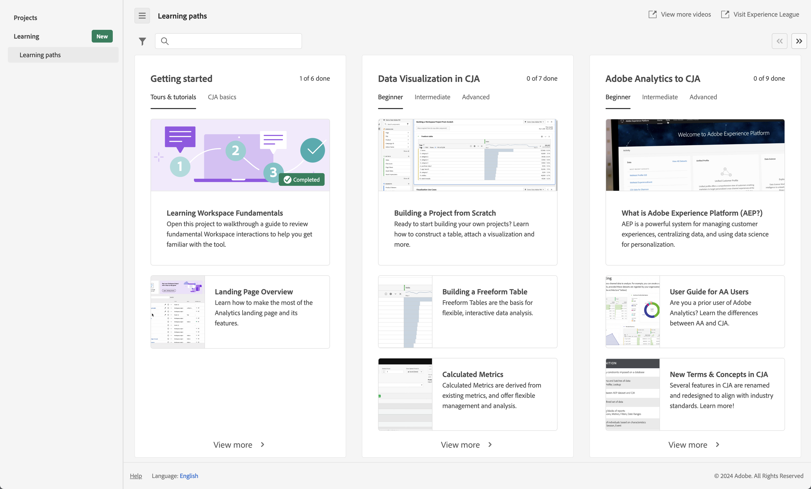

# Customer Journey Analytics 랜딩 페이지

Customer Journey Analytics 랜딩 페이지는 프로젝트 관리자 홈 페이지와 학습 섹션을 강조 표시하여[!DNL Analysis Workspace] 고객 여정 데이터를 보다 효과적으로 관리할 수 있습니다.

>[!BEGINSHADEBOX]

데모 비디오를 보려면  [Analysis Workspace의 랜딩 페이지](https://video.tv.adobe.com/v/346466/?quality=12&learn=on&captions=kor){target="_blank"}를 확인하십시오.

{{videoaa}}

>[!ENDSHADEBOX]

Customer Journey Analytics 랜딩 페이지는 ‘프로젝트’ 및 ‘학습’ 하위 탭으로 구성됩니다.

**[!UICONTROL 프로젝트]**&#x200B;는 사용자가 빌드했거나 다른 사람이 빌드하고 사용자와 공유했던 데이터 구성 요소, 테이블 및 시각화를 결합하는 사용자 정의된 디자인입니다. [!UICONTROL 프로젝트]는 빈 프로젝트 및 빈 모바일 스코어카드를 의미하기도 합니다.

**[!UICONTROL 학습]** 탭에는 실습형 비디오 둘러보기, 튜토리얼 및 설명서 링크가 포함되어 있습니다.

>[!BEGINTABS]

>[!TAB 프로젝트]

>[!TAB 학습]

>[!ENDTABS]

## 프로젝트

[!UICONTROL 프로젝트]는 [!UICONTROL Workspace] 홈 페이지 역할을 합니다. **[!UICONTROL 프로젝트]** 탭에는 회사 폴더, 사용자가 만든 모든 개인 폴더, 프로젝트 및 모바일 스코어카드가 표시됩니다. 이 페이지를 사용하여 폴더, 프로젝트 및 모바일 스코어카드를 보고, 만들고, 수정합니다. 자세한 내용은 [프로젝트](/help/analysis-workspace/build-workspace-project/freeform-overview.md)를 참조하십시오.

**[!UICONTROL 프로젝트]**&#x200B;는 사용자가 빌드했거나 다른 사람이 빌드하고 사용자와 공유했던 데이터 구성 요소, 테이블 및 시각화를 결합하는 사용자 정의된 디자인입니다. [!UICONTROL 프로젝트]는 빈 프로젝트 및 빈 모바일 스코어카드를 의미하기도 합니다.

>[!NOTE]
>
>다음 설정 중 일부는 세션 중과 세션 간에 유지됩니다. 예를 들어 선택한 탭, 선택한 세그먼트, 선택한 열 및 열 정렬 방향이 있습니다. 검색 결과는 유지되지 않습니다.

자세한 내용은 [프로젝트](/help/analysis-workspace/build-workspace-project/freeform-overview.md)를 참조하십시오.

<!--

### Customize table columns

To customize column widths, drag the vertical bar that separates each column. 

To add or remove columns from the list of projects, click the column icon ( ) in the top-right, then select or deselect column titles. 

The available columns are:

| Column name | Description | 
|---------|----------|
| [!UICONTROL **Name**] | Identifies the name of the project. |
| [!UICONTROL **Type**] | Indicates whether this type is a Workspace project, a Mobile scorecard, or a folder. |
| [!UICONTROL **Tags**] | Tags projects to organize them into groups. | 
| [!UICONTROL **Scheduled**] | Set to [!UICONTROL On] when a project is scheduled or [!UICONTROL Off] when it is not. Clicking the [!UICONTROL On] link lets you see information about the scheduled project. You can also [edit the project schedule](/help/analysis-workspace/export/t-schedule-report.md) if you are the project owner. |
| [!UICONTROL **Project role**] | Identifies the project roles: whether you are the project Owner and whether you have permissions to Edit or Duplicate the project. |
| [!UICONTROL **Report suite**] | Identifies the Report Suites that are associated with the project. Tables and visualizations within a panel derive data from the report suite selected in the top right of the panel. The report suite also determines what components are available in the left rail. Within a project, you can use one or many report suites depending on your analysis use cases. The list of report suites is sorted on relevance. Adobe defines relevance based on how recently and frequently the suite has been used by the current user, and how frequently the suite is used within the organization. |
| [!UICONTROL **Owner**] | Identifies the person who created the project. |
| [!UICONTROL **Shared With**] | Shows who the project is currently shared with. |
| [!UICONTROL **Last Modified**] | The date and time when the project was last modified. |
| [!UICONTROL **Last Opened**] | Identifies the date that a project was last opened by the user who is currently viewing the Projects page. |
| [!UICONTROL **Last Used**] | Helps determine whether a project is valuable to users in your organization by showing the date and time when the project was last opened by any user within the organization.
Consider the following when viewing this column:
<ul><li>Usage information is available starting in September 2023.</li><li>This column is available only to system administrators.</li></ul> |
| [!UICONTROL **Project ID**] | Can be used for debugging projects. |
| [!UICONTROL **Longest Date Range**] | Longer date ranges increase project complexity and may increase processing and load times. |
| [!UICONTROL **Number of queries**] | The total number of requests made to Analytics when the project loads. A higher number of project queries increases project complexity and may increase processing and load times. This data is available only after a project has loaded or a scheduled project was sent. |
| [!UICONTROL **Location**] | Shows the folder where the project is located. |

### Other UI elements on the Projects page

| UI element | Definition |
| --- | --- |
| Edit preferences | Lets you [!UICONTROL View Tutorials], and [Edit user preferences](/help/analysis-workspace/user-preferences.md). |
| [!UICONTROL Create new] | Opens the project modal where you can create a Workspace project or a Mobile scorecard or open a company template.  |
| [!UICONTROL Show less  Show more] | Toggles between not showing and showing the banner:  |
| [!UICONTROL Workspace project] | Creates a blank [Workspace project](/help/analysis-workspace/home.md) for you to  design and build. |
| [!UICONTROL Mobile scorecard] | Creates a blank [mobile scorecard](https://experienceleague.adobe.com/docs/analytics/analyze/mobapp/curator.html?lang=ko) for you to design and build. |
| [!UICONTROL Open Training Tutorial] | Opens the Workspace training tutorial that guides you through the process of building a new starter project in a step-by-step tutorial.|
| [!UICONTROL Open release notes] | Opens the Adobe Analytics section of the latest Adobe Experience Cloud release notes. |
| Filter icon | Filters by tags, report suites, owners, types, and other filters (Mine, Shared with me, Favorites, and Approved)  |
| Search bar | Searches all columns in the table. |
| Selection box | Selects one or more projects to display the project management actions you can perform: **Delete**, **Share**, **Rename**, **Copy**, **Unpin**, **Move Up**, **Move Down**, **Tag**, **Approve**, **Export CSV**, and **Move to**. You may not have permissions to perform all listed actions. |
| [!UICONTROL Favorites] | Adds a star next to a favorite project or folder that can be used as a filter. |
| [!UICONTROL Name] | Identifies the name of the project. |
| Pin icon | Pins items so they always appear at the top of your list but you can re-adjust the order by moving them up or down in the order. Use the ellipsis option menu and select **Move Up** or **Move down** in the list. |
| Info (i) icon | Displays the following information about a project: Type, Project Role, Owner, Description, and who it is shared with. It also indicates who can [edit or duplicate](/help/analysis-workspace/curate-share/share-projects.md) this project. |
| Ellipsis (...) | Displays the project management actions you can perform: **Delete**, **Share**, **Rename**, **Copy**, **Unpin**, **Move Up**, **Move Down**, **Tag**, **Approve**, **Export CSV**, and **Move to**. You may not have permissions to perform all listed actions. |
| SHOW: Folders & Projects or All Projects | Changes the view setting on the table to show folders and projects according to your folder organization **or** show all of your projects in an unorganized list. |
| < (Back button) | Returns you to your most recent landing page configuration in a Workspace project or a report. The page configuration you had when you left the landing page will persist when you return. |

-->

## 학습

학습 페이지에는 실습형 비디오 둘러보기, 튜토리얼 및 설명서 링크가 포함되어 있습니다.

Customer Journey Analytics의 학습 페이지를 사용하여 다음과 같은 내용을 학습합니다.

* Customer Journey Analytics의 초급, 중급 또는 고급 기능 및 사용 사례
* Adobe Analytics에서 Customer Journey Analytics로 보다 원활하게 전환하는 방법

학습 콘텐츠에 접근하는 방법:

* Customer Journey Analytics의 상단 메뉴에서 [!UICONTROL **Workspace**]&#x200B;을 선택한 다음 왼쪽 패널에서 [!UICONTROL **학습**]&#x200B;을 선택합니다.

### 기능

학습 페이지는 다음 기능을 제공합니다.

* **콘텐츠 필터링**: 를 사용하여 **[!UICONTROL 유형]**(**[!UICONTROL 문서]**, **[!UICONTROL 비디오]**&#x200B;와 **[!UICONTROL 둘러보기 및 튜토리얼]**)과 **[!UICONTROL 경험 수준]**(**[!UICONTROL 초보]**, **[!UICONTROL 중급]** 또는 **[!UICONTROL 고급]**)에 따라 학습 콘텐츠를 필터링합니다.
* **진행 상황 추적**: 콘텐츠 일부를 선택하면  **[!UICONTROL 조회함]** 태그가 표시됩니다. 이 태그는 학습 콘텐츠 진행 상황을 추적하는 데 도움이 됩니다.  **[!UICONTROL 조회함]** 태그를 선택하여 콘텐츠 일부에서 제거할 수 있습니다.
* **추가 콘텐츠 보기:** 비디오를 시청하는 동안 **[!UICONTROL 자세히 알아보기]**&#x200B;를 선택하여 Experience League에 대한 관련 설명서 콘텐츠를 볼 수 있습니다. 아니면 학습 페이지에서 다음 옵션 중 하나를 선택하여 추가 콘텐츠를 봅니다.
   * **[!UICONTROL YouTube 방문]:** 전체 Analysis Workspace YouTube 재생 목록을 봅니다.
   * [!UICONTROL **Experience League 방문**]: Experience League의 전체 Customer Journey Analytics 설명서 세트를 봅니다.
* **신규 사용자를 위한 기본 사항:** [!UICONTROL Workspace 기본 사항 학습] 둘러보기는 신규 사용자에게 권장되는 사항입니다. 이 둘러보기는 작업 영역으로 바로 이동하여 가장 일반적인 작업을 안내합니다. 이 둘러보기는 [자유 형식 패널](/help/analysis-workspace/c-panels/freeform-panel.md) 또는 [빈 패널](/help/analysis-workspace/c-panels/blank-panel.md) 헤더의 도구 설명을 통해 Workspace에서 다시 실행할 수도 있습니다.

## 선호하는 랜딩 페이지

선호하는 랜딩 페이지를 설정할 수 있습니다. 자세한 내용은 [사용자 환경 설정](/help/analysis-workspace/user-preferences.md#general-preferences)을 참조하십시오.

<!--
## Landing page FAQ {#landing-faq}

| Question | Answer |
| --- | --- |
| Does the work I do in the beta program UI carry over to the production [!UICONTROL Workspace] experience? | Yes, any work done in the beta carries over to the old/current [!UICONTROL Workspace] experience. |
| Is there a maximum number of projects I can pin? | No, there is no limit on the number of projects you can pin. |
| Can admins designate this landing page for their users? | No, admins cannot designate the landing page on behalf of users. Individual users must turn on the toggle themselves. |
| Are all reports that currently exist in [!DNL Reports & Analytics] still available? | No, the following reports were phased out, based on overall usage data: <ul><li>Any custom eVars/props/events/classifications<li>My Recommended Reports</li><li>Hourly/Daily/Weekly/Monthly/Quarterly/Yearly unique visitors</li><li>DailyWeekly/Monthly/Quarterly/Yearly unique customers</li><li>Action name depth</li><li>Action name summary</li><li>Add dashboard</li><li>Age</li><li>Audio support</li><li>Billing information</li><li>Clicks to page</li><li>Color depth</li><li>Cookie support</li><li>Cookies</li><li>Connection types</li><li>Creative elements</li><li>Credit card type</li><li>Cross sell</li><li>Custom event funnels</li><li>Custom links</li><li>Customer ID</li><li>Day of week</li><li>Entry action name</li><li>Exit action name</li><li>Exit links</li><li>Fallout</li><li>File downloads</li><li>Find in store</li><li>Full paths</li><li>Gender</li><li>Hit ype VISTA rule</li><li>Image support</li><li>Java</li><li>JavaScript</li><li>JavaScript version</li><li>Manage bookmarks</li><li>Manage dashboards</li><li>Monitor color depth</li><li>Monitor resolutions</li><li>Newsletter signups</li><li>Next action name</li><li>Next action name flow</li><li>Null searches</li><li>Operating system</li><li>Order review</li><li>Page of day</li><li>Pages not found</li><li>Pathfinder</li><li>Path length</li><li>Previous action name</li><li>Previous action name flow</li><li>Product activity</li><li>Product cost</li><li>Product department</li><li>Product inventory category</li><li>Product name</li><li>Product reviews</li><li>Product season</li><li>Product shares</li><li>Product zooms</li><li>Reload</li><li>Searches</li><li>Servers</li><li>Single page visits</li><li>Shipping information</li><li>Site hierarchy</li><li>Social mentions</li><li>Time of day</li><li>Time spent on action name</li><li>Video support</li><li>Visitor state</li></ul> | 
-->
