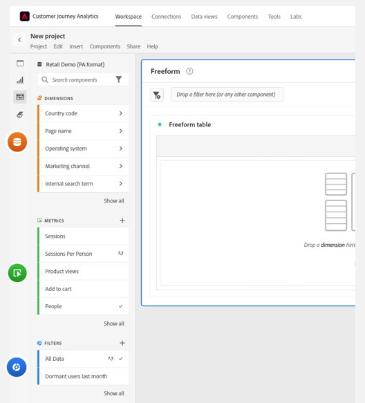
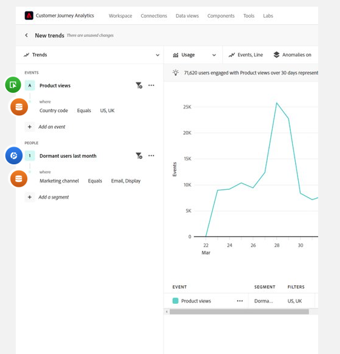

# 안내식 분석 FAQ

{{release-limited-testing}}

가이드 분석에 대한 FAQ.

+++**가이드 분석을 모든 사용자가 사용할 수 있습니까?**

아니요. 안내식 분석은 Customer Journey Analytics에 대한 유료 추가 기능입니다. 이 추가 기능을 사용하려면 Adobe 계정 팀에 문의하십시오.

+++

+++**안내식 분석을 사용하기 위해 어떤 구현 변경이 필요합니까?**

이미 Customer Journey Analytics에서 Analysis Workspace을 사용 중인 경우 추가적인 구현 변경 사항이 필요하지 않습니다. 안내식 분석에서는 Analysis Workspace과 동일한 데이터 보기 및 연결을 사용합니다. 모든 프로젝트 유형을 온보딩하고 사용하는 프로세스는 안내식 분석을 포함하여 모든 Customer Journey Analytics에 대해 동일합니다.

+++

+++**안내식 분석의 내부와 외부에서 용어는 어떻게 서로 관련이 있습니까?**

안내식 분석은 제품 분석 산업에서 더 자주 사용되는 용어를 사용합니다. 안내식 분석과 Analysis Workspace 간을 전환할 때 이 표를 참조할 수 있습니다.

| 안내식 분석 용어 | Analysis Workspace 용어 |
| --- | --- |
| 이벤트 | 지표 |
| 속성 | 차원 |
| 값 | 차원 항목 |
| 세그먼트 | 필터 |

{style="table-layout:auto"}

+++

+++**Analysis Workspace 및 안내식 분석 접근 방식이 보고하는 방식에 대한 차이점은 무엇입니까?**

Analysis Workspace 및 Guided Analysis는 동일한 기본 데이터를 사용하지만 각 도구가 해당 데이터를 쿼리하는 방식은 다릅니다.

**Analysis Workspace은 차원 중심 경험입니다.** 표는 일반적으로 차원 항목 행으로 구성되고, 열은 일반적으로 지표입니다. 다음 중 하나에 필터를 적용하여 원하는 데이터를 얻을 수 있습니다.

**안내식 분석은 이벤트 중심의 경험입니다.** 시각화는 차원 및 필터를 사용하여 해당 데이터를 보완하는 이벤트에 중점을 둡니다.

웹 사이트의 홈 페이지 관련 데이터에 중점을 두는 다음 예를 생각해 보십시오. 팀은 유사한 질문을 하지만 분석 접근 방식이 다를 수 있습니다.

* 일반적인 차원 중심 Analysis Workspace 접근 방식은 &quot;홈 페이지가 수신된 페이지 조회수가 몇 개입니까?&quot;입니다.

  

* 일반적인 이벤트 중심 분석 접근 방식은 &quot;홈 페이지를 본 사용자가 몇 명입니까?&quot;입니다.

  

이러한 명령문은 이벤트 관리 전략에 따라 동일한 보고서를 얻기 위한 두 가지 다른 방법을 보여 줍니다.

+++
