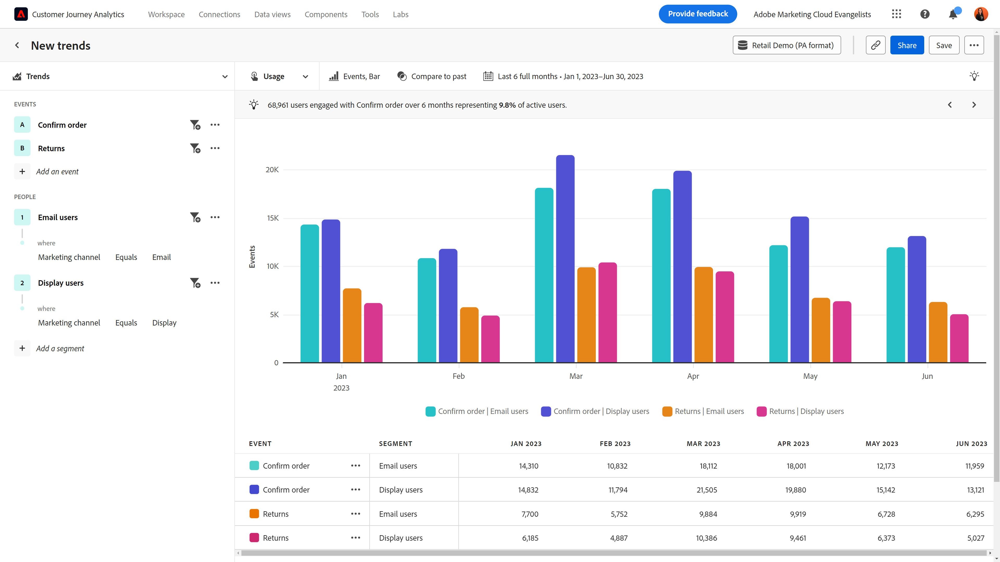
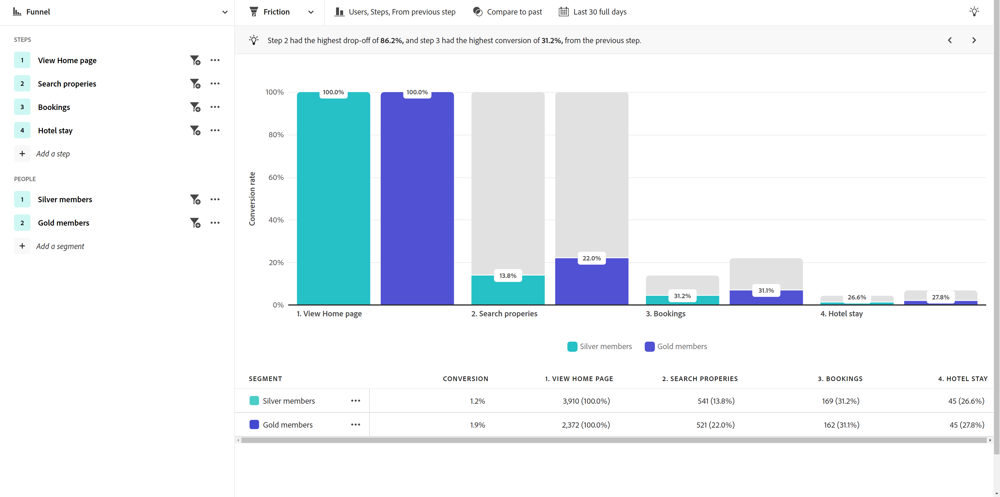

# 업계 사용 사례

이 페이지에서는 분석가부터 제품 팀, 마케터에 이르기까지 고객 경험 팀이 안내식 분석을 통해 달성할 수 있는 몇 가지 실례가 되는 업계 사례를 제공합니다.

+++**소매**

| 사용 사례 | 예 | 영향 | 분석 |
| --- | --- | --- | --- |
| **모바일 쇼핑 앱 최적화** | 많은 고객이 조직의 모바일 앱을 다운로드했지만 다시 돌아오지 않았습니다. 회사는 고객이 초기 오퍼에만 이를 사용한다는 사실을 발견했습니다. 회사는 휴면 고객의 재참여를 유도했습니다. | **모바일 사용자의 LTV를 높입니다.** 보다 ‘행복한 경로’ 사용자 경험을 개발하기 위해 앱 사용 현황을 측정하고 늘립니다. | [활성 사용자 성장 보기](types/active.md) [순성장 보기](types/net-growth.md) |
| **새로운 결제 기능의 영향 정량화** | 식료품 매장에서 온라인 쇼핑을 테스트합니다. 매장은 제품 추천이나 도로변 픽업과 같은 새로운 결제 기능의 영향을 신속하게 측정합니다. | **전환율을 높입니다.** 단순한 기능 사용이 아닌 비즈니스 영향을 측정합니다. | [릴리스 영향 보기](types/release.md) [첫 사용 보기](types/first-use.md) |
| **멤버십 이탈 감소** | 조직이 고객 여정에서 고객 이탈을 유발하는 마찰 지점을 찾아냅니다. 이를 통해 멤버십 프로그램을 검토하고 위험에 처한 멤버의 행동을 분석할 수 있습니다. | **이탈을 감소시킵니다.** 마찰을 방지하고 이탈을 줄이기 위해 클라이언트 관계를 증진하고 육성하는 방법을 식별합니다. | [활성 사용자 성장 보기](types/active.md) [마찰 보기](types/friction.md) |
| **비효율적인 영업 여정 찾기** | 조직이 매장 내 영업 직원의 여정에서 고객과 멀어지는 지점에 해당하는 비효율성을 발견합니다. 조직은 프로세스를 조정하여 고객에게 더욱 즐거운 매장 내 쇼핑 경험을 제공합니다. | **영업 반응을 향상시킵니다.** 비효율적인 프로세스를 줄여 내부 여정을 개선하고 긍정적인 고객 경험을 제공합니다. | [마찰 보기](types/friction.md) |

{style="table-layout:auto"}

{style="border:1px solid gray"}

{style="border:1px solid gray"}

+++

+++**금융 서비스**

| 사용 사례 | 예 | 영향 | 분석 |
| --- | --- | --- | --- |
| **새로운 기능의 영향 정량화** | 금융 기관에서 Zelle을 통한 은행 송금을 시작하고, 이 새로운 기능이 송금 완료에 미치는 영향을 파악하고자 합니다. 기관은 안내식 분석을 통해 고객이 어떻게 반응하는지 확인할 수 있으며, 덕분에 마케팅 팀이 해당 기능을 출시할 수 있습니다. | **전환율을 높입니다.** 새로운 기능이 송금 전환에 미치는 영향을 측정합니다. | [릴리스 영향 보기](types/release.md) [첫 사용 보기](types/first-use.md) |
| **콜센터 통화 억제** | 안내식 분석에 따르면 조직의 5단계 모바일 청구 프로세스로 인해 콜센터 통화가 많이 발생하는 것으로 나타났습니다. 조직은 대상자를 만들고, 해당 고객의 경험을 더 효과적으로 이해하기 위해 이들에게 이메일을 보냅니다. | **경험에서 마찰을 분리합니다.** “행복한 경로” 여정을 개선하고 통화를 줄입니다. | [마찰 보기](types/friction.md) [전환 추세 보기](types/conversion-trends.md) |
| **고객 이탈 감소** | 조직에서 월별 빈도로 뱅킹 모바일 앱에 로그인하는 고객이 더 오랫동안 고객으로 남아 있는다는 사실을 알게 됩니다. 조직은 안내식 분석을 통해 이탈 위험이 있는 사용자를 식별하고 재유치 전략을 세울 수 있습니다. | **이탈을 감소시킵니다.** 고객 수준을 유지하는 동시에 실제 신규 고객 확보를 위해 지출합니다. | [활성 사용자 성장 보기](types/active.md) [순성장 보기](types/net-growth.md) |
| **새로운 기능 추천** | 조직에서 최근 몇 개월 동안 디지털 인출이 감소했다는 사실을 확인했습니다. 재무 상담사에게 걸려 오는 전화 건수가 늘어났습니다. 안내식 분석은 조직이 운영 위원회를 통해 디지털 프로세스 최적화의 우선순위를 정하는 데 도움이 됩니다. | **데이터 기반 로드맵을 만듭니다.** 데이터를 사용하여 최적화를 계획하고 구현합니다. | [사용 추세 보기](types/usage.md) |

{style="table-layout:auto"}

{style="border:1px solid gray"}

{style="border:1px solid gray"}

{style="border:1px solid gray"}

+++

+++**여행 및 접대**

| 사용 사례 | 예 | 영향 | 분석 |
| --- | --- | --- | --- |
| **새로운 예약 흐름 기능의 영향 정량화** | 조직에서 안내식 분석을 사용하여 새로운 예약 단계 기능이 전환율에 미치는 영향을 빠르게 확인합니다. 조직은 경험에서 가장 큰 이득을 얻은 부분을 식별합니다. | **예약률을 높입니다.** 단순한 기능 사용이 아닌 비즈니스 영향을 측정합니다. | [릴리스 영향 보기](types/release.md) [마찰 보기](types/friction.md) |
| **모바일 앱 경험 최적화** | 조직에서 시간 경과에 따른 월별 활성 앱 사용자를 빠르고 쉽게 파악하고, 버전별로 긍정적인 영향을 식별합니다. | **MAU를 늘립니다.** 고객 만족도와 상관관계가 있는 앱 사용 현황을 측정하고 늘립니다. | [활성 사용자 성장 보기](types/active.md) [순성장 보기](types/net-growth.md) |
| **모바일 체크인 흐름에서 문제점 찾기** | 예상되는 모바일 체크인 프로세스 중 어느 지점에서 사용자가 성공하는지 또는 이탈하는지 확인하면 조직이 경험 최적화가 필요한 영역을 쉽게 식별할 수 있습니다. | **CSAT를 높이고 IROP를 줄입니다.** 마찰을 제거하면 보다 원활한 “여행 당일” 경험이 실현됩니다. | [마찰 보기](types/friction.md) [전환 추세 보기](types/conversion-trends.md) |
| **콜센터 통화 억제** | 단계 보기에서 사용자 경험을 보면 방문객이 마찰에 부딪히는 바람에 비용이 많이 드는 콜센터 전화량이 발생하는 부분이 사용자에게 표시됩니다. 집중해야 할 다음 단계는 분명합니다. | **콜센터 사용량을 줄입니다.** 더 많은 ‘행복한 경로’ 사용자 경험을 창출하고 비용이 많이 드는 통화를 줄입니다. | [마찰 보기](types/friction.md) [전환 추세 보기](types/conversion-trends.md) |

{style="table-layout:auto"}

{style="border:1px solid gray"}

{style="border:1px solid gray"}

{style="border:1px solid gray"}

+++

+++**미디어 및 엔터테인먼트**

| 사용 사례 | 예 | 영향 | 분석 |
| --- | --- | --- | --- |
| **새로운 프로그램이나 시리즈의 영향 정량화** | 스트리밍 서비스에서 사용자가 새로운 프로그램이나 시리즈를 시청한 후 시청률에 미치는 영향을 분석하고 어떤 콘텐츠가 공감을 불러일으키는지 더 효과적으로 이해할 수 있습니다. | **시청률을 높입니다.** 시청률에 가장 큰 영향을 미치는 콘텐츠를 찾습니다. | [첫 사용 보기](types/first-use.md) |
| **이탈 위험 식별** | 조직에서 계절별 이벤트를 시청하기 위해 플랫폼에 가입하고 이벤트가 끝난 후 즉시 취소하는 고객의 회전율이 높다는 것을 확인합니다. 이러한 사용자를 신속하게 식별하면 고객이 플랫폼에 계속 참여하도록 유도하는 추천 사항을 표시할 수 있습니다. | **만족 구독자를 유지합니다.** 추천 사항을 통해 개입할 수 있도록 성장 세그먼트에 기여하는 콘텐츠를 찾습니다. | [활성 사용자 성장 보기](types/active.md) [순성장 보기](types/net-growth.md) |
| **업셀 기회 찾기** | 조직의 수익 성장에서 중요한 부분은 팬들이 경기장에 있는 동안 어떤 인앱 오퍼가 팬들에게 가장 매력적인지 파악하는 것입니다. 조직은 안내식 분석을 통해 어떤 오퍼가 가장 효과적인지 정확히 확인할 수 있습니다. | **부수익을 늘립니다.** 인앱 오퍼가 구매 행동을 유도하는 데 미치는 영향을 파악합니다. | [첫 사용 보기](types/first-use.md) [마찰 보기](types/friction.md) |
| **교차 디바이스 경험 최적화** | 조직에서 구독자가 여러 디바이스/앱과 상호 작용하는 방식을 분석하고자 합니다. 이러한 지식을 통해 조직은 콘텐츠 소비 패턴을 이해하고, 어디에 리타겟팅하는 것이 가장 좋은지 판단할 수 있습니다. | **경험을 개인화합니다.** 각 디바이스에서 구독자에게 가장 큰 공감을 불러일으키는 콘텐츠가 무엇인지 파악합니다. | [사용 추세 보기](types/usage.md) |
| **콜센터 통화 억제** | 조직에서 안내식 분석을 사용하여 자동 결제가 작동하지 않는 문제를 식별합니다. 이 문제로 인해 고객이 짜증을 느끼고 지원 센터에 전화하여 플랜을 취소하는 상황이 발생했습니다. | **지원 통화를 줄입니다.** 더 나은 고객 경험을 창출하고 고객 서비스 측과의 통화를 줄입니다. | [마찰 보기](types/friction.md) [전환 추세 보기](types/conversion-trends.md) |

{style="table-layout:auto"}

{style="border:1px solid gray"}

{style="border:1px solid gray"}

{style="border:1px solid gray"}

+++

+++**헬스 케어**

| 사용 사례 | 예 | 영향 | 분석 |
| --- | --- | --- | --- |
| **환자 건강 결과 개선** | 조직이 성장에 노력을 집중할 수 있는 데이터를 보유하고 있습니다. 안내식 분석을 사용하기 전에는 주당 얼마나 많은 웰니스 플랜 멤버가 사용을 완전히 중단했는지 명확하게 파악하지 못했습니다. | **의사 방문을 줄입니다.** 재참여를 위해 휴면 사용자를 신속하게 식별합니다. | [활성 사용자 성장 보기](types/active.md) |
| **환자 경험 향상** | 간단한 암호 재설정을 위해 얼마나 많은 환자가 콜센터에 연락하는지에 대한 가시성이 확보되면서 환자 경험 강화에 초점을 맞추고자 하는 분석가의 열정이 다시금 높아졌습니다. | **전반적인 서비스 비용을 줄입니다.** 더 나은 환자 경험을 제공하고 환자 서비스 측과의 통화를 줄입니다. | [사용 추세 보기](types/usage.md) [마찰 보기](types/friction.md) |
| **세그먼트별로 반복되는 교차 채널 작업 식별** | 조직에서 Medicare 적격 멤버가 플랜을 얼마나 적극적으로 사용하고 있는지 파악하여 디지털 제품에서 특정 메시지를 제공하려고 합니다. 안내식 분석을 통해 얻은 인사이트는 마케팅의 효과를 높이는 데 도움이 됩니다. | **Medicare 등록 선택안을 개인화합니다.** 가장 활동적인 플랜 멤버의 일반 순차 동작을 비교합니다. | [마찰 보기](types/friction.md) [활성 사용자 성장 보기](types/active.md) |
| **업계 최고의 인재 유지** | 조직의 분석 리소스에 시간이 부족합니다. 안내식 분석을 통해 조직은 경영진 업데이트 통화에 필요한 제품 사용 데이터를 신속하게 확보할 수 있습니다. | **분석가의 작업량을 줄입니다.** 더 빠르게 답변을 얻습니다. 보고가 가장 중요한 순간에 보고를 활용하기 쉽습니다. | [안내식 분석](overview.md) |

{style="table-layout:auto"}

{style="border:1px solid gray"}

+++

+++**하이 테크 및 B2B**

| 사용 사례 | 예 | 영향 | 분석 |
| --- | --- | --- | --- |
| **새로운 기능의 영향 정량화** | 조직에서 새로운 제품 기능의 사용량 증가를 분석하고 어떤 세그먼트가 가장 효과적인지 판단할 수 있습니다. 이 분석은 사용자 참여를 극대화하고 마케팅 부서와의 파트너십을 강화하기 위해 리소스를 어디에 사용할지 우선순위를 정하는 데 도움이 됩니다. | **데이터에 기반하여 우선순위를 지정합니다.** 리소스 할당에 관해 정보에 입각한 결정을 내립니다. | [릴리스 영향 보기](types/release.md) [첫 사용 보기](types/first-use.md) |
| **제품을 충분히 활용하지 못하는 역할 식별** | 조직에서 엔지니어, 제품 관리자 및 마케팅 부서가 사용할 제품을 설계합니다. 안내식 분석에 따르면 제품 관리자와 마케팅 담당자는 거의 매일 이 기능을 사용하지만 엔지니어링 직원은 대부분 채택하지 않는 것으로 나타났습니다. | **제품 채택률을 높입니다.** 다양한 방법으로 사용자 행동을 빠르게 식별합니다. | [활성 사용자 성장 보기](types/active.md) [순성장 보기](types/net-growth.md) |
| **전환 프로세스에서 마찰 지점 제거** | 구매 흐름에서 구매 주문 번호를 요구하면 신용카드를 선호하는 사용자가 주문을 완료할 수 없습니다. 해당 필드가 선택 사항으로 지정되면 전환율이 증가했습니다. | **고객 경험을 개선합니다.** 잠재적인 이탈을 줄입니다. | [마찰 보기](types/friction.md) [전환 추세 보기](types/conversion-trends.md) |
| **셀프서비스 분석 활용 시작** | 인사이트에 액세스하는 것은 어려운 일이며, 조직 내 일부 사용자는 분석 교육을 받지 않은 상태입니다. 안내식 분석을 통해 조직은 답을 얻고 조직의 나머지 부분에서 사용하는 것과 동일한 데이터를 활용하여, 더 강력한 파트너십을 구축하고 진정한 데이터 기반 의사 결정을 내릴 수 있습니다. | **조직 전반에 걸쳐 긴밀한 파트너십을 구축합니다.** 제품 관리자가 이전에 격리되었던 데이터에 액세스할 수 있도록 합니다. | [안내식 분석](overview.md) |

{style="table-layout:auto"}

{style="border:1px solid gray"}

+++
