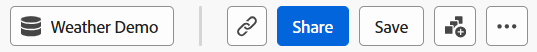

# 가이드 분석 개요

안내식 Customer Journey Analytics을 통해 마케팅, 제품, 분석가에 이르기까지 사용자는 마케팅 채널의 크로스 채널 데이터를 기반으로 구축된 안내식 워크플로우를 통해 고품질 데이터와 고객 여정에 대한 통찰력을 자체 제공할 수 있습니다. Analysis Workspace 및 모바일 스코어카드와 유사하게 가이드 분석은 [데이터 보기](/help/data-views/data-views.md)의 데이터를 사용하며, 데이터 보기에서는 [연결](../connections/overview.md)을 통해 Adobe Experience Platform의 데이터를 참조합니다. 가이드 분석에서 만든 대다수의 보고서는 추가 연구를 위해 Analysis Workspace로 원활하게 전송할 수 있습니다.

다음 안내식 분석을 사용할 수 있습니다.

| 아이콘 | 분석 | 설명 |
| :----:|--- | --- |
|  | [활성 증가](types/active-growth.md) | 신규, 유지, 복귀 또는 휴면 상태를 식별합니다. |
|  | [전환 추세](types/conversion-trends.md) | 시간 경과에 따른 전환율 변화를 추적합니다. |
|  | [참여](types/engagement.md) | 기능 참여의 폭과 깊이를 이해합니다. |
|  | [첫 번째 사용 영향](types/first-use-impact.md) | 주요 지표에 대한 최초 기능 사용의 영향을 측정합니다. |
|  | [빈도](types/frequency.md) | 사용 빈도로 참여도를 측정합니다. |
|  | [단계](types/funnel.md) | 단계 간 전환율을 비교합니다. |
|  | [순성장](types/net-growth.md) | 사용자가 증가하고 있습니까, 감소하고 있습니까? |
|  | [릴리스 영향](types/release-impact.md) | 릴리스 전후 동일한 기간 동안의 성능을 비교합니다. |
|  | [유지](types/retention.md) | 사용자의 지속적인 재방문 습관을 측정합니다. |
|  | [타임라인](types/timeline.md) | 세션 활동에서의 패턴을 탐색합니다. |
|  | [트렌드](types/trends.md) | 시간 경과에 따른 사용자 참여를 측정합니다. |

## 액세스

Customer Journey Analytics 홈 페이지에서 가이드 분석에 액세스할 수 있습니다.

1. 홈 페이지에서 **[!UICONTROL 가이드 분석]**&#x200B;을 선택하면 [사용 현황 추세 보기](types/trends.md)로 바로 이동합니다.

   {style="border:1px solid gray"}

1. **[!UICONTROL 새로 만들기]**&#x200B;를 선택하여 다양한 보기 옵션을 확인하고 분석을 위한 다양한 시작점을 선택할 수 있습니다.

   {style="border:1px solid gray"}

Analysis Workspace 프로젝트 내에서 가이드 분석에 액세스할 수도 있습니다.

1. 홈 페이지에서 **[!UICONTROL 빈 프로젝트]**&#x200B;를 선택하여 빈 Workspace 프로젝트를 만듭니다.

   {style="border:1px solid gray"}

1. 왼쪽 레일에서  **[!UICONTROL 가이드 분석]**&#x200B;을 선택합니다.

   {style="border:1px solid gray"}

1. 새 분석을 Workspace 캔버스로 드래그한 다음 **[!UICONTROL 만들기]**&#x200B;를 선택하여 원하는 분석을 생성합니다(예: **[!UICONTROL 트렌드 만들기]**). **[!UICONTROL 저장됨]** 섹션 아래에서 기존 분석을 Workspace 캔버스로 드래그할 수도 있습니다.

   

## 인터페이스

가이드 분석을 위한 인터페이스는 질문과 답변 형식을 따릅니다. 쿼리 레일에서 질문을 작성하면 글로 작성된 인사이트, 차트 및 표를 통해 답변을 얻을 수 있습니다. 그런 다음 보기 유형 및 시각화 설정으로 다음 질문을 할 수 있습니다.

가이드 분석에서는 다음 UI 요소를 사용합니다.

| 인터페이스 미리보기 | UI 요소 | 설명 |
| --- | --- | --- |
| {style="border:1px solid gray"} | 쿼리 레일 | 분석을 구성할 원하는 구성 요소(이벤트, 속성 및 세그먼트)를 선택하여 “질문”을 구성합니다. 다음 옵션은 모든 보기 유형에서 사용할 수 있으며, 추가 설정은 보기별로 사용할 수 있습니다. <ul><li>**분석 선택기**: 새 분석 유형으로 전환할 수 있는 드롭다운입니다. 쿼리 선택 내용은 새 분석 유형에 허용되는 제한 내에서 유지됩니다.</li><li>**이벤트**: 측정하려는 이벤트입니다. 각 보기 유형은 구성할 수 있는 이벤트 수에 대해 서로 다른 제한을 적용합니다.</li><li>**필터**: 이벤트 또는 세그먼트 섹션의  아이콘을 사용하여 특정 차원별로 범위를 좁힙니다. 차원을 선택하면 표준 필터 기준(예: [!UICONTROL 같음], [!UICONTROL 포함] 또는 [!UICONTROL 다음으로 끝남])과 상위 1000개 차원 값을 모두 사용할 수 있습니다.</li><li>**다음으로 계산됨**: 선택한 이벤트에 적용할 계산 방법입니다.</li><li>**세그먼트**: 측정하려는 세그먼트입니다. 각 보기 유형은 구성할 수 있는 세그먼트 수에 대해 서로 다른 제한을 적용합니다.</li></ul> |
| {style="border:1px solid gray"} | 차트 | 쿼리 레일 및 설정의 입력을 기반으로 반환된 데이터의 시각화입니다. 표시되는 시각화는 차트 위의 보기 및 설정에 따라 달라집니다. 차트에는 다음도 포함됩니다. <ul><li>**도구 설명**: 차트 데이터 포인트를 마우스로 가리키면 추가 정보가 포함된 도구 설명이 표시됩니다.</li><li>**범례**: 차트 범례 시리즈를 마우스로 가리키면 가능한 경우 정의를 보고, 해당 시리즈에 초점을 맞추고, 다른 시리즈를 일시적으로 숨길 수 있습니다. 클릭하면 범례에서 시리즈를 숨깁니다.</li><li>**주석**: 해당되는 [주석](../components/annotations/overview.md)이 시각화와 범례 사이에 표시됩니다. 주석의 구성된 색상이 적용된  아이콘으로 표시됩니다. 시간 경과에 따른 데이터를 표시하는 보기 유형의 경우 구성된 날짜 또는 날짜 범위 아래에  아이콘이 표시됩니다. 시간 경과에 따른 데이터를 표시하지 않는 보기 유형의 경우 차트 오른쪽 하단에  아이콘이 표시됩니다.</li><li>**작업 선택**: 데이터 포인트를 선택하여 사용 가능한 다음 작업을 표시합니다. 옵션으로는 **세그먼트 저장** 등이 있습니다.</li></ul> |
| {style="border:1px solid gray"} | 표 | 쿼리 레일 및 설정의 입력을 기반으로 반환된 데이터의 테이블 표현입니다. 테이블의 열은 차트 위의 보기 유형에 따라 달라집니다. 테이블에는 다음도 포함됩니다. <ul><li>**작업 선택**: 각 행에서  아이콘을 전환하여 차트 계열을 숨기거나 표시합니다. **[!UICONTROL 기타]** 메뉴를 선택하여 추가 작업을 사용할 수 있습니다. 옵션으로는 **세그먼트 저장** 등이 있습니다.</li></ul> |
| {style="border:1px solid gray"} | 시각화 설정 | 차트 위의 옵션으로서 이를 통해 다음 질문을 하고 차트와 테이블이 데이터를 반환하는 방식을 사용자 정의할 수 있습니다. 다음 옵션은 모든 보기 유형에서 사용할 수 있으며, 추가 설정은 보기별로 사용할 수 있습니다. <ul><li>**차트 설정**: 차트와 표에 표시되는 내용을 미세 조정합니다. 사용 가능한 옵션은 선택한 보기에 따라 다릅니다.</li><li>**날짜 범위**: 분석 날짜 범위를 결정할 수 있는 캘린더 선택기입니다. 일별, 주별, 월별 등 트렌드 보기의 간격을 선택할 수도 있습니다.</li><li>**인사이트**: 사용자가 보는 분석에 따른 상황별 인사이트입니다. 이러한 인사이트에는 현재 분석에 대한 관찰 내용이 담겨 있습니다. 제공된 인사이트가 여러 개인 경우 오른쪽에 있는 화살표를 사용하여 볼 수 있습니다. 오른쪽 상단에 있는 전구 아이콘을 사용하여 이 상자의 표시 여부를 토글할 수 있습니다.</li></ul> |
| {style="border:1px solid gray"} | 메뉴 | 가이드 분석의 오른쪽 상단에 있는 명령으로서 분석에 대한 전반적인 동작을 제공합니다.<ul><li>**데이터 보기 선택기**: 분석에 사용되는 데이터 보기를 변경합니다. 데이터 보기를 변경하면 쿼리 레일에서 사용 가능한 구성 요소도 변경됩니다.</li><li>**링크 복사**: 분석의 링크를 클립보드에 복사합니다. 공유하기 전에 저장하라는 메시지가 표시됩니다.</li><li>**공유**: 개별 사용자 또는 그룹과 공유하기 위한 추가 옵션이 포함된 공유 모드를 엽니다. 분석을 다른 사용자와 공유하거나, 링크를 생성하여 모두와 공유할 수 있습니다.</li><li>**저장**: 분석을 저장합니다. 새 분석을 저장하는 경우 이름과 설명을 요청하는 모달 창이 나타납니다.</li><li>**다른 이름으로 저장**: 현재 분석과 별개로 분석을 저장하여 사본을 만듭니다. 새 이름과 설명을 요청하는 모달 창이 나타납니다.</li><li>**Workspace으로 내보내기**: Analysis Workspace에서 현재 안내식 분석 쿼리를 다시 만듭니다. Workspace 프로젝트는 새 탭에서 만들어지므로 가이드 분석에서 작업하는 도중에 중단이 발생하지 않습니다. 이는 분석의 사본이며, 연 후에는 원본 가이드 분석과 동기화된 상태로 유지되지 않습니다. 분석가 팀에 전달하거나 가이드 분석에서 가능한 것보다 더 심층적으로 데이터를 분석하려는 경우 이 명령을 사용합니다.</li><li>**클립보드에 복사**: 차트 그래픽을 클립보드에 복사하여 다른 애플리케이션에 붙여넣습니다. 쿼리 레일과 테이블은 그래픽에 포함되지 않습니다.</li><li>**PNG 다운로드**: 차트 그래픽을 `.png`로 다운로드합니다. 쿼리 레일과 테이블은 그래픽에 포함되지 않습니다.</li><li>**CSV 다운로드**: 테이블 데이터를 `.csv`로 다운로드합니다. 쿼리 레일과 차트는 파일에 포함되지 않습니다.</li></ul> |

{style="table-layout:auto"}

## 프로비저닝

안내식 분석은 다음 방법으로 Customer Journey Analytics 패키지에 포함됩니다.

| 패키지 | 사용 가능한 분석 |
| --- | --- |
| [!UICONTROL Customer Journey Analytics 추가 기능] | 활성 증가, 전환 추세, 빈도, 단계, 순 성장, 유지, 추세 |
| [!UICONTROL Customer Journey Analytics 기초] | 트렌드 |
| [!UICONTROL Customer Journey Analytics 선택] | 기초 뷰 + 활성 증가, 전환 추세, 빈도, 단계, 순 증가, 유지 |
| [!UICONTROL Customer Journey Analytics Prime] | 보기 + 참여, 첫 번째 사용 영향, 릴리스 영향, 타임라인 선택 |
| [!UICONTROL Customer Journey Analytics Ultimate] | Prime 조회수 |

{style="table-layout:auto"}

제품 프로필 관리자는 Adobe Admin Console에서 가이드 분석에 대한 액세스를 추가하거나 제거할 수 있습니다.

1. [Adobe Admin Console](https://adminconsole.adobe.com)에 로그인합니다.
1. 제품 목록에서 **[!UICONTROL Customer Journey Analytics]**&#x200B;를 선택합니다.
1. 편집하려는 권한에 대해 원하는 제품 프로필을 선택합니다.
1. **[!UICONTROL 권한]** 탭을 선택한 다음 [!UICONTROL 보고 도구]에서 **[!UICONTROL 편집]**&#x200B;을 클릭합니다.
1. [!UICONTROL 사용 가능한 권한 항목] 목록에서 **[!UICONTROL 분석 액세스 가이드]** 옆에 있는 을(를) 선택하면 [!UICONTROL 포함된 권한 항목] 목록에 추가됩니다.
1. **[!UICONTROL 저장]**&#x200B;을 선택합니다.

자세한 내용은 [사용자 수준 액세스](/help/technotes/access-control.md#user-level-access)를 참조하십시오.

>[!TIP]
>
>일부 관리자는 Customer Journey Analytics를 처음 사용하는 사용자에 대해 가이드 분석은 활성화하고 Analysis Workspace는 비활성화하는 것을 선호합니다. 해당 사용자가 제품 및 조직 데이터에 익숙해지면 Analysis Workspace에 대한 액세스를 활성화할 수 있습니다.
