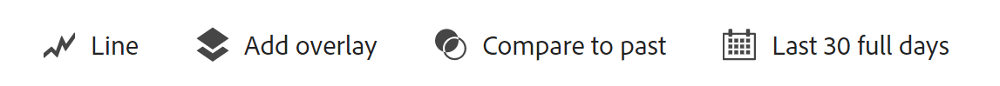

# 안내식 분석 개요

안내식 분석을 이용하면 사용자는 Customer Journey Analytics의 교차 채널 데이터를 기반으로 구축된 안내식 워크플로를 통해 고객 여정에 대한 고품질 데이터와 인사이트를 직접 얻을 수 있습니다. 마케팅부터 제품까지 다양한 부서의 팀이 실시간으로 교류하여 이러한 보고서를 사용하고 이해할 수 있습니다.

>[!NOTE]
>
> 안내식 분석은 현재 Customer Journey Analytics의 유료 추가 기능인 Adobe Product Analytics의 일부로만 사용할 수 있습니다. 조직에서 이 기능 세트를 사용하고자 하는 경우 Adobe 계정 팀에 문의하십시오.

Analysis Workspace 및 모바일 스코어카드와 마찬가지로 가이드된 분석은 [데이터 보기](../data-views/data-views.md): 를 통해 Adobe Experience Platform의 데이터를 참조합니다. [연결](../connections/overview.md). 가이드 분석에서 생성된 많은 보고서는 추가 조사를 위해 Analysis Workspace으로 원활하게 전송할 수 있습니다.

다음 안내식 분석 보기를 사용할 수 있습니다.

| 분석 유형 | 보기 유형 | 설명 |
| --- | --- | --- |
| [!UICONTROL 단계] | [마찰](types/friction.md) | 단계 간 전환율을 비교합니다. |
| [!UICONTROL 단계] | [전환 추세](types/conversion-trends.md) | 시간 경과에 따른 전환율 변화를 추적합니다. |
| [!UICONTROL 영향] | [릴리스](types/release.md) | 릴리스 전후 동일한 기간 동안의 성능을 비교합니다. |
| [!UICONTROL 영향] | [최초 사용](types/first-use.md) | 주요 지표에 대한 최초 기능 사용의 영향을 측정합니다. |
| [!UICONTROL 유지] | [유지율](types/retention-rates.md) | 사용자의 지속적인 재방문 습관을 측정합니다. |
| [!UICONTROL 트렌드] | [사용](types/usage.md) | 시간 경과에 따른 사용자 참여를 측정합니다. |
| [!UICONTROL 트렌드] | [빈도](types/frequency.md) | 사용 빈도로 참여도를 측정합니다. |
| [!UICONTROL 사용자 성장] | [활성](types/active.md) | 신규, 유지, 복귀 또는 휴면 상태를 식별합니다. |
| [!UICONTROL 사용자 성장] | [순성장](types/net-growth.md) | 사용자가 증가하고 있습니까, 감소하고 있습니까? |
| [!UICONTROL 사용자 스트림] | [타임라인](types/timeline.md) | 세션 활동에서의 패턴을 탐색합니다. |

{style="table-layout:auto"}

## 액세스

조직이 안내식 분석을 위해 프로비저닝된 경우 Customer Journey Analytics 홈 페이지에서 액세스할 수 있습니다.

1. 홈 페이지에서 **[!UICONTROL 안내식 분석]**&#x200B;을 클릭하면 [사용 현황 추세 보기](types/usage.md)로 바로 이동합니다.

   {style="border:1px solid gray"}

1. **[!UICONTROL 새로 만들기]**&#x200B;를 클릭하여 다양한 보기 옵션을 확인하고 분석을 위한 다양한 시작점을 선택할 수 있습니다.

   {style="border:1px solid gray"}

조직이 아직 안내식 분석을 위해 프로비저닝되지 않은 경우 Adobe 계정 팀에 문의하십시오.

## 인터페이스

안내식 분석을 위한 인터페이스는 질문과 답변 형식을 따릅니다. 쿼리 레일에서 질문을 작성하면 글로 작성된 인사이트, 차트 및 표를 통해 답변을 얻을 수 있습니다. 그런 다음 보기 유형 및 시각화 설정으로 다음 질문을 할 수 있습니다.

안내식 분석에서는 다음 UI 요소를 사용합니다.

| 인터페이스 미리보기 | UI 요소 | 설명 |
| --- | --- | --- |
| {style="border:1px solid gray"} | 쿼리 레일 | 분석을 구성할 원하는 구성 요소(이벤트, 속성 및 세그먼트)를 선택하여 “질문”을 구성합니다. 다음 옵션은 모든 보기 유형에서 사용할 수 있으며, 추가 설정은 보기별로 사용할 수 있습니다. <ul><li>**분석 선택기**: 새 분석 유형으로 전환할 수 있는 드롭다운입니다. 쿼리 선택 내용은 새 분석 유형에 허용되는 제한 내에서 유지됩니다.</li><li>**보기 선택기**: 작성한 쿼리에 대한 새 보기(“답변”)로 전환할 수 있는 드롭다운입니다. 쿼리 선택 내용은 새 보기 유형에 허용되는 제한 내에서 유지됩니다.</li><li>**이벤트**: 측정하려는 이벤트입니다. 각 보기 유형은 구성할 수 있는 이벤트 수에 대해 서로 다른 제한을 적용합니다.</li><li>**필터**: 사용  ( 이벤트 또는 세그먼트 섹션의 )를 클릭하여 특정 속성별로 범위를 좁힐 수 있습니다. 속성을 선택하면 두 표준 필터 기준(예: [!UICONTROL 다음과 같음], [!UICONTROL 다음 포함], 또는 [!UICONTROL 다음으로 끝남]) 및 상위 1000개의 속성 값을 사용할 수 있습니다.</li><li>**다음으로 계산됨**: 선택한 이벤트에 적용할 계산 방법입니다.</li><li>**세그먼트**: 측정하려는 세그먼트입니다. 각 보기 유형은 구성할 수 있는 세그먼트 수에 대해 서로 다른 제한을 적용합니다.</li></ul> |
| {style="border:1px solid gray"} | 차트 | 쿼리 레일 및 설정의 입력을 기반으로 반환된 데이터의 시각화입니다. 표시되는 시각화는 차트 위의 보기 및 설정에 따라 달라집니다. 차트에는 다음도 포함됩니다. <ul><li>**도구 설명**: 차트 데이터 포인트를 마우스로 가리키면 추가 정보가 포함된 도구 설명이 표시됩니다.</li><li>**범례**: 차트 범례 시리즈를 마우스로 가리키면 가능한 경우 정의를 보고, 해당 시리즈에 초점을 맞추고, 다른 시리즈를 일시적으로 숨길 수 있습니다. 클릭하면 범례에서 시리즈를 숨깁니다.</li><li>**주석**: 해당되는 [주석](../components/annotations/overview.md)이 시각화와 범례 사이에 표시됩니다. 주석의 구성된 색상이 적용된  아이콘으로 표시됩니다. 시간 경과에 따른 데이터를 표시하는 보기 유형의 경우 구성된 날짜 또는 날짜 범위 아래에  아이콘이 표시됩니다. 시간 경과에 따른 데이터를 표시하지 않는 보기 유형의 경우 차트 오른쪽 하단에  아이콘이 표시됩니다.</li><li>**클릭 동작**: 데이터 포인트를 마우스 왼쪽 버튼으로 클릭하면 사용 가능한 다음 동작이 표시됩니다. 옵션으로는 **세그먼트 저장** 등이 있습니다.</li></ul> |
| {style="border:1px solid gray"} | 표 | 쿼리 레일 및 설정의 입력을 기반으로 반환된 데이터의 테이블 표현입니다. 테이블의 열은 차트 위의 보기 유형에 따라 달라집니다. 테이블에는 다음도 포함됩니다. <ul><li>**클릭 동작**: 각 행의  아이콘을 토글하여 차트 시리즈를 숨기거나 표시합니다. 추가 동작은 **[!UICONTROL 자세히]** 메뉴를 클릭하면 사용할 수 있습니다. 옵션으로는 **세그먼트 저장** 등이 있습니다.</li></ul> |
| {style="border:1px solid gray"} | 시각화 설정 | 차트 위의 옵션으로서 이를 통해 다음 질문을 하고 차트와 테이블이 데이터를 반환하는 방식을 사용자 정의할 수 있습니다. 다음 옵션은 모든 보기 유형에서 사용할 수 있으며, 추가 설정은 보기별로 사용할 수 있습니다. <ul><li>**차트 설정**: 차트와 표에 표시되는 내용을 미세 조정합니다. 사용 가능한 옵션은 선택한 보기에 따라 다릅니다.</li><li>**날짜 범위**: 분석 날짜 범위를 결정할 수 있는 캘린더 선택기입니다. 일별, 주별, 월별 등 트렌드 보기의 간격을 선택할 수도 있습니다.</li><li>**인사이트**: 사용자가 보는 분석에 따른 상황별 인사이트입니다. 화살표를 사용하여 추가 인사이트를 확인할 수도 있고, 오른쪽 상단에 있는 전구 아이콘을 사용하여 이러한 인사이트를 표시하거나 숨길 수도 있습니다.</li></ul> |
| {style="border:1px solid gray"} | 메뉴 | 안내식 분석의 오른쪽 상단에 있는 명령으로서 분석에 대한 전반적인 동작을 제공합니다.<ul><li>**데이터 보기 선택기**: 분석에 사용되는 데이터 보기를 변경합니다. 데이터 보기를 변경하면 쿼리 레일에서 사용 가능한 구성 요소도 변경됩니다.</li><li>**링크 복사**: 분석의 링크를 클립보드에 복사합니다. 공유하기 전에 저장하라는 메시지가 표시됩니다.</li><li>**공유**: 개별 사용자 또는 그룹과 공유하기 위한 추가 옵션이 포함된 공유 모드를 엽니다. 공유하기 전에 저장하라는 메시지가 표시됩니다.</li><li>**저장**: 분석을 저장합니다. 새 분석을 저장하는 경우 이름과 설명을 요청하는 모달 창이 나타납니다.</li><li>**다른 이름으로 저장**: 현재 분석과 별개로 분석을 저장하여 사본을 만듭니다. 새 이름과 설명을 요청하는 모달 창이 나타납니다.</li><li>**Workspace에서 열기**: Analysis Workspace에서 현재 안내가 있는 분석을 다시 만듭니다. 작업 영역 프로젝트는 새 탭에서 만들어지므로 안내식 분석 내에서 작업하는 동안 중단이 발생하지 않습니다. 이는 분석의 사본이며, 연 후에는 원본 안내식 분석과 동기화된 상태로 유지되지 않습니다. 분석 팀으로 전달하거나 가이드 분석이 허용하는 것보다 더 깊이 데이터를 분석하려는 경우 이 명령을 사용합니다.</li><li>**클립보드에 복사**: 차트 그래픽을 클립보드에 복사하여 다른 애플리케이션에 붙여넣습니다. 쿼리 레일과 테이블은 그래픽에 포함되지 않습니다.</li><li>**PNG 다운로드**: 차트 그래픽을 `.png`로 다운로드합니다. 쿼리 레일과 테이블은 그래픽에 포함되지 않습니다.</li><li>**CSV 다운로드**: 테이블 데이터를 `.csv`로 다운로드합니다. 쿼리 레일과 차트는 파일에 포함되지 않습니다.</li></ul> |

{style="table-layout:auto"}

## 프로비저닝

안내식 분석은 Customer Journey Analytics의 유료 추가 기능인 Adobe Product Analytics의 일부입니다. 조직에서 이 기능 세트를 사용하고자 하는 경우 Adobe 계정 팀에 문의하십시오.

조직에 가이드 분석을 사용할 수 있는 권한이 제공되면 제품 프로필 관리자는 Adobe Admin Console에서 해당 기능에 대한 액세스 권한을 추가하거나 제거할 수 있습니다.

1. [Adobe Admin Console](https://adminconsole.adobe.com)에 로그인합니다.
1. 제품 목록에서 **[!UICONTROL Customer Journey Analytics]**&#x200B;를 선택합니다.
1. 편집하려는 권한에 대해 원하는 제품 프로필을 선택합니다.
1. **[!UICONTROL 권한]** 탭을 클릭한 다음 [!UICONTROL 보고 도구]에서 **[!UICONTROL 편집]**&#x200B;을 클릭합니다.
1. [!UICONTROL 사용 가능한 권한 항목] 목록에서 **[!UICONTROL 안내식 분석 액세스]** 옆에 있는 더하기 아이콘을 클릭하면 이 액세스가 [!UICONTROL 포함된 권한 항목] 목록에 추가됩니다.
1. **[!UICONTROL 저장]**&#x200B;을 클릭합니다.

>[!TIP]
>
>일부 관리자는 안내식 분석을 활성화하고 새로운 사용자가 Customer Journey Analytics 할 수 있도록 Analysis Workspace을 비활성화하는 것을 선호합니다. 해당 사용자가 제품 및 조직 데이터에 익숙해지면 Analysis Workspace에 대한 액세스를 활성화할 수 있습니다.
