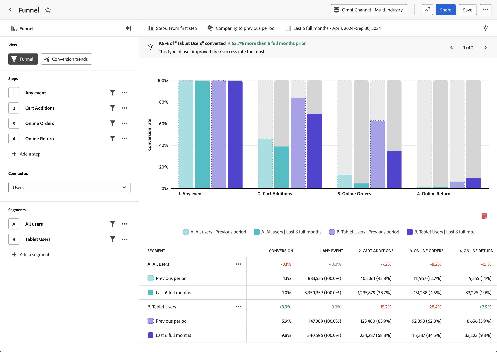

# [!UICONTROL 단계] 분석 {#funnel}

<!-- markdownlint-disable MD034 -->

>[!CONTEXTUALHELP]
>id="workspace_guidedanalysis_funnel_button"
>title="단계"
>abstract="단계 간 전환율을 비교합니다."

<!-- markdownlint-enable MD034 -->

**[!UICONTROL 단계&#x200B;]**분석은 제품에 대한 중요한 사용자 여정을 시각적으로 표현합니다. 가로축은 사용자가 통과해야 하는 각 단계를 나타냅니다. 세로축은 각 단계의 사용자 또는 세션의 비율을 나타냅니다. 모든 단계는 최종 순서대로 수행되어야 하지만 보고 기간 내에 언제든지 발생할 수 있습니다.

>[!VIDEO](https://video.tv.adobe.com/v/3431277/?captions=kor&quality=12&learn=on){width="90%"}

## 사용 사례

이 분석의 사용 사례는 다음과 같습니다.

* **전환 분석**: 소매 결제, 계정 가입, 구독 흐름 또는 제품 경험 내 다른 중요한 여정과 같은 각 단계에서 전환을 분석할 수 있습니다. 한 단계에서 다음 단계로 진행하는 사용자 수를 추적함으로써 비정상적이거나 바람직하지 않는 전환율을 가진 병목 현상을 식별할 수 있습니다. 이 정보는 제품 여정을 개선하여 즉각적인 결과를 얻을 수 있는 곳을 이해하는 데 유용합니다.
* **실험 분석**: 선택적 단계 또는 A/B 실험이 실행되는 단계가 있는 단계의 전환율을 비교할 수 있습니다. 이 정보는 단계의 어떤 베리에이션이 가장 높은 전환율로 이어지는지 파악하는 데 도움이 되며, 이를 통해 더 많은 사용자를 유도할 수 있습니다.
* **온보딩 최적화**: 주요 이벤트에 대한 사용자 행동을 조사하여 제품의 온보딩 프로세스를 최적화합니다. 사용자가 어려움을 겪거나 완료하지 못하는 단계를 파악할 수 있습니다.
* **기능 채택 및 참여**: 사용자가 제품의 특정 기능과 어떻게 상호 작용하는지 이해합니다. 기능 관련 단계를 통해 사용자의 진행 상황을 분석하면 채택률을 확인하고 특정 기능을 충분히 활용하지 못하는 영역을 파악할 수 있습니다. 그런 다음 이 정보를 사용하여 기능 개선에 집중하여 채택률을 높일 수 있습니다.
* **마케팅 채널 효과**: 마케팅 채널의 효과를 측정합니다. 유료 검색, 디스플레이, 자연어 검색 또는 직접 검색 등 다양한 마케팅 채널과 상호 작용한 사용자에 초점을 맞춘 세그먼트를 만들 수 있습니다. 그런 다음 여정을 비교하여 어떤 채널이 최고의 제품 결과로 이어지는지 확인할 수 있습니다.

## 인터페이스

가이드 분석 인터페이스 개요는 [인터페이스](../overview.md#interface)에서 확인하십시오. 다음 설정은 이 분석에만 적용됩니다.

### 쿼리 레일

쿼리 레일을 사용하면 다음 구성 요소를 구성할 수 있습니다.

* **[!UICONTROL 보기]**: 이 분석과 [전환 트렌드](conversion-trends.md)를 전환합니다.
* **[!UICONTROL 단계]**: 추적하려는 이벤트 터치포인트. 차트의 각 막대는 단계를 나타냅니다. 최대 10개의 단계를 포함할 수 있습니다.
   * [!UICONTROL 비교]: 각 단계는 하나의 단계에서 여러 이벤트를 비교할 수 있는 옵션을 제공하여 “포크된 단계”를 만듭니다 이 기능을 사용하면 두 개의 별도 분석을 생성하지 않고도 두 여정의 마찰을 나란히 비교할 수 있습니다. 단계 옵션이 있거나 단계 내에서 A/B 실험이 실행 중일 때 유용합니다. Customer Journey Analytics 튜토리얼의 [단계](https://experienceleague.adobe.com/ko/docs/customer-journey-analytics-learn/tutorials/guided-analysis/funnel)에서 단계를 비교하는 방법을 설명하는 영상을 확인하십시오.
* **[!UICONTROL 다음으로 계산됨]**: 단계에 적용하려는 범위. 옵션에는 [!UICONTROL 세션]과 [!UICONTROL 사용자]가 있습니다.
   * [!UICONTROL 세션]: 모든 단계가 동일한 세션 내에서 진행되어야 계산할 수 있습니다.
   * [!UICONTROL 사용자]: 모든 단계가 선택한 보고 창 내에서 이루어져야 계산할 수 있습니다.
* **[!UICONTROL 세그먼트]**: 단계를 비교할 세그먼트. 선택된 각 세그먼트는 각 단계를 여러 개의 막대로 나눕니다. 각 색상은 다른 세그먼트를 나타냅니다. 최대 3개의 세그먼트를 포함할 수 있습니다.

### 차트 설정

[!UICONTROL 단계] 분석에서는 다음과 같은 차트 설정을 제공하며, 차트 위의 메뉴에서 조정할 수 있습니다.

* **[!UICONTROL 차트 유형]**: 사용하고자 하는 시각화 유형. 옵션에는 [!UICONTROL 단계]가 있습니다.
* **[!UICONTROL 다음에서 전환]**: 단계별 백분율 계산을 결정합니다. 옵션으로는 [!UICONTROL 첫 번째 단계] 또는 [!UICONTROL 이전 단계]에서 전환을 계산하는 것이 있습니다.

### 시간 비교

{{apply-time-comparison}}

### 날짜 범위

분석에 원하는 날짜 범위. 이 설정에는 두 가지 구성 요소가 있습니다.

* **[!UICONTROL 간격]**: 추세 데이터를 보려는 날짜별 세부 기간. 이 설정은 [단계](funnel.md)와 같이 추세가 없는 분석에는 영향을 미치지 않습니다.
* **[!UICONTROL 날짜]**: 시작 및 종료 날짜. 순환 날짜 범위 사전 설정과 이전에 저장된 사용자 정의의 범위를 편리하게 사용할 수 있으며, 캘린더 선택기를 사용하여 고정된 날짜 범위를 선택할 수도 있습니다.

<!--
## Example

See below for an example of the analysis.

-->
