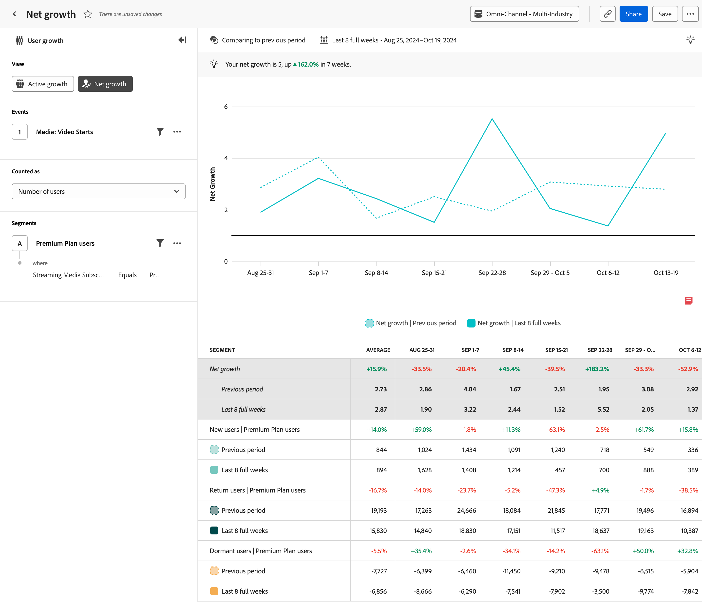

# [!UICONTROL 순 증가] 분석 {#net-growth}

<!-- markdownlint-disable MD034 -->

>[!CONTEXTUALHELP]
>id="cja_workspace_guidedanalysis_netgrowth_button"
>title="순성장"
>abstract="사용자가 증가하고 있습니까, 감소하고 있습니까?"

<!-- markdownlint-enable MD034 -->

 **[!UICONTROL Net growth]** 분석은 특정 기간 동안 사용자를 얻거나 잃는 속도에 대한 통찰력을 제공합니다. 가로축은 시간간격인 반면 세로축은 생장의 측정치이다.

각 데이터 포인트는 다음 공식을 사용하여 계산된 순 증가율을 나타냅니다.

`([New users] + [Return users]) / [Dormant users]`

이 공식의 결과는 비율이다. `1`의 순 증가는 균형을 나타냅니다. 제품이 손실된 사용자와 동일한 수를 얻었습니다. `1`보다 큰 순 증가는 긍정적인 성장을 나타냅니다. 휴면 사용자보다 신규 + 재방문 사용자가 더 많습니다. 마찬가지로 `1`보다 적은 순 증가는 손실을 나타냅니다. 신규 + 재방문 사용자보다 휴면 사용자가 더 많습니다.

[Active](active-growth.md) 분석과 마찬가지로 사용자는 다음과 같이 정의됩니다.

* **[!UICONTROL 새로 만들기]**: 사용자가 현재 기간 동안 활성화되었지만 이전에 활성화되지 않았습니다. 차트 범례에서 &#39;[!UICONTROL 새 사용자]&#39; 위로 마우스를 가져가면 새 사용자를 결정하기 위해 분석에서 되돌아본 정도를 확인합니다. 전환 확인 범위는 선택한 날짜 범위 및 간격을 기반으로 동적으로 결정됩니다.
* **[!UICONTROL Return]**: 사용자가 현재 기간에서 활성 상태이고 바로 이전 기간에서는 활성 상태가 아니었지만 어느 시점에서 이전에 활성 상태가 되었습니다. 차트 범례에서 &#39;[!UICONTROL 재방문 사용자]&#39; 위로 마우스를 가져간 후 재방문 사용자를 결정하기 위해 분석이 되돌려본 정도를 확인합니다. 전환 확인 범위는 선택한 날짜 범위 및 간격을 기반으로 동적으로 결정됩니다.
* **[!UICONTROL 휴면]**: 사용자가 바로 이전 기간에는 활성화되었지만 현재 기간에는 활성화되지 않았습니다. 휴면 사용자는 활성 사용자의 총 수에 포함되지 않습니다.

>[!NOTE]
>
>반복 사용자는 사용자의 이익 또는 손실을 나타내지 않으므로 이 계산에 포함되지 않습니다.

>[!VIDEO](https://video.tv.adobe.com/v/3421664/?learn=on)

## 사용 사례

이 분석의 사용 사례는 다음과 같습니다.

* **성능 평가**: 새 사용자 확보 측면에서 제품의 전체 성능을 평가할 수 있습니다. 증가 트렌드를 추적하면 제품이 원하는 속도로 사용자를 유치하고 유지하는지 더 잘 이해할 수 있습니다.
* **사용자 확보 분석**: 사용자 확보 전략의 효과를 평가할 수 있습니다. 검색 엔진, 캠페인 또는 기타 마케팅 채널과 같은 사용자 성장의 소스를 분석하면 성장의 가장 중요한 소스를 식별할 수 있으므로 그에 따라 리소스를 할당할 수 있습니다.
* **이탈 분석**: 순 증가에는 휴면 사용자 수식의 감소가 포함됩니다. 시간에 따른 사용자 기반의 전반적인 상태를 평가할 수 있습니다. 순 증가량이 지속적으로 `1` 미만이면 보존 전략을 신속하게 구현할 수 있는 감소량이 많다는 의미입니다.

## 인터페이스

안내식 분석 인터페이스에 대한 개요는 [인터페이스](../overview.md#interface)를 참조하십시오. 다음 설정은 이 분석과 관련이 있습니다.

### 쿼리 레일

쿼리 레일을 사용하면 다음 구성 요소를 구성할 수 있습니다.

* **[!UICONTROL 보기]**: 이 분석과 [활성 증가](active-growth.md) 간을 전환합니다.
* **[!UICONTROL 이벤트]**: 측정할 이벤트입니다. 이러한 분석은 사용자를 기반으로 하므로 기간 내에 한 번 이벤트와 상호 작용하는 사용자는 활성 사용자로 계산된다. 쿼리에 이벤트를 하나 포함할 수 있습니다.
* **[!UICONTROL 다음 값으로 계산]**: 선택한 이벤트에 적용할 계산 메서드입니다. 옵션에는 [!UICONTROL 사용자 수] 및 [!UICONTROL 사용자 비율]이 포함됩니다.
* **[!UICONTROL 세그먼트]**: 측정할 세그먼트입니다. 쿼리에 하나의 세그먼트를 포함할 수 있습니다.

### 시간 비교

{{apply-time-comparison}}

### 날짜 범위

분석에 필요한 날짜 범위입니다. 이 설정에는 두 가지 구성 요소가 있습니다.

* **[!UICONTROL 간격]**: 트렌드 데이터를 보려는 날짜 세부 기간입니다. 유효한 옵션에는 시간별, 일별, 주별, 월별 및 분기별 이 포함됩니다. 동일한 날짜 범위에는 차트의 데이터 요소 수와 테이블의 열 수에 영향을 주는 간격이 다를 수 있습니다. 예를 들어 일별 세부기간을 사용하여 3일 동안의 분석을 보면 데이터 포인트가 세 개만 표시되는 반면, 시간별 세부기간을 사용하여 3일 동안의 분석에서는 데이터 포인트가 72개로 표시됩니다.
* **[!UICONTROL 날짜]**: 시작 및 종료 날짜입니다. 롤링 날짜 범위 사전 설정 및 이전에 저장된 사용자 지정 범위는 편의상 사용하거나, 달력 선택기를 사용하여 고정 날짜 범위를 선택할 수 있습니다.

<!-- 
## Example

See below for an example of the analysis.

-->
