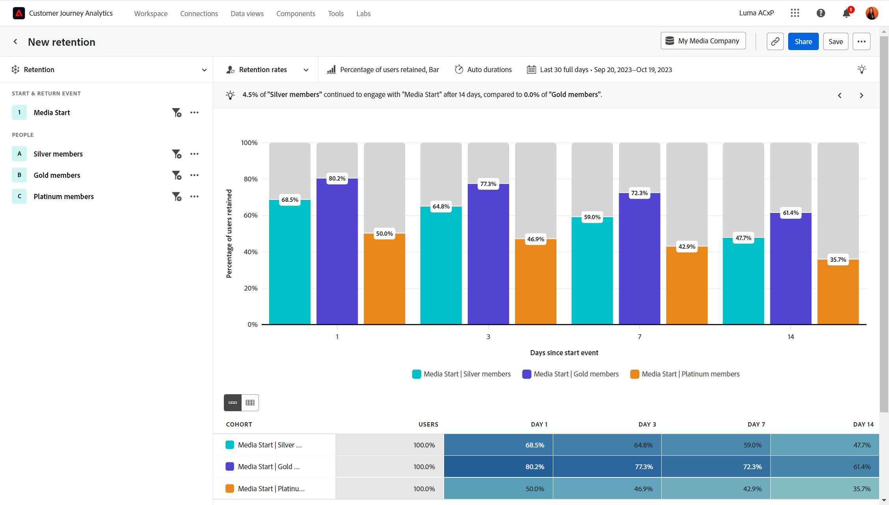

# 유지율

다음 **[!UICONTROL 유지율]** 보기는 원하는 날짜 범위 내에서 초기 참여 후 돌아오는 사용자의 백분율을 보여 줍니다. 가로축은 사용자가 처음 참여한 이후의 일 수를 나타냅니다. 세로축은 다시 참여하는 사용자의 비율을 나타냅니다.

이 분석은 다음 두 가지 중요한 이벤트를 기반으로 사용자를 계산합니다.

* 시작 이벤트: 사용자가 날짜 범위 내에서 처음으로 이벤트에 참여한 시간
* 재방문 이벤트: 사용자가 분석된 날짜 범위 내에서 이벤트에 참여한 가장 최근 시간입니다

&quot;0일&quot; 기간 버킷은 사용자가 이벤트에 참여한 초기 시간을 나타내며 항상 정확히 100%와 같습니다. 이 버킷은 사용자가 보유하는 비율을 계산하는 데 사용되는 분모입니다.

후속 기간 버킷은 해당 기간 또는 그 이후에 반환된 사용자의 수를 계산합니다. 이 수는 사용자가 보유하는 비율을 계산하는 데 사용되는 분자입니다.

* 사용자가 원하는 날짜 범위(초기 참여) 동안 이벤트를 한 번만 참여하는 경우 &quot;0일&quot; 기간 버킷에만 표시됩니다.
* 사용자가 분석에 포함할 자격을 처음 얻은 후 여러 날 후에 이벤트에 참여하는 경우 최신 자격을 갖춘 기간 버킷과 해당 기간으로 이어지는 모든 기간 버킷에 표시됩니다. 이러한 유형의 계산을 &quot;무제한 보존&quot;이라고도 합니다.
* 사용자가 구성된 날짜 범위 동안 이벤트를 여러 번 사용하는 경우 첫 번째 이벤트와 마지막 이벤트만 분석에 포함됩니다.

## 사용 사례

이 보기 유형에 대한 사용 사례는 다음과 같습니다.

* **집단 분석**: 등록 또는 구매 등 사용자가 취하는 조치를 기반으로 사용자를 집단으로 그룹화합니다. 이러한 그룹이 얼마나 잘 유지되는지 비교하고 각 그룹의 사용자 경험을 개선하는 접근 방법을 결정할 수 있습니다.
* **구독 서비스 분석**: 제품이 구독 또는 다른 유형의 반복 매출 모델을 사용하는 경우 제품을 최대한 활용하는 사용자의 비율을 볼 수 있습니다. 이러한 사용자가 제품 시장 적합성을 더 잘 이해하기 위해 나타내는 특정 특성과 행동을 식별할 수 있습니다.
* **사용자 참여**: 특정 유형의 사용자가 제품에 어떻게 참여하는지를 평가하고 반환 빈도를 나란히 비교합니다. 다른 세그먼트보다 보존이 낮은 특정 세그먼트는 보유하고 있을 수 있는 잠재적인 하위 경험 개선에 대한 통찰력을 제공할 수 있습니다.

## 쿼리 레일

쿼리 레일을 사용하면 다음 구성 요소를 구성할 수 있습니다.

* **[!UICONTROL 이벤트 시작 및 반환]**: 사용자가 분석에 포함할 자격을 얻기 위해 참여해야 하는 이벤트 기준입니다. 하나의 이벤트가 지원되지만 속성 필터를 포함할 수 있습니다.
* **[!UICONTROL 다음으로 계산됨]**: 유지된 사용자에게 적용할 계산 방법입니다. 옵션은 다음과 같습니다 [!UICONTROL 사용자 유지] 및 [!UICONTROL 보존된 사용자 비율].
* **[!UICONTROL 세그먼트]**: 측정할 세그먼트입니다. 선택한 각 세그먼트는 집단 테이블에 행을 추가합니다. 최대 3개의 세그먼트를 포함할 수 있습니다.

## 차트 설정

다음 [!UICONTROL 유지율] 보기 는 차트 위의 메뉴에서 조정할 수 있는 다음 차트 설정을 제공합니다.

* **[!UICONTROL 차트 유형]**: 사용하려는 시각화 유형입니다. 옵션은 다음과 같습니다 [!UICONTROL 막대] 및 [!UICONTROL 라인].

## 기간 설정

경과 일수 별로 분석에 사용자가 표시되는 방식을 제어할 수 있습니다.

* **[!UICONTROL 자동 기간]**: 날짜 범위 길이와 날짜 범위가 현재 날짜와 얼마나 가까운지 기준으로 기간을 자동으로 설정합니다. 기간 버킷은 가장 일반적인 사용 사례에 대해 큐레이션됩니다.
* **[!UICONTROL 사용자 지정 기간]**: 원하는 경과 간격을 수동으로 설정합니다. 기간을 4개로 설정할 수 있습니다.

사용 가능한 기간 버킷은 설정한 날짜 범위에 따라 다릅니다.

## 날짜 범위

분석에 필요한 날짜 범위입니다. 이 설정에는 두 가지 구성 요소가 있습니다.

* **[!UICONTROL 간격]**: 보존 데이터를 보려는 날짜 세부 기간입니다. 유효한 옵션에는 일별, 주별, 월별 및 분기별 이 포함됩니다. 동일한 날짜 범위에는 다른 간격이 있을 수 있으며, 이는 자동으로 기간 버킷을 설정하는 데 영향을 줍니다.
* **[!UICONTROL 날짜]**: 시작 및 종료 날짜입니다. 롤링 날짜 범위 사전 설정 및 이전에 저장된 사용자 지정 범위는 편의상 사용하거나, 달력 선택기를 사용하여 고정 날짜 범위를 선택할 수 있습니다.

현재 날짜에 가까운 날짜 범위를 선택하면 처음에 현재 날짜에 너무 가깝게 참여하는 사용자는 포함되지 않습니다. 이 분석은 항상 모든 사용자에게 모든 기간 버킷에 포함될 수 있는 기회를 제공합니다. 달력 선택기 아래의 메시지는 사용자가 참여하는 날짜 범위와 재방문 사용자에게만 예약된 간격에 대한 정보를 제공합니다.

* **에서 시작 이벤트를 수행한 사용자 분석 [날짜 간격]**: 사용자가 이 날짜 범위 내에서 이벤트를 사용하면 분석에 포함됩니다. 이 날짜 범위는 모든 사용자가 모든 기간 버킷을 사용할 수 있는 충분한 시간을 보장합니다. 이 날짜 범위는 현재 날짜에 근접한 경우 선택한 날짜 범위와 다를 수 있습니다.
* **데이터 출처: [날짜 간격] 은(는) 분석을 완료하도록 예약되어 있습니다.**: 사용자가 이 기간 내에 처음으로 참여하는 경우 **아님** 분석에 포함됩니다. 최근 날짜 범위의 경우 이러한 사용자는 모든 기간 버킷에 대한 자격이 없습니다. 지난 날짜 범위의 경우 이러한 사용자는 선택한 날짜 범위를 벗어나서 활성화되었습니다.

## 집단 테이블

차트 아래의 표에서는 집계 보기(차트 데이터와 유사) 및 전체 집단 테이블을 제공합니다. 전체 집단 테이블은 각 개별 날짜 간격 및 사용자의 참여 시기에 대한 세부 정보를 제공합니다.
