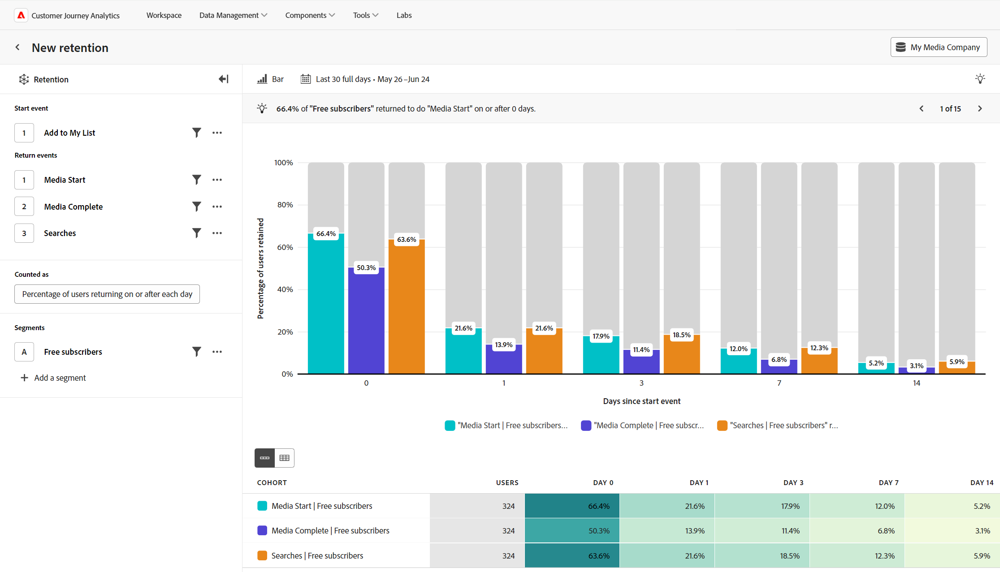

# 유지 분석 {#retention}

<!-- markdownlint-disable MD034 -->

>[!CONTEXTUALHELP]
>id="workspace_guidedanalysis_retention_button"
>title="유지"
>abstract="제품을 계속해서 사용하는 사용자의 수를 측정합니다."

<!-- markdownlint-enable MD034 -->

 **[!UICONTROL 유지]** 분석은 시간이 지남에 따라 사용자가 제품을 계속 사용하는 방식을 측정하여 제품 시장 적합성을 이해하는 데 도움이 될 수 있습니다. 이 분석은 다음 두 가지 중요한 이벤트를 기반으로 사용자 수를 계산합니다.

* 시작 이벤트: 분석에 포함할 사용자를 선정하는 데 사용되는 이벤트.
* 재방문 이벤트: 분석에서 재방문 사용자로 계산되려면 사용자가 참여해야 하는 하나 이상의 이벤트.

이 분석에서 차트의 x축은 사용자의 초기 시작 이벤트 이후의 시간을 나타내며, y축은 하나 이상의 재방문 이벤트에 참여한 사용자의 비율을 나타냅니다. 유지율과 이탈율을 기간별로 볼 수 있으며, 표시되는 기간은 쿼리 설정을 통해 사용자 정의할 수 있습니다. 차트 아래에 있는 테이블은 집계 데이터를 제공하며, 같은 날짜에 시작 이벤트를 수행한 사람들의 그룹인 개별 코호트를 표시하는 옵션이 있습니다.

>[!VIDEO](https://video.tv.adobe.com/v/3435785/?captions=kor&quality=12&learn=on)

## 사용 사례

이 분석의 사용 사례는 다음과 같습니다.

* **코호트 분석**: 가입이나 구매와 같은 행동을 기준으로 사용자를 코호트로 그룹화합니다. 이 그룹들이 얼마나 잘 유지되는지 비교하고 각 그룹의 사용자 경험을 개선하는 방법을 결정할 수 있습니다.
* **제품 시장 적합성**: 제품의 정기적인 사용량을 측정하고 유지 곡선으로 시각화합니다. 유지율이 높을수록 제품 시장 적합성이 높음을 의미하며, 곡선이 평평해지는 지점은 적합성에 도달하는 데 걸리는 시간을 나타냅니다. 이 분석을 전체적인 수준에서 보거나 개별 제품 특징별로 분류하여 더 깊은 인사이트를 얻을 수 있습니다.
* **구독 서비스 분석**: 제품이 구독 또는 다른 유형의 반복적 수익 모델을 사용하는 경우, 제품을 최대한 활용하는 사용자의 비율을 확인할 수 있습니다. 이러한 사용자가 보여 주는 특정 특성과 행동을 식별할 수 있습니다.
* **사용자 참여**: 특정 유형의 사용자가 제품을 사용하는 방식을 평가하고, 그들이 얼마나 자주 돌아오는지 나란히 비교합니다. 다른 세그먼트보다 유지율이 낮은 세그먼트는 잠재적으로 열악한 경험을 개선하는 데 필요한 인사이트를 제공할 수 있습니다.

## 인터페이스

가이드 분석 인터페이스 개요는 [인터페이스](../overview.md#interface)에서 확인하십시오. 다음 설정은 이 분석에만 적용됩니다.

### 쿼리 레일

쿼리 레일을 사용하면 다음 구성 요소를 구성할 수 있습니다.

* **[!UICONTROL 이벤트 시작]**: 사용자가 분석에 포함되기 위해 참여해야 하는 이벤트 기준. 시작 이벤트에 참여하는 사용자는 테이블의 “사용자” 열에 포함됩니다. 이 이벤트는 표시된 유지율의 분모 역할을 합니다. 하나의 이벤트가 지원되며, 필요에 따라 속성 필터를 적용할 수 있습니다. 기본적으로 시작 이벤트와 재방문 이벤트는 연결되어 있으므로 사용자는 선택한 이벤트를 코호트에 포함시키기 위해 한 번 수행하고, 다시 한 번 재방문 사용자로 계산해야 합니다. 자세히 메뉴에서 재방문 액션과 포함 액션을 다르게 하려면 시작 및 재방문 이벤트의 연결을 해제할 수 있습니다.
* **[!UICONTROL 재방문 이벤트]**: 기간 버킷에서 재방문 사용자로 계산되기 위해 사용자가 참여해야 하는 이벤트 기준. 최대 3개의 재방문 이벤트를 선택하여 유지율을 비교할 수 있습니다.
* **[!UICONTROL 다음으로 계산됨]**: 유지된 사용자에게 적용할 계산 방법. 옵션은 다음과 같습니다.
   * **[!UICONTROL 지표]**: [!UICONTROL 사용자 수] 또는 유지된 [!UICONTROL 사용자 비율]을 표시합니다. 유지된 사용자 비율의 분모는 코호트에 포함된 사용자이며 모든 기간 버킷에서 동일합니다.
   * **[!UICONTROL 재방문]**: 재방문 사용자를 계산하는 방법을 제어할 수 있습니다. 옵션은 다음과 같습니다.
      * **[!UICONTROL 다음 또는 이후]**: “무제한” 유지라고도 하는 이 옵션은 지정된 기간 또는 그 이후에 사용자가 재방문한 경우에 사용자를 계산합니다. 예: 7일 또는 7일 이후 언제든지. 이 옵션은 사용자가 어떻게 지속적으로 참여하는지 보여 주는 데 유용하며, 그 결과 보다 매끄러운 유지 곡선을 생성합니다.
      * **[!UICONTROL 정확히]**: “제한된” 유지라고도 하는 이 옵션은 지정된 기간 동안 정확히 재방문한 경우에만 사용자를 계산합니다. 예: 정확히 7일째 되는 날. 이 옵션은 특정 기간 내에 사용자가 어떻게 돌아오는지 보여 주는 데 유용하며, 그 결과 더 큰 기복이 있는 유지 곡선을 생성합니다. 참고: Analysis Workspace의 코호트 분석은 분석 기준으로 “정확히” 계산을 사용합니다.
   * **[!UICONTROL 각각]**: 각 기간 버킷에 지정할 기간. 옵션은 다음과 같습니다.
      * **[!UICONTROL 일/주/월]**: 사용 가능한 옵션은 선택한 기간 범위에 따라 달라집니다. 이러한 옵션은 날짜 범위를 선택할 때의 **[!UICONTROL 간격]** 설정과 동일하며, 해당 설정이 자동으로 업데이트됩니다.
      * **[!UICONTROL 사용자 정의 브래킷]**: 이 옵션은 “각각” 설정에만 사용할 수 있습니다. 예를 들어 7일째가 아닌 7~10일까지 더 긴 기간 동안 사용자 수를 계산할 수 있습니다.
   * **[!UICONTROL 기간 설정]**: 차트와 테이블에 표시되는 기간 버킷을 제어할 수 있습니다. 기간은 시작 이벤트가 발생한 후 재방문 이벤트가 발생한 기간을 말합니다. 참고: 기간 버킷을 충족하는 사용자는 달력 날짜가 아닌 경과 시간을 기준으로 합니다. 예를 들어, 사용자가 9월 6일 오후 11:55에 이벤트 자격을 얻은 다음 9월 7일 오전 12:05에 반환 이벤트 자격을 얻은 경우 1일 기간 버킷에 표시되지 않습니다. 사용자가 1일 동안 버킷을 충족하려면 24시간이 경과해야 합니다. 설정한 날짜 범위에 따라 사용 가능한 기간 버킷이 달라집니다.
      * **[!UICONTROL 자동 기간]**&#x200B;은 날짜 범위 길이와 날짜 범위가 현재 날짜에 얼마나 가까운지에 따라 자동으로 기간 버킷을 정의합니다.
      * **[!UICONTROL 사용자 정의 기간]**&#x200B;을 통해 차트와 테이블 표시된 4개의 기간 버킷을 사용자 정의할 수 있습니다.
* **[!UICONTROL 세그먼트]**: 측정하려는 세그먼트. 선택된 각 세그먼트는 코호트 테이블에 행을 추가합니다. 최대 3개의 세그먼트를 포함할 수 있습니다.

### 차트 설정

[!UICONTROL 유지] 분석에서는 다음과 같은 차트 설정을 제공하며, 차트 위의 메뉴에서 조정할 수 있습니다.

* **[!UICONTROL 차트 유형]**: 사용하고자 하는 시각화 유형. 옵션에는 [!UICONTROL 막대] 및 [!UICONTROL 라인]이 있습니다.

### 날짜 범위

분석에 원하는 날짜 범위. 이 설정에는 두 가지 구성 요소가 있습니다.

* **[!UICONTROL 간격]**: 유지 데이터를 보려는 날짜 단위입니다. 유효한 옵션으로는 일별, 주별 및 월별이 있습니다. 동일한 날짜 범위에도 간격이 다를 수 있으며, 이는 기간 버킷 옵션에 영향을 미칩니다.
* **[!UICONTROL 날짜]**: 시작 및 종료 날짜. 순환 날짜 범위 사전 설정과 이전에 저장된 사용자 정의의 범위를 편리하게 사용할 수 있으며, 캘린더 선택기를 사용하여 고정된 날짜 범위를 선택할 수도 있습니다.

현재 날짜에 가까운 날짜 범위를 선택하면 현재 날짜에 너무 가깝게 참여한 사용자는 포함되지 않습니다. 이 분석은 항상 모든 사용자가 모든 기간 버킷에 포함될 수 있도록 합니다. 캘린더 선택기 아래의 메시지는 사용자가 참여하는 날짜 범위와 재방문 사용자에게만 예약된 간격의 정보를 제공합니다.

* **[!UICONTROL [날짜 간격]]**&#x200B;에서 시작 이벤트를 수행한 사용자 분석: 사용자가 이 날짜 범위 내에서 이벤트에 참여하면 분석에 포함됩니다. 이 날짜 범위는 모든 사용자가 모든 기간 버킷을 참여할 수 있는 충분한 시간을 보장합니다. 이 날짜 범위는 현재 날짜와 가까운 경우 선택한 날짜와 다를 수 있습니다.
* **[!UICONTROL [날짜 간격]의 데이터는 분석을 완료하기 위해 예약됨]**: 사용자가 이 기간 내에 처음 참여하는 경우 분석에 **포함되지 않습니다**. 최근 날짜 범위의 경우, 이러한 사용자는 모든 기간 버킷에 대해 자격을 얻을 기회가 없습니다. 지난 날짜 범위의 경우, 이러한 사용자는 선택한 날짜 범위를 벗어나 활동한 것입니다.

<!--
## Example

See below for an example of the analysis.

-->