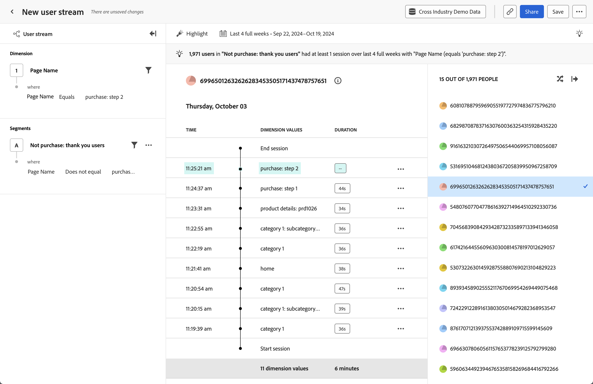

# [!UICONTROL 타임라인] 분석 {#timeline}

<!-- markdownlint-disable MD034 -->

>[!CONTEXTUALHELP]
>id="cja_workspace_guidedanalysis_timeline_button"
>title="타임라인"
>abstract="시간 경과에 따른 사용자 수준 세션 이벤트를 관찰합니다."

<!-- markdownlint-enable MD034 -->

 **[!UICONTROL 타임라인]** 분석을 사용하면 시간 경과에 따른 사용자 수준 세션 이벤트를 관찰하여 경험 패턴을 찾고 더 나은 사용자 스토리를 전달할 수 있습니다. 왼쪽 레일을 사용하면 속성 값 및 세그먼트별로 스트림을 필터링할 수 있습니다. 오른쪽 레일을 사용하면 필터 조건과 일치하는 무작위 사용자 목록에서 선택할 수 있습니다. 가운데 영역에는 선택한 사용자의 세션별 스트림이 표시되며, 타임스탬프, 속성 값 및 기간으로 구성됩니다. 특정 세션의 마지막 이벤트에는 기간을 사용할 수 없습니다.

>[!NOTE]
>
>[!UICONTROL 타임라인] 분석을 사용하려면 [데이터 보기](/help/data-views/component-reference.md#optional)에서 **[!UICONTROL 개인 ID]** 표준 구성 요소를 사용할 수 있어야 합니다. 데이터 보기에 개인 ID를 포함하는 것은 Customer Journey Analytics 관리자가 관리하므로 조직에서 이 데이터에 액세스할 수 있는 사용자를 완벽하게 개인 정보에 제어할 수 있습니다.
> 데이터 보기에 [!UICONTROL 개인 ID] 구성 요소가 추가되지 않은 경우 다음 메시지가 표시됩니다.
>
>* **관리자**: *이 분석에 PersonID 속성이 필요합니다. 개인 ID를 데이터 보기에 추가하십시오.*
>* **관리자가 아닌 사용자**: *이 분석에 PersonID 속성이 필요합니다. Customer Journey Analytics 관리자와 협력하여 개인 ID를 데이터 보기에 추가하십시오.*

>[!VIDEO](https://video.tv.adobe.com/v/3427810/?learn=on)

## 사용 사례

이 분석의 사용 사례는 다음과 같습니다.

* **마찰 탐색**: [단계 분석](funnel.md) 분석에서 급격한 감소를 발견하면 해당 사용자의 세그먼트를 만들고 이 분석에 이 세그먼트를 적용하여 잠재적인 원인을 조사할 수 있습니다.
* **오류 동작**: 사용자에게 제품 오류가 발생하면 해당 오류가 표시되기 전이나 후에 사용자가 무엇을 하고 있었는지 살펴볼 수 있습니다.
* **데이터 수집 유효성 검사**: 데이터 관리자는 이 분석을 자신의 개인 ID로 필터링하여 조직의 구현이 예상대로 작동하는지 확인할 수 있습니다.

## 인터페이스

안내식 분석 인터페이스에 대한 개요는 [인터페이스](../overview.md#interface)를 참조하십시오. 다음 설정은 이 분석과 관련이 있습니다.

### 쿼리 레일

쿼리 레일을 사용하면 다음 구성 요소를 구성할 수 있습니다.

* **[!UICONTROL Dimension]**: 스트리밍된 값을 보려는 차원입니다. 중앙에 있는 스트림에 선택한 차원에 대한 값이 표시됩니다. 필터를 적용하여 스트림 범위를 좁혀 보다 관련성 있는 데이터를 찾을 수도 있습니다. 필터에 유효한 연산자에는 [!UICONTROL 같음], [!UICONTROL 같지 않음], [!UICONTROL 다음으로 시작], [!UICONTROL 다음으로 끝남], [!UICONTROL 포함], [!UICONTROL 포함 안 함], [!UICONTROL 있음] 및 [!UICONTROL 없음]이 포함됩니다.
* **[!UICONTROL 세그먼트]**: 분석할 세그먼트입니다. 선택한 세그먼트는 데이터를 필터링하여 세그먼트 기준과 일치하는 개인에게만 집중시킵니다. 분석 범위를 특정 개인 ID로 좁히려면 오른쪽 패널에서 해당 개인 ID로 필터링할 수 있습니다. 이 분석에는 하나의 세그먼트가 지원됩니다.

### 차트 설정

[!UICONTROL 타임라인] 분석에서는 차트 위의 메뉴에서 조정할 수 있는 다음과 같은 차트 설정을 제공합니다.

* **[!UICONTROL 다른 이름으로 표시]**: 원하는 속성 값을 표시합니다.
   * [!UICONTROL 모두 표시]: 세션의 모든 속성 값을 표시합니다.
   * [!UICONTROL 강조]: 쿼리 필터와 일치하는 세션의 속성 값을 시각적으로 강조 표시합니다.
   * [!UICONTROL 보기 전용]: 쿼리 필터와 일치하는 세션의 속성 값만 표시합니다.

### 날짜 범위

분석에 필요한 날짜 범위입니다. 이 설정에는 두 가지 구성 요소가 있습니다.

* **[!UICONTROL 간격]**: 트렌드 데이터를 보려는 날짜 세부 기간입니다. 이 설정은 타임라인과 같은 비트렌드 분석에 영향을 주지 않습니다.
* **[!UICONTROL 날짜]**: 시작 및 종료 날짜입니다. 롤링 날짜 범위 사전 설정 및 이전에 저장된 사용자 지정 범위는 편의상 사용하거나, 달력 선택기를 사용하여 고정 날짜 범위를 선택할 수 있습니다.

<!--

## Example

See below for an example of the analysis.

-->
