# 기여도 AI와 CJA 통합

Adobe Experience Platform Intelligent Services의 일부인 [기여도 AI](https://experienceleague.adobe.com/docs/experience-platform/intelligent-services/attribution-ai/overview.html?lang=ko-KR)는 지정된 결과에 대한 고객 상호 작용의 영향 및 점진적 영향을 계산하는 멀티채널 알고리즘 속성 서비스입니다. 기여도 AI를 통해 마케터는 고객 여정의 각 단계에서 모든 개별 고객 상호 작용의 영향을 이해함으로써 마케팅 및 광고 지출을 측정하고 최적화할 수 있습니다.

기여도 AI는 고객의 마케팅 접점 및 전환 데이터 소스에 대해 모델을 실행하는 범위 내에서 Customer Journey Analytics(CJA)와 통합됩니다. 그런 다음 CJA는 해당 모델의 출력을 데이터 세트로 가져오거나 나머지 CJA 데이터 세트와 통합할 수 있습니다. 그런 다음 Attribution AI 지원 데이터 세트를 CJA의 데이터 보기 및 보고에서 활용할 수 있습니다.

기여도 AI는 경험 이벤트, Adobe Analytics 및 소비자 경험 이벤트의 3가지 Experience Platform 스키마를 지원합니다.

기여도 AI는 알고리즘 및 규칙 기반의 두 가지 범주의 점수를 지원합니다.

## 알고리즘 점수

알고리즘 점수에는 증분 및 영향을 주는 점수가 포함됩니다.

* **[!UICONTROL 영향을 주는] 점수**&#x200B;는 마케팅 채널 간에 전환 크레딧의 100%를 나눕니다.
* **[!UICONTROL 증분] 점수**&#x200B;는 먼저 마케팅 없이도 달성할 수 있는 전환 기준선을 고려합니다. 이 기준선은 기존 브랜드 인지도, 충성도 및 입소문을 통해 패턴, 계절성 등을 AI가 관찰하는 것에 따라 달라집니다. 나머지 크레딧은 마케팅 채널 간에 나눠집니다.

## 규칙 기반 점수

규칙 기반 점수에는 다음이 포함됩니다.

* **[!UICONTROL 첫 번째 터치]**&#x200B;는 속성 전환 확인 기간에서 맨 먼저 표시된 터치 포인트에 100% 크레딧을 제공합니다.
* **[!UICONTROL 마지막 터치]**&#x200B;는 전환 전에 가장 최근에 발생하는 터치 포인트에 100% 크레딧을 제공합니다.
* **[!UICONTROL 선형]**&#x200B;은 전환으로 이어지는 모든 표시되는 터치 포인트에 동일한 크레딧을 제공합니다.
* **[!UICONTROL U자형]**&#x200B;은 첫 번째 상호 작용에 40% 크레딧을 제공하고, 마지막 상호 작용에 40% 크레딧을 제공하며, 나머지 20%를 그 사이의 모든 터치 포인트에 나눠줍니다. 터치 포인트가 하나인 전환의 경우 100% 크레딧이 제공됩니다. 터치 포인트가 두 개인 전환의 경우 두 터치 포인트에 50% 크레딧이 제공됩니다.
* **[!UICONTROL 시간 감소]**&#x200B;는 기본값이 7일인 사용자 정의 반감기 매개변수를 사용하는 기하급수적 감소가 따릅니다. 각 채널의 가중치는 터치 포인트 시작과 최종 전환 사이에 경과된 시간에 따라 달라집니다. 크레딧을 결정하는 데 사용되는 공식은 `2^(-t/halflife)`이고, 여기서 `t`는 터치 포인트와 전환 사이의 시간입니다. 그러면 모든 터치 포인트가 100%로 표준화됩니다.

## 워크플로

일부 단계는 CJA에서 출력 작업을 수행하기 전에 Adobe Experience Platform에서 수행됩니다. 출력은 기여도 AI 모델이 적용된 데이터 세트로 구성됩니다.

### 1단계: 기여도 AI 인스턴스 생성

Experience Platform에서는 [여기](https://experienceleague.adobe.com/docs/experience-platform/intelligent-services/attribution-ai/user-guide.html)에 설명된 대로 데이터를 선택 및 매핑하고, 이벤트를 정의하고, 데이터를 교육하여 기여도 AI 인스턴스를 생성합니다.

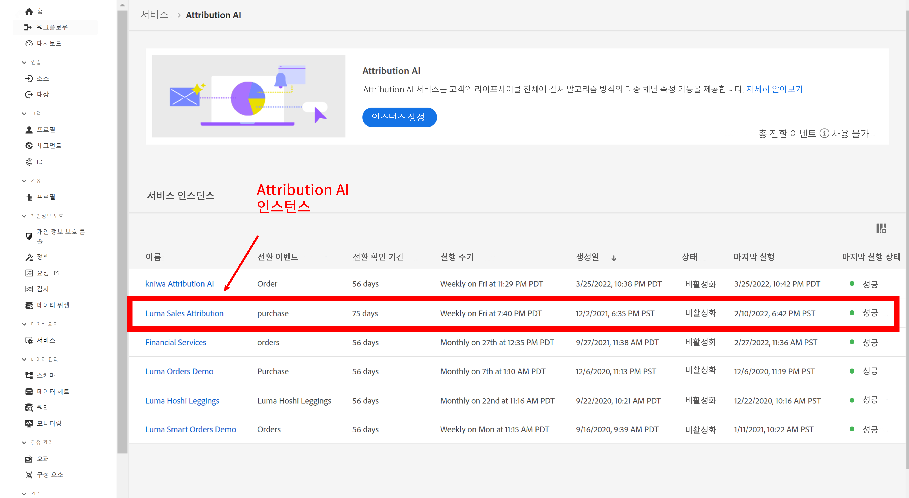

### 2단계: 기여도 AI 데이터 세트에 대한 CJA 연결 설정

CJA에서는 이제 기여도 AI용으로 계측된 Experience Platform 데이터 세트에 대한 [하나 이상의 연결을 생성](/help/connections/create-connection.md)할 수 있습니다. 이러한 데이터 세트에는 다음과 같이 “기여도 AI 스코어” 접두어가 붙습니다.

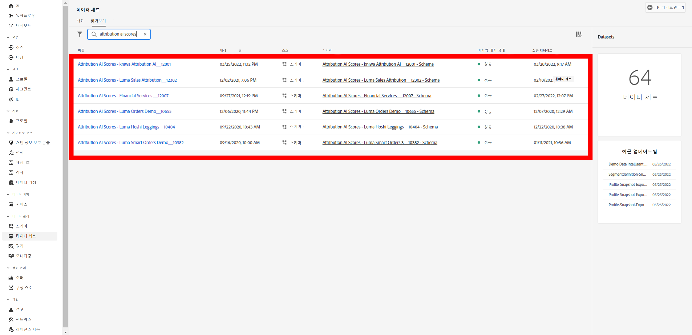

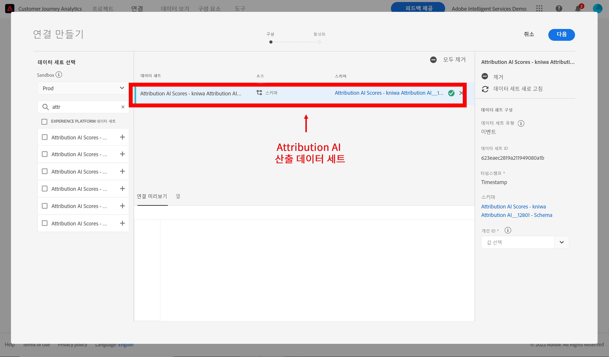

### 3단계: 연결을 기반으로 데이터 보기 만들기

CJA에서 기여도 AI XDM 필드가 포함된 [하나 이상의 데이터 보기를 생성](/help/data-views/create-dataview.md)합니다.

다음은 터치포인트에 대한 XDM 스키마 필드입니다.

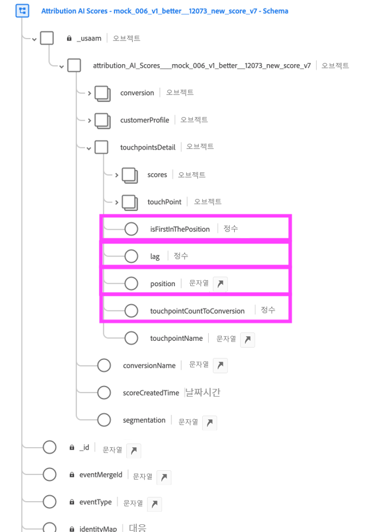

변환을 위한 XDM 스키마 필드는 다음과 같습니다.

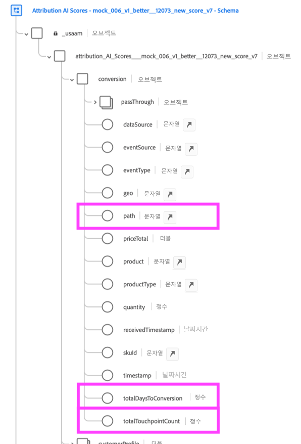

### 4단계: CJA 작업 영역에서 AAI 데이터 보고

CJA 작업 영역 프로젝트에서는 “AAI 주문”과 같은 지표와 “AAI 캠페인 이름” 또는 “AAI 마케팅 채널”과 같은 차원을 가져올 수 있습니다.

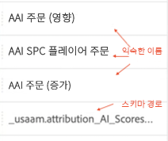

AAI의 원시 점수 출력에는 중첩된 스키마가 있습니다. 여기서 필드 경로는 테이블이나 시각화에 있는 대부분의 공백을 차지할 수 있습니다. 요점을 위해 [!UICONTROL 표시 이름] 는 아래 규칙에 따라 CJA에서 자동으로 생성 및 활용됩니다.

* 모든 필드에는 &quot;AAI&quot; 접두사가 있습니다
* 터치 포인트 필드의 경우:
   * XDM 점수의 일부인 필드의 경우 CJA에 다음과 같이 표시됩니다. `AAI T {field name}`
   * passThrough 열로 포함된 필드의 경우 다음과 같이 CJA에 표시됩니다. `AAI T PT {field name}`
* 전환 필드의 경우:
   * XDM 점수의 일부인 필드의 경우 CJA에 다음과 같이 표시됩니다. `AAI C {field name}`
   * passThrough 열로 포함된 필드의 경우 다음과 같이 CJA에 표시됩니다. `AAI C PT {field name}`

**영향을 주고 증분 점수가 있는 주문**

여기에서 영향을 주는 점수와 증분 점수가 있는 주문을 보여 주는 AAI 데이터가 포함된 작업 영역 프로젝트를 볼 수 있습니다. 캠페인, 제품 그룹, 사용자 세그먼트, 지역 등을 기준으로 기여도를 파악하려면 모든 차원으로 드릴다운합니다.

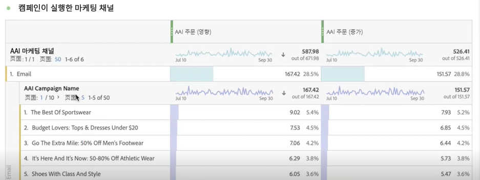

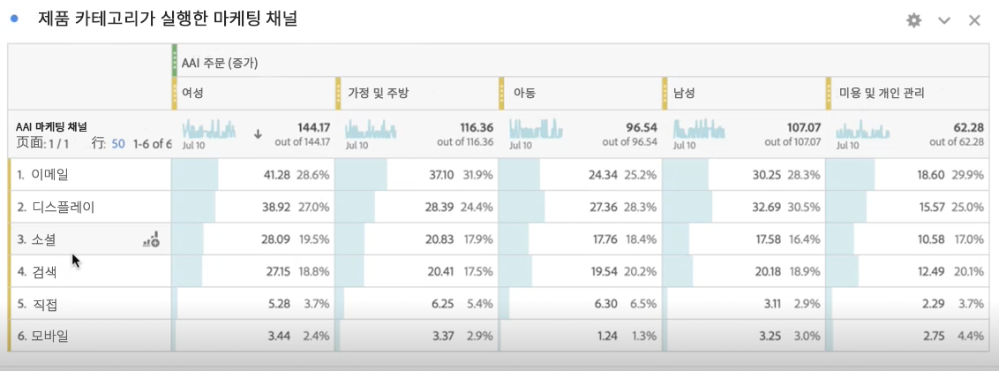

**마케팅 성과**

다양한 속성 모델 간의 터치포인트 속성 비교 및 대조:

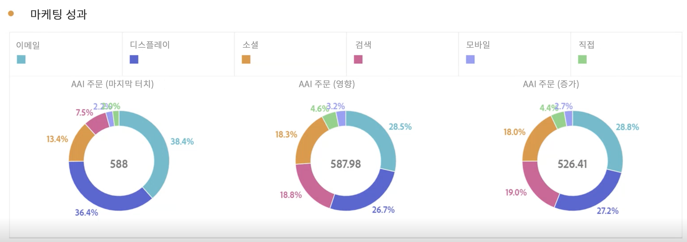

**채널 상호 작용**

벤 다이어그램을 사용하여 채널 상호 작용을 이해하고 다른 채널과 가장 효과적으로 사용할 수 있는 채널을 확인합니다.

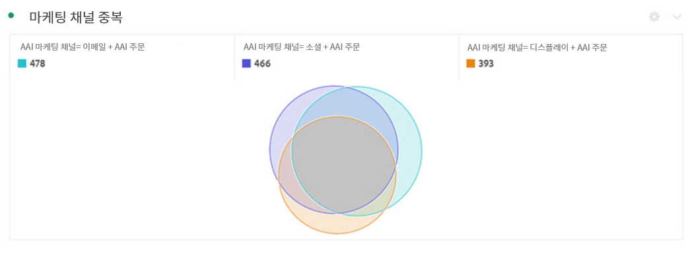

**변환 주요 패스**

이 표는 터치포인트를 설계하고 최적화하는 데 도움이 되는 변환(중복 제거)의 주요 패스를 보여 줍니다.

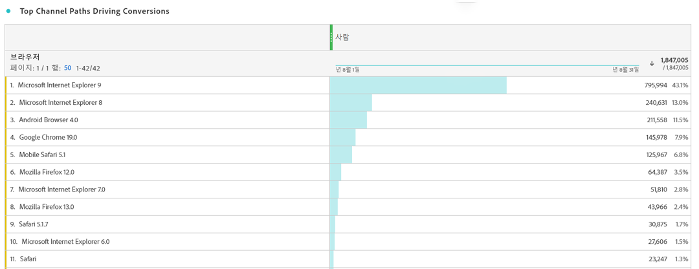

**전환 리드 타임**

여기에서 터치포인트가 혼합되어 있을 때의 전환 리드 타임을 볼 수 있습니다. 리드 타임 최적화에 도움이 됩니다.

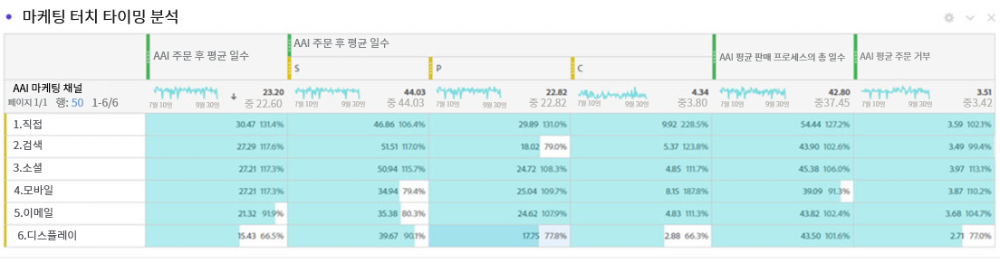

## 기여도 AI와 Attribution IQ의 차이점

그렇다면 기여도 AI 데이터와 기본 CJA 기능인 [Attribution IQ](/help/analysis-workspace/attribution/overview.md)를 사용해야 할 때는 언제입니까? 다음 표에는 기능의 몇 가지 차이점이 표시됩니다.

| 기능 | 기여도 AI | Attribution IQ |
| --- | --- | --- |
| 증분 속성 | 예 | 아니요 |
| 사용자가 모델을 조정할 수 있도록 허용 | 예 | 예 |
| 채널 간 속성 (참고: AAI는 CJA와 동일한 결합 데이터를 사용하지 않습니다.) | 예 | 예 |
| 영향을 주는 점수 포함 | 예 | 예 |
| ML 모델링 | 예 | 예 |
| 지역 기반 속성 모델 | 예 | 예 |
| 모델에서 마케팅 접점 구성 가능 | 예 | 아니요 |

{style=&quot;table-layout:auto&quot;}
