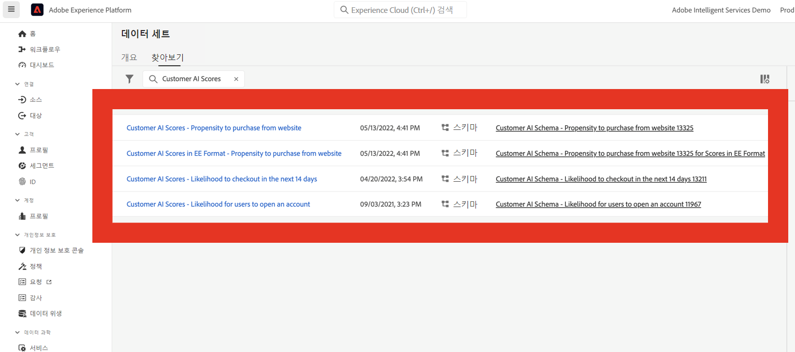
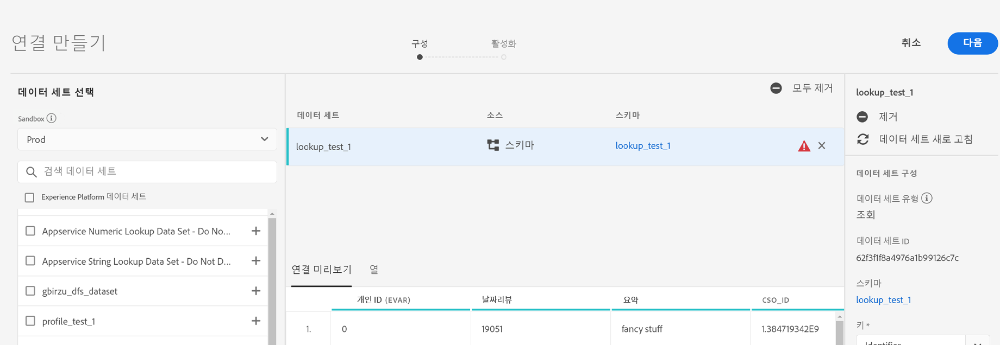
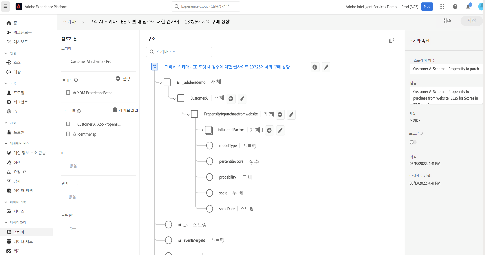
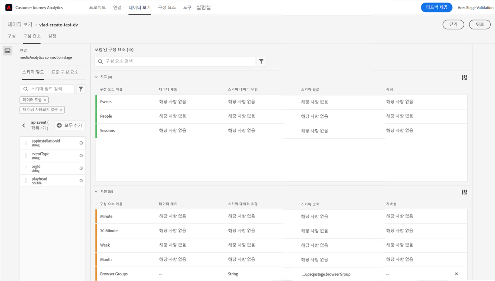
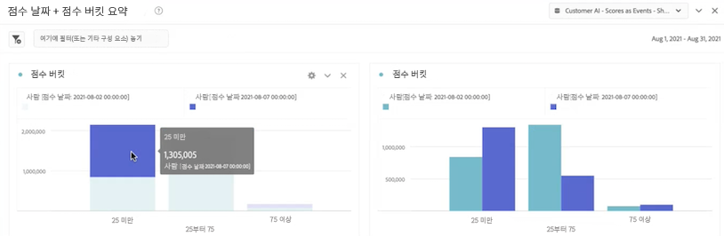
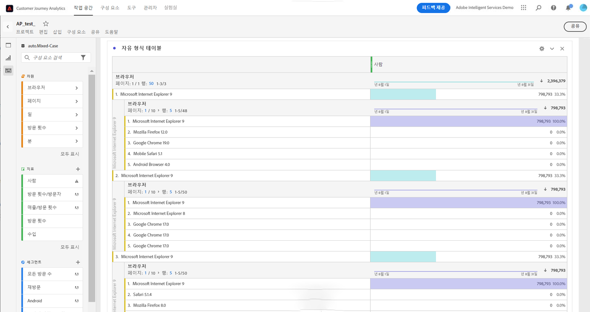
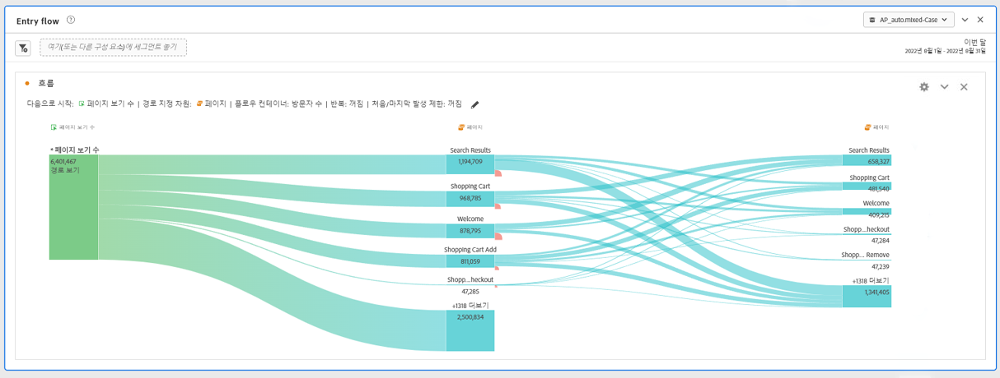
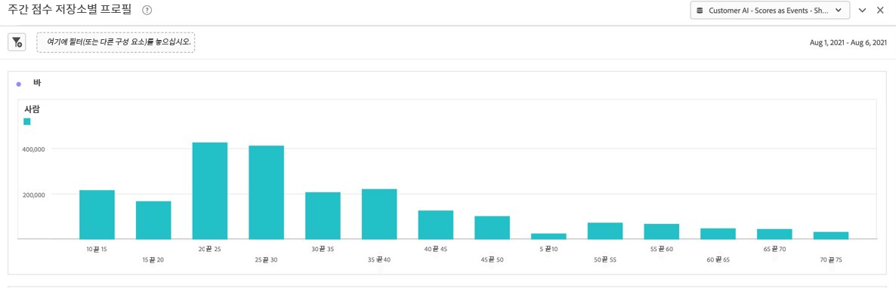
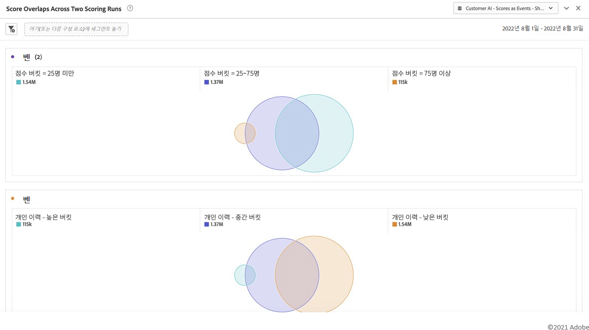

# Adobe Customer Journey Analytics과 Customer AI 데이터 통합

{{release-limited-testing}}

Adobe Experience Platform Intelligent Services의 일부인 [Customer AI](https://experienceleague.adobe.com/docs/experience-platform/intelligent-services/customer-ai/overview.html?lang=ko-KR)는 마케터에게 개별 수준에서 고객 예측을 생성할 수 있는 권한을 제공합니다.

영향력 있는 요소를 통해 Customer AI는 고객이 무엇을 할 수 있고 왜 하는지 알려 줄 수 있습니다. 또한 마케터는 Customer AI 예측 및 통찰력을 활용하여 가장 적절한 오퍼와 메시지를 제공함으로써 고객 경험을 개인화할 수 있습니다.

Customer AI는 성향 점수에 대해 개인 행동 데이터와 프로필 데이터에 의존합니다. Customer AI는 Adobe Analytics, Adobe Audience Manager, 소비자 경험 이벤트 데이터 및 경험 이벤트 데이터를 비롯한 여러 데이터 소스를 가져올 수 있어 유연하게 사용할 수 있습니다. Experience Platform 소스 커넥터를 사용하여 Adobe Audience Manager 및 Adobe Analytics 데이터를 가져오는 경우 모델은 자동으로 표준 이벤트 유형을 선택하여 모델을 교육하고 평가합니다. 표준 이벤트 유형 없이 고유한 경험 이벤트 데이터 세트를 가져오는 경우 해당 모델에서 사용하려면 모든 관련 필드를 사용자 정의 이벤트 또는 프로필 속성으로 매핑해야 합니다. 이는 Experience Platform의 Customer AI 구성 단계에서 수행할 수 있습니다.

Customer AI는 Customer AI 지원 데이터 세트를 Customer Journey Analytics의 데이터 보기 및 보고에서 활용할 수 있는 범위 내에서 Customer Journey Analytics과 통합할 수 있습니다. 다음과 같은 작업을 수행할 수 있습니다.

* **시간 경과에 따른 사용자 세그먼트의 성향 점수를 추적합니다**.
   * 사용 사례: 특정 세그먼트의 고객이 전환될 가능성을 이해합니다.
   * 예: 호텔 체인의 마케터는 호텔 고객이 호텔 콘서트장에서 공연 티켓을 구매할 가능성을 이해하려고 합니다.
* **성향 점수와 관련된 성공 이벤트 또는 속성을 분석합니다**.
   * 사용 사례: 성향 점수와 관련된 속성 또는 성공 이벤트를 파악합니다.
   * 예: 호텔 체인의 마케터는 호텔 콘서트장에서 공연 티켓을 구매하는 것이 성향 점수와 어떻게 관련이 있는지 알고 싶어합니다.
* **다양한 스코어링 실행에 대한 고객 성향에 대한 입력 플로우를 따르십시오**.
   * 사용 사례: 처음에는 낮은 성향의 사용자였다가 시간이 지나면서 높은 성향의 사용자가 된 사람들을 파악합니다.
   * 예: 호텔 체인의 마케터는 처음에 어떤 호텔 고객이 쇼 티켓을 구매할 성향이 낮은 고객으로 확인되었지만 시간이 지나면서 쇼 티켓을 구매할 성향이 높은 고객이 되었는지 이해하려고 합니다.
* **성향 분포를 살펴봅니다**.
   * 사용 사례: 세그먼트를 정의할 때 성향 점수 분포를 보다 정확하게 파악합니다.
   * 예: 소매업체는 제품에 대해 $50 할인된 가격으로 특정 프로모션을 진행하려고 합니다. 이 업체는 예산 등의 이유로 인해 매우 제한적인 프로모션만 진행하기를 원할 수 있습니다. 이들은 데이터를 분석하여 상위 80% 이상의 고객만을 대상으로 하기로 결정합니다.
* **시간의 흐름에 따라 특정 집단에 대한 작업을 수행하는 경향을 살펴봅니다**.
   * 사용 사례: 시간 경과에 따라 특정 집단을 추적합니다.
   * 예: 호텔 체인의 마케터는 시간이 지남에 따라 브론즈 계층과 실버 계층 또는 실버 계층과 골드 계층을 추적하려고 합니다. 시간 경과에 따라 호텔을 예약하는 각 집단의 성향을 확인할 수 있습니다.

Customer AI 데이터를 실제로 Customer Journey Analytics과 통합하려면 다음 단계를 수행합니다.

>[!NOTE]
>
>일부 단계는 Customer Journey Analytics에서 출력 작업을 수행하기 전에 Adobe Experience Platform에서 수행됩니다.

## 1단계: Customer AI 인스턴스 구성

데이터를 준비하고 모든 자격 증명 및 스키마를 준비한 후에는 Adobe Experience Platform의 [Customer AI 인스턴스 구성](https://experienceleague.adobe.com/docs/experience-platform/intelligent-services/customer-ai/user-guide/configure.html?lang=ko-KR) 안내서를 따라 시작합니다.

## 2단계: Customer AI 데이터 세트에 대한 Customer Journey Analytics 연결 설정

이제 Customer Journey Analytics에서 다음 작업을 수행할 수 있습니다 [하나 이상의 연결 만들기](/help/connections/create-connection.md) 고객 AI용으로 계측된 데이터 세트를 Experience Platform “계정 업그레이드 가능성”과 같은 각 예측은 하나의 데이터 세트와 동일합니다. 이러한 데이터 세트에는 “EE Format – name_of_application의 Customer AI 스코어” 접두어가 붙습니다.

>[!IMPORTANT]
>
>1단계에서 구성하는 동안 Customer Journey Analytics에 대한 점수를 활성화하기 위한 토글이 켜져 있는 경우 각 Customer AI 인스턴스에는 두 개의 출력 데이터 세트가 있습니다. 하나의 출력 데이터 세트는 프로필 XDM 형식으로 표시되고 다른 하나는 Experience Event XDM 형식으로 표시됩니다.

다음은 Customer Journey Analytics이 기존 또는 새 데이터 세트의 일부로 가져올 XDM 스키마의 예입니다.

(예제는 Customer Journey Analytics 데이터 세트이며 동일한 스키마 오브젝트 세트는 프로필이 가져올 경험 이벤트 데이터 세트의 일부입니다. 경험 이벤트 데이터 세트에는 점수 날짜로 타임스탬프가 포함됩니다.) 이 모델에서 득점한 모든 고객은 점수, 점수 날짜 등을 갖게 됩니다. 연관되어 있습니다.

## 3단계: 연결을 기반으로 데이터 보기 만들기

이제 Customer Journey Analytics에서 다음 작업을 수행할 수 있습니다. [데이터 보기 만들기](/help/data-views/create-dataview.md) 설정한 연결의 일부로 가져온 차원 (점수, 점수 날짜, 확률 등) 및 지표.

## 4단계: 작업 영역에서 CAI 점수 보고

Customer Journey Analytics 작업 영역에서 새 프로젝트를 만들고 시각화를 가져올 수 있습니다.

### 트렌드 성향 점수

다음은 스택 막대 차트에서 시간 경과에 따른 사용자 세그먼트의 성향 점수 추세를 나타내는 CAI 데이터가 있는 작업 영역 프로젝트의 예입니다.

### 이유 코드가 있는 표

다음은 세그먼트의 성향이 높거나 낮은 이유의 코드가 표시되는 표입니다.

### 고객 성향 항목 플로우

이 플로우는 다양한 스코어링 실행에 대한 고객 성향에 대한 입력 플로우를 보여 줍니다.

### 성향 점수 분포

이 막대 차트는 성향 점수 분포를 보여 줍니다.

### 성향 겹침

이 벤 다이어그램은 여러 점수 실행에 대한 성향 겹침을 보여 줍니다.

