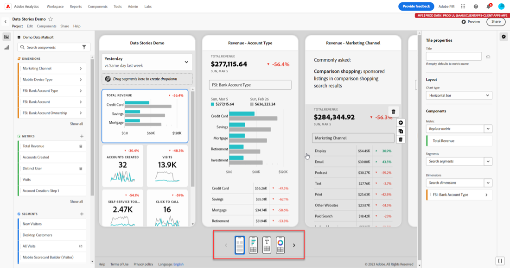
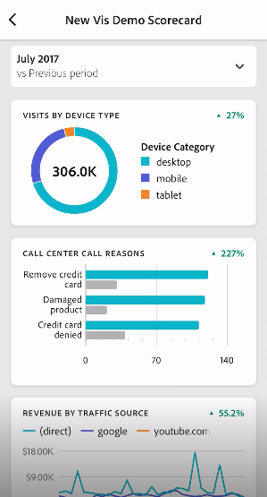

# 스코어카드 관리

이 항목은 Customer Journey Analytics 큐레이터에게 스코어카드 요소를 보고 관리하는 방법에 대해 설명합니다.

## 타일 속성 보기 및 구성 {#tiles}

스코어카드 빌더에서 타일을 클릭하면 오른쪽 레일에 해당 타일 및 세부 슬라이드와 관련된 속성 및 특성이 표시됩니다. 이 레일에서 타일에 새 **제목**&#x200B;을 제공하고, 세그먼트를 적용하여 타일을 구성할 수 있습니다.

## 세부 슬라이드 보기 {#view-detail-slides}

타일을 클릭하면 앱에서 경영진 사용자에게 세부 슬라이드가 표시되는 방식이 동적 팝업 창에 표시됩니다. 차원을 추가하여 특정 요구 사항에 맞게 데이터를 분류할 수 있습니다. 차원이 적용되지 않았다면 분류 차원은 기본 날짜 범위에 따라 **시간** 또는 **일**&#x200B;이 됩니다.

분류는 문자 그대로 지표를 다음과 같은 차원 항목으로 분류하여 분석을 구체화합니다.

* 광고 플랫폼(AMO ID)별로 분류된 고유 방문자 지표
* 제품 카테고리(소매)별로 분류된 방문 횟수
* 제품 이름별로 분류된 총 매출

타일에 추가된 각 차원이 앱의 상세 보기에서 드롭다운 메뉴에 표시됩니다. 그러면 경영진 사용자는 드롭다운 메뉴에 나열된 옵션 중에서 선택할 수 있습니다.

## 세부 슬라이드 사용자 정의 {#customize-detail-slide}

사용자 정의 세부 슬라이드를 사용하면 대상자와 공유하는 정보에 대해 훨씬 더 정확하게 지정할 수 있습니다.

>[!BEGINSHADEBOX]

데모 비디오를 보려면  [ 사용자 정의 세부 정보 보기](https://video.tv.adobe.com/v/3413790?quality=12&learn=on&captions=kor){target="_blank"}를 확인하십시오.

>[!ENDSHADEBOX]

각 세부 슬라이드의 레이아웃을 수정하고 텍스트를 추가하여 최종 사용자가 데이터에서 볼 수 있는 내용을 더 잘 설명할 수 있습니다. 드롭다운 메뉴를 사용하여 차트 유형을 변경할 수도 있습니다.

### 슬라이드 레이아웃 변경

가장 중요한 정보에 초점을 맞추도록 슬라이드 레이아웃을 변경합니다. 예를 들어 차트 또는 테이블만 표시하도록 레이아웃을 변경할 수 있습니다. 슬라이드 레이아웃을 변경하려면 미리 설계된 형식 중 하나를 선택합니다.

또한 시각화 구성 요소를 왼쪽 레일에서 캔버스로 드래그 앤 드롭하여 슬라이드 레이아웃을 변경할 수 있습니다. 각 세부 슬라이드는 한 번에 두 개의 시각화만 수용할 수 있습니다.

### 슬라이드에 설명 텍스트 추가

차트에 포함된 내용에 대한 의미 있는 정보 또는 데이터에 대한 뉘앙스를 제공하는 텍스트를 추가할 수 있습니다.

세부 슬라이드에 텍스트를 추가하려면 `T` 기호를 표시하는 레이아웃을 선택하거나 텍스트 시각화 구성 요소를 왼쪽 레일에서 드래그 앤 드롭합니다. 텍스트 편집기는 새 텍스트 시각화를 추가하거나 텍스트가 있는 슬라이드 레이아웃을 선택하면 자동으로 열립니다. 텍스트 편집기는 텍스트 형식을 지정하는 모든 표준 옵션을 제공합니다. 단락, 제목 및 부제목과 같은 텍스트 스타일을 적용하고 굵은 글꼴과 기울임꼴 글꼴을 적용할 수 있습니다. 텍스트를 맞추고, 글머리 기호 및 번호 매기기 목록을 추가하고, 링크를 추가할 수 있습니다. 편집을 마치면 텍스트 편집기의 오른쪽 상단에 있는 최소화 버튼을 선택하여 닫습니다. 이미 추가한 텍스트를 편집하려면 연필 아이콘을 선택하여 텍스트 편집기를 다시 엽니다.

## 구성 요소 제거 {#remove}

마찬가지로 전체 스코어카드에 적용된 구성 요소를 제거하려면 타일 바깥쪽에 있는 스코어카드의 아무 곳이나 클릭한 다음 **첫 번째 방문**&#x200B;에 대해 아래에 표시된 대로 구성 요소를 마우스로 가리키면 표시되는 **x**&#x200B;를 클릭하여 제거합니다.

## 데이터 스토리 만들기 {#create-data-story}

데이터 스토리는 지원 데이터 포인트, 비즈니스 컨텍스트 그리고 하나의 중심 주제 또는 지표를 중심으로 구축된 관련 지표의 모음입니다.

예를 들어 웹 트래픽에 초점을 맞추는 경우 가장 중요한 지표는 방문 수일 수 있지만 신규 사용자, 고유 사용자에도 관심이 있을 수 있으며 웹 페이지 또는 트래픽이 발생한 디바이스 유형별로 분류된 데이터를 보고 싶을 수 있습니다. 모바일 스코어카드 프로젝트에서 데이터 스토리를 사용하면 가장 중요한 지표를 전면 중앙에 배치하는 동시에 여러 세부 슬라이드로 지표에 담겨 있는 전체 스토리를 전달할 수 있습니다.

Analysis Workspace의 모바일 스코어카드 프로젝트에서 데이터 스토리를 만드는 방법에 대해 자세히 알아보려면 비디오를 시청하십시오.

>[!BEGINSHADEBOX]

데모 비디오는  [모바일 스코어카드 프로젝트용 데이터 스토리](https://video.tv.adobe.com/v/3420563/?quality=12&learn=on&captions=kor){target="_blank"}를 참조하십시오.

>[!ENDSHADEBOX]

**데이터 스토리를 만들려면** {#data-story-create}

여러 세부 정보 슬라이드를 타일에 추가하여 데이터 스토리를 작성합니다.

1. 모바일 스코어카드 프로젝트로 시작하기
1. 스토리를 만들려는 타일을 선택합니다.
   
   {width=".50%"}
1. 슬라이드를 추가하여 데이터 스토리를 작성합니다. 기본적으로 첫 번째 슬라이드가 생성됩니다.
새 슬라이드를 추가하려면 슬라이드 위로 마우스를 가져가거나 슬라이드를 클릭한 다음 사용 가능한 옵션 중에서 선택합니다.
   * &#x200B;+ 기호를 탭하여 새 슬라이드를 만듭니다.
   * 복제 아이콘을 탭하여 기존 슬라이드를 복제합니다.
1. 빈 슬라이드를 만드는 경우 왼쪽 레일에서 구성 요소를 끌어다 놓거나 레이아웃을 선택하여 타일의 데이터로 슬라이드를 자동으로 채웁니다.
   
슬라이드를 삭제하려면 휴지통 아이콘을 탭합니다.

### 데이터 스토리 사용자 정의 {#customize-data-story}

데이터 스토리를 사용하면 모든 것을 사용자 정의하여 공유하고 싶은 정보를 공유하고 필요하지 않은 모든 것을 제외할 수 있습니다. 타일과 개별 슬라이드를 사용자 정의하여 세그먼트를 추가하고 분류를 표시하고 레이아웃을 변경하고 시각화를 변경할 수 있습니다.

**타일을 사용자 정의하려면**

1. 타일을 탭합니다. 선택한 타일의 윤곽선이 파란색으로 표시되고 오른쪽 패널에 타일 속성이 표시됩니다.
1. 제목, 차트 유형 및 기타 타일 옵션을 변경합니다.
1. 구성 요소를 타일로 끌어옵니다.
   
시각화와 같은 구성 요소를 타일에 끌어다 놓으면 해당 구성 요소가 모든 데이터 스토리 슬라이드에 적용됩니다.
1. 제목에만 변경 사항을 적용하려면 Shift 키를 누른 상태에서 변경 사항을 적용하십시오.
   

>[!NOTE]
>슬라이드는 타일에서 구성 요소를 상속하지만 타일은 슬라이드에서 구성 요소를 상속하지 않습니다.

**개별 슬라이드를 사용자 정의하려면**

데이터 스토리의 개별 슬라이드에 대한 시각화를 변경할 수 있습니다. 예를 들어 특정 슬라이드의 가로 막대를 도넛형 그래프로 변경할 수 있습니다. 레이아웃을 변경할 수도 있습니다. [세부 슬라이드 사용자 정의](#customize-detail-slide) 보기

### 데이터 스토리 미리보기 {#preview-data-story}

데이터 스토리를 생성한 후 **미리보기** 버튼을 사용하여 마치 앱 사용자인 것처럼 데이터 스토리를 보고 상호 작용할 수 있습니다. 데이터 스토리 미리보기에 대한 자세한 내용은 [스코어카드 미리보기](#preview)를 확인하십시오.

### 타일과 슬라이드 탐색 {#navigate-tiles-slides}

탐색 막대에는 각 슬라이드의 내용을 나타내는 아이콘이 표시됩니다. 탐색 막대를 사용하면 슬라이드가 많은 경우에도 특정 슬라이드로 쉽게 이동할 수 있습니다.

타일과 슬라이드 사이를 이동하려면 탐색 막대를 탭하십시오.

{width="45%"}

또한 키보드의 화살표를 사용하거나 구성 요소를 선택하고 화면의 왼쪽이나 오른쪽으로 길게 눌러 스크롤하여 앞뒤로 탐색할 수도 있습니다.

## Preview_scorecards {#preview}

Adobe Analytics 대시보드 앱에 게시되면 스코어카드가 어떻게 보이는지와 기능을 미리 볼 수 있습니다.

1. 화면 오른쪽 상단에 있는 **[!UICONTROL 미리보기]**&#x200B;를 클릭합니다.

   

1. 다른 디바이스에서 스코어카드가 어떻게 보이는지 확인하려면 [!UICONTROL 디바이스 미리보기] 드롭다운 메뉴에서 디바이스를 선택합니다.

   

1. 다음과 같이 미리보기와 상호 작용할 수 있습니다.

   * 전화기 화면을 탭하는 것을 시뮬레이션하려면 왼쪽 클릭합니다.

   * 손가락으로 전화기 화면을 스크롤하는 것을 시뮬레이션하려면 컴퓨터의 스크롤 기능을 사용합니다.

   * 전화기 화면에서 손가락을 길게 누르는 것을 시뮬레이션하려면 길게 클릭합니다. 상세 보기에서 시각화와 상호 작용하는 데 유용합니다.

## Share_Scorecards {#share}

스코어카드를 경영진 사용자와 공유하는 방법:

1. **[!UICONTROL 공유]** 메뉴를 클릭하고 **[!UICONTROL 스코어카드 공유]**&#x200B;를 선택합니다.

1. **[!UICONTROL 모바일 스코어카드 공유]** 양식에서 다음 방법으로 필드를 작성합니다.

   * 스코어카드의 이름 제공
   * 스코어카드에 대한 설명 제공
   * 관련 태그 추가
   * 스코어카드 수신자 지정

1. **[!UICONTROL 공유]**&#x200B;를 클릭합니다.

스코어카드를 공유하면 수신자가 자신의 Analytics 대시보드에서 액세스할 수 있습니다. 스코어카드 빌더에서 스코어카드를 추가로 변경하면 공유 스코어카드에서 자동으로 업데이트됩니다. 경영진 사용자가 자신의 앱에서 스코어카드를 새로 고치면 변경 사항이 표시됩니다.

새 구성 요소를 추가하여 스코어카드를 업데이트하는 경우 경영진 사용자가 이러한 변경 사항에 액세스할 수 있도록 스코어카드를 다시 공유(그리고 **[!UICONTROL 임베드된 구성 요소 공유]** 옵션 선택)할 수 있습니다.

### 공유 가능한 링크를 사용하여 스코어카드 공유

공유 가능한 링크를 사용하면 이메일, 문서 또는 문자 메시지 앱에서 스코어카드를 쉽게 공유할 수 있습니다. 공유 가능한 링크를 통해 수신자는 데스크탑이나 대시보드 모바일 앱에서 스코어카드를 열 수 있습니다. 공유 가능한 딥 링크를 사용하면 프로젝트를 더욱 쉽게 공유하고 관련자와의 참여도를 높일 수 있습니다.

공유 가능한 링크를 사용하여 스코어카드를 공유하는 방법

1. **[!UICONTROL 공유]** 메뉴를 클릭하고 **[!UICONTROL 스코어카드 공유]**&#x200B;를 선택합니다.

   

1. 링크를 복사하여 이메일, 문서 또는 IM 앱에 붙여넣습니다.

   수신자가 데스크탑 앱이나 브라우저를 사용하여 링크를 열면 모바일 스코어카드 프로젝트가 Workspace에서 열립니다.

   수신자가 모바일 디바이스에서 링크를 열면 스코어카드가 Adobe Analytics 대시보드 앱에서 바로 열립니다.

   수신자가 모바일 앱을 다운로드하지 않은 경우 App Store 또는 Google Play 스토어의 앱 목록으로 이동되어 해당 앱을 다운로드할 수 있게 합니다.

## [!UICONTROL 지정되지 않음] 차원 항목 제거 {#remove-dims}

데이터에서 [!UICONTROL 지정되지 않음] 차원 항목을 제거하려면 다음 작업을 수행하십시오.

1. 올바른 타일을 선택합니다.
1. 오른쪽 레일의 **[!UICONTROL 드릴인]** 아래에서 제거하려는 **[!UICONTROL 지정되지 않음]** 항목이 있는 차원 항목 옆의 오른쪽 화살표를 선택합니다.

   

1. 보고에서 지정되지 않은 데이터를 제거하려면 **[!UICONTROL 지정되지 않음]** 옆에 있는 아이콘을 클릭합니다. (다른 차원 항목을 제거할 수도 있습니다.)

## 스코어카드에서 지능형 캡션 보기 {#captions}

지능형 캡션은 분석가의 도움 없이 비분석가가 데이터를 더 잘 이해할 수 있도록 도와줍니다. 지능형 캡션은 고급 머신 러닝 및 생성 AI를 사용하여 시각화에 중요한 자연어 통찰력을 제공합니다.

이러한 캡션은 데이터에 있는 주요 통계 인사이트를 선택하고 이를 자연어로 표현하므로 비분석가가 데이터 리터러시를 개발하는 데 도움이 됩니다.

지능형 캡션은 모바일 앱의 모든 시각화에 사용할 수 있으며, 여기에는 선, 도넛, 막대 차트 및 요약 번호가 포함됩니다.

모바일 스코어카드에서 지능형 캡션을 보려면 다음 작업을 수행하십시오.

1. 스코어카드에서 타일을 클릭합니다. 예를 들어 이 스코어카드에서 맨 아래에 있는 선 그래프를 클릭합니다.

   

1. 오른쪽 상단에 있는 파란색 아이콘을 탭하여 캡션을 생성합니다. 캡션은 선 그래프 아래에 나타납니다.

   

1. 모든 지능형 캡션을 보려면 오른쪽으로 밉니다.

   지능형 캡션은 데이터 스파이크, 예외 항목, 트렌드, 감소, 상관 관계 및 기타 현상을 가리킬 수 있습니다.

1. 유해 또는 불법 콘텐츠와 같은 문제를 보고하려면 캡션 내부에 있는 검정색 플래그를 탭합니다.

   

1. **[!UICONTROL 보고서 결과]** 대화 상자를 종료하려면 X를 클릭하십시오.
