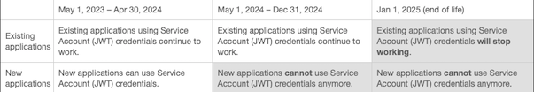

# 2023년 Customer Journey Analytics 릴리스 정보

## 2023년 11월 {#nov23}

| 기능 | 설명 | [롤아웃 시작](releases.md) | [일반 가용성](releases.md) |
| ----------- | ---------- | ------- | ---- |
| **Adobe Product Analytics의 [!UICONTROL 사용량] 보기에 새로 추가된 기능** | [사용량 보기](/help/guided-analysis/types/trends.md)에 다음과 같은 기능이 추가되었습니다.<ul><li>**추세선**: 이제 추세선이 지원됩니다. 차트 위의 [!UICONTROL 오버레이]를 클릭하여 이를 활성화할 수 있습니다.</li><li>**쿼리 분류**: 이제 이 보기 유형에 분류를 적용할 수 있습니다. 쿼리 레일에서 옵션으로 사용할 수 있습니다.</li></ul> | 해당 사항 없음 | 2023년 10월 25일 |
| **CJA 데이터 보기 API에 대한 설명서** | 프로그래밍 방식으로 데이터 보기를 생성, 수정 또는 삭제하는 방법을 알아보려면 [데이터 보기 API](https://developer.adobe.com/cja-apis/docs/endpoints/dataviews/)를 참조하십시오. | 해당 사항 없음 | 2023년 10월 16일 |

{style="table-layout:auto"}

## 2023년 10월 {#oct23}

| 기능 | 설명 | [롤아웃 시작](releases.md) | [일반 가용성](releases.md) |
| ----------- | ---------- | ------- | ---- |
| **조회 및 프로필 데이터 세트에 대한 행 수 지표** | 이전에는 이들 지표를 이벤트 데이터 세트에만 사용할 수 있었습니다. | 2023년 10월 16일 |
| **클라우드로 전체 테이블 내보내기** | Customer Journey Analytics 전체 테이블 내보내기를 사용하면 수백만 개의 Workspace 행을 클라우드 대상으로 내보낼 수 있습니다. 
전체 테이블 내보내기 기능은 연결된 테이블에서 최대 5개의 분류, 5개의 지표, 필터 및 계산된 지표를 모두 지원하며 Workspace 내에서 디자인된 데이터 테이블을 일회성 또는 예약된 게재로 제공합니다. 이는 현재 Data Warehouse에서 사용할 수 없지만 자주 요청되는 새로운 기능을 다수 포함하는 Adobe Analytics의 Data Warehouse 보고서에 대한 개선 사항입니다.

 클라우드 내보내기 옵션에는 다음과 같은 사항이 포함됩니다.
<ul><li>Adobe Experience Platform 데이터 랜딩 영역</li><li>Amazon S3 Role ARN</li><li>Google Cloud 플랫폼</li><li>Azure SAS</li><li>Azure RBAC</li><li>Snowflake</li></ul>자세한 내용은 [클라우드로 Customer Journey Analytics 보고서 내보내기](https://experienceleague.adobe.com/docs/analytics-platform/using/cja-workspace/export/export-cloud.html)를 참조하십시오. | 2023년 10월 4일 | 2023년 10월 19일 |
| **구성 요소 관리 시 새로운 열 사용 가능** | 이제 구성 요소 관리 시 [계산된 지표 관리자](https://experienceleague.adobe.com/docs/analytics-platform/using/cja-components/cja-calcmetrics/cm-workflow/cm-manager.html) 및 [필터 관리자](https://experienceleague.adobe.com/docs/analytics-platform/using/cja-components/cja-filters/manage-filters.html)에서 새로운 열을 사용할 수 있습니다.<ul><li>다음에서 사용</li><li>마지막 사용</li></ul>이 정보는 구성 요소가 조직의 사용자에게 유용한지, 어디에서 사용되는지, 삭제 또는 수정이 필요한지를 결정하는 데 도움이 됩니다. 이 정보와 함께 데이터 사전을 사용하면 조직에서 구성 요소가 사용되는 방식을 지속적으로 추적하고 보다 명확하게 파악할 수 있습니다. | 2023년 9월 23일 | 2023년 10월 4일 |
| **Adobe Analytics 프로젝트 및 포함된 모든 구성 요소를 Customer Journey Analytics로 마이그레이션** | 이제 Adobe Analytics 프로젝트를 Customer Journey Analytics로 마이그레이션할 수 있습니다. 이 프로세스는 Adobe Analytics에서 Customer Journey Analytics로의 전환을 간소화합니다. 
프로젝트를 Customer Journey Analytics로 마이그레이션하면 자산이 Adobe Analytics 보고서 세트에서 Customer Journey Analytics 데이터 보기로 매핑됩니다.
 
Adobe Analytics 인터페이스에서 Customer Journey Analytics로 프로젝트를 마이그레이션합니다. [자세히 알아보기](https://experienceleague.adobe.com/docs/analytics/admin/admin-tools/component-migration/prepare-component-migration.html)
 | 해당 사항 없음 | 2023년 10월 9일 |
| **Adobe Product Analytics: 시리즈 표시/숨기기** | 시각화에서 시리즈의 가시성을 제어하려면 차트 범례 또는 테이블 행을 클릭하십시오. [자세히 알아보기](https://experienceleague.adobe.com/docs/analytics-platform/using/guided-analysis/overview.html) | 해당 사항 없음 | 2023년 10월 4일 |
| **Adobe Product Analytics의 주석** | 이제 안내식 분석이 Customer Journey Analytics에서 생성된 주석을 조회하는 기능을 지원합니다. [자세히 알아보기](https://experienceleague.adobe.com/docs/analytics-platform/using/cja-components/annotations/overview.html) | 해당 사항 없음 | 2023년 10월 4일 |
| **보고 활동 관리자** | 보고 활동 관리자를 사용하면 조직에서의 각 연결에 대한 보고 용량을 확인할 수 있습니다. 이는 관리자에게 보고 사용량에 대해 상세한 가시성을 제공하며 최대 보고 시간 동안 발생할 수 있는 용량 문제를 쉽게 진단하고 해결할 수 있도록 해 줍니다. 보고 활동 관리자의 주요 기능은 다음과 같습니다.<ul><li>현재 보고 요청 취소 (안내식 분석 및 전체 테이블 내보내기 요청 포함)</li><li>정의된 기간 동안 후속 요청 제한</li></ul>현재 요청을 취소하는 것 외에도 관리자는 이제 정의된 기간 동안 요청을 제한할 수 있습니다. 관리자는 요청, 프로젝트 또는 사용자별로 요청을 제한할 수 있습니다. [자세히 알아보기](/help/reporting-activity-manager/reporting-activity-overview.md) | 2023년 10월 24일 | 2023년 10월 23일 |

{style="table-layout:auto"}

### Customer Journey Analytics의 수정 사항

AN-325940; AN-326468; AN-328301; AN-328640; AN-329370

### Customer Journey Analytics 관리자에 대한 중요 공지

| 공지 | 공지 추가 또는 업데이트됨 | 설명 |
| --- | --- | --- |
| 해당 사항 없음 | 해당 사항 없음 | 해당 사항 없음 |

{style="table-layout:auto"}

### 서비스 종료(EOL) 알림

| EOL 제품 또는 기능 | 추가 또는 업데이트 일자 | 설명 |
| --- | --- | --- |
| **Adobe I/O OAuth 서버 간 자격 증명으로 마이그레이션** | 2023년 5월 11일 | Adobe I/O JWT 자격 증명을 사용하는 Adobe Analytics API, Customer Journey Analytics API 및 Livestream 고객은 **2025년 1월 1일**&#x200B;까지 Adobe I/O OAuth 서버 간 자격 증명으로 마이그레이션해야 합니다. 2024년 5월 1일부터는 Adobe I/O를 사용하여 새 JWT 자격 증명을 만들 수 없습니다. JWT를 사용하는 고객은 OAuth 서버 간 자격 증명을 새로 만들거나 기존 JWT 자격 증명을 OAuth 서버 간 자격 증명으로 마이그레이션해야 합니다. 또한 고객은 새 OAuth 서버 간 자격 증명을 사용하려면 클라이언트 애플리케이션을 업데이트해야 합니다. <ul><li>[서비스 계정(JWT) 자격 증명에서 마이그레이션](https://developer.adobe.com/developer-console/docs/guides/authentication/ServerToServerAuthentication/migration/)</li><li>[새 OAuth 서버 간 자격 증명 사용](https://developer.adobe.com/developer-console/docs/guides/authentication/ServerToServerAuthentication/implementation/)</li><li>[FAQ](https://developer.adobe.com/developer-console/docs/guides/authentication/ServerToServerAuthentication/faqs/)</li></ul> |

{style="table-layout:auto"}

## 2023년 9월 {#sep23}

| 기능 | 설명 | [롤아웃 시작](releases.md) | [일반 가용성](releases.md) |
| ----------- | ---------- | ------- | ---- |
| **Analytics 소스 커넥터에서 A4T 분류 지원** | 이제 Adobe Analytics 소스 커넥터 스키마에서 `_experience.decisioning.propositions.scopeDetails.correlationID` 필드를 사용할 수 있습니다. 이 필드는 A4T 분류를 지원하는 데 사용되며 2023년 9월부터 채워질 예정입니다. | | 해당 사항 없음 | 2023년 9월 12일 |
| **파생 필드에 대한 업데이트 사항** | 파생 필드 기능이 다음과 같이 업데이트되었습니다.<ul><li>[!UICONTROL 조회] 기능이 [!UICONTROL 분류]로 이름이 변경되었으며 CSV 데이터를 로드할 수 있는 옵션이 추가되었습니다. **(2023년 9월 27일 릴리스)**</li><li>파생 필드를 정의할 때 사용할 수 있는 추가 기능으로는 [!UICONTROL 트리밍], [!UICONTROL 소문자] 및 [!UICONTROL 조회]가 있습니다.</li><li>이제 파생 필드 정의가 [!UICONTROL 조회] 및 [!UICONTROL 프로필] 데이터 세트의 필드도 지원합니다.</li></ul>[자세히 알아보기](/help/data-views/derived-fields/derived-fields.md) | 해당 사항 없음 | 2023년 9월 13일 |
| **Adobe Product Analytics의 새로운 기능** | <ul><li>**예외 항목 탐지**: 이벤트를 과거 추세에서 파생된 예상 값과 비교합니다. [자세히 알아보기](https://experienceleague.adobe.com/docs/analytics-platform/using/guided-analysis/trends/usage.html)</li><li>**사용 동향 빈도 보기**: 사용 빈도에 따라 기능 채택을 측정합니다. [자세히 알아보기](https://experienceleague.adobe.com/docs/analytics-platform/using/guided-analysis/trends/frequency.html)</li><li>**사용자 환경설정**: 색상 팔레트와 숫자 형식 등 다양한 사용자 환경설정을 구성합니다. [자세히 알아보기](https://experienceleague.adobe.com/docs/analytics-platform/using/cja-workspace/user-preferences.html)</li></ul> | 해당 사항 없음 | 2023년 9월 18일 |
| **Edge Network 디바이스 조회** | Experience Platform Edge Network를 통해 자동 디바이스 유형 데이터 수집을 활성화합니다. 이 서비스는 다른 Experience Platform 앱과 함께 Customer Journey Analytics에 유용합니다. [자세히 알아보기](https://experienceleague.adobe.com/docs/experience-platform/datastreams/configure.html#geolocation-device-lookup) | 해당 사항 없음 | 2023년 9월 27일 |
| **구성 요소 관리 시 새로운 열 사용 가능** | 이제 구성 요소 관리 시 [계산된 지표 관리자](/help/components/calc-metrics/cm-workflow/cm-manager.md) 및 [필터 관리자](/help/components/filters/manage-filters.md)에서 새로운 열을 사용할 수 있습니다.<ul><li>다음에서 사용</li><li>마지막 사용</li></ul>
이 정보는 구성 요소가 조직의 사용자에게 유용한지, 어디에서 사용되는지, 삭제 또는 수정이 필요한지를 결정하는 데 도움이 됩니다. 이 정보와 함께 데이터 사전을 사용하면 조직에서 구성 요소가 사용되는 방식을 지속적으로 추적하고 보다 명확하게 파악할 수 있습니다.
 | 2023년 9월 20일 | 2023년 10월 4일 |

{style="table-layout:auto"}

### Customer Journey Analytics의 수정 사항

AN-310972; AN-319509; AN-322245; AN-323411; AN-323719; AN-326101; AN-326125; AN-326888

### Customer Journey Analytics 관리자에 대한 중요 공지

| 공지 | 공지 추가 또는 업데이트됨 | 설명 |
| --- | --- | --- |
| 해당 사항 없음 | 해당 사항 없음 | 해당 사항 없음 |

{style="table-layout:auto"}

### 서비스 종료(EOL) 알림

| EOL 제품 또는 기능 | 추가 또는 업데이트 일자 | 설명 |
| --- | --- | --- |
| **Adobe I/O OAuth 서버 간 자격 증명으로 마이그레이션** | 2023년 5월 11일 | Adobe I/O JWT 자격 증명을 사용하는 Adobe Analytics API, Customer Journey Analytics API 및 Livestream 고객은 **2025년 1월 1일**&#x200B;까지 Adobe I/O OAuth 서버 간 자격 증명으로 마이그레이션해야 합니다. 2024년 5월 1일부터는 Adobe I/O를 사용하여 새 JWT 자격 증명을 만들 수 없습니다. JWT를 사용하는 고객은 OAuth 서버 간 자격 증명을 새로 만들거나 기존 JWT 자격 증명을 OAuth 서버 간 자격 증명으로 마이그레이션해야 합니다. 또한 고객은 새 OAuth 서버 간 자격 증명을 사용하려면 클라이언트 애플리케이션을 업데이트해야 합니다. <ul><li>[서비스 계정(JWT) 자격 증명에서 마이그레이션](https://developer.adobe.com/developer-console/docs/guides/authentication/ServerToServerAuthentication/migration/)</li><li>[새 OAuth 서버 간 자격 증명 사용](https://developer.adobe.com/developer-console/docs/guides/authentication/ServerToServerAuthentication/implementation/)</li><li>[FAQ](https://developer.adobe.com/developer-console/docs/guides/authentication/ServerToServerAuthentication/faqs/)</li></ul> |

{style="table-layout:auto"}

## 2023년 8월 {#aug23}

| 기능 | 설명 | [롤아웃 시작](releases.md) | [일반 가용성](releases.md) |
| ----------- | ---------- | ------- | ---- |
| **Report Builder 개선 사항** | <ul><li>통합 문서 탭에서 예약된 작업을 다운로드한 다음 제목을 지정하고, 저장하고, 공유할 수 있습니다. [자세히 알아보기](/help/report-builder/schedule-reportbuilder.md)</li><li>차원으로 시작 일자 옵션을 통해 데이터 블록 출력의 차원으로 데이터 블록의 시작 일자를 표시할 수 있습니다. [자세히 알아보기](/help/report-builder/create-a-data-block.md) </li></ul> | 해당 사항 없음 | 2023년 8월 17일 |
| **통화 전환** | 고객 여정에서 여러 통화를 지원하는 기능이 추가되고 있습니다. 데이터 보기 설정에서 통화를 다른 통화로 변환할 수 있습니다. [자세히 알아보기](/help/data-views/component-settings/format.md) | 해당 사항 없음 | 2023년 8월 30일 |

### Customer Journey Analytics의 수정 사항

AN-309141; AN-319198; AN-324576; AN-324939; AN-325138; AN-325554

### Customer Journey Analytics 관리자에 대한 중요 공지

| 공지 | 공지 추가 또는 업데이트됨 | 설명 |
| --- | --- | --- |
| **Customer Journey Analytics에서 데이터를 처리하는 방법 변경** | 2023년 6월 22일 | 최근 Customer Journey Analytics에서 데이터를 처리하는 방법이 변경되었습니다.<ul><li>타임스탬프가 24시간 미만인 모든 이벤트 데이터가 스트리밍됩니다.</li><li>타임스탬프가 24시간 이상 지난 모든 이벤트 데이터(최신 데이터와 동일한 배치에 있는 경우 포함)는 채우기로 간주되며 낮은 우선 순위로 수집됩니다.</li></ul> |

{style="table-layout:auto"}

### 서비스 종료(EOL) 알림

| EOL 제품 또는 기능 | 추가 또는 업데이트 일자 | 설명 |
| --- | --- | --- |
| **Adobe I/O OAuth 서버 간 자격 증명으로 마이그레이션** | 2023년 5월 11일 | Adobe I/O JWT 자격 증명을 사용하는 Adobe Analytics API, Customer Journey Analytics API 및 Livestream 고객은 **2025년 1월 1일**&#x200B;까지 Adobe I/O OAuth 서버 간 자격 증명으로 마이그레이션해야 합니다. 2024년 5월 1일부터는 Adobe I/O를 사용하여 새 JWT 자격 증명을 만들 수 없습니다. JWT를 사용하는 고객은 OAuth 서버 간 자격 증명을 새로 만들거나 기존 JWT 자격 증명을 OAuth 서버 간 자격 증명으로 마이그레이션해야 합니다. 또한 고객은 새 OAuth 서버 간 자격 증명을 사용하려면 클라이언트 애플리케이션을 업데이트해야 합니다. <ul><li>[서비스 계정(JWT) 자격 증명에서 마이그레이션](https://developer.adobe.com/developer-console/docs/guides/authentication/ServerToServerAuthentication/migration/)</li><li>[새 OAuth 서버 간 자격 증명 사용](https://developer.adobe.com/developer-console/docs/guides/authentication/ServerToServerAuthentication/implementation/)</li><li>[FAQ](https://developer.adobe.com/developer-console/docs/guides/authentication/ServerToServerAuthentication/faqs/)</li></ul> |

{style="table-layout:auto"}

## 2023년 7월 {#july23}

| 기능 | 설명 | [롤아웃 시작](releases.md) | [일반 가용성](releases.md) |
| ----------- | ---------- | ------- | ---- |
| **Adobe Product Analytics** | Adobe Product Analytics는 Customer Journey Analytics에서 교차 채널 데이터 및 인사이트와 상호 작용하는 새로운 방법입니다. 이러한 새로운 기능을 통해 제품 팀은 안내 분석 워크플로를 통해 제품 경험에 대한 데이터 및 인사이트를 자체 관리할 수 있습니다. 팀에서 수행할 수 있는 작업:<ul><li>시간 경과에 따른 사용자 참여 패턴 이해&#x200B;</li><li>제품 사용자 기반의 성장 및 유지 추적&#x200B;</li><li>제품의 마찰 영역 식별</li><li>기능 릴리스 및 최초 사용의 &#x200B; 영향 측정</li><li>제품을 사용하는 여정 동안 참여하고 육성할 의미 있는 사용자 세그먼트 탐색&#x200B;</li><li>분석가와의 심층 분석 및 공동 작업을 위해 Analysis Workspace와 연결</li></ul>Adobe Product Analytics는 Customer Journey Analytics의 유료 추가 기능입니다. 조직에서 이 기능을 사용하도록 프로비저닝하려면 Adobe 계정 팀에 문의하십시오. [자세히 알아보기](/help/guided-analysis/overview.md) | 해당 사항 없음 | 2023년 7월 17일 |
| **파생 필드** | 이는 파생 필드의 초기 릴리스를 나타냅니다. 파생 필드를 사용하면 사용자 정의 가능한 규칙 빌더를 통해 즉석에서 (종종 복잡한) 데이터 조작을 정의할 수 있습니다. 데이터 보기에서 파생 필드를 구성 요소(지표 또는 차원)로 추가 정의한 다음 파생 필드를 작업 영역에서 구성 요소로 사용할 수 있습니다.
이 릴리스는 마케팅 채널 템플릿과 다음 기능을 지원합니다.
<ul><li>연결</li><li>다음과 같은 경우</li><li>찾기 및 바꾸기</li><li>조회</li><li>URL 구문 분석</li></ul> 
[자세히 알아보기](/help/data-views/derived-fields/derived-fields.md)
 | 2023년 5월 10일 | 2023년 8월 2일 |
| **프로필 및 조회 데이터에 대한 조회 지원이 확장됨** | 프로필 또는 조회 데이터 세트 내의 필드 조회로 데이터 세트를 추가하는 기능을 제공합니다. 이전에는 이벤트 데이터 세트만 지원되었습니다. [자세히 알아보기](/help/connections/create-connection.md) | 2023년 6월 21일 | 2023년 7월 12일 |
| **Report Builder 개선 사항** | <ul><li>여러 데이터 블록에 대해 셀에서 필터링합니다. 셀에서 여러 데이터 블록에 대한 필터를 변경할 수 있습니다. 미리 정의된 셀을 사용하여 여러 데이터 블록에 할당하고 셀에 정의된 필터를 기반으로 데이터를 업데이트합니다. [자세히 알아보기](https://experienceleague.adobe.com/docs/analytics-platform/using/cja-reportbuilder/select-data-view.html)</li><li>행 및 열 헤더를 표시하거나 숨깁니다. 데이터 블록 테이블 헤더 또는 행 및 열 헤더를 표시하거나 숨겨 보고서의 테이블 형식을 다시 지정하고 데이터 블록을 정렬할 수 있습니다. [자세히 알아보기](https://experienceleague.adobe.com/docs/analytics-platform/using/cja-reportbuilder/create-a-data-block.html#build-the-data-block)</li></ul> | 해당 사항 없음 | 2023년 7월 19일 |

{style="table-layout:auto"}

### Customer Journey Analytics의 수정 사항

AN-317971, AN-319234, AN-320439, AN-320519, AN-321740, AN-322444, AN-323116

### Customer Journey Analytics 관리자에 대한 중요 공지

| 공지 | 공지 추가 또는 업데이트됨 | 설명 |
| --- | --- | --- |
| **Customer Journey Analytics에서 데이터를 처리하는 방법 변경** | 2023년 6월 22일 | 최근 Customer Journey Analytics에서 데이터를 처리하는 방법이 변경되었습니다.<ul><li>타임스탬프가 24시간 미만인 모든 이벤트 데이터가 스트리밍됩니다.</li><li>타임스탬프가 24시간 이상 지난 모든 이벤트 데이터(최신 데이터와 동일한 배치에 있는 경우 포함)는 채우기로 간주되며 낮은 우선 순위로 수집됩니다.</li></ul> |

{style="table-layout:auto"}

### 서비스 종료(EOL) 알림

| EOL 제품 또는 기능 | 추가 또는 업데이트 일자 | 설명 |
| --- | --- | --- |
| **Adobe I/O OAuth 서버 간 자격 증명으로 마이그레이션** | 2023년 5월 11일 | Adobe I/O JWT 자격 증명을 사용하는 Adobe Analytics API, Customer Journey Analytics API 및 Livestream 고객은 **2025년 1월 1일**&#x200B;까지 Adobe I/O OAuth 서버 간 자격 증명으로 마이그레이션해야 합니다. 2024년 5월 1일부터는 Adobe I/O를 사용하여 새 JWT 자격 증명을 만들 수 없습니다. JWT를 사용하는 고객은 OAuth 서버 간 자격 증명을 새로 만들거나 기존 JWT 자격 증명을 OAuth 서버 간 자격 증명으로 마이그레이션해야 합니다. 또한 고객은 새 OAuth 서버 간 자격 증명을 사용하려면 클라이언트 애플리케이션을 업데이트해야 합니다. <ul><li>[서비스 계정(JWT) 자격 증명에서 마이그레이션](https://developer.adobe.com/developer-console/docs/guides/authentication/ServerToServerAuthentication/migration/)</li><li>[새 OAuth 서버 간 자격 증명 사용](https://developer.adobe.com/developer-console/docs/guides/authentication/ServerToServerAuthentication/implementation/)</li><li>[FAQ](https://developer.adobe.com/developer-console/docs/guides/authentication/ServerToServerAuthentication/faqs/)</li></ul> |

{style="table-layout:auto"}

## 2023년 6월 {#june23}

### 릴리스 하이라이트

| 기능 | 설명 | [롤아웃 시작](releases.md) | [일반 가용성](releases.md) |
| ----------- | ---------- | ------- | ---- |
| **교차 채널 분석 및 결합 설명서 업데이트** | 결합을 활성화하고 이 결합을 사용하여 교차 채널 분석을 향상할 수 있는 방법을 추가로 명확히 하기 위한 향후 변경 사항을 예상하여 교차 채널 분석 기능과 관련된 문서가 [교차 채널 분석](../use-cases/cross-channel/cross-channel.md)을 Customer Journey Analytics 기능 및 사용 사례로 참조하고 [결합](../stitching/overview.md)을 이를 달성하기 위한 중요한 기능으로 참조하도록 편집되었습니다. | 2023년 6월 28일 | 2023년 6월 28일 |
| **지능형 캡션** | [!UICONTROL 라인] 시각화의 자연어 요약으로 사용자를 위한 스토리텔링을 풍부하게 합니다. [자세히 알아보기](/help/analysis-workspace/visualizations/intelligent-captions.md) | 2023년 5월 17일 | 2023년 6월 1일 |
| **프로젝트 링크 공유 (로그인 불필요)** | 이제 Adobe Analytics에 액세스할 수 없는 사용자에게 Analysis Workspace 프로젝트에 대한 읽기 전용 링크를 공유할 수 있습니다. 여기에는 조직 외부의 사용자 또는 Adobe Analytics용으로 프로비저닝되지 않은 조직 내의 사용자와의 공유가 포함됩니다. [자세히 알아보기](https://experienceleague.adobe.com/docs/analytics/analyze/analysis-workspace/curate-share/share-projects.html#share-public-link) 
이 기능은 기본적으로 활성화되어 있으며 시스템 관리자가 비활성화할 수 있습니다. [자세히 알아보기](https://experienceleague.adobe.com/docs/analytics/analyze/analysis-workspace/user-preferences.html#company-preferences)
 | 2023년 5월 3일 | 2023년 6월 6일 |
| **파생 필드** | 이는 파생 필드의 초기 릴리스를 나타냅니다. 파생 필드를 사용하면 사용자 정의 가능한 규칙 빌더를 통해 즉석에서 (종종 복잡한) 데이터 조작을 정의할 수 있습니다. 데이터 보기에서 파생 필드를 구성 요소(지표 또는 차원)로 추가 정의한 다음 파생 필드를 작업 영역에서 구성 요소로 사용할 수 있습니다.
이 릴리스는 마케팅 채널 템플릿과 다음 기능을 지원합니다.
<ul><li>연결</li><li>다음과 같은 경우</li><li>찾기 및 바꾸기</li><li>조회</li><li>URL 구문 분석</li></ul> 
[자세히 알아보기](/help/data-views/derived-fields/derived-fields.md)
 | 2023년 5월 10일 | 2023년 8월 2일 |
| **통화 전환 지원** | 데이터 보기에서 지표 구성 요소 서식을 지정하는 일부로 통화 전환이 지원됩니다. [자세히 알아보기](../data-views/component-settings/format.md#currency) | 2023년 6월 7일 | 2023년 8월 31일 |
| **프로필 및 조회 데이터에 대한 조회 지원이 확장됨** | 조회 데이터 세트를 이벤트 데이터 세트와 프로필 및 조회 데이터 세트에도 추가할 수 있습니다. | 2023년 6월 28일 | 2023년 7월 12일 |
| **Edge Network 지역 조회** | Customer Journey Analytics에서 지리적 위치 데이터를 사용할 수 있습니다. 데이터스트림 설정에서 이 기능을 활성화합니다. [자세히 알아보기](https://experienceleague.adobe.com/docs/experience-platform/datastreams/configure.html#geolocation-network-lookup) |  | 2023년 7월 26일 |

{style="table-layout:auto"}

### 기타 새로운 기능 또는 업데이트

| 기능 | 설명 | [롤아웃 시작](releases.md) | [일반 가용성](releases.md) |
| ----------- | ---------- | ------- | ---- |
| **Adobe Journey Optimizer 데이터 보기** | Customer Journey Analytics 관리자는 Customer Journey Analytics에서 “AJO 데이터 보기(샌드박스-이름)”의 일부 추가 데이터 보기에 액세스할 수 있습니다. 이러한 데이터 보기는 Adobe Journey Optimizer의 보고서를 지원하는 데 사용됩니다. 또한 Customer Journey Analytics에서 Adobe Journey Optimizer 활동에 대한 심층 분석을 수행하는 데 사용할 수도 있습니다. [자세히 알아보기](https://experienceleague.adobe.com/en/docs/journey-optimizer/using/channel-report/reporting-configuration) | | 2023년 5월 25일 |
| **비프로덕션 샌드박스용 채우기** | 비프로덕션 샌드박스에서 Analytics 소스 커넥터 데이터 흐름을 생성할 때 비프로덕션 샌드박스의 채우기는 3개월로 제한됩니다. 프로덕션 샌드박스의 경우 13개월로 유지됩니다. | 해당 사항 없음 | 2023년 4월 26일 |
| **프로젝트 링크 공유 (로그인 불필요)** | 이제 Adobe Analytics에 액세스할 수 없는 사용자에게 Analysis Workspace 프로젝트에 대한 읽기 전용 링크를 공유할 수 있습니다. 여기에는 조직 외부의 사용자 또는 Adobe Analytics용으로 프로비저닝되지 않은 조직 내의 사용자와의 공유가 포함됩니다. [자세히 알아보기](https://experienceleague.adobe.com/docs/analytics-platform/using/cja-workspace/curate-share/share-projects.html#share-public-link) 
이 기능은 기본적으로 활성화되어 있으며 시스템 관리자가 비활성화할 수 있습니다. [자세히 알아보기](https://experienceleague.adobe.com/docs/analytics-platform/using/cja-workspace/user-preferences.html#ims-organization-preferences)
 | 2023년 5월 3일 | 2023년 6월 6일 |
| **Analytics 대시보드 앱(모바일 앱)에 대한 홈 화면 업데이트** | 새롭게 업데이트된 홈 화면에서는 모든 스코어카드를 하나의 통합된 스코어카드 목록에서 볼 수 있습니다.  한 번의 로그인으로 두 개 이상의 조직에 액세스할 수 있는 경우, 조직의 모든 스코어카드를 단일 목록에서 사용할 수 있습니다. [자세히 알아보기](https://experienceleague.adobe.com/docs/analytics-platform/using/cja-dashboards/executive.html#use-dashboards) | 해당 사항 없음 | 2023년 5월 10일 |
| **Customer Journey Analytics용 Report Builder - 셀에서 데이터 보기 선택** | 이 기능을 사용하면 사용자가 셀에서 데이터 블록에 대한 데이터 보기를 선택할 수 있습니다. 이는 통합 문서를 만들고 데이터 구성이 유사한 여러 데이터 보기가 있고 서로 다른 데이터 보기에서 통합 문서를 여러 번 재사용하려는 경우에 유용합니다. [자세히 알아보기](https://experienceleague.adobe.com/docs/analytics-platform/using/cja-reportbuilder/select-data-view.html) | 해당 사항 없음 | 2023년 5월 24일 |
| **Customer Journey Analytics에 대한 업데이트된 학습 페이지** | Customer Journey Analytics 랜딩 페이지의 학습 탭에는 이제 Adobe Analytics에서 Customer Journey Analytics로의 전환에 중점을 둔 콘텐츠를 포함하여 Customer Journey Analytics와 관련된 콘텐츠가 포함되어 있습니다.
다음과 같은 추가 개선 사항도 학습 탭에서 이용할 수 있습니다.
<ul><li>개선된 탐색 기능으로 단일 페이지에 더 많은 학습 콘텐츠를 표시하는 개선된 디자인</li><li>경험 수준(초급, 중급, 고급)에 따라 학습 콘텐츠를 맞춤 설정하는 기능</li></ul>
이전에는 Customer Journey Analytics의 학습 탭에 Adobe Analytics의 학습 탭과 동일한 정보가 포함되어 있었습니다.
 [자세히 알아보기](https://experienceleague.adobe.com/docs/analytics-platform/using/cja-overview/landing.html#navigate-learning) | 2023년 6월 27일 | 2023년 6월 30일 |
| **Analysis Workspace의 구성 요소 정렬** | 
이제 왼쪽 레일 또는 Analysis Workspace의 데이터 사전에서 구성 요소를 볼 때 새로운 정렬 옵션을 사용할 수 있습니다. 권장(가장 일반적으로 사용되는 구성 요소), 알파벳순 또는 범주(유형)별로 구성 요소를 정렬할 수 있습니다.

이전에는 구성 요소만 검색하거나 필터링만 할 수 있었습니다. [자세히 알아보기](/help/components/overview.md)
 | 해당 사항 없음 | 2023년 6월 7일 |
| **자유 형식 테이블에서 동적 차원이 포함된 행 삭제** | 이제 Analysis Workspace의 자유 형식 테이블에서 x 아이콘을 사용하여 동적 차원이 포함된 특정 행을 신속하게 삭제할 수 있습니다. 이렇게 하면 “항상 항목 제외” 필터 규칙이 자동으로 적용됩니다.
이전에는 동적 차원이 포함된 행을 삭제하는 유일한 방법은 필터 대화 상자에서 수동으로 규칙을 만드는 것이었습니다. [자세히 알아보기](/help/analysis-workspace/visualizations/freeform-table/filter-and-sort.md)
 | 해당 사항 없음 | 2023년 5월 17일 |
| **패널 내에 시각화를 추가하는 새 버튼** | 이제 Analysis Workspace의 각 패널 하단에 새로운 버튼이 추가되어 시각화를 빠르게 추가할 수 있습니다. 
이전에는 패널에 시각화를 추가하는 유일한 방법은 왼쪽 레일에서 시각화를 드래그하거나, 기존 시각화를 복제 또는 복사하거나, 빈 패널을 만드는 것이었습니다. [자세히 알아보기](/help/analysis-workspace/visualizations/freeform-analysis-visualizations.md)
 | 해당 사항 없음 | 2023년 5월 17일 |
| **딥 링크 (모바일 앱)** | 사용자가 앱의 스코어카드 프로젝트로 바로 연결되는 스코어카드 링크를 보낼 수 있습니다. 이를 통해 프로젝트를 보다 쉽게 공유하고 기술 수준이 낮은 대상자의 참여를 높일 수 있습니다. [자세히 알아보기](https://experienceleague.adobe.com/docs/analytics-platform/using/cja-dashboards/create-scorecard.html#share-scorecards-using-a-shareable-link) | 해당 사항 없음 | 2023년 5월 17일 |
| **지능형 캡션** | [!UICONTROL 라인] 시각화의 자연어 요약으로 사용자를 위한 스토리텔링을 풍부하게 합니다. [자세히 알아보기](/help/analysis-workspace/visualizations/intelligent-captions.md) | 2023년 5월 17일 | 2023년 6월 1일 |

{style="table-layout:auto"}

### Customer Journey Analytics의 수정 사항

AN-318343; AN-319453

### Customer Journey Analytics 관리자에 대한 중요 공지

| 공지 | 공지 추가 또는 업데이트됨 | 설명 |
| --- | --- | --- |
| Customer Journey Analytics에서 데이터를 처리하는 방법 변경 | 2023년 6월 22일 | 최근 Customer Journey Analytics에서 데이터를 처리하는 방법이 변경되었습니다.<ul><li>타임스탬프가 24시간 미만인 모든 이벤트 데이터가 스트리밍됩니다.</li><li>타임스탬프가 24시간 이상 지난 모든 이벤트 데이터(최신 데이터와 동일한 배치에 있는 경우 포함)는 채우기로 간주되며 낮은 우선 순위로 수집됩니다.</li></ul> |

### 서비스 종료(EOL) 알림

| EOL 제품 또는 기능 | 추가 또는 업데이트 일자 | 설명 |
| --- | --- | --- |
| **Adobe I/O OAuth 서버 간 자격 증명으로 마이그레이션** | 2023년 5월 11일 | AdobeIO JWT 자격 증명을 사용하는 Adobe Analytics API, Customer Journey Analytics API 및 Livestream 고객은 **2025년 1월 1일**&#x200B;까지 AdobeIO OAuth 서버 간 자격 증명으로 마이그레이션해야 합니다. 2024년 5월 1일부터는 Adobe I/O를 사용하여 새 JWT 자격 증명을 만들 수 없습니다. JWT를 사용하는 고객은 OAuth 서버 간 자격 증명을 새로 만들거나 기존 JWT 자격 증명을 OAuth 서버 간 자격 증명으로 마이그레이션해야 합니다. 또한 고객은 새 OAuth 서버 간 자격 증명을 사용하려면 클라이언트 애플리케이션을 업데이트해야 합니다. <ul><li>[서비스 계정(JWT) 자격 증명에서 마이그레이션](https://developer.adobe.com/developer-console/docs/guides/authentication/ServerToServerAuthentication/migration/)</li><li>[새 OAuth 서버 간 자격 증명 사용](https://developer.adobe.com/developer-console/docs/guides/authentication/ServerToServerAuthentication/implementation/)</li><li>[FAQ](https://developer.adobe.com/developer-console/docs/guides/authentication/ServerToServerAuthentication/faqs/)</li></ul> |

{style="table-layout:auto"}

## 2023년 5월 {#may23}

| 기능 | 설명 | [롤아웃 시작](releases.md) | [일반 가용성](releases.md) |
| ----------- | ---------- | ------- | ---- |
| **Adobe Journey Optimizer 데이터 보기** | Customer Journey Analytics 관리자는 Customer Journey Analytics에서 “AJO 데이터 보기(샌드박스-이름)”의 일부 추가 데이터 보기에 액세스할 수 있습니다. 이러한 데이터 보기는 Adobe Journey Optimizer의 보고서를 지원하는 데 사용됩니다. 또한 Customer Journey Analytics에서 Adobe Journey Optimizer 활동에 대한 심층 분석을 수행하는 데 사용할 수도 있습니다. [자세히 알아보기](https://experienceleague.adobe.com/en/docs/journey-optimizer/using/channel-report/reporting-configuration) | | 2023년 5월 25일 |
| **비프로덕션 샌드박스용 채우기** | 비프로덕션 샌드박스에서 Analytics 소스 커넥터 데이터 흐름을 생성할 때 비프로덕션 샌드박스의 채우기는 3개월로 제한됩니다. 프로덕션 샌드박스의 경우 13개월로 유지됩니다. | 해당 사항 없음 | 2023년 4월 26일 |
| **프로젝트 링크 공유 (로그인 불필요)** | 이제 Adobe Analytics에 액세스할 수 없는 사용자에게 Analysis Workspace 프로젝트에 대한 읽기 전용 링크를 공유할 수 있습니다. 여기에는 조직 외부의 사용자 또는 Adobe Analytics용으로 프로비저닝되지 않은 조직 내의 사용자와의 공유가 포함됩니다. [자세히 알아보기](https://experienceleague.adobe.com/docs/analytics/analyze/analysis-workspace/curate-share/share-projects.html#share-public-link) 
이 기능은 기본적으로 활성화되어 있으며 시스템 관리자가 비활성화할 수 있습니다. [자세히 알아보기](https://experienceleague.adobe.com/docs/analytics/analyze/analysis-workspace/user-preferences.html#company-preferences)
 | 2023년 5월 3일 | 2023년 6월 5일 |
| **Analytics 대시보드 앱(모바일 앱)에 대한 홈 화면 업데이트** | 새롭게 업데이트된 홈 화면에서는 모든 스코어카드를 하나의 통합된 스코어카드 목록에서 볼 수 있습니다.  한 번의 로그인으로 두 개 이상의 조직에 액세스할 수 있는 경우, 조직의 모든 스코어카드를 단일 목록에서 사용할 수 있습니다. [자세히 알아보기](https://experienceleague.adobe.com/docs/analytics-platform/using/cja-dashboards/executive.html#use-dashboards) | 해당 사항 없음 | 2023년 5월 10일 |
| **파생 필드** | 이는 파생 필드의 초기 릴리스를 나타냅니다. 파생 필드를 사용하면 사용자 정의 가능한 규칙 빌더를 통해 즉석에서 (종종 복잡한) 데이터 조작을 정의할 수 있습니다. 데이터 보기에서 파생 필드를 구성 요소(지표 또는 차원)로 추가 정의한 다음 파생 필드를 작업 영역에서 구성 요소로 사용할 수 있습니다.
이 릴리스는 마케팅 채널 템플릿과 다음 기능을 지원합니다.
<ul><li>연결</li><li>다음과 같은 경우</li><li>찾기 및 바꾸기</li><li>조회</li><li>URL 구문 분석</li></ul> 
[자세히 알아보기](https://experienceleague.adobe.com/docs/analytics-platform/using/cja-dataviews/derived-fields.html)
 | 2023년 5월 10일 | 2023년 8월 2일 |
| **Customer Journey Analytics용 Report Builder - 셀에서 데이터 보기 선택** | 이 기능을 사용하면 사용자가 셀에서 데이터 블록에 대한 데이터 보기를 선택할 수 있습니다. 이는 통합 문서를 만들고 데이터 구성이 유사한 여러 데이터 보기가 있고 서로 다른 데이터 보기에서 통합 문서를 여러 번 재사용하려는 경우에 유용합니다. [자세히 알아보기](https://experienceleague.adobe.com/docs/analytics-platform/using/cja-reportbuilder/select-data-view.html) | 해당 사항 없음 | 2023년 5월 24일 |
| **Analysis Workspace의 구성 요소 정렬** | 
이제 왼쪽 레일 또는 Analysis Workspace의 데이터 사전에서 구성 요소를 볼 때 새로운 정렬 옵션을 사용할 수 있습니다. 권장(가장 일반적으로 사용되는 구성 요소), 알파벳순 또는 범주(유형)별로 구성 요소를 정렬할 수 있습니다.

이전에는 구성 요소만 검색하거나 필터링만 할 수 있었습니다. [자세히 알아보기](/help/components/overview.md)
 | 해당 사항 없음 | TBD |
| **자유 형식 테이블에서 동적 차원이 포함된 행 삭제** | 이제 Analysis Workspace의 자유 형식 테이블에서 x 아이콘을 사용하여 동적 차원이 포함된 특정 행을 신속하게 삭제할 수 있습니다. 이렇게 하면 “항상 항목 제외” 필터 규칙이 자동으로 적용됩니다.
이전에는 동적 차원이 포함된 행을 삭제하는 유일한 방법은 필터 대화 상자에서 수동으로 규칙을 만드는 것이었습니다. [자세히 알아보기](/help/analysis-workspace/visualizations/freeform-table/filter-and-sort.md)
 | 해당 사항 없음 | 2023년 5월 17일 |
| **패널 내에 시각화를 추가하는 새 버튼** | 이제 Analysis Workspace의 각 패널 하단에 새로운 버튼이 추가되어 시각화를 빠르게 추가할 수 있습니다. 
이전에는 패널에 시각화를 추가하는 유일한 방법은 왼쪽 레일에서 시각화를 드래그하거나, 기존 시각화를 복제 또는 복사하거나, 빈 패널을 만드는 것이었습니다. [자세히 알아보기](/help/analysis-workspace/visualizations/freeform-analysis-visualizations.md)
 | 해당 사항 없음 | 2023년 5월 17일 |
| **딥 링크 (모바일 앱)** | 사용자가 앱의 스코어카드 프로젝트로 바로 연결되는 스코어카드 링크를 보낼 수 있습니다. 이를 통해 프로젝트를 보다 쉽게 공유하고 기술 수준이 낮은 대상자의 참여를 높일 수 있습니다. [자세히 알아보기](https://experienceleague.adobe.com/docs/analytics-platform/using/cja-dashboards/create-scorecard.html#share-scorecards-using-a-shareable-link) | 해당 사항 없음 | 2023년 5월 17일 |
| **지능형 캡션** | [!UICONTROL 라인] 시각화의 자연어 요약으로 사용자를 위한 스토리텔링을 풍부하게 합니다. [자세히 알아보기](/help/analysis-workspace/visualizations/intelligent-captions.md) | 2023년 5월 17일 | 2023년 6월 1일 |

{style="table-layout:auto"}

### Customer Journey Analytics의 수정 사항

AN-316412; AN-317105; AN-318122; AN-317353

### Customer Journey Analytics 관리자에 대한 중요 공지

| 공지 | 공지 추가 또는 업데이트됨 | 설명 |
| --- | --- | --- |
| 해당 사항 없음 | 해당 사항 없음 | 해당 사항 없음 |

### 서비스 종료(EOL) 알림

| EOL 제품 또는 기능 | 추가 또는 업데이트 일자 | 설명 |
| --- | --- | --- |
| **Adobe I/O OAuth 서버 간 자격 증명으로 마이그레이션** | 2023년 5월 11일 | AdobeIO JWT 자격 증명을 사용하는 Adobe Analytics API, Customer Journey Analytics API 및 Livestream 고객은 **2025년 1월 1일**&#x200B;까지 AdobeIO OAuth 서버 간 자격 증명으로 마이그레이션해야 합니다. 2024년 5월 1일부터는 Adobe I/O를 사용하여 새 JWT 자격 증명을 만들 수 없습니다. JWT를 사용하는 고객은 OAuth 서버 간 자격 증명을 새로 만들거나 기존 JWT 자격 증명을 OAuth 서버 간 자격 증명으로 마이그레이션해야 합니다. 또한 고객은 새 OAuth 서버 간 자격 증명을 사용하려면 클라이언트 애플리케이션을 업데이트해야 합니다. <ul><li>[서비스 계정(JWT) 자격 증명에서 마이그레이션](https://developer.adobe.com/developer-console/docs/guides/authentication/ServerToServerAuthentication/migration/)</li><li>[새 OAuth 서버 간 자격 증명 사용](https://developer.adobe.com/developer-console/docs/guides/authentication/ServerToServerAuthentication/implementation/)</li><li>[FAQ](https://developer.adobe.com/developer-console/docs/guides/authentication/ServerToServerAuthentication/faqs/)</li></ul> |

{style="table-layout:auto"}

## 2023년 4월 {#april23}

| 기능 | 설명 | [롤아웃 시작](/help/release-notes/releases.md) | [일반 가용성](/help/release-notes/releases.md) |
| ----------- | ---------- | ----- | --- |
| **Analytics 소스 커넥터 스트리밍을 위한 행/열 필터링** | 이제 Adobe Experience Platform의 Analytics 소스 커넥터를 통해 [실시간 고객 프로필](https://experienceleague.adobe.com/docs/experience-platform/profile/home.html?lang=ko-KR)에 프로필을 채우는 데 사용되는 Analytics 데이터를 필터링할 수 있습니다. 행 수준 필터링은 프로필과 관련된 이벤트 수를 줄이는 데 도움이 됩니다. 열 수준 필터링은 이벤트 자체의 내용을 줄이는 데 도움이 되므로 프로필 자격 사용을 최적화할 수 있습니다. 이 필터링은 실시간 고객 프로필 및 [ID 서비스](https://experienceleague.adobe.com/docs/experience-platform/sources/home.html?lang=ko-KR)로 전송된 데이터에만 적용됩니다. **필터링은 Customer Journey Analytics와 같은 애플리케이션에서 사용하기 위해 데이터 레이크로 전송되는 데이터에 영향을 미치지 않습니다**. [자세히 알아보기](https://experienceleague.adobe.com/docs/experience-platform/sources/ui-tutorials/create/adobe-applications/analytics.html#filtering-for-profile) | 해당 사항 없음 | 2023년 3월 29일 |
| **Analysis Workspace의 데이터 사전** | 데이터 사전을 통해 사용자와 관리자 모두가 Customer Journey Analytics 환경의 구성 요소(차원, 지표)를 추적하고 더 잘 이해할 수 있습니다. [자세히 알아보기](/help/components/data-dictionary/data-dictionary-overview.md) | 2023년 3월 8일 | 2023년 3월 29일 |
| **프로젝트 링크 공유 (로그인 불필요)** | 
이제 Adobe Analytics에 액세스할 수 없는 사용자에게 Analysis Workspace 프로젝트에 대한 읽기 전용 링크를 공유할 수 있습니다. 여기에는 조직 외부의 사용자 또는 Customer Journey Analytics용으로 프로비저닝되지 않은 조직 내의 사용자와의 공유가 포함됩니다. [자세히 알아보기](https://experienceleague.adobe.com/docs/analytics-platform/using/cja-workspace/curate-share/share-projects.html#share-public-link)
 
이 기능은 기본적으로 활성화되어 있으며 시스템 관리자가 비활성화할 수 있습니다. [자세히 알아보기](https://experienceleague.adobe.com/docs/analytics-platform/using/cja-workspace/user-preferences.html#company-preferences)
 | 2023년 5월 3일 | 2023년 6월 |
| **Adobe Product Analytics - Private Beta 액세스 전용** | 2023년 3월 21일, Adobe는 Customer Journey Analytics에서 교차 채널 데이터 및 인사이트와 상호 작용하는 새로운 방법인 Adobe Product Analytics를 발표했습니다. 이러한 새로운 기능을 통해 제품 팀은 안내 분석 워크플로를 통해 제품 경험에 대한 데이터 및 인사이트를 자체 관리할 수 있습니다. 팀에서 수행할 수 있는 작업:<ul><li>시간 경과에 따른 사용자 참여 패턴 이해&#x200B;</li><li>사용자 기반 성장 분석&#x200B;</li><li>일련의 단계에서 마찰 영역 식별&#x200B;</li><li>기능 릴리스의 영향 측정&#x200B;</li><li>제품을 사용하는 여정 동안 참여하고 육성할 의미 있는 세그먼트 탐색&#x200B;</li><li>분석가와의 심층 분석 및 공동 작업 등을 위해 Analysis Workspace에서 엽니다!&#x200B;</li></ul>Customer Journey Analytics 고객이고 Private Beta 참여에 관심이 있는 경우, Adobe 계정 팀에 문의하십시오. [자세히 알아보기](https://business.adobe.com/products/product-analytics/adobe-product-analytics.html) | 해당 사항 없음 | 2023년 7월 17일 |

{style="table-layout:auto"}

## Customer Journey Analytics의 수정 사항

AN-313118; AN-313390; AN-314135; AN-316381; AN-316811

## 2023년 3월 {#mar23}

| 기능 | 설명 | [롤아웃 시작](/help/release-notes/releases.md) | [일반 가용성](/help/release-notes/releases.md) |
| ----------- | ---------- | ----- | --- |
| Analysis Workspace의 데이터 사전 | 데이터 사전을 통해 사용자와 관리자 모두가 Customer Journey Analytics 환경의 구성 요소(차원, 지표)를 추적하고 더 잘 이해할 수 있습니다. 자세히 알아보기 | 2023년 3월 8일 | 일시적으로 사용할 수 없음 |
| Mobile Dashboards의 데이터 스토리 | 데이터 스토리를 사용하면 모바일 스코어카드 프로젝트의 타일에 여러 맞춤형 세부 정보 보기를 추가할 수 있습니다. 데이터 스토리를 사용하여 주요 동인, 관련 지표 및 고객 여정의 여러 단계에 대해 자세히 알아보십시오. 이러한 보기를 쉽게 스와이프하여 주요 지표 뒤에 있는 전체 스토리를 이해할 수 있습니다. | 자세히 알아보기 | 해당 사항 없음 | 2023년 3월 8일 |
| 예약된 프로젝트의 만료 날짜 | 일정 빈도와 관계없이 예약된 프로젝트의 최대 만료 날짜를 1년까지 설정할 수 있습니다. | 자세히 알아보기 | 해당 사항 없음 | 2023년 3월 8일 |
| 프로젝트 링크 공유(로그인 불필요) - Private Beta 액세스 전용 | 이제 Customer Journey Analytics에 액세스할 수 없는 사용자에게 Analysis Workspace 프로젝트에 대한 읽기 전용 링크를 공유할 수 있습니다. 조직 외부의 사람들 또는 Customer Journey Analytics에 대해 프로비저닝되지 않은 조직 내의 사람들과 프로젝트 링크를 공유할 수 있습니다. 자세히 알아보기 Private Beta에 참여하려면 Adobe 계정 팀에 문의하십시오. | 2023년 4월 26일 | 2023년 6월 |
| 패널 날짜 범위 업데이트 | Workspace에서 다음 개선 사항이 추가되었습니다.<ul><li>2월 릴리스부터 차원 항목 및 데이터 미리보기는 지난 90일이 아닌 패널 날짜 범위를 기반으로 합니다.</li><li>나열된 모든 차원 항목은 패널 날짜 범위 내의 데이터를 기반으로 합니다. 차원 항목에 날짜 범위를 벗어난 데이터가 있는 경우 목록 맨 아래에 날짜 범위를 벗어난 추가 데이터를 표시할 수 있습니다.</li><li>데이터가 없는 차원은 왼쪽 레일에 표시될 수 있습니다. 패널 날짜 범위를 벗어난 데이터가 있는 차원 항목을 보려면 [!UICONTROL 자세히 표시] 옵션을 클릭하십시오.</li><li>세그먼트 및 계산된 지표 빌더의 데이터 미리보기는 패널 날짜 범위를 기반으로 하지만 구성 요소 관리자에서 액세스하는 경우엔 연결된 패널이 없기 때문에 여전히 지난 90일을 기반으로 합니다.</li><li>데이터 미리보기는 패널 날짜 범위를 기반으로 데이터 또는 구성 요소를 표시합니다.</li></ul> | 해당 사항 없음 | 2023년 2월 8일 |

{style="table-layout:auto"}

### Customer Journey Analytics의 수정 사항

AN-309729; AN-309975; AN-311779; AN-313095

### Customer Journey Analytics 관리자에 대한 중요 공지

| 공지 | 공지 추가 또는 업데이트됨 | 설명 |
| --- | --- | --- |
| Analytics 소스 커넥터 가용성 | 2023년 2월 15일 | 2023년 2월 28일부터 캐나다에 있는 새로운 Adobe Experience Platform 데이터 센터에서 Analytics 소스 커넥터를 사용할 수 있습니다. |

{style="table-layout:auto"}

## 2023년 2월 {#feb23}

| 기능 | 설명 | [롤아웃 시작](/help/release-notes/releases.md) | [일반 가용성](/help/release-notes/releases.md) |
| ----------- | ---------- | ----- | --- |
| **Customer Journey Analytics 대상자 업데이트** | 대상자가 생성된 후 Adobe는 각각의 새로운 Customer Journey Analytics 대상자에 대해 Experience Platform 스트리밍 세그먼트를 만듭니다. 스트리밍 세그먼트는 조직이 스트리밍 세분화에 대해 설정된 경우에만 생성됩니다. [자세히 알아보기](https://experienceleague.adobe.com/docs/analytics-platform/using/cja-components/audiences/publish.html#after-audience-created) | 해당 사항 없음 | 2023년 2월 3일 |
| **모바일 스코어카드에서 비교 날짜 범위 숨기기** | 이제 모바일 스코어카드를 사용하여 비교 날짜 범위를 숨길 수 있습니다. | 해당 사항 없음 | 2023년 2월 8일 |
| **Workspace의 캘린더 업데이트** | <ul><li>앵커 패널 날짜: 패널 캘린더를 기준으로 날짜 범위 구성 요소를 만들 수 있습니다. [자세히 알아보기](/help/components/date-ranges/overview.md)</li><li>캘린더 스타일 업데이트: UI 전체의 캘린더 스타일이 업그레이드되어 보다 일관되고 사용하기 쉬운 워크플로를 제공합니다.</li><li>캘린더 수식 업데이트: 상대 날짜를 사용하는 경우 모든 캘린더 수식이 패널 날짜 범위의 시작을 반영합니다. [자세히 알아보기](/help/components/date-ranges/overview.md)</li></ul> | 해당 사항 없음 | 2023년 2월 8일 |
| **패널 날짜 범위 업데이트** | Workspace에서 다음 개선 사항이 추가되었습니다.<ul><li>2월 릴리스부터 차원 항목 및 데이터 미리보기는 지난 90일이 아닌 패널 날짜 범위를 기반으로 합니다. </li><li>나열된 모든 차원 항목은 패널 날짜 범위 내의 데이터를 기반으로 합니다. 차원 항목에 날짜 범위를 벗어난 데이터가 있는 경우 목록 맨 아래에 날짜 범위를 벗어난 추가 데이터를 표시할 수 있습니다.</li><li>데이터가 없는 차원은 왼쪽 레일에 표시될 수 있습니다. 패널 날짜 범위를 벗어난 데이터가 있는 차원 항목을 보려면 더 많은 옵션 표시를 클릭하십시오.</li><li>세그먼트 및 계산된 지표 빌더의 데이터 미리보기는 패널 날짜 범위를 기반으로 하지만 구성 요소 관리자에서 액세스하는 경우엔 연결된 패널이 없기 때문에 여전히 지난 90일을 기반으로 합니다.</li><li>데이터 미리보기는 패널 날짜 범위를 기반으로 데이터 또는 구성 요소를 표시합니다.</li></ul> | 해당 사항 없음 | 2023년 2월 8일 |
| **Analytics 소스 커넥터 스트리밍을 위한 행/열 필터링** | 이제 Adobe Experience Platform의 Analytics 소스 커넥터를 통해 [실시간 고객 프로필](https://experienceleague.adobe.com/docs/experience-platform/profile/home.html?lang=ko-KR)에 프로필을 채우는 데 사용되는 Analytics 데이터를 필터링할 수 있습니다.
행 수준 필터링은 프로필과 관련된 이벤트 수를 줄이는 데 도움이 됩니다. 열 수준 필터링은 이벤트 자체의 내용을 줄이는 데 도움이 되므로 프로필 자격 사용을 최적화할 수 있습니다. 이 필터링은 실시간 고객 프로필 및 [ID 서비스](https://experienceleague.adobe.com/docs/experience-platform/sources/home.html?lang=ko-KR)로 전송된 데이터에만 적용됩니다.
**필터링은 Customer Journey Analytics와 같은 애플리케이션에서 사용하기 위해 데이터 레이크로 전송되는 데이터에 영향을 미치지 않습니다**. [자세히 알아보기](https://experienceleague.adobe.com/docs/experience-platform/sources/ui-tutorials/create/adobe-applications/analytics.html#filtering-for-profile) | 해당 사항 없음 | 2023년 3월 29일로 일정 변경 |

{style="table-layout:auto"}

### Customer Journey Analytics의 수정 사항

AN-309106

### Customer Journey Analytics 관리자에 대한 중요 공지

| 공지 | 공지 추가 또는 업데이트됨 | 설명 |
| --- | --- | --- |
| 공지 사항 없음 | 해당 사항 없음 | 해당 사항 없음 |

{style="table-layout:auto"}

## 2023년 1월 {#jan23}

| 기능 | 설명 | [롤아웃 시작](/help/release-notes/releases.md) | [일반 가용성](/help/release-notes/releases.md) |
| ----------- | ---------- | ----- | --- |
| **프로필 및 조회 데이터 세트에 대한 오브젝트 배열 지원** | 이제 프로필 데이터 세트 및 조회 데이터 세트는 Customer Journey Analytics에서 사용할 오브젝트 배열을 지원합니다. | 2023년 1월 11일 | 2023년 1월 19일 |
| **Workspace의 폴더** | 폴더는 사용자가 더 나은 검색 및 액세스를 위해 프로젝트를 구성하고 분류하는 데 도움이 됩니다. 또한 공유 **[!UICONTROL 회사]** 폴더를 통해 관리자가 쉽게 콘텐츠를 만들고 모든 작업 영역 사용자와 공유할 수 있게 합니다. [자세히 알아보기](https://experienceleague.adobe.com/docs/analytics/analyze/analysis-workspace/build-workspace-project/workspace-folders/about-folders.html) | 해당 사항 없음 | 2023년 1월 11일 |
| **기본 랜딩 페이지** | 2022년 초에 도입된 [새 랜딩 페이지](/help/getting-started/landing.md)는 **2023년 1월 11일**&#x200B;에 모든 사용자의 기본 환경이 됩니다. 기존 랜딩 페이지는 더 이상 사용되지 않으며 모든 사용자는 새 환경을 사용해야 합니다. | 해당 사항 없음 | 2023년 1월 11일 |
| **프로젝트 관리자 페이지가 더 이상 사용되지 않음** | 새 랜딩 페이지 릴리스로 **[!UICONTROL Customer Journey Analytics]** > **[!UICONTROL 구성 요소]**&#x200B;에 나열된 것처럼 **[!UICONTROL 프로젝트 관리자]**&#x200B;는 더 이상 사용되지 않습니다. 새 랜딩 페이지에는 이전 프로젝트 관리자 페이지의 모든 기능들이 있습니다. [자세히 알아보기](https://experienceleague.adobe.com/docs/analytics-platform/using/cja-overview/landing.html#deprecate-pm-page) | 해당 사항 없음 | 2023년 1월 11일 |
| **Report Builder에서 통합 문서 예약** | Customer Journey Analytics에서 일정을 만들어 정기적으로 통합 문서를 전송할 수 있습니다. 이제 수신자는 정기적으로 통합 문서에 대한 최신 업데이트를 받을 수 있습니다. [자세히 알아보기](https://experienceleague.adobe.com/docs/analytics-platform/using/cja-reportbuilder/schedule-reportbuilder.html) | 해당 사항 없음 | 2023년 1월 11일 |
| **새 프로젝트 자동 저장** | 이제 Analysis Workspace는 새로 만들어진 프로젝트를 자동으로 저장합니다. 어떤 이유로든 새로 만들어진 프로젝트를 수동으로 저장하기 전에 예기치 않게 액세스할 수 없을 경우 이제 프로젝트의 복구 버전을 사용할 수 있습니다. 이전에는 처음에 수동으로 저장된 후에만 프로젝트가 자동으로 저장되었습니다. [자세히 알아보기](/help/analysis-workspace/build-workspace-project/save-projects.md) | 해당 사항 없음 | 2023년 1월 11일 |
| **향상된 사용자 환경 설정** | 이제 사용자 수준에서 추가 환경 설정을 구성할 수 있습니다([!UICONTROL 구성 요소] > [!UICONTROL 환경 설정]). 사용자 환경 설정을 설정할 때 선택 사항은 프로젝트, 테이블 및 시각화에서 그대로 유지됩니다. 이제 환경 설정 페이지에는 다음 새 탭이 포함되어 있으며, 각 탭에는 많은 새로운 구성 옵션이 있습니다.<ul><li>자유 형식 테이블</li><li>시각화>/li></ul>. 또한 이제 **[!UICONTROL 일반]** 및 **[!UICONTROL 프로젝트]** 탭에서 추가 환경 설정을 사용할 수 있습니다.
이전에는 이러한 많은 환경 설정은 개별 프로젝트, 테이블 및 시각화에만 구성할 수 있었습니다. [자세히 알아보기](/help/analysis-workspace/user-preferences.md) | 해당 사항 없음 | 2023년 1월 11일 |

{style="table-layout:auto"}

### 수정 사항

AN-287349; AN-301684; AN-305491; AN-305769; AN-307912

### Customer Journey Analytics 관리자에 대한 중요 공지

| 공지 | 공지 추가 또는 업데이트됨 | 설명 |
| --- | --- | --- |
| **개선된 IP-to-geolocation 매핑** | 2022년 9월 29일 | Adobe의 IP 조회 공급업체인 Digital Element는 IP-to-geolocation 매핑을 위해 새롭게 개선된 데이터 세트(NetAcuity Pulse)로 업그레이드하고 있습니다. Adobe Analytics는 이 새로운 데이터 세트의 채택을 **2023년 1월 11일**&#x200B;로 연기했습니다. 새 데이터베이스는 이전 버전보다 더 정확합니다. 새 데이터베이스가 채택되면 일부 IP-to-geo 매핑이 변경 및 개선됩니다.
 [!UICONTROL Analytics 소스 커넥터]를 통해 제공되는 Customer Journey Analytics 데이터도 자동으로 새 매핑을 활용합니다. |

{style="table-layout:auto"}
