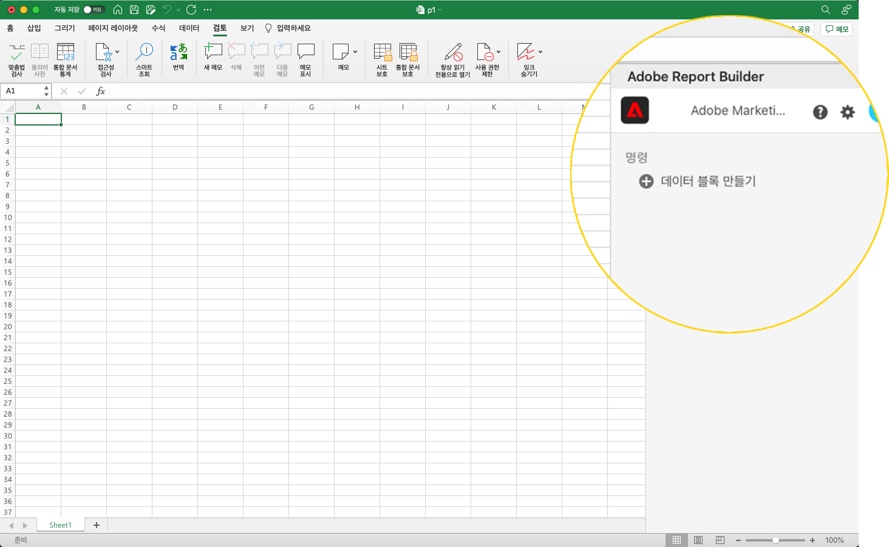
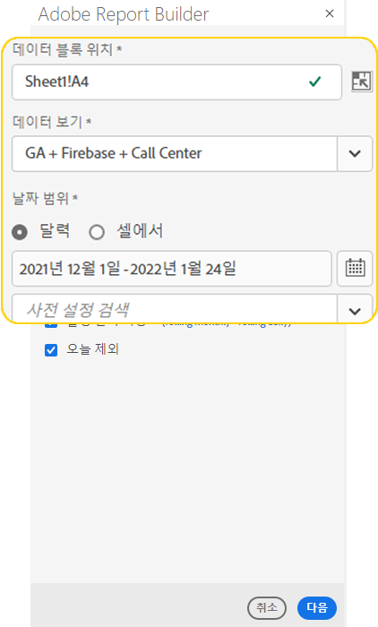
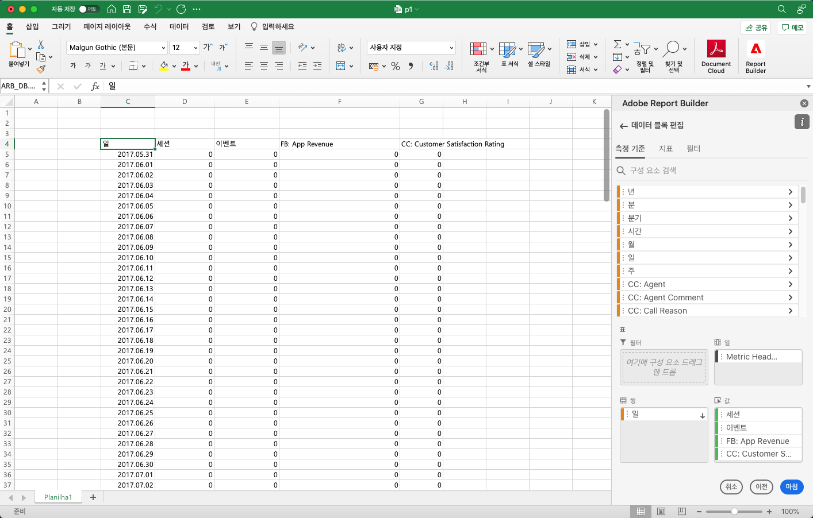
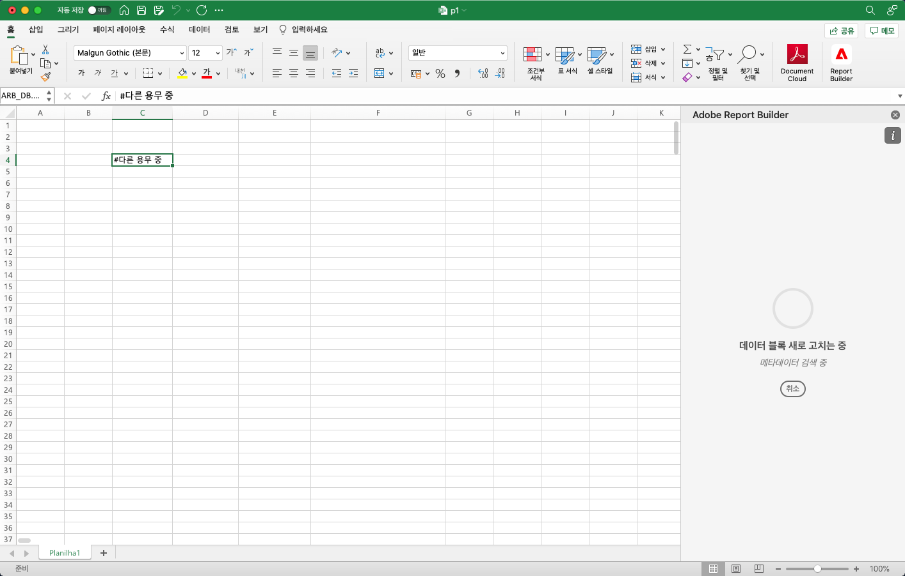
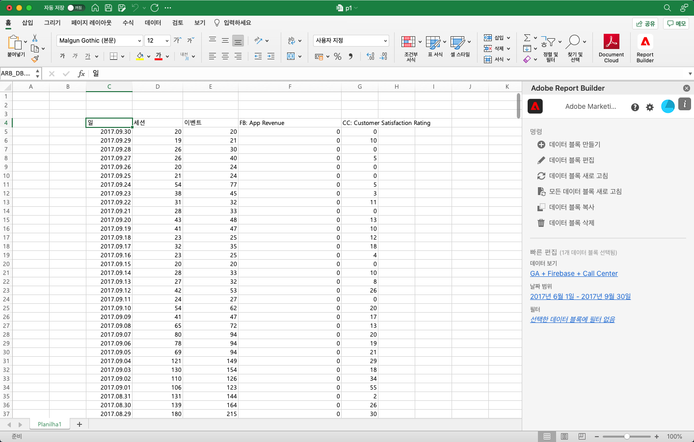

# 데이터 블록 만들기

*데이터 블록*&#x200B;은 단일 데이터 요청으로 생성된 데이터 테이블입니다. Report Builder 통합 문서에는 여러 데이터 블록이 포함될 수 있습니다. 데이터 블록을 만들 때 먼저 데이터 블록을 구성한 다음 데이터 블록을 빌드합니다.

## 데이터 블록 구성

데이터 블록 위치, 데이터 보기, 날짜 범위에 대한 초기 데이터 블록 매개 변수를 구성합니다.

1. **데이터 블록 만들기**&#x200B;를 클릭합니다.

   

1. **데이터 블록 위치**&#x200B;를 설정합니다.

   데이터 블록 위치 옵션은 Report Builder가 워크시트에 데이터를 추가하는 워크시트 위치를 정의합니다.

   데이터 블록 위치를 지정하려면 워크시트에서 단일 셀을 선택하거나 a3, \\$a3, a\\\$3 또는 sheet1!a2와 같은 셀 주소를 입력합니다. 지정된 셀은 데이터를 검색할 때 데이터 블록의 왼쪽 상단 모서리가 됩니다.

1. **데이터 보기**&#x200B;를 선택합니다.

   데이터 보기 옵션을 사용하면 드롭다운 메뉴에서 데이터 보기를 선택하거나 셀 위치에서 데이터 보기를 참조할 수 있습니다.

1. **날짜 범위**&#x200B;를 설정합니다.

   날짜 범위 옵션을 사용하면 날짜 범위를 선택할 수 있습니다. 날짜 범위는 고정되거나 순환될 수 있습니다. 데이터 범위 옵션에 대한 정보는 [날짜 범위 선택](select-date-range.md)을 참조하십시오.

1. **다음**&#x200B;을 클릭합니다.

   

   데이터 블록을 구성한 후 차원, 지표 및 필터를 선택하여 데이터 블록을 빌드할 수 있습니다. 차원, 지표 및 필터 탭은 테이블 빌더 창 위에 표시됩니다.
<!--
    
  -->

## 데이터 블록 빌드

데이터 블록을 빌드하려면 보고서 구성 요소를 선택한 다음 레이아웃을 사용자 지정합니다.

1. 차원, 지표 및 필터를 추가합니다.

   구성 요소 목록을 스크롤하거나 **검색** 필드를 사용하여 구성 요소를 찾습니다. 구성 요소를 테이블 창으로 드래그 앤 드롭하거나 목록에서 구성 요소 이름을 더블 클릭하여 구성 요소를 테이블 창에 자동으로 추가합니다.

   구성 요소를 더블 클릭하여 테이블의 기본 섹션에 추가합니다.

   - 이미 열에 차원이 있는 경우 차원 구성 요소는 행 섹션에 추가되거나 열 섹션에 추가됩니다.
   - 날짜 구성 요소가 열 섹션에 추가됩니다.
   - 필터 구성 요소가 필터 섹션에 추가됩니다.

1. 테이블 창에서 항목을 정렬하여 데이터 블록의 레이아웃을 사용자 지정합니다.

   테이블 창에서 구성 요소를 드래그 앤 드롭하여 구성 요소의 순서를 변경하거나 구성 요소 이름을 마우스 오른쪽 버튼으로 클릭하여 옵션 메뉴에서 선택합니다.

   테이블에 구성 요소를 추가하면 워크시트의 데이터 블록 위치에 데이터 블록 미리보기가 표시됩니다. 테이블에서 항목을 추가, 이동 또는 제거하면 데이터 블록 미리보기의 레이아웃이 자동으로 업데이트됩니다.

   

   **행 및 열 머리글 표시 또는 숨기기**

1. 다음을 클릭합니다. **표** 설정 아이콘.

   {width="35%"}

1. 행 및 열 머리글 표시 옵션을 선택하거나 선택 취소합니다. 기본적으로 헤더가 표시됩니다.

   **차원 레이블 및 지표 헤더 숨기기 또는 표시**

1. 차원 또는 열 헤더에서 줄임표 아이콘을 클릭하여 설정을 표시합니다.

   {width="35%"}

1. 차원 레이블이나 열 머리글을 전환하려면 숨기기 또는 표시 를 클릭합니다. 기본적으로 모든 레이블이 표시됩니다.

1. **마침**&#x200B;을 클릭합니다.

   분석 데이터를 검색하는 동안 처리 메시지가 표시됩니다.

   

   Report Builder는 데이터를 검색하고 워크시트에 완료된 데이터 블록을 표시합니다.

   
