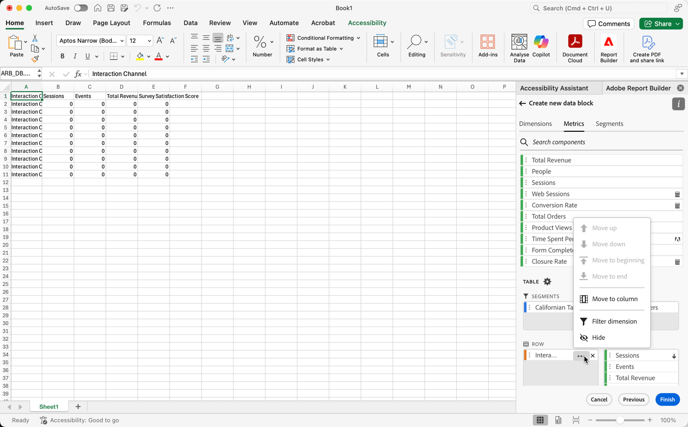
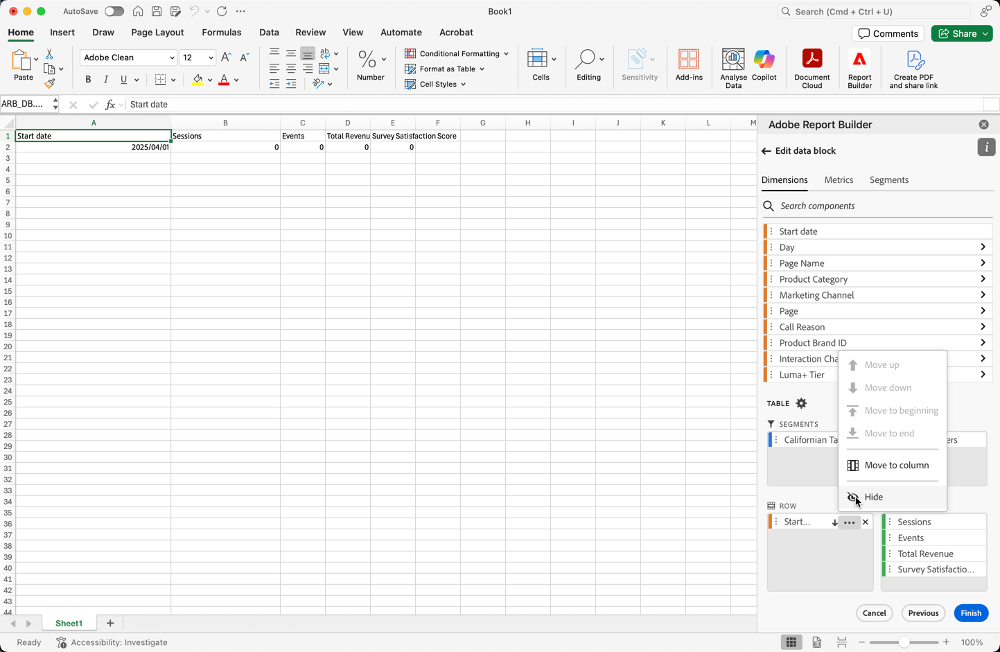

# 데이터 블록 만들기

*데이터 블록*&#x200B;은 단일 데이터 요청으로 생성된 데이터 테이블입니다. Report Builder 통합 문서에는 여러 데이터 블록이 포함될 수 있습니다. 데이터 블록을 만들 때 먼저 데이터 블록을 구성한 다음 데이터 블록을 빌드합니다.

## 데이터 블록 구성

데이터 블록 위치, 데이터 보기 및 날짜 범위에 대한 초기 데이터 블록 매개 변수를 구성합니다.

1.  **[!UICONTROL 만들기]**&#x200B;를 선택합니다.

   {zoomable="yes"}

1. **[!UICONTROL 데이터 블록 위치]**&#x200B;를 설정합니다.

   데이터 블록 위치 옵션은 Report Builder이 워크시트에 데이터를 추가하는 워크시트 위치를 정의합니다.

   데이터 블록 위치를 지정하려면 워크시트에서 단일 셀을 선택하거나 `a3`, `\\\$a3`, `a\\\$3` 또는 `sheet1!a2`과(와) 같은 셀 주소를 입력하십시오. 지정된 셀은 데이터를 검색할 때 데이터 블록의 왼쪽 상단 모서리가 됩니다.

   시트에서 현재 선택한 셀에서 데이터 블록 위치를 선택하려면 를 사용하십시오.

1. **[!UICONTROL 데이터 보기]**&#x200B;를 선택합니다.

   데이터 보기 옵션을 사용하면 드롭다운 메뉴에서 데이터 보기를 선택하거나 셀 위치에서 데이터 보기를 참조할 수 있습니다.

   셀에서 데이터 보기를 만들려면 을(를) 선택하십시오.

1. **[!UICONTROL 날짜 범위]**&#x200B;를 설정합니다.

   **[!UICONTROL 날짜 범위]** 옵션을 사용하면 날짜 범위를 선택할 수 있습니다. 날짜 범위는 고정되거나 순환될 수 있습니다.

   **[!UICONTROL 일정]**&#x200B;을(를) 선택하여 을(를) 사용하여 데이터 범위를 선택하거나 날짜 범위를 수동으로 입력하십시오. 선택적으로 **[!UICONTROL _사전 설정 검색_]** 드롭다운 메뉴에서 사전 설정을 선택할 수 있습니다.

   **[!UICONTROL 셀에서]**&#x200B;를 선택하여 현재 시트의 셀을 기반으로 시작 및 종료 데이터를 정의합니다.

   날짜 범위 옵션에 대한 자세한 내용은 [날짜 범위 선택](select-date-range.md)을 참조하세요.

1. **[!UICONTROL 다음]**&#x200B;을 선택합니다.

   ![날짜 범위 옵션과 활성 [다음] 단추를 보여주는 스크린샷입니다.](./assets/choose_date_data_view3.png)

   데이터 블록을 구성한 후 차원, 지표 및 세그먼트를 선택하여 데이터 블록을 빌드할 수 있습니다. **[!UICONTROL 차원]**, **[!UICONTROL 지표]** 및 **[!UICONTROL 세그먼트]** 탭이 **[!UICONTROL 테이블]** 창 위에 표시됩니다.

## 데이터 블록 빌드

데이터 블록을 빌드하려면 보고서 구성 요소를 선택한 다음 레이아웃을 사용자 지정합니다.

1. **[!UICONTROL 차원]**, **[!UICONTROL 지표]** 및 **[!UICONTROL 세그먼트]** 구성 요소를 추가합니다.

   구성 요소 목록을 스크롤하거나  **[!UICONTROL _구성 요소 검색_]** 필드를 사용하여 구성 요소를 찾습니다. 구성 요소를 [!UICONTROL 테이블] 창으로 드래그 앤 드롭하거나 목록에서 구성 요소 이름을 더블 선택하여 [!UICONTROL 테이블] 창에 구성 요소를 추가합니다.

   구성 요소를 더블 선택하여 테이블의 기본 섹션에 구성 요소를 추가합니다.

   - 열에 차원이 이미 있는 경우 Dimension 구성 요소가  **[!UICONTROL Row]** 섹션 또는  **[!UICONTROL Column]** 섹션에 추가됩니다.
   - 날짜 구성 요소가  **[!UICONTROL Column]** 섹션에 추가됩니다.
   - 세그먼트 구성 요소가  **[!UICONTROL 세그먼트]** 섹션에 추가됩니다.
   - 지표 구성 요소가  **[!UICONTROL 값]** 섹션에 추가됩니다.

1. 테이블 창에서 항목을 정렬하여 데이터 블록의 레이아웃을 사용자 지정합니다.

   테이블 창의 각 목록 내에 구성 요소를 드래그 앤 드롭하여 구성 요소의 순서를 변경하거나 을 선택하고 ,  아래로 이동 등을 선택하여 목록 내에서 구성 요소를 이동합니다.

   테이블에 구성 요소를 추가하면 워크시트의 데이터 블록 위치에 데이터 블록 미리보기가 표시됩니다. 테이블에서 항목을 추가, 이동 또는 제거하면 데이터 블록 미리보기의 레이아웃이 자동으로 업데이트됩니다.

   

1. 선택적으로 **[!UICONTROL 시작 날짜]**&#x200B;를 차원으로 설정하여 데이터 블록의 시작 날짜를 식별합니다. 시작 데이터를 차원으로 추가하는 것은 순환 날짜 범위가 있는 정기적으로 예약된 보고서가 있는 경우에 유용합니다. 또는 파격적인 날짜 범위가 있고 시작 날짜에 대해 명시해야 하는 경우.

   

1. 행 및 열 머리글을 표시하거나 숨깁니다(선택 사항). 이렇게 하려면 다음 작업을 수행하십시오.

   1. **[!UICONTROL 테이블]** 설정 아이콘을 선택합니다.

      

   1. **[!UICONTROL 행 및 열 머리글 표시]** 옵션을 선택하거나 선택 취소합니다. 기본적으로 헤더가 표시됩니다.

1. 선택적으로 차원 레이블과 지표 헤더를 숨기거나 표시할 수도 있습니다. 이렇게 하려면 다음 작업을 수행하십시오.

   1. 차원 레이블 또는 열 헤더에서 을 선택하여 컨텍스트 메뉴를 표시합니다.

      

   1. 차원 레이블 또는 열 머리글을 전환하려면  **[!UICONTROL Hide]** 또는  **[!UICONTROL Show]**&#x200B;를 선택합니다. 기본적으로 모든 레이블이 표시됩니다.

1. **[!UICONTROL 완료]**&#x200B;를 선택하여 데이터 블록 구성을 완료합니다.

1. 분석 데이터를 검색하는 동안 처리 메시지 **[!UICONTROL #BUSY]**&#x200B;이(가) 표시됩니다.

   

1. Report Builder는 데이터를 검색하고 워크시트에 완료된 데이터 블록을 표시합니다.

   

>[!MORELIKETHIS]
>
>[데이터 보기 선택](select-data-view.md)
>[날짜 범위 선택](select-date-range.md)
>[차원 필터링](filter-dimensions.md)
>[세그먼트 작업](work-with-filters.md)
>
