# 차원 필터링

기본적으로 테이블의 각 차원 항목은 해당 차원에 대한 상위 10개 항목을 반환합니다.

각 차원에 대해 반환된 차원 항목을 변경하려면

1. 데이터 블록을 선택하고 명령 패널에서 데이터 블록 편집을 클릭합니다.

1. 다음 을 클릭하여 Dimension 탭을 표시합니다.

1. **..테이블의 구성 요소 이름 옆에 있는** 아이콘.

   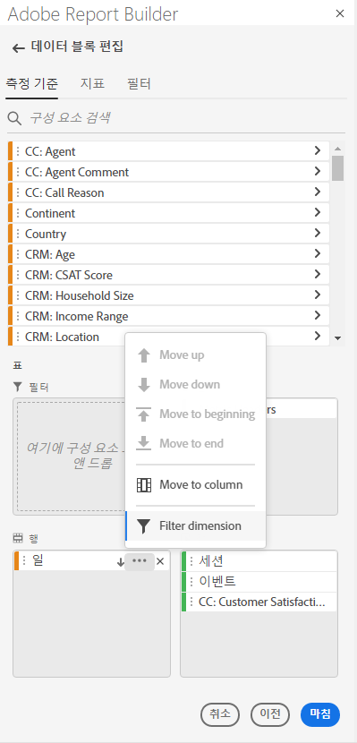

1. 팝업 메뉴에서 **필터 차원**&#x200B;을 선택하여 **필터 차원** 창을 표시합니다.

1. **가장 빈도가 높음** 또는 **특정**&#x200B;을 선택합니다.

   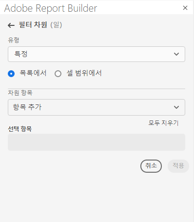

1. 선택한 필터 유형에 따라 적절한 옵션을 선택합니다.

1. **적용**&#x200B;을 클릭하여 필터를 추가합니다.

   Report Builder에 추가된 필터를 확인하는 알림이 표시됩니다.

적용된 필터를 표시하려면 차원을 마우스로 가리킵니다. 필터가 적용된 Dimension은 Dimension 이름 오른쪽에 필터 아이콘을 표시합니다.

## 필터 유형

차원 항목을 필터링하는 방법에는 두 가지가 있습니다. 가장 인기 있고 특이합니다.

## 추천

가장 자주 사용하는 옵션을 사용하면 지표 값을 기반으로 차원 항목을 동적으로 필터링할 수 있습니다. 가장 자주 사용하는 필터링은 지표 값을 기반으로 가장 높은 등급 차원 항목을 반환합니다. 기본적으로 처음 10개 차원 항목이 나열되며 데이터 블록에 추가된 첫 번째 지표로 정렬됩니다.

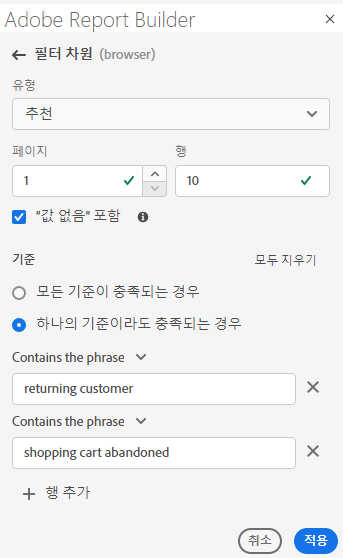

### 페이지 및 행 옵션

**Page** 및 **행** 필드를 사용하여 데이터를 순차적 그룹 또는 페이지로 나눕니다. 이를 통해 최상위 값 이외의 등급 행 값을 보고서에 가져올 수 있습니다. 이 기능은 50,000개 행 제한을 넘어 데이터를 가져오는 데 특히 유용합니다.

#### 페이지 및 행 기본값

- 페이지 = 1
- 행 = 10

페이지 및 행 기본 설정은 각 페이지에 10개의 데이터 행이 있음을 식별합니다. 페이지 1은 상위 10개 항목을 반환하고, 페이지 2는 다음 10개 항목을 반환하는 등

아래 표에는 페이지 및 행 값의 예와 결과 출력의 예가 나와 있습니다.

| 페이지 | 행 | 출력 |
|------|--------|----------------------|
| 1 | 10 | 상위 10개 항목 |
| 2 | 10 | 품목 11-20 |
| 1 | 100 | 상위 100개 항목 |
| 2개 | 100년 | 품목 101-200 |
| 2개 | 50,000 | 품목 50,001-100,000 |

#### 최소값 및 최대값

- 페이지 시작: Min = 1, 최대: 5,000만
- 행 수: Min = 1, 최대: 50,000

### 값 없음 포함

Customer Journey Analytics에서 일부 차원은 &quot;값 없음&quot; 항목을 수집합니다. 이 필터를 사용하면 보고서에서 이 값을 제외할 수 있습니다. 예를 들어 제품 SKU 키를 기반으로 제품 이름 분류와 같은 분류를 만들 수 있습니다. 특정 제품 SKU가 특정 제품 이름 분류로 설정되지 않은 경우 해당 제품 이름 값이 &quot;값 없음&quot;으로 설정됩니다.

기본적으로 &quot;**값**&quot;이 선택되어 있지 않습니다. 값이 없는 항목을 제외하려면 이 옵션을 선택 취소합니다.

### 기준별 필터링

모든 기준을 충족하는지 또는 기준을 충족하는지 여부에 따라 차원 항목을 필터링할 수 있습니다.

필터링 기준을 설정하려면 다음을 수행하십시오

1. 드롭다운 목록에서 연산자를 선택합니다.

   

1. 검색 필드에 값을 입력합니다.

1. 행 추가 를 클릭하여 선택 항목을 확인하고 다른 기준 항목을 추가합니다.

1. 기준 항목을 제거하려면 삭제 아이콘을 클릭하십시오.

   최대 10개의 기준 항목을 포함할 수 있습니다.

### 필터 및 정렬 순서 변경

데이터 블록을 필터링하고 정렬하는 데 사용되는 지표 옆에 화살표가 나타납니다. 화살표의 방향은 지표가 가장 큰 지표에서 가장 큰 지표인지 또는 가장 큰 지표인지를 나타냅니다.

정렬 방향을 변경하려면 지표 옆에 있는 화살표를 클릭합니다. 

데이터 블록을 필터링하고 정렬하는 데 사용되는 지표를 변경하려면,

1. 추가 옵션을 표시하려면 테이블 빌더에서 원하는 지표 구성 요소를 마우스로 가리킵니다.

2. 기본 설정 지표의 화살표를 클릭합니다. 

   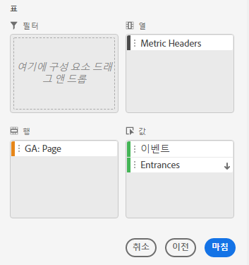

## 특정 필터링

특정 옵션을 사용하면 각 차원에 대한 고정 차원 항목 목록을 만들 수 있습니다. 필터에 포함할 정확한 차원 항목을 지정하려면 **Specific** 필터링 유형을 사용합니다. 목록 또는 셀 범위에서 항목을 선택할 수 있습니다.

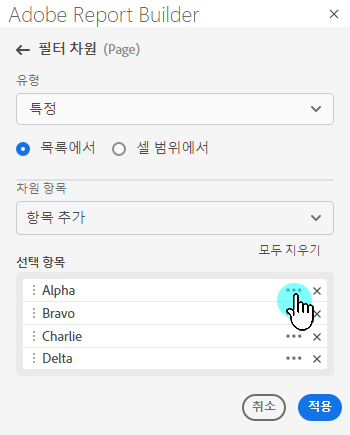

### 목록에서

1. **목록에서** 옵션을 선택하여 차원 항목을 검색하고 선택합니다.

   **목록에서** 옵션을 선택하면 목록이 가장 많은 이벤트를 먼저 포함하는 차원 항목으로 채워집니다.

   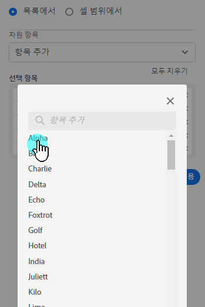

   **사용 가능한 항목** 목록은 이벤트가 가장 많은 차원 항목에서 가장 적은 항목순으로 정렬됩니다.

1. **항목 추가** 필드에 검색어를 입력하여 목록을 검색합니다.

1. 최근 90일 동안의 데이터에 포함되지 않은 항목을 검색하려면 **최근 6개월 항목 표시**&#x200B;를 클릭하여 검색을 확장합니다.

   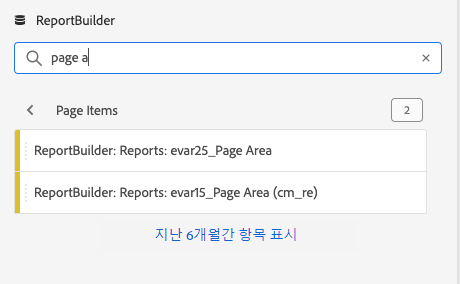

   지난 6개월의 데이터가 로드되면 Report Builder이 지난 18개월 동안의 항목 표시&#x200B;**로 링크를 업데이트합니다.**

1. 차원 항목을 선택합니다.

   선택한 차원 항목이 자동으로 **선택한 항목** 목록에 추가됩니다.

   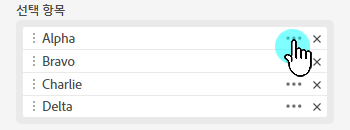

   목록에서 항목을 삭제하려면 삭제 아이콘을 클릭하여 목록에서 항목을 제거합니다.

   목록에서 항목을 이동하려면 항목을 끌어다 놓거나... 를 클릭하여 이동 메뉴를 표시합니다.

   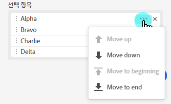

1. **적용**&#x200B;을 클릭합니다

   Report Builder은 사용자가 적용한 특정 필터링을 표시하도록 목록을 업데이트합니다.

### 셀 범위에서

일치하는 차원 항목 목록을 포함하는 셀 범위를 선택하려면 **셀 범위에서** 옵션을 선택합니다.

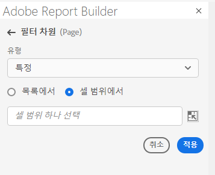

셀 범위를 선택할 때는 다음 제한 사항을 고려하십시오.

- 범위에 하나 이상의 셀이 있어야 합니다.
- 범위에 50,000개 이상의 셀이 있을 수 없습니다.
- 범위는 단일 중단되지 않은 행 또는 열에 있어야 합니다.

선택 사항에는 빈 셀이나 특정 차원 항목과 일치하지 않는 값이 있는 셀이 포함될 수 있습니다.

### 테이블 빌더의 Dimension 탭에서 다음을 수행합니다

**Dimension** 탭에서 차원 이름 옆에 있는 V자 모양 아이콘을 클릭하여 차원 항목 목록을 확인합니다.

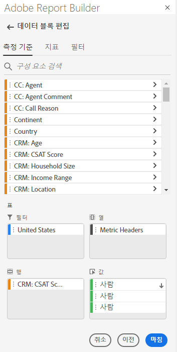

항목을 **테이블**&#x200B;에 끌어다 놓거나 항목 이름을 두 번 클릭하여 **테이블** 빌더에 추가할 수 있습니다.
