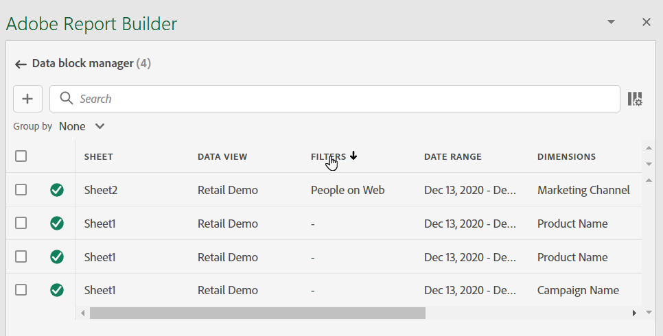
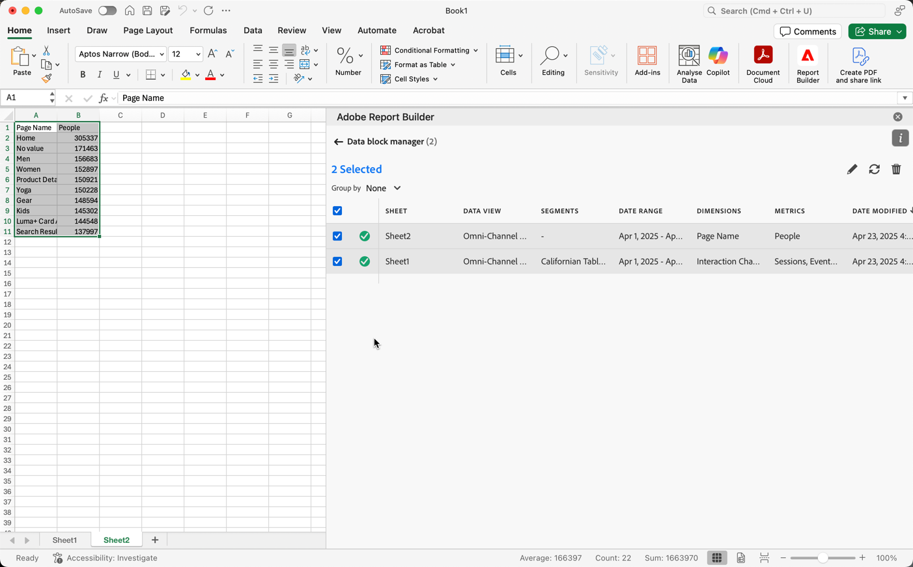
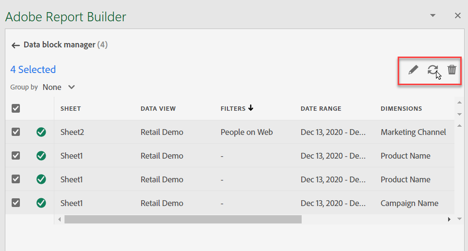

# Report Builder의 데이터 블록 관리

데이터 블록 관리자를 사용하여 통합 문서의 모든 데이터 블록을 보고 관리할 수 있습니다. 데이터 블록 관리자는 특정 데이터 블록을 신속하게 찾을 수 있는 검색, 필터링 및 정렬 기능을 제공합니다. 하나 이상의 데이터 블록을 선택한 후 선택한 데이터 블록을 편집, 삭제 또는 새로 고칠 수 있습니다.

## 데이터 블록 보기

클릭 **관리** 통합 문서에 있는 모든 데이터 블록 목록을 보려면

데이터 블록 관리자는 통합 문서에 있는 모든 데이터 블록을 나열합니다. 

## 데이터 블록 목록 정렬

표시된 열별로 데이터 차단 목록을 정렬할 수 있습니다. 예를 들어 보고서 세트, 필터, 날짜 범위 및 기타 변수별로 데이터 차단 목록을 정렬할 수 있습니다.

데이터 차단 목록을 정렬하려면 열 제목을 클릭합니다.

## 데이터 차단 목록 검색

검색 필드를 사용하여 데이터 블록 테이블에서 모든 항목을 찾습니다. 예를 들어 데이터 블록이나 보고서 세트에 포함된 지표를 검색할 수 있습니다. 날짜 범위, 수정한 날짜 또는 마지막 실행 날짜 열에 표시되는 날짜를 검색할 수도 있습니다.

## 데이터 블록 편집

데이터 보기, 날짜 범위 또는 하나 이상의 데이터 블록에 적용된 필터를 편집할 수 있습니다.

예를 들어 기존 필터를 하나 이상의 데이터 블록에서 새 필터로 바꿀 수 있습니다.

1. 업데이트할 데이터 블록을 선택합니다. 최상위 확인란을 선택하여 모든 데이터 블록을 선택하거나 개별 데이터 블록을 선택할 수 있습니다.

   

1. 편집 아이콘을 클릭하여 빠른 편집 창을 표시합니다.

   

1. 필터 링크를 선택하여 데이터 보기, 날짜 범위 또는 필터를 업데이트합니다.

   

## 데이터 블록 새로 고침

새로 고침 아이콘을 클릭하여 목록의 데이터 블록을 새로 고칩니다.

데이터 블록을 새로 고치는지 확인하려면 새로 고침 상태 아이콘을 확인합니다. 녹색 원의 확인 표시  데이터 블록 새로 고침이 성공했음을 나타냅니다. 새로 고치지 못한 데이터 블록에 경고 아이콘이 표시됩니다 .  이를 통해 데이터 블록에 오류가 있는지 쉽게 식별할 수 있습니다.

## 데이터 블록 삭제

선택한 데이터 블록을 삭제하려면 휴지통 아이콘을 클릭하십시오.

## 그룹 데이터 블록

를 사용하여 데이터 블록을 그룹화할 수 있습니다 **그룹화 기준** 드롭다운 메뉴 또는 열 제목을 클릭할 수 있습니다. 데이터 블록을 열별로 정렬하려면 열 제목을 클릭합니다. 데이터 블록을 그룹별로 그룹화하려면 **그룹화 기준** 드롭다운 메뉴 예를 들어 아래 스크린샷은 시트로 그룹화된 데이터 블록을 보여줍니다. Sheet1과 Sheet2로 그룹화된 데이터 블록을 표시합니다.  이 기능은 예를 들어 필터 대체 사용 사례에서 유용합니다. 각 데이터 블록에 여러 개의 필터가 적용된 경우, 바꾸려는 모든 데이터 블록이 들어 있는 그룹을 만드는 것이 도움이 됩니다. 그런 다음 한 번에 쉽게 선택하고 편집할 수 있습니다.

## 데이터 블록 관리자 보기 수정

데이터 블록 관리자 창에 표시되는 열을 수정할 수 있습니다.

열 목록을 클릭합니다  아이콘을 클릭하여 데이터 블록 관리자에 나열되는 열을 선택합니다. 열을 표시할 열 이름을 선택합니다. 열에서 열을 제거하려면 열 이름을 선택 취소합니다.

