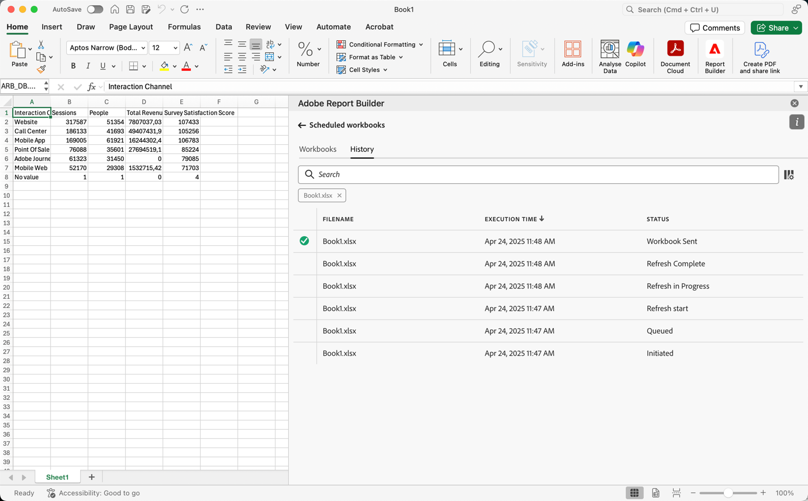

# 예약된 통합 문서 관리

다음 문서에 설명된 대로 이메일을 통해 공유하거나 클라우드 대상으로 내보내는 방식으로 통합 문서를 예약할 수 있습니다.

* [이메일을 통해 공유하여 통합 문서 예약](/help/report-builder/schedule-reportbuilder.md)

* [클라우드 대상으로 내보낼 통합 문서 예약](/help/report-builder/report-builder-export.md)

다음 섹션에서는 통합 문서가 예약된 후 통합 문서를 관리하는 방법을 설명합니다.

## 예약된 통합 문서 보기 및 관리

**[!UICONTROL 통합 문서]** 탭에서 모든 예약된 통합 문서를 보고 관리할 수 있습니다.

1. Report Builder 허브에서 **[!UICONTROL 일정]** 선택

1. **[!UICONTROL 통합 문서]** 탭을 선택합니다. 모든 예약된 통합 문서 목록이 표시됩니다.

   {zoomable="yes"}

   아이콘 위로 마우스를 가져가 예약된 통합 문서의 상태를 확인할 수 있습니다.

   을 사용하여 예약된 특정 통합 문서를 검색합니다.
표시할 열을 정의하려면 을(를) 사용하십시오.

1. 통합 문서를 하나 이상 선택합니다.

   {zoomable="yes"}

   다음 옵션을 사용할 수 있습니다.

   | 옵션 | 설명 |
   |---|---|
   |  | 선택한 통합 문서의 일정을 편집합니다. |
   |  | 선택한 통합 문서의 내역을 표시합니다. |
   |  | 선택한 통합 문서의 일정을 일시 중지합니다. |
   |  | 선택한 통합 문서의 일정을 다시 시작합니다. |
   |  | 선택한 통합 문서를 새 통합 문서로 다운로드합니다. |
   |  | 선택한 통합 문서의 일정을 삭제합니다. |

## 예약된 통합 문서의 내역 및 상태

**[!UICONTROL 기록]** 탭에서 예약된 통합 문서의 기록 및 상태를 볼 수 있습니다.

1. Report Builder 허브에서 **[!UICONTROL 일정]**&#x200B;을(를) 선택하십시오.

1. **[!UICONTROL 기록]** 탭을 선택합니다. 모든 예약된 통합 문서 목록이 표시됩니다.

   {zoomable="yes"}

   목록에서 특정 통합 문서를 검색하려면 을(를) 사용하십시오.
표시할 열을 정의하려면 을(를) 사용하십시오.

   **[!UICONTROL 기록]** 탭에서 예약된 각 작업의 상태를 검토할 수 있습니다. 각 예약된 작업에 대한 상태 변경 내용은 별도의 행에 설명되어 있습니다.

   * 은 통합 문서가 성공적으로 전송되었음을 나타냅니다.
   * 은(는) 오류가 발생했음을 나타냅니다.

또는 **[!UICONTROL 통합 문서]** 탭에서 하나 이상의 선택한 통합 문서에 대해 을 선택할 수 있습니다. 이 작업은 선택한 항목별로 필터링된 목록이 있는 **[!UICONTROL 기록]** 탭을 표시합니다. 필터를 제거하려면 을(를) 선택하십시오.
