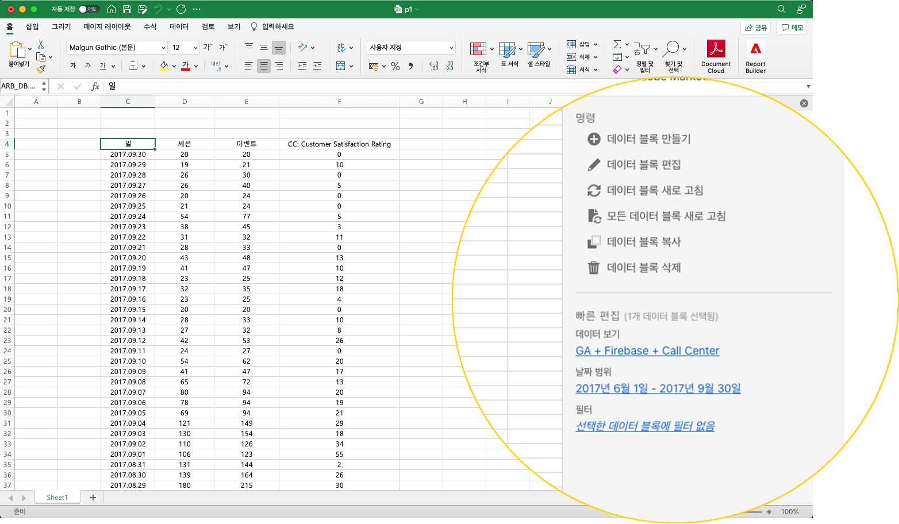

# Report Builder 허브

Report Builder 허브를 사용하여 데이터 블록을 생성, 업데이트 또는 삭제합니다.

Report Builder 허브에는 명령과 빠른 편집 패널이 포함되어 있습니다.



## 명령 패널

[명령] 패널을 사용하여 선택한 셀이나 이전 작업과 호환되는 명령에 액세스합니다.


### 명령

| 표시된 명령 | 사용 가능한 시기.. | 용도 |
|------|------------------|--------|
| 데이터 블록 만들기 | 통합 문서에서 셀을 하나 이상 선택합니다. | 데이터 블록을 만드는 데 사용됩니다. |
| 데이터 블록 편집 | 선택한 셀 또는 셀 범위는 하나의 데이터 블록에만 포함됩니다. | 데이터 블록을 편집하는 데 사용됩니다. |
| 데이터 블록 새로 고침 | 선택 영역에 하나 이상의 데이터 블록이 포함되어 있습니다. 명령은 선택 영역의 데이터 블록만 새로 고칩니다. | 하나 이상의 데이터 블록을 새로 고치는 데 사용됩니다. |
| 모든 데이터 블록 새로 고침 | 통합 문서에는 하나 이상의 데이터 블록이 포함되어 있습니다. | 통합 문서에서 모든 데이터 블록을 새로 고치는 데 사용됩니다. |
| 데이터 블록 복사 | 선택한 셀 또는 셀 범위는 하나 이상의 데이터 블록의 일부입니다. | 데이터 블록을 복사하는 데 사용됩니다. |
| 데이터 블록 삭제 | 선택한 셀 또는 셀 범위는 하나의 데이터 블록에만 포함됩니다. | 데이터 블록을 삭제하는 데 사용됩니다. |

## 빠른 편집 패널

스프레드시트에서 하나 이상의 데이터 블록을 선택하면 Report Builder에 빠른 편집 패널이 표시됩니다. 빠른 편집 패널을 사용하여 단일 데이터 블록의 매개 변수를 변경하거나 여러 데이터 블록의 매개 변수를 동시에 변경할 수 있습니다.


빠른 편집 섹션을 사용하여 변경한 내용은 선택한 모든 데이터 블록에 적용됩니다.

### 데이터 보기

데이터 블록은 선택한 데이터 보기에서 데이터를 가져옵니다. 워크시트에 여러 데이터 블록을 선택하고 동일한 데이터 보기에서 데이터를 가져오지 않는 경우 **데이터 보기** 링크에 *다중*&#x200B;이 표시됩니다.

데이터 보기를 변경하면 선택 영역의 모든 데이터 블록이 새 데이터 보기를 채택합니다. 데이터 블록의 구성 요소는 ID를 기반으로 새 데이터 보기에 일치됩니다(예: ```evars``` 일치). 구성 요소가 데이터 블록에 없으면 경고 메시지가 표시되고 구성 요소가 데이터 블록에서 제거됩니다.

데이터 보기를 변경하려면 드롭다운 메뉴에서 새 데이터 보기를 선택합니다.


### 날짜 범위

**날짜** 범위: 선택한 데이터 블록의 날짜 범위를 표시합니다. 여러 날짜 범위가 있는 여러 데이터 블록을 선택한 경우 **날짜 범위** 링크에 *복수*&#x200B;가 표시됩니다.

### 필터

**필터** 링크는 선택한 데이터 블록에서 사용하는 필터의 요약 목록을 표시합니다. 여러 필터가 적용된 여러 개의 데이터 블록을 선택한 경우 **필터** 링크에 *다중*&#x200B;이 표시됩니다.
