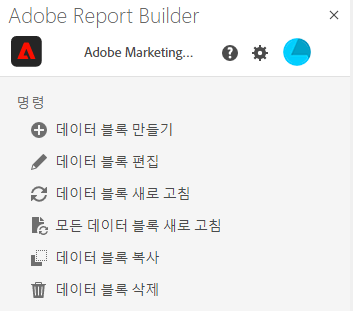

# Report Builder 허브

Report Builder 허브를 사용하여 데이터 블록을 만들거나 업데이트하거나 삭제하거나 관리합니다.

Report Builder 허브에는 생성 및 관리 버튼, 명령 목록과 빠른 편집 패널이 있습니다.


## 생성 및 관리 버튼

생성 또는 관리 버튼을 사용하여 새 데이터 블록을 만들거나 기존 데이터 블록을 관리합니다.

## 명령 패널

명령 패널을 사용하여 선택한 셀 또는 이전 작업과 호환되는 명령에 액세스합니다.



### 명령

| 표시된 명령 | 사용 가능한 경우... | 용도 |
|------|------------------|--------|
| 데이터 블록 만들기 | 통합 문서에서 하나 이상의 셀이 선택되었습니다. | 데이터 블록 만들기에 사용 |
| 데이터 블록 편집 | 선택한 셀 또는 셀 범위는 하나의 데이터 블록에만 속합니다. | 데이터 블록 편집에 사용 |
| 데이터 블록 새로 고침 | 선택 항목에 하나 이상의 데이터 블록이 포함되어 있습니다. 이 명령은 선택 항목의 데이터 블록만 새로 고칩니다. | 하나 이상의 데이터 블록을 새로 고치는 데 사용 |
| 모든 데이터 블록 새로 고침 | 통합 문서에는 하나 이상의 데이터 블록이 있습니다. | 통합 문서의 모든 데이터 블록을 새로 고치는 데 사용 |
| 데이터 블록 복사 | 선택한 셀 또는 셀 범위가 하나 이상의 데이터 블록의 일부입니다. | 데이터 블록 복사에 사용 |
| 데이터 블록 삭제 | 선택한 셀 또는 셀 범위는 하나의 데이터 블록에만 속합니다. | 데이터 블록 삭제에 사용 |

## 빠른 편집 패널

스프레드시트에서 하나 이상의 데이터 블록을 선택하면 Report Builder가 빠른 편집 패널을 표시합니다. 빠른 편집 패널을 사용하여 단일 데이터 블록의 매개변수를 변경하거나 동시에 여러 데이터 블록의 매개변수를 변경할 수 있습니다.


빠른 편집 섹션을 사용하여 변경한 사항은 선택한 모든 데이터 블록에 적용됩니다.

### 데이터 보기

데이터 블록은 선택한 데이터 보기에서 데이터를 가져옵니다. 워크시트에서 여러 데이터 블록이 선택되어 있고 동일한 데이터 보기에서 데이터를 가져오지 않는 경우 **데이터 보기** 링크에 *다중*&#x200B;이 표시됩니다.

데이터 보기를 변경하면 선택 항목의 모든 데이터 블록에 새 데이터 보기가 적용됩니다. 데이터 블록의 구성 요소는 ID를 기반으로 새 데이터 보기와 일치합니다(예: ```evars```와 일치). 데이터 블록에서 구성 요소를 찾을 수 없으면 경고 메시지가 표시되고 구성 요소가 데이터 블록에서 제거됩니다.

데이터 보기를 변경하려면 드롭다운 메뉴에서 새 데이터 보기를 선택합니다.


### 날짜 범위

**날짜 범위**&#x200B;는 선택한 데이터 블록의 날짜 범위를 보여 줍니다. 여러 날짜 범위가 있는 여러 데이터 블록을 선택한 경우 **날짜 범위** 링크에 *다중*&#x200B;이 표시됩니다.

### 필터

**필터** 링크는 선택한 데이터 블록에서 사용하는 필터의 요약 목록을 표시합니다. 여러 필터가 적용된 여러 데이터 블록을 선택한 경우 **필터** 링크에 *다중*&#x200B;이 표시됩니다.
