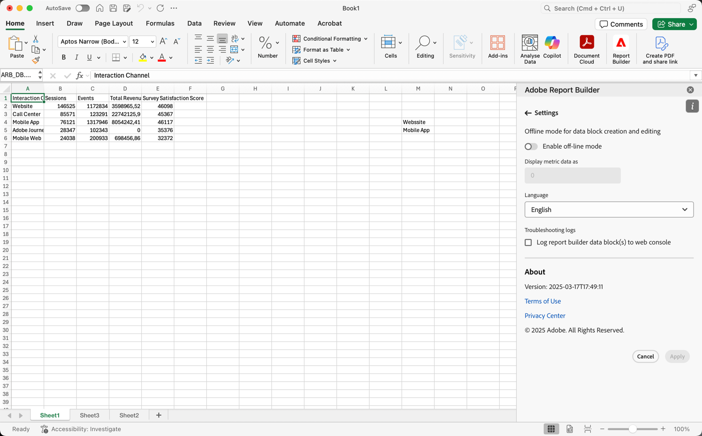

# Report Builder 설정

**설정** 창을 사용하여 UI에 표시되는 언어 또는 오프라인 모드에서 작동할지 여부와 같은 애플리케이션 수준 설정을 구성합니다. 설정은 즉시 적용되며 변경될 때까지 이후의 모든 세션에 대해 설정됩니다.

Report Builder 설정을 변경하려면

1. **설정** 아이콘을 선택하십시오.

1. [오프라인 모드 사용 안 함](#off-line-mode), [언어 선택](#language) 또는 [문제 해결 사용](#troubleshooting)을 변경합니다.

1. **[!UICONTROL 적용]**&#x200B;을 선택합니다.

   {zoomable="yes"}

## 오프라인 모드

오프라인 모드에서 데이터 블록을 만들고 편집할 때 데이터가 검색되지 않습니다. 대신 시뮬레이션 데이터가 사용되므로 요청이 실행될 때까지 기다리지 않고 빠르게 작업할 수 있습니다. 다시 온라인 상태가 되면  **[!UICONTROL 데이터 블록 새로 고침]** 또는  **[!UICONTROL 모든 데이터 블록 새로 고침]**&#x200B;을 선택하여 데이터 블록을 실제 데이터로 새로 고칩니다.

오프라인 모드를 활성화하려면

1. 을 선택합니다.

1. **[!UICONTROL 오프라인 모드 사용]**&#x200B;을 설정합니다.

1. **[!UICONTROL 지표 데이터 표시]** 필드에 양의 정수를 입력하십시오.

1. **[!UICONTROL 적용]**&#x200B;을 선택합니다.

## 언어

Report Builder 인터페이스의 언어를 선택할 수 있습니다. 지원되는 모든 Customer Journey Analytics 언어를 사용할 수 있습니다.

Report Builder 인터페이스에 사용되는 언어를 선택하려면 다음을 수행하십시오.

1. **[!UICONTROL 언어]** 드롭다운 메뉴에서 언어를 선택합니다.

1. **적용.** 선택

## 문제 해결

**[!UICONTROL 문제 해결 로그]** 설정은 모든 클라이언트/서버 데이터를 로컬 파일에 기록합니다. 이 옵션을 사용하면 지원 티켓을 해결하는 데 도움이 됩니다.

문제 해결 로그를 사용하려면 **[!UICONTROL 로컬 파일에 Report Builder 요청 기록]**&#x200B;을 확인하십시오.
